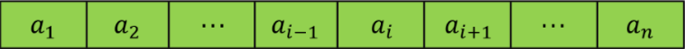
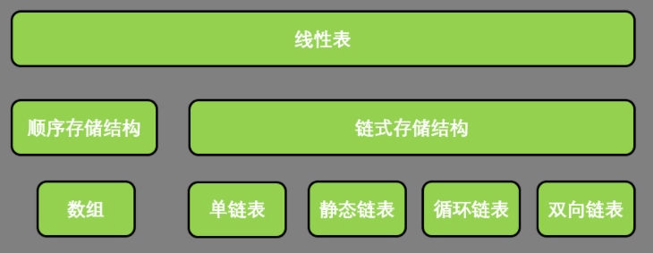

# 一、绪论

## 1、基本概念

数据：所有能输入到计算机中并被计算机程序处理的符号的总称

数据元素：数据的基本单位，也称为元素，结点，记录等

数据项：组成数据元素的最小单位

数据对象：数据元素的集合

数据结构：相互之间存在一种或多种特定关系的数据元素的集合

逻辑结构：集合结构，线性结构，树结构，图结构

存储结构：顺序存储结构，链式存储结构

数据类型：一个值的集合和定义在这个值集上的一组操作的总称

抽象数据类型：一般指由用户定义的，表示应用问题的数学模型，

以及定义在这个模型上的一组操作的总称，具体包括数据对象，数据对象上关系的集合，以及对数据对象的基本操作的集合。

## 2、算法的时间空间的复杂度

算法特性：有穷性，确定性，可行性，输入，输出

评判标准：正确性，可读性，健壮性，高效性

时间空间复杂度

即评判算法是否高效。

语句的频度：一个语句的重复执行次数

算法的执行时间T(n)：所有语句频度的和

算法的时间复杂度：$当\lim_{x\rightarrow \infty}T(n)/n^k=c(c为常数)$有`T(n)`的数量级`T(n)=O(n^k)`称为 算法的渐进时间复杂度，简称时间复杂度。$n^k$一般由最深层次循环内的语句频度确定

算法时间复杂度就是求最内层循环的语句频度，往往可以从内向外求。

时间复杂度数量级递增排列：常数阶$O(1)$,对数阶$O(log_{2}n)$,线性阶$O(n)$,线性对数阶$O(nlog_{2}n)$及以上的k次方阶算法的空间复杂度：所用的辅助存储空间对问题规模n的数量级

# 二、线性表

## 1、基本概念

### 什么是线性表

由**零个**或**多个**数据元素组成的有限序列

- 首先它是一个序列，也就是说元素之间是有先来后到之分。
- 若元素存在多个，则第一个元素无前驱，而最后一个元素无后继，其他元素都有且只有一个前驱和后继。
- 线性表强调是有限的，事实上无论计算机发展到多强大，他所能处理的元素都是有限的。

### 线性表的形式化定义

若将线性表记为   $(a_1,\cdot\cdot\cdot,a_{i-1},a_{i},a_{i+1},\cdot\cdot\cdot,a_n)$   ,那么  $a_{i-1}$  领先于 $a_{i}$  ， $a_{i}$  领先于 $a_{i+1}$  ，$a_{i-1}$ 是  $a_{i}$  的直接先驱元素， $a_{i+1}$   是  $a_{i}$  的直接后继元素



因此线性表的个数$n(n>=0)$定义为线性表的长度，当$n=0$ 时该线性表被称为`空表`

### 线性表的分类



### 什么是抽象数据类型

**抽象**：是指抽取出事物具有的普遍性的本质。他要求抽出问题的特征而忽略非本质的细节，是对具体事物的一个概括。抽象是一种思考问题的方式，它隐藏了繁杂的细节。

**数据类型：** 是指一组性质相同的值的集合及定义在此集合上的一些操作的总称。

在C语言中，按照取值的不同，数据类型可以分为两类：

1. - 原子类型：不可以再分解的基本类型，例如整型、浮点型、字符型等等。
   - 结构类型：由若干个类型组合而成，是可以再分解的，例如整型数组是由若干整型数据组成的。

**抽象数据类型**（`Abstract Data Type，ADT`）： 是指一个数据模型及定义在该模型上的一组操作，就相当于高级语言当中类的概念。


描述抽象数据类型的标准格式:

```c

ADT 抽象数据类型
Data
   数据元素之间逻辑关系的定义
Operation
   操作
endADT
```

### 线性表的抽象数据类型

```c
ADT 线性表（List）
Data
   线性表的数据对象集合为{$a_1$,$a_2$,...,$a_n$},每个元素的类型均为DataType。其中，除第一个元素$a_1$外，每个元素有且只有一个直接前驱元素，除了最后一个元素$a_n$外，每一个元素有且只有一个直接后继元素。数据元素之间的关系是一对一的关系。
Operation
   InitList(*L):初始化操作，建立一个空的线性表L
   ListEmpty(L):判断线性表是否为空表，若线性表为空表，返回true，否则返回false
   ClearList(*L):将线性表清空。
   GetElem(L,i,*e):将线性表L中的第i个位置的元素返回给e
   LocateElem(L,e):在线性表L中查找与给定值e相等的元素，如果查找成功，返回该元素在表中序号表示成功；否则，返回0表示失败
   ListInsert(*L,i,e):在线性表L中第i个位置插入新元素e
   ListDelete(*L,i,*e):删除线性表L中第i个位置元素，并用e返回其值
   ListLength(L):返回线性表L的元素个数
endADT
```

## 2、线性表存储结构有哪些

线性表有两种物理存储结构：`顺序存储结构`和`链式存储结构`。

### 线性表的顺序存储结构

指的是用一段地址连续的存储单元依次存储线性表的数据元素。

 $(a_1,\cdot\cdot\cdot,a_{i-1},a_{i},a_{i+1},\cdot\cdot\cdot,a_n)$

物理上的存储方式事实上就是在内存中找个初始地址，然后通过占位的形式，把一定的内存空间给占了，然后把相同数据类型的数据元素依次放在这块空地中。

顺序存储结构封装需要的三个属性：

- a、存储空间的起始位置，数组data存储位置就是线性表存储空间的起始位置。

- b、线性表的最大存储容量：数组的长度`MAXSIZE`

- c、线性表的当前长度：`length`

> 数组的长度和线性表的当前长度需要区分一下：数组长度是存放线性表的存储空间的总长度，一般初始化后不变。而线性表的当前长度是线性表中元素的个数，是会变化的。
>
> 数组是从0开始的计算方法

### 线性表的链式存储结构

特点就是用一组任意的存储单元存储线性表的数据元素，这组存储单元可以在内存中未被占用的任意位置。

比起顺序存储结构每个元素只需要存储一个位置就可以了。现在链式存储结构中，除了要存储数据信息外，还要存储它的后继元素的存储地址（指针）。

也就是说除了存储其本身的信息外，还需要存储一个指示其直接后继的存储位置的信息。

概念：把存储数据元素信息的域称为`数据域`，把存储直接后继位置的域称为`指针域`。指针域中存储的信息称为`指针`或`链`。这两部分信息组成数据元素称为`存储映像`，称为`结点（Node)`

$n$  个节点连接成一个链表，即为线性表 $(a_1,\cdot\cdot\cdot,a_{i-1},a_{i},a_{i+1},\cdot\cdot\cdot,a_n)$的链式存储结构。

而链表还分为`单链表`和`双链表`,我会在后续笔记中详细介绍

## 3、顺序存储结构

### 获取一个元素

```
#include <stdio.h>

/*全局数据定义*/
#define MAX_SIZE 8
#define SUCCESS 1
#define ERROR 0
#define TRUE 1
#define FALSE 0

/*typedef关键字可以使用它来为类型取一个新的名字*/
typedef int Status;
/*获取一个元素*/
Status getElement(int list[] ,int i , int p){
	if (MAX_SIZE==0 || i<=0 || i>MAX_SIZE){
		return ERROR;
	}

	p = list[i-1];
	return SUCCESS;
}

/*主函数入口，用于测试顺序表*/
int main(){
	int p;
	int arr[MAX_SIZE]={2,5,11,36,25,11,5,48};
	getElement(arr,3,p);
	printf("%d\n", p);
}
```


```c
//getElem.c
#define OK 1
#define ERROR 0
#define TRUE 1
#define FALSE 0

typedef int Status;

Status GetElem(SqList L, int i, ElemType *e)
{
    if( L.length==0 || i<1 || i>L.length )
    {
        return ERROR;
    }
    *e = L.data[i-1];
    return OK;
}
```

### 插入操作

- 如果插入位置不合理，抛出异常；
- 如果线性表长度大于等于数组长度，则抛出异常或动态增加数组容量。
- 从最后一个元素开始向前表里到第i个位置，分别将他们都向后移动一个位置。
- 将要插入元素填入位置 i 处；
- 线性表长度加1

```c
Status ListInsert(SqList *L, int i, ElemType e)
{
    int k;
    if( L->length == MAXSIZE )
    {
        return ERROR;
    }
    if ( i<1 || i>L->Length+1)
    {
        return ERROR;
    }
    if( i <= L->Length ) {
        for( k=L->Length-1; k >= i-1; k-- ){
            L->data[k+1] = L->data[k];
        }
    }
    
    L->data[i-1] = e;
    L->Length++;
    
    return OK;
}
```

### 删除操作

- 如果删除位置不合理，抛出异常
- 取出删除元素
- 从删除元素位置开始遍历到最后一个元素位置，分别将它们都向前移动一个位置；
- 表长减一

```c
Status ListDelete(SqList *L, int i, ElemType *e) {
    int k;
    
    if( L->length == 0){
        return ERROR;
    }
    if( i < 1 || i > L->length){
        return ERROR;
    }
    
    *e = L->data[i-1]; //e用于保存第i个位置的值，并返回
    if( i < L->Length){
        for( k=i; k < L->length; k++){
            L->data[k-1]=L->data[k];
        }
    }
    
    L->length--;
    
    return OK;
}
```


### 插入和删除的时间复杂度

最好的情况：插入和删除操作刚好要求在最后一个位置操作，因为不需要移动任何元素，所以此时的时间复杂度为O(1)

最坏的情况： 如果插入和删除的位置是第一个元素，那就意味着要移动所有的元素向后或者向前，所以这个时间复杂度为O(n)

平均情况： 去取中值

线性表顺序存储结构的优缺点:

​		优点：无须为表中元素之间的逻辑关系而增加额外的存储空间。可以快速存取表中任意位置的元素

​		缺点： 插入和删除操作需要移动大量元素。当线性表长度变化较大时，难以确定存储空间的容量。容易造成存储空间的 "碎片"，浪费存储空间。因为线性表申请内存空间是一整块一整块申请的，那么中间就会造成很多的 ”碎片空间“，而无法使用。


### 内存碎片

外部碎片：指的是那些还没有被分配出去（不属于任何进程），但由于太小了无法分配给申请空内存空间的新进程的内存空闲区域。外部碎片处于任何已分配区域或者页面外部的空闲存储块。这些存储块的总和可以满足当前申请的长度要求，但是由于他们的地址不连续或其他原因，使得系统无法满足当前申请。


内部碎片：就是已经被分配出去（能明确指出属于哪个进程）却不能被利用的内存空间；内部碎片是处于区域内部或者页面内部的存储块，占有这些区域或页面的进程并不适用这个存储块。而在进行占有这块存储块时，系统无法利用它，直到进程释放它，或者进行结束时，系统才有可能利用这个存储空间。


