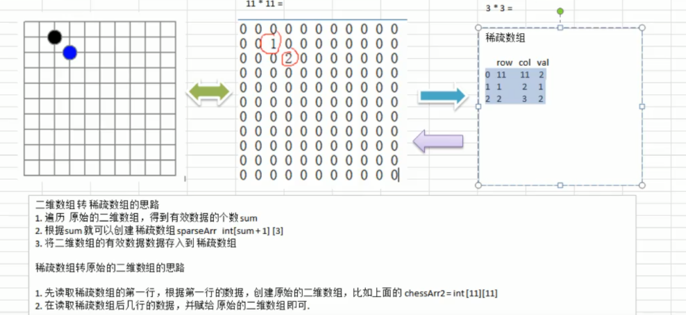
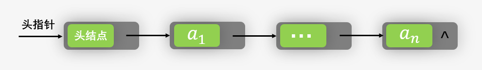

# 一、数据结构概要

算法与数据结构( Algorithms and data structures )

包括算法分析( Analysis of algorithms )，算法( Algorithms )，数据结构( Data structures )以及计算几何( Computational geometry )

Golden Formula: Algorithms + Data Structures = Programs

## 1、数据结构简介

数据结构包含：==线性结构和非线性结构==

线性结构有两种存储方式：==顺序存储结构和链式存储结构==

## 2、线性数据结构

如果数据结构的所有元素按线性顺序排列，则称为线性数据结构。 在线性数据结构中，元素以非分层方式存储，除了第一个和最后一个元素，它的每个元素具有后继元素和前导元素。

#### 顺序存储

指的是用一段地址连续的存储单元依次存储线性表的数据元素。

 $(a_1,\cdot\cdot\cdot,a_{i-1},a_{i},a_{i+1},\cdot\cdot\cdot,a_n)$

物理上的存储方式事实上就是在内存中找个初始地址，然后通过占位的形式，把一定的内存空间给占了，然后把相同数据类型的数据元素依次放在这块空地中。

顺序存储结构封装需要的三个属性：

- a、存储空间的起始位置，数组data存储位置就是线性表存储空间的起始位置。
- b、线性表的最大存储容量：数组的长度`MAXSIZE`
- c、线性表的当前长度：`length`

#### 链式存储

特点就是用一组任意的存储单元存储线性表的数据元素，这组存储单元可以在内存中未被占用的任意位置。

比起顺序存储结构每个元素只需要存储一个位置就可以了。现在链式存储结构中，除了要存储数据信息外，还要存储它的后继元素的存储地址（指针）。

也就是说除了存储其本身的信息外，还需要存储一个指示其直接后继的存储位置的信息。

概念：把存储数据元素信息的域称为`数据域`，把存储直接后继位置的域称为`指针域`。指针域中存储的信息称为`指针`或`链`。这两部分信息组成数据元素称为`存储映像`，称为`结点（Node)`

$n$  个节点连接成一个链表，即为线性表 $(a_1,\cdot\cdot\cdot,a_{i-1},a_{i},a_{i+1},\cdot\cdot\cdot,a_n)$的链式存储结构。

而链表还分为`单链表`和`双链表`,我会在后续笔记中详细介绍

> 数组：数组是类似数据项的集合，每个数据项称为数组的元素。 元素的数据类型可以是任何有效的数据类型，如char，int，float或double。
>
> 数组的元素共享相同的变量名，但每个元素都带有一个不同的索引号，这些索引号也称为下标。 数组可以是一维的，二维的或多维的。
>
> 链表：链表是一种线性数据结构，用于维护内存中的列表。 它可以看作存储在非连续内存位置的节点集合。链表中的每个节点都包含指向其相邻节点的指针。
>
> 堆栈 ：堆栈是一个线性列表，其中只允许在一端插入和删除，称为顶部。堆栈是一种抽象数据类型(ADT)，可以在大多数编程语言中实现。 它被命名为堆栈，因为它的行为类似于真实世界的堆栈，例如：成堆的板块或卡片组等，只能在最顶面上操作。
>
> 队列：队列是一个线性列表，它的元素只能在一端插入(添加)，也被称为后端，而只在另一端出队(删除)，也被称为前端。

## 3、非线性数据结构

非线性数据结构不形成序列，即每个项目或元素以非线性排列与两个或更多个其他项目连接。 数据元素不按顺序结构排列。

### 非线性数据结构的类型如下：

> 树：树是多级数据结构，其元素之间具有层次关系，树的元素也称为节点。层次中最底层的节点称为叶节点，而最顶层节点称为根节点。 每个节点都包含指向相邻节点的指针。树数据结构基于节点之间的父子关系。 除了叶节点之外，树中的每个节点可以具有多个子节点，而除了根节点之外，每个节点可以具有最多一个父节点。 树可以分为许多类别，本教程在稍后章节中将对此进行讨论。
>
> 图：图可以定义为由称为边缘的链接连接的元素集(由顶点表示)的图表示。 图不同于树，图可以有循环而树不能具有循环。

# 二、数组

## 1、数组基本算法

### 查找

```java
/*获取指定元素位置*/
    public int find(int index){
        if (index<=0||this.size == 0)
            return -1;
        return this.data[index-1];
    }
```

### 添加

根据指定位置(`index`)插入元素（`element`）

```java
for( int i = this.count ;i > 0; i-- ){ 
    this.data[i] = this.data[i-1];
    if (i==index){
        this.data[i-1] = element;
        break;
    }
}
```

此处`count`为数组中的元素个数，所以`count-1`为当前数组中的最后一个元素，此时将下标为`count`的元素赋值为`count-1`元素(注意：此代码之前应判断数组长度是否超出)，当`i` 循环减到指定下标位置`index`时，此时的`this.data[i]`和`this.data[i-1]`是相等的，因此将`elemene`赋值给前面的那个元素`this.data[i-1]`

### 删除

根据指定位置删除元素

```java
for( int i = 0 ;i <this.count ; i++ ){
    if (i>=index){
        this.data[i-1]=this.data[i];
    }
}
this.count--;
this.data[count] = 0;
```

此处`count`为数组中的元素个数，循环从`0`开始，当`i>=index`时，`index-1` 才是我们要删除的元素，所以将`this.data[i-1]`覆盖为后面的元素`this.data[i]`

循环以当前元素个数为终止，结束后`this.count--` ，此时`this.data[count]`和`this.data[count-1]`相等，因此将`this.data[count] = 0`

### 完整示例

**数组的通用类**

```java
package com.daniel.a_array;

/**
 * 数组通用工具类
 * 1）数组元素的查看、添加、插入、删除、按照下标随机访问操作
 * 2）数组中的数据是int类型的
 *
 * @author GanShaoXi
 * @return com.daniel.a_array
 * @date 2022/3/7 14:02
 * @versions 1.0.0
 */
public class GeneralArray {
    /*定义int类型数组data*/
    private int data[];
    /*定义数组的总长度*/
    private int size;
    /*定义数组中存储元素的个数*/
    private int count;
    
    /*初始化数组*/
    public GeneralArray(int size) {
        this.data = new int[size];
        this.size = size;
        this.count = 0;
    }
    
    /*获取当前数组总长度*/
    public int size() {
        return this.size;
    }
    
    /*获取当前数组中的元素个数*/
    public int count() {
        return this.count;
    }
    
    /*获取指定元素位置*/
    public int find(int index) {
        if (index <= 0 || this.size == 0)
            return -1;
        return this.data[index - 1];
    }
    
    /*添加元素*/
    /*直接添加元素*/
    public boolean addElement(int element) {
        if (isFull()) {
            System.out.println("数组已满");
            return false;
        }
        this.data[this.count] = element;
        this.count++;
        return true;
    }
    
    /*根据指定位置（之前）插入*/
    public boolean addElement(int index, int element) {
        if (isFull() || index <= 0 || index > this.count) {
            System.out.println(isFull() ? "数组已满" : "插入位置不正确");
            return false;
        }
        for (int i = this.count; i > 0; i--) {
            this.data[i] = this.data[i - 1];
            if (i == index) {
                this.data[i - 1] = element;
                break;
            }
        }
        this.count++;
        return true;
    }
    
    /*删除元素*/
    /*根据指定位置*/
    public boolean delElementByIndex(int index) {
        if (index <= 0 || index > this.count) {
            System.out.println("输入的位置不正确");
            return false;
        }
        for (int i = 0; i < this.count; i++) {
            if (i >= index) {
                this.data[i - 1] = this.data[i];
            }
        }
        this.count--;
        this.data[count] = 0;
        return true;
    }
    
    /*根据下标修改元素*/
    public boolean update(int index, int element) {
        if (index <= 0 || index > this.count) {
            System.out.println("修改位置错误");
            return false;
        }
        this.data[index - 1] = element;
        return true;
    }
    
    /*数组的扩容*/
    public boolean Capacity() {
        int len = this.size + (this.size >> 1);
        System.out.println("扩容至：" + len);
        int arr[] = new int[len];
        for (int i = 0; i < this.count; i++) {
            arr[i] = this.data[i];
        }
        this.data = arr;
        this.size = len;
        return true;
    }
    
    /*数组格式化输出*/
    @Override
    public String toString() {
        StringBuffer buffer = new StringBuffer();
        buffer.append("当前数组信息：\n  元素个数count:" + this.count);
        buffer.append("\n  数组总长size:" + this.size);
        buffer.append("\n  数组数据:[");
        for (int i = 0; i < this.count; i++) {
            buffer.append(this.data[i] + ",");
        }
        if (this.count != 0) {
            buffer.deleteCharAt(buffer.length() - 1);
        }
        buffer.append("]");
        return buffer.toString();
    }
    
    /*判断数组是否已满*/
    private boolean isFull() {
        return this.size == this.count;
    }
}

```

**主要测试类**

```java
package com.daniel.a_array;

import sun.java2d.loops.GeneralRenderer;

public class ArrayMain {
    public static void main(String[] args) {
        /*测试通用数组工具类*/
        GeneralArray generalArray = new GeneralArray(15);
        /*直接添加元素*/
//        System.out.println(generalArray.addElement(25));
        System.out.println(generalArray.addElement(245));
        System.out.println(generalArray.addElement(45));
        System.out.println(generalArray.addElement(34));
        System.out.println(generalArray.addElement(252));
//        System.out.println(generalArray.addElement(4));
        System.out.println(generalArray.toString());
        /*根据位置添加元素*/
//        generalArray.addElement(1,55);
        generalArray.addElement(3,55);
        System.out.println(generalArray.toString());
        /*根据位置删除元素*/
        generalArray.delElementByIndex(3);
        System.out.println(generalArray.toString());
        /*根据位置查找元素*/
        System.out.println(generalArray.find(4));
        generalArray.Capacity();
        /*修改元素*/
        generalArray.update(1,99);
        System.out.println(generalArray.toString());
    }
    
}

```

## 2、稀疏数组

### 基本概念

当一个数组中大部分元素为0，或者为同一个值时，可以使用稀疏数组进行保存

### 处理方式

> 记录数组有几行几列，有多少个不同的值
>
> 把不同的元素的行、列及值记录在一个小规模的数组（稀疏数组）中，从而缩小程序的规模




### 代码实现

```java
package arithmetic.base.array.sparse;

public class MySparseArray {
    public static void main(String[] args) {
        /**
         * 创建原始二维数组11*11
         * 其中0表示无元素，1表示黑子，2表示蓝子
         */
//        创建数组并初始化数组元素
        int[][] originArray = new int[11][11];
        originArray[1][2] = 1;
        originArray[2][3] = 2;
        originArray[3][6] = 1;
        //        输出数组
        System.out.println("原始二维数组：");
        for (int[] ints : originArray) {
            for (int item : ints) {
                System.out.printf("%d\t",item);
            }
            System.out.println();
        }
        int[][] convSparse = convSparse(originArray);
        convOriginArr(convSparse);
    }
    
    /**
     * 二维数组转稀疏数组
     * @param originArray
     * @return
     */
    public static int[][] convSparse(int [][] originArray){
        //记录原始数组的行、列、值的总数
        int valCount = 0;//用于记录数组中元素的总数
        int rowCount = originArray.length;//稀疏数组的行数
        int colCount = originArray[0].length;//稀疏数组的列数
    
        for (int[] ints : originArray) {
            for (int i = 0; i < ints.length; i++) {
                
                if (ints[i] != 0) {
                    valCount++;
                }
            }
        }
    
        int[][] sparseArr = new int[valCount + 1][3];
        sparseArr[0][0] = rowCount;
        sparseArr[0][1] = colCount;
        sparseArr[0][2] = valCount;
        //遍历原始数组并将元素存入稀疏数组中，此处从稀疏数组的1行开始存(第0行用于存储原数组的大小及有效元素的个数)
        int sparseCount = 1;
        for (int i = 0; i < originArray.length; i++) {
            for (int j = 0; j < originArray[0].length; j++) {
                if (originArray[i][j] != 0) {
                    //将每一行的行、列位置及其元素的值存入稀疏数组
                    sparseArr[sparseCount][0] = i;
                    sparseArr[sparseCount][1] = j;
                    sparseArr[sparseCount][2] = originArray[i][j];
                    sparseCount++;
                }
            }
        }
        //        遍历稀疏数组
        System.out.println("原数组转稀疏数组：");
        System.out.println("行\t列\t值");
        for (int[] ints : sparseArr) {
            for (int anInt : ints) {
                System.out.printf("%d\t", anInt);
            }
            System.out.println();
        }
        
        return sparseArr;
    }
    
    /**
     * 稀疏数组转换为二维数组
     * @param sparseArr
     * @return
     */
    public static int[][] convOriginArr(int [][] sparseArr){
        //此处第一个sparseArr[0][0]为稀疏数组行总值，第二个sparseArr[0][1]为稀疏数组的列总值
        int[][] newOriginArr = new int[sparseArr[0][0]][sparseArr[0][1]];
        for (int i = 1; i < sparseArr.length; i++) {
            //将稀疏数组的某一行的第一列值和第二列值作为新二维数组的位置，将第三列储存的值赋值给当前位置的新数组
            newOriginArr[sparseArr[i][0]][sparseArr[i][1]]=sparseArr[i][2];
        }
        //        输出新数组
        System.out.println("稀疏数组转原数组：");
        for (int[] ints : newOriginArr) {
            for (int i = 0; i < ints.length; i++) {
                System.out.print(ints[i] + "  ");
            }
            System.out.println();
        }
        return newOriginArr;
    }
}
```

# 三、链表

线性表的链式存储结构的特点就是用一组任意的存储单元存储线性表的数据元素，这组存储单元可以在内存中未被占用的任意位置。

比起顺序存储结构每个元素只需要存储一个位置就可以了。现在链式存储结构中，除了要存储数据信息外，还要存储它的后继元素的存储地址（指针）。

也就是说除了存储其本身的信息外，还需要存储一个指示其直接后继的存储位置的信息。

来几个概念：把存储数据元素信息的域称为数据域，把存储直接后继位置的域称为指针域。指针域中存储的信息称为指针或链。这两部分信息组成数据元素称为存储映像，称为**结点**（Node).

n个节点连接成一个链表，即为线性表   $(a_1,\cdot\cdot\cdot,a_{i-1},a_i,a_{i+1},\cdot\cdot\cdot,a_n)$  的链式存储结构

## 1、单链表

此类链表的每个结点中只包含一个指针域，所以叫做**单链表**。


对于线性表来说，总得有个头有个尾，链表也不例外。我们把链表中的第一个结点的存储位置叫做头指针，最后一个结点指针为空（`null`）

### 头指针与头节点的异同

- 头节点的数据域一般不存储任何信息，谁叫它是第一个呢，有这个特权。
- 头指针是指向链表第一个结点的指针，若链表有头节点，则是指向头结点的指针。
- 头指针具有标识作用，所以常用的头指针冠以链表的名字（指针变量的名字）。
- 无论链表是否为空，头指针均不为空
- 头指针是链表的必要元素。

头结点：

- 头结点是为了操作的统一和方便而设立的，放在第一个元素的结点之前，其数据域一般无意义（但也可以用来存放链表的长度）。
- 有了头结点，对在第一个元素结点前插入结点和删除第一结点起操作与其他节点的操作就统一了。
- 头结点不一定是链表的必须要素。


### 单链表结构

当含有节点时：



当不含节点时：


### 单链表的代码

**单链表节点**

```java
public class SinglyNode<T> {
    
    /*数据域*/
    private T data;
    /*存放地址*/
    private SinglyNode next;
    
    public SinglyNode(T element){
        this.data = element;
        this.next = null;
    }
    public T getData() {
        return data;
    }
    
    public void setData(T data) {
        this.data = data;
    }
    
    public SinglyNode getNext() {
        return next;
    }
    
    public void setNext(SinglyNode next) {
        this.next = next;
    }
}

```

**单链表基本操作**

```java
public class SinglyList<T> {
    /*头节点*/
    private SinglyNode<T> header;
    /*节点个数*/
    private int size;
    
    public SinglyList(){
        this.header = null;
        this.size = 0;
    }
    
    
    /*添加节点*/
    public boolean addNode(T element){
        SinglyNode node = new SinglyNode<T>(element);
        /*判断是否是第一个元素，如果是则直接插入*/
        if (header==null){
            header = node;
            return true;
        }
        // 设置标志指针
        SinglyNode p = header;
        while(true){
            if (p.getNext()==null){
                p.setNext(node);
                break;
            }
            p = p.getNext();
        }
        this.size++;
        return true;
    }
    
    @Override
    public String toString() {
        StringBuffer buffer = new StringBuffer();
        buffer.append("{");
        
        SinglyNode p = header;
        while(true){
            if (p!=null){
                buffer.append(p.getData()+",");
            }else{
                break;
            }
            p = p.getNext();
        }
        buffer.deleteCharAt(buffer.length()-1);
        buffer.append("}");
        return buffer.toString();
    }
}

```


## 2、双链表


