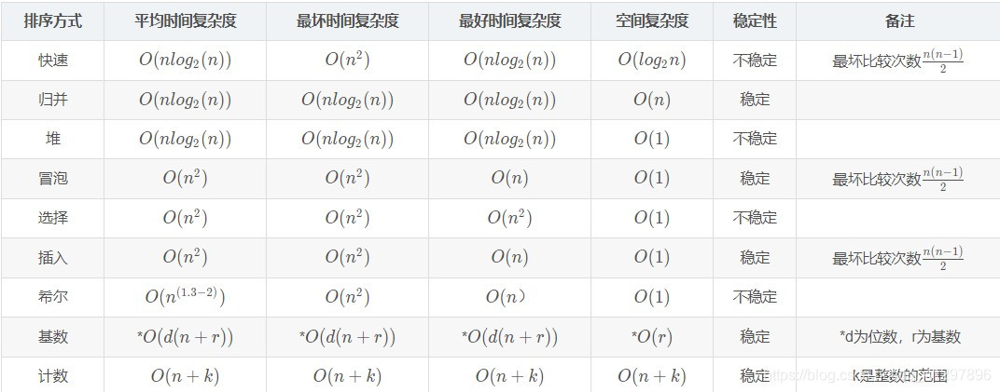

# 什么是时间复杂度

算法的时间复杂度，是一个用于度量一个算法的运算时间的一个描述，本质是一个函数，根据这个函数能在不用具体的测试数据来测试的情况下，粗略地估计算法的执行效率，换句话讲时间复杂度表示的只是代码执行时间随数据规模增长的变化趋势。

常用大O来表述，这个函数描述了算法执行所要时间的增长速度，记作`f(n)`。算法需要执行的运算次数（用函数表示）记作`T(n)`。存在常数 `c` 和函数 `f(n)`，使得当 `n >= c 时 T(n) <= f(n)，记作 T(n) = O(f(n))`，其中，n代表数据规模也就是输入的数据。常见排序复杂度如图：



# 大O表示法

大`O`符号，又叫做`道朗符号`，是数学中用另一个较为简单的函数去描述函数渐进行为的一个符号，用来刻画被截断的无穷级数尤其是渐近级数的剩余项。

## 常见复杂度量级

| 分类       | 记作     |
| ---------- | -------- |
| 常量阶     | O(1)     |
| 对数阶     | O(logn)  |
| 线性阶     | O(n)     |
| 线性对数阶 | O(nlogn) |
| n方阶      | O(nⁿ)    |
| 指数阶     | O(2ⁿ)    |
| 阶乘阶     | O(n!)    |


## 时间复杂度如何计算

### `常量阶`：

只要代码的执行时间不随 `n `的增大而增长，这样代码的时间复杂度都记作 `O(1)`。或者说，一般情况下，只要算法中不存在循环语句、递归语句，即使有成千上万行的代码，其时间复杂度也是`Ο(1)`。

### `对数阶`：

```java
 i=1;
 while (i <= n)  {
   i = i * 2;
 }
```

分析上段代码，i的取值是一个首项为1，公差为2的等比数列：

`2º·2¹·2²·2³····2ⁿⁿ = n`，其中`nn`即为项数，求对数即 `nn=log₂n`。时间复杂度为`O(log₂n)`。

### `线性阶、n方阶`：

一般情况下，如果循环体内循环控制变量为线性增长，那么包含该循环的算法的时间复杂度为O(n)，线性阶嵌套线性阶的算法时间复杂度为O(nⁿ)，涉及下文乘法法则。

### `线性对数阶`：

当一个线性阶代码段法嵌套一个对数阶代码段，该算法的时间复杂度为O(nlogn)

### `指数阶和阶乘阶`：

根据函数，随着n的增加，运行时间会无限急剧增加，因此效率非常低下。

## 3个分析时间复杂度的方法

### `最大阶法则`：

忽略式子中的常量，低阶，系数，只计算最大阶的量级。

说白了就只关注循环次数最多的代码段。

```java
int fun(int n) {
    int sum1 = 0;
    int i = 1;
    int j = 1;
    for (; i <= n; ++i) {
        sum = sum + i;
    }
    for (; i <= n; ++i) {
        for (; i <= n; ++i) {
            sum + = i+j;
        }
    }
    return sum;
}
```

代码本身没有意义，只是为了举例，上述代码的时间复杂度为`O(n²)`。

### `加法法则`：

总复杂度等于量级最大代码段的复杂度，公式：

```
T(n)=T1(n)+T2(n)=max(O(f(n)), O(g(n))) =O(max(f(n), g(n)))
```

```java
int fun(int n) {
    int sum_1 = 0;
    int p = 1;
    for (; p < 100; ++p) {
        sum_1 = sum_1 + p;
    }

    int sum_2 = 0;
    int q = 1;
    for (; q < n; ++q) {
        sum_2 = sum_2 + q;
    }

    int sum_3 = 0;
    int i = 1;
    int j = 1;
    for (; i <= n; ++i) {
        j = 1; 
        for (; j <= n; ++j) {
            sum_3 = sum_3 +  i * j;
        }
    }

    return sum_1 + sum_2 + sum_3;
}
```

三段代码的复杂度分别是`O(1)、O(n)、O(n²)`，根据法则：`T(n)=T1(n)+T2(n)=max(O(f(n)), O(g(n))) =O(max(f(n), g(n)))`。即为`O(n²)`。

### `乘法法则`：

嵌套代码复杂度等于嵌套内外代码复杂度之积。公式:

```
T(n)=T1(n)*T2(n)=O(f(n))*O(g(n))=O(f(n)*g(n))
```

```java
int fun1(int n) {
    int ret = 0; 
    int i = 1;**加粗样式**
        for (; i < n; ++i) {
            ret = ret + fun2(i);
        } 
} 

int fun2(int n) {
    int sum = 0;
    int i = 1;
    for (; i < n; ++i) {
        sum = sum + i;
    } 
    return sum;
}
```

fun1方法中，忽略掉`fun2()`的调用复杂度为`O(n)`。fun2方法的时间复杂度是`O(n)`，根据法则，`T(n) = T1(n) * T2(n) = O(n*n) = O(n²)`。

### `其中比较特殊的一种不符合上述3个法则`：

```java
int fun(int m, int n) {
  int sum_1 = 0;
  int i = 1;
  for (; i < m; ++i) {
    sum_1 = sum_1 + i;
  }

  int sum_2 = 0;
  int j = 1;
  for (; j < n; ++j) {
    sum_2 = sum_2 + j;
  }

  return sum_1 + sum_2;
}
```

当前复杂度有两种数据规模 `m` 和 `n` 确定，加法法则应更正为：`T1(m) + T2(n) = O(f(m) + g(n))`，即时间复杂度为`O(m+n)`。

## 时间复杂度的最好、最坏、平均和均摊

> `最好时间复杂度`：在最理想的情况下，执行这段代码的时间复杂度。
>
> `最坏时间复杂度`：在最糟糕的情况下，执行这段代码的时间复杂度。
>
> `平均时间复杂度`：考虑各种情况及其发生的概率，得到的时间复杂度。
>
> `均摊时间复杂度`：均摊时间复杂度是一种特殊的平均复杂度，把耗时多的复杂度均摊到耗时低的复杂度，得到的时间复杂度。

## 快速排序最好时间复杂度计算

快速排序最优的情况就是每一次取到的元素都刚好平分整个数组。 此时的时间复杂度公式则为：

```
T[n] = 2T[n/2] + f(n)；
```

`T[n/2]`为平分后的子数组的时间复杂度，`f[n] `为平分这个数组时所花的时间；下面来推算下，在最优的情况下快速排序时间复杂度的计算(用迭代法)：

```
** T[n] = 2T[n/2] + n ——————————————— 第一次递归，令：n = n
T[n] = 2 { 2 T[n/4] + (n/2) } + n ———————————第二次递归，令：n = n/2= = 2^2 T[ n/ (2^2) ] + 2n
T[n] = 2^2 { 2 T[n/ (2^3) ] + n/(2^2)} + 2n ———————第三次递归 ，令：n = n/(2^2)= 2^3 T[ n/ (2^3) ] + 3n
T[n] = 2^m T[1] + mn ———————————————第m次递归(m次后结束)， 令：n = n/( 2^(m-1) )**
```

当最后平分的不能再平分时，也就是说把公式一直往下跌倒，到最后得到T[1]时，说明这个公式已经迭代完了（T[1]是常量了）。

得到：

```
T[n/ (2^m) ] = T[1] ===>> n = 2^m ====>> m = logn；
T[n] = 2^m T[1] + mn ；其中m = logn;
T[n] = 2^(logn) T[1] + nlogn = n T[1] + nlogn = n + nlogn ；
```

其中n为元素个数，又因为当n >= 2时：nlogn >= n (也就是logn > 1)，所以取后面的 nlogn；

综上所述：快速排序最优的情况下时间复杂度为：`O( nlogn )`

### 摊还分析法

通过摊还分析法得到的时间复杂度为均摊时间复杂度。

大致思路：每一次`O(n)`都会跟着`n`次`O(1)`，所以把耗时多的复杂度均摊到耗时低的复杂度。得到的均摊时间复杂度为`O(1)`。

应用场景：均摊时间复杂度和摊还分析应用场景较为特殊，对一个数据进行连续操作，大部分情况下时间复杂度都很低，只有个别情况下时间复杂度较高。而这组操作其存在前后连贯的时序关系。

这个时候我们将这一组操作放在一起分析，将高复杂度均摊到其余低复杂度上，所以一般均摊时间复杂度就等于最好情况时间复杂度。

