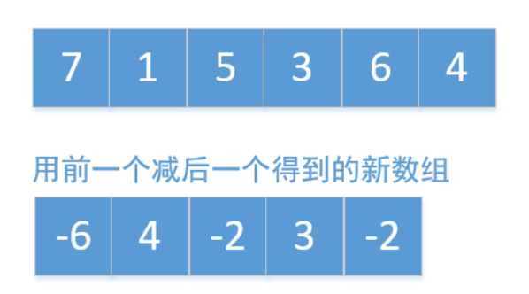
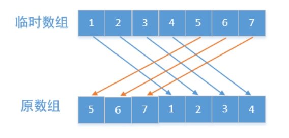
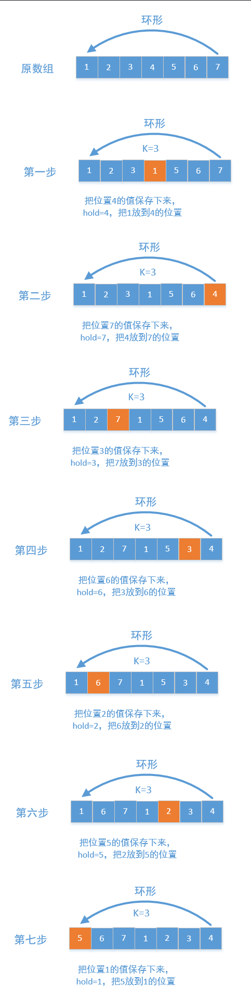

# 一、数组

## 1、删除数组重复项

给你一个有序数组 nums ，请你 原地 删除重复出现的元素，使每个元素 只出现一次 ，返回删除后数组的新长度。

不要使用额外的数组空间，你必须在 原地 修改输入数组 并在使用 O(1) 额外空间的条件下完成。

说明:

为什么返回数值是整数，但输出的答案是数组呢?

请注意，输入数组是以「引用」方式传递的，这意味着在函数里修改输入数组对于调用者是可见的。

你可以想象内部操作如下:

```java
// nums 是以“引用”方式传递的。也就是说，不对实参做任何拷贝
int len = removeDuplicates(nums);

// 在函数里修改输入数组对于调用者是可见的。
// 根据你的函数返回的长度, 它会打印出数组中 该长度范围内 的所有元素。
for (int i = 0; i < len; i++) {
    print(nums[i]);
}
```

示例 1：

```java
输入：nums = [1,1,2]
输出：2, nums = [1,2]
解释：函数应该返回新的长度 2 ，并且原数组 nums 的前两个元素被修改为 1, 2 。不需要考虑数组中超出新长度后面的元素。
```

示例 2：

```java
输入：nums = [0,0,1,1,1,2,2,3,3,4]
输出：5, nums = [0,1,2,3,4]
解释：函数应该返回新的长度 5 ， 并且原数组 nums 的前五个元素被修改为 0, 1, 2, 3, 4 。不需要考虑数组中超出新长度后面的元素。
```


提示：

```java
0 <= nums.length <= 3 * 104
-104 <= nums[i] <= 104
nums 已按升序排列
```

### 解答：

使用两个指针，右指针始终往右移动

> 如果右指针指向的值等于左指针指向的值，左指针不动。
>
> 如果右指针指向的值不等于左指针指向的值，那么左指针往右移一步，然后再把右指针指向的值赋给左指针


```java
class Solution {
    public int removeDuplicates(int[] nums) {
        if(nums == null || nums.length == 0){
            return 0;
        }
        int left = 0;
        for(int right = 1;right<nums.length;right++){
            if(nums[left] != nums[right]){
                nums[++left] = nums[right];
            }
        }
        return ++left;
    }
}
```

## 2、买卖股票的最佳时机 II

给定一个数组 prices ，其中 prices[i] 是一支给定股票第 i 天的价格。

设计一个算法来计算你所能获取的最大利润。你可以尽可能地完成更多的交易（多次买卖一支股票）。

注意：你不能同时参与多笔交易（你必须在再次购买前出售掉之前的股票）。

示例 1:

```java
输入: prices = [7,1,5,3,6,4]
输出: 7
解释: 在第 2 天（股票价格 = 1）的时候买入，在第 3 天（股票价格 = 5）的时候卖出, 这笔交易所能获得利润 = 5-1 = 4 。
     随后，在第 4 天（股票价格 = 3）的时候买入，在第 5 天（股票价格 = 6）的时候卖出, 这笔交易所能获得利润 = 6-3 = 3 。
```

示例 2:

```java
输入: prices = [1,2,3,4,5]
输出: 4
解释: 在第 1 天（股票价格 = 1）的时候买入，在第 5 天 （股票价格 = 5）的时候卖出, 这笔交易所能获得利润 = 5-1 = 4 。
     注意你不能在第 1 天和第 2 天接连购买股票，之后再将它们卖出。因为这样属于同时参与了多笔交易，你必须在再次购买前出售掉之前的股票。
```

示例 3:

```java
输入: prices = [7,6,4,3,1]
输出: 0
解释: 在这种情况下, 没有交易完成, 所以最大利润为 0。
```

### 解答：

贪心算法是指，在对问题求解时，总是做出在当前看来是最好的选择。也就是说，不从整体最优上加以考虑，算法得到的是在某种意义上的局部最优解。

那么这道题使用贪心算法也是最容易解决的，只要是上涨的我们就要计算他们的差值进行累加，不需要再找开始上涨的最小值和最大值。为什么能这样计算，我举个例子。

比如a<b<c<d，因为从a到d一直是上涨的，那么最大值和最小值的差值就是d-a，也可以写成(b-a)+(c-b)+(d-c) = d-a，搞懂了这个公式所有的一切都明白了。如果还不明白，可以想象成数组中前一个值减去后一个值，构成一个新的数组，我们只需要计算这个新数组中正数的和即可，这里以示例1为例画个图看下



所以总结：==求上升区间的高度和==

```java
class Solution {
    public int maxProfit(int[] prices) {
        int n = prices.length;
        if (n <= 1) return 0;
        int max = 0;
        int d;
        for (int i = 1; i < n; i++) {
            d = prices[i] - prices[i-1];
            if (d > 0) max += d;
        }
        return max;
    }
}
```

## 3、旋转数组

给定一个数组，将数组中的元素向右移动 k 个位置，其中 k 是非负数。

进阶：

尽可能想出更多的解决方案，至少有三种不同的方法可以解决这个问题。

你可以使用空间复杂度为 O(1) 的 原地 算法解决这个问题吗？


示例 1:

```java
输入: nums = [1,2,3,4,5,6,7], k = 3
输出: [5,6,7,1,2,3,4]
解释:
向右旋转 1 步: [7,1,2,3,4,5,6]
向右旋转 2 步: [6,7,1,2,3,4,5]
向右旋转 3 步: [5,6,7,1,2,3,4]
```

示例 2:

```java
输入：nums = [-1,-100,3,99], k = 2
输出：[3,99,-1,-100]
解释: 
向右旋转 1 步: [99,-1,-100,3]
向右旋转 2 步: [3,99,-1,-100]
```

解答：

### 使用临时数组



```java
class Solution {
    public void rotate(int[] nums, int k) {
        int length = nums.length;
        int temp[] = new int[length];
        //把原数组值放到一个临时数组中，
        for (int i = 0; i < length; i++) {
            temp[i] = nums[i];
        }
        //然后在把临时数组的值重新放到原数组，并且往右移动k位
        for (int i = 0; i < length; i++) {
            nums[(i + k) % length] = temp[i];
        }
    }
}
```

### 多次反转

先反转全部数组，在反转前k个，最后在反转剩余的，如下所示


```java
public void rotate(int[] nums, int k) {
    int length = nums.length;
    k %= length;
    reverse(nums, 0, length - 1);//先反转全部的元素
    reverse(nums, 0, k - 1);//在反转前k个元素
    reverse(nums, k, length - 1);//接着反转剩余的
}

//把数组中从[start，end]之间的元素两两交换,也就是反转
public void reverse(int[] nums, int start, int end) {
    while (start < end) {
        int temp = nums[start];
        nums[start++] = nums[end];
        nums[end--] = temp;
    }
}
```


其实还可以在调整下，先反转前面的，接着反转后面的k个，最后在反转全部，原理都一样


```java
public void rotate(int[] nums, int k) {
    int length = nums.length;
    k %= length;
    reverse(nums, 0, length - k - 1);//先反转前面的
    reverse(nums, length - k, length - 1);//接着反转后面k个
    reverse(nums, 0, length - 1);//最后在反转全部的元素
}

//把数组中从[start，end]之间的元素两两交换,也就是反转
public void reverse(int[] nums, int start, int end) {
    while (start < end) {
        int temp = nums[start];
        nums[start++] = nums[end];
        nums[end--] = temp;
    }
}
```

### 环形旋转

类似约瑟夫环一样，把数组看作是环形的，每一个都往后移动k位，这个很好理解




但这里有一个坑，如果nums.length%k=0，也就是数组长度为k的倍数，这个会原地打转，如下图所示


对于这个问题我们可以使用一个数组visited表示这个元素有没有被访问过，如果被访问过就从他的下一个开始，防止原地打转。


```java
public static void rotate(int[] nums, int k) {
    int hold = nums[0];
    int index = 0;
    int length = nums.length;
    boolean[] visited = new boolean[length];
    for (int i = 0; i < length; i++) {
        index = (index + k) % length;
        if (visited[index]) {
            //如果访问过，再次访问的话，会出现原地打转的现象，
            //不能再访问当前元素了，我们直接从他的下一个元素开始
            index = (index + 1) % length;
            hold = nums[index];
            i--;
        } else {
            //把当前值保存在下一个位置，保存之前要把下一个位置的
            //值给记录下来
            visited[index] = true;
            int temp = nums[index];
            nums[index] = hold;
            hold = temp;
        }
    }
}
```


## 1. 两数之和

难度==简单== 

给定一个整数数组 `nums` 和一个目标值 `target`，请你在该数组中找出和为目标值的那 **两个** 整数，并返回他们的数组下标。

你可以假设每种输入只会对应一个答案。但是，数组中同一个元素不能使用两遍。

**示例:**

```java
给定 nums = [2, 7, 11, 15], target = 9

因为 nums[0] + nums[1] = 2 + 7 = 9
所以返回 [0, 1]


```

### 解答：

```java
public int[] twoSum(int[] nums, int target) {
    int arr []=new int[2];
    for(int i = 0 ; i< nums.length ; i++){
        for(int j = i+1 ; j<nums.length;j++){
            if(nums[i]+nums[j]==target){
                arr[0]=i;
                arr[1]=j;
                return arr;
            }
        }
    }
    return arr;
}
```

