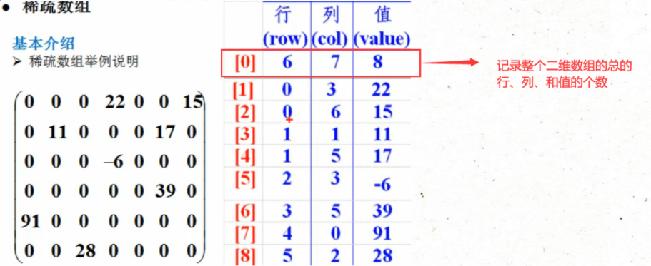

# 一、数据结构概要

算法与数据结构( `Algorithms and data structures `)

包括算法分析( `Analysis of algorithms `)，算法( `Algorithms` )，数据结构( `Data structures `)以及计算几何( `Computational geometry `)

`Golden Formula: Algorithms + Data Structures = Programs`

## 1、数据结构简介

数据结构包含：==线性结构和非线性结构==

线性结构有两种存储方式：==顺序存储结构和链式存储结构==

## 2、线性数据结构

如果数据结构的所有元素按线性顺序排列，则称为线性数据结构。 在线性数据结构中，元素以非分层方式存储，除了第一个和最后一个元素，它的每个元素具有后继元素和前导元素。

### 线性数据结构的类型如下：

> 数组：数组是类似数据项的集合，每个数据项称为数组的元素。 元素的数据类型可以是任何有效的数据类型，如char，int，float或double。
>
> 数组的元素共享相同的变量名，但每个元素都带有一个不同的索引号，这些索引号也称为下标。 数组可以是一维的，二维的或多维的。
>
> 链表：链表是一种线性数据结构，用于维护内存中的列表。 它可以看作存储在非连续内存位置的节点集合。链表中的每个节点都包含指向其相邻节点的指针。
>
> 堆栈 ：堆栈是一个线性列表，其中只允许在一端插入和删除，称为顶部。堆栈是一种抽象数据类型(ADT)，可以在大多数编程语言中实现。 它被命名为堆栈，因为它的行为类似于真实世界的堆栈，例如：成堆的板块或卡片组等，只能在最顶面上操作。
>
> 队列：队列是一个线性列表，它的元素只能在一端插入(添加)，也被称为后端，而只在另一端出队(删除)，也被称为前端。

## 3、非线性数据结构

非线性数据结构不形成序列，即每个项目或元素以非线性排列与两个或更多个其他项目连接。 数据元素不按顺序结构排列。

### 非线性数据结构的类型如下：

> 树：树是多级数据结构，其元素之间具有层次关系，树的元素也称为节点。层次中最底层的节点称为叶节点，而最顶层节点称为根节点。 每个节点都包含指向相邻节点的指针。树数据结构基于节点之间的父子关系。 除了叶节点之外，树中的每个节点可以具有多个子节点，而除了根节点之外，每个节点可以具有最多一个父节点。 树可以分为许多类别，本教程在稍后章节中将对此进行讨论。
>
> 图：图可以定义为由称为边缘的链接连接的元素集(由顶点表示)的图表示。 图不同于树，图可以有循环而树不能具有循环。

# 二、数组

## 1、基础数组

### 数组的创建与赋值

```java
public class TestArray {
	public static void main(String []args){
		int [] arry1 =new int[3];				
		int [] arry2 = new int[]{25,22,4,4,44}; 
		arry1[0]=25;
		arry1[1]=12;
		arry1[2]=35;
		int length1 = arry1.length; 
		int length2 = arry2.length;
		for (int i = 0; i < arry1.length; i++) {
			System.out.println("第一个元素:"+arry1[i]);			
		}
		System.out.println("arry1数组的长度是："+length1);
		System.out.println("arry2数组的长度是："+length2);
//		第一个元素:25
//		第一个元素:12
//		第一个元素:35
//		arry1数组的长度是：3
//		arry2数组的长度是：5
	}
}
```

### 数组的扩容（添加算法）

```java
public class ArraysADD {
	public static void main(String[] args) {
//		解决数组扩充问题
		int [] arr =new int[]{56,44,65,874,64,5};
//		快速查看数组
		System.out.println(Arrays.toString(arr));
//		加入数组的目标元素
		int target =35;
//		创建新的数组
		int []newArr = new int[arr.length+1];
//		把原数组中的数据全部复制到新的数组中
		for (int i = 0; i < arr.length; i++) {
			newArr[i]=arr[i];
		}
//		将目标元素放到新数组中
		newArr[newArr.length-1]=target;
//		将新数组赋值给原数组
		arr=newArr;
//		遍历数组
		System.out.println(Arrays.toString(arr));
//		结果
//		[56, 44, 65, 874, 64, 5]
//		[56, 44, 65, 874, 64, 5, 35]
//		
	}
}
```

### 元素的删除（删除算法）

```java
public class ArraysDelete {
	public static void main(String[] args) {
//		如何删除指定数组下标中的元素
		int arr []= new int[]{54,14,225,45,74,14,25,2,41,55};
//		遍历数组
		System.out.println(Arrays.toString(arr));
//		删除下标为三的元素
		int target = 3;
//		创建新数组
		int [] newArr = new int[arr.length-1];
		for (int i = 0; i < target; i++) {
			 newArr[i]=arr[i];
		}
		for (int i = target;i < newArr.length; i++) {
			newArr[i] =arr[i+1];			
		}
//		新数组赋值给原数组
		arr=newArr;
//		遍历数组
		System.out.println(Arrays.toString(arr));
//		结果
//		[54, 14, 225, 45, 74, 14, 25, 2, 41, 55]
//		[54, 14, 225, 74, 14, 25, 2, 41, 55]
	}	
}
```

### 元素的修改（修改算法重复数据只修改第一个）

```java
public class ArraysInsert {
	public static void main(String[] args) {
//		如何修改数组中的元素		
//		新建数组
		int [] arr =new int[]{45,47,48,57,57,66,98};
		System.out.println(Arrays.toString(arr));
//		目标元素
		int tag = 57;
//		修改元素
		int a=88;
		for (int i = 0; i < arr.length; i++) {
			if (arr[i]==tag) {
				arr[i]=a;				
				break;
			}			
		}
		System.out.println(Arrays.toString(arr));	
	}		
}
//		结果
//		[45, 47, 48, 57, 57, 66, 98]
//		[45, 47, 48, 88, 57, 66, 98]
```

## 2、稀疏数组

当一个数组中大部分元素为0，或者为同一个值时，可以使用稀疏数组进行保存

稀疏数组的处理方式：

1. 记录数组有几行几列，有多少个不同的值
2. 把不同的元素的行、列及值记录在一个小规模的数组（稀疏数组）中，从而缩小程序的规模




### 代码

```java
package arithmetic.base.array.sparse;

public class MySparseArray {
    public static void main(String[] args) {
        /**
         * 创建原始二维数组11*11
         * 其中0表示无元素，1表示黑子，2表示蓝子
         */
//        创建数组并初始化数组元素
        int[][] originArray = new int[11][11];
        originArray[1][2] = 1;
        originArray[2][3] = 2;
        originArray[3][6] = 1;
        //        输出数组
        System.out.println("原始二维数组：");
        for (int[] ints : originArray) {
            for (int item : ints) {
                System.out.printf("%d\t",item);
            }
            System.out.println();
        }
        int[][] convSparse = convSparse(originArray);
        convOriginArr(convSparse);
    }
    
    /**
     * 二维数组转稀疏数组
     * @param originArray
     * @return
     */
    public static int[][] convSparse(int [][] originArray){
        //记录原始数组的行、列、值的总数
        int valCount = 0;//用于记录数组中元素的总数
        int rowCount = originArray.length;//稀疏数组的行数
        int colCount = originArray[0].length;//稀疏数组的列数
    
        for (int[] ints : originArray) {
            for (int i = 0; i < ints.length; i++) {
                
                if (ints[i] != 0) {
                    valCount++;
                }
            }
        }
    
        int[][] sparseArr = new int[valCount + 1][3];
        sparseArr[0][0] = rowCount;
        sparseArr[0][1] = colCount;
        sparseArr[0][2] = valCount;
        //遍历原始数组并将元素存入稀疏数组中，此处从稀疏数组的1行开始存(第0行用于存储原数组的大小及有效元素的个数)
        int sparseCount = 1;
        for (int i = 0; i < originArray.length; i++) {
            for (int j = 0; j < originArray[0].length; j++) {
                if (originArray[i][j] != 0) {
                    //将每一行的行、列位置及其元素的值存入稀疏数组
                    sparseArr[sparseCount][0] = i;
                    sparseArr[sparseCount][1] = j;
                    sparseArr[sparseCount][2] = originArray[i][j];
                    sparseCount++;
                }
            }
        }
        //        遍历稀疏数组
        System.out.println("原数组转稀疏数组：");
        System.out.println("行\t列\t值");
        for (int[] ints : sparseArr) {
            for (int anInt : ints) {
                System.out.printf("%d\t", anInt);
            }
            System.out.println();
        }
        
        return sparseArr;
    }
    
    /**
     * 稀疏数组转换为二维数组
     * @param sparseArr
     * @return
     */
    public static int[][] convOriginArr(int [][] sparseArr){
        //此处第一个sparseArr[0][0]为稀疏数组行总值，第二个sparseArr[0][1]为稀疏数组的列总值
        int[][] newOriginArr = new int[sparseArr[0][0]][sparseArr[0][1]];
        for (int i = 1; i < sparseArr.length; i++) {
            //将稀疏数组的某一行的第一列值和第二列值作为新二维数组的位置，将第三列储存的值赋值给当前位置的新数组
            newOriginArr[sparseArr[i][0]][sparseArr[i][1]]=sparseArr[i][2];
        }
        //        输出新数组
        System.out.println("稀疏数组转原数组：");
        for (int[] ints : newOriginArr) {
            for (int i = 0; i < ints.length; i++) {
                System.out.print(ints[i] + "  ");
            }
            System.out.println();
        }
        return newOriginArr;
    }
}
```

