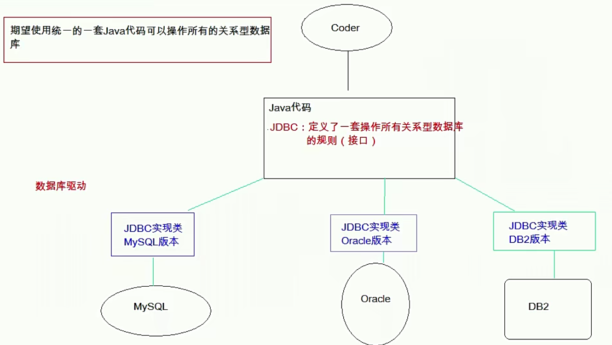
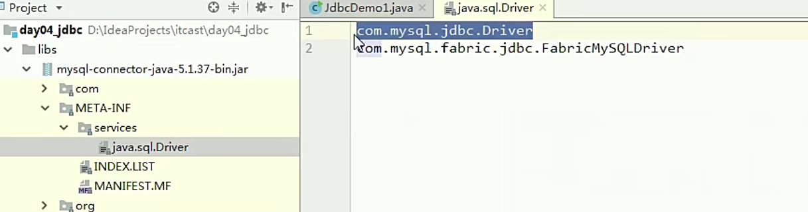
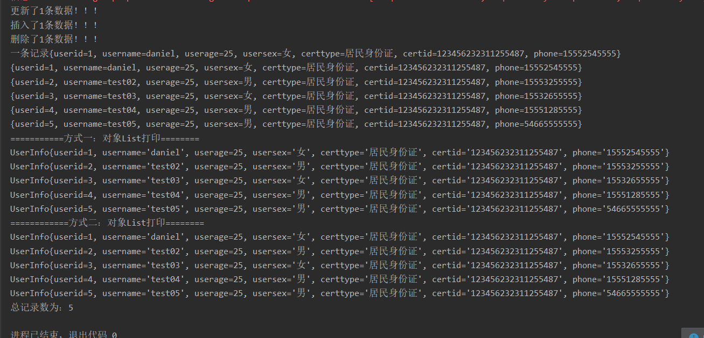

# 一、JDBC基本概念

`Java DataBase Connectivity  Java `数据库连接， Java语言操作数据库。



JDBC本质：其实是官方（sun公司）定义的一套操作所有关系型数据库的规则，即接口。各个数据库厂商去实现这套接口，提供数据库驱动jar包。我们可以使用这套接口（JDBC）编程，真正执行的代码是驱动jar包中的实现类。

# 二、快速入门：

## 	 步骤：

  1.   导入驱动jar包 

       ```json
       Mysql: mysql-connector-java-5.1.37-bin.jar
       Oracle: 
       //    mysql端口号为：3306
       //    oracle为：1521
       //    SQLserver为：1433
       ```

       		复制mysql-connector-java-5.1.37-bin.jar到项目的libs目录下
       		右键-->Add As Library

  2.   注册驱动

  3.   获取数据库连接对象 Connection

  4.   定义sql

  5.   获取执行sql语句的对象 Statement

  6.   执行sql，接受返回结果

  7.   处理结果

  8.   释放资源

```java
  	//1. 导入驱动jar包
    //2.注册驱动
    Class.forName("com.mysql.jdbc.Driver");
    //3.获取数据库连接对象
    Connection conn = DriverManager.getConnection("jdbc:mysql://localhost:3306/db3", "root", "root");
    //4.定义sql语句
    String sql = "update account set balance = 500 where id = 1";
    //5.获取执行sql的对象 Statement
    Statement stmt = conn.createStatement();
    //6.执行sql
    int count = stmt.executeUpdate(sql);
    //7.处理结果
    System.out.println(count);
    //8.释放资源
    stmt.close();
    conn.close();
```

# 三、对JDBC中各个接口和类详解：

## DriverManager：驱动管理对象

* 功能：

  1. 注册驱动：告诉程序该使用哪一个数据库驱动jar

     ```java
     static void registerDriver(Driver driver) //注册与给定的驱动程序 DriverManager 
     //写代码使用：  Class.forName("com.mysql.jdbc.Driver");
     //通过查看源码发现：在com.mysql.jdbc.Driver类中存在静态代码块
      static {
             try {
                 java.sql.DriverManager.registerDriver(new Driver());
             } catch (SQLException E) {
                 throw new RuntimeException("Can't register driver!");
             }
     	}
     ```

     注意：==mysql5之后的驱动jar包可以省略注册驱动的步骤。因为它在文件中已经标明了路径==

     

  2. 获取数据库连接：

    方法：

  ```java
  static Connection getConnection(String url, String user, String password) 
  ```

  参数：

  * ```url```：指定连接的路径
    * 语法：jdbc:mysql://ip地址(域名):端口号/数据库名称
    * 例子：jdbc:mysql://localhost:3306/db3
    * 细节：如果连接的是本机mysql服务器，并且mysql服务默认端口是3306，则url可以简写为：jdbc:mysql:///数据库名称
  * ``user``：用户名
  * ```password```：密码 

## Connection：数据库连接对象

1. 功能：
  1. 获取执行sql 的对象

  ```java
Statement createStatement()
PreparedStatement prepareStatement(String sql)  
  ```

  

    2. 管理事务：
    
    * 开启事务：setAutoCommit(boolean autoCommit) ：调用该方法设置参数为false，即开启事务
    * 提交事务：commit() 
    * 回滚事务：rollback() 

## Statement：执行sql的对象

1. 执行sql
   1. boolean execute(String sql) ：==可以执行任意的sql== 了解 
   2. int executeUpdate(String sql) ：执行DML``（insert、update、delete）``语句、DDL``(create，alter、drop)``语句
      * 返回值：==影响的行数==，可以通过这个影响的行数判断DML语句是否执行成功 返回值>0的则执行成功，反之，则失败。
   3. ResultSet executeQuery(String sql)  ：执行DQL```（select)```语句

## 练习：

1. account表 添加一条记录
2. account表 修改记录
3. account表 删除一条记录

代码：

```java
		Statement stmt = null;
	     Connection conn = null;
	     try {
	         //1. 注册驱动
	         Class.forName("com.mysql.jdbc.Driver");
	         //2. 定义sql
	         String sql = "insert into account values(null,'王五',3000)";
	         //3.获取Connection对象
	         conn = DriverManager.getConnection("jdbc:mysql:///db3", "root", "root");
	         //4.获取执行sql的对象 Statement
	         stmt = conn.createStatement();
	         //5.执行sql
	         int count = stmt.executeUpdate(sql);//影响的行数
	         //6.处理结果
	         System.out.println(count);
	         if(count > 0){
	             System.out.println("添加成功！");
	         }else{
	             System.out.println("添加失败！");
	         }
	
	 } catch (ClassNotFoundException e) {
	     e.printStackTrace();
	 } catch (SQLException e) {
	     e.printStackTrace();
	 }finally {
	     //stmt.close();
	     //7. 释放资源
	     //避免空指针异常
	     if(stmt != null){
	         try {
	             stmt.close();
	         } catch (SQLException e) {
	             e.printStackTrace();
	         }
	     }
	
     if(conn != null){
	         try {
	             conn.close();
	         } catch (SQLException e) {
	             e.printStackTrace();
	         }
	     }
	 }
```

## ResultSet：结果集对象,封装查询结果

```java
boolean next()// 游标向下移动一行，判断当前行是否是最后一行末尾(是否有数据)，如果是，则返回false，如果不是则返回true
getXxx(参数) // 获取数据
```

Xxx：代表数据类型   如：`` int getInt() ,String getString()``
参数：

1. int：==代表列的编号==,从==1==开始   如： getString(1)

2. String：==代表列名称==。 如： getDouble("balance")
   注意：
   使用步骤：

3. 游标向下移动一行   ``rs.next()``

4. 判断是否有数据

5. 获取数据   ``rs.getString("name")``

   ```java
   //循环判断游标是否是最后一行末尾。
            while(rs.next()){
                //获取数据
                //6.2 获取数据
                int id = rs.getInt(1);
                String name = rs.getString("name");
                double balance = rs.getDouble(3);
   
            System.out.println(id + "---" + name + "---" + balance);
       }
   ```

## 练习：

* 定义一个方法，查询emp表的数据将其封装为对象，然后装载集合，返回。
  1. 定义Emp类
  2. 定义方法 public List<Emp> findAll(){}
  3. 实现方法 select * from emp;

## PreparedStatement：执行sql的对象

1. SQL注入问题：在拼接sql时，有一些sql的特殊关键字参与字符串的拼接。会造成安全性问题

  输入用户随便，输入密码：a' or 'a' = 'a

  ```sql
sql：select * from user where username = 'fhdsjkf' and password = 'a' or 'a' = 'a' 
  ```

2. 解决sql注入问题：使用PreparedStatement对象来解决

3. 预编译的SQL：参数使用```?```作为占位符

4. 步骤：

  导入驱动jar包 mysql-connector-java-5.1.37-bin.jar

  注册驱动

  获取数据库连接对象 Connection

  定义sql

  * 注意：sql的参数使用``？``作为占位符。 如：

  ```sql
select * from user where username = ? and password = ?;
  ```

  获取执行sql语句的对象 

  ```java
PreparedStatement  Connection.prepareStatement(String sql) ;
  ```

  给``？``赋值：

  * 方法： setXxx(参数1,参数2)
   * 参数1：？的位置编号 ==从1 开始==
   * 参数2：？的值

  执行sql，接受返回结果，不需要传递sql语句

  处理结果

  释放资源

5. 注意：==后期都会使用PreparedStatement来完成增删改查的所有操作==
   1. 可以防止SQL注入
   2. 效率更高

# 四、使用属性文件连接

## 1、编写db.properties

```properties
driver=com.microsoft.sqlserver.jdbc.SQLServerDriver
url=jdbc:sqlserver://localhost;databasename=testDB
user=sa
pow=201710262118
```

> 注意：属性文件应放在资源目录下，（eclipse中的src目录下）

## 2.代码(实现增删改查)

## BaseDao.java

```java
public class BaseDao {
	private static String driver;
	private static String url;
	private static String user;
	private static String pow ;
	/**
	 * 得到连接
	 * @return
	 */
	public static Connection getConnection() {
		ResourceBundle rb = ResourceBundle.getBundle("db");//从属性文件获取相关参数
		driver = rb.getString("driver");
		url = rb.getString("url");
		user = rb.getString("user");
		pow = rb.getString("pow");
		Connection con=null;
		try {
			Class.forName(driver);
			con = DriverManager.getConnection(url,user,pow);
		} catch (Exception e) {
			// TODO: handle exception
		}
		return con;
	}
}	
```

## UserDao.java

> UserDao类继承于BaseDao类，可使用父类的静态方法

```java
public class UserDao extends BaseDao{
	/**
	 * 添加操作
	 * @return
	 */
	public static int insertDataBase(String userName,String userPow) {
		Connection con = null;
		Statement sta = null;
		int result=0;
		try {
			con = getConnection();
			sta = con.createStatement();
			result=sta.executeUpdate("insert into UserTable (UserName,UserPow) values ('"+userName+"','"+userPow+"')");
		} catch (Exception e) {
			// TODO: handle exception
			e.getStackTrace();
			e.printStackTrace();
		}
		return result;
	}
	/**
	 * 
	 * 更新操作将指定列值的value1值更新为value2
	 * @param column 列值
	 * @param value1  初始值
	 * @param value2  替换值
	 * @return
	 */
	public static int upDataBase(String column,String value1,String value2) {
		Connection con = null;
		Statement sta = null;
		int result=0;
		try {
			con = getConnection();
			sta = con.createStatement();
			result=sta.executeUpdate("update UserTable set "+column+" = '"+value2+"' where "+column+" = '"+value1+"'");
		} catch (Exception e) {
			// TODO: handle exception
			e.getStackTrace();
			e.printStackTrace();
		}
		return result;
	}
	/**
	 * 删除操作
	 * @return
	 */
	public static int deleteDataBase(String UserName) {
		Connection con = null;
		Statement sta = null;
		int result=0;
		try {
			con = getConnection();
			sta = con.createStatement();
			result=sta.executeUpdate("delete UserTable where UserName = '"+UserName+"'");
		} catch (Exception e) {
			// TODO: handle exception
			e.getStackTrace();
			e.printStackTrace();
		}
		return result;
	}

	/**
	 * 查询条件
	 */
	public static void selectDataBase(String TableName){
		Connection con=null;
		Statement sta =null;
		try {
			con =getConnection();
			sta = con.createStatement();
			String sql= "select * from "+TableName+"";
			ResultSet rs= sta.executeQuery(sql);
			System.out.println("编号\t用户名\t密码\t时间");
			while (rs.next()) {
				System.out.println(
						rs.getInt("Id")+"\t"+
						rs.getString("UserName")+"\t"+
						rs.getString("UserPow")+"\t"+
						rs.getTime("UserTime"));
			}
			} catch (Exception e) {
				// TODO: handle exception
			}
	}
	public static void main(String[] args) {
		selectDataBase("UserTable");
//		int result =insertDataBase("daniel1", "147258");
//		System.out.println(result);
//		int result =upDataBase("UserPow", "1234", "123456");
//		System.out.println(result);
//		selectDataBase("UserTable");
		int result =deleteDataBase("dan");
		System.out.println(result);
		selectDataBase("UserTable");
	}
}
```


# 五、数据库连接池

## 1.概念：

其实就是一个容器(集合)，存放数据库连接的容器。当系统初始化好后，容器被创建，容器中会申请一些连接对象，当用户来访问数据库时，从容器中获取连接对象，用户访问完之后，会将连接对象归还给容器。

## 2. 好处：

节约资源

用户访问高效

## 3. 实现：

标准接口：``DataSource``   ``javax.sql``包下的

方法：
> * 获取连接：getConnection()
> * 归还连接：Connection.close()。如果连接对象Connection是从连接池中获取的，那么调用Connection.close()方法，则不会再关闭连接了。而是归还连接

一般我们不去实现它，有数据库厂商来实现
> 1. C3P0：数据库连接池技术
> 2. Druid：数据库连接池实现技术，由阿里巴巴提供的

## 4. C3P0：数据库连接池技术

### 导入jar包

 ``c3p0-0.9.5.2.jar``    ``mchange-commons-java-0.2.12.jar`` ==不要忘记导入数据库驱动jar包==

### 定义配置文件：

* 名称： ``c3p0.properties`` 或者 ``c3p0-config.xml``
* 路径：直接将文件放在``src``目录下即可。

两种方式配置

(1) ``c2p0.properties``

```properties
c3p0.driverClass=com.mysql.cj.jdbc.Driver
c3p0.jdbcUrl=jdbc:mysql://localhost:3306/javawebdata?serverTimezone=UTC
c3p0.user=root
c3p0.password=201710262118
```

(2) ``c3p0-config.xml``

```xml
<?xml version="1.0" encoding="UTF-8"?>
<c3p0-config>
<!-- 默认配置，如果没有指定则使用这个配置 -->
<default-config>
    <!--        驱动-->
    <property name="driverClass">com.mysql.cj.jdbc.Driver</property>
    <!--        连接URL-->
    <property name="jdbcUrl">jdbc:mysql://localhost:3306/javawebdata?serverTimezone=UTC</property>
    <!--        连接用户名-->
    <property name="user">root</property>
    <!--        连接密码-->
    <property name="password">201710262118</property>
<!--    连接超时设置-->
    <property name="checkoutTimeout">30000</property>
    <property name="idleConnectionTestPeriod">30</property>
<!--    初始化申请连接数-->
    <property name="initialPoolSize">10</property>
    <property name="maxIdleTime">30</property>
<!--    最大连接数-->
    <property name="maxPoolSize">100</property>
    <property name="minPoolSize">10</property>
    <property name="maxStatements">200</property>
    <user-overrides user="test-user">
        <property name="maxPoolSize">10</property>
        <property name="minPoolSize">1</property>
        <property name="maxStatements">0</property>
    </user-overrides>
</default-config>
<!-- 命名的配置 -->
<named-config name="mydb">
    <property name="user">root</property>
    <property name="password">root</property>
    <property name="jdbcUrl">jdbc:mysql://localhost:3306/mydb</property>
    <property name="driverClass">com.mysql.jdbc.Driver</property>
    <!-- 如果池中数据连接不够时一次增长多少个 -->
    <property name="acquireIncrement">5</property>
    <!-- 初始化数据库连接池时连接的数量 -->
    <property name="initialPoolSize">20</property>
    <!-- 数据库连接池中的最大的数据库连接数 -->
    <property name="maxPoolSize">25</property>
    <!-- 数据库连接池中的最小的数据库连接数 -->
    <property name="minPoolSize">5</property>
</named-config>
</c3p0-config>
```


### 创建核心对象并获取连接

 数据库连接池对象 ``ComboPooledDataSource``

```java
public class JDBCForC3P0Base {
    public static Connection getConnection() {
       
    }
   package com.sxgan.jdbc;

import com.mchange.v2.c3p0.ComboPooledDataSource;
import com.mchange.v2.c3p0.DataSources;

import javax.sql.DataSource;
import java.beans.PropertyVetoException;
import java.sql.Connection;
import java.sql.ResultSet;
import java.sql.SQLException;
import java.sql.Statement;

public class JDBCForC3P0Base {
    
    public static Connection getConnection() {
        //方式一：获取连接
        try {
            ComboPooledDataSource cpds = new ComboPooledDataSource();
            cpds.setDriverClass("com.mysql.cj.jdbc.Driver");
            cpds.setJdbcUrl("jdbc:mysql://localhost:3306/javawebdata?serverTimezone=UTC");
            cpds.setUser("root");
            cpds.setPassword("201710262118");
            Connection connection = cpds.getConnection();
            System.out.println(connection);
        } catch (Exception e) {
            e.printStackTrace();
        }
	//方式二：获取连接（通过配置文件进行）
       //1.创建数据库连接池对象
        DataSource cp  = new ComboPooledDataSource();
        Connection con = null;
        try {
        //获取连接对象
            con = cp.getConnection();
            System.out.println(con);
        } catch (SQLException e) {
            e.printStackTrace();
        }
        return con;
    }
    
    public static void close(Statement sm, Connection con){
        close(null,sm,con);
    }
    public static void close(ResultSet rs , Statement sm, Connection con){
        if (rs!=null){
            try {
                rs.close();
            } catch (SQLException e) {
                e.printStackTrace();
            }
        }
        if (sm!=null){
            try {
                sm.close();
            } catch (SQLException e) {
                e.printStackTrace();
            }
        }
        if (con!=null){
            try {
                sm.close();
            } catch (SQLException e) {
                e.printStackTrace();
            }
        }
    }
}

```

### 测试

本次测试使用的是``junit``进行测试，需要导入两个jar包： ``junit-4.13.2.jar``     ``hamcrest-core-1.3.jar``

```java
@Test
    public void test2(){
        Connection con = JDBCForC3P0Base.getConnection();
        try {
            String sql = "INSERT INTO user_info VALUES(DEFAULT,'test4',22,'男','居民身份证','123456199903052225','13866656655')";
            Statement sm = con.createStatement();
            int execute = sm.executeUpdate(sql);
            System.out.println(execute );
            JDBCForC3P0Base.close(sm,con);
        } catch (SQLException e) {
            e.printStackTrace();
        }
    }
```


## 5. Druid：数据库连接池实现技术，由阿里巴巴提供的


### 导入jar包

`` druid-1.0.9.jar``

### 定义配置文件：

* 是``properties``形式的
* 可以叫任意名称，可以放在任意目录下

#### ``druid.properties``

```properties
#驱动加载
driverClassName=com.mysql.cj.jdbc.Driver
#注册驱动
url=jdbc:mysql://localhost:3306/javawebdata?serverTimezone=UTC
#连接数据库的用户名
username=root
#连接数据库的密码
password=201710262118
#属性类型的字符串，通过别名的方式配置扩展插件， 监控统计用的stat 日志用log4j 防御sql注入:wall
filters=stat
#初始化时池中建立的物理连接个数。
initialSize=2
#最大的可活跃的连接池数量
maxActive=300
#获取连接时最大等待时间，单位毫秒，超过连接就会失效。配置了maxWait之后，缺省启用公平锁，并发效率会有所下降， 如果需要可以通过配置useUnfairLock属性为true使用非公平锁。
maxWait=60000
#连接回收器的运行周期时间，时间到了清理池中空闲的连接，testWhileIdle根据这个判断
timeBetweenEvictionRunsMillis=60000
minEvictableIdleTimeMillis=300000
#用来检测连接是否有效的sql，要求是一个查询语句。
validationQuery=SELECT 1
#建议配置为true，不影响性能，并且保证安全性。 申请连接的时候检测，如果空闲时间大于timeBetweenEvictionRunsMillis， 执行validationQuery检测连接是否有效。
testWhileIdle=true
#申请连接时执行validationQuery检测连接是否有效，做了这个配置会降低性能。设置为false
testOnBorrow=false
#归还连接时执行validationQuery检测连接是否有效，做了这个配置会降低性能,设置为flase
testOnReturn=false
#是否缓存preparedStatement，也就是PSCache。
poolPreparedStatements=false
#池中能够缓冲的preparedStatements语句数量
maxPoolPreparedStatementPerConnectionSize=200
```

### 加载配置文件。``Properties``


1. 获取数据库连接池对象：通过工厂来来获取  ``DruidDataSourceFactory``
2. 获取连接：``getConnection``

> 提供静态代码块加载配置文件，初始化连接池对象
>
> 提供方法
>
> 1. 获取连接方法：通过数据库连接池获取连接
> 2. 释放资源
> 3. 获取连接池的方法

### 代码

```java
public class JDBCForDruidBase {
    private static DataSource ds;
    static {
       	//通过属性类进行加载
        Properties pro = new Properties();
        //通过当前类加载文件为输入流
        InputStream in = JDBCForDruidBase.class.getClassLoader().getResourceAsStream("druid.properties");
        try {
            pro.load(in);
            ds = DruidDataSourceFactory.createDataSource(pro);
        } catch (Exception e) {
            e.printStackTrace();
        }
    }
    /*获取连接*/
    public static Connection getConnection() {
        Connection con = null;
        try {
            //获取连接
             con = ds.getConnection();
        } catch (SQLException e) {
            e.printStackTrace();
        }
        return con;
    }
    /*关闭相关连接*/
    public static void close(Statement sm, Connection con){
        close(null,sm,con);
    }
    public static void close(ResultSet rs , Statement sm, Connection con){
        if (rs!=null){
            try {
                rs.close();
            } catch (SQLException e) {
                e.printStackTrace();
            }
        }
        if (sm!=null){
            try {
                sm.close();
            } catch (SQLException e) {
                e.printStackTrace();
            }
        }
        if (con!=null){
            try {
                sm.close();
            } catch (SQLException e) {
                e.printStackTrace();
            }
        }
    }
}

```

### 测试

```java
/*测试druid连接数据库*/
    @Test
    public void test3(){
        Connection con = JDBCForDruidBase.getConnection();
        try {
            String sql = "INSERT INTO user_info VALUES(DEFAULT,'test4',22,'男','居民身份证','123456199903052225','13866656655')";
            Statement sm = con.createStatement();
            int execute = sm.executeUpdate(sql);
            System.out.println(execute );
            JDBCForDruidBase.close(sm,con);
        } catch (SQLException e) {
            e.printStackTrace();
        }
    }
```

> tips：==注意在使用完毕后通过close方法关闭连接（其实只是返还给连接池）==
>

# 六、Spring JDBC

* Spring框架对JDBC的简单封装。提供了一个JDBCTemplate对象简化JDBC的开发


## 导入jar包

spring提供了处理数据的模板，需要导入：``spring-beans-5.3.8.jar``    ``spring-core-5.3.8.jar``   ``spring-jdbc-5.3.8.jar``     ``spring-tx-5.3.8.jar``  ``commons-logging-1.2.jar``

## 创建模板对象

创建JdbcTemplate对象。依赖于数据源DataSource

```java
JdbcTemplate template = new JdbcTemplate(ds);
```

调用JdbcTemplate的方法来完成CRUD的操作

* update():执行DML语句。增、删、改语句
* queryForMap():查询结果将结果集封装为map集合，==将列名作为key，将值作为value==将这条记录封装为一个map集合
  * 注意：这个方法查询的结果集长度只能是1
* queryForList():查询结果将结果集封装为list集合
  * 注意：将每一条记录封装为一个Map集合，再将Map集合装载到List集合中
* query():查询结果，将结果封装为JavaBean对象
  * query的参数：``RowMapper``
    * 一般我们使用``BeanPropertyRowMapper``实现类。可以完成数据到``JavaBean``的自动封装
    * new BeanPropertyRowMapper<类型>(类型.class)
* queryForObject：查询结果，将结果封装为对象
  * 一般用于聚合函数的查询

## 练习：

* 需求：

  > 1. 修改1号数据的 salary 为 10000
  > 2. 添加一条记录
  > 3. 删除刚才添加的记录
  > 4. 查询id为1的记录，将其封装为Map集合
  > 5. 查询所有记录，将其封装为List
  > 6. 查询所有记录，将其封装为Emp对象的List集合
  > 7. 查询总记录数

* 代码：

### ``UserInfo.java``

```JAVA
package com.sxgan.domain;

public class UserInfo {
    private Integer userid;
    private String username;
    private Integer userage;
    private String usersex;
    private String certtype;
    private String certid;
    private String phone;
    //构造方法、getter方法、setter方法、toString方法此处省略
}

```

### Test测试方法代码

```java
/*使用spring JDBC*/
    @Test
    public void test4(){
        DataSource ds = new ComboPooledDataSource();
        JdbcTemplate template = new JdbcTemplate(ds);
//        1. 修改1号数据的 username 为 daniel
        String sql = "update user_info set username ='daniel' where userid =1";
        int update = template.update(sql);
        System.out.println("更新了"+update+"条数据！！！");
        
//        2. 添加一条记录
        String sql1 = "insert into user_info values(default,'添加的',?,?,'居民身份证','235154444444445487',?)";
        int update1 = template.update(sql1, 999, "男", "16325487894");//对应varchar为string类型，不可填char类型
        System.out.println("插入了"+update1+"条数据！！！");
//        3. 删除刚才添加的记录
        String sql2 = "delete from user_info where userage=? ";
        int update2 = template.update(sql2, 999);
        System.out.println("删除了"+update2+"条数据！！！");
//        4. 查询id为1的记录，将其封装为Map集合
        String sql3 = "select * from user_info where username=?";
        Map<String, Object> select = template.queryForMap(sql3,"daniel");
        System.out.println("一条记录"+select);
//        5. 查询所有记录，将其封装为List
        String sql4 = "select * from user_info";
        List<Map<String, Object>> maps = template.queryForList(sql4);
        for (Map<String, Object> map : maps) {
            System.out.println(map);
        }
//        6. 查询所有记录，将其封装为Emp对象的List集合
        List<UserInfo> query = template.query(sql4, new RowMapper<UserInfo>() {
            @Override
            public UserInfo mapRow(ResultSet resultSet, int i) throws SQLException {
                UserInfo userInfo = new UserInfo();
                userInfo.setUserid(resultSet.getInt("userid"));
                userInfo.setUsername(resultSet.getString("username"));
                userInfo.setUserage(resultSet.getInt("userage"));
                userInfo.setUsersex(resultSet.getString("usersex"));
                userInfo.setCerttype(resultSet.getString("certtype"));
                userInfo.setCertid(resultSet.getString("certid"));
                userInfo.setPhone(resultSet.getString("phone"));
                return userInfo;
            }
        });
        System.out.println("===========方式一：对象List打印========");
        for (UserInfo userInfo : query) {
            System.out.println(userInfo.toString());
        }
//        6.2简化以上操作
        List<UserInfo> query1 = template.query(sql4, new BeanPropertyRowMapper<UserInfo>(UserInfo.class));
        System.out.println("============方式二：对象List打印========");
        for (UserInfo userInfo : query1) {
            System.out.println(userInfo.toString());
        }
//        7. 查询总记录数
        String sql5 = "select count(*) from user_info";
        Long total = template.queryForObject(sql5,Long.class);
        System.out.println("总记录数为："+total);
    }
```


### 结果


