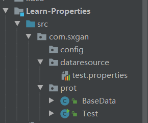

# 一、创建properties文件

## ```test.properties```

```properties
name=hello
age=22
sex=boy
```

# 二、使用``ResourceBundle``获取文件数据

## 创建基础类加载数据

### ```BaseData.java```

```java
package com.sxgan.prot;

import java.util.ResourceBundle;

public class BaseData {
    private static String name;
    private static String age;
    private static String sex;
    
    
    public static void printData(){
        try {
            //此处路径不包含文件后缀名，并且要在src目录下，可单独放在一个数据包中
//            ResourceBundle rb = ResourceBundle.getBundle("test");
            ResourceBundle rb = ResourceBundle.getBundle("com/sxgan/dataresource/test");
            name = rb.getString("name");
            age = rb.getString("age");
            sex = rb.getString("sex");
        }catch (Exception e) {
            e.printStackTrace();
        }
        System.out.println("姓名：" +name +"年龄："+age +"性别：" +sex);
    }
}

```

> 将`properties`文件资源要放到``src``目录下或包中



## 测试主类

### ```Test.java```

```java
public class Test {
    public static void main(String[] args) {
        BaseData.printData();
    }
}
```

