一、概述

## 1、Java Web概念

Internet上供外界访问的Web资源分为：**静态web资源（如html 页面）：指web页面中供人们浏览的数据始终是不变。动态web资源：指web页面中供人们浏览的数据是由程序产生的，不同时间点访问web页面看到的内容各不相同**。静态web资源开发技术：HTML、CSS。动态web资源开发技术：JavaScript、JSP/Servlet、ASP、PHP等。在Java中，动态web资源开发技术统称为Java Web。

## 2、开发步骤

搭建Java Web应用的开发环境-----部署`Tomcat`服务器、用eclipse创建Server服务、构建Java Web项目、建立第一个JSP文件、 运行JSP文件。

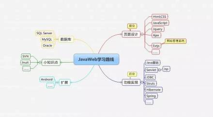

第一个要点是掌握tomcat的安装和部署。在Windows系统上安装Tomcat相对简单，下载压缩包解压缩到任意目录即可（目录名称不要含有中文字符）。进入tomcat的bin目录，可以直接运行startup.bat启动tomcat服务。

第二个要点是在IDEA中添加Server服务。把tomcat与IDEA进行关联，方便IDEA管理tomcat。

第三个要点是构建Java Web项目。Web项目开发的第一步就是要建立项目。在新建Project项目时，选择Web Application项目类型，即可创建Web项目。

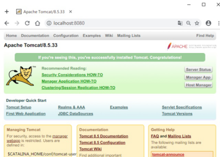

第四个要点是建立的项目如何在Server中运行。通过IDEA中进行配置相关参数，启动Tomcat服务器，在浏览器页面输入配置的访问地址即可访问项目。

# 二、项目搭建

## 1、新建项目

点击创建新项目，点击勾选Web Application创建web项目

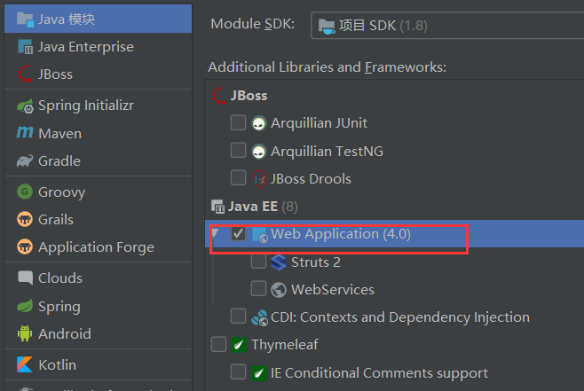

在WEB-INFO下创建lib目录，导入相关jar包（jar包），并将其添加到库。

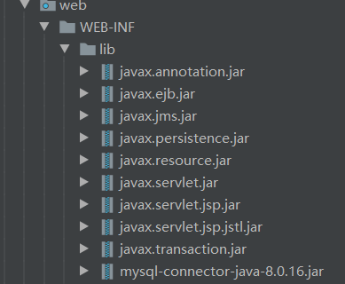

打开项目结构，将lib作为输出目录

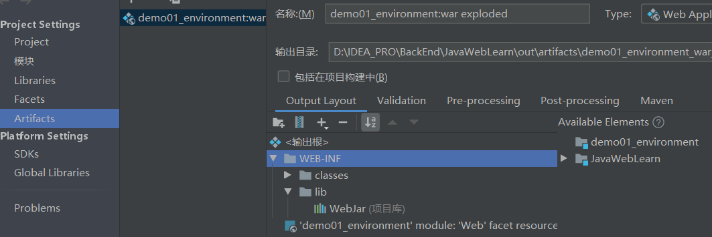

新建tomcat服务器，并配置相关参数

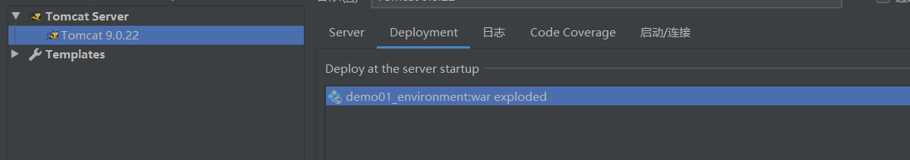

启动tomcat即可

## 2、Tomcat

### 服务器

> 服务器：安装了服务器软件的计算机 
>
> 服务器软件：接收用户的请求，处理请求，做出响应 
>
> web服务器软件：接收用户的请求，处理请求，做出响应。 
>
> 在web服务器软件中，可以部署web项目，让用户通过浏览器来访问这些项目 

### 常见的java相关的web服务器软件： 

> `webLogic`：oracle公司，大型的JavaEE服务器，支持所有的JavaEE规范，收费的。 
>
> `webSphere`：IBM公司，大型的JavaEE服务器，支持所有的JavaEE规范，收费的。 
>
> `JBOSS`：JBOSS公司的，大型的JavaEE服务器，支持所有的JavaEE规范，收费的。 
>
> `Tomcat`：Apache基金组织，中小型的JavaEE服务器，仅仅支持少量的JavaEE规范servlet/jsp。开源的，免费 
>
> 的。

### 安装

#### 1.下载

http://tomcat.apache.org/

#### 2. 安装

解压压缩包即可。
	 注意：安装目录建议不要有中文和空格

#### 3. 卸载

删除目录就行了

#### 4. 启动

```http
bin/startup.bat ,双击运行该文件即可
访问：浏览器输入：http://localhost:8080 回车访问自己
				  http://别人的ip:8080 访问别人
```

##### 可能遇到的问题：

(1. 黑窗口一闪而过：
	原因： 没有正确配置``JAVA_HOME``环境变量
	解决方案：正确配置``JAVA_HOME``环境变量

(2. 启动报错：
	暴力：找到占用的端口号，并且找到对应的进程，杀死该进程

```
netstat -ano
```

温柔：修改自身的端口号

conf/server.xml

```xml
<Connector port="8888" protocol="HTTP/1.1"
	               connectionTimeout="20000"
	               redirectPort="8445" />
```

一般会将tomcat的默认端口号修改为80。80端口号是http协议的默认端口号。
好处：在访问时，就不用输入端口号

#### 5. 关闭：

	1. 正常关闭：
		* bin/shutdown.bat
		* ctrl+c
	2. 强制关闭：
		* 点击启动窗口的×

#### 6. 配置:

##### 部署项目的方式：

(1. 直接将项目放到webapps目录下即可。
			 /hello：项目的访问路径-->虚拟目录
			简化部署：将项目打成一个war包，再将war包放置到webapps目录下。
				 war包会自动解压缩

(2. 配置conf/server.xml文件
			在<Host>标签体中配置

```xml 
<Context docBase="D:\hello" path="/hehe" />
```

* docBase:项目存放的路径
* path：虚拟目录

(3. 在conf\Catalina\localhost创建任意名称的xml文件。在文件中编写

```xml
<Context docBase="D:\hello" />
```

   * 虚拟目录：xml文件的名称

#### 7.静态项目和动态项目：

目录结构
	java动态项目的目录结构：
		-- 项目的根目录
			-- WEB-INF目录：
				-- web.xml：web项目的核心配置文件
				-- classes目录：放置字节码文件的目录
				-- lib目录：放置依赖的jar包

## 3.Tomcat控制台乱码

​		这种情况是tomcat的日志配置文件的编码需要修改，找到tomcat安装目录，找到conf下的``logging.properties``文件，将其中的``encoding = UTF-8``的部分全部修改为``encoding = GBK``

# 三、servlet

## 1、直接实现Servlet接口

> 创建java类，并实现Servlet接口
>
> 复写service等方法
>
> 在web.xml中配置servlet

### 示例：

#### HellloServlet.java

```java
public class HelloServlet implements Servlet {
    /*初始化方法，当servlet被创建时执行，且只执行一次*/
    public void init(ServletConfig servletConfig) throws ServletException {
    }
    /*获取ServletConfig，servlet的配置对象*/
    public ServletConfig getServletConfig() { return null; }
    /*提供服务的方法，每一次servlet被访问时执行，执行多次*/
    public void service(ServletRequest servletRequest, ServletResponse servletResponse) throws ServletException, IOException {
        System.out.println("Hello World");
    }
    /*获取servlet的一些信息，例如：版本、作者等等。*/
    public String getServletInfo() {
        return null;
    }
    /*当服务器正常关闭时执行*/
    public void destroy() { }
}
```

### 配置web.xml

```xml
<?xml version="1.0" encoding="UTF-8"?>
<web-app xmlns="http://xmlns.jcp.org/xml/ns/javaee"
         xmlns:xsi="http://www.w3.org/2001/XMLSchema-instance"
         xsi:schemaLocation="http://xmlns.jcp.org/xml/ns/javaee http://xmlns.jcp.org/xml/ns/javaee/web-app_4_0.xsd"
         version="4.0">
    <servlet>
        <servlet-name>HelloServlet</servlet-name>
        <servlet-class>com.sxgan.servlet.HelloServlet</servlet-class>
    </servlet>
    
    <servlet-mapping>
        <servlet-name>HelloServlet</servlet-name>
        <url-pattern>/hello</url-pattern>
    </servlet-mapping>
</web-app>
```


## 2、继承HttpServlet的方式

> 创建java类，并继承HttpServlet
>
> 复写service、doGet、doPost方法。
>
> 在WEB-INFO下的web.xml配置该servlet

### 示例

#### servlet:HelloTest.java

```java
package com.sxgan.servlet;

import javax.servlet.ServletException;
import javax.servlet.http.HttpServlet;
import javax.servlet.http.HttpServletRequest;
import javax.servlet.http.HttpServletResponse;
import java.io.IOException;

public class HelloTest extends HttpServlet {
    @Override
    protected void doGet(HttpServletRequest req, HttpServletResponse resp) throws ServletException, IOException {
        System.out.println("GET !!!! Hello World!!!");
    }
    
    @Override
    protected void doPost(HttpServletRequest req, HttpServletResponse resp) throws ServletException, IOException {
        super.doPost(req, resp);
        System.out.println("Post !!!!!!!!!!!");
    }
    
    @Override
    protected void service(HttpServletRequest req, HttpServletResponse resp) throws ServletException, IOException {
        System.out.println("service !!!!!!!!!!");
    }
}

```

> ==虽然HelloTest继承的是HttpServlet，但最终还是实现的Servlet接口==

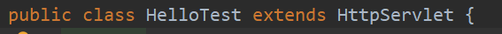

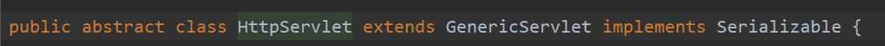

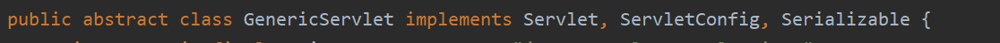

#### web.xml

```xml
<?xml version="1.0" encoding="UTF-8"?><web-app xmlns="http://xmlns.jcp.org/xml/ns/javaee"         xmlns:xsi="http://www.w3.org/2001/XMLSchema-instance"         xsi:schemaLocation="http://xmlns.jcp.org/xml/ns/javaee http://xmlns.jcp.org/xml/ns/javaee/web-app_4_0.xsd"         version="4.0">    <!-- 配置servlet类路径 -->    <servlet>        <servlet-name>HelloTest</servlet-name>        <servlet-class>com.sxgan.servlet.HelloTest</servlet-class>    </servlet>     <!--//配置访问方式-->    <servlet-mapping>        <servlet-name>HelloTest</servlet-name>        <url-pattern>/hello</url-pattern>    </servlet-mapping>    <!--配置默认的项目页面-->    <welcome-file-list>        <welcome-file>index.jsp</welcome-file>        <welcome-file>index.html</welcome-file>    </welcome-file-list></web-app>
```

## 3、执行原理

### URL组成

```http
http://localhost:8080/demo1/hello服务器地址:端口号/webapps目录下项目文件名/要执行servlet的servlet-mapping
```

### 原理

> 1. 当服务器接受到客户端浏览器的请求后，会解析请求URL路径，获取访问的Servlet的资源路径
> 2. 查找web.xml文件，是否有对应的<url-pattern>标签体内容。
> 3. 如果有，则在找到对应的<servlet-class>全类名
> 4. tomcat会将字节码文件加载进内存，并且创建其对象
> 5. 调用其方法

浏览器发送请求到达服务器，服务器根据URL找到webapps目录下的项目，然后在web.xml中检索对应的servlet，找到后并执行Servlet

## 4、servlet的生命周期


### 	1、创建

==执行init方法，只执行一次==

Servlet什么时候被创建？
			默认情况下，第一次被访问时，Servlet被创建
			可以配置执行Servlet的创建时机。
				在<servlet>标签下配置

(1.    第一次被访问时，创建

```xml
<load-on-startup>的值为负数
```

(2. 在服务器启动时，创建

    ```xml<load-on-startup>的值为0或正整数```

   ``Servlet``的``init``方法，只执行一次，说明一个``Servlet``在内存中只存在一个对象，``Servlet``是单例的

   多个用户同时访问时，可能存在线程安全问题。

   解决：==尽量不要在``Servlet``中定义成员变量。即使定义了成员变量，也不要对修改值==

###         2、提供服务

==执行service方法，执行多次==

每次访问Servlet时，Service方法都会被调用一次。

### 3、被销毁

==执行destroy方法，只执行一次==

Servlet被销毁时执行。服务器关闭时，Servlet被销毁

只有服务器正常关闭时，才会执行destroy方法。

destroy方法在Servlet被销毁之前执行，一般用于释放资源

### 4、Servlet3.0

* 好处：
  * 支持注解配置。可以不需要web.xml了。

* 步骤：
  1. 创建JavaEE项目，选择Servlet的版本3.0以上，可以不创建web.xml
  2. 定义一个类，实现Servlet接口
  3. 复写方法
  4. 在类上使用``@WebServlet``注解，进行配置

```java
//使用注解配置servlet@WebServlet("/hello3")public  class HelloServlet3 implements Servlet {    public void init(ServletConfig servletConfig) throws ServletException { }    public ServletConfig getServletConfig() { return null; }    public void service(ServletRequest servletRequest, ServletResponse servletResponse) throws ServletException, IOException {         System.out.println("Hello servlet 3.0");     }    public String getServletInfo() { return null; }    public void destroy() { }}
```

## 5、Servlet的体系结构

### 实现servlet

我们可以直接实现==``servlet``==接口来实现我们自己的servlet程序。如上面的程序一样

### 继承GenericServlet

b.当然我们也可以通过继承==``GenericServlet``==类来简化类，让我们只注重于==``service``==方法，当然我们也可以复写其他方法

代码如下：

```java
/*该类的主要作用是将抽象的service方法重写，方便我们使用* 同样我们也可以复写其他方法例如 init()方法* */@WebServlet("/extend")public class ExtendServlet extends GenericServlet {    @Override    public void service(ServletRequest servletRequest, ServletResponse servletResponse) throws ServletException, IOException {        System.out.println("继承GenericServlet类复写的service方法");    }}
```

我们可以查看``GenericServlet``的源码

```java
//// Source code recreated from a .class file by IntelliJ IDEA// (powered by FernFlower decompiler)//package javax.servlet;import java.io.IOException;import java.io.Serializable;import java.util.Enumeration;import java.util.ResourceBundle;public abstract class GenericServlet implements Servlet, ServletConfig, Serializable {    private static final String LSTRING_FILE = "javax.servlet.LocalStrings";    private static ResourceBundle lStrings = ResourceBundle.getBundle("javax.servlet.LocalStrings");    private transient ServletConfig config;    public GenericServlet() {    }    public void destroy() {    }    public String getInitParameter(String name) {        ServletConfig sc = this.getServletConfig();        if (sc == null) {            throw new IllegalStateException(lStrings.getString("err.servlet_config_not_initialized"));        } else {            return sc.getInitParameter(name);        }    }    public Enumeration<String> getInitParameterNames() {        ServletConfig sc = this.getServletConfig();        if (sc == null) {            throw new IllegalStateException(lStrings.getString("err.servlet_config_not_initialized"));        } else {            return sc.getInitParameterNames();        }    }    public ServletConfig getServletConfig() {        return this.config;    }    public ServletContext getServletContext() {        ServletConfig sc = this.getServletConfig();        if (sc == null) {            throw new IllegalStateException(lStrings.getString("err.servlet_config_not_initialized"));        } else {            return sc.getServletContext();        }    }    public String getServletInfo() {        return "";    }    public void init(ServletConfig config) throws ServletException {        this.config = config;        this.init();    }    public void init() throws ServletException {    }    public void log(String msg) {        this.getServletContext().log(this.getServletName() + ": " + msg);    }    public void log(String message, Throwable t) {        this.getServletContext().log(this.getServletName() + ": " + message, t);    }/*service方法定义为抽象的，所以非抽象类继承该类必须重写该方法，*/    public abstract void service(ServletRequest var1, ServletResponse var2) throws ServletException, IOException;    public String getServletName() {        ServletConfig sc = this.getServletConfig();        if (sc == null) {            throw new IllegalStateException(lStrings.getString("err.servlet_config_not_initialized"));        } else {            return sc.getServletName();        }    }}
```

> 只有service是需要重写的，但其他方法如init方法是空方法，如果需要你可以自己在类中加上

### 继承HttpServlet

 HttpServlet：对http协议的一种封装，简化操作

  1. 定义类继承HttpServlet

  2. 复写doGet/doPost方法 HttpServlet：对http协议的一种封装，简化操作

     ​	定义类继承HttpServlet

     ​	复写doGet/doPost方法

代码如下：

```java
public class ExtendHttpServlet extends HttpServlet {    @Override    protected void doGet(HttpServletRequest req, HttpServletResponse resp) throws ServletException, IOException {        super.doGet(req, resp);     }     @Override    protected void doPost(HttpServletRequest req, HttpServletResponse resp) throws ServletException, IOException {        super.doPost(req, resp);    }}
```

我们可以查看``HttpServlet``源码

此处因为源码较多，所以只看doGet、doPost、service方法

```java
//
// Source code recreated from a .class file by IntelliJ IDEA
// (powered by FernFlower decompiler)
//

package javax.servlet.http;
public abstract class HttpServlet extends GenericServlet implements Serializable {

    public HttpServlet() {
    }
    //get方法
    protected void doGet(HttpServletRequest req, HttpServletResponse resp) throws ServletException, IOException {
        String protocol = req.getProtocol();
        String msg = lStrings.getString("http.method_get_not_supported");
        if (protocol.endsWith("1.1")) {
            resp.sendError(405, msg);
        } else {
            resp.sendError(400, msg);
        }
    }

	//post方法
    protected void doPost(HttpServletRequest req, HttpServletResponse resp) throws ServletException, IOException {
        String protocol = req.getProtocol();
        String msg = lStrings.getString("http.method_post_not_supported");
        if (protocol.endsWith("1.1")) {
            resp.sendError(405, msg);
        } else {
            resp.sendError(400, msg);
        }

    }

	//service方法在收到请求时判断该请求方式是何种方式，并根据if判断进行调用
    protected void service(HttpServletRequest req, HttpServletResponse resp) throws ServletException, IOException {
        String method = req.getMethod();
        long lastModified;
        if (method.equals("GET")) {
            lastModified = this.getLastModified(req);
            if (lastModified == -1L) {
                this.doGet(req, resp);
            } else {
                long ifModifiedSince = req.getDateHeader("If-Modified-Since");
                if (ifModifiedSince < lastModified) {
                    this.maybeSetLastModified(resp, lastModified);
                    this.doGet(req, resp);
                } else {
                    resp.setStatus(304);
                }
            }
        } else if (method.equals("HEAD")) {
            lastModified = this.getLastModified(req);
            this.maybeSetLastModified(resp, lastModified);
            this.doHead(req, resp);
        } else if (method.equals("POST")) {
            this.doPost(req, resp);
        } else if (method.equals("PUT")) {
            this.doPut(req, resp);
        } else if (method.equals("DELETE")) {
            this.doDelete(req, resp);
        } else if (method.equals("OPTIONS")) {
            this.doOptions(req, resp);
        } else if (method.equals("TRACE")) {
            this.doTrace(req, resp);
        } else {
            String errMsg = lStrings.getString("http.method_not_implemented");
            Object[] errArgs = new Object[]{method};
            errMsg = MessageFormat.format(errMsg, errArgs);
            resp.sendError(501, errMsg);
        }

    }
    public void service(ServletRequest req, ServletResponse res) throws ServletException, IOException {
        HttpServletRequest request;
        HttpServletResponse response;
        try {
            request = (HttpServletRequest)req;
            response = (HttpServletResponse)res;
        } catch (ClassCastException var6) {
            throw new ServletException("non-HTTP request or response");
        }

        this.service(request, response);
    }
}

```

# 四、request对象

## 1、request和response的原理

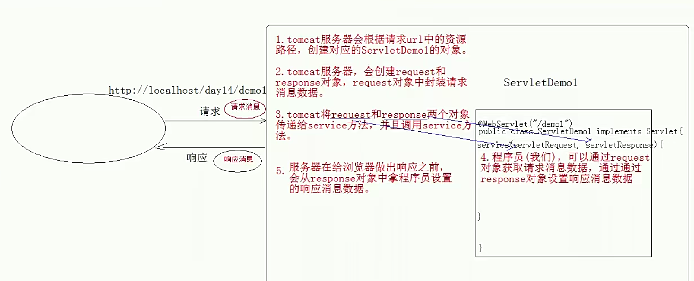

> request和response对象是由服务器创建的。我们来使用它们
>
> request对象是来获取请求消息，response对象是来设置响应消息

## 2、request对象继承体系结构

```java
ServletRequest --	接口		|	继承HttpServletRequest	-- 接口		|	实现org.apache.catalina.connector.RequestFacade 类(在tomcat中已经实现)
```

## 3、request功能

### 获取请求消息数据

#### 获取请求行数据

```http
GET /day14/demo1?name=zhangsan HTTP/1.1
```

方法：

```java
protected void doGet(HttpServletRequest req, HttpServletResponse resp) throws ServletException, IOException {//        1. 获取请求方式 ：GET        String method = req.getMethod();        System.out.println("1.请求方式："+method);//        2. ( *)获取虚拟目录：/day14        String contextPath = req.getContextPath();        System.out.println("2.虚拟目录："+contextPath);//        3. 获取Servlet路径: /demo1        String servletPath = req.getServletPath();        System.out.println("3.获取Servlet路径："+servletPath);//        4. 获取get方式请求参数：name = zhangsan        String queryString = req.getQueryString();        System.out.println("4.获取get方式请求参数："+queryString);//        5. ( *)获取请求URI：/day14 / demo1        String requestURI = req.getRequestURI();        System.out.println("5.获取请求URI："+requestURI);//        6.获取URL        StringBuffer requestURL = req.getRequestURL();        System.out.println("6.获取URL："+requestURL);        //   *URL:        //        统一资源定位符 ：http:        ////localhost/day14/demo1	中华人民共和国        //   *URI：统一资源标识符: /day14 / demo1 共和国        //        7. 获取协议及版本：HTTP / 1.1        String protocol = req.getProtocol();        System.out.println("7.获取协议及版本："+protocol);//        8. 获取客户机的IP地址：        String remoteAddr = req.getRemoteAddr();        System.out.println("8.获取客户机的IP地址："+remoteAddr);    }
```

结果：

```java
1.请求方式：GET2.虚拟目录：/deom033.获取Servlet路径：/req14.获取get方式请求参数：name=daniel&age=225.获取请求URI：/deom03/req16.获取URL：http://localhost/deom03/req17.获取协议及版本：HTTP/1.18.获取客户机的IP地址：0:0:0:0:0:0:0:1
```

#### 获取请求头数据

方法：

```java
Enumeration<String> getHeaderNames();//获取所有的请求头名称String getHeader(String name);//通过请求头的名称获取请求头的值
```

代码：

```java
Enumeration<String> headerNames = req.getHeaderNames();//获取所有的请求头名称while(headerNames.hasMoreElements()){    String name = headerNames.nextElement();    String value = req.getHeader(name);//通过请求头的名称获取请求头的值    System.out.println(name +"-------"+ value);    String header = req.getHeader("user-agent");    System.out.println("浏览器版本："+header);}String header = req.getHeader("user-agent");//直接根据名称获取数据System.out.println("浏览器版本："+header);
```

结果：

```http
host-------localhostconnection-------keep-alivecache-control-------max-age=0sec-ch-ua-------" Not;A Brand";v="99", "Google Chrome";v="91", "Chromium";v="91"sec-ch-ua-mobile-------?0upgrade-insecure-requests-------1user-agent-------Mozilla/5.0 (Windows NT 10.0; Win64; x64) AppleWebKit/537.36 (KHTML, like Gecko) Chrome/91.0.4472.164 Safari/537.36accept-------text/html,application/xhtml+xml,application/xml;q=0.9,image/avif,image/webp,image/apng,*/*;q=0.8,application/signed-exchange;v=b3;q=0.9sec-fetch-site-------nonesec-fetch-mode-------navigatesec-fetch-user-------?1sec-fetch-dest-------documentaccept-encoding-------gzip, deflate, braccept-language-------zh-CN,zh;q=0.9,en-US;q=0.8,en;q=0.7cookie-------JSessionID=2F4046FB1FFF8DE67DC75D2A6316E6C1; Webstorm-c3319098=7063e318-4140-4c1e-955a-37b4e965faea; Idea-26de1407=ca34625f-239c-4782-a600-28a21e369f27浏览器版本：Mozilla/5.0 (Windows NT 10.0; Win64; x64) AppleWebKit/537.36 (KHTML, like Gecko) Chrome/91.0.4472.164 Safari/537.36
```

##### referer防盗链

```java
@WebServlet("/req3")public class RequestDemo3 extends HttpServlet {    @Override    protected void doGet(HttpServletRequest req, HttpServletResponse resp) throws ServletException, IOException {        String referer = req.getHeader("referer");        System.out.println(referer);    }}
```

当直接在浏览器访问时

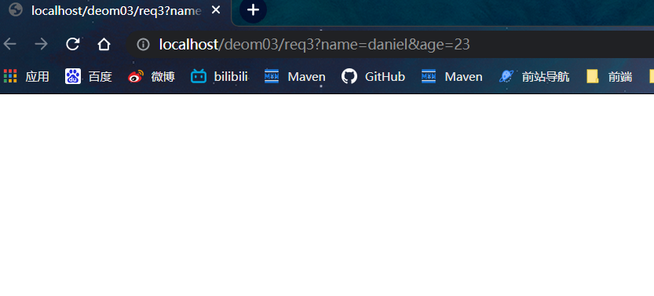

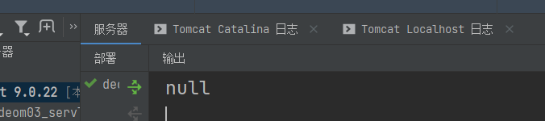

但通过首页访问则：

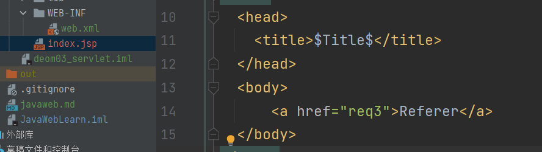

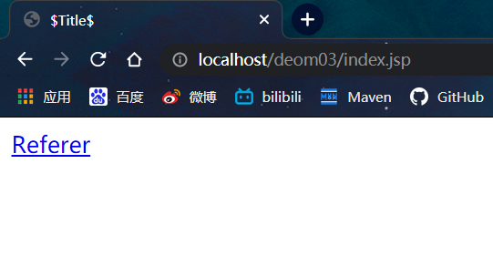

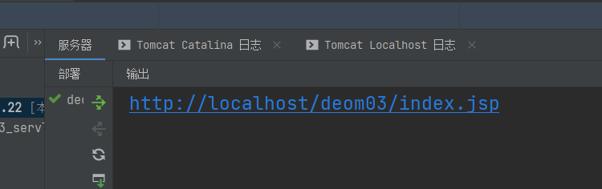

referer标签正是为了告诉请求响应者（被拉取资源的服务端），本次请求的引用页是谁，资源提供端可以分析这个引用者是否“友好”，是否允许其“引用”，对于不允许访问的引用者，可以不提供图片，这样访问者在页面上就只能看到一个图片无法加载的浏览器默认占位的警告图片，甚至服务端可以返回一个默认的提醒勿盗链的提示图片。

一般的站点或者静态资源托管站点都提供防盗链的设置，也就是让服务端识别指定的Referer，在服务端接收到请求时，通过匹配referer头域与配置，对于指定放行，对于其他referer视为盗链。

#### 获取请求体数据:

* 请求体：只有POST请求方式，才有请求体，在请求体中封装了POST请求的请求参数
* 步骤：
  1. 获取流对象

```java
BufferedReader getReader();//获取字符输入流，只能操作字符数据ServletInputStream getInputStream();//获取字节输入流，可以操作所有类型数据，此处不作详细介绍，在文件上传时在作分析
```

html：

```html
<form action="req4" method="post">    <input type="text" name="name">    <input type="password" name="password">    <input type="submit" value="提交"></form>
```

java：

```java
protected void doPost(HttpServletRequest req, HttpServletResponse resp) throws ServletException, IOException {        BufferedReader reader = req.getReader();        String str = null;        while((str=reader.readLine())!=null){            System.out.println(str);        }    }
```

结果

```java
name=daniel&password=123
```

## 	4、 获取请求参数通用方式

不论get还是post请求方式都可以使用下列方法来获取请求参数

```java
String getParameter(String name);//根据参数名称获取参数值    username=zs&password=123String[] getParameterValues(String name);//根据参数名称获取参数值的数组  hobby=xx&hobby=gameEnumeration<String> getParameterNames();//获取所有请求的参数名称Map<String,String[]> getParameterMap();//获取所有参数的map集合
```

代码：

```java
protected void doPost(HttpServletRequest req, HttpServletResponse resp) throws ServletException, IOException {        Enumeration<String> parameterNames = req.getParameterNames();//获取所有参数名称        while (parameterNames.hasMoreElements()){            String s = parameterNames.nextElement();            String val = req.getParameter(s);//根据名称获取值            System.out.println(s+"="+ val);            }        System.out.println("=======获取多选框值");        String[] hobbies = req.getParameterValues("hobby");        for (String hobby : hobbies) {            System.out.println("hobby:"+hobby);        }        System.out.println("=======使用map集合获取参数");        Map<String, String[]> parameterMap = req.getParameterMap();        for (String key : parameterMap.keySet()) {            String[] strings = parameterMap.get(key);            System.out.print(key);            System.out.print("=");            for (String string : strings) {                System.out.print("["+string+"]");            }            System.out.println();        }
```

结果：

```json
name=danielage=124hobby=hobby01=======获取多选框值hobby:hobby01hobby:hobby02=======使用map集合获取参数name=[daniel]age=[124]hobby=[hobby01][hobby02]
```


## 5、中文乱码问题

tomcat 8 已经将get方式乱码问题解决了

但在此之前乱码解决如下：

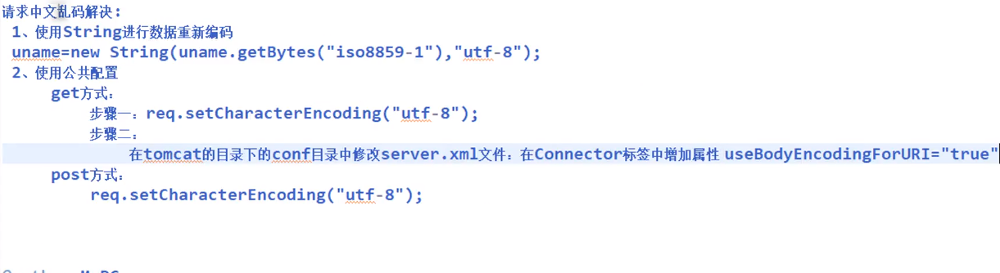

### response乱码处理

设置客户端浏览器的编码格式，在使用response.getWriter()时需要注意默认字符编码为``ISO-8859-1``，如果希望设置字符流的字符编码为``utf-8``，可以使用``response.setCharaceterEncoding(“utf-8”)``来设置。这样可以保证输出给客户端的字符都是使用``UTF-8``编码的！但客户端浏览器并不知道响应数据是什么编码的！如果希望通知客户端使用``UTF-8``来解读响应数据，那么还是使用``response.setContentType("text/html;charset=utf-8")``方法比较好，因为这个方法不只会调用``response.setCharaceterEncoding(“utf-8”)``，还会设置``content-type``响应头，客户端浏览器会使用``content-type``头来解读响应数据。

```java
    protected void doPost(HttpServletRequest req, HttpServletResponse resp) throws ServletException, IOException {//        处理获取到客户端的数据乱码问题        req.setCharacterEncoding("UTF-8");        String name = req.getParameter("name");        System.out.println(name);//        处理输出页面的响应数据乱码问题        resp.setContentType("text/html;charset=utf-8");//        resp.setCharacterEncoding("utf-8");//还是会有乱码        PrintWriter out = resp.getWriter();        out.println("你好，天外来物！！！");    }
```

### **request乱码处理**

**通过字符串String设置字符串的编码格式**

```java
String userName = request.getParameter("userName"); String userPass = request.getParameter("userPass"); String userNameEnco = new String(userName.getBytes("ISO8859-1"),"UTF-8");//设置重新编码格式为UTF-8
```

**设置请求编码格式**

**post方式**

```java
request.setCharacterEncoding("utf-8");//使用该方法即可解决服务器端乱码问题
```

**get方式**

GET请求没有请求体，无法通过request.setCharacterEncoding()来设置参数的编码；

此时可以修改==Tomcat/conf文件下的server.xml==

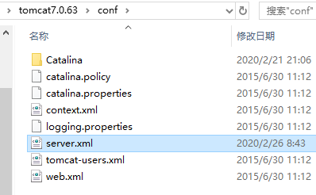

在Connector标签添加属性``useBodyEncodingForURI``为true

``useBodyEncodingForURI="true"``能解决Tomcat后台乱码问题

``useBodyEncodingForURI="true"``

**如下：**

```xml
<Connector port="2119" protocol="HTTP/1.1" connectionTimeout="20000" redirectPort="8443"  useBodyEncodingForURI="true"/>
```

**通过配置jsp中的pageEncoding处理**

```jsp
<%@ page contentType="text/html;charset=UTF-8" pageEncoding="UTF-8" language="java" %>
```

### **pageEncoding**

> 在JSP标准的语法中，如果``pageEncoding``属性存在，那么JSP页面的字符编码方式就由``pageEncoding``决定，否则就由``contentType``属性中的`` charset``决定，如果``charset``也不存在，JSP页面的字符编码方式就采用默认的``ISO-8859-1``。

pageEncoding 是通知``web server jsp``的编码。

关于JSP页面中的``pageEncoding``    和  ``contentType``两种属性的区别：

- ``pageEncoding``是``jsp``文件本身的编码
- ``contentType``的``charset``是指服务器 发送给客户端时的内容编码


## 6、请求转发和请求包含

无论是请求转发还是请求包含，都表示由多个Servlet共同来处理一个请求。例如Servlet1来处理请求，然后Servlet1又转发给Servlet2来继续处理这个请求。 

#### 请求转发 ``forward``

在AServlet中，把请求转发到BServlet：

```java
public class AServlet extends HttpServlet {
    public void doGet(HttpServletRequest request, HttpServletResponse response)
    throws ServletException, IOException {
        System.out.println("AServlet");
        //实现servlet的转发
        RequestDispatcher rd = request.getRequestDispatcher("/BServlet");//请求转发的地址
        rd.forward(request, response);
    }
}
```

```
结果：
Aservlet 
BServlet
```

#### 请求包含  ``include``

在AServlet中，把请求包含到BServlet：

```java
public class BServlet extends HttpServlet {    public void doGet(HttpServletRequest request, HttpServletResponse response)    throws ServletException, IOException {        System.out.println("BServlet");    }}
```

```
结果： Aservlet BServlet
```

#### 请求转发与请求包含比较

如果在AServlet中请求转发到BServlet，那么在==AServlet中就不允许再输出响应体==，即不能再使用``response.getWriter()``和``response.getOutputStream()``向客户端输出，这一工作应该由``BServlet``来完成；

如果是使用请求包含，那么没有这个限制；请求转发虽然不能输出响应体，但还是可以设置响应头的，例如：

```java
response.setContentType("text/html;charset=utf-8");
```

请求包含大多是应用在JSP页面中，完成多页面的合并；

请求转发大多是应用在Servlet中，转发目标大多是JSP页面；

请求转发与重定向比较

- 请求转发是一个请求，而重定向是两个请求；
- 请求转发后浏览器地址栏不会有变化，而重定向会有变化，因为重定向是两个请求；
- 请求转发的目标只能是本应用中的资源，重定向的目标可以是其他应用；
- 请求转发对AServlet和BServlet的请求方法是相同的，即要么都是GET，要么都是POST，因为请求转发是一个请求；
- 重定向的第二个请求一定是GET；

> 注意：forward不但转发请求内容，还把请求的方式也转发了，所以forward的请求是get还是post取决于启用forward的源请求是post方式还是get方式

## 练习：详见案例一：登录练习

# 五、Response对象

## 1、HTTP协议：（详见外部文件：附一 http协议详解.md）

### 请求消息

客户端发送给服务器端的数据

* 数据格式：
  1. 请求行
  2. 请求头
  3. 请求空行
  4. 请求体

### 响应消息

服务器端发送给客户端的数据

* 数据格式：

  #### 	响应行

  ​		组成：协议/版本 响应状态码 状态码描述

  ​		响应状态码：服务器告诉客户端浏览器本次请求和响应的一个状态。

  ​		状态码都是3位数字 

  ​			分类：

  ​			1xx：服务器就收客户端消息，但没有接受完成，等待一段时间后，发送1xx多状态码

  ​			2xx：成功。代表：200

  ​			3xx：重定向。代表：302(重定向)，304(访问缓存)

  ​			4xx：客户端错误。

  ​				代表：

  ​					404（请求路径没有对应的资源） 

  ​					405：请求方式没有对应的doXxx方法

  ​			5xx：服务器端错误。代表：500(服务器内部出现异常)

  #### 	响应头：

  ​		格式：头名称： 值

  ​		常见的响应头：

  ​			Content-Type：服务器告诉客户端本次响应体数据格式以及编码格式

  ​			Content-disposition：服务器告诉客户端以什么格式打开响应体数据

  ​			值：

  ​				in-line:默认值,在当前页面内打开

  ​				attachment;filename=xxx：以附件形式打开响应体。文件下载

  #### 	响应空行

  #### 	响应体

  ​		传输的数据

  ​		响应字符串格式

  ```HTTP
  P/1.1 200 OKContent-Type: text/html;charset=UTF-8Content-Length: 101Date: Wed, 06 Jun 2018 07:08:42 GMT
  ```

  ```HTML
  <html>  	<head>  	   <title>$Title$</title>  	</head>    <body>      hello , response    </body></html>
  ```

  

## 2、Response对象

### 设置响应消息

1. 设置响应行

   1. 格式：HTTP/1.1 200 ok
   2. 设置状态码：setStatus(int sc) 

2. 设置响应头：

   ```java
   setHeader(String name, String value) 
   ```

3. 设置响应体：

  * 使用步骤：
    (1. 获取输出流

    ```java
    字符输出流：PrintWriter getWriter()字节输出流：ServletOutputStream getOutputStream()
    ```

    (2. 使用输出流，将数据输出到客户端浏览器

* 案例：

  1. 完成重定向

    * 重定向：资源跳转的方式

    * 代码实现：
      	

```java
      //1. 设置状态码为302      response.setStatus(302);      //2.设置响应头location      response.setHeader("location","/day15/responseDemo2");      //简单的重定向方法
```

### 重定向的特点:redirect

  > 地址栏发生变化
  >
  > 重定向可以访问其他站点(服务器)的资源
  >
  > 重定向是两次请求。不能使用request对象来共享数据

### 转发的特点：forward

  > 转发地址栏路径不变
  >
  > 转发只能访问当前服务器下的资源
  >
  > 转发是一次请求，可以使用request对象来共享数据

### forward 和  redirect 区别

路径写法：
服务器输出字符数据到浏览器
	步骤：

  1. 获取字符输出流
     . 输出数据

     注意：
     	乱码问题：

     ```java
     PrintWriter pw = response.getWriter();//1.获取的流的默认编码是ISO-8859-1//2. 设置该流的默认编码//3. 告诉浏览器响应体使用的编码
     ```

     简单的形式，设置编码，是在获取流之前设置

     ```java
     response.setContentType("text/html;charset=utf-8");
     ```

     服务器输出字节数据到浏览器
     步骤：

     1. 获取字节输出流
     2. 输出数据

     ### 练习：验证码（详见本笔记案例二：验证码）

     1. 本质：图片
     2. 目的：防止恶意表单注册


## 3、ServletContext对象：

1. 概念：代表整个web应用，可以和程序的容器(服务器)来通信
2. 获取：

  ```java
request.getServletContext();//通过request对象获取this.getServletContext();//通过HttpServlet获取
  ```

3. 功能：
  4. 获取MIME类型：

* MIME类型:==在互联网通信过程中定义的一种文件数据类型==

  * 格式： ==大类型/小类型==   text/html		image/jpeg

    在Tomcat的conf目录下的web.xml中定义了MIME类型的扩展名的对应关系

    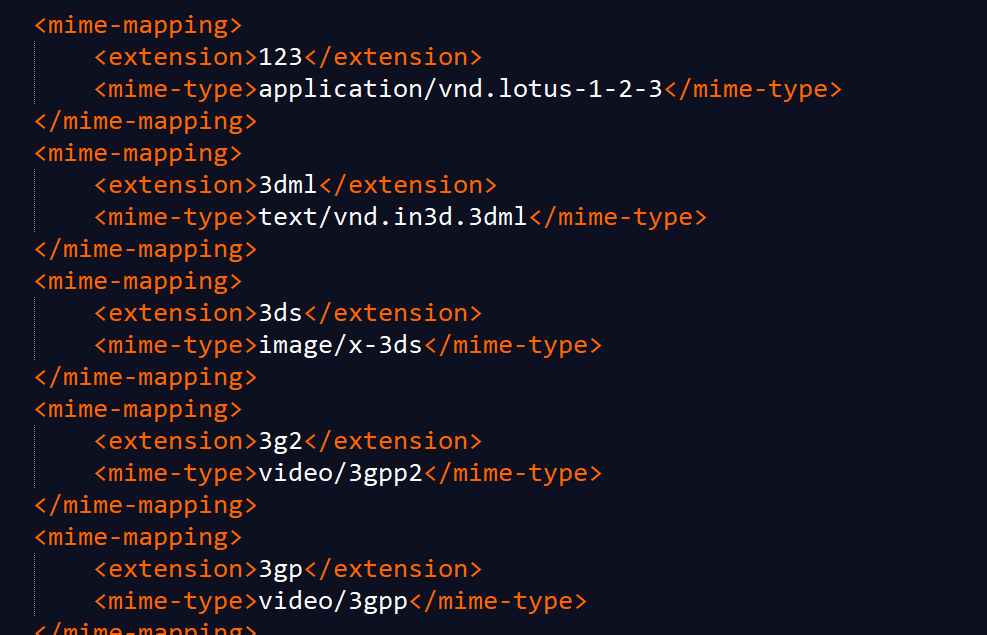

* 获取：

  ```java
  String getMimeType(String file);	    	
  ```

  2. 域对象：共享数据

ServletContext对象范围：==所有用户所有请求的数据==

```java
setAttribute(String name,Object value);getAttribute(String name);removeAttribute(String name);//
```

    3. 获取文件的真实(服务器)路径

```java
//方法：String getRealPath(String path)  String b = context.getRealPath("/b.txt");//web目录下资源访问System.out.println(b);String c = context.getRealPath("/WEB-INF/c.txt");//WEB-INF目录下的资源访问System.out.println(c);String a = context.getRealPath("/WEB-INF/classes/a.txt");//src目录下的资源访问System.out.println(a);
```

#     六、Cookie和Session

## 1、Cookie

### Cookie概念

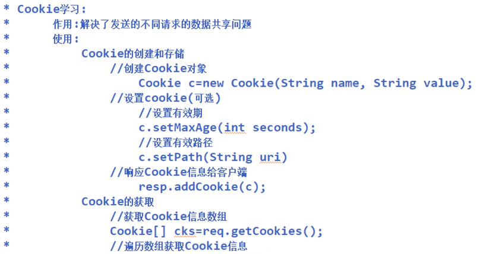

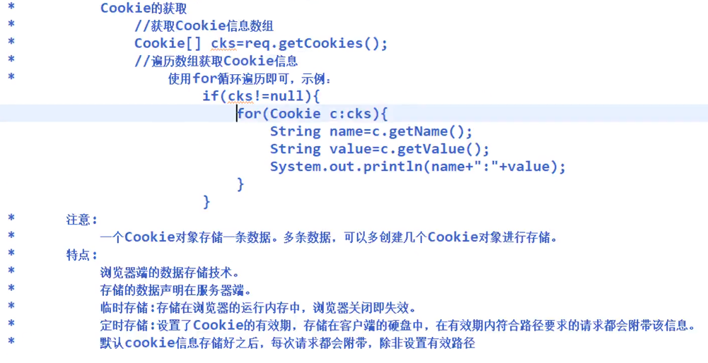

当用户通过浏览器访问Web服务器时，服务器会给客户端发送一些信息，这些信息会保存在Cookie中。这样，当浏览器再次访问服务器时，会在请求头中将Cookie发送给服务器，方便服务器对浏览器做出正确的响应。

==服务器向客户端发送Cookie时，会在HTTP响应头中增加Set-Cookie响应头信息==。``Set-Cookie``头字段中设置的Cookie遵循一定的语法格式，具体如下：

```http
Set-cookie: user=itcast;Path=/;
在上述事例中：
user表示Cookie的名称
itcast表示Cookie的值
Path表示Cookie的属性
```

> ==注意==：Cookie必须以键值对的形式存在，其属性可以有多个，但这些属性之间必须用分号；和空格分隔。

传输过程可用如下图表示：

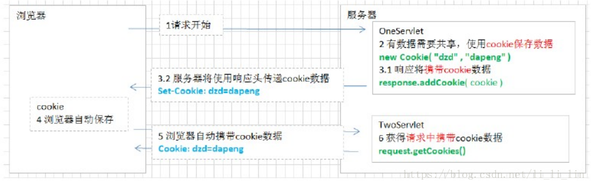

如上图：Cookie的工作原理可这样描述

- 1 首先浏览器向服务器发出请求。
- 2 服务器就会根据需要生成一个Cookie对象，并且把数据保存在该对象内。
- 3 然后把该Cookie对象放在响应头(``通过设置set-cookie头``)，一并发送回浏览器。
- 4 浏览器接收服务器响应后，提出该Cookie保存在浏览器端。
- 5 当下一次浏览器再次访问那个服务器，就会把这个Cookie放在请求头(``请求头中含有Cookie头``)内一并发给服务器。
- 6 服务器从请求头提取出该Cookie，判别里面的数据，然后作出相应的动作。

### Cookie 增删查改 （API方法介绍）

#### 增加Cookie

```java
//1:创建一个Cookie对象 ,只能存非中文的字符串 
Cookie cookie1 = new Cookie("name", "liutao"); 
Cookie cookie2 = new Cookie("age", "35"); //2:将生成的Cookie发送到浏览器 
response.addCookie(cookie1); 
response.addCookie(cookie2);
```

#### 获取Cookie

```java
Cookie[] cookies = request.getCookies();
for (Cookie cookie : cookies) {
    System.out.println(cookie.getName()+" " + cookie.getValue());
}

URLEncoder.encode("盖茨比 ", "UTF-8");//编码
URLDecoder.decode(cookie.getValue(), "UTF-8");//解码
```

#### 设置Cookie中文

```java
//URLEncoder（编码），URLDecoder（解码）
URLEncoder.encode("盖茨比 ", "UTF-8");//编码
URLDecoder.decode(cookie.getValue(), "UTF-8");//解码
```

#### 添加编码Cookie

```java
//对中文进行编码
String str = URLEncoder.encode("盖茨比", "UTF-8");
Cookie cookie = new Cookie("username", str); //"%ED%AC%11%FE" URL编码
response.addCookie(cookie);
```

#### 获取编码Cookie

```java
Cookie[] cookies = request.getCookies();
for (Cookie cookie : cookies) {
    //对中文进行解码
    String str = URLDecoder.decode(cookie.getValue(), "UTF-8");
    System.out.println(cookie.getName()+" " + str);
}
```

#### 删除Cookie

```java
//清除Cookie
Cookie cookie = new Cookie("username", "");
//1:设置访问的路径path,  这里的Path必须和设置Cookie 的路径保持一致
cookie.setPath(request.getContextPath());
//2:设置存活时间
cookie.setMaxAge(0);
//3:将cookie发送到浏览器
response.addCookie(cookie);
```

###

### 设置Cookie持久化时间

```java
cookie.setMaxAge(60*60*24*365*100);
Cookie cookie = new Cookie("username", "baoqiang");
/**
 * 1:默认情况下,Cookie的声明周期是从发送Cookie到浏览器结束
 * 2:如果要对Cookie持久化,必须设置Cookie的存活时间,则Cookie存到硬盘中
 *   setMaxAge(expiry) 单位是秒
 * 3:如果持久化了之后,浏览器关闭之后重启可以重新获取
 **/
cookie.setMaxAge(60*60*24*365*100); //单位是秒约100年
response.addCookie(cookie);
```

### 设置Cookie作用域

```java
cookie.setPath()
Cookie cookie = new Cookie("username", "baoqiang");
//设置Cookie访问路径:path

//1:只要访问同一个Tomcat中所有的项目资源,都会携带Cookie
cookie.setPath("/");
//2:只要访问我当前项目中的所有资源,都会携带Cookie1
cookie.setPath("/day33_01_cookie_Session/");
//3:只要访问我当前项目中的abc目录下所有资源,都会携带Cookie
cookie.setPath("/day33_01_cookie_Session/abc");

//cookie.setPath(request.getContextPath());
response.addCookie(cookie);
```

### 获取不同的作用域下的Cookie

浏览器向客户端访问对应目录下的资源或接口时，会获取到不同的Cookie

客户端请求:

```java
//获取服务端设置有"/day33_01_cookie_Session/"的Cookie 
localhost:8080/day33_01_cookie_Session 
//获取服务端设置有"/day33_01_cookie_Session/abc"的Cookie 
localhost:8080/day33_01_cookie_Session/abc
```

### Cookie的域及最大生命时间

Cookie的属性：

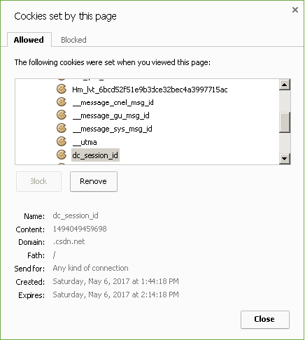

> name：cookie的名字，每个cookie都有一个名字；
>
> content：cookie的值，与名字一起作为键值对形式存在；
>
> domain：域，该cookie的域名，例如左图中是csdn.net，说明当前cookie来自csdn.net;
>
> path：路径，访问csdn.net下该路径时，当前cookie将被发送；
>
> created：cookie被创建的时间；
>
> Expired：cookie失效的时间；

最大生命时间：失效时间和创建时间的时间差，就是cookie的最大生命时间，超过该时间，cookie将失效，不再被发送到相应的域地址；

### 在Servlet中创建Cookie、设置Cookie属性

Servlet规范中定了Cookie类，创建该类对象就可以创建Cookie，并可以调用其中方法为Cookie设置属性；

| 方法声明                                              | 方法描述                                                     |
| ----------------------------------------------------- | ------------------------------------------------------------ |
| Cookie(java.lang.String name, java.lang.String value) | 创建Cookie对象，指定名字和对应的值；                         |
| void setMaxAge(int expiry)                            | 设置最大生命时间（秒），如果不设置，当前浏览器关闭，cookie即失效； |
| void setValue(java.lang.String newValue)              | 设置Cookie的值；                                             |
| setDomain(java.lang.String domain)                    | 设置cookie的域名；                                           |

Servlet规范中定了Cookie类，创建该类对象就可以创建Cookie，并可以调用其中方法为Cookie设置属性；

```java
//创建cookie对象        
Cookie user = new Cookie("user",request.getParameter("user")); 		
Cookie pass = new Cookie("pass", request.getParameter("pass")); 
//设置cookie的生命时间，24小时内有效 		
user.setMaxAge(24*3600); //24H*60min*60s		
pass.setMaxAge(24*3600);
```

### 在响应中设置Cookie信息

要将Cookie保存到客户端，就要通过响应对象；

```java
//将Cookie保存到响应中			   
response.addCookie(user);   
response.addCookie(pass);
```

响应接口中定义了设置Cookie的方法：

| 方法声明                      | 方法描述                             |
| ----------------------------- | ------------------------------------ |
| void addCookie(Cookie cookie) | 将Cookie对象保存到相应的响应对象中； |

在浏览器中访问TestCookieServlet，

```java
http://localhost:2119/dome222/LoginServlet
```

可以查看到locahost保存了两个Cookie信息到客户端：

### 获取请求中的Cookie信息

当访问相同域及路径时，没有超过有效时间的cookie将自动通过请求被发送到网站；

Servlet规范中的请求接口定义了获取Cookie对象的方法：

| 方法声明              | 方法描述                               |
| --------------------- | -------------------------------------- |
| Cookie[] getCookies() | 获取请求中的所有Cookie对象，返回数组； |

```java
//		获取当前请求中的所有Cookie对象 	
Cookie[] cookies=request.getCookies(); 
//		输出所有Cookie的名字和值 	
if(cookies==null){ 		
    out.println("没有Cookie。"); 		
    return; 	
} 	
for(Cookie c:cookies){ 		
    out.println(c.getName()+"="+c.getValue()); 	
}
```

## 2、Session

### Session的概念

除了使用Cookie，Web应用程序中还经常使用``Session``来记录客户端状态 。``Session``是服务器端使用的一种记录客户端状态的机制，使用上比``Cookie``简单一些，相应的也==增加了服务器的存储压力==。当浏览器访问Web服务器时，Servlet容器就会创建一个Session对象和ID属性，当客户端后续访问服务器时，只要将标识号传递给服务器，服务器就能判断该请求是哪个客户端发送的，从而选择与之对应的Session对象为其服务。

> 注意：由于客户端需要接受、记录和回送Session对象的ID，因此，通常情况下，Session是借助Cookie技术来传递ID属性的。

过程如下：

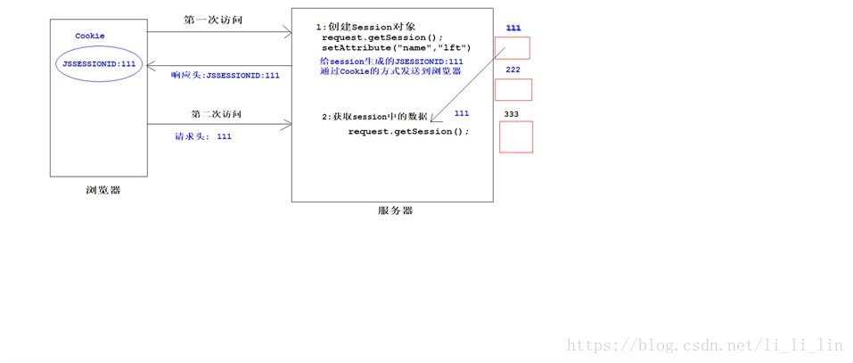

### Session技术的原理

- 1 浏览器发出请求到服务器。 
- 2 服务器会根据需求生成``Session``对象，并且给这个``Session``对象一个编号，一个编号对应一个``Session``对象 
- 3 服务器把需要记录的数据封装到这个``Session``对象里，然后把这个``Session``对象保存下来。 
- 4 服务器把这个``Session``对象的编号放到一个``Cookie``里，随着响应发送给浏览器 
- 5 浏览器接收到这个``cookie``就会保存下来
- 6 当下一次浏览器再次请求该服务器服务，就会发送该``Cookie``
- 7 服务器得到这个``Cookie``，取出它的内容，它的内容就是一个``Session``的编号！！！
- 8 凭借这个``Session``编号找到对应的Session对象，然后利用该``Session``对象把保存的数据取出来！

### Session操作和API（方法介绍）

#### 添加Session

```java
//1: 创建Session对象,并设置值 
HttpSession Session = request.getSession(); 
//服务器上map集合 
Session.setAttribute("username", "liutao");
```

#### 获取Session

```java
//获取Session 
HttpSession Session = request.getSession(); 
Object username = Session.getAttribute("username"); 
System.out.println("username:"+username);
```

#### 获取Session编号ID

```java
String id = Session.getId(); //获取Session的编号Id
```

### Session的生命周期

​	``Session``保存在服务器端。为了获得更高的存取速度，服务器一般把Session放在内存里。每个用户都会有一个独立的``Session``。如果``Session``内容过于复杂，当大量客户访问服务器时可能会导致内存溢出。因此，``Session``里的信息应该尽量精简。

​	``Session``在用户第一次访问服务器的时候自动创建。需要==注意只有访问``JSP``、``Servlet``等程序时才会创建``Session``==，==只访问``HTML``、``IMAGE``等静态资源并不会创建``Session``==。如果尚未生成``Session``，也可以使用``request.getSession(true)``强制生成``Session``。

​	Session生成后，只要用户继续访问，服务器就会更新Session的最后访问时间，并维护该Session。用户每访问服务器一次，无论是否读写Session，服务器都认为该用户的Session“活跃（active）”了一次。

### Session的有效期

​	由于会有越来越多的用户访问服务器，因此Session也会越来越多。为防止内存溢出，服务器会把长时间内没有活跃的Session从内存删除。这个时间就是Session的超时时间。如果超过了超时时间没访问过服务器，Session就自动失效了。

> Session的超时时间为maxInactiveInterval属性，
>
> 可以通过对应的getMaxInactiveInterval()获取，
>
> 通过setMaxInactiveInterval(longinterval)修改。 

Session的超时时间也可以在Tomcat的config目录下的web.xml中修改。

```xml
<Session-config>    
    <Session-timeout>30</Session-timeout> 
</Session-config>
```

> 另外，通过调用Session的invalidate()方法可以使Session失效。

### Session对浏览器的要求

​	虽然Session保存在服务器，对客户端是透明的，它的正常运行仍然需要客户端浏览器的支持。这是因为Session需要使用Cookie作为识别标志。HTTP协议是无状态的，Session不能依据HTTP连接来判断是否为同一客户，因此==服务器向客户端浏览器发送一个名为JSessionID的Cookie，它的值为该Session的id（也就是HttpSession.getId()的返回值）。Session依据该Cookie来识别是否为同一用户。==

​	该Cookie为服务器自动生成的，它的``maxAge``属性一般为``–1``，表示仅当前浏览器内有效，并且各浏览器窗口间不共享，关闭浏览器就会失效。

​	因此同一机器的两个浏览器窗口访问服务器时，会生成两个不同的``Session``。但是由浏览器窗口内的链接、脚本等打开的新窗口（也就是说不是双击桌面浏览器图标等打开的窗口）除外。这类子窗口会共享父窗口的Cookie，因此会共享一个Session。

> 注意：新开的浏览器窗口会生成新的Session，但子窗口除外。==子窗口会共用父窗口的Session==。例如，在链接上右击，在弹出的快捷菜单中选择“在新窗口中打开”时，子窗口便可以访问父窗口的Session。

如果客户端浏览器将Cookie功能禁用，或者不支持Cookie怎么办？例如，绝大多数的手机浏览器都不支持Cookie。

Java Web提供了另一种解决方案：URL地址重写。

实现自定义Session的基本步骤：

Session的实现仍然依靠临时态的Cookie，因此需要定义一个属于自定义Session体系的Cookie名称（如JavaEE应用服务器中常用的JSessionID）

在服务端创建一个Map，用于存放所有的用户会话

当用户访问系统时，检查请求中是否存在以自定义Session体系Cookie名称命名的Cookie信息

如果没有，说明是一个新用户，则为该用户生成一个唯一的SessionId字符串，并在响应中添加该Cookie值（注意不要提供Cookie的生效时间，那么该Cookie即为瞬态的，只在浏览器当前进程中生效）

如果有则查看Map中是否存在该会话，有即获取会话信息，没有说明该会话已经超时，为用户构建一个新的会话

一个用户的会话对象实质上也是一个Map，可以通过键值对的形式存放、获取会话变量

### HttpSession对象的获取

Servlet规范中定义了``HttpSession``接口，用来实现``Session``技术；

要使用HttpSession，首先要获取其对象；请求接口中定义了获取HttpSession对象的方法：

| 方法声明                               | 方法描述                                                     |
| -------------------------------------- | ------------------------------------------------------------ |
| HttpSession getSession()               | 获取与当前请求相关的Session对象，如果不存在，创建一个新的；  |
| HttpSession getSession(boolean create) | 如果create为true，则与getSession()方法相同；如果create是false，则如果不存在，返回null; |

```java
//      获取jsessionid，并输出其值
        Cookie[] cookies=request.getCookies();
        boolean flag=false;
        if(cookies!=null){
        for(Cookie c:cookies){
        	if(c.getName().equals("JSESSIONID")){
        		out.println("JSESSIONID="+c.getValue());
        		flag=true;
        		break;            }        }        }
//      如果不存在jsessionid，则打印提示
        if(flag==false){
        	out.println("当前请求中没有名字为JSESSIONID的cookie");
        }
 //   获取当前Session对象
        HttpSession session=request.getSession();
//      获取当前Session对象的ID
        String id=session.getId();
        out.println("当前会话的ID是："+id);
```

### Session属性的添加、修改、删除及Session失效的方法

#### 为什么要让Session失效？

会话对象是存储在服务器端的对象，一直存在需要占用一定的服务器资源；

会话中往往保存着用户的一些数据，如果一直有效，存在一定安全隐患。

#### Session失效的方法

服务器都有默认的会话失效时间，==Tomcat默认是30分钟==；

可以在web.xml中配置失效时间，例如：配置失效时间是50分钟；

```xml
<Session-config>  
    <Session-timeout>50</Session-timeout> 
</Session-config>
```

| 方法声明                                  | 方法描述                                                     |
| ----------------------------------------- | ------------------------------------------------------------ |
| void setMaxInactiveInterval(int interval) | 为特定的会话对象设定不活动时间，超过这个时间内没有被访问使用，容器自动销毁该会话对象； |
| void invalidate()                         | 立刻销毁调用该方法的会话对象，并把所有绑定到该会话的对象解除绑定； |

## 3、Cookie和Session的区别

### 从存储方式上比较

- ==Cookie只能存储字符串==，==如果要存储非ASCII字符串还要对其编码==；
- Session可以存储任何类型的数据，可以把Session看成是一个容器
- cookie数据存放在客户的浏览器上，Session数据放在服务器上；
- 单个cookie在客户端的限制是3K，就是说一个站点在客户端存放的COOKIE不能超过3K；

### 从隐私安全上比较

- Cookie存储在浏览器中，对客户端是可见的。信息容易泄露出去。如果使用Cookie，最好将Cookie加密
- Session存储在服务器上，对客户端是透明的。不存在敏感信息泄露问题。

### 从有效期上比较

- Cookie保存在硬盘中，只需要设置maxAge属性为比较大的正整数，即使关闭浏览器，Cookie还是存在的
- Session的保存在服务器中，设置maxInactiveInterval属性值来确定Session的有效期。并且Session依赖于名为JSessionID的Cookie，该Cookie默认的maxAge属性为-1。如果关闭了浏览器，该Session虽然没有从服务器中消亡，但也就失效了。

### 从对服务器的负担比较

- Session是保存在服务器的，每个用户都会产生一个Session，如果是并发访问的用户非常多，是不能使用Session的，Session会消耗大量的内存。
- Cookie是保存在客户端的。不占用服务器的资源。像baidu、Sina这样的大型网站，一般都是使用Cookie来进行会话跟踪。

### 从浏览器的支持上比较

- 如果浏览器禁用了Cookie，那么Cookie是无用的了
- 如果浏览器禁用了Cookie，Session可以通过URL地址重写来进行会话跟踪。
- 从跨域名上比较 
- Cookie可以设置domain属性来实现跨域名 
- Session只在当前的域名内有效，不可夸域名

# 七、  ServletContext

##   1.介绍  

  ServletContext官方叫servlet上下文。服务器会为每一个工程创建一个对象，这个对象就是ServletContext对象。这个对象全局唯一，而且工程内部的所有servlet都共享这个对象    。所以叫全局应用程序共享对象。  

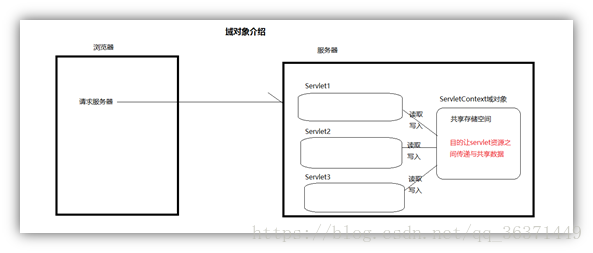

###   1.2. 作用  

>   1.   是一个域对象  
>
>   2.   可以读取全局配置参数  
>
>   3.   可以搜索当前工程目录下面的资源文件  
>
>   4.   可以获取当前工程名字（了解）  

##   2.servletContext  使用

###   2.1获取方式 

```java
/*获取全局属性*/ 
/*方法一*/ 
ServletContext sc = this.getServletContext(); 
/*方法二*/ 
ServletContext sc2 = this.getServletConfig().getServletContext(); 
/*方法三*/ 
ServletContext sc3 = req.getSession().getServletContext();
```

###   2.2在web.xml中配置全局变量 

```xml
<!--配置全局变量--> 
<context-param>   
    <!--注意一个context-param只能配置一个键值对-->    
    <param-name>name</param-name>    
    <param-value>张三</param-value> 
</context-param>
```

###   2.3servlet获取xml中的全局变量

```java
/*获取xml中的全局属性*/
ServletContext sc = this.getServletContext();
String name = sc.getInitParameter("name");//如果数据不存在则返回null
Enumeration<String> names = sc.getInitParameterNames();//返回键名的枚举
System.out.println(name);//张三 
```

##   3. servletContext是一个域对象

###  3.1域对象介绍

  域对象是服务器在内存上创建的存储空间，用于在不同动态资源（servlet）之间传递与共享数据。  

###  3.2域对象方法

 凡是域对象都有如下3个方法：  

```java
setAttribute(name,value);//name是String类型，value是Object类型；
```

 往域对象里面添加数据，添加时以key-value形式添加  

```java
getAttribute(name);
```

 根据指定的key读取域对象里面的数据  

```java
removeAttribute(name);
```

 根据指定的key从域对象里面删除数据  

###  3.3域对象功能代码

 域对象存储数据AddDataServlet代码  

```java
/**
      * doGet
*/
publicvoid doGet(HttpServletRequest request, HttpServletResponse response)
    throws ServletException, IOException {
    //往serlvetContext里面存数据        
    //1.获取ServletContext对象
    //getServletContext()
    //2.往对象里面设置数据
    getServletContext().setAttribute("username", "admin");        
    response.getOutputStream().write("用户名写入到servletContext成功".getBytes());
} 
```

 获取域对象数据GetDataServlet代码 

```java
publicvoid doGet(HttpServletRequest request, HttpServletResponse response)
    throws ServletException, IOException {        
    //获取ServletContext里面的用户名数据
    Object valueObject = getServletContext().getAttribute("username");
    if(valueObject!=null){
        response.getOutputStream().write(("从servletContext读取到的用户名数据："+valueObject.toString()).getBytes());
    }
}
```

###  4.servletContext存储数据特点

全局共享，里面的数据所有动态资源都可以写入和获取 
服务器启动的时候创建，服务器关闭的时候销毁，因为这是全局应用程序对象，全局共享对象。

####  4.1可以读取全局配置参数 

#####  4.1.1servletContext读取全局参数核心方法 

```java
getServletContext().getInitParameter(name);//根据指定的参数名获取参数值 
getServletContext().getInitParameterNames();//获取所有参数名称列表
```

####  4.2实现步骤：

 在web.xml中配置全局参数 

```xml
<!-- 全局配置参数，因为不属于任何一个servlet，但是所有的servlet都可以通过servletContext读取这个数据 -->
<context-param>
    <param-name>param1</param-name>
    <param-value>value1</param-value>
</context-param>
<context-param>
    <param-name>param2</param-name>
    <param-value>value2</param-value>
</context-param>
```

 在动态资源servlet里面使用servletcontext读取全局参数代码 

```java
public void doGet(HttpServletRequest request, HttpServletResponse response)
    throws ServletException, IOException {
    //使用servletContext读取全局配置参数数据
    //核心方法
    /*getServletContext().getInitParameter(name);//根据指定的参数名获取参数值
           getServletContext().getInitParameterNames();//获取所有参数名称列表*/
    //打印所有参数
    //1.先获取所有全局配置参数名称
    Enumeration<String> enumeration =  getServletContext().getInitParameterNames();
    //2.遍历迭代器
    while(enumeration.hasMoreElements()){
        //获取每个元素的参数名字
        String parameName = enumeration.nextElement();
        //根据参数名字获取参数值
        String parameValue = getServletContext().getInitParameter(parameName);
        //打印
        System.out.println(parameName+"="+parameValue);
    }
}
```

###  5.可以搜索当前工程目录下面的资源文件

 核心方法 

```java
getServletContext().getRealPath(path);//根据相对路径获取服务器上资源的绝对路径 
getServletContext().getResourceAsStream(path);//根据相对路径获取服务器上资源的输入字节流
```

 可以获取当前工程名字 

​     作用：获取当前工程名字 

```java
publicvoid doGet(HttpServletRequest request, HttpServletResponse response)    
    throws ServletException, IOException {     
    //获取工程名字
    getServletContext().getContextPath();
    response.getOutputStream().write(("工程名字："+getServletContext().getContextPath()).getBytes());  
}
```

# 八、ServletConfig

## 1.ServletConfig的作用

 用于加载Servlet的初始化参数，在一个web应用可以存在多个ServletConfig对象 ，  一个Servlet对应一个ServletConfig对象。 

 ServletConfig创建时机及如何得到  

>  创建时机：在创建完Servlet对象之后，调用init方法之前创建。  
>
>  得到对象：直接从有参数的init方法中得到。  

## 2.Servlet  的初始化参数配置

```xml
<servlet>
    <servlet-name>ConfigServlet</servlet-name>
    <servlet-class>ysdrzp.config.ConfigServlet</servlet-class>
    <!--配置参数,注意只能在servlet内配置-->
    <init-param>
        <param-name>aaa</param-name>
        <param-value>value of aaa</param-value>
    </init-param>
    <init-param>
        <param-name>bbb</param-name>
        <param-value>value of bbb</param-value>
     </init-param>
</servlet>
<servlet-mapping>
     <servlet-name>ConfigServlet</servlet-name>
     <url-pattern>/configServlet</url-pattern>
</servlet-mapping>
```

## 3.ConfigServlet

```java
public class ConfigServlet extends HttpServlet {

    /**以下两段代码GenericServlet已经在父类写了，我们无需编写.*/
    //private ServletConfig config;

    /**
     *  1）tomcat服务器把那些初始化参数在加载web应用的时候，封装到ServletConfig对象中
     *  2）tomcat服务器调用init方法传入ServletConfig对象
     */
    /*@Override
    public void init(ServletConfig config) throws ServletException {
        this.config = config;
    }*/

    @Override
    public void doGet(HttpServletRequest request, HttpServletResponse response) throws ServletException, IOException {

        //查询当前servlet的所有初始化参数
        Enumeration<String> enums = this.getServletConfig().getInitParameterNames();
        while(enums.hasMoreElements()){
            String paramName = enums.nextElement();
            /*获取配置数据*/
            String paramValue = this.getServletConfig().getInitParameter(paramName);
            System.out.println(paramName+"="+paramValue);
        }

        //得到servlet的名称
        String servletName = this.getServletConfig().getServletName();
        System.out.println(servletName);
    }
}
```

>  ==注意==： Servlet的初始化参数只能由当前的这个Sevlet获取。**

# 案例一：登录

## 1、环境搭建

所需jar包如下：

```java
//连接池
c3p0-0.9.5.5.jar
druid-1.2.6.jar
//javabean映射工具类
commons-beanutils-1.9.4.jar
commons-logging-1.2.jar
hamcrest-core-1.3.jar
//servlet相关包
javax.annotation.jar
javax.ejb.jar
javax.jms.jar
javax.persistence.jar
javax.resource.jar
javax.servlet.jar
javax.servlet.jsp.jar
javax.servlet.jsp.jstl.jar
javax.transaction.jar
//单元测试
junit-4.13.2.jar
mchange-commons-java-0.2.19.jar
//mysql数据库连接
mysql-connector-java-8.0.16.jar
//spring相关包
spring-beans-5.3.8.jar
spring-core-5.3.8.jar
spring-jdbc-5.3.8.jar
spring-tx-5.3.8.jar
```

``druid.properties``  配置如下：

> 注意将druid.properties配置文件放到src目录下。

```properties
#驱动加载
driverClassName=com.mysql.cj.jdbc.Driver
#注册驱动
url=jdbc:mysql://127.0.0.1:3306/javawebdata?serverTimezone=UTC
#连接数据库的用户名
username=root
#连接数据库的密码
password=201710262118
#属性类型的字符串，通过别名的方式配置扩展插件， 监控统计用的stat 日志用log4j 防御sql注入:wall
filters=stat
#初始化时池中建立的物理连接个数。
initialSize=2
#最大的可活跃的连接池数量
maxActive=300
#获取连接时最大等待时间，单位毫秒，超过连接就会失效。配置了maxWait之后，缺省启用公平锁，并发效率会有所下降， 如果需要可以通过配置useUnfairLock属性为true使用非公平锁。
maxWait=60000
#连接回收器的运行周期时间，时间到了清理池中空闲的连接，testWhileIdle根据这个判断
timeBetweenEvictionRunsMillis=60000
minEvictableIdleTimeMillis=300000
#用来检测连接是否有效的sql，要求是一个查询语句。
#validationQuery=SELECT 1
#建议配置为true，不影响性能，并且保证安全性。 申请连接的时候检测，如果空闲时间大于timeBetweenEvictionRunsMillis， 执行validationQuery检测连接是否有效。
testWhileIdle=true
#申请连接时执行validationQuery检测连接是否有效，做了这个配置会降低性能。设置为false
testOnBorrow=false
#归还连接时执行validationQuery检测连接是否有效，做了这个配置会降低性能,设置为flase
testOnReturn=false
#是否缓存preparedStatement，也就是PSCache。
poolPreparedStatements=false
#池中能够缓冲的preparedStatements语句数量
maxPoolPreparedStatementPerConnectionSize=200
```

## 2、数据库

数据库表创建

```sql
-- 建表语句
CREATE TABLE user_account(
	acctid int(5) not null PRIMARY KEY auto_increment,
	acctNum varchar(50),
	acctPwd varchar(50)	
)ENGINE=INNODB charset=utf8 auto_increment=10001;
-- 插入语句
INSERT INTO user_account VALUES(DEFAULT,'daniel','123456');
INSERT INTO user_account VALUES(DEFAULT,'sxgan','666666');
INSERT INTO user_account VALUES(DEFAULT,'test1','123');
INSERT INTO user_account VALUES(DEFAULT,'test2','123456');
INSERT INTO user_account VALUES(DEFAULT,'test3','123456');
```

## 3、前端页面

html编写

```html
<form  action="login" method="post">
        账号：<input type="text" name="acctNum"><br>
        密码：<input type="password" name="acctPwd">
        <input type="submit" value="登录">
    </form>
```

## 4、后端

数据访问层

加载配置文件，创建连接池

```java
package com.sxgan.dao;

public class JDBCUtils {
    private static DataSource ds;
    
    static {
        Properties properties = new Properties();
        InputStream in = JDBCUtils.class.getClassLoader().getResourceAsStream("druid.properties");
        try {
            properties.load(in);
            ds = DruidDataSourceFactory.createDataSource(properties);
        } catch (IOException e) {
            e.printStackTrace();
        } catch (Exception e) {
            e.printStackTrace();
        }
    }
    //获取DataSource
    public static DataSource getDataSource() {
        return ds;
    }
}
```

编写Dao层，用于查询用户登录时的账号密码，此处使用``JdbcTemplate``来处理

```java
package com.sxgan.dao;

public class UserDao {
    public UserAccount checkLogin(UserAccount userAccount) {
        JdbcTemplate jdbcTemplate = new JdbcTemplate(JDBCUtils.getDataSource());
        UserAccount newUserAcct = null;
        System.out.println(userAccount.toString());
        try {
            String sql = "select * from user_account where acctNum=? and acctPwd=?";
            newUserAcct = jdbcTemplate.queryForObject(sql, new BeanPropertyRowMapper<UserAccount>(UserAccount.class), userAccount.getAcctNum(), userAccount.getAcctPwd());
        } catch (Exception e) {
            e.printStackTrace();
        }
        return newUserAcct;
    }
}

```

编写实体类，

```java
package com.sxgan.domain;

public class UserAccount {
    private Integer acctId;
    private String acctNum;
    private String acctPwd;
   	//此处省略构造方法、getter，setter方法toString方法
}

```

==注意：此处的实体类名应与数据库字段名相同，这样可以避免手动进行映射，同时前端如果传递参数需要进行封装时最好将获取的name值与实体类中的属性名相同，防止使用BeanUtils工具类时出现数据为空的情况。==

编写LoginServlet

```java
package com.sxgan.servlet;

@WebServlet("/login")
public class LoginServlet extends HttpServlet {
    @Override
    protected void doPost(HttpServletRequest req, HttpServletResponse resp) throws ServletException, IOException {
        req.setCharacterEncoding("utf-8");
        resp.setContentType("text/html;utf-8");
        Map<String, String[]> parameterMap = req.getParameterMap();//获取所有请求数据
        UserAccount userAccount = new UserAccount();
        try {
            BeanUtils.populate(userAccount, parameterMap);//使用BeanUtils进行封装为对象
        } catch (IllegalAccessException e) {
            e.printStackTrace();
        } catch (InvocationTargetException e) {
            e.printStackTrace();
        }
        UserDao userDao = new UserDao();
        UserAccount newUserAccount = userDao.checkLogin(userAccount);//调用dao层方法获取返回值
        if (newUserAccount != null) {
            req.setAttribute("newUserAccout", newUserAccount);
            req.getRequestDispatcher("success").forward(req, resp);
        } else {
            req.getRequestDispatcher("defeat").forward(req, resp);
        }
    }
}

```

编写跳转的servlet

成功

```java
package com.sxgan.servlet;

@WebServlet("/success")
public class SuccessServlet extends HttpServlet {
    @Override
    protected void doPost(HttpServletRequest req, HttpServletResponse resp) throws ServletException, IOException {
        resp.setContentType("text/html;charset=utf-8");
        PrintWriter writer = resp.getWriter();
        
        UserAccount newUserAccout = (UserAccount) req.getAttribute("newUserAccout");
        System.out.println(newUserAccout.toString());
        writer.println("页面成功展示，登录成功！！欢迎："+newUserAccout.getAcctNum());
    }
}

```

失败

```java
package com.sxgan.servlet;

@WebServlet("/defeat")
public class DefeatServlet extends HttpServlet {
    @Override
    protected void doPost(HttpServletRequest req, HttpServletResponse resp) throws ServletException, IOException {
        resp.setContentType("text/html;charset=utf-8");
        PrintWriter writer = resp.getWriter();
        writer.println("页面成功展示，登录失败！！");
    }
}

```

# 案例二：验证码

## 编写验证码类

``VerifyCode.java`` 此类用于返回验证码及其文本

```java
import java.awt.*;
import java.awt.image.BufferedImage;
import java.util.Random;

public class VerifyCode {
    private int w = 100;
    private int h = 50;
    private Random r = new Random();
    // {"宋体", "华文楷体", "黑体", "华文新魏", "华文隶书", "微软雅黑", "楷体_GB2312"}
    private String[] fontNames  = {"宋体", "华文楷体", "黑体", "微软雅黑", "楷体_GB2312"};
    // 可选字符
    private String codes  = "1234567890abcdefghjkmnopqrstuvwxyzABCDEFGHJKMNPQRSTUVWXYZ";
    // 背景色
    private Color bgColor  = new Color(255, 255, 255);
    // 验证码上的文本
    private String text ;
    
    // 生成随机的颜色
    private Color randomColor () {
        int red = r.nextInt(150);
        int green = r.nextInt(150);
        int blue = r.nextInt(150);
        return new Color(red, green, blue);
    }
    
    // 生成随机的字体
    private Font randomFont () {
        int index = r.nextInt(fontNames.length);
        String fontName = fontNames[index];//生成随机的字体名称
        int style = r.nextInt(4);//生成随机的样式, 0(无样式), 1(粗体), 2(斜体), 3(粗体+斜体)
        int size = r.nextInt(5) + 24; //生成随机字号, 24 ~ 28
        return new Font(fontName, style, size);
    }
    
    // 画干扰线
    private void drawLine (BufferedImage image) {
        int num  = 3;//一共画3条
        Graphics2D g2 = (Graphics2D)image.getGraphics();
        for(int i = 0; i < num; i++) {//生成两个点的坐标，即4个值
            int x1 = r.nextInt(w);
            int y1 = r.nextInt(h);
            int x2 = r.nextInt(w);
            int y2 = r.nextInt(h);
            g2.setStroke(new BasicStroke(1.5F));
            g2.setColor(Color.BLUE); //干扰线是蓝色
            g2.drawLine(x1, y1, x2, y2);//画线
        }
    }
    
    // 随机生成一个字符
    private char randomChar () {
        int index = r.nextInt(codes.length());
        return codes.charAt(index);
    }
    
    // 创建BufferedImage
    private BufferedImage createImage () {
        BufferedImage image = new BufferedImage(w, h, BufferedImage.TYPE_INT_RGB);
        Graphics2D g2 = (Graphics2D)image.getGraphics();
        g2.setColor(this.bgColor);
        g2.fillRect(0, 0, w, h);
        return image;
    }
    
    /**
     * 调用这个方法得到验证码
      */
    public BufferedImage getImage () {
        BufferedImage image = createImage();//创建图片缓冲区
        Graphics2D g2 = (Graphics2D)image.getGraphics();//得到绘制环境
        StringBuilder sb = new StringBuilder();//用来装载生成的验证码文本
        // 向图片中画4个字符
        for(int i = 0; i < 4; i++)  {//循环四次，每次生成一个字符
            String s = randomChar() + "";//随机生成一个字母
            sb.append(s); //把字母添加到sb中
            float x = i * 1.0F * w / 4; //设置当前字符的x轴坐标
            g2.setFont(randomFont()); //设置随机字体
            g2.setColor(randomColor()); //设置随机颜色
            g2.drawString(s, x, h-5); //画图
        }
        this.text = sb.toString(); //把生成的字符串赋给了this.text
        drawLine(image); //添加干扰线
        return image;
    }
    
    // 返回验证码图片上的文本
    public String getText () {
        return text;
    }
}
```

## 使用servlet调用验证码（``CheckCodeServlet.java``）

```java
import javax.imageio.ImageIO;@WebServlet("/check")public class CheckCodeServlet extends HttpServlet {    @Override    protected void doPost(HttpServletRequest req, HttpServletResponse resp) throws ServletException, IOException {        VerifyCode vc = new VerifyCode();        BufferedImage bi = vc.getImage();//获取验证码BufferedImage对象        System.out.println(vc.getText());//获取验证码文本        ImageIO.write(bi,"jpg",resp.getOutputStream());    }        @Override    protected void doGet(HttpServletRequest req, HttpServletResponse resp) throws ServletException, IOException {        doPost(req, resp);    }}
```

# 案例三：javaweb文件下载

## html

```html
 <body>        <a href="/demo06/img/154067.jpg">展示图片</a>        <hr>        <a href="/demo06/download?filename=154067.jpg">下载图片</a>        <a href="/demo06/download?filename=王乔熙.jpg">下载图片</a>    </body>
```

## 中文文件名乱码工具类

此类需要传入头信息``user-agent``和 文件名

```java
public class DownLoadUtils {        public static String getFileName(String agent, String filename) throws UnsupportedEncodingException {        if (agent.contains("MSIE")) {            // IE浏览器            filename = URLEncoder.encode(filename, "utf-8");            filename = filename.replace("+", " ");        } else if (agent.contains("Firefox")) {            // 火狐浏览器            BASE64Encoder base64Encoder = new BASE64Encoder();            filename = "=?utf-8?B?" + base64Encoder.encode(filename.getBytes("utf-8")) + "?=";        } else {            // 其它浏览器            filename = URLEncoder.encode(filename, "utf-8");        }        return filename;    }}
```

## ``DownloadServlet.java`` 文件下载的servlet

```java
package com.sxgan.down;@WebServlet("/download")public class DownloadServlet extends HttpServlet {    @Override    protected void doGet(HttpServletRequest req, HttpServletResponse resp) throws ServletException, IOException {        //0.设置请求参数编码        req.setCharacterEncoding("UTF-8");        //1.获取请求参数，文件名称        String filename = req.getParameter("filename");        //2.使用字节输入流加载文件进内存        //2.1找到文件服务器路径        ServletContext servletContext = this.getServletContext();        String realPath = servletContext.getRealPath("/img/" + filename);        //2.2用字节流关联        FileInputStream fin = new FileInputStream(realPath);        //3.设置response的响应头        //3.1设置响应头类型：Content-Type        String mimeType = servletContext.getMimeType(filename);        resp.setHeader("Content-Type",mimeType);        //3.2设置响应头打开方式:content-disposition        //解决中文文件名问题        //获取user-agent请求头        String agent = req.getHeader("user-agent");        //使用工具类方法编码文件名即可        filename = DownLoadUtils.getFileName(agent, filename);        resp.setHeader("Content-Disposition","attachment;filename="+filename);        //4.将输入流的数据写出到输出流中        ServletOutputStream out = resp.getOutputStream();        byte [] buff = new byte[1024*8];        int len = 0;        while((len = fin.read(buff))!=-1){            out.write(buff,0,len);        }                fin.close();    }}
```

