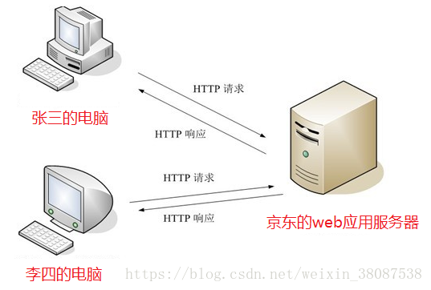
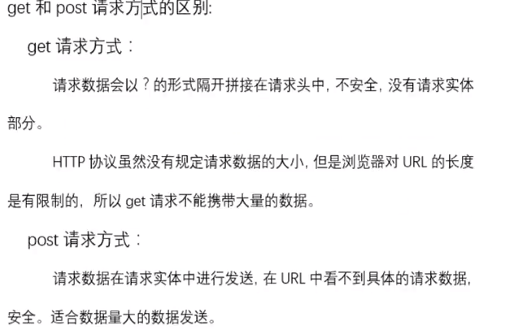

# Http协议简介

超文本传输协议（HTTP ，HyperText Transfer Protocol)是互联网上应用最为广泛的一种网络协议。所有的WWW文件都必须遵守这个标准。设计HTTP最初的目的是为了提供一种发布和接收HTML页面的方法。1960年美国人Ted Nelson构思了一种通过计算机处理文本信息的方法，并称之为超文本（hypertext）,这成为了HTTP超文本传输协议标准架构的发展根基。Ted Nelson组织协调万维网协会（World Wide Web Consortium）和互联网工程工作小组（Internet Engineering Task Force ）共同合作研究，最终发布了一系列的RFC，其中著名的RFC 2616定义了HTTP 1.1。

# http协议的作用及特点

HTTP是一个客户端和服务器端请求和应答的标准（TCP）。客户端是终端用户，服务器端是网站。通过使用Web浏览器、网络爬虫或者其它的工具，客户端发起一个到服务器上指定端口（默认端口为80）的HTTP请求。（我们称这个客户端）叫用户代理（user agent）。应答的服务器上存储着（一些）资源，比如HTML文件和图像。（我们称）这个应答服务器为源服务器（origin server）。在用户代理和源服务器中间可能存在多个中间层，比如代理，网关，或者隧道（tunnels）。尽管TCP/IP协议是互联网上最流行的应用，HTTP协议并没有规定必须使用它和（基于）它支持的层。 事实上，HTTP可以在任何其他互联网协议上，或者在其他网络上实现。HTTP只假定（其下层协议提供）可靠的传输，任何能够提供这种保证的协议都可以被其使用。

通常，由HTTP客户端发起一个请求，建立一个到服务器指定端口（默认是80端口）的TCP连接。HTTP服务器则在那个端口监听客户端发送过来的请求。一旦收到请求，服务器（向客户端）发回一个状态行，比如"HTTP/1.1 200 OK"，和（响应的）消息，消息的消息体可能是请求的文件、错误消息、或者其它一些信息。HTTP使用TCP而不是UDP的原因在于（打开）一个网页必须传送很多数据，而TCP协议提供传输控制，按顺序组织数据，和错误纠正。

通过HTTP或者HTTPS协议请求的资源由统一资源标示符（Uniform Resource Identifiers）（或者，更准确一些，URLs）来标识。

特点

- 1.基于请求/响应模型的协议。请求和响应必须成对，先有请求后有响应
- 2.http协议默认端口:`80`
- 3.简单快速：客户向服务器请求服务时，只需传送请求方法和路径。请求方法常用的有GET、HEAD、POST。每种方法规定了客户与服务器联系的类型不同。由于HTTP协议简单，使得HTTP服务器的程序规模小，因而通信速度很快。
- 4.灵活：HTTP允许传输任意类型的数据对象。正在传输的类型由Content-Type加以标记。
- 5.无连接：无连接的含义是限制每次连接只处理一个请求。服务器处理完客户的请求，并收到客户的应答后，即断开连接。采用这种方式可以节省传输时间。但在HTTP1.1之后一次请求不会立即关闭
- 6.无状态：HTTP协议是无状态协议。无状态是指协议对于事务处理没有记忆能力。缺少状态意味着如果后续处理需要前面的信息，则它必须重传，这样可能导致每次连接传送的数据量增大。另一方面，在服务器不需要先前信息时它的应答就较快。

## 常用端口号

1，HTTP服务器，默认端口号为80/tcp（木马Executor开放此端口）
		2，HTTPS（securely transferring web pages）服务器，默认端口号为443/tcp  443/udp
		3，HTTP协议代理服务器常用端口号：80/8080/3128/8081/9098
		4，SOCKS代理协议服务器常用端口号：1080
		5，FTP（文件传输）协议代理服务器常用端口号：21
		6，Telnet（远程登录）协议代理服务器常用端口号：23

## 协议功能

HTTP协议（HyperText Transfer Protocol，超文本传输协议）是用于从WWW服务器传输超文本到本地浏览器的传输协议。它可以使浏览器更加高效，使网络传输减少。它不仅保证计算机正确快速地传输超文本文档，还确定传输文档中的哪一部分，以及哪部分内容首先显示(如文本先于图形)等。

HTTP是客户端浏览器或其他程序与Web服务器之间的应用层通信协议。在Internet上的Web服务器上存放的都是超文本信息，客户机需要通过HTTP协议传输所要访问的超文本信息。HTTP包含命令和传输信息，不仅可用于Web访问，也可以用于其他因特网/内联网应用系统之间的通信，从而实现各类应用资源超媒体访问的集成。

我们在浏览器的地址栏里输入的网站地址叫做URL (Uniform Resource Locator，统一资源定位符)。就像每家每户都有一个门牌地址一样，每个网页也都有一个Internet地址。当你在浏览器的地址框中输入一个URL或是单击一个超级链接时，URL就确定了要浏览的地址。浏览器通过超文本传输协议(HTTP)，将Web服务器上站点的网页代码提取出来，并翻译成漂亮的网页

# Http协议的组成

Http协议由Http请求和Http响应组成，当在浏览器中输入网址访问某个网站时， 你的浏览器会将你的请求封装成一个Http请求发送给服务器站点，服务器接收到请 求后会组织响应数据封装成一个Http响应返回给浏览器。即没有请求就没有响应。



http请求包括:请求行、请求头、请求体

http响应包括:响应行、响应头、响应体

### HTTP请求报文

HTTP请求报文由3部分组成（请求行+请求头+请求体）：



请求行：

例如：POST /chapter17/user.html HTTP/1.1

格式：请求方式 资源路径 协议/版本

请求行必须在http请求格式的第一行。

### HTTP1.0

#### get请求:

将请求参数追加在url后面，不安全

url长度限制get请求方式数据的大小

没有请求体

一般的HTTP请求大多都是GET。

#### post请求：

请求参数在请求体处，较安全。

请求数据大小没有显示

只有表单设置为method=“post”才是post请求，其他都是get请求

常见get请求:地址栏直接访问、<a href="">、等


#### HEAD请求:

HEAD跟GET相似，不过服务端接收到HEAD请求时只返回响应头，不发送响应内容。所以，如果只需要查看某个页面的状态时，用HEAD更高效，因为省去了传输页面内容的时间。

### HTTP1.1之后新增五种请求

#### DELETE请求：

删除某一个资源。

#### OPTIONS请求：

用于获取当前URL所支持的方法。若请求成功，会在HTTP头中包含一个名为“Allow”的头，值是所支持的方法，如“GET, POST”。

#### PUT请求：

把一个资源存放在指定的位置上。

本质上来讲， PUT和POST极为相似，都是向服务器发送数据，但它们之间有一个重要区别，PUT通常指定了资源的存放位置，而POST则没有，POST的数据存放位置由服务器自己决定。

#### TRACE请求：

回显服务器收到的请求，主要用于测试或诊断。

#### CONNECT请求：

CONNECT方法是HTTP/1.1协议预留的，能够将连接改为管道方式的代理服务器。通常用于SSL加密服务器的链接与非加密的HTTP代理服务器的通信。

请求头:

例如：Host: 39.108.107.149:8080

请求头从第二行开始，到第一个空格结束。请求头和请求体之间存在一个空格(如下)

```http
POST http://39.108.107.149:8080/vk/app/rest/ddp/iModelServiceImpl/findModelByType HTTP/1.1
User-Agent: Fiddler
Host: 39.108.107.149:8080
Content-Length: 11
```

 

```http
name=城市
```

请求头通常以键值对{key:value}方式传递数据。

key为规范的固定值,value为key对应的取值，通常是一个值，可能是一组。

HTTP请求报文头属性

### 常见请求头属性

#### Referer

==表示这个请求是从哪个url跳过来的==,通过百度来搜索淘宝网,那么在进入淘宝网的请求报文中,Referer的值就是:www.baidu.com。如果是直接访问就不会有这个头。常用于:防盗链。

```http
Referrer Policy: no-referrer-when-downgrade
```

#### Accept

告诉服务端,该请求所能支持的响应数据类型,专业术语称为==MIME 类型==(文件类型的一种描述方式)

```http
Accept: text/html,application/xhtml+xml,application/xml;q=0.9,image/webp,image/apng,\*/\*;q=0.8
```

MIME格式：``大类型/小类型[;参数]``

```http
Accept: text/html,application/xhtml+xml,application/xml;q=0.9,image/webp,image/apng,\*/\*;q=0.8
```

例如:

- text/html,html文件
- text/css,css文件
- text/javascript,js文件
- image/\*，所有图片文件

#### if-Modified-Sincce

浏览器通知服务器，本地缓存的最后变更时间。与另一个响应头组合控制浏览器页面的缓存

#### Cokkie

客户端的Cookie就是通过这个报文头属性传给服务端的哦！

```http
Cookie: JSESSIONID=15982C27F7507C7FDAF0F97161F634B5
```

这里就出了一个问题,网站A怎么保证自己请求体中保存的cookie就是网站A的cookie而不是网站B的cookie呢,这就和cookie里面的jsessionid有关系了，关于cookie,session,sessionid,jsessionid的区别联系，后续再说。

#### User-Agent

浏览器通知服务器，客户端浏览器与操作系统相关信息

```http
User-Agent: Mozilla/5.0 (Windows NT 10.0; Win64; x64) AppleWebKit/537.36 (KHTML, like Gecko) Chrome/69.0.3497.100 Safari/537.36
```

#### Connection

表示客户端与服务连接类型；Keep-Alive表示持久连接，close已关闭

```http
Connection: keep-alive
```

#### Host

请求的服务器主机名

```http
Host: sczpkj.f3322.net:3000
```

#### Content-Length

请求体的长度

```http
POST http://39.108.107.149:8080/vk/app/rest/ddp/iModelServiceImpl/findModelByType HTTP/1.1
```

User-Agent: Fiddler

Host: 39.108.107.149:8080

Content-Length: 11

 

name=城市

#### Content-Type

请求的与实体对应的MIME信息。如果是post请求,会有这个头,默认值为application/x-www-form-urlencoded，表示请求体内容使用url编码

```http
Content-Type: application/x-www-form-urlencoded
```

#### Accept-Encoding

浏览器通知服务器，浏览器支持的数据压缩格式。如GZIP压缩

```http
Accept-Encoding: gzip, deflate
```

#### Accept-Language

浏览器通知服务器，浏览器支持的语言。各国语言(国际化i18n)

```http
Accept-Language: zh-CN,zh;q=0.9
```

#### Cache-Control

指定请求和响应遵循的缓存机制,对缓存进行控制，如一个请求希望响应返回的内容在客户端要被缓存一年，或不希望被缓存就可以通过这个报文头达到目的。

```http
Cache-Control: no-cache
```

# 请求体

当请求方式是post的时，请求体会有请求的参数，格式如下：

```http
username=zhangsan&password=123 POST http://39.108.107.149:8080/vk/app/rest/ddp/iModelServiceImpl/findModelByType HTTP/1.1 User-Agent: Fiddler Host: 39.108.107.149:8080 Content-Length: 20  name=城市&status=1
```

#### HTTP响应报文

HTTP的响应报文也由三部分组成（响应行+响应头+响应体）


示例：

```http
HTTP/1.1 200 OK Server: Apache-Coyote/1.1 Set-Cookie: JSESSIONID=E1352C5CCEAD7EA9A6F8DA253395781C; Path=/vk Content-Type: application/json;charset=UTF-8 Transfer-Encoding: chunked Date: Wed, 26 Sep 2018 03:24:59 GMT //此处有空格 
```

 

#### 响应行：

##### ①报文协议及版本；

例如：

```http
HTTP/1.1 200 OK
```

# http状态码

状态码：由3位数字组成，第一个数字定义了响应的类别

### 1xx指示信息

表示请求已接收，继续处理

### 2xx成功

表示请求已被成功接受，处理。

- 200 OK客户端请求成功
- 204 No Content：无内容。服务器成功处理，但未返回内容。一般用在只是客户端向服务器发送信息，而服务器不用向客户端返回什么信息的情况。不会刷新页面。
- 206 Partial Content：服务器已经完成了部分GET请求（客户端进行了范围请求）。响应报文中包含Content-Range指定范围的实体内容

### 3xx重定向

- 301 Moved Permanently：永久重定向，表示请求的资源已经永久的搬到了其他位置。
- 302 Found：临时重定向，表示请求的资源临时搬到了其他位置
- 303 See Other：临时重定向，应使用GET定向获取请求资源。303功能与302一样，区别只是303明确客户端应该使用GET访问
- 307 Temporary Redirect：临时重定向，和302有着相同含义。POST不会变成GET
- 304 Not Modified：表示客户端发送附带条件的请求（GET方法请求报文中的IF…）时，条件不满足。返回304时，不包含任何响应主体。虽然304被划分在3XX，但和重定向一毛钱关系都没有

### 4xx客户端错误

- 400 Bad Request：客户端请求有语法错误，服务器无法理解。
- 401 Unauthorized：请求未经授权，这个状态代码必须和WWW-Authenticate报头域一起使用。
- 403 Forbidden：服务器收到请求，但是拒绝提供服务
- 404 Not Found：请求资源不存在。比如，输入了错误的url
- 415 Unsupported media type：不支持的媒体类型

### 5xx服务器端错误

服务器未能实现合法的请求。

- 500 Internal Server Error：服务器发生不可预期的错误。
- 503 Server Unavailable：服务器当前不能处理客户端的请求，一段时间后可能恢复正常，

# 响应头：

③响应报文头，也是由多个属性组成；

响应头也是用键值对k：v

服务器通过响应头来控制浏览器的行为，不同的头浏览器操作不同

常见请求头

描述

### Location

指定响应的路径，需要与状态码302配合使用，完成跳转。

### Content-Type

响应正文的类型（MIME类型）

取值：text/html;charset=UTF-8

### Content-Disposition

通过浏览器以下载方式解析正文

取值：attachment;filename=xx.zip

### Set-Cookie

与会话相关技术。服务器向浏览器写入cookie

### Content-Encoding

服务器使用的压缩格式

取值：gzip

### Content-length

响应正文的长度

### Refresh

定时刷新，格式：秒数;url=路径。url可省略，默认值为当前页。

取值：3;url=www.itcast.cn  //三秒刷新页面到www.itcast.cn

### Server

指的是服务器名称，默认值：Apache-Coyote/1.1。可以通过conf/server.xml配置进行修改。<Connector port="8080" ... server="itcast"/>

### Last-Modified

服务器通知浏览器，文件的最后修改时间。与If-Modified-Since一起使用。

### Cache-Control 

响应输出到客户端后，服务端通过该报文头属告诉客户端如何控制响应内容的缓存。常见的取值有常见的取值有private、public、no-cache、max-age，no-store，默认为private。缓存时间为31536000秒（365天）

更多请求头属性可以参考这篇文章:HTTP响应头和请求头信息对照表

# 响应体：

④响应报文体，服务器发送给浏览器的正文，即我们真正要的“干货” ；

 响应体，响应体是服务器回写给客户端的页面正文，浏览器将正文加载到内存，然后解析渲染   显示页面内容

### Content-Type详解

前段时间在工作中负责接口的开发,使用到postman工具调试接口，发现对http理解一直不是很深入，下来又总结了一遍，发现很多东西确实是实践出真知。

常见的Content-Type：

- Content-Type	解释
- text/html	html格式
- text/plain	纯文本格式
- text/css	CSS格式
- text/javascript	js格式
- image/gif	gif图片格式
- image/jpeg	jpg图片格式
- image/png	png图片格式
- application/x-www-form-urlencoded	POST专用：普通的表单提交默认是通过这种方式。form表单数据被编码为key/value格式发送到服务器。
- application/json	POST专用：用来告诉服务端消息主体是序列化后的 JSON 字符串
- text/xml	POST专用：发送xml数据
- multipart/form-data	POST专用：下面讲解
- application/x-www-form-urlencoded 

最常见的post提交数据的方式。浏览器原生的form表单，如果不设置enctype属性，那么最终就会以application/x-www-form-urlencoded 方式提交数据

