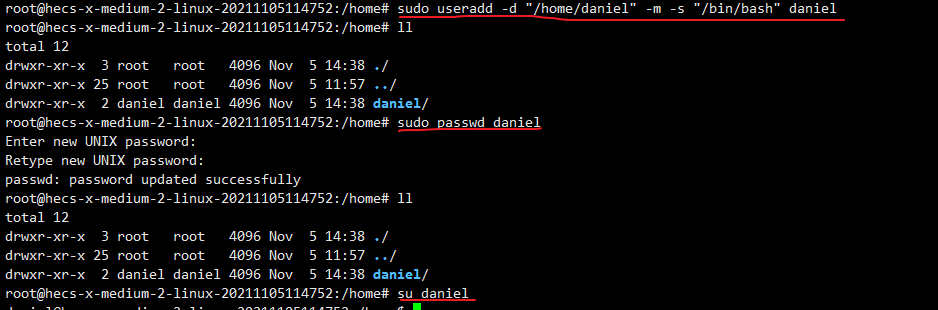

# 一、简介

Linux 是一种自由和开放源码的类 UNIX 操作系统。

Linux 英文解释为 **Linux is not Unix**。

Linux 是在 1991 由林纳斯·托瓦兹在赫尔辛基大学上学时创立的，主要受到 Minix 和 Unix 思想的启发。

### Linux 是开源的

Linux 遵循 GNU 通用公共许可证（GPL），任何个人和机构都可以自由地使用 Linux 的所有底层源代码，也可以自由地修改和再发布。

由于 Linux 是自由软件，任何人都可以创建一个符合自己需求的 Linux 发行版。

目前主流的 Linux 版本有：

- Debian（及其派生版本==Ubuntu== 、Linux Mint）

- Fedora（及其相关版本Red Hat Enterprise Linux、==CentOS== ）

- openSUSE

- ...等

- Linux 内核最初只是由芬兰人林纳斯·托瓦兹（Linus Torvalds）在赫尔辛基大学上学时出于个人爱好而编写的。

  Linux 是一套免费使用和自由传播的类 Unix 操作系统，是一个基于 POSIX 和 UNIX 的多用户、多任务、支持多线程和多 CPU 的操作系统。

  Linux 能运行主要的 UNIX 工具软件、应用程序和网络协议。它支持 32 位和 64 位硬件。Linux 继承了 Unix 以网络为核心的设计思想，是一个性能稳定的多用户网络操作系统。

  ------

  ### Linux 的发行版

  Linux 的发行版说简单点就是将 Linux 内核与应用软件做一个打包。

  

  目前市面上较知名的发行版有：Ubuntu、RedHat、CentOS、Debian、Fedora、SuSE、OpenSUSE、Arch Linux、SolusOS 等。

  

  ------

  ### Linux 应用领域

  今天各种场合都有使用各种 Linux 发行版，从嵌入式设备到超级计算机，并且在服务器领域确定了地位，通常服务器使用 LAMP（Linux + Apache + MySQL + PHP）或 LNMP（Linux + Nginx+ MySQL + PHP）组合。

  目前 Linux 不仅在家庭与企业中使用，并且在政府中也很受欢迎。

  - 巴西联邦政府由于支持 Linux 而世界闻名。
  - 有新闻报道俄罗斯军队自己制造的 Linux 发布版的，做为 G.H.ost 项目已经取得成果。
  - 印度的 Kerala 联邦计划在向全联邦的高中推广使用 Linux。
  - 中华人民共和国为取得技术独立，在龙芯处理器中排他性地使用 Linux。
  - 在西班牙的一些地区开发了自己的 Linux 发布版，并且在政府与教育领域广泛使用，如 Extremadura 地区的 gnuLinEx 和 Andalusia 地区的 Guadalinex。
  - 葡萄牙同样使用自己的 Linux 发布版 Caixa Mágica，用于 Magalh?es 笔记本电脑和 e-escola 政府软件。
  - 法国和德国同样开始逐步采用 Linux。

  ------

  ### Linux vs Windows

  目前国内 Linux 更多的是应用于服务器上，而桌面操作系统更多使用的是 Windows。主要区别如下

  | 比较     | Windows                                                      | Linux                                                        |
  | :------- | :----------------------------------------------------------- | :----------------------------------------------------------- |
  | 界面     | 界面统一，外壳程序固定所有 Windows 程序菜单几乎一致，快捷键也几乎相同 | 图形界面风格依发布版不同而不同，可能互不兼容。GNU/Linux 的终端机是从 UNIX 传承下来，基本命令和操作方法也几乎一致。 |
  | 驱动程序 | 驱动程序丰富，版本更新频繁。默认安装程序里面一般包含有该版本发布时流行的硬件驱动程序，之后所出的新硬件驱动依赖于硬件厂商提供。对于一些老硬件，如果没有了原配的驱动有时很难支持。另外，有时硬件厂商未提供所需版本的 Windows 下的驱动，也会比较头痛。 | 由志愿者开发，由 Linux 核心开发小组发布，很多硬件厂商基于版权考虑并未提供驱动程序，尽管多数无需手动安装，但是涉及安装则相对复杂，使得新用户面对驱动程序问题（是否存在和安装方法）会一筹莫展。但是在开源开发模式下，许多老硬件尽管在Windows下很难支持的也容易找到驱动。HP、Intel、AMD 等硬件厂商逐步不同程度支持开源驱动，问题正在得到缓解。 |
  | 使用     | 使用比较简单，容易入门。图形化界面对没有计算机背景知识的用户使用十分有利。 | 图形界面使用简单，容易入门。文字界面，需要学习才能掌握。     |
  | 学习     | 系统构造复杂、变化频繁，且知识、技能淘汰快，深入学习困难。   | 系统构造简单、稳定，且知识、技能传承性好，深入学习相对容易。 |
  | 软件     | 每一种特定功能可能都需要商业软件的支持，需要购买相应的授权。 | 大部分软件都可以自由获取，同样功能的软件选择较少。           |

# 二、安装及启动

[vmware安装contos7](https://www.runoob.com/w3cnote/vmware-install-centos7.html)

[Linux下的Java环境配置](https://gitee.com/healer0604/AllNote/blob/new2021/TyporaPRO/DevEnvironment/Linux/LinuxMint%E7%AC%94%E8%AE%B0/LinuxMint.md)

## Linux 系统启动过程

linux启动时我们会看到许多启动信息。

Linux系统的启动过程并不是大家想象中的那么复杂，其过程可以分为5个阶段：

- 内核的引导。
- 运行 init。
- 系统初始化。
- 建立终端 。
- 用户登录系统。

> init程序的类型：
>
> - **SysV:** init, CentOS 5之前, 配置文件： /etc/inittab。
> - **Upstart:** init,CentOS 6, 配置文件： /etc/inittab, /etc/init/*.conf。
> - **Systemd：** systemd, CentOS 7,配置文件： /usr/lib/systemd/system、 /etc/systemd/system。

------

## 内核引导

当计算机打开电源后，首先是BIOS开机自检，按照BIOS中设置的启动设备（通常是硬盘）来启动。

操作系统接管硬件以后，首先读入 /boot 目录下的内核文件。


------

## 运行init

init 进程是系统所有进程的起点，你可以把它比拟成系统所有进程的老祖宗，没有这个进程，系统中任何进程都不会启动。

init 程序首先是需要读取配置文件 /etc/inittab。


### 运行级别

许多程序需要开机启动。它们在Windows叫做"服务"（service），在Linux就叫做"守护进程"（daemon）。

init进程的一大任务，就是去运行这些开机启动的程序。

但是，不同的场合需要启动不同的程序，比如用作服务器时，需要启动Apache，用作桌面就不需要。

Linux允许为不同的场合，分配不同的开机启动程序，这就叫做"运行级别"（runlevel）。也就是说，启动时根据"运行级别"，确定要运行哪些程序。


Linux系统有7个运行级别(runlevel)：

- 运行级别0：系统停机状态，系统默认运行级别不能设为0，否则不能正常启动
- 运行级别1：单用户工作状态，root权限，用于系统维护，禁止远程登陆
- 运行级别2：多用户状态(没有NFS)
- 运行级别3：完全的多用户状态(有NFS)，登陆后进入控制台命令行模式
- 运行级别4：系统未使用，保留
- 运行级别5：X11控制台，登陆后进入图形GUI模式
- 运行级别6：系统正常关闭并重启，默认运行级别不能设为6，否则不能正常启动

------

## 系统初始化

在init的配置文件中有这么一行： si::sysinit:/etc/rc.d/rc.sysinit　它调用执行了/etc/rc.d/rc.sysinit，而rc.sysinit是一个bash shell的脚本，它主要是完成一些系统初始化的工作，rc.sysinit是每一个运行级别都要首先运行的重要脚本。

它主要完成的工作有：激活交换分区，检查磁盘，加载硬件模块以及其它一些需要优先执行任务。

```
l5:5:wait:/etc/rc.d/rc 5
```

这一行表示以5为参数运行/etc/rc.d/rc，/etc/rc.d/rc是一个Shell脚本，它接受5作为参数，去执行/etc/rc.d/rc5.d/目录下的所有的rc启动脚本，/etc/rc.d/rc5.d/目录中的这些启动脚本实际上都是一些连接文件，而不是真正的rc启动脚本，真正的rc启动脚本实际上都是放在/etc/rc.d/init.d/目录下。

而这些rc启动脚本有着类似的用法，它们一般能接受start、stop、restart、status等参数。

/etc/rc.d/rc5.d/中的rc启动脚本通常是K或S开头的连接文件，对于以 S 开头的启动脚本，将以start参数来运行。

而如果发现存在相应的脚本也存在K打头的连接，而且已经处于运行态了(以/var/lock/subsys/下的文件作为标志)，则将首先以stop为参数停止这些已经启动了的守护进程，然后再重新运行。

这样做是为了保证是当init改变运行级别时，所有相关的守护进程都将重启。

至于在每个运行级中将运行哪些守护进程，用户可以通过chkconfig或setup中的"System Services"来自行设定。


------

## 建立终端

rc执行完毕后，返回init。这时基本系统环境已经设置好了，各种守护进程也已经启动了。

init接下来会打开6个终端，以便用户登录系统。在inittab中的以下6行就是定义了6个终端：

```
1:2345:respawn:/sbin/mingetty tty1
2:2345:respawn:/sbin/mingetty tty2
3:2345:respawn:/sbin/mingetty tty3
4:2345:respawn:/sbin/mingetty tty4
5:2345:respawn:/sbin/mingetty tty5
6:2345:respawn:/sbin/mingetty tty6
```

从上面可以看出在2、3、4、5的运行级别中都将以respawn方式运行mingetty程序，mingetty程序能打开终端、设置模式。

同时它会显示一个文本登录界面，这个界面就是我们经常看到的登录界面，在这个登录界面中会提示用户输入用户名，而用户输入的用户将作为参数传给login程序来验证用户的身份。

------

## 用户登录系统

一般来说，用户的登录方式有三种：

- （1）命令行登录
- （2）ssh登录
- （3）图形界面登录


对于运行级别为5的图形方式用户来说，他们的登录是通过一个图形化的登录界面。登录成功后可以直接进入 KDE、Gnome 等窗口管理器。

而本文主要讲的还是文本方式登录的情况：当我们看到mingetty的登录界面时，我们就可以输入用户名和密码来登录系统了。

Linux 的账号验证程序是 login，login 会接收 mingetty 传来的用户名作为用户名参数。

然后 login 会对用户名进行分析：如果用户名不是 root，且存在 /etc/nologin 文件，login 将输出 nologin 文件的内容，然后退出。

这通常用来系统维护时防止非root用户登录。只有/etc/securetty中登记了的终端才允许 root 用户登录，如果不存在这个文件，则 root 用户可以在任何终端上登录。

/etc/usertty文件用于对用户作出附加访问限制，如果不存在这个文件，则没有其他限制。

------

## 图形模式与文字模式的切换方式

Linux预设提供了六个命令窗口终端机让我们来登录。

默认我们登录的就是第一个窗口，也就是tty1，这个六个窗口分别为tty1,tty2 … tty6，你可以按下Ctrl + Alt + F1 ~ F6 来切换它们。

如果你安装了图形界面，默认情况下是进入图形界面的，此时你就可以按Ctrl + Alt + F1 ~ F6来进入其中一个命令窗口界面。

当你进入命令窗口界面后再返回图形界面只要按下Ctrl + Alt + F7 就回来了。

如果你用的vmware 虚拟机，命令窗口切换的快捷键为 Alt + Space + F1~F6. 如果你在图形界面下请按Alt + Shift + Ctrl + F1~F6 切换至命令窗口。


------

## Linux 关机

在linux领域内大多用在服务器上，很少遇到关机的操作。毕竟服务器上跑一个服务是永无止境的，除非特殊情况下，不得已才会关机。

正确的关机流程为：sync > shutdown > reboot > halt

关机指令为：shutdown ，你可以man shutdown 来看一下帮助文档。

例如你可以运行如下命令关机：

```shell
sync 将数据由内存同步到硬盘中。

shutdown 关机指令，你可以man shutdown 来看一下帮助文档。例如你可以运行如下命令关机：

shutdown –h 10 ‘This server will shutdown after 10 mins’ 这个命令告诉大家，计算机将在10分钟后关机，并且会显示在登陆用户的当前屏幕中。

shutdown –h now 立马关机

shutdown –h 20:25 系统会在今天20:25关机

shutdown –h +10 十分钟后关机

shutdown –r now 系统立马重启

shutdown –r +10 系统十分钟后重启

reboot 就是重启，等同于 shutdown –r now

halt 关闭系统，等同于shutdown –h now 和 poweroff
```

最后总结一下，不管是重启系统还是关闭系统，首先要运行 **sync** 命令，把内存中的数据写到磁盘中。

关机的命令有 **shutdown –h now halt poweroff** 和 **init 0** , 重启系统的命令有 **shutdown –r now reboot init 6**。

# 三、入门

## 1.命令解析器

##### Shell

Shell俗称壳（用来区别于核），是指“为使用者提供操作界面”的软件（**命令解析器**）。它类似于[DOS](https://baike.baidu.com/item/DOS)下的command.com和后来的**cmd.exe**。它接收用户命令，然后调用相应的应用程序。

shell同时又是一种程序设计语言。作为命令语言，它交互式解释和执行用户输入的命令或者自动地解释和执行预先设定好的一连串的命令；作为程序设计语言，它定义了各种变量和参数，并提供了许多在[高级语言](https://baike.baidu.com/item/高级语言)中才具有的控制结构，包括循环和分支。

##### Bash

[Unix shell](https://baike.baidu.com/item/Unix shell)的一种，在1987年由布莱恩·福克斯为了[GNU计划](https://baike.baidu.com/item/GNU计划)而编写。1989年发布第一个正式版本，原先是计划用在[GNU](https://baike.baidu.com/item/GNU)操作系统上，但能运行于大多数[类Unix系统](https://baike.baidu.com/item/类Unix系统)的操作系统之上，包括[Linux](https://baike.baidu.com/item/Linux)与Mac OS X v10.4都将它作为默认shell。

Bash是[Bourne shell](https://baike.baidu.com/item/Bourne shell)的后继兼容版本与开放源代码版本，它的名称来自[Bourne shell](https://baike.baidu.com/item/Bourne shell)（sh）的一个双关语（*Bourne again* / born again）：**B**ourne-**A**gain **SH**ell。

Bash是一个命令处理器，通常运行于文本窗口中，并能执行用户直接输入的命令。Bash还能从文件中读取命令，这样的文件称为脚本。和其他Unix shell 一样，它支持文件名替换（通配符匹配）、[管道](https://baike.baidu.com/item/管道)、[here文档](https://baike.baidu.com/item/here文档)、命令替换、变量，以及条件判断和循环遍历的结构控制语句。包括关键字、语法在内的基本特性全部是从[sh](https://baike.baidu.com/item/sh)借鉴过来的。其他特性，例如历史命令，是从[csh](https://baike.baidu.com/item/csh)和[ksh](https://baike.baidu.com/item/ksh)借鉴而来。总的来说，Bash虽然是一个满足[POSIX](https://baike.baidu.com/item/POSIX)规范的shell，但有很多扩展。

```shell
[healer@localhost 桌面]$ date
2020年 10月 27日 星期二 15:16:07 CST
```

##### 快捷键

###### 1. 光标移动

```
* ctrl + <      移动到前一个单词开头
* ctrl + >      移动到后一个单词结尾
* ctrl + A      移动到开头
* ctrl + E      移动到结尾
* alt  + B      向左移动一个单词
* alt  + F      向右移动一个单词
  ctrl + B      向左移动一个字符
  ctrl + F      向右移动一个字符
  esc  + B      向左移动一个单词
  esc  + F      向右移动一个单词
  ctrl + XX     在上次光和当前光标所在字符间跳转
  esc  + T      交换光标位置前的两个单词
```

###### 2. 删除

```
* ctrl + K      删除光标后所有字符(剪切)
* ctrl + U      删除光标前所有字符(剪切)
* ctrl + W      删除光标前一个单词
  ctrl + D      删除光标所在字符(光标右侧)
  ctrl + H      删除光标前字符(光标左侧)
```

###### 3. 撤销

```
* ctrl + _      撤销操作
* ctrl + Y      粘贴ctrl+U/K剪切的内容
  ctrl + ?      撤消前一次输入
  alt  + R      撤消前一次动作
```

###### 4. 替换

```
* ctrl + T      将光标当前字符与前面一个字符替换
```

###### 5. ==历史命令编辑== 

```
* ctrl + P      上条输入的命令(相当于上键)
* ctrl + N      上条历史命(相当于下键)
* alt  + >      上一次执行命令
* ctrl + R      输入单词搜索历史命令
```

###### 6. 控制命令

```
* ctrl + L      清除屏幕
  ctrl + S      锁住终端，阻止屏幕输出
  ctrl + Q      解锁终端，允许屏幕输出
  ctrl + C      终止命令&另起一行
  ctrl + I      补全功能(类似TAB)
  ctrl + O      重复执行命令
  alt  + <数字>  操作的次数
  ctrl + Z      挂起
```

###### 7. !命令

```
* !!            执行上条命令
* !-n           执行前n条命令
```

## 2.目录结构

### Linux系统目录结构

当你在Linux终端中输入

```
ls /
```


树状目录结构：


以下是对这些目录的解释：

- **/bin**：
  bin 是 Binaries (二进制文件) 的缩写, 这个目录==存放着最经常使用的命令。==

- **/boot：**
  这里存放的是启动 Linux 时使用的一些==核心文件==，包括一些连接文件以及镜像文件。

- **/dev ：**
  dev 是 Device(设备) 的缩写, 该目录下==存放的是 Linux 的外部设备==，在 Linux 中访问设备的方式和访问文件的方式是相同的。

- **/etc：**
  etc 是 Etcetera(等等) 的缩写,这个目录用来存放所有的系统管理所需要的==配置文件==和子目录。

- **/home**：
  ==用户的主目录==，在 Linux 中，每个用户都有一个自己的目录，一般该目录名是以用户的账号命名的，如上图中的 alice、bob 和 eve。

- **/lib**：
  lib 是 Library(库) 的缩写这个目录里==存放着系统最基本的动态连接共享库==，其作用类似于 Windows 里的 DLL 文件。几乎所有的应用程序都需要用到这些共享库。

- **/lost+found**：
  这个目录一般情况下是空的，当系统非法关机后，这里就存放了一些文件。

- **/media**：
  linux 系统会自动识别一些设备，例如U盘、光驱等等，当识别后，==Linux 会把识别的设备挂载到这个目录下==。

- **/mnt**：
  系统提供该目录是为了==让用户临时挂载别的文件系统==的，我们可以将光驱挂载在 /mnt/ 上，然后进入该目录就可以查看光驱里的内容了。

- **/opt**：
  opt 是 optional(可选) 的缩写，这是给主机额外安装软件所摆放的目录。比如你安装一个ORACLE数据库则就可以放到这个目录下。默认是空的。

- **/proc**：
  proc 是 Processes(进程) 的缩写，/proc 是一种伪文件系统（也即虚拟文件系统），存储的是当前内核运行状态的一系列特殊文件，这个目录是一个虚拟的目录，它是系统内存的映射，我们可以通过直接访问这个目录来获取系统信息。
  这个目录的内容不在硬盘上而是在内存里，我们也可以直接修改里面的某些文件，比如可以通过下面的命令来屏蔽主机的ping命令，使别人无法ping你的机器：

  ```
  echo 1 > /proc/sys/net/ipv4/icmp_echo_ignore_all
  ```

- **/root**：
  该目录为系统管理员，也称作超级权限者的用户主目录。

- **/sbin**：
  s 就是 Super User 的意思，是 Superuser Binaries (超级用户的二进制文件) 的缩写，这里==存放的是系统管理员使用的系统管理程序。==

- **/selinux**：
   这个目录是 Redhat/CentOS 所特有的目录，Selinux 是一个安全机制，类似于 windows 的防火墙，但是这套机制比较复杂，这个目录就是存放selinux相关的文件的。

- **/srv**：
   该目录存放一些服务启动之后需要提取的数据。

- **/sys**：

  这是 Linux2.6 内核的一个很大的变化。该目录下安装了 2.6 内核中新出现的一个文件系统 sysfs 。

  sysfs 文件系统集成了下面3种文件系统的信息：针对进程信息的 proc 文件系统、针对设备的 devfs 文件系统以及针对伪终端的 devpts 文件系统。

  该文件系统是内核设备树的一个直观反映。

  当一个内核对象被创建的时候，对应的文件和目录也在内核对象子系统中被创建。

- **/tmp**：
  tmp 是 temporary(临时) 的缩写这个目录是用来存放一些临时文件的。

- **/usr**：
   usr 是 unix shared resources(共享资源) 的缩写，这是一个非常重要的目录，==用户的很多应用程序和文件都放在这个目录下==，类似于 windows 下的 program files 目录。

- **/usr/bin：**
  系统用户使用的应用程序。

- **/usr/sbin：**
  超级用户使用的比较高级的管理程序和系统守护程序。

- **/usr/src：**
  内核源代码默认的放置目录。

- **/var**：
  var 是 variable(变量) 的缩写，这个目录中存放着在不断扩充着的东西，我们习惯将那些经常被修改的目录放在这个目录下。包括各种日志文件。

- **/run**：
  是一个临时文件系统，存储系统启动以来的信息。当系统重启时，这个目录下的文件应该被删掉或清除。如果你的系统上有 /var/run 目录，应该让它指向 run。

在 Linux 系统中，有几个目录是比较重要的，平时需要注意不要误删除或者随意更改内部文件。

**/etc**： 上边也提到了，这个是系统中的配置文件，如果你更改了该目录下的某个文件可能会导致系统不能启动。

**/bin, /sbin, /usr/bin, /usr/sbin**: 这是系统预设的执行文件的放置目录，比如 ls 就是在 /bin/ls 目录下的。

值得提出的是，/bin, /usr/bin 是给系统用户使用的指令（除root外的通用户），而/sbin, /usr/sbin 则是给 root 使用的指令。

**/var**： 这是一个非常重要的目录，系统上跑了很多程序，那么每个程序都会有相应的日志产生，而这些日志就被记录到这个目录下，具体在 /var/log 目录下，另外 mail 的预设放置也是在这里。


## 3.文件操作

==Linux 系统是一种典型的多用户系统，不同的用户处于不同的地位，拥有不同的权限。== 

为了保护系统的安全性，Linux 系统对不同的用户访问同一文件（包括目录文件）的权限做了不同的规定。

在 Linux 中我们通常使用以下两个命令来修改文件或目录的所属用户与权限：

- `chown `   (change ownerp) ： 修改所属用户与组。
- `chmod `   (change mode) ： 修改用户的权限。

下图中通过 chown 来授权用户，==通过 chmod 为用户设置可以开门的权限==。


在 Linux 中我们可以使用` ll `或者` ls –l `命令来显示一个文件的属性以及文件所属的用户和组，如：

```shell
[root@www /]# ls -l
total 64
dr-xr-xr-x   2 root root 4096 Dec 14  2012 bin
dr-xr-xr-x   4 root root 4096 Apr 19  2012 boot
……
```

实例中，**bin** 文件的第一个属性用 **d** 表示。==**d** 在 Linux 中代表该文件是一个目录文件==。

#### 文件创建

使用`touch`命令创建文件

```shell
[root@localhost file]# touch file1.txt
[root@localhost file]# ls
demo  demo.txt  file1.txt
```


#### 文件类型

在 Linux 中第一个字符代表这个文件是目录、文件或链接文件等等。

- 当为 **d** 则是目录
- 当为 **-** 则是文件；
- 若是 **l** 则表示为链接文档(link file)；
- 若是 **b** 则表示为装置文件里面的可供储存的接口设备(可随机存取装置)；
- 若是 **c** 则表示为装置文件里面的串行端口设备，例如键盘、鼠标(一次性读取装置)。

#### 文件查找

###### 通过准确文件名查找

```shell
$ sudo find 查找路径 -name 查找的文件
```

例：

```shell
$ sudo find /home/healer -name demo.txt
[sudo] password for healer:              <== 此处键入healer用户密码
/home/healer/Test/file/demo.txt
```

###### 通过模糊查询

- `*`  表示匹配所有（0个或多个）
- `?`  表示匹配一个字符

```shell
$ sudo find /home/healer -name "demo.*"
/home/healer/Test/file/demo.txt
$ sudo find /home/healer -name "dem?.txt"
/home/healer/Test/file/demo.txt
```

###### 通过文件大小

+ `+`    大于
+ `-`    小于

```shell
$ sudo find /home/healer/Test -size -1k
$ sudo find /home/healer/Test -size +1k
/home/healer/Test/file/demo.txt
```

==不同版本对于单位大小写不同== 

###### 通过类型搜索

-  **d** 则是目录、 **-** 则是文件； **l** 则表示为链接文档、 **b** 则表示为接口设备、 **c** 则表示为串行端口设备

```shell
$ sudo find /home/healer/Test -type d
/home/healer/Test
/home/healer/Test/file
/home/healer/Test/dome
```

###### 通过文件内容查找

```shell
$ grep -r 查找内容（引号引起） 查找目录
```

```shell
$ grep -r "长恨歌" /home/healer
/home/healer/Test/file/demo.txt:长恨歌
```


#### 文件权限

接下来的字符中，以三个为一组，且均为 **rwx** 的三个参数的组合。其中，==**r** 代表可读(read)、 **w** 代表可写(write)、 **x** 代表可执行(execute)== 。 要注意的是，这三个权限的位置不会改变，==如果没有权限，就会出现减号 **-** 而已== 。


每个文件的属性由左边第一部分的 10 个字符来确定（如下图）。


从左至右用 **0-9** 这些数字来表示。

==第 **0** 位确定文件类型== ，

==第 **1-3** 位确定属主== （该文件的所有者）拥有该文件的权限。

==第4-6位确定属组== （所有者的同组用户）拥有该文件的权限，

==第7-9位确定其他用户拥有该文件的权限== 。


 ==**1、4、7** 位表示读权限== ，如果用 **r** 字符表示，则有读权限，如果用 **-** 字符表示，则没有读权限；

 ==**2、5、8** 位表示写权限== ，如果用 **w** 字符表示，则有写权限，如果用 **-** 字符表示没有写权限；

==**3、6、9** 位表示可执行权限== ，如果用 **x** 字符表示，则有执行权限，如果用 **-** 字符表示，则没有执行权限。

------

#### Linux文件属主和属组

```shell
[root@www /]# ls -l
total 64
drwxr-xr-x 2 root  root  4096 Feb 15 14:46 cron
drwxr-xr-x 3 mysql mysql 4096 Apr 21  2014 mysql
……
```

对于文件来说，它都有一个特定的所有者，也就是对该文件具有所有权的用户。

同时，在Linux系统中，==用户是按组分类的，一个用户属于一个或多个组== 。

文件所有者以外的用户又可以分为文件所有者的同组用户和其他用户。

因此，Linux系统按文件所有者、文件所有者同组用户和其他用户来规定了不同的文件访问权限。

在以上实例中，==mysql 文件是一个目录文件，属主和属组都为 mysql，属主有可读、可写、可执行的权限；与属主同组的其他用户有可读和可执行的权限；其他用户也有可读和可执行的权限== 。

对于 root 用户来说，一般情况下，文件的权限对其不起作用。

------

#### 更改文件属性

##### 1、更改文件属组

chgrp：更改文件属组

语法：

```shell
# chgrp [-R] 属组名 文件名
```

参数选项

- -R：==递归更改文件属组，就是在更改某个目录文件的属组时，如果加上-R的参数，那么该目录下的所有文件的属组都会更改。== 

##### 2、更改文件属主

chown：更改文件属主，也可以同时更改文件属组

语法：

```shell
chown [–R] 属主名 文件名
chown [-R] 属主名：属组名 文件名
```

进入 /root 目录（~）将install.log的拥有者改为bin这个账号：

```shell
[root@www ~] cd ~
[root@www ~]# chown bin install.log
[root@www ~]# ls -l
-rw-r--r--  1 bin  users 68495 Jun 25 08:53 install.log
```

将install.log的拥有者与群组改回为root：

```shell
[root@www ~]# chown root:root install.log
[root@www ~]# ls -l
-rw-r--r--  1 root root 68495 Jun 25 08:53 install.log
```

##### 3、更改文件9个属性

chmod：更改文件9个属性

Linux文件属性有两种设置方法，一种是数字，一种是符号。

Linux 文件的基本权限就有九个，分别是 **owner/group/others(拥有者/组/其他)** 三种身份各有自己的 **read/write/execute** 权限。

先复习一下刚刚上面提到的数据：文件的权限字符为： **-rwxrwxrwx** ， 这九个权限是三个三个一组的！其中，我们可以使用数字来代表各个权限，各权限的分数对照表如下：

- r:4
- w:2
- x:1

==每种身份(owner/group/others)各自的三个权限(r/w/x)分数是需要累加的==，例如当权限为： **-rwxrwx---** 分数则是：

- owner = rwx = 4+2+1 = 7
- group = rwx = 4+2+1 = 7
- others= --- = 0+0+0 = 0

所以等一下我们设定权限的变更时，该文件的权限数字就是 **770**。变更权限的指令 chmod 的语法是这样的：

```shell
# chmod [-R] xyz 文件或目录
```

选项与参数：

- xyz : 就是刚刚提到的数字类型的权限属性，为 rwx 属性数值的相加。
- -R : 进行递归(recursive)的持续变更，亦即连同次目录下的所有文件都会变更

举例来说，如果要将 .bashrc 这个文件所有的权限都设定启用，那么命令如下：

```shell
[root@www ~]# ls -al .bashrc
-rw-r--r--  1 root root 395 Jul  4 11:45 .bashrc
[root@www ~]# chmod 777 .bashrc
[root@www ~]# ls -al .bashrc
-rwxrwxrwx  1 root root 395 Jul  4 11:45 .bashrc
```

那如果要将权限变成 *-rwxr-xr--* 呢？那么权限的分数就成为 [4+2+1][4+0+1][4+0+0]=754。

#### 符号类型改变文件权限

还有一个改变权限的方法，从之前的介绍中我们可以发现，基本上就九个权限分别是：

- user：用户
- group：组
- others：其他

那么我们就可以使用 **u, g, o** 来代表三种身份的权限。

此外， **a** 则代表 **all**，即全部的身份。==读写的权限可以写成 **r, w, x**==，也就是可以使用下表的方式来看：


如果我们需要将文件权限设置为 **-rwxr-xr--** ，可以使用 **chmod u=rwx,g=rx,o=r 文件名** 来设定:

```shell
#  touch test1    // 创建 test1 文件
# ls -al test1    // 查看 test1 默认权限
-rw-r--r-- 1 root root 0 Nov 15 10:32 test1

# chmod u=rwx,g=rx,o=r  test1    // 修改 test1 权限
# ls -al test1
-rwxr-xr-- 1 root root 0 Nov 15 10:32 test1
```

而如果是要将权限去掉而不改变其他已存在的权限呢？例如要拿掉全部人的可执行权限，则：

```shell
# chmod  a-x test1
# ls -al test1
-rw-r--r-- 1 root root 0 Nov 15 10:32 test1
```

```
[healer@localhost file]$ chmod +r demo.txt
[healer@localhost file]$ ls -l
总用量 4
-rw-rw-r--. 1 healer healer 3178 10月 28 15:25 demo.txt
[healer@localhost file]$ chmod +r,+w demo.txt
[healer@localhost file]$ ls -l
总用量 4
-rw-rw-r--. 1 healer healer 3178 10月 28 15:25 demo.txt
[healer@localhost file]$ chmod +r,+w,+x demo.txt
[healer@localhost file]$ ls -l
总用量 4
-rwxrwxr-x. 1 healer healer 3178 10月 28 15:25 demo.txt

```


## 4.目录操作

我们知道Linux的目录结构为树状结构，最顶级的目录为根目录 /。

其他目录通过挂载可以将它们添加到树中，通过解除挂载可以移除它们。

在开始本教程前我们需要先知道什么是绝对路径与相对路径。

- **绝对路径：**

  路径的写法，由根目录 `/ `写起，例如： /usr/share/doc 这个目录。

- 相对路径：
  路径的写法，不是由`/` 写起，例如由 /usr/share/doc 要到 /usr/share/man 底下时，可以写成： cd ../man 这就是相对路径的写法。

------

### 处理目录的常用命令

接下来我们就来看几个常见的处理目录的命令吧：

- ==ls（英文全拼：list files）: 列出目录及文件名==
- ==cd（英文全拼：change directory）：切换目录==
- ==pwd（英文全拼：print work directory）：显示目前的目录==
- ==mkdir（英文全拼：make directory）：创建一个新的目录==
- ==rmdir（英文全拼：remove directory）：删除一个空的目录==
- ==cp（英文全拼：copy file）: 复制文件或目录==
- ==rm（英文全拼：remove）: 移除文件或目录==
- ==mv（英文全拼：move file）: 移动文件与目录，或修改文件与目录的名称==

你可以使用 *man [命令]* 来查看各个命令的使用文档，如 ：man cp。

### ls (列出目录)

在Linux系统当中， ls 命令可能是最常被运行的。

语法：

```shell
[root@www ~]# ls [-aAdfFhilnrRSt] 目录名称
[root@www ~]# ls [--color={never,auto,always}] 目录名称
[root@www ~]# ls [--full-time] 目录名称
```

选项与参数：

- -a ：==全部的文件==，连同隐藏文件( 开头为 . 的文件) 一起列出来(常用)
- -d ：==仅列出目录本身==，而不是列出目录内的文件数据(常用)
- -l ：==长数据串列出==，包含文件的属性与权限等等数据；(常用)

将当前目录下的所有文件列出来(含属性与隐藏档)

```shell
[root@www ~]# ls -al ~
```

### cd (切换目录)

`cd`是`Change Directory`的缩写，这是用来==变换工作目录==的命令。

语法：

```shell
 cd [相对路径或绝对路径]
#使用 mkdir 命令创建 runoob 目录
[root@www ~]# mkdir runoob

#使用绝对路径切换到 runoob 目录
[root@www ~]# cd /root/runoob/

#使用相对路径切换到 runoob 目录
[root@www ~]# cd ./runoob/

# 表示回到自己的家目录，亦即是 /root 这个目录
[root@www runoob]# cd ~

# 表示去到目前的上一级目录，亦即是 /root 的上一级目录的意思；
[root@www ~]# cd ..
```

接下来大家多操作几次应该就可以很好的理解 cd 命令的。

### pwd (显示目前所在的目录)

pwd 是 **Print Working Directory** 的缩写，也就是==显示目前所在目录==的命令。

```
[root@www ~]# pwd [-P]
```

选项与参数：

- **-P** ：==显示出确实的路径，而非使用连结 (link) 路径==。

实例：单纯显示出目前的工作目录：

```shell
[root@www ~]# pwd
/root   <== 显示出目录啦～
```

实例显示出实际的工作目录，而非连结档本身的目录名而已。

```shell
[root@www ~]# cd /var/mail   <==注意，/var/mail是一个连结档
[root@www mail]# pwd
/var/mail         <==列出目前的工作目录
[root@www mail]# pwd -P
/var/spool/mail   <==怎么回事？有没有加 -P 差很多～
[root@www mail]# ls -ld /var/mail
lrwxrwxrwx 1 root root 10 Sep  4 17:54 /var/mail -> spool/mail
# 看到这里应该知道为啥了吧？因为 /var/mail 是连结档，连结到 /var/spool/mail 
# 所以，加上 pwd -P 的选项后，会不以连结档的数据显示，而是显示正确的完整路径啊！
```

### mkdir (创建新目录)

如果想要创建新的目录的话，那么就使用mkdir (make directory)吧。

语法：

```shell
mkdir [-mp] 目录名称
```

选项与参数：

- ==-m ：配置文件的权限喔！直接配置，不需要看默认权限 (umask) 的脸色～==
- ==-p ：帮助你直接将所需要的目录(包含上一级目录)递归创建起来！==

实例：请到/tmp底下尝试创建数个新目录看看：

```shell
[root@www ~]# cd /tmp
[root@www tmp]# mkdir test    <==创建一名为 test 的新目录
[root@www tmp]# mkdir test1/test2/test3/test4
mkdir: cannot create directory `test1/test2/test3/test4': 
No such file or directory       <== 没办法直接创建此目录啊！
[root@www tmp]# mkdir -p test1/test2/test3/test4
```

==加了这个 -p 的选项，可以自行帮你创建多层目录！==

实例：创建权限为 **rwx--x--x** 的目录。

```shell
[root@www tmp]# mkdir -m 711 test2
[root@www tmp]# ls -l
drwxr-xr-x  3 root  root 4096 Jul 18 12:50 test
drwxr-xr-x  3 root  root 4096 Jul 18 12:53 test1
drwx--x--x  2 root  root 4096 Jul 18 12:54 test2
```

上面的权限部分，如果==没有加上 -m 来强制配置属性，系统会使用默认属性==。

==如果我们使用 -m ，如上例我们给予 -m 711 来给予新的目录 drwx--x--x 的权限。==

### rmdir (删除空的目录)

语法：

```shell
 rmdir [-p] 目录名称
```

选项与参数：

- ==**-p ：**连同上一级『空的』目录也一起删除==

删除 runoob 目录

```shell
[root@www tmp]# rmdir runoob/
```

将 mkdir 实例中创建的目录(/tmp 底下)删除掉！

```shell
[root@www tmp]# ls -l   <==看看有多少目录存在？
drwxr-xr-x  3 root  root 4096 Jul 18 12:50 test
drwxr-xr-x  3 root  root 4096 Jul 18 12:53 test1
drwx--x--x  2 root  root 4096 Jul 18 12:54 test2
[root@www tmp]# rmdir test   <==可直接删除掉，没问题
[root@www tmp]# rmdir test1  <==因为尚有内容，所以无法删除！
rmdir: `test1': Directory not empty
[root@www tmp]# rmdir -p test1/test2/test3/test4
[root@www tmp]# ls -l        <==您看看，底下的输出中test与test1不见了！
drwx--x--x  2 root  root 4096 Jul 18 12:54 test2
```

利用 ==-p 这个选项，立刻就可以将 test1/test2/test3/test4 一次删除==。

不过要注意的是，这个==rmdir 仅能删除空的目录，你可以使用 rm 命令来删除非空目录== 。

### cp (复制文件或目录)

==cp 即拷贝文件和目录。==

语法:

```shell
[root@www ~]# cp [-adfilprsu] 来源档(source) 目标档(destination)
[root@www ~]# cp [options] source1 source2 source3 .... directory
```

选项与参数：

- **-a：**相当於   ==-pdr==   的意思，至於 pdr 请参考下列说明；(==常用== )
- **-d：**若来源档为连结档的属性(link file)，则复制连结档属性而非文件本身；
- **-f：**为强制(force)的意思，若目标文件已经存在且无法开启，则移除后再尝试一次；
- **-i：**若目标档(destination)已经存在时，在覆盖时会先询问动作的进行(常用)
- **-l：**进行硬式连结(hard link)的连结档创建，而非复制文件本身；
- **-p：**连同文件的属性一起复制过去，而非使用默认属性(备份常用)；
- ==**-r：**递归持续复制，用於目录的复制行为；(常用)==
- **-s：**复制成为符号连结档 (symbolic link)，亦即『捷径』文件；
- **-u：**若 destination 比 source 旧才升级 destination ！

用 root 身份，将 root 目录下的 .bashrc 复制到 /tmp 下，并命名为 bashrc

```shell
[root@www ~]# cp ~/.bashrc /tmp/bashrc
[root@www ~]# cp -i ~/.bashrc /tmp/bashrc
cp: overwrite `/tmp/bashrc'? n  <==n不覆盖，y为覆盖
```

### rm (移除文件或目录)

语法：

```shell
 rm [-fir] 文件或目录
```

选项与参数：

- -f ：就是 force 的意思，==忽略不存在的文件，不会出现警告信息==；
- -i ：互动模式，在删除前会询问使用者是否动作
- ==-r ：递归删除啊！最常用在目录的删除了！这是非常危险的选项！！！==

将刚刚在 cp 的实例中创建的 bashrc 删除掉！

```shell
[root@www tmp]# rm -i bashrc
rm: remove regular file `bashrc'? y
```

如果加上 -i 的选项就会主动询问喔，避免你删除到错误的档名！

### mv (移动文件与目录，或修改名称)

语法：

```shell
[root@www ~]# mv [-fiu] source destination
[root@www ~]# mv [options] source1 source2 source3 .... directory
```

选项与参数：

- -f ：force 强制的意思，==如果目标文件已经存在，不会询问而直接覆盖==；
- -i ：若目标文件 (destination) 已经存在时，就会询问是否覆盖！
- ==-u ：若目标文件已经存在，且 source 比较新，才会升级 (update)==

复制一文件，创建一目录，将文件移动到目录中

```shell
[root@www ~]# cd /tmp
[root@www tmp]# cp ~/.bashrc bashrc
[root@www tmp]# mkdir mvtest
[root@www tmp]# mv bashrc mvtest
```

将某个文件移动到某个目录去，就是这样做！

==将刚刚的目录名称更名为 mvtest2==

```shell
[root@www tmp]# mv mvtest mvtest2
```

------

## 5.Linux 文件内容查看

Linux系统中使用以下命令来查看文件的内容：

- ==cat==由第一行开始显示文件内容
- tac 从最后一行开始显示，可以看出 tac 是 cat 的倒着写！
- nl  显示的时候，顺道输出行号！
- ==more== 一页一页的显示文件内容
- ==less== 与 more 类似，但是比 more 更好的是，他可以往前翻页！
- head 只看头几行
- tail 只看尾巴几行

你可以使用 *man [命令]*来查看各个命令的使用文档，如 ：man cp。

### cat

由第一行开始显示文件内容

语法：

```shell
cat [-AbEnTv]
```

选项与参数：

- -A ：相当於 -vET 的整合选项，可列出一些特殊字符而不是空白而已；
- -b ：列出行号，仅针对非空白行做行号显示，空白行不标行号！
- -E ：将结尾的断行字节 $ 显示出来；
- -n ：==列印出行号== ，连同空白行也会有行号，与 -b 的选项不同；
- -T ：将 [tab] 按键以 ^I 显示出来；
- -v ：列出一些看不出来的特殊字符

检看 /etc/issue 这个文件的内容：

```shell
[root@www ~]# cat /etc/issue
CentOS release 6.4 (Final)
Kernel \r on an \m
```

### tac

tac与cat命令刚好相反，文件内容==从最后一行开始显示，然后倒着一行一行的输出==，可以看出 tac 是 cat 的倒着写！如：

```shell
[root@www ~]# tac /etc/issue

Kernel \r on an \m
CentOS release 6.4 (Final)
```

### nl

==显示行号== 

语法：

```shell
# nl [-bnw] 文件
```

选项与参数：

- -b ：指定行号指定的方式，主要有两种：
  -b a ：表示不论是否为空行，也同样列出行号(类似 cat -n)；
  -b t ：如果有空行，空的那一行不要列出行号(默认值)；
- -n ：列出行号表示的方法，主要有三种：
  -n ln ：行号在荧幕的最左方显示；
  -n rn ：行号在自己栏位的最右方显示，且不加 0 ；
  -n rz ：行号在自己栏位的最右方显示，且加 0 ；
- -w ：行号栏位的占用的位数。

实例一：用 nl 列出 /etc/issue 的内容

```shell
[root@www ~]# nl /etc/issue
     1  CentOS release 6.4 (Final)
     2  Kernel \r on an \m
```

### more

一页一页翻动

```shell
[root@www ~]# more /etc/man_db.config 
#
# Generated automatically from man.conf.in by the
# configure script.
#
# man.conf from man-1.6d
....(中间省略)....
--More--(28%)  <== 重点在这一行喔！你的光标也会在这里等待你的命令
```

在 more 这个程序的运行过程中，你有几个按键可以按的：

- 空白键 (space)：代表向下翻一页；
- Enter     ：代表向下翻『一行』；
- /字串     ：代表在这个显示的内容当中，向下搜寻『字串』这个关键字；
- :f      ：立刻显示出档名以及目前显示的行数；
- `q   `    ：==代表立刻离开 more==，不再显示该文件内容。
- b 或 `ctrl+b `：代表==往回翻页==，不过这动作只对文件有用，对管线无用。
- `ctrl+f `:===往后翻页===

### less

一页一页翻动，以下实例输出/etc/man.config文件的内容：

```shell
[root@www ~]# less /etc/man.config
#
# Generated automatically from man.conf.in by the
# configure script.
#
# man.conf from man-1.6d
....(中间省略)....
:   <== 这里可以等待你输入命令！
```

less运行时可以输入的命令有：

- 空白键  ：向下翻动一页；
- [pagedown]：向下翻动一页；
- [pageup] ：向上翻动一页；
- /字串   ：向下搜寻『字串』的功能；
- ?字串   ：向上搜寻『字串』的功能；
- n     ：重复前一个搜寻 (与 / 或 ? 有关！)
- N     ：反向的重复前一个搜寻 (与 / 或 ? 有关！)
- `q `    ：==离开 less 这个程序==；
- b 或 `ctrl+b `：代表==往回翻页==，不过这动作只对文件有用，对管线无用。
- `ctrl+f `:===往后翻页===

### head

==取出文件前面几行==

语法：

```shell
# head [-n number] 文件 
```

选项与参数：

- -n ：后面接数字，代表显示几行的意思

```
[root@www ~]# head /etc/man.config
```

默认的情况中，显示前面 10 行！若要显示前 20 行，就得要这样：

```
[root@www ~]# head -n 20 /etc/man.config
```

### tail

==取出文件后面几行== 

语法：

```
tail [-n number] 文件 
```

选项与参数：

- -n ：后面接数字，代表显示几行的意思
- -f ：表示持续侦测后面所接的档名，要等到按下[ctrl]-c才会结束tail的侦测

```
[root@www ~]# tail /etc/man.config
# 默认的情况中，显示最后的十行！若要显示最后的 20 行，就得要这样：
[root@www ~]# tail -n 20 /etc/man.config
```

## 6.用户和用户组管理

Linux系统是一个==多用户多任务的分时操作系统== ，任何一个要使用系统资源的用户，都必须首先向系统管理员申请一个账号，然后以这个账号的身份进入系统。

用户的账号一方面可以帮助系统管理员对使用系统的用户进行跟踪，并控制他们对系统资源的访问；另一方面也可以帮助用户组织文件，并为用户提供安全性保护。

每个用户账号都拥有一个唯一的用户名和各自的口令。

用户在登录时键入正确的用户名和口令后，就能够进入系统和自己的主目录。

实现用户账号的管理，要完成的工作主要有如下几个方面：

- 用户账号的添加、删除与修改。
- 用户口令的管理。
- 用户组的管理。

------

### 一、Linux系统用户账号的管理

cat /etc/passwd 可以查看所有用户的列表

w 可以查看当前活跃的用户列表

cat /etc/group 查看用户组

groups 查看当前登录用户的组内成员

groups test 查看test用户所在的组,以及组内成员

whoami 查看当前登录用户名

==用户账号的管理工作主要涉及到用户账号的添加、修改和删除。== 

添加用户账号就是在系统中创建一个新账号，然后为新账号分配用户号、用户组、主目录和登录Shell等资源。刚添加的账号是被锁定的，无法使用。

==注意使用管理员== （root）

#### 1、添加用户账号

使用`useradd`命令，其语法如下：

```shell
# useradd 选项 用户名
```

参数说明：

- 选项:

  - -c comment 指定一段注释性描述。
  - -d 目录 指定用户主目录，如果此目录不存在，则同时使用-m选项，可以创建主目录。
  - ==-g 用户组 指定用户所属的用户组== 。
  - ==-G 用户组，用户组 指定用户所属的附加组== 。
  - -s Shell文件 指定用户的登录Shell。
  - -u 用户号 指定用户的用户号，如果同时有-o选项，则可以重复使用其他用户的标识号。

- 用户名:

  指定新账号的登录名。

##### 实例1

```shell
# useradd –d  /home/sam -m sam
```

==此命令创建了一个用户sam，其中-d和-m选项用来为登录名sam产生一个主目录 /home/sam（/home为默认的用户主目录所在的父目录）。== 

##### 实例2

```shell
# useradd -s /bin/sh -g group –G adm,root gem
```

此命令新建了一个用户gem，该用户的登录Shell是 `/bin/sh`，它属于group用户组，同时又属于adm和root用户组，其中group用户组是其主组。

这里可能新建组：`#groupadd group及groupadd adm`

增加用户账号就是在/etc/passwd文件中为新用户增加一条记录，同时更新其他系统文件如/etc/shadow, /etc/group等。

Linux提供了集成的系统管理工具userconf，它可以用来对用户账号进行统一管理。

#### 2、删除帐号

如果一个用户的账号不再使用，可以从系统中删除。删除用户账号就是要将/etc/passwd等系统文件中的该用户记录删除，必要时还删除用户的主目录。

删除一个已有的用户账号使用`userdel`命令，其格式如下：

```shell
# userdel 选项 用户名
```

常用的选项是 **-r**，它的作用是把用户的主目录一起删除。

例如：

```
# userdel -r sam
```

==此命令删除用户sam在系统文件中（主要是/etc/passwd, /etc/shadow, /etc/group等）的记录，同时删除用户的主目录。== 

#### 3、修改帐号

修改用户账号就是根据实际情况更改用户的有关属性，如==用户号、主目录、用户组、登录Shell== 等。

修改已有用户的信息使用`usermod`命令，其格式如下：

```shell
# usermod 选项 用户名
```

常用的选项包括`-c, -d, -m, -g, -G, -s, -u以及-o等`，这些选项的意义与`useradd`命令中的选项一样，可以为用户指定新的资源值。

另外，有些系统可以使用选项：-l 新用户名

这个选项指定一个新的账号，即将原来的用户名改为新的用户名。

例如：

```shell
# usermod -s /bin/ksh -d /home/z –g developer sam
```

==此命令将用户sam的登录Shell修改为ksh，主目录改为/home/z，用户组改为developer== 。

#### 4、用户口令的管理

用户管理的一项重要内容是用户口令的管理。==用户账号刚创建时没有口令，但是被系统锁定，无法使用，必须为其指定口令后才可以使用，即使是指定空口令。== 

指定和修改用户口令的Shell命令是`passwd`。超级用户可以为自己和其他用户指定口令，普通用户只能用它修改自己的口令。命令的格式为：

```shell
# passwd 选项 用户名
```

可使用的选项：

- -l 锁定口令，即禁用账号。
- -u 口令解锁。
- -d 使账号无口令。
- -f 强迫用户下次登录时修改口令。

如果默认用户名，则修改当前用户的口令。

例如，假设当前用户是sam，则下面的命令修改该用户自己的口令：

```shell
$ passwd 
Old password:****** 
New password:******* 
Re-enter new password:*******
```

如果是超级用户，可以用下列形式指定任何用户的口令：

```shell
# passwd sam 
New password:******* 
Re-enter new password:*******
```

普通用户修改自己的口令时，passwd命令会先询问原口令，验证后再要求用户输入两遍新口令，如果两次输入的口令一致，则将这个口令指定给用户；而超级用户为用户指定口令时，就不需要知道原口令。

为了系统安全起见，用户应该选择比较复杂的口令，例如最好使用8位长的口令，口令中包含有大写、小写字母和数字，并且应该与姓名、生日等不相同。

为用户指定空口令时，执行下列形式的命令：

```shell
# passwd -d sam
```

==此命令将用户 sam 的口令删除，这样用户 sam 下一次登录时，系统就不再允许该用户登录了。== 

passwd 命令还可以用 -l(lock) 选项锁定某一用户，使其不能登录，例如：

```shell
# passwd -l sam
```

------

### 二、Linux系统用户组的管理

==每个用户都有一个用户组，系统可以对一个用户组中的所有用户进行集中管理== 。不同Linux 系统对用户组的规定有所不同，如Linux下的用户属于与它同名的用户组，这个用户组在创建用户时同时创建。

用户组的管理涉及用户组的添加、删除和修改。组的增加、删除和修改实际上就是对/etc/group文件的更新。

#### 1、增加用户组

使用`groupadd`命令。其格式如下：

```shell
groupadd 选项 用户组
```

可以使用的选项有：

- -g GID 指定新用户组的组标识号（GID）。
- -o 一般与-g选项同时使用，表示新用户组的GID可以与系统已有用户组的GID相同。

##### 实例1：

```shell
# groupadd group1
```

此命令向系统中增加了一个新组group1，新组的组标识号是在当前已有的最大组标识号的基础上加1。

##### 实例2：

```shell
# groupadd -g 101 group2
```

此命令向系统中增加了一个新组group2，同时指定新组的组标识号是101。

#### 2、删除已有的用户组

使用`groupdel`命令，其格式如下：

```shell
# groupdel 用户组
```

例如：

```shell
# groupdel group1
```

此命令从系统中删除组group1。

#### 3、修改用户组

修改用户组的属性使用`groupmod`命令。其语法如下：

```shell
# groupmod 选项 用户组
```

常用的选项有：

- -g GID 为用户组指定新的组标识号。
- -o 与-g选项同时使用，用户组的新GID可以与系统已有用户组的GID相同。
- -n新用户组 将用户组的名字改为新名字

##### 实例1：

```shell
# groupmod -g 102 group2
```

此命令将组group2的组标识号修改为102。

##### 实例2：

```shell
# groupmod –g 10000 -n group3 group2
```

此命令将组group2的标识号改为10000，组名修改为group3。

#### 4、切换用户组

==如果一个用户同时属于多个用户组，那么用户可以在用户组之间切换，以便具有其他用户组的权限== 。

用户可以在登录后，使用命令newgrp切换到其他用户组，这个命令的参数就是目的用户组。例如：

```shell
$ newgrp root
```

这条命令将当前用户切换到root用户组，前提条件是root用户组确实是该用户的主组或附加组。类似于用户账号的管理，用户组的管理也可以通过集成的系统管理工具来完成。

------

### 三、与用户账号有关的系统文件

完成用户管理的工作有许多种方法，但是每一种方法实际上都是对有关的系统文件进行修改。

与用户和用户组相关的信息都存放在一些系统文件中，这些文件包括/etc/passwd, /etc/shadow, /etc/group等。

下面分别介绍这些文件的内容。

#### 1、/etc/passwd文件

该文件是用户管理工作涉及的最重要的一个文件。

Linux系统中的每个用户都在/etc/passwd文件中有一个对应的记录行，它==记录了这个用户的一些基本属性== 。

这个文件对所有用户都是可读的。它的内容类似下面的例子：

```shell
＃ cat /etc/passwd

root:x:0:0:Superuser:/:
daemon:x:1:1:System daemons:/etc:
bin:x:2:2:Owner of system commands:/bin:
sys:x:3:3:Owner of system files:/usr/sys:
adm:x:4:4:System accounting:/usr/adm:
uucp:x:5:5:UUCP administrator:/usr/lib/uucp:
auth:x:7:21:Authentication administrator:/tcb/files/auth:
cron:x:9:16:Cron daemon:/usr/spool/cron:
listen:x:37:4:Network daemon:/usr/net/nls:
lp:x:71:18:Printer administrator:/usr/spool/lp:
sam:x:200:50:Sam san:/home/sam:/bin/sh
```

从上面的例子我们可以看到，/etc/passwd中一行记录对应着一个用户，每行记录又被6个冒号(:)分隔为7个字段，其格式和具体含义如下：

```shell
用户名:口令:用户标识号:组标识号:注释性描述:主目录:登录Shell
```

##### 1）"用户名"

==是代表用户账号的字符串。== 

通常长度不超过8个字符，并且由大小写字母和/或数字组成。登录名中不能有冒号(:)，因为冒号在这里是分隔符。

为了兼容起见，登录名中最好不要包含点字符(.)，并且不使用连字符(-)和加号(+)打头。

##### 2）“口令”

一些系统中，==存放着加密后的用户口令字== 。

虽然这个字段存放的只是用户口令的加密串，不是明文，但是由于/etc/passwd文件对所有用户都可读，所以这仍是一个安全隐患。因此，现在许多Linux 系统（如SVR4）都使用了shadow技术，把真正的加密后的用户口令字存放到/etc/shadow文件中，而在/etc/passwd文件的口令字段中只存放一个特殊的字符，例如“x”或者“*”。

##### 3）“用户标识号”

==是一个整数，系统内部用它来标识用户== 。

一般情况下它与用户名是一一对应的。如果几个用户名对应的用户标识号是一样的，系统内部将把它们视为同一个用户，但是它们可以有不同的口令、不同的主目录以及不同的登录Shell等。

通常用户标识号的==取值范围是0～65 535== 。==0是超级用户root的标识号，1～99由系统保留，作为管理账号== ，普通用户的标识号从1000开始。在Linux系统中，这个界限是500。

例如：

```shell
healer:x:1000:1000:Healer:/home/healer:/bin/bash
daniel:x:1001:1001::/home/daniel:/bin/bash
```

##### 4）“组标识号”

==字段记录的是用户所属的用户组== 。

它对应着`/etc/group`文件中的一条记录。

##### 5)“注释性描述”

==字段记录着用户的一些个人情况==。

例如用户的真实姓名、电话、地址等，这个字段并没有什么实际的用途。在不同的Linux 系统中，这个字段的格式并没有统一。在许多Linux系统中，这个字段存放的是一段任意的注释性描述文字，用做finger命令的输出。

##### 6)“主目录”

==也就是用户的起始工作目录==。

它是用户在登录到系统之后所处的目录。在大多数系统中，各用户的主目录都被组织在同一个特定的目录下，而用户主目录的名称就是该用户的登录名。各用户对自己的主目录有读、写、执行（搜索）权限，其他用户对此目录的访问权限则根据具体情况设置。

##### 7)运行特定程序

用户登录后，要启动一个进程，负责将用户的操作传给内核，这个进程是用户登录到系统后运行的命令解释器或某个特定的程序，即Shell。

Shell是用户与Linux系统之间的接口。Linux的Shell有许多种，每种都有不同的特点。常用的有sh(Bourne Shell), csh(C Shell), ksh(Korn Shell), tcsh(TENEX/TOPS-20 type C Shell), bash(Bourne Again Shell)等。

系统管理员可以根据系统情况和用户习惯为用户指定某个Shell。如果不指定Shell，那么系统使用sh为默认的登录Shell，即这个字段的值为/bin/sh。

用户的登录Shell也可以指定为某个特定的程序（此程序不是一个命令解释器）。

利用这一特点，我们可以限制用户只能运行指定的应用程序，在该应用程序运行结束后，用户就自动退出了系统。有些Linux 系统要求只有那些在系统中登记了的程序才能出现在这个字段中。

##### 8)伪用户

系统中有一类用户称为伪用户（pseudo users）。

这些用户在/etc/passwd文件中也占有一条记录，但是不能登录，因为它们的登录Shell为空。==它们的存在主要是方便系统管理，满足相应的系统进程对文件属主的要求== 。

常见的伪用户如下所示：

```shell
伪 用 户 含 义 
bin 拥有可执行的用户命令文件 
sys 拥有系统文件 
adm 拥有帐户文件 
uucp UUCP使用 
lp lp或lpd子系统使用 
nobody NFS使用
```

------

#### 2.拥有帐户文件

##### **1、标准的伪用户**

==除了上面列出的伪用户外，还有许多标准的伪用户，例如：audit, cron, mail, usenet等，它们也都各自为相关的进程和文件所需要。== 

由于/etc/passwd文件是所有用户都可读的，如果用户的密码太简单或规律比较明显的话，一台普通的计算机就能够很容易地将它破解，因此对安全性要求较高的Linux系统都把加密后的口令字分离出来，单独存放在一个文件中，这个文件是`/etc/shadow`文件。 有超级用户才拥有该文件读权限，这就保证了用户密码的安全性。

##### **2、/etc/shadow**

==/etc/shadow中的记录行与/etc/passwd中的一一对应，它由pwconv命令根据/etc/passwd中的数据自动产生==

它的文件格式与`/etc/passwd`类似，由若干个字段组成，字段之间用":"隔开。这些字段是：

```shell
登录名:加密口令:最后一次修改时间:最小时间间隔:最大时间间隔:警告时间:不活动时间:失效时间:标志
```

###### 2.0"登录名"

是与/etc/passwd文件中的登录名相一致的用户账号

###### 2.1"口令"

字段存放的是加密后的用户口令字，长度为13个字符。如果为空，则对应用户没有口令，登录时不需要口令；如果含有不属于集合 { ./0-9A-Za-z }中的字符，则对应的用户不能登录。

###### 2.2"最后一次修改时间"

表示的是从某个时刻起，到用户最后一次修改口令时的天数。时间起点对不同的系统可能不一样。例如在SCO Linux 中，这个时间起点是1970年1月1日。

###### 2.3"最小时间间隔"

指的是两次修改口令之间所需的最小天数。

###### 2.4"最大时间间隔"

指的是口令保持有效的最大天数。

###### 2.5"警告时间"

字段表示的是从系统开始警告用户到用户密码正式失效之间的天数。

###### 2.6"不活动时间"

表示的是用户没有登录活动但账号仍能保持有效的最大天数。

###### 2.7"失效时间"

字段给出的是一个绝对的天数，如果使用了这个字段，那么就给出相应账号的生存期。期满后，该账号就不再是一个合法的账号，也就不能再用来登录了。

下面是/etc/shadow的一个例子：

```shell
＃ cat /etc/shadow

root:Dnakfw28zf38w:8764:0:168:7:::
daemon:*::0:0::::
bin:*::0:0::::
sys:*::0:0::::
adm:*::0:0::::
uucp:*::0:0::::
nuucp:*::0:0::::
auth:*::0:0::::
cron:*::0:0::::
listen:*::0:0::::
lp:*::0:0::::
sam:EkdiSECLWPdSa:9740:0:0::::
```

##### 3、/etc/group

==用户组的所有信息都存放在/etc/group文件中==。

将用户分组是Linux 系统中对用户进行管理及控制访问权限的一种手段。

每个用户都属于某个用户组；一个组中可以有多个用户，一个用户也可以属于不同的组。

当一个用户同时是多个组中的成员时，在/etc/passwd文件中记录的是用户所属的主组，也就是登录时所属的默认组，而其他组称为附加组。

用户要访问属于附加组的文件时，必须首先使用newgrp命令使自己成为所要访问的组中的成员。

用户组的所有信息都存放在/etc/group文件中。此文件的格式也类似于/etc/passwd文件，由冒号(:)隔开若干个字段，这些字段有：

```shell
组名:口令:组标识号:组内用户列表
```

###### 3.0"组名"

是用户组的名称，由字母或数字构成。与/etc/passwd中的登录名一样，组名不应重复。

###### 3.1"口令"

字段存放的是用户组加密后的口令字。一般Linux 系统的用户组都没有口令，即这个字段一般为空，或者是*。

###### 3.2"组标识号"

与用户标识号类似，也是一个整数，被系统内部用来标识组。

###### 3.3"组内用户列表"

是属于这个组的所有用户的列表/b]，不同用户之间用逗号(,)分隔。这个用户组可能是用户的主组，也可能是附加组。

/etc/group文件的一个例子如下：

```shell
root::0:root
bin::2:root,bin
sys::3:root,uucp
adm::4:root,adm
daemon::5:root,daemon
lp::7:root,lp
users::20:root,sam
```

### 四、添加批量用户

添加和删除用户对每位Linux系统管理员都是轻而易举的事，比较棘手的是如果要添加几十个、上百个甚至上千个用户时，我们不太可能还使用useradd一个一个地添加，必然要找一种简便的创建大量用户的方法。Linux系统提供了创建大量用户的工具，可以让您立即创建大量用户，方法如下：

##### （1）创建文本文件。

每一列按照`/etc/passwd`密码文件的格式书写，要==注意每个用户的用户名、UID、宿主目录都不可以相同，其中密码栏可以留做空白或输入x号==。一个范例文件user.txt内容如下：

```shell
user001::1003:100:user:/home/user001:/bin/bash
user002::1004:100:user:/home/user002:/bin/bash
user003::1005:100:user:/home/user003:/bin/bash
user004::1006:100:user:/home/user004:/bin/bash
```

##### （2）导入用户

以root身份执行命令 `/usr/sbin/newusers`，从刚创建的用户文件`user.txt`中导入数据，创建用户：

```shell
# newusers < user.txt
```

==然后可以执行命令 `vipw` 或 `vi /etc/passwd` 检查 `/etc/passwd` 文件是否已经出现这些用户的数据，并且用户的宿主目录是否已经创建== 。

##### （3）执行命令

执行命令`/usr/sbin/pwunconv`。

将 `/etc/shadow` 产生的 `shadow` 密码解码，然后回写到 `/etc/passwd` 中，并将`/etc/shadow`的`shadow`密码栏删掉。这是为了方便下一步的密码转换工作，即先取消 `shadow password` 功能。

```shell
# pwunconv
```

##### （4）编辑每个用户的密码对照文件。

格式为：

```shell
用户名:密码
```

实例文件 `passwd.txt` 内容如下：

```shell
user001:123456
user002:123456
user003:123456
user004:123456
user005:123456
user006:123456
```

##### （5）以 root 身份执行命令

以 root 身份执行命令`/usr/sbin/chpasswd`。

创建用户密码，`chpasswd` 会将经过 `/usr/bin/passwd` 命令编码过的密码写入 `/etc/passwd` 的密码栏。

```shell
# chpasswd < passwd.txt
```

##### （6）确定写入

密码经编码写入`/etc/passwd`的密码栏后。

执行命令 `/usr/sbin/pwconv` 将密码编码为 `shadow password`，并将结果写入 `/etc/shadow`。

```shell
# pwconv
```

这样就完成了大量用户的创建了，之后您可以到/home下检查这些用户宿主目录的权限设置是否都正确，并登录验证用户密码是否正确。

### 五、添加用户实例

添加用户

```sh
sudo useradd -d "/home/daniel" -m -s "/bin/bash" daniel
# -d “/home/daniel” ：就是指定/home/tt为主目录
# -m 就是如果/home/daniel 不存在就强制创建
# -s 就是指定shell版本
```

设置密码

```sh
# 修改用户密码
sudo passwd daniel
```

切换用户

```sh
su daniel
```

删除用户

```sh
# 连同用户的主目录和邮箱一起删除：
sudo deluser --remove-home tt
只删除用户：
sudo userdel tt
连同用户主目录一起删除：
sudo derlser -r tt
如果创建时主目录已经存在，即主目录不属于当前要删除的用户，则无法删除主目录。
```

相关文件

```sh
cat /etc/passwd -使用者帐号资讯，可以查看用户信息
cat /etc/shadow -使用者帐号资讯加密
cat /etc/group -群组资讯
cat /etc/default/useradd -定义资讯
cat /etc/login.defs -系统广义设定
cat /etc/skel -内含定义档的目录
```



# 四、磁盘管理

Linux磁盘管理好坏直接关系到整个系统的性能问题。

Linux磁盘管理常用三个命令为df、du和fdisk。

- df：列出文件系统的整体磁盘使用量
- du：检查磁盘空间使用量
- fdisk：用于磁盘分区

------

## 1.df

df命令参数功能：==检查文件系统的磁盘空间占用情况。可以利用该命令来获取硬盘被占用了多少空间，目前还剩下多少空间等信息==。

语法：

```shell
# df [-ahikHTm] [目录或文件名]
```

选项与参数：

- -a ：==列出所有的文件系统==，包括系统特有的 /proc 等文件系统；
- -k ：以 KBytes 的容量显示各文件系统；
- -m ：以 MBytes 的容量显示各文件系统；
- -h ：以人们较易阅读的 GBytes, MBytes, KBytes 等格式自行显示；
- -H ：以 M=1000K 取代 M=1024K 的进位方式；
- -T ：显示文件系统类型, 连同该 partition 的 filesystem 名称 (例如 ext3) 也列出；
- -i ：不用硬盘容量，而以 inode 的数量来显示

### df

将系统内所有的文件系统列出来！

```shell
[root@www ~]# df
Filesystem      1K-blocks      Used Available Use% Mounted on
/dev/hdc2         9920624   3823112   5585444  41% /
/dev/hdc3         4956316    141376   4559108   4% /home
/dev/hdc1          101086     11126     84741  12% /boot
tmpfs              371332         0    371332   0% /dev/shm
```

在 Linux 底下如果 df 没有加任何选项，那么默认会将系统内所有的 (不含特殊内存内的文件系统与 swap) 都以 1 Kbytes 的容量来列出来！

### df -h

将容量结果以易读的容量格式显示出来

```shell
[root@www ~]# df -h
Filesystem            Size  Used Avail Use% Mounted on
/dev/hdc2             9.5G  3.7G  5.4G  41% /
/dev/hdc3             4.8G  139M  4.4G   4% /home
/dev/hdc1              99M   11M   83M  12% /boot
tmpfs                 363M     0  363M   0% /dev/shm
```

### df -aT

将系统内的所有特殊文件格式及名称都列出来

```shell
[root@www ~]# df -aT
Filesystem    Type 1K-blocks    Used Available Use% Mounted on
/dev/hdc2     ext3   9920624 3823112   5585444  41% /
proc          proc         0       0         0   -  /proc
sysfs        sysfs         0       0         0   -  /sys
devpts      devpts         0       0         0   -  /dev/pts
/dev/hdc3     ext3   4956316  141376   4559108   4% /home
/dev/hdc1     ext3    101086   11126     84741  12% /boot
tmpfs        tmpfs    371332       0    371332   0% /dev/shm
none   binfmt_misc         0       0         0   -  /proc/sys/fs/binfmt_misc
sunrpc  rpc_pipefs         0       0         0   -  /var/lib/nfs/rpc_pipefs
```

### df -h /etc

将 /etc 底下的可用的磁盘容量以易读的容量格式显示

```shell
[root@www ~]# df -h /etc
Filesystem            Size  Used Avail Use% Mounted on
/dev/hdc2             9.5G  3.7G  5.4G  41% /
```

------

## 2.du

Linux du命令也是==查看使用空间的==，但是与df命令不同的是Linux du命令是==对文件和目录磁盘使用的空间的查看==，还是和df命令有一些区别的，这里介绍Linux du命令。

语法：

```shell
# du [-ahskm] 文件或目录名称
```

选项与参数：

- -a ：==列出所有的文件与目录容量==，因为默认仅统计目录底下的文件量而已。
- -h ：以人们较易读的容量格式 (G/M) 显示；
- -s ：列出总量而已，而不列出每个各别的目录占用容量；
- -S ：不包括子目录下的总计，与 -s 有点差别。
- -k ：以 KBytes 列出容量显示；
- -m ：以 MBytes 列出容量显示；

### du

只列出当前目录下的所有文件夹容量（包括隐藏文件夹）:

```shell
[root@www ~]# du
8       ./test4     <==每个目录都会列出来
8       ./test2
....中间省略....
12      ./.gconfd   <==包括隐藏文件的目录
220     .           <==这个目录(.)所占用的总量
```

直接输入 du 没有加任何选项时，==则 du 会分析当前所在目录的文件与目录所占用的硬盘空间。==

### du -a

将文件的容量也列出来

```shell
[root@www ~]# du -a
12      ./install.log.syslog   <==有文件的列表了
8       ./.bash_logout
8       ./test4
8       ./test2
....中间省略....
12      ./.gconfd
220     .
```

### du -sm /*

检查根目录底下每个目录所占用的容量

```shell
[root@www ~]# du -sm /*
7       /bin
6       /boot
.....中间省略....
0       /proc
.....中间省略....
1       /tmp
3859    /usr     <==系统初期最大就是他了啦！
77      /var
```

==通配符 * 来代表每个目录==。

与 df 不一样的是，==du 这个命令其实会直接到文件系统内去搜寻所有的文件数据。==

------

## 3.fdisk

fdisk 是 Linux 的磁盘分区表操作工具。

语法：

```shell
# fdisk [-l] 装置名称
```

选项与参数：

- -l ：输出后面接的装置所有的分区内容。若仅有 fdisk -l 时， 则系统将会把整个系统内能够搜寻到的装置的分区均列出来。

### fdisk -l

列出所有分区信息

```shell
[root@localhost /]# fdisk -l

磁盘 /dev/sda：32.2 GB, 32212254720 字节，62914560 个扇区
Units = 扇区 of 1 * 512 = 512 bytes
扇区大小(逻辑/物理)：512 字节 / 512 字节
I/O 大小(最小/最佳)：512 字节 / 512 字节
磁盘标签类型：dos
磁盘标识符：0x00089e4e

   设备 Boot      Start         End      Blocks   Id  System
/dev/sda1   *        2048     1026047      512000   83  Linux
/dev/sda2         1026048    62914559    30944256   8e  Linux LVM

磁盘 /dev/mapper/centos-root：28.4 GB, 28420603904 字节，55508992 个扇区
Units = 扇区 of 1 * 512 = 512 bytes
扇区大小(逻辑/物理)：512 字节 / 512 字节
I/O 大小(最小/最佳)：512 字节 / 512 字节


磁盘 /dev/mapper/centos-swap：3221 MB, 3221225472 字节，6291456 个扇区
Units = 扇区 of 1 * 512 = 512 bytes
扇区大小(逻辑/物理)：512 字节 / 512 字节
I/O 大小(最小/最佳)：512 字节 / 512 字节
```

### df /

找出你系统中的根目录所在磁盘，并查阅该硬盘内的相关信息

```shell
[root@www ~]# df /            <==注意：重点在找出磁盘文件名而已
Filesystem           1K-blocks      Used Available Use% Mounted on
/dev/hdc2              9920624   3823168   5585388  41% /

[root@www ~]# fdisk /dev/hdc2
The number of cylinders for this disk is set to 5005.
There is nothing wrong with that, but this is larger than 1024,
and could in certain setups cause problems with:
1) software that runs at boot time (e.g., old versions of LILO)
2) booting and partitioning software from other OSs
   (e.g., DOS FDISK, OS/2 FDISK)

Command (m for help):     <==等待你的输入！
```

输入 m 后，就会看到底下这些命令介绍

```shell
Command (m for help): m   <== 输入 m 后，就会看到底下这些命令介绍
Command action
   a   toggle a bootable flag
   b   edit bsd disklabel
   c   toggle the dos compatibility flag
   d   delete a partition            <==删除一个partition
   l   list known partition types
   m   print this menu
   n   add a new partition           <==新增一个partition
   o   create a new empty DOS partition table
   p   print the partition table     <==在屏幕上显示分割表
   q   quit without saving changes   <==不储存离开fdisk程序
   s   create a new empty Sun disklabel
   t   change a partition's system id
   u   change display/entry units
   v   verify the partition table
   w   write table to disk and exit  <==将刚刚的动作写入分割表
   x   extra functionality (experts only)
```

离开 fdisk 时按下 `q`，那么所有的动作都不会生效！相反的， 按下`w`就是动作生效的意思。

```shell
Command (m for help): p  <== 这里可以输出目前磁盘的状态

Disk /dev/hdc: 41.1 GB, 41174138880 bytes        <==这个磁盘的文件名与容量
255 heads, 63 sectors/track, 5005 cylinders      <==磁头、扇区与磁柱大小
Units = cylinders of 16065 * 512 = 8225280 bytes <==每个磁柱的大小

   Device Boot      Start         End      Blocks   Id  System
/dev/hdc1   *           1          13      104391   83  Linux
/dev/hdc2              14        1288    10241437+  83  Linux
/dev/hdc3            1289        1925     5116702+  83  Linux
/dev/hdc4            1926        5005    24740100    5  Extended
/dev/hdc5            1926        2052     1020096   82  Linux swap / Solaris
# 装置文件名 启动区否 开始磁柱    结束磁柱  1K大小容量 磁盘分区槽内的系统

Command (m for help): q
```

想要不储存离开吗？按下 q 就对了！==不要随便按 w 啊==！

==使用 `p` 可以列出目前这颗磁盘的分割表信息，这个信息的上半部在显示整体磁盘的状态==。

------

## 4.磁盘格式化

磁==盘分割完毕后自然就是要进行文件系统的格式化，格式化的命令非常的简单，使用 `mkfs`（make filesystem） 命令==。

语法：

```shell
# mkfs [-t 文件系统格式] 装置文件名
```

选项与参数：

- -t ：可以接文件系统格式，例如 ext3, ext2, vfat 等(系统有支持才会生效)

### mkfs 

查看 mkfs 支持的文件格式

```shell
[root@www ~]# mkfs[tab][tab]
mkfs         mkfs.cramfs  mkfs.ext2    mkfs.ext3    mkfs.msdos   mkfs.vfat
```

按下两个[tab]，会发现 mkfs 支持的文件格式如上所示。

### mkfs -t ext3 /dev/hdc6

将分区 /dev/hdc6（可指定你自己的分区） 格式化为 ext3 文件系统：

```shell
[root@www ~]# mkfs -t ext3 /dev/hdc6
mke2fs 1.39 (29-May-2006)
Filesystem label=                <==这里指的是分割槽的名称(label)
OS type: Linux
Block size=4096 (log=2)          <==block 的大小配置为 4K 
Fragment size=4096 (log=2)
251392 inodes, 502023 blocks     <==由此配置决定的inode/block数量
25101 blocks (5.00%) reserved for the super user
First data block=0
Maximum filesystem blocks=515899392
16 block groups
32768 blocks per group, 32768 fragments per group
15712 inodes per group
Superblock backups stored on blocks:
        32768, 98304, 163840, 229376, 294912

Writing inode tables: done
Creating journal (8192 blocks): done <==有日志记录
Writing superblocks and filesystem accounting information: done

This filesystem will be automatically checked every 34 mounts or
180 days, whichever comes first.  Use tune2fs -c or -i to override.
# 这样就创建起来我们所需要的 Ext3 文件系统了！简单明了！
```

------

## 5.磁盘检验

fsck（file system check）==用来检查和维护不一致的文件系统== 。

若系统掉电或磁盘发生问题，可利用fsck命令对文件系统进行检查。

语法：

```shell
# fsck [-t 文件系统] [-ACay] 装置名称
```

选项与参数：

- -t : 给定档案系统的型式，若在 /etc/fstab 中已有定义或 kernel 本身已支援的则不需加上此参数
- -s : 依序一个一个地执行 fsck 的指令来检查
- -A : 对/etc/fstab 中所有列出来的 分区（partition）做检查
- -C : 显示完整的检查进度
- -d : 打印出 e2fsck 的 debug 结果
- -p : 同时有 -A 条件时，同时有多个 fsck 的检查一起执行
- -R : 同时有 -A 条件时，省略 / 不检查
- -V : 详细显示模式
- -a : 如果检查有错则自动修复
- -r : 如果检查有错则由使用者回答是否修复
- -y : 选项指定检测每个文件是自动输入yes，在不确定那些是不正常的时候，可以执行 # fsck -y 全部检查修复。

### fsck

查看系统有多少文件系统支持的 fsck 命令：

```
[root@www ~]# fsck[tab][tab]
fsck         fsck.cramfs  fsck.ext2    fsck.ext3    fsck.msdos   fsck.vfat
```

### fsck -C -f -t ext3 /dev/hdc6

强制检测 /dev/hdc6 分区:

```
[root@www ~]# fsck -C -f -t ext3 /dev/hdc6 
fsck 1.39 (29-May-2006)
e2fsck 1.39 (29-May-2006)
Pass 1: Checking inodes, blocks, and sizes
Pass 2: Checking directory structure
Pass 3: Checking directory connectivity
Pass 4: Checking reference counts
Pass 5: Checking group summary information
vbird_logical: 11/251968 files (9.1% non-contiguous), 36926/1004046 blocks
```

==如果没有加上 -f 的选项，则由于这个文件系统不曾出现问题，检查的经过非常快速！若加上 -f 强制检查，才会一项一项的显示过程。==

------

## 6.U盘挂载与卸除

### 查看位置

首先使用fdisk -l命令查看一下U盘是否有被识别到，及识别的U盘是在哪个位置

```shell
[root@localhost mnt]# fdisk -l

磁盘 /dev/sda：32.2 GB, 32212254720 字节，62914560 个扇区
Units = 扇区 of 1 * 512 = 512 bytes
扇区大小(逻辑/物理)：512 字节 / 512 字节
I/O 大小(最小/最佳)：512 字节 / 512 字节
磁盘标签类型：dos
磁盘标识符：0x00089e4e

```

磁盘位置在：`/dev/sda`

### 挂载U盘

磁盘挂载语法：

```shell
# mount [-t 文件系统] [-L Label名] [-o 额外选项] [-n]  装置文件名  挂载点
```

输入挂载U盘命令：`mount /dev/sda /mnt`，回车后即挂载U盘成功

```shell
[root@www ~]# mkdir /mnt/usb
[root@www ~]# mount /dev/sda /mnt/usb
[root@www ~]# df
```

继续输入：cd 回车，可以查看U盘下的文件

### 卸载U盘

Linux 的磁盘挂载使用 `mount` 命令，卸载使用 `umount` 命令。

磁盘卸载命令 `umount` 语法：

```shell
# umount [-fn] 装置文件名或挂载点
```

选项与参数：

- -f ：强制卸除！可用在类似网络文件系统 (NFS) 无法读取到的情况下；
- -n ：不升级 /etc/mtab 情况下卸除。

```shell
# umount /dev/usb     
```

# 五、vi/vim

所有的 Unix Like 系统都会内建 vi 文本编辑器，其他的文书编辑器则不一定会存在。

但是目前我们使用比较多的是 vim 编辑器。

vim 具有程序编辑的能力，可以主动的以字体颜色辨别语法的正确性，方便程序设计。

相关文章：[史上最全Vim快捷键键位图 — 入门到进阶](https://www.runoob.com/w3cnote/all-vim-cheatsheat.html)

------

## 什么是 vim？

Vim是从 vi 发展出来的一个文本编辑器。代码补完、编译及错误跳转等方便编程的功能特别丰富，在程序员中被广泛使用。

简单的来说， vi 是老式的字处理器，不过功能已经很齐全了，但是还是有可以进步的地方。 vim 则可以说是程序开发者的一项很好用的工具。

连 vim 的官方网站 ([http://www.vim.org](http://www.vim.org/)) 自己也说 vim 是一个程序开发工具而不是文字处理软件。

vim 键盘图：


------

## vi/vim 的使用

基本上 vi/vim 共分为三种模式，分别是**命令模式（Command mode）**，**输入模式（Insert mode）**和**底线命令模式（Last line mode）**。 这三种模式的作用分别是：

### 命令模式

用户刚刚启动 vi/vim，便进入了命令模式。

此状态下敲击键盘动作会被Vim识别为命令，而非输入字符。比如我们此时按下i，并不会输入一个字符，i被当作了一个命令。

以下是常用的几个命令：

- **i** 切换到输入模式，以输入字符。
- **x** 删除当前光标所在处的字符。
- **:** 切换到底线命令模式，以在最底一行输入命令。

若想要编辑文本：启动Vim，进入了命令模式，按下i，切换到输入模式。

命令模式只有一些最基本的命令，因此仍要依靠底线命令模式输入更多命令。

### 输入模式

在命令模式下按下`i`就进入了输入模式。

在输入模式中，可以使用以下按键：

- **字符按键以及Shift组合**，输入字符
- **ENTER**，回车键，换行
- **BACK SPACE**，退格键，删除光标前一个字符
- **DEL**，删除键，删除光标后一个字符
- **方向键**，在文本中移动光标
- **HOME**/**END**，移动光标到行首/行尾
- **Page Up**/**Page Down**，上/下翻页
- **Insert**，切换光标为输入/替换模式，光标将变成竖线/下划线
- ==**ESC**==，==退出输入模式，切换到命令模式==

### 底线命令模式

==在命令模式下按下`:`（英文冒号）就进入了底线命令模式==。

底线命令模式可以输入单个或多个字符的命令，可用的命令非常多。

在底线命令模式中，基本的命令有（已经省略了冒号）：

- ==q 退出程序==
- ==w 保存文件==

==按ESC键可随时退出底线命令模式==。

简单的说，我们可以将这三个模式想成底下的图标来表示：


------

## vi/vim 使用实例

### 使用 vi/vim 进入一般模式

如果你想要使用 vi 来建立一个名为 runoob.txt 的文件时，你可以这样做：

```
$ vim runoob.txt
```

直接输入` vi 文件名` 就能够进入 vi 的一般模式了。请注意，==记得 vi 后面一定要加文件名，不管该文件存在与否==！


### 进入输入模式

==按下 i 进入输入模式(也称为编辑模式)，开始编辑文字==

在一般模式之中，只要按下 `i, o, a` 等字符就可以进入输入模式了！

在编辑模式当中，你可以发现在左下角状态栏中会出现` –INSERT-` 的字样，那就是可以输入任意字符的提示。

这个时候，键盘上除了 **`Esc`** 这个按键之外，其他的按键都可以视作为一般的输入按钮了，所以你可以进行任何的编辑。


### 按下 ESC 按钮回到一般模式

好了，假设我已经按照上面的样式给他编辑完毕了，那么应该要如何退出呢？是的！没错！就是给他按下 **Esc** 这个按钮即可！马上你就会发现画面左下角的 – INSERT – 不见了！

### 在一般模式中按下 **:wq** 储存后离开 vi

OK，我们要存档了，存盘并离开的指令很简单，输入 **:wq** 即可保存离开！


OK! 这样我们就成功创建了一个 runoob.txt 的文件。

------

### vi/vim 按键说明

除了上面简易范例的 i, Esc, :wq 之外，其实 vim 还有非常多的按键可以使用。

#### 第一部分：一般模式可用的光标移动、复制粘贴、搜索替换等

| 移动光标的方法                                               |                                                              |
| :----------------------------------------------------------- | ------------------------------------------------------------ |
| h 或 向左箭头键(←)                                           | 光标向左移动一个字符                                         |
| j 或 向下箭头键(↓)                                           | 光标向下移动一个字符                                         |
| k 或 向上箭头键(↑)                                           | 光标向上移动一个字符                                         |
| l 或 向右箭头键(→)                                           | 光标向右移动一个字符                                         |
| 如果你将右手放在键盘上的话，你会发现 hjkl 是排列在一起的，因此可以使用这四个按钮来移动光标。 如果想要进行多次移动的话，例如向下移动 30 行，可以使用 "30j" 或 "30↓" 的组合按键， 亦即加上想要进行的次数(数字)后，按下动作即可！ |                                                              |
| [Ctrl] + [f]                                                 | 屏幕『向下』移动一页，相当于 [Page Down]按键 (常用)          |
| [Ctrl] + [b]                                                 | 屏幕『向上』移动一页，相当于 [Page Up] 按键 (常用)           |
| [Ctrl] + [d]                                                 | 屏幕『向下』移动半页                                         |
| [Ctrl] + [u]                                                 | 屏幕『向上』移动半页                                         |
| +                                                            | 光标移动到非空格符的下一行                                   |
| -                                                            | 光标移动到非空格符的上一行                                   |
| n<space>                                                     | 那个 n 表示『数字』，例如 20 。按下数字后再按空格键，光标会向右移动这一行的 n 个字符。例如 20<space> 则光标会向后面移动 20 个字符距离。 |
| 0 或功能键[Home]                                             | 这是数字『 0 』：移动到这一行的最前面字符处 (常用)           |
| $ 或功能键[End]                                              | 移动到这一行的最后面字符处(常用)                             |
| H                                                            | 光标移动到这个屏幕的最上方那一行的第一个字符                 |
| M                                                            | 光标移动到这个屏幕的中央那一行的第一个字符                   |
| L                                                            | 光标移动到这个屏幕的最下方那一行的第一个字符                 |
| G                                                            | 移动到这个档案的最后一行(常用)                               |
| nG                                                           | n 为数字。移动到这个档案的第 n 行。例如 20G 则会移动到这个档案的第 20 行(可配合 :set nu) |
| gg                                                           | 移动到这个档案的第一行，相当于 1G 啊！ (常用)                |
| n<Enter>                                                     | n 为数字。光标向下移动 n 行(常用)                            |
| 搜索替换                                                     |                                                              |
| /word                                                        | 向光标之下寻找一个名称为 word 的字符串。例如要在档案内搜寻 vbird 这个字符串，就输入 /vbird 即可！ (常用) |
| ?word                                                        | 向光标之上寻找一个字符串名称为 word 的字符串。               |
| n                                                            | 这个 n 是英文按键。代表重复前一个搜寻的动作。举例来说， 如果刚刚我们执行 /vbird 去向下搜寻 vbird 这个字符串，则按下 n 后，会向下继续搜寻下一个名称为 vbird 的字符串。如果是执行 ?vbird 的话，那么按下 n 则会向上继续搜寻名称为 vbird 的字符串！ |
| N                                                            | 这个 N 是英文按键。与 n 刚好相反，为『反向』进行前一个搜寻动作。 例如 /vbird 后，按下 N 则表示『向上』搜寻 vbird 。 |
| 使用 /word 配合 n 及 N 是非常有帮助的！可以让你重复的找到一些你搜寻的关键词！ |                                                              |
| :n1,n2s/word1/word2/g                                        | n1 与 n2 为数字。在第 n1 与 n2 行之间寻找 word1 这个字符串，并将该字符串取代为 word2 ！举例来说，在 100 到 200 行之间搜寻 vbird 并取代为 VBIRD 则： 『:100,200s/vbird/VBIRD/g』。(常用) |
| **:1,$s/word1/word2/g** 或 **:%s/word1/word2/g**             | 从第一行到最后一行寻找 word1 字符串，并将该字符串取代为 word2 ！(常用) |
| **:1,$s/word1/word2/gc** 或 **:%s/word1/word2/gc**           | 从第一行到最后一行寻找 word1 字符串，并将该字符串取代为 word2 ！且在取代前显示提示字符给用户确认 (confirm) 是否需要取代！(常用) |
| 删除、复制与贴上                                             |                                                              |
| x, X                                                         | 在一行字当中，x 为向后删除一个字符 (相当于 [del] 按键)， X 为向前删除一个字符(相当于 [backspace] 亦即是退格键) (常用) |
| nx                                                           | n 为数字，连续向后删除 n 个字符。举例来说，我要连续删除 10 个字符， 『10x』。 |
| dd                                                           | 删除游标所在的那一整行(常用)                                 |
| ndd                                                          | n 为数字。删除光标所在的向下 n 行，例如 20dd 则是删除 20 行 (常用) |
| d1G                                                          | 删除光标所在到第一行的所有数据                               |
| dG                                                           | 删除光标所在到最后一行的所有数据                             |
| d$                                                           | 删除游标所在处，到该行的最后一个字符                         |
| d0                                                           | 那个是数字的 0 ，删除游标所在处，到该行的最前面一个字符      |
| yy                                                           | 复制游标所在的那一行(常用)                                   |
| nyy                                                          | n 为数字。复制光标所在的向下 n 行，例如 20yy 则是复制 20 行(常用) |
| y1G                                                          | 复制游标所在行到第一行的所有数据                             |
| yG                                                           | 复制游标所在行到最后一行的所有数据                           |
| y0                                                           | 复制光标所在的那个字符到该行行首的所有数据                   |
| y$                                                           | 复制光标所在的那个字符到该行行尾的所有数据                   |
| p, P                                                         | p 为将已复制的数据在光标下一行贴上，P 则为贴在游标上一行！ 举例来说，我目前光标在第 20 行，且已经复制了 10 行数据。则按下 p 后， 那 10 行数据会贴在原本的 20 行之后，亦即由 21 行开始贴。但如果是按下 P 呢？ 那么原本的第 20 行会被推到变成 30 行。 (常用) |
| J                                                            | 将光标所在行与下一行的数据结合成同一行                       |
| c                                                            | 重复删除多个数据，例如向下删除 10 行，[ 10cj ]               |
| u                                                            | 复原前一个动作。(常用)                                       |
| [Ctrl]+r                                                     | 重做上一个动作。(常用)                                       |
| 这个 u 与 [Ctrl]+r 是很常用的指令！一个是复原，另一个则是重做一次～ 利用这两个功能按键，你的编辑，嘿嘿！很快乐的啦！ |                                                              |
| .                                                            | 不要怀疑！这就是小数点！意思是重复前一个动作的意思。 如果你想要重复删除、重复贴上等等动作，按下小数点『.』就好了！ (常用) |

#### 第二部分：一般模式切换到编辑模式的可用的按钮说明

| 进入输入或取代的编辑模式                                     |                                                              |
| :----------------------------------------------------------- | ------------------------------------------------------------ |
| i, I                                                         | 进入输入模式(Insert mode)： i 为『从目前光标所在处输入』， I 为『在目前所在行的第一个非空格符处开始输入』。 (常用) |
| a, A                                                         | 进入输入模式(Insert mode)： a 为『从目前光标所在的下一个字符处开始输入』， A 为『从光标所在行的最后一个字符处开始输入』。(常用) |
| o, O                                                         | 进入输入模式(Insert mode)： 这是英文字母 o 的大小写。o 为『在目前光标所在的下一行处输入新的一行』； O 为在目前光标所在处的上一行输入新的一行！(常用) |
| r, R                                                         | 进入取代模式(Replace mode)： r 只会取代光标所在的那一个字符一次；R会一直取代光标所在的文字，直到按下 ESC 为止；(常用) |
| 上面这些按键中，在 vi 画面的左下角处会出现『--INSERT--』或『--REPLACE--』的字样。 由名称就知道该动作了吧！！特别注意的是，我们上面也提过了，你想要在档案里面输入字符时， 一定要在左下角处看到 INSERT 或 REPLACE 才能输入喔！ |                                                              |
| [Esc]                                                        | 退出编辑模式，回到一般模式中(常用)                           |

#### 第三部分：一般模式切换到指令行模式的可用的按钮说明

| 指令行的储存、离开等指令                                     |                                                              |
| :----------------------------------------------------------- | ------------------------------------------------------------ |
| :w                                                           | 将编辑的数据写入硬盘档案中(常用)                             |
| :w!                                                          | 若文件属性为『只读』时，强制写入该档案。不过，到底能不能写入， 还是跟你对该档案的档案权限有关啊！ |
| :q                                                           | 离开 vi (常用)                                               |
| :q!                                                          | 若曾修改过档案，又不想储存，使用 ! 为强制离开不储存档案。    |
| 注意一下啊，那个惊叹号 (!) 在 vi 当中，常常具有『强制』的意思～ |                                                              |
| :wq                                                          | 储存后离开，若为 :wq! 则为强制储存后离开 (常用)              |
| ZZ                                                           | 这是大写的 Z 喔！如果修改过，保存当前文件，然后退出！效果等同于(保存并退出) |
| ZQ                                                           | 不保存，强制退出。效果等同于 **:q!**。                       |
| :w [filename]                                                | 将编辑的数据储存成另一个档案（类似另存新档）                 |
| :r [filename]                                                | 在编辑的数据中，读入另一个档案的数据。亦即将 『filename』 这个档案内容加到游标所在行后面 |
| :n1,n2 w [filename]                                          | 将 n1 到 n2 的内容储存成 filename 这个档案。                 |
| :! command                                                   | 暂时离开 vi 到指令行模式下执行 command 的显示结果！例如 『:! ls /home』即可在 vi 当中察看 /home 底下以 ls 输出的档案信息！ |
| vim 环境的变更                                               |                                                              |
| :set nu                                                      | 显示行号，设定之后，会在每一行的前缀显示该行的行号           |
| :set nonu                                                    | 与 set nu 相反，为取消行号！                                 |

# 六、yum 命令

yum（ Yellow dog Updater, Modified）是一个在 Fedora 和 RedHat 以及 SUSE 中的 Shell 前端软件包管理器。

==基于 RPM 包管理==，能够从指定的服务器自动下载 RPM 包并且安装，可以自动处理依赖性关系，并且一次安装所有依赖的软体包，无须繁琐地一次次下载、安装。

yum 提供了查找、安装、删除某一个、一组甚至全部软件包的命令，而且命令简洁而又好记。

## yum 语法

```shell
$ yum [options] [command] [package ...]
```

- **options：**可选，选项包括-h（帮助），-y（当安装过程提示选择全部为 "yes"），-q（不显示安装的过程）等等。
- **command：**要进行的操作。
- **package：**安装的包名。

------

## yum常用命令

- \1. 列出所有可更新的软件清单命令：**yum check-update**
- \2. 更新所有软件命令：**yum update**
- \3. 仅安装指定的软件命令：**yum install <package_name>**
- \4. 仅更新指定的软件命令：**yum update <package_name>**
- \5. 列出所有可安裝的软件清单命令：**yum list**
- \6. 删除软件包命令：**yum remove <package_name>**
- \7. 查找软件包命令：**yum search <keyword>**
- \8. 清除缓存命令:
  - **yum clean packages**: 清除缓存目录下的软件包
  - **yum clean headers**: 清除缓存目录下的 headers
  - **yum clean oldheaders**: 清除缓存目录下旧的 headers
  - **yum clean, yum clean all (= yum clean packages; yum clean oldheaders)** :清除缓存目录下的软件包及旧的 headers 

### 参数

```bash
-h：显示帮助信息； 

-y：对所有的提问都回答“[yes](http://man.linuxde.net/yes)”；

-c：指定配置文件；

-q：安静模式；

-v：详细模式； 

-d：设置调试等级（0-10）； 

-e：设置错误等级（0-10）； 

-R：设置yum处理一个命令的最大等待时间； 

-C：完全从缓存中运行，而不去下载或者更新任何头文件。
1234567891011121314151617
```

 

### 更新 & 升级

```bash
yum update 				// 更新所有的包

yum upgrade				// 升级所有的包 

yum check-update 			// 检查所有可更新的包

yum update package1			// 更新指定程序包package1

yum upgrade package1			// 升级指定程序包package1

yum groupupdate group1 			// 升级程序组group1

yum --exclude=python* update		// 升级的时候不升级python相关的包
12345678910111213
```

 

### 安装

```bash
yum install 				// 全部安装 

yum install package1 			// 安装指定的安装包package1 

yum localinstall ～ 			// 从硬盘安装rpm包并使用yum解决依赖

yum groupinsall group1 			// 安装程序组group1
1234567
```

 

### 查找 & 显示

```bash
yum list 				// 显示所有已经安装和可以安装的程序包 

yum list python				// 显示出名为python的包

yum list python*			// 显示出名为python开头的所有的包

yum list updates			// 显示出所有可以更新的包

yum list installed			// 显示出所有已经安装的包

yum list extras				// 显示出所有已安装但是不在yum仓库里的包

yum grouplist 				// 查看系统中已经安装的和可用的软件组，可用的可以安装


yum info				// 显示所有已经安装和可以安装的程序包的信息

yum info python				// 显示出名为python的包的信息

yum info python*			// 显示出名为python开头的所有的包的信息

yum info updates			// 显示出所有可以更新的包的信息

yum info installed			// 显示出所有已经安装的包的信息

yum info extras				// 显示出所有已安装但是不在yum仓库里的包的信息

yum groupinfo group1			// 显示程序组group1信息


yum search python 			// 根据关键字python查找相关的包

yum deplist python 			// 查看程序python依赖情况

yum provides python			// 检测python包中包含的文件以及软件提供的功能。
1234567891011121314151617181920212223242526272829303132333435
```

 

### 删除

```bash
yum remove package1 			// 删除程序包package1 

yum groupremove group1 			// 删除程序组group1 
123
```

 

### 清除缓存

```bash
yum clean packages        		// 清除缓存目录下的软件包 

yum clean headers			// 清除缓存目录下的 headers 

yum clean oldheaders 			// 清除缓存目录下旧的 headers
12345
```

 

### yum update和yum upgrade的区别

yum update和yum upgrade的功能是一样的，都是将需要更新的package更新至软件源中的最新版。区别是 yum upgrade会删除旧版本的package，而yum update则会保留。因此如果软件依赖旧版本的package，最好是使用 yum update，确保不会出现兼容问题。

```bash
yum update 				// 升级所有的包同时也升级软件和系统内核

yum upgrade				// 只升级所有包，不升级软件和系统内核 PS:但是重启后软件和系统内核一样会升级
```

## 国内 yum 源

网易（163）yum源是国内最好的yum源之一 ，无论是速度还是软件版本，都非常的不错。

将yum源设置为163 yum，可以提升软件包安装和更新的速度，同时避免一些常见软件版本无法找到。

### 安装步骤

首先备份/etc/yum.repos.d/CentOS-Base.repo

```shell
mv /etc/yum.repos.d/CentOS-Base.repo /etc/yum.repos.d/CentOS-Base.repo.backup
```

下载对应版本 repo 文件, 放入 /etc/yum.repos.d/ (操作前请做好相应备份)

- [CentOS5](http://mirrors.163.com/.help/CentOS5-Base-163.repo) ：http://mirrors.163.com/.help/CentOS5-Base-163.repo
- [CentOS6](http://mirrors.163.com/.help/CentOS6-Base-163.repo) ：http://mirrors.163.com/.help/CentOS6-Base-163.repo
- [CentOS7](http://mirrors.163.com/.help/CentOS7-Base-163.repo) ：http://mirrors.163.com/.help/CentOS7-Base-163.repo

```
wget http://mirrors.163.com/.help/CentOS6-Base-163.repo
mv CentOS6-Base-163.repo CentOS-Base.repo
```

运行以下命令生成缓存

```
yum clean all
yum makecache
```

除了网易之外，国内还有其他不错的 yum 源，比如中科大和搜狐。

中科大的 yum 源，安装方法查看：https://lug.ustc.edu.cn/wiki/mirrors/help/centos

sohu 的 yum 源安装方法查看: http://mirrors.sohu.com/help/centos.html

# 七、apt 命令

apt（Advanced Packaging Tool）是一个在 Debian 和 Ubuntu 中的 ==Shell 前端软件包管理器== 。

apt 命令提供了==查找、安装、升级、删除某一个、一组甚至全部软件包的命令，而且命令简洁而又好记== 。

==apt 命令执行需要超级管理员权限(root)== 。

==注意`CentOS`只能使用`yum`命令==

# apt 语法

```shell
$ apt [options] [command] [package ...]
```

- **options：**可选，选项包括 -h（帮助），-y（当安装过程提示选择全部为"yes"），-q（不显示安装的过程）等等。
- **command：**要进行的操作。
- **package**：安装的包名。

------

## apt 常用命令

- 列出所有可更新的软件清单命令：**sudo apt update**

- 升级软件包：**sudo apt upgrade**

  列出可更新的软件包及版本信息：**apt list --upgradeable**

  升级软件包，升级前先删除需要更新软件包：**sudo apt full-upgrade**

- 安装指定的软件命令：**sudo apt install <package_name>**

  安装多个软件包：**sudo apt install <package_1> <package_2> <package_3>**

- 更新指定的软件命令：**sudo apt update <package_name>**

- 显示软件包具体信息,例如：版本号，安装大小，依赖关系等等：**sudo apt show <package_name>**

- 删除软件包命令：**sudo apt remove <package_name>**

- 清理不再使用的依赖和库文件: **sudo apt autoremove**

- 移除软件包及配置文件: **sudo apt purge <package_name>**

- 查找软件包命令： **sudo apt search <keyword>**

- 列出所有已安装的包：**apt list --installe**d

  列出所有已安装的包的版本信息：**apt list --all-versions**

### 实例

查看一些可更新的包：

```
sudo apt update
```


升级安装包：

```
sudo apt upgrade
```


在以上交互式输入字母 **Y** 即可开始升级。

可以将以下两个命令组合起来，一键升级：

```
sudo apt update && sudo apt upgrade -y
```

安装 mplayer 包：

```
sudo apt install mplayer
```


如过不太记得完整的包名，我们可以只输入前半部分的包名，然后按下 **Tab** 键，会列出相关的包名：


以上实例我们输入来 **reds**，然后按下 **Tab** 键，输出来四个相关的包。

如果我们想安装一个软件包，但如果软件包已经存在，则不要升级它，可以使用 **–no-upgrade** 选项:

```
sudo apt install <package_name> --no-upgrade
```

安装 mplayer 如果存在则不要升级：

```
sudo apt install mplayer --no-upgrade
```


如果只想升级，不要安装可以使用 **--only-upgrade** 参数：

```
sudo apt install <package_name> --only-upgrade
```

只升级 mplayer，如果不存在就不要安装它：

```
sudo apt install mplayer --only-upgrade
```


如果需要设置指定版本，语法格式如下：

```
sudo apt install <package_name>=<version_number>
```

**package_name** 为包名，**version_number** 为版本号。

移除包可以使用 remove 命令：

```
sudo apt remove mplayer
```


查找名为 libimobile 的相关包：

```
apt search libimobile
```


查看 pinta 包的相关信息：

```
apt show pinta
```


列出可更新的软件包：

```
apt list --upgradeable
```


清理不再使用的依赖和库文件：

```
sudo apt autoremove
```


在以上交互式输入字母 **Y** 即可开始清理。


# 关于Linux的一系列问题的解决方法

## Linux 忘记密码解决方法

很多朋友经常会忘记Linux系统的root密码，linux系统忘记root密码的情况该怎么办呢？重新安装系统吗？当然不用！进入单用户模式更改一下root密码即可。

步骤如下：

### 重启linux系统


3 秒之内要按一下回车，出现如下界面


然后输入e


在 第二行最后边输入 single，有一个空格。具体方法为按向下尖头移动到第二行，按"e"进入编辑模式


在后边加上single 回车


最后按"b"启动，启动后就进入了单用户模式了


此时已经进入到单用户模式了，你可以更改root密码了。更密码的命令为 passwd


【**使用系统安装光盘的救援模式**】

救援模式即rescue ，这个模式主要是应用于，系统无法进入的情况。如，grub损坏或者某一个配置文件修改出错。如何使用rescue模式呢？

光盘启动，按F5 进入rescue模式


输入linux rescue 回车


选择语言，笔者建议你选择英语


选择us 键盘


这里问你是否启动网络，有时候可能会联网调试。我们选no


这里告诉我们，接下来会把系统挂载在/mnt/sysimage 中。

其中有三个选项:

- Continue 就是挂载后继续下一步。 
- Read-Only 挂载成只读，这样更安全，有时文件系统损坏时，只读模式会防止文件系统近一步损坏。
- Skip就是不挂载，进入一个命令窗口模式。 

这里我们选择Continue。


至此，系统已经挂载到了/mnt/sysimage中。接下来回车，输入chroot /mnt/sysimage 进入管理员环境。


**提示：** 其实也可以到rescue模式下更改root的密码的。这个rescue模式和windows PE系统很相近。

当运行了chroot /mnt/sysimage/ 后，再ls 看到目录结构和原来系统中的目录结构是一样的。

没错！现在的环境和原来系统的环境是一模一样的。你可以输入exit 或者按Ctrl + D退出这个环境。然后你再ls 看一下


这个目录其实就是rescue模式下的目录结构，而我们的系统文件全部在 /mnt/sysimage目录下。