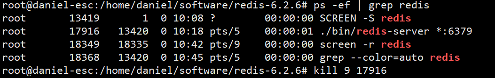

# 一、用户

### 1、创建用户

#### 添加用户

```sh
root@daniel-esc:~# useradd -d /home/daniel -m -s /bin/bash daniel
```

#### 修改密码

```sh
root@daniel-esc:~# passwd daniel
```


## root权限

```sh
# 修改文件权限
chomd 777 /etc/sudoers

vim /etc/sudoers
# 切换至daniel账户
su -l daniel
```


# 二、JDK

在/home/daniel/software目录下开启终端，解压jdk安装包

```
daniel@daniel:~/software$ tar -zxvf jdk-9.0.1_linux-x64_bin.tar.gz 
```

## 1、配置环境

`/etc/profile`文件的改变会涉及到系统的环境，也就是有关Linux环境变量的东西

所以，我们要将jdk配置到`/etc/profile`，才可以在任何一个目录访问jdk

```
daniel@daniel:~/software$ vim /etc/profile
```

按i进入编辑，在profile文件尾部添加如下内容

```sh
JAVA_HOME=/home/daniel/software/jdk1.8.0_301
PATH=$JAVA_HOME/bin:$PATH
CLASSPATH=.:$JAVA_HOME/lib/dt.jar:$JAVA_HOME/lib/tools.jar
export JAVA_HOME
export PATH
export CLASSPATH
```

保存并退出编辑（esc :wq）

通过命令source /etc/profile让profile文件立即生效

```sh
daniel@daniel:~/software$ source /etc/profile
```

## 2、测试是否安装成功

```sh
daniel@daniel:~/software$ java -version
```


# 三、解压

```sh
(1) *.tar 用 tar –xvf 解压
(2) *.gz 用 gzip -d或者gunzip 解压
(3) *.tar.gz和*.tgz 用 tar –xzf 解压
(4) *.bz2 用 bzip2 -d或者用bunzip2 解压
(5) *.tar.bz2用tar –xjf 解压
(6) *.Z 用 uncompress 解压
(7) *.tar.Z 用tar –xZf 解压
(8) *.rar 用 unrar e解压
(9) *.zip 用 unzip 解压
(10) *.xz 用 xz -d 解压
(11) *.tar.xz 用 tar -zJf 解压
```

# 四、系统常用命令

## 1、Screen命令

### 语法

```sh
screen [-AmRvx -ls -wipe][-d <作业名称>][-h <行数>][-r <作业名称>][-s <shell>][-S <作业名称>]
```

**参数说明**：

- -A 　将所有的视窗都调整为目前终端机的大小。
- -d<作业名称> 　将指定的screen作业离线。
- -h<行数> 　指定视窗的缓冲区行数。
- -m 　即使目前已在作业中的screen作业，仍强制建立新的screen作业。
- -r<作业名称> 　恢复离线的screen作业。
- -R 　先试图恢复离线的作业。若找不到离线的作业，即建立新的screen作业。
- -s<shell> 　指定建立新视窗时，所要执行的shell。
- -S<作业名称> 　指定screen作业的名称。
- -v 　显示版本信息。
- -x 　恢复之前离线的screen作业。
- -ls或--list 　显示目前所有的screen作业。
- -wipe 　检查目前所有的screen作业，并删除已经无法使用的screen作业。

### 安装 Screen

现在许多的 Linux 发行版通常都预装了 Screen 。通过运行以下命令，可以查看系统是否安装了 Screen ：

```sh
$ screen --version
Screen version 4.06.02 (GNU) 23-Oct-17 
```

如果你的系统并未安装 Screen ，则可以执行以下命令来安装：

```sh
$ sudo apt install screen
```

### 启动 Screen 会话

想要启动一个 Screen 会话，只需输入以下命令：

```sh
$ screen
```

输入 `screen` 命令后，你会看到一个布满版权信息的界面，你只需按回车或者空格键就可以跳过这个界面。跳过之后，你就可以看到终端界面了。这个终端和原来的终端并没有什么不同，你一样可以浏览文件夹，打开文件，在原来的终端中能做到的事情，它也可以做到。

你也可以在启动 Screen 会话时，使用 `-S` 参数给会话起名字。例如，我想启动一个叫 `alvin` 的 Screen 会话：

```sh
$ screen -S daniel
```

当你启动了不止一个 Screen 会话时，这可以用来区分其他 Screen 会话。

进入 Screen 终端后，按 `Ctrl a+?` 快捷键，可以查看 Screen 所附带的所有命令：

### 分离与重新连接 Screen 会话

假如你要更新系统，你输入更新命令后，是需要等待很长时间才更新完毕的。这时，如果你没用 `screen` 命令，一旦你的网络连接断开了，那么更新就会被打断，你就必须要重新开始更新。

Screen 会话的分离功能可以解决这个问题。你可以进入 Screen 终端里执行更新命令，然后输入会话分离快捷键 `Ctrl a+d` ,你会看到以下提示信息：

这就表示你已经成功从 Screen 会话中分离出来并回到原来的 Shell 会话中了。这时，Screen 会话会继续留在后台执行更新任务。而且无论是网络断开连接，还是关闭原来的 Shell 会话，它都不会受到影响。

当然，如果你来不及按会话分离快捷键网络就断开了，Screen 会话也不会关闭，它一样会继续留在后台执行更新任务。

如果你想重新连接到已分离的 Screen 会话，以查看更新进程，只需执行以下命令：

```sh
$ screen -r
```

需要注意的是，该命令只适用于当前终端只启动了一个 Screen 会话的情况。

### 嵌套 Screen 会话

嵌套 Screen 会话，顾名思义，就是 Screen 会话中的 Screen 会话，是实现用户在一个窗口中使用多个终端的方法之一。

想要启动一个嵌套 Screen 会话很简单，你只需要在 Screen 终端再次输入 `screen` 命令，或者按 `Ctrl a+c` 快捷键，这会在你原来的 Screen 会话中再启动一个 Screen 会话，而原来的 Screen 会话则会在后台保持活动。

例如，你运行了 `top` 命令来监控系统的 CPU 的使用情况：

```sh
$ top
```

而你既不想关掉这个 `top` 进程，又想同时做其他的任务，那么你就可以使用 `Ctrl a+c` 快捷键来启动一个新的 Screen 会话，这样，你既可以保持 `top` 命令在后台运行，又可以去执行其他的任务。

而如果你想切换回执行 `top` 命令的 Screen 会话，可以使用快捷键 `Ctrl a+n` （切换至下一个 Screen 会话）或者 `Ctrl a+p` （切换至上一个 Screen 会话）进行切换。

### 分离并启动新的 Screen 会话

从 Screen 会话中分离出来再启动新的 Screen 会话，也可以实现用户在一个窗口中使用多个终端。

例如，你启动一个 Screen 会话，然后输入 `df -h` 来查看硬盘的使用情况：

```sh
$ df -h
```

然后你可以按 `Ctrl a+d` 快捷键从 Screen 会话中分离出来，回到原来的终端。这时你就可以再次输入 `screen` 命令启动一个新的 Screen 会话来执行其他的任务。

如果你想重新连接回运行 `df -h` 命令的 Screen 会话，则需要先从新的 Screen 会话中分离出来，然后尝试输入 `screen -r` 命令。这时，由于你并行启动了多个 Screen 会话，然而 `screen` 命令并不知道你想要重新连接到哪个会话中，因此，你会看到以下提示信息：

从图中可以看到，每个 Screen 会话都有自己的 ID（ 4352 与 4294 ）以及自己的名字（ `pts-0.lxlinux` ）。这里可以看到两个会话的名字都是 `pts-0.lxlinux` ，那是因为我启动 Screen 会话的时候，没有指定名字，因此它们都以默认的名字作为自己的名字。

想要重新连接到运行 `df -h` 命令的 Screen 会话，你只需在 `screen -r` 命令后面再加上会话的 ID 就可以了，像这样：

```sh
$ screen -r 4352
```

当然，如果在启动 Screen 会话时，你给会话指定了独一无二的名字，那么你也可以通过会话的名字来指定重新连接到哪个会话，例如，重新连接到名字为 `alvin` 的会话：

```sh
$ screen -r alvin
```

如果你并不知道 Screen 会话的 ID 以及名字，你也可以通过以下命令来查看：

```sh
$ screen -ls
```

### 关闭 Screen 会话

要关闭 Screen 会话很简单，就和关闭平常的会话一样，你可以使用 `Ctrl d` 快捷键，也可以输入 `exit` 命令关闭：

```sh
$ exit
```

### 批量关闭会话

如果有20个screen，关闭所有screen

```sh
screen -ls|awk 'NR>=2&&NR<=20{print $1}'|awk '{print "screen -S "$1" -X quit"}'|sh
```


## 2、ps命令

### 查找进程

```sh
ps -ef | grep redis
```



```sh
# 杀死进程
kill -s 9 17916  # 17916为进程号
```

```sh
# 查找程序
ps -aux | grep server.properties # 文件名
```

### 常用

```sh
ps a 	# 显示现行终端机下的所有程序，包括其他用户的程序。
ps -A	# 显示所有程序。 
ps c 	# 列出程序时，显示每个程序真正的指令名称，而不包含路径，参数或常驻服务的标示。 
ps -e	# 此参数的效果和指定"A"参数相同。 
ps e 	# 列出程序时，显示每个程序所使用的环境变量。 
ps f 	# 用ASCII字符显示树状结构，表达程序间的相互关系。 
ps -H	# 显示树状结构，表示程序间的相互关系。 
ps -N	# 显示所有的程序，除了执行ps指令终端机下的程序之外。 
ps s 	# 采用程序信号的格式显示程序状况。 
ps S 	# 列出程序时，包括已中断的子程序资料。 
ps -t	# 指定终端机编号，并列出属于该终端机的程序的状况。 
ps u 	# 以用户为主的格式来显示程序状况。 
ps x 	# 显示所有程序，不以终端机来区分。
```

ps是显示当前状态处于running的进程，grep表示在这些里搜索，而ps aux是显示所有进程和其状态。

````sh
$ ps aux | grep amoeba
查到amoeba的进程
$ kill -s 9 pid
杀死进程
````

## 3、删除文件文件夹

```sh
rm 文件名 # -r 表示强制删除目录及文件
rmdir 文件夹 #rmdir命令进行文件夹删除，文件夹必须为空

rm -r filename # 删除文件或文件夹及其文件
```

## 4、查找、展示文件

### tail命令

```sh
# 实时展示文件内容
tail -f XXX.log

# 输出最后200个字符
tail -c 200 app.aclifewei.log

# 从第1000个字符开始输出，一直到最后(文件写入中会一直实时展示)
tail -c +1000 app.aclifewei.log

# 输出最后20行
tail -n 2 app.aclifewei.log
```


