# 一、kafka安装

## 简介

### 什么是kafka

是一款分布式消息发布和订阅系统，它的特点是高性能、高吞吐量

Kafka最初由Linkedin 公司开发，是一个分布式、分区的、多副本的、多订阅者，基于zookeeper 协调的分布式日志系统，也可以作为MQ消息系统。Linkedin 公司在2010 年贡献给了Apache基金会并成为了顶级开源项目

### Kafka的应用场景

场景可以用于 web/nginx 日志、访问日志，消息服务等等。

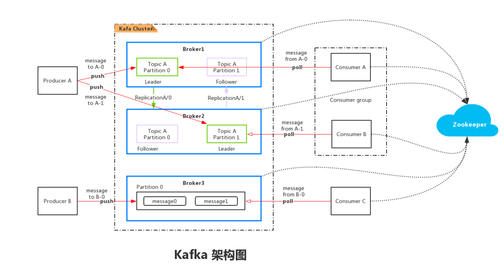

### Kafka名词解释

#### 1、Broker

Kafka集群中包含的服务器，有一个或多个服务器，这种服务器被称为 Broker。

Broker 端不维护数据的消费状态，提升了性能。直接使用磁盘进行存储，线性读写，速度快。避免了在JVM 内存和系统内存之间的复制，减少耗性能的创建对象和垃圾回收。

#### 2、Producer

负责发布消息到Kafka Broker

#### 3、Consumer

负责从Broker 拉取（pull）数据并进行处理。

#### 4、Topic

每条发布到kafka集群的消息都有一个类别，这个类别被称为Topic

物理上不同Topic的消息分开存储，逻辑上一个Topic 的消息虽然保存于一个或多个Broker上但是用户只需指定消费的Topic即课生产或消费数据而不必关心数据存于何处。

#### 5、Partition

Partition 是物理上的概念，每个Topic 包含一个或多个Partition。kafka分配的单位是Partition

每个Topic 可以划分多个分区（每个Topic至少有一个分区），同一topic 不同分区包含不同分区包含的消息是不同的。每个消息在被添加到分区时，都会被分配一个offset （偏移量），它是消息在此分区中的唯一编号，kafka 通过offset 保证消息在分区内的顺序，offset 的顺序不跨分区，即kafka 只保证同一个分区内的消息是有序的。
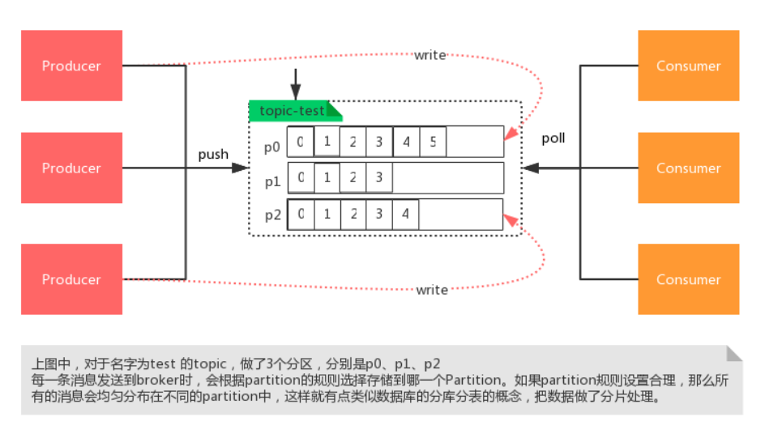

#### 6、Consumer Group

每个Consumer 属于一个特定的Consumer Group

可为每个Consumer 指定Group name，若不指定group name 则属于默认的group

每条消息只可以被Consumer Goup 组中中的一个Consumer消费，但是可以指定多个Consumer Group

所以一个消息在Consumer Group 里面只可以被消费一次。已确定！

#### 7、Topic & Partition

Topic 在螺髻山行可以被认为是一个 queue，每发送一条消息必须指定它的Topic，可以简单理解为必须指明把这条消息放入到哪个queue里。

为了使得kafka 的吞吐率可以线性提高，物理上把Topic 分成一个或多个Partition，每个Partition 在物理上对应一个文件夹，该文件夹下存储这个Partition 的所有消息和索引文件。

若创建 Topic1 和Topic2 两个Topic，且分别有13个和19个分区，则整个集群上相应会生成共32个文件夹

#### 8、Replication-factor

表示该Topic 需要再不同高德broker 中保存几分

## 下载

注意3.0.0版本对于windows系统还有部分不兼容问题，windows下推荐安装3.0.0之前的版本


[kafka下载](https://kafka.apache.org/downloads)

## 启动

### 目录结构

下载后解压文件，目录如下

> bin目录是各种启动文件
>
> config是相关参数配置文件
>
> logs是自建的日志文件
>
> libs是使用到的相关jar文件

在bin目录下含有windows文件夹，用于在windows系统中启动

### 配置参数

进入`config`目录，编辑` server.properties`文件，找到并编辑

```properties
log.dirs= D:\\kafka\\logs
## 日志路径更改
zookeeper.connect=localhost:2181  
## 表示本地运行
listeners=PLAINTEXT://localhost:9092
# 配置ip
```

找到`zookeeper.properties`并编辑

```properties
clientPort=2181
```

Kafka会按照默认，在9092端口上运行，并连接zookeeper的默认端口：2181

启动服务，在window目录下进入cmd，输入下面命令进行启动zookeeper服务，对应加载zookeeper的配置文件，kafka依赖zookeeper监控其状态

```sh
zookeeper-server-start.bat D:\kafka\config\zookeeper.properties

# linux系统下启动zookeeper
bin/kafka-server-stop.sh config/server.properties
```

然后启动kafka服务，对应加载相应配置文件

```sh
kafka-server-start.bat D:\kafka\config\server.properties
# linux系统下启动kafka
bin/kafka-server-start.sh config/server.properties
```

### 启动时常见错误

命令太长错误：此时需要将kafka目录提高层级，最好直接放在D盘根目录下

## kafka-monitor项目(kafka监控工具)

### 拉取项目

kafka-monitor 项目用于监控kafka数据，项目地址为https://github.com/linxin26/kafka-monitor

通过git命令拉取项目

```sh
git clone https://github.com/linxin26/kafka-monitor.git
```

### 修改配置

等待项目下载依赖后，修改配置文件

查看zookeeper服务端口，对应修改端口号


修改配置文件


## 搭建自己的zookeeper

### 下载

[Zookeeper下载](https://zookeeper.apache.org/releases.html)

### 配置zookeeper的java环境

进入bin目录中，打开zkEnv.sh文件，添加java运行环境jdk的路径

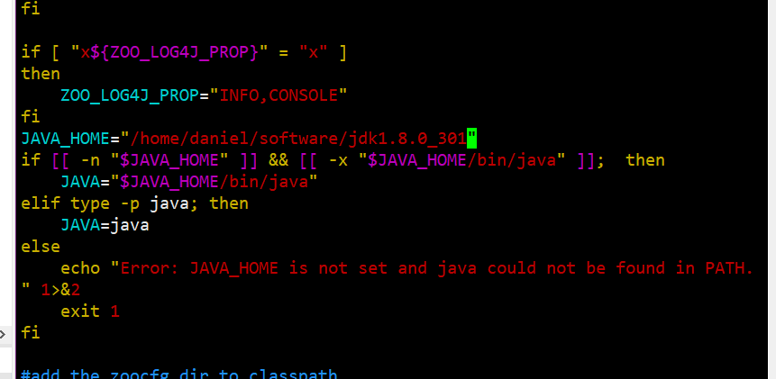

```

```


# 二、kafka的基本使用

### 启动服务

```sh
#启动zookeeper
bin\windows\zookeeper-server-start.bat config\zookeeper.properties
#启动kafka
bin\windows\kafka-server-start.bat config\server.properties
```

### 创建Topic主题

topic可以实现消息的分类，不同消费者订阅不同的topic

执行以下命令可以创建名为`daniel`的topic ,这个topic只有一个`partition`,并且备份因子也设置为1：

```sh
bin\windows\kafka-topics.bat --create --zookeeper localhost:2181 --replication-factor 1 --partitions 1 --topic daniel
# linux下
bin/kafka-topics.sh --create --zookeeper localhost:2181 --replication-factor 1 --partitions 1 --topic daniel
```


### 删除主题

```
bin/kafka-topics.sh  --delete --zookeeper localhost:2181  --topic daniel
```


### 查看创建的topic列表

```sh
bin\windows\kafka-topics.bat --list --zookeeper localhost:2181
# linux下查看
bin/kafka-topics.sh --list --zookeeper localhost:2181
```


### 查看主题详细信息

```sh
bin/kafka-topics.sh --describe --zookeeper 114.116.88.252:2181 --topic my-replicated-topic
```


### 启动producer

```sh
bin\windows\kafka-console-producer.bat --broker-list localhost:9092 --topic daniel
# linux下
bin/kafka-console-producer.sh --broker-list localhost:9092 --topic daniel
```

### 启动Consumer

```sh
# --from-beginning 添加该命令则从开始获取消息
bin\windows\kafka-console-consumer.bat --bootstrap-server localhost:9092 --topic daniel --from-beginning
# --from-beginning 不添加该命令则从当前offset（偏移量）+1位置开始获取消息
bin\windows\kafka-console-consumer.bat --bootstrap-server localhost:9092 --topic daniel

#linux下
# --from-beginning 添加该命令则从开始获取消息
bin/kafka-console-consumer.sh --bootstrap-server localhost:9092 --topic daniel --from-beginning
# --from-beginning 不添加该命令则从当前offset（偏移量）+1位置开始获取消息
bin/kafka-console-consumer.sh --bootstrap-server localhost:9092 --topic daniel
```


windows中会将消息保存到本地，如图所示：


在daniel-0中会保存数据


### 多个消费者消费同一个生产者数据

```sh
# （启动cmd）生产者
bin\windows\kafka-console-producer.bat --broker-list localhost:9092 --topic daniel

# （启动两个cmd输入以下命令）消费者
bin\windows\kafka-console-consumer.bat --bootstrap-server localhost:9092 --topic daniel
```


两个都能收到

### 设置组

#### 单播消息

我们可以通过配置组的方式来定义消费者，（在同一组将收不到消息，非同一个组或未分组的消费者则可以收到数据）先设置组的的消费者会受到，后面再设置同一个组则后面的都收不到消息。同一个消费组只有一个消费者可以收到消息。

```sh
bin\windows\kafka-console-consumer.bat --bootstrap-server localhost:9092 --consumer-property group.id=danielGroup1 --topic daniel

# linux下
bin/kafka-console-consumer.sh --bootstrap-server localhost:9092 --consumer-property group.id=danielGroup1 --topic daniel
```


#### 多播消息

不同消费组订阅同一个topic，那么不同的消费组中只有一个消费者能收到消息，也就是多个消费组都能收到消息但每个组织有一个消费者能收到。

```sh
# 生产者
bin\windows\kafka-console-producer.bat --broker-list localhost:9092 --topic daniel

# danielGropu1组（可以收到）
# 消费者
bin\windows\kafka-console-consumer.bat --bootstrap-server localhost:9092 --consumer-property group.id=danielGroup1 --topic daniel

# danielGropu2组（可以收到）
# 消费者
bin\windows\kafka-console-consumer.bat --bootstrap-server localhost:9092 --consumer-property group.id=danielGroup2 --topic daniel

# danielGropu组 (只有一个消费者可以收到)
# 消费者1
bin\windows\kafka-console-consumer.bat --bootstrap-server localhost:9092 --consumer-property group.id=danielGroup --topic daniel
# 消费者2
bin\windows\kafka-console-consumer.bat --bootstrap-server localhost:9092 --consumer-property group.id=danielGroup --topic daniel
```


### 查看当前集群中组信息

```sh
bin\windows\kafka-consumer-groups.bat --bootstrap-server localhost:9092 --list
# linux下
bin/kafka-consumer-groups.sh --bootstrap-server localhost:9092 --list
```


### 查看组的详细信息

```sh
bin\windows\kafka-consumer-groups.bat --bootstrap-server localhost:9092 --describe --group danielGroup1
# linux下
bin/kafka-consumer-groups.sh --bootstrap-server localhost:9092 --describe --group danielGroup1
```

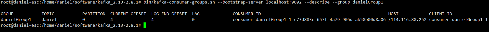

Current-offset：当前消费者已经消费的偏移量

Log-end-offset：主题对应分区消息结束的偏移量

Lag：当前消费组未消费的消息数

# 三、主题和分区

## 主题Topic

主题topic在kafka中是一个逻辑的概念，kafka通过topic对消息进行分类，不同的topic会被订阅该topic的消费者消费，但是消息会有很多，且消息通过log文件进行保存，因此kafka提出了pratition（分区的概念）分布式存储消息。

例如下面一个主题中含有三个pratition（p0,p1,p2）

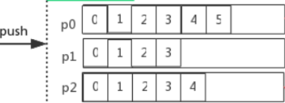

## Pratition分区

kafka通过pratition分区，来将一个topic的消息进行分区存储：

​	a.分区存储避免了单个文件过大

​	b.提高了io的读写效率，可同时在多个分区读写

### 为一个topic创建多个分区

```sh
#linux下      --partitions 3 来创建分区
bin/kafka-topics.sh --create --zookeeper localhost:2181 --replication-factor 1 --partitions 3 --topic daniel2
```

### 查看该分区

```sh
#linux下
bin/kafka-topics.sh --describe --zookeeper localhost:2181 --topic daniel2
```

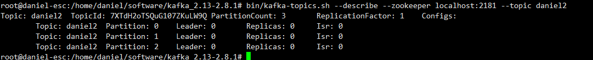

### kafka中的日志文件

kafka会默认创建_consumer_offsets主题，并分配50个分区，用于存储kafka其他消费者消费其他主题时上报的偏移量，至于提交给谁，通过哈希算法来决定

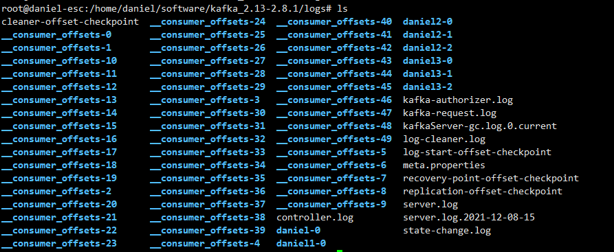

# 四、kafka集群及副本

## 1、集群搭建

### 模拟集群搭建

首先需要启动zookeeper服务器，详情参照[zookeeper笔记](../Zookeeper/zookeeper.md)

```sh
bin/zkServer.sh start conf/zoo.cfg
```

修改同一台服务器配置文件server.properties,复制三份

```sh
cp config/server.properties config/server1.properties
cp config/server.properties config/server2.properties
cp config/server.properties config/server3.properties
```

通过vim修改server1.properties

```properties
broker.id=1
listeners=PLAINTEXT://192.168.0.61:9092
advertised.listeners=PLAINTEXT://114.116.88.252:9092
log.dirs=/home/daniel/software/kafka_2.13-2.8.1/logs_1
zookeeper.connect=114.116.88.252:2181
```

通过vim修改server2.properties

```properties
broker.id=2
listeners=PLAINTEXT://192.168.0.61:9093
advertised.listeners=PLAINTEXT://114.116.88.252:9093
log.dirs=/home/daniel/software/kafka_2.13-2.8.1/logs_2
zookeeper.connect=114.116.88.252:2181
```

通过vim修改server3.properties

```properties
broker.id=3
listeners=PLAINTEXT://192.168.0.61:9094
advertised.listeners=PLAINTEXT://114.116.88.252:9094
log.dirs=/home/daniel/software/kafka_2.13-2.8.1/logs_3
zookeeper.connect=114.116.88.252:2181
```

另一台服务器（windows）通过vim修改server.properties

```properties
broker.id=4
listeners=PLAINTEXT://172.25.14.20:9092
advertised.listeners=PLAINTEXT://47.93.181.157:9092
log.dirs=C:\\BaiduNetdiskDownload\\kafka\\logs
zookeeper.connect=114.116.88.252:2181
```

分别启动

```sh
# linux服务器
bin/kafka-server-start.sh config/server1.properties
bin/kafka-server-start.sh config/server2.properties
bin/kafka-server-start.sh config/server3.properties
# windows服务器
bin\windows\kafka-server-start.bat config\server.properties
```

### 查看当前集群节点

通过zookeeper客户端可以查看当前连接该zookeeper的broker有哪些

```sh
# 打开zk客户端
bin/zkCli.sh
```

查看当前连接节点

```sh
ls /brokers/ids
```


至此1，2，3，4四个节点配置成功。

## 2、副本

我们先创建一个主题，该主题包含2个分区和3个副本

```sh
bin/kafka-topics.sh --create --zookeeper 114.116.88.252:2181 --replication-factor 3 --partitions 2 --topic my-replicated-topic
```

查看该主题详情

```sh
bin/kafka-topics.sh --describe --zookeeper 114.116.88.252:2181 --topic my-replicated-topic
```

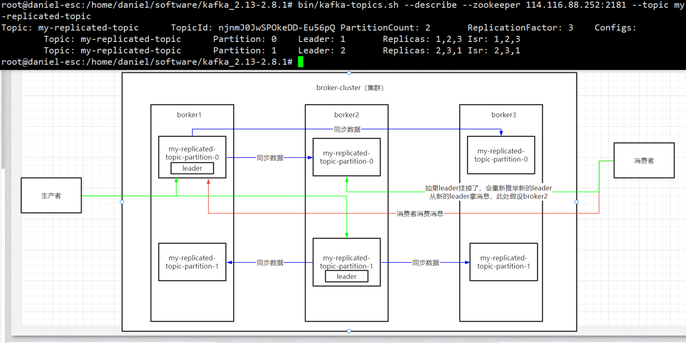

leader：当前主副本为1，代表当发送消息时分区1的broker1会接收消息，当查询消息时也是broker1，只是broker2和broker3会被同步broker1的数据。

replicas：当前集群的节点

isr：表示当前同步数据的节点是否正常，例如：broker2如果效率及其慢，此时ISR只会显示：1,3

flower：接收leader同步的数据

副本其实就是作为预备的broker，防止主节点宕机

### 日志文件

我们可以查看日志文件


这三个文件分别对应三个broker，但我们初次搭建时，如果新建主题的副本数为3时，那么我们会在这三个文件夹下都看的到该主题，如果分区是2的话每个文件夹都会包含关于该主题的两个分区文件夹

值的注意的是，在没有创建生产者和消费者时，默认的存放偏移量的50个文件夹（`__consumer_offsets-xx`）不会被创建

我们尝试创建单个主题，并指定该主题为1分区，1副本，并创建其生产者和消费者，看看会有什么效果

```sh
bin/kafka-topics.sh --create --zookeeper 114.116.88.252:2181 --replication-factor 1 --partitions 1 --topic daniel
```

生产者

```sh
bin/kafka-console-producer.sh --broker-list 114.116.88.252:9092 --topic daniel
```

消费者

```sh
 bin/kafka-console-consumer.sh --bootstrap-server 114.116.88.252:9092 --topic daniel --from-beginning
```

发送消息正常

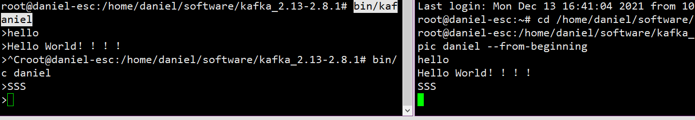

此时查看三个log文件夹会发现

logs_1文件夹


logs_2文件夹

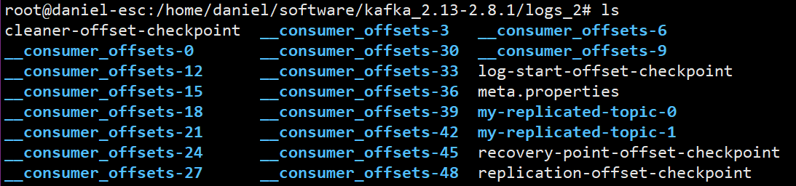

logs_3文件夹

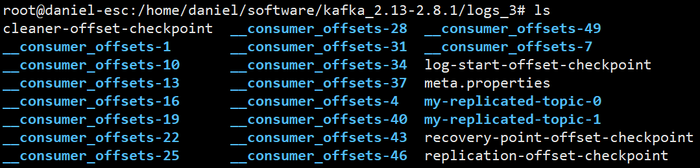

默认的`__consumer_offsets-xx` 文件会被轮询分到三个log文件夹中，而刚刚指定的主题daniel创建在broker1中daniel-0.

所以说在kafka集群中，所有的节点都共用`__consumer_offsets` 

### 集群消息的发送

```sh
bin/kafka-console-producer.sh --broker-list 114.116.88.252:9092,114.116.88.252:9093,114.116.88.252:9094 --topic my-replicated-topic
```

### 集群消息的接收

```sh
bin/kafka-console-consumer.sh --bootstrap-server 114.116.88.252:9092,114.116.88.252:9093,114.116.88.252:9094 --topic my-replicated-topic --from-beginning

```

指定消费组消费

```sh
bin/kafka-console-consumer.sh --bootstrap-server 114.116.88.252:9092,114.116.88.252:9093,114.116.88.252:9094 --topic my-replicated-topic --from-beginning --consumer-property group.id=cusGroup1
```

消息接收正常

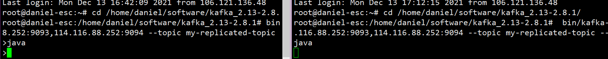

### 消费原理

假设集群中有四个主题，他们分别有自己的分区，消费组A和消费组B的消费情况如下

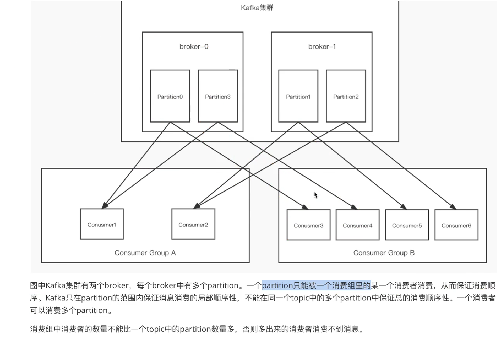

始终想着消费者的数量必须小于等于分区数量，也就是一个消费者可以多消费消息，但一个分区不能被多个消费者消费（目的是保证消费者消费的顺序）

# 五、kafka Java客户端使用

## 生产者

### 导入依赖

```xml
<dependency>
    <groupId>org.springframework.kafka</groupId>
    <artifactId>spring-kafka</artifactId>
</dependency>
<dependency>
    <groupId>com.alibaba</groupId>
    <artifactId>fastjson</artifactId>
    <version>1.2.71</version>
</dependency>
```

### 生产者简单实现类

以下是简单的消息发送过程

```java
public class MyKafkaProducer {
    private static final String TOPIC_NAME = "my-replicated-topic";
    public static void main(String[] args) throws ExecutionException, InterruptedException {
        // 1.配置属性
        Properties pros = new Properties();
        // 设置消息发往那个kafka服务
        pros.put(ProducerConfig.BOOTSTRAP_SERVERS_CONFIG,"114.116.88.252:9092,114.116.88.252:9093,114.116.88.252:9094");
        //
        pros.put(ProducerConfig.KEY_SERIALIZER_CLASS_CONFIG, StringSerializer.class.getName());
        
        pros.put(ProducerConfig.VALUE_SERIALIZER_CLASS_CONFIG, StringSerializer.class.getName());
        
        // 2.创建生产者客户端，并传入参数
        Producer<String, String> producer = new KafkaProducer<String, String>(pros);
        
        // 3.创建要发送的消息
        ProducerRecord<String, String> producerRecord = new ProducerRecord<>(TOPIC_NAME, "mykey", "Hello World");
    
        // 4.通过producer发送消息
        RecordMetadata recordMetadata = producer.send(producerRecord).get();
        System.out.println("同步消息发送结果：");
        System.out.println("topic:"+recordMetadata.topic());
        System.out.println("partition:"+recordMetadata.partition());
        System.out.println("offset:"+recordMetadata.offset());
    }
}
```

关于生产者创建消息的细节

ProducerRecord可接收三个初始化参数，也可以接收四个参数

当传入三个参数时，参数2 `mykey` 则会通过其hash值算出往哪个分区发送。

```java
// 具体发送给那个分区：（key的hash值）% partitionNum
ProducerRecord<String, String> producerRecord = new ProducerRecord<>(TOPIC_NAME, "mykey", "Hello World");
```

当传入四个参数时，参数2传入Integer类型指定发送至那个分区。

```java
// 参数2设置为0，表示发送到partition-0
ProducerRecord<String, String> producerRecord = new ProducerRecord<>(TOPIC_NAME, 0,"mykey", "Hello World");
```

### 生产者的消息发送的同步


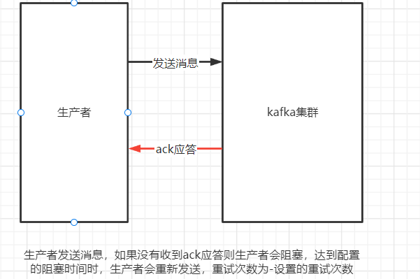

```java
// 4.通过producer发送消息
RecordMetadata recordMetadata = producer.send(producerRecord).get();
System.out.println("同步消息发送结果：");
System.out.println("topic:"+recordMetadata.topic());
System.out.println("partition:"+recordMetadata.partition());
System.out.println("offset:"+recordMetadata.offset());
```

当producer发送消息后会调用get()方法来获取发送后的数据，但是如果发送不成功，则get将获取不到数据，此时程序会在此阻塞，例如：当前主题有两个分区编号为0，1，但你指定分区为3此时当代码执行到send时会被阻塞，代码不会向后执行

### 生产者的消息发送的异步

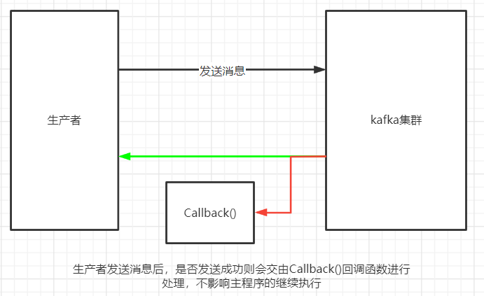

```java
// 4.2通过producer异步发送消息
producer.send(producerRecord, new Callback() {
    @Override
    public void onCompletion(RecordMetadata recordMetadata, Exception e) {
        if (e!=null){
            System.err.println("发送消息失败："+e.getStackTrace());
        }
        if (recordMetadata!=null){
            System.out.println("同步消息发送结果：");
            System.out.println("topic:"+recordMetadata.topic());
            System.out.println("partition:"+recordMetadata.partition());
            System.out.println("offset:"+recordMetadata.offset());
        }
    }
});
Thread.sleep(10000);
```

通过异步则不会影响主程序的正常运行。

但是在大多数时候，为了避免消息的丢失会采用同步来发送消息。

### ack机制

在认为请求完成之前，生产者要求Leader收到的确认数。这控制了发送的记录的持久性。允许进行以下设置：

ack=0：表示消息发送后，不论集群是否接收到消息则立即返回ack，此时容易造成kafka消息的丢失，效率最高但不安全。

ack=1：这意味着leader会将记录写入其本地日志，但会在不等待所有flower的完全确认的情况下做出响应。在这种情况下，如果领导者在确认记录后立即失败，但在追随者复制它之前，则记录将丢失。表示当前消息必须被集群的leader接收后将消息存储在本地的000000000.log文件后才能进行ack应答，性能和安全性相对均衡。

ack=-1/all：配置此项时，且同时配置min.insync.replicas=2(默认此配置为1，为1表示一台副本接收到)时，表示当前消息发送到集群时需要leader和1台副本（flower）同步完数据后返回ack，此时就有两个broker接收到了消息，这种方式最安全，但效率最差。

配置方式：

```java
Properties pros = new Properties();
pros.put(ProducerConfig.ACKS_CONFIG,"1");
```

### 其他主要配置

发送重试配置，当生产者未收到ack时，可配置其重新发送

```java
// 如果没有收到ack则重试，此配置表示重试的次数，表示发送消息失败后允许共3次重试
pros.put(ProducerConfig.RETRIES_CONFIG,3);
// 表示发送失败后重试的时间间隔(300ms)
pros.put(ProducerConfig.RETRY_BACKOFF_MS_CONFIG,300);
```

缓冲区配置

```java
// 表示缓存区大小以字节为单位
// 如果设置了本地缓冲区，kafka本地会开启线程将消息先发送到缓冲区，可以提高消息的发送性能，默认值为32MB=33554432字节
pros.put(ProducerConfig.BUFFER_MEMORY_CONFIG,32*1024*1024);
// 表示批量发送消息的大小
// kafka会从缓冲区拿数据，进行批量发送，当一个batch满了16kb则发送
pros.put(ProducerConfig.BATCH_SIZE_CONFIG,16*1024);
// 表示每一个batch的等待时间，默认为0ms，表示立即发送，影响性能
// 此处配置为10毫秒，表示当10ms内，batch已经满了就发送出去
// 如果batch在10ms内没有达到16kb，那么10ms时也必须将消息发送出去，保证了消息不能延长太久发送
pros.put(ProducerConfig.LINGER_MS_CONFIG,10);
```

序列化配置

```java
 // 把发送的key从字符串序列化为字节数组
pros.put(ProducerConfig.KEY_SERIALIZER_CLASS_CONFIG, StringSerializer.class.getName());
// 把发送的value从字符串序列化为字节数组
pros.put(ProducerConfig.VALUE_SERIALIZER_CLASS_CONFIG, StringSerializer.class.getName());
```

### CountDownLatch的使用

```java
private static final String TOPIC_NAME = "my-replicated-topic";
public static void main(String[] args) throws ExecutionException, InterruptedException {
    // 1.配置属性
    Properties pros = new Properties();

    // 设置消息发往那个kafka服务
    pros.put(ProducerConfig.BOOTSTRAP_SERVERS_CONFIG,"114.116.88.252:9092,114.116.88.252:9093,114.116.88.252:9094");

    // 把发送的key从字符串序列化为字节数组
    pros.put(ProducerConfig.KEY_SERIALIZER_CLASS_CONFIG, StringSerializer.class.getName());
    // 把发送的value从字符串序列化为字节数组
    pros.put(ProducerConfig.VALUE_SERIALIZER_CLASS_CONFIG, StringSerializer.class.getName());

    // 2.创建生产者客户端，并传入参数
    Producer<String, String> producer = new KafkaProducer<String, String>(pros);

    // 
    int msgNum = 5;
    final CountDownLatch countDownLatch = new CountDownLatch(msgNum);

    for( int i = 1 ;i <= 5 ; i++ ){
        // 3.创建要发送的消息
        Order order = new Order();
        order.setOid("10000"+i);
        order.setInfo("msg"+i);
        ProducerRecord<String, String> producerRecord = new ProducerRecord<>(TOPIC_NAME,order.getOid() , JSON.toJSONString(order));
        // 4.2通过producer异步发送消息
        producer.send(producerRecord, new Callback() {
            @Override
            public void onCompletion(RecordMetadata recordMetadata, Exception e) {
                if (e!=null){
                    System.err.println("发送消息失败："+e.getStackTrace());
                }
                if (recordMetadata!=null){
                    System.out.println("同步消息发送结果：");
                    System.out.println("topic:"+recordMetadata.topic());
                    System.out.println("partition:"+recordMetadata.partition());
                    System.out.println("offset:"+recordMetadata.offset());
                }
                countDownLatch.countDown();
            }
        });
    }
    // 判断当前countDownLatch是不是0，如果不是则等待5秒
    countDownLatch.await(5, TimeUnit.SECONDS);
    producer.close();
}

```

## 消费者

### 消费者简单实现类

```java
public class MyKafkaConsumer {
    private static final String TOPIC_NAME = "my-replicated-topic";
    private static final String GROUP_NAME = "testGroup";
    public static void main(String[] args) {
        // 1.配置属性
        Properties pros = new Properties();
        // 配置服务集群
        pros.put(ConsumerConfig.BOOTSTRAP_SERVERS_CONFIG,"114.116.88.252:9092,114.116.88.252:9093,114.116.88.252:9094");
        // 配置消费组名
        pros.put(ConsumerConfig.GROUP_ID_CONFIG,GROUP_NAME);
        // 配置key序列化
        pros.put(ConsumerConfig.KEY_DESERIALIZER_CLASS_CONFIG, StringDeserializer.class.getName());
        // 配置value序列化
        pros.put(ConsumerConfig.VALUE_DESERIALIZER_CLASS_CONFIG,StringDeserializer.class.getName());
        
        // 2.创建消费者客户端
        Consumer<String, String> consumer = new KafkaConsumer<>(pros);
        
        // 消费者订阅主题列表
        consumer.subscribe(Arrays.asList(TOPIC_NAME));
        
        // 3.获取消息
        while(true){
            ConsumerRecords<String, String> records = consumer.poll(Duration.ofMillis(1000));
            for (ConsumerRecord<String, String> record : records) {
                System.out.printf("收到的消息：partition = %d,offset = %d,key = %s,value = %s%n"
                        ,record.partition(),record.offset(),record.key(),record.value());
            }
        }
        
    }
    
}

```

### 消费者自动提交offset

kafka的客户端默认是自动提交，可通过属性进行配置

```java
// 配置提交方式（自动提交：true，手动提交：false）
pros.put(ConsumerConfig.ENABLE_AUTO_COMMIT_CONFIG,true);
// 配置自动提交的时间间隔1s
pros.put(ConsumerConfig.AUTO_COMMIT_INTERVAL_MS_CONFIG,1000);
```

消费者poll下来消息后默认情况下，会自动向broker的__consumer_offsets主题提交当前主题的偏移量

自动提交会丢失消息：当消费者还没有消费poll下来的消息时就自动提交了offset，此时消费者挂了，于是下一个消费者消费时就会从提交的偏移量的下一个位置消费，那么之前未被消费的消息就丢失了。

### 消费者手动提交

手动提交需要将ENABLE_AUTO_COMMIT_CONFIG设置为false

```java
// 配置提交方式（自动提交：true，手动提交：false）
pros.put(ConsumerConfig.ENABLE_AUTO_COMMIT_CONFIG,false);
```

手动提交的同步提交

在消费完消息后调用同步提交，当集群返回ack之前会一直阻塞，返回ack后表示提交成功，执行后续逻辑。

```java
while(true){
    ConsumerRecords<String, String> records = consumer.poll(Duration.ofMillis(1000));
    for (ConsumerRecord<String, String> record : records) {
        System.out.printf("收到的消息：partition = %d,offset = %d,key = %s,value = %s%n"
                          ,record.partition(),record.offset(),record.key(),record.value());
    }
	// 当records没有需要消费的消息时就提交
    if (records.count()>0){
        consumer.commitSync();
    }
}
```

手动提交的异步提交

```java
while(true){
            ConsumerRecords<String, String> records = consumer.poll(Duration.ofMillis(1000));
            for (ConsumerRecord<String, String> record : records) {
                System.out.printf("收到的消息：partition = %d,offset = %d,key = %s,value = %s%n"
                        ,record.partition(),record.offset(),record.key(),record.value());
            }
            
            if (records.count()>0){
//                consumer.commitSync();
                consumer.commitAsync(new OffsetCommitCallback() {
                    @Override
                    public void onComplete(Map<TopicPartition, OffsetAndMetadata> offset, Exception e) {
                        if (e!=null){
                            System.err.println("commit offset filed for----->>>  "+offset);
                            System.err.println("commit offset filed exception----->>>  "+e.getStackTrace());
                        }
                    }
                });
            }
        }
```

### 消费者poll消息的过程

消费者与broker之间建立长链接，开始poll消息,在一次poll中建立的长连接会不停拉取消息

此时可配置单次poll消息的条数

```java
// poll消息的最大条数
pros.put(ConsumerConfig.MAX_POLL_RECORDS_CONFIG,500);
// 设置为1000ms，表示每次poll的持续等待时长
ConsumerRecords<String, String> records = consumer.poll(Duration.ofMillis(1000));
```

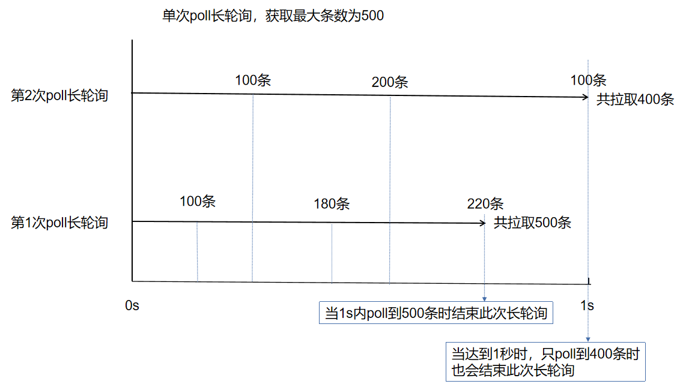

小结：

​	①  如果在1s内的一次拉取就拿到500条，则结束本次poll长轮询，进行while循环

​	②  如果在1秒内一次拉取没有拿到500条，且时间还在1s内则进行下一次拉取，直到拉取到500条，但多次拉取都没达到500条且时间到达1s则结束本次poll长轮询，进行while循环

### 关于两次poll长轮询的时间配置

```java
// 两次poll消息的最大时间间隔30s
pros.put(ConsumerConfig.MAX_POLL_INTERVAL_MS_CONFIG,30*1000);
```

也就是当while循环第一次poll时开始计算，拉取到消息时会开始消费，但每个消费者消费消息的能力不同，虽然poll消息的时间很短，但是消费者消费的时间可能很长，通过该配置可以让broker来确认消费者的能力，当两次poll的时间间隔超过配置的时间（30s），则broker会认为该消费者消费能力弱，会将其踢出消费组，将分区分配给其他消费者。会触发rebalance机制，造成性能开销。

### 消费者的健康状态检查

消费者每隔一段时间会向kafka集群发送'心跳'，当消费者长时间不发送心跳，则kafka集群认为其挂掉，会将其踢出消费组，并将其分区交由其他消费者消费。

```java
// 消费者给broker发送心跳的时间间隔
pros.put(ConsumerConfig.HEARTBEAT_INTERVAL_MS_CONFIG,1000);
// kafka如果超过10秒没有收到消费者的心跳，则把消费者踢出消费组，进行Rebalance机制，将该分区交给其他消费者消费
pros.put(ConsumerConfig.SESSION_TIMEOUT_MS_CONFIG,10*1000);
```

### 消费者指定分区消费

```java
// 消费者指定分区消费
consumer.assign(Arrays.asList(new TopicPartition(TOPIC_NAME,0)));
```

### 消费者的回溯消费

```java
// 消费者从头开始消费
consumer.assign(Arrays.asList(new TopicPartition(TOPIC_NAME,1)));
consumer.seekToBeginning(Arrays.asList(new TopicPartition(TOPIC_NAME,1)));
```

### 消费者指定offset消费

```java
// 消费者指定offset消费
consumer.assign(Arrays.asList(new TopicPartition(TOPIC_NAME,1)));
consumer.seek(new TopicPartition(TOPIC_NAME,1),1900);
```

### 消费者从指定时间点消费

```java
// 从指定的时间点开始消费（当前时间的前一个小时的消息）
// 获取主题下分区
List<PartitionInfo> partitionsInfo = consumer.partitionsFor(TOPIC_NAME);
// 设置时间1小时
Long time = new Date().getTime()-60*60*1000;
// 将每个分区和时间绑定
Map<TopicPartition, Long> map = new HashMap<>();
for (PartitionInfo partition : partitionsInfo) {
    map.put(new TopicPartition(TOPIC_NAME,partition.partition()),time);
}
// 获取每个分区数据(根据前面绑定时间)
Map<TopicPartition, OffsetAndTimestamp> parMap = consumer.offsetsForTimes(map);

for (Map.Entry<TopicPartition, OffsetAndTimestamp> entry : parMap.entrySet()) {
    TopicPartition key = entry.getKey();
    OffsetAndTimestamp value = entry.getValue();
    if (key==null||value==null) continue;
    long offset = value.offset();
    System.out.println("partition:" +key.partition()+"offset:"+offset);
    // 根据时间获取的偏移量来获取数据
    if (value!=null){
        consumer.assign(Arrays.asList(key));
        consumer.seek(key,offset);
    }
}
```

### 新消费组的消费规则

当有新消费组消费消息时，没有配置AUTO_OFFSET_RESET_CONFIG项，则默认获取从该消费组启动后发到主题的消息，但如果设置该项为`earliest` 且该消费组第一次启动，则会从头开始消费，并记录消费的位置，再次重启该消费组时,则不会从头开始，而是从上次消费到的offset位置的下一个开始消费。

```java
/*
    当消费主题的是新的消费组，或者指定offset消费方式，但offset不存在，应如何
    latest(默认)：只消费自己启动后发送到主题的消息
    earliest：第一次从头开始消费，以后按照offset继续消费，区别于seekToBeginning每次从头消费
*/
pros.put(ConsumerConfig.AUTO_OFFSET_RESET_CONFIG,"earliest");
```

# 六、Kafka中的机制

## controller机制

Controller目前主要提供多达10种的Kafka服务功能的实现：

`UpdateMetadataRequest`：更新元数据请求。topic分区状态经常会发生变更(比如leader重新选举了或副本集合变化了等)。由于当前clients只能与分区的leader broker进行交互，那么一旦发生变更，controller会将最新的元数据广播给所有存活的broker。具体方式就是给所有broker发送UpdateMetadataRequest请求

`CreateTopics`: 创建topic请求。当前不管是通过API方式、脚本方式抑或是CreateTopics请求方式来创建topic，做法几乎都是在Zookeeper的/brokers/topics下创建znode来触发创建逻辑，而controller会监听该path下的变更来执行真正的“创建topic”逻辑

`DeleteTopics`：删除topic请求。和CreateTopics类似，也是通过创建Zookeeper下的/admin/delete_topics/<topic>节点来触发删除topic，controller执行真正的逻辑

`分区重分配`：即kafka-reassign-partitions脚本做的事情。同样是与Zookeeper结合使用，脚本写入/admin/reassign_partitions节点来触发，controller负责按照方案分配分区

`Preferred leader分配`：preferred leader选举当前有两种触发方式：1. 自动触发(auto.leader.rebalance.enable = true)；2. kafka-preferred-replica-election脚本触发。两者“玩法”相同，向Zookeeper的/admin/preferred_replica_election写数据，controller提取数据执行preferred leader分配

`分区扩展`：即增加topic分区数。标准做法也是通过kafka-reassign-partitions脚本完成，不过用户可直接往Zookeeper中写数据来实现，比如直接把新增分区的副本集合写入到/brokers/topics/<topic>下，然后controller会为你自动地选出leader并增加分区

`集群扩展`：新增broker时Zookeeper中`/brokers/ids`下会新增znode，controller自动完成服务发现的工作

`broker崩溃`：同样地，controller通过Zookeeper可实时侦测broker状态。一旦有broker挂掉了，controller可立即感知并为受影响分区选举新的leader

`ControlledShutdown`：broker除了崩溃，还能“优雅”地退出。broker一旦自行终止，controller会接收到一个ControlledShudownRequest请求，然后controller会妥善处理该请求并执行各种收尾工作

`Controller leader选举`：controller必然要提供自己的leader选举以防这个全局唯一的组件崩溃宕机导致服务中断。这个功能也是通过Zookeeper的帮助实现的

### leader选举

在kafka集群中，当集群启动后会有一台broker作为leader，而集群中如果leader挂掉此时集群会从剩余的broker中重新选举新的leader。而这只是其中一点。选举机制是通过isr的顺序来进行。如下图：

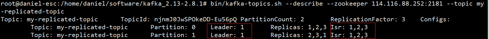

如图所示，此时两个分区的leader都是1，此时如果id为1的broker挂掉了，那么controller会进行后续处理，根据ISR的顺序选举出新的leader。比如1挂掉，则会根据isr顺序选择2，isr顺序是根据其状态稳定来排的，所以我们结束掉1可以看到如下变化

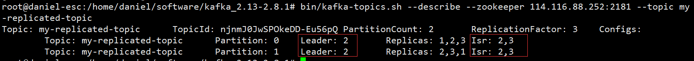

此时leader变为2，isr只剩下2,3

## Kafka Rebalance机制

### 什么是 Rebalance

Rebalance 本质上是一种协议，规定了一个 Consumer Group 下的所有 consumer 如何达成一致，来分配订阅 Topic 的每个分区。

例如：某 Group 下有 20 个 consumer 实例，它订阅了一个具有 100 个 partition 的 Topic 。正常情况下，kafka 会为每个 Consumer 平均的分配 5 个分区。这个分配的过程就是 Rebalance。

### 触发 Rebalance 的时机

Rebalance 的触发条件有3个。

- 组成员个数发生变化。例如有新的 consumer 实例加入该消费组或者离开组。
- 订阅的 Topic 个数发生变化。
- 订阅 Topic 的分区数发生变化。

Rebalance 发生时，Group 下所有 consumer 实例都会协调在一起共同参与，kafka 能够保证尽量达到最公平的分配。但是 Rebalance 过程对 consumer group 会造成比较严重的影响。在 Rebalance 的过程中 consumer group 下的所有消费者实例都会停止工作，等待 Rebalance 过程完成。

### Rebalance 过程分析

Rebalance 过程分为两步：Join 和 Sync。

1. Join 顾名思义就是加入组。这一步中，所有成员都向coordinator发送JoinGroup请求，请求加入消费组。一旦所有成员都发送了JoinGroup请求，coordinator会从中选择一个consumer担任leader的角色，并把组成员信息以及订阅信息发给leader——注意leader和coordinator不是一个概念。leader负责消费分配方案的制定。


1. Sync，这一步leader开始分配消费方案，即哪个consumer负责消费哪些topic的哪些partition。一旦完成分配，leader会将这个方案封装进SyncGroup请求中发给coordinator，非leader也会发SyncGroup请求，只是内容为空。coordinator接收到分配方案之后会把方案塞进SyncGroup的response中发给各个consumer。这样组内的所有成员就都知道自己应该消费哪些分区了。


### Rebalance 场景分析

#### 新成员加入组


#### 组成员“崩溃”

**组成员崩溃和组成员主动离开是两个不同的场景。**因为在崩溃时成员并不会主动地告知coordinator此事，coordinator有可能需要一个完整的session.timeout周期(心跳周期)才能检测到这种崩溃，这必然会造成consumer的滞后。可以说离开组是主动地发起rebalance；而崩溃则是被动地发起rebalance。

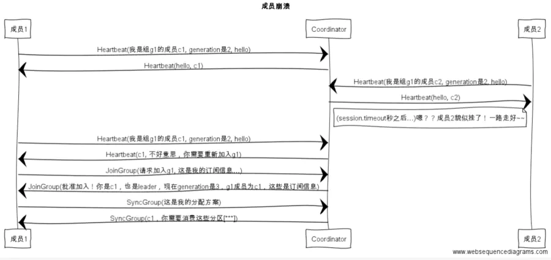

#### 组成员主动离开组

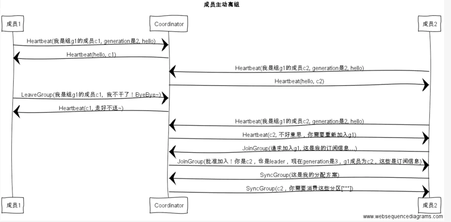

#### 提交位移

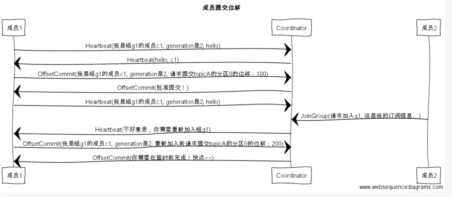

### 如何避免不必要的rebalance

要避免 Rebalance，还是要从 Rebalance 发生的时机入手。我们在前面说过，Rebalance 发生的时机有三个：

- 组成员数量发生变化
- 订阅主题数量发生变化
- 订阅主题的分区数发生变化

后两个我们大可以人为的避免，发生rebalance最常见的原因是消费组成员的变化。

消费者成员正常的添加和停掉导致rebalance，这种情况无法避免，但是时在某些情况下，Consumer 实例会被 Coordinator 错误地认为 “已停止” 从而被“踢出”Group。从而导致rebalance。

当 Consumer Group 完成 Rebalance 之后，每个 Consumer 实例都会定期地向 Coordinator 发送心跳请求，表明它还存活着。如果某个 Consumer 实例不能及时地发送这些心跳请求，Coordinator 就会认为该 Consumer 已经 “死” 了，从而将其从 Group 中移除，然后开启新一轮 Rebalance。这个时间可以通过Consumer 端的参数 session.timeout.ms进行配置。默认值是 10 秒。

除了这个参数，Consumer 还提供了一个控制发送心跳请求频率的参数，就是 heartbeat.interval.ms。这个值设置得越小，Consumer 实例发送心跳请求的频率就越高。频繁地发送心跳请求会额外消耗带宽资源，但好处是能够更加快速地知晓当前是否开启 Rebalance，因为，目前 Coordinator 通知各个 Consumer 实例开启 Rebalance 的方法，就是将 REBALANCE_NEEDED 标志封装进心跳请求的响应体中。

除了以上两个参数，Consumer 端还有一个参数，用于控制 Consumer 实际消费能力对 Rebalance 的影响，即 max.poll.interval.ms 参数。它限定了 Consumer 端应用程序两次调用 poll 方法的最大时间间隔。它的默认值是 5 分钟，表示你的 Consumer 程序如果在 5 分钟之内无法消费完 poll 方法返回的消息，那么 Consumer 会主动发起 “离开组” 的请求，Coordinator 也会开启新一轮 Rebalance。

通过上面的分析，我们可以看一下那些rebalance是可以避免的：

**第一类非必要 Rebalance 是因为未能及时发送心跳，导致 Consumer 被 “踢出”Group 而引发的**。这种情况下我们可以设置 **session.timeout.ms 和 heartbeat.interval.ms** 的值，来尽量避免rebalance的出现。（**以下的配置是在网上找到的最佳实践，暂时还没测试过**）

- 设置 session.timeout.ms = 6s。
- 设置 heartbeat.interval.ms = 2s。
- 要保证 Consumer 实例在被判定为 “dead” 之前，能够发送至少 3 轮的心跳请求，即 session.timeout.ms >= 3 * heartbeat.interval.ms。

将 session.timeout.ms 设置成 6s 主要是为了让 Coordinator 能够更快地定位已经挂掉的 Consumer，早日把它们踢出 Group。

**第二类非必要 Rebalance 是 Consumer 消费时间过长导致的**。此时，**max.poll.interval.ms** 参数值的设置显得尤为关键。如果要避免非预期的 Rebalance，你最好将该参数值设置得大一点，比你的下游最大处理时间稍长一点。

总之，要为业务处理逻辑留下充足的时间。这样，Consumer 就不会因为处理这些消息的时间太长而引发 Rebalance 。

### 相关概念

#### coordinator

Group Coordinator是一个服务，每个Broker在启动的时候都会启动一个该服务。Group Coordinator的作用是用来存储Group的相关Meta信息，并将对应Partition的Offset信息记录到Kafka内置Topic(__consumer_offsets)中。Kafka在0.9之前是基于Zookeeper来存储Partition的Offset信息(consumers/{group}/offsets/{topic}/{partition})，因为ZK并不适用于频繁的写操作，所以在0.9之后通过内置Topic的方式来记录对应Partition的Offset。

每个Group都会选择一个Coordinator来完成自己组内各Partition的Offset信息，选择的规则如下：

- 1，计算Group对应在__consumer_offsets上的Partition
- 2，根据对应的Partition寻找该Partition的leader所对应的Broker，该Broker上的Group Coordinator即就是该Group的Coordinator

Partition计算规则：

```swift
SWIFTpartition-Id(__consumer_offsets) = Math.abs(groupId.hashCode() % groupMetadataTopicPartitionCount)
```

其中groupMetadataTopicPartitionCount对应offsets.topic.num.partitions参数值，默认值是50个分区

### 一次Rebalance所耗时间

#### 测试环境

1个Topic，10个partition，3个consumer

在本地环境进行测试

#### 测试结果

经过几轮测试发现每次rebalance所消耗的时间大概在 **80ms~100ms**平均耗时在**87ms**左右。

## HW和LEO

### Kafka中的HW、LEO、LSO等分别代表什么？

`HW` 、 `LEO` 等概念和上面所说的 `ISR`有着紧密的关系，如果不了解 ISR 可以先看下ISR相关的介绍。

`HW` （`High Watermark`）俗称`高水位`，它标识了一个特定的消息偏移量（offset），消费者只能拉取到这个offset之前的消息。

下图表示一个日志文件，这个日志文件中只有9条消息，第一条消息的offset（LogStartOffset）为0，最有一条消息的offset为8，offset为9的消息使用虚线表示的，代表下一条待写入的消息。日志文件的 HW 为6，表示消费者只能拉取offset在 0 到 5 之间的消息，offset为6的消息对消费者而言是不可见的。


`LEO` （Log End Offset），标识当前日志文件中下一条待写入的消息的offset。上图中offset为9的位置即为当前日志文件的 LEO，LEO 的大小相当于当前日志分区中最后一条消息的offset值加1.分区 ISR 集合中的每个副本都会维护自身的 LEO ，而 ISR 集合中最小的 LEO 即为分区的 HW，对消费者而言只能消费 HW 之前的消息。

------

下面具体分析一下 ISR 集合和 HW、LEO的关系。

假设某分区的 ISR 集合中有 3 个副本，即一个 leader 副本和 2 个 follower 副本，此时分区的 LEO 和 HW 都分别为 3 。消息3和消息4从生产者出发之后先被存入leader副本。

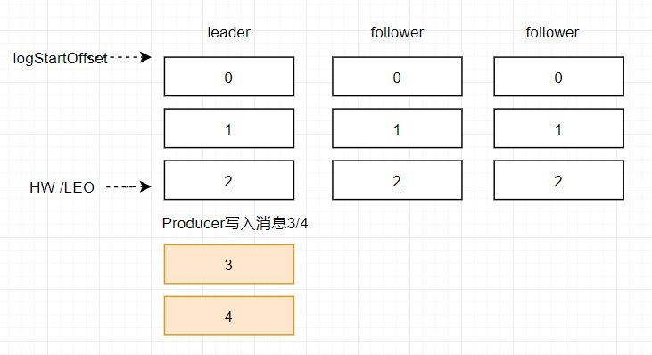


在消息被写入leader副本之后，follower副本会发送拉取请求来拉取消息3和消息4进行消息同步。

在同步过程中不同的副本同步的效率不尽相同，在某一时刻follower1完全跟上了leader副本而follower2只同步了消息3，如此leader副本的LEO为5，follower1的LEO为5，follower2的LEO 为4，那么当前分区的HW取最小值4，此时消费者可以消费到offset0至3之间的消息。


当所有副本都成功写入消息3和消息4之后，整个分区的HW和LEO都变为5，因此消费者可以消费到offset为4的消息了。

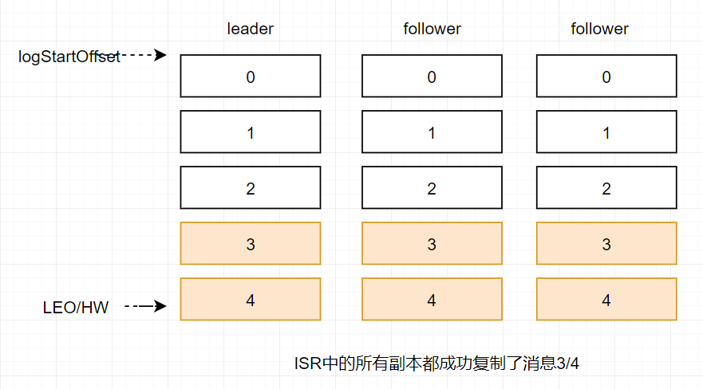

由此可见kafka的复制机制既不是完全的同步复制，也不是单纯的异步复制。事实上，同步复制要求所有能工作的follower副本都复制完，这条消息才会被确认已成功提交，这种复制方式极大的影响了性能。而在异步复制的方式下，follower副本异步的从leader副本中复制数据，数据只要被leader副本写入就会被认为已经成功提交。在这种情况下，如果follower副本都还没有复制完而落后于leader副本，然后leader副本宕机，则会造成数据丢失。kafka使用这种ISR的方式有效的权衡了数据可靠性和性能之间的关系。

# 七、springboot快速搭建


## 项目环境搭建

### 导入依赖

```xml
<dependency>
    <groupId>org.springframework.kafka</groupId>
    <artifactId>spring-kafka</artifactId>
</dependency>
```

### 配置yml

```yml
server:
  port: 7777
  servlet:
    context-path: /kafka
spring:
  kafka:
    bootstrap-servers: 114.116.88.252:9092,114.116.88.252:9093,114.116.88.252:9094
    producer:
      retries: 3 # 重试次数， 设置大于0时，生产者客户端会把发送失败的记录重新发送
      batch-size: 16384 # 每一个batch的大小
      buffer-memory: 33554432 # 缓冲区的大小
      acks: 1 # ack应答方式，可取值：1,0,-1/all
      # 配置key和value的序列化器
      key-serializer: org.apache.kafka.common.serialization.StringSerializer
      value-serializer: org.apache.kafka.common.serialization.StringSerializer
    consumer:
      group-id: default-group # 消费组名
      enable-auto-commit: false # 是否开启自动提交
#      auto-offset-reset: earliest # 开启新消费组时数据获取方式
      # 配置key和value的反序列化器
      key-deserializer: org.apache.kafka.common.serialization.StringDeserializer
      value-deserializer: org.apache.kafka.common.serialization.StringDeserializer
      max-poll-records: 500 # 单次poll记录的最大条数
    listener:
      # record: 当每一个记录被消费者监听器(ListenerConsumer)处理后提交
      # batch:  当每一批poll()数据被消费者监听器(ListenerConsumer)处理后提交
      # time:   当每一批poll()数据被消费者监听器(ListenerConsumer)处理后，距离上次提交时间大于time时提交
      # count:  当每一批poll()数据被消费者监听器(ListenerConsumer)处理后，被处理的record的数量大于等于count时提交
      # count_time: count || time有一个被满足时提交
      # manual: 当每一批poll()数据被消费者监听器(ListenerConsumer)处理后，手动调用Acknowledgment.acknowledge()后提交
      # manual_immediate: 手动调用Acknowledgment.acknowledge()后立即提交提交,通常使用这种
      ack-mode: manual_immediate
```

## 生产者与消费者

### 生产者

```java
@RestController
public class MyBootProducer {
    private static final String TOPIC_NAME = "my-replicated-topic";
    @Autowired
    private KafkaTemplate<String,String> kafkaTemplate;
    
    @RequestMapping("/send")
    public String sendData(){
        kafkaTemplate.send(TOPIC_NAME,0,"key","this is a message");
        return "success";
    }
}

```

### 消费者

##### 单条消费

一条记录一条记录进行消费

```java
@Component
public class MyBootConsumer {
    @KafkaListener(topics = "my-replicated-topic",groupId = "my-group")
    public void listerGroup(ConsumerRecord<String,String> record, Acknowledgment ack){
        System.out.println("record:"+record);
        ack.acknowledge();
    }
}
```

##### 单条多主题，指定分区，指定偏移量消费

```java
@KafkaListener(
    groupId = "testGroup",  // 公共消费组名
    concurrency = "3", // 同一消费组下消费者个数，建议小于等于分区数
    topicPartitions = {
        @TopicPartition(
            topic = "boot",
            partitions ={"0"}), // 指定消费0分区
        @TopicPartition(
            topic = "my-replicated-topic",
            partitions ="0", // 指定消费0分区
            // 当消费1分区时，设置偏移量从1000开始消费
            partitionOffsets = @PartitionOffset(partition = "1",initialOffset = "1000")),
    })
public void listerGroup(ConsumerRecord<String,String> record, Acknowledgment ack){
    System.out.println("record:"+record);
    ack.acknowledge();
}
```


##### 批量进行接收

编写kafkaConsumer配置类

```java
@Configuration
public class KafkaConfig {
    @Bean
    KafkaListenerContainerFactory<?> batchFactory() {
        ConcurrentKafkaListenerContainerFactory<String, String> factory = new
                ConcurrentKafkaListenerContainerFactory<>();
        factory.setConsumerFactory(new DefaultKafkaConsumerFactory<>(consumerConfigs()));
        factory.setBatchListener(true); // 开启批量监听
        return factory;
    }
    
    @Bean
    public Map<String, Object> consumerConfigs() {
        Map<String, Object> props = new HashMap<>();
        props.put(ConsumerConfig.GROUP_ID_CONFIG, "default-group");
        props.put(ConsumerConfig.AUTO_OFFSET_RESET_CONFIG, "earliest");
        props.put(ConsumerConfig.BOOTSTRAP_SERVERS_CONFIG, "114.116.88.252:9092,114.116.88.252:9093,114.116.88.252:9094");
        props.put(ConsumerConfig.MAX_POLL_RECORDS_CONFIG, 100); //设置每次接收Message的数量
        props.put(ConsumerConfig.AUTO_COMMIT_INTERVAL_MS_CONFIG, "100");
        props.put(ConsumerConfig.SESSION_TIMEOUT_MS_CONFIG, 120000);
        props.put(ConsumerConfig.REQUEST_TIMEOUT_MS_CONFIG, 180000);
        props.put(ConsumerConfig.KEY_DESERIALIZER_CLASS_CONFIG, StringDeserializer.class);
        props.put(ConsumerConfig.VALUE_DESERIALIZER_CLASS_CONFIG, StringDeserializer.class);
        return props;
    }
}
```

消费者批量接收多主题，注意配置`containerFactory = "batchFactory"` 

```java
@KafkaListeners({
            @KafkaListener(topics = "my-replicated-topic",groupId = "testGroup",containerFactory = "batchFactory"),
            @KafkaListener(topics = "boot",groupId = "bootGroup",containerFactory = "batchFactory")})
    public void listerGroup(List<ConsumerRecord<String,String>> list){
        for (ConsumerRecord<String,String> record : list) {
            System.out.println("record:"+record);
        }
        System.out.println("接收到消息：");
    }
```


# 八、kafka优化

## 1、如何防止消息丢失

发送方：使用同步发送，可将ack设置为`1`或`-1/all`，如果想要将其达到最安全，可将ack设置为`-1/all`并且将`min.insync.replicas`设置为分区备份数 

接收方（消费者）：将自动提交改为手动提交

## 2、如何防止消息的重复消费

一条消息被消费者多次消费，为了避免这种显现而把生产端重试机制关闭，消费端改为手动提交，这显然是有弊端的，这会造成消息的丢失，如何避免这种现象我们可以在消费消息时进行幂等性操作，可以比较好的解决消息的重复消费。

幂等性的保证：

mysql使用主键来判别，在插入时主键唯一保证消息只有一条

使用redis或zk的分布式锁（主流的方案）

# 九、kafka-eagle监控搭建

## 下载

[官网](http://download.kafka-eagle.org/)：http://download.kafka-eagle.org/

## 配置

解压安装包

```sh
tar -zxvf efak-web-2.0.8-bin.tar.gz
```

注意配置jdk和eagle

```sh
JAVA_HOME=/home/daniel/software/jdk1.8.0_301
PATH=$JAVA_HOME/bin:$PATH
CLASSPATH=.:$JAVA_HOME/lib/dt.jar:$JAVA_HOME/lib/tools.jar
export JAVA_HOME
export PATH
export CLASSPATH
# zookeeper
export ZOOKEEPER_HOME=/home/daniel/software/apache-zookeeper-3.7.0
export PATH=$PATH:$ZOOKEEPER_HOME/bin
# eagle
export KE_HOME=/home/daniel/software/kafka-eagle-bin-2.0.8/efak-web-2.0.8
PATH=$PATH:$KE_HOME/bin
```

修改配置文件

```sh
vim system-config.properties
```

修改zookeeper地址及数据库地址，注意注释调其他数据库配置信息

```properties
efak.zk.cluster.alias=cluster1
cluster1.zk.list=114.116.88.252:2181

efak.driver=com.mysql.cj.jdbc.Driver
efak.url=jdbc:mysql://rm-2ze5r466gf23tkopqqo.mysql.rds.aliyuncs.com/zk?useUnicode=true&characterEncoding=UTF-8&zeroDateTimeBehavior=convertToNull
efak.username=daniel
efak.password=Daniel2118
```

## 启动

```sh
bin/ke.sh satrt
```


