# 一、kafka安装

## 下载

注意3.0.0版本对于windows系统还有部分不兼容问题，windows下推荐安装3.0.0之前的版本

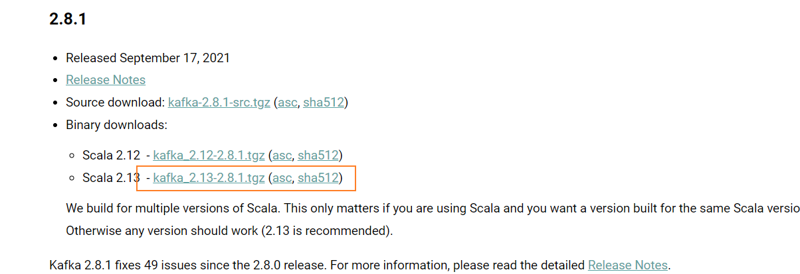

[kafka下载](https://kafka.apache.org/downloads)

## 启动

### 目录结构

下载后解压文件，目录如下

> bin目录是各种启动文件
>
> config是相关参数配置文件
>
> logs是自建的日志文件
>
> libs是使用到的相关jar文件

在bin目录下含有windows文件夹，用于在windows系统中启动

### 配置参数

进入`config`目录，编辑` server.properties`文件，找到并编辑

```properties
log.dirs= D:\\kafka\\logs
## 日志路径更改
zookeeper.connect=localhost:2181  
## 表示本地运行
listeners=PLAINTEXT://localhost:9092
# 配置ip
```

找到`zookeeper.properties`并编辑

```properties
clientPort=2181
```

Kafka会按照默认，在9092端口上运行，并连接zookeeper的默认端口：2181

启动服务，在window目录下进入cmd，输入下面命令进行启动zookeeper服务，对应加载zookeeper的配置文件，kafka依赖zookeeper监控其状态

```sh
zookeeper-server-start.bat D:\kafka\config\zookeeper.properties

# linux系统下启动zookeeper
bin/kafka-server-stop.sh config/server.properties
```

然后启动kafka服务，对应加载相应配置文件

```sh
kafka-server-start.bat D:\kafka\config\server.properties
# linux系统下启动kafka
bin/kafka-server-start.sh config/server.properties
```

### 启动时常见错误

命令太长错误：此时需要将kafka目录提高层级，最好直接放在D盘根目录下

## kafka-monitor项目(kafka监控工具)

### 拉取项目

kafka-monitor 项目用于监控kafka数据，项目地址为https://github.com/linxin26/kafka-monitor

通过git命令拉取项目

```sh
git clone https://github.com/linxin26/kafka-monitor.git
```

### 修改配置

等待项目下载依赖后，修改配置文件

查看zookeeper服务端口，对应修改端口号

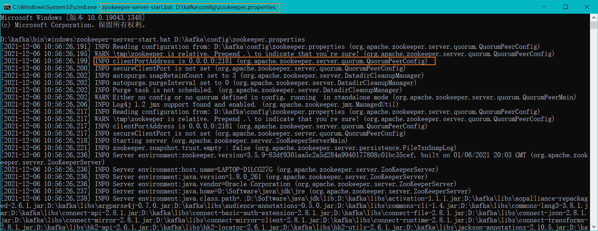

修改配置文件

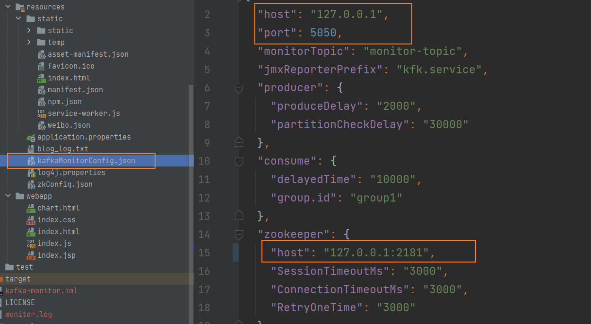

# 二、kafka的基本使用

### 启动服务

```sh
#启动zookeeper
bin\windows\zookeeper-server-start.bat config\zookeeper.properties
#启动kafka
bin\windows\kafka-server-start.bat config\server.properties
```

### 创建

topic可以实现消息的分类，不同消费者订阅不同的topic

执行以下命令可以创建名为`daniel`的topic ,这个topic只有一个`partition`,并且备份因子也设置为1：

```sh
bin\windows\kafka-topics.bat --create --zookeeper localhost:2181 --replication-factor 1 --partitions 1 --topic daniel
# linux下
bin/kafka-topics.sh --create --zookeeper localhost:2181 --replication-factor 1 --partitions 1 --topic daniel
```

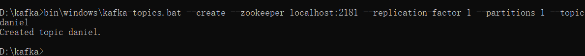

### 查看创建的topic

```sh
bin\windows\kafka-topics.bat --list --zookeeper localhost:2181
# linux下查看
bin/kafka-topics.sh --list --zookeeper localhost:2181
```


### 启动producer

```sh
bin\windows\kafka-console-producer.bat --broker-list localhost:9092 --topic daniel
# linux下
bin/kafka-console-producer.sh --broker-list localhost:9092 --topic daniel
```

### 启动Consumer消费消息

```sh
# --from-beginning 添加该命令则从开始获取消息
bin\windows\kafka-console-consumer.bat --bootstrap-server localhost:9092 --topic daniel --from-beginning
# --from-beginning 不添加该命令则从当前offset（偏移量）+1位置开始获取消息
bin\windows\kafka-console-consumer.bat --bootstrap-server localhost:9092 --topic daniel

#linux下
# --from-beginning 添加该命令则从开始获取消息
bin/kafka-console-consumer.sh --bootstrap-server localhost:9092 --topic daniel --from-beginning
# --from-beginning 不添加该命令则从当前offset（偏移量）+1位置开始获取消息
bin/kafka-console-consumer.sh --bootstrap-server localhost:9092 --topic daniel
```

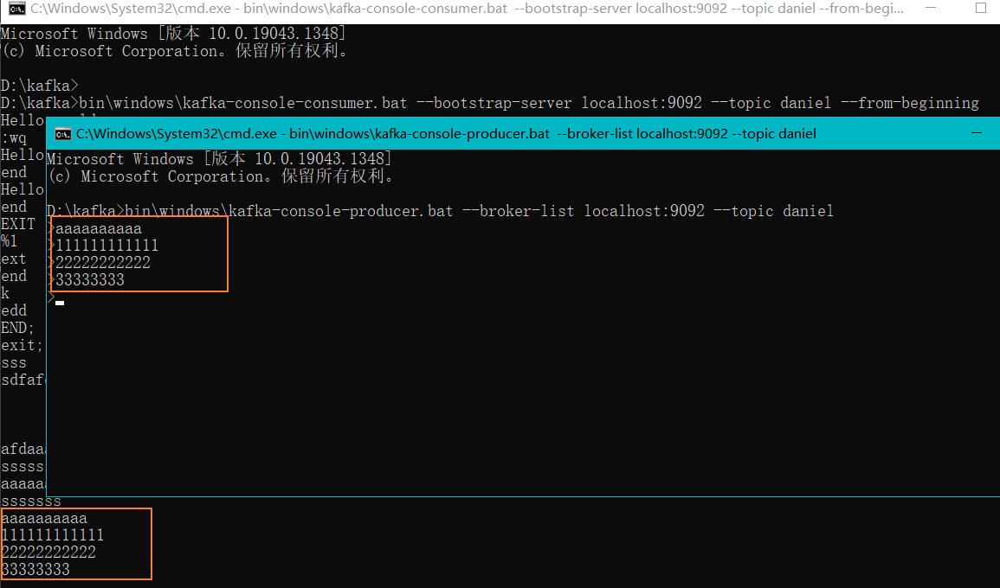

windows中会将消息保存到本地，如图所示：

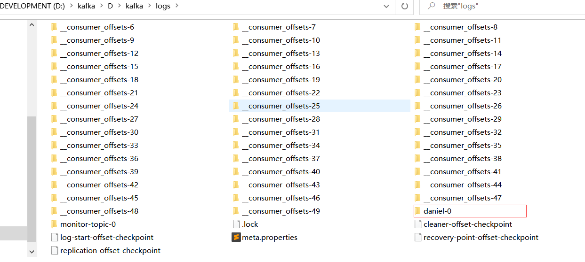

在daniel-0中会保存数据

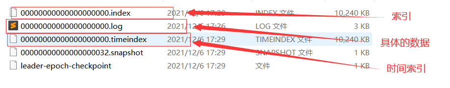

### 多个消费者消费同一个生产者数据

```sh
# （启动cmd）生产者
bin\windows\kafka-console-producer.bat --broker-list localhost:9092 --topic daniel

# （启动两个cmd输入以下命令）消费者
bin\windows\kafka-console-consumer.bat --bootstrap-server localhost:9092 --topic daniel
```


两个都能收到

### 设置组

#### 单播消息

我们可以通过配置组的方式来定义消费者，（在同一组将收不到消息，非同一个组或未分组的消费者则可以收到数据）先设置组的的消费者会受到，后面再设置同一个组则后面的都收不到消息。同一个消费组只有一个消费者可以收到消息。

```sh
bin\windows\kafka-console-consumer.bat --bootstrap-server localhost:9092 --consumer-property group.id=danielGroup --topic daniel
```

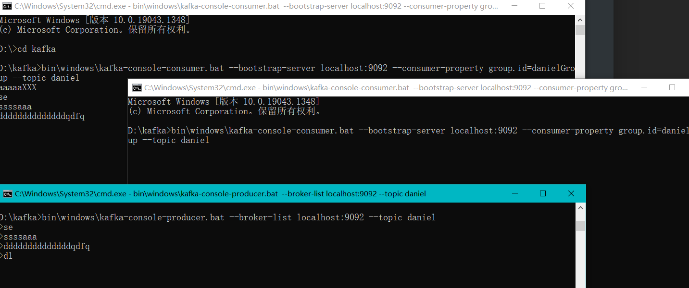

#### 多播消息

不同消费组订阅同一个topic，那么不同的消费组中只有一个消费者能收到消息，也就是多个消费组都能收到消息但每个组织有一个消费者能收到。

```sh
# 生产者
bin\windows\kafka-console-producer.bat --broker-list localhost:9092 --topic daniel

# danielGropu1组（可以收到）
# 消费者
bin\windows\kafka-console-consumer.bat --bootstrap-server localhost:9092 --consumer-property group.id=danielGroup1 --topic daniel

# danielGropu2组（可以收到）
# 消费者
bin\windows\kafka-console-consumer.bat --bootstrap-server localhost:9092 --consumer-property group.id=danielGroup2 --topic daniel

# danielGropu组 (只有一个消费者可以收到)
# 消费者1
bin\windows\kafka-console-consumer.bat --bootstrap-server localhost:9092 --consumer-property group.id=danielGroup --topic daniel
# 消费者2
bin\windows\kafka-console-consumer.bat --bootstrap-server localhost:9092 --consumer-property group.id=danielGroup --topic daniel
```

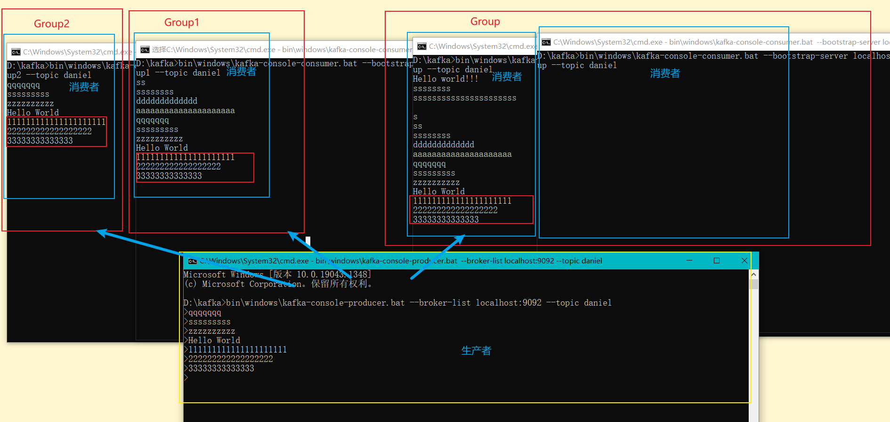

### 查看当前集群中组信息

```sh
bin\windows\kafka-consumer-groups.bat --bootstrap-server localhost:9092 --list
```

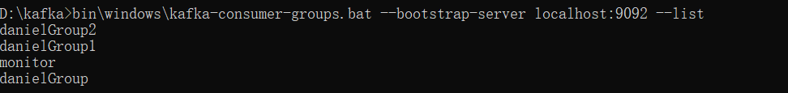

### 查看组的详细信息

```sh
bin\windows\kafka-consumer-groups.bat --bootstrap-server localhost:9092 --describe --group danielGroup
```

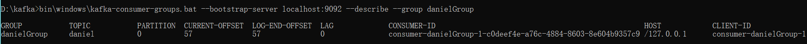

# kafka springboot快速搭建


## 项目初始化

### 新建spring boot项目并导入依赖

```xml
<dependency>
    <groupId>org.springframework.kafka</groupId>
    <artifactId>spring-kafka</artifactId>
</dependency>
```


# Kafka Linux外网映射配置

本地运行时不做更改，注意

但是部署在云端服务器时注意将配置更换

```properties
# 此处使用公网ip
advertised.listeners=PLAINTEXT://114.116.88.252:9092

zookeeper.connect=localhost:2181

```

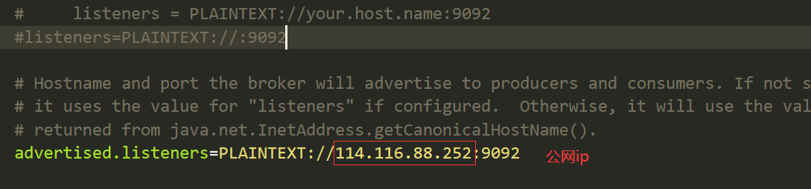


