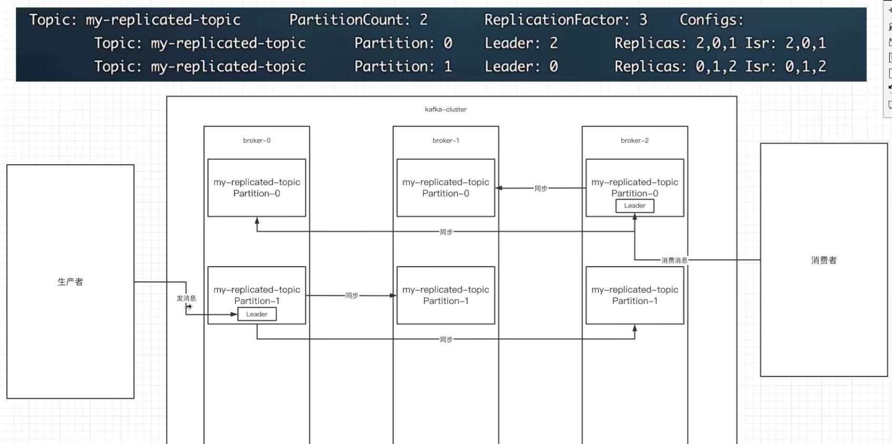

# 一、kafka安装

## 简介

### 什么是kafka

是一款分布式消息发布和订阅系统，它的特点是高性能、高吞吐量

Kafka最初由Linkedin 公司开发，是一个分布式、分区的、多副本的、多订阅者，基于zookeeper 协调的分布式日志系统，也可以作为MQ消息系统。Linkedin 公司在2010 年贡献给了Apache基金会并成为了顶级开源项目

### Kafka的应用场景

场景可以用于 web/nginx 日志、访问日志，消息服务等等。


### Kafka名词解释

#### 1、Broker

Kafka集群中包含的服务器，有一个或多个服务器，这种服务器被称为 Broker。

Broker 端不维护数据的消费状态，提升了性能。直接使用磁盘进行存储，线性读写，速度快。避免了在JVM 内存和系统内存之间的复制，减少耗性能的创建对象和垃圾回收。

#### 2、Producer

负责发布消息到Kafka Broker

#### 3、Consumer

负责从Broker 拉取（pull）数据并进行处理。

#### 4、Topic

每条发布到kafka集群的消息都有一个类别，这个类别被称为Topic

物理上不同Topic的消息分开存储，逻辑上一个Topic 的消息虽然保存于一个或多个Broker上但是用户只需指定消费的Topic即课生产或消费数据而不必关心数据存于何处。

#### 5、Partition

Partition 是物理上的概念，每个Topic 包含一个或多个Partition。kafka分配的单位是Partition

每个Topic 可以划分多个分区（每个Topic至少有一个分区），同一topic 不同分区包含不同分区包含的消息是不同的。每个消息在被添加到分区时，都会被分配一个offset （偏移量），它是消息在此分区中的唯一编号，kafka 通过offset 保证消息在分区内的顺序，offset 的顺序不跨分区，即kafka 只保证同一个分区内的消息是有序的。


#### 6、Consumer Group

每个Consumer 属于一个特定的Consumer Group

可为每个Consumer 指定Group name，若不指定group name 则属于默认的group

每条消息只可以被Consumer Goup 组中中的一个Consumer消费，但是可以指定多个Consumer Group

所以一个消息在Consumer Group 里面只可以被消费一次。已确定！

#### 7、Topic & Partition

Topic 在螺髻山行可以被认为是一个 queue，每发送一条消息必须指定它的Topic，可以简单理解为必须指明把这条消息放入到哪个queue里。

为了使得kafka 的吞吐率可以线性提高，物理上把Topic 分成一个或多个Partition，每个Partition 在物理上对应一个文件夹，该文件夹下存储这个Partition 的所有消息和索引文件。

若创建 Topic1 和Topic2 两个Topic，且分别有13个和19个分区，则整个集群上相应会生成共32个文件夹

#### 8、Replication-factor

表示该Topic 需要再不同高德broker 中保存几分

## 下载

注意3.0.0版本对于windows系统还有部分不兼容问题，windows下推荐安装3.0.0之前的版本


[kafka下载](https://kafka.apache.org/downloads)

## 启动

### 目录结构

下载后解压文件，目录如下

> bin目录是各种启动文件
>
> config是相关参数配置文件
>
> logs是自建的日志文件
>
> libs是使用到的相关jar文件

在bin目录下含有windows文件夹，用于在windows系统中启动

### 配置参数

进入`config`目录，编辑` server.properties`文件，找到并编辑

```properties
log.dirs= D:\\kafka\\logs
## 日志路径更改
zookeeper.connect=localhost:2181  
## 表示本地运行
listeners=PLAINTEXT://localhost:9092
# 配置ip
```

找到`zookeeper.properties`并编辑

```properties
clientPort=2181
```

Kafka会按照默认，在9092端口上运行，并连接zookeeper的默认端口：2181

启动服务，在window目录下进入cmd，输入下面命令进行启动zookeeper服务，对应加载zookeeper的配置文件，kafka依赖zookeeper监控其状态

```sh
zookeeper-server-start.bat D:\kafka\config\zookeeper.properties

# linux系统下启动zookeeper
bin/kafka-server-stop.sh config/server.properties
```

然后启动kafka服务，对应加载相应配置文件

```sh
kafka-server-start.bat D:\kafka\config\server.properties
# linux系统下启动kafka
bin/kafka-server-start.sh config/server.properties
```

### 启动时常见错误

命令太长错误：此时需要将kafka目录提高层级，最好直接放在D盘根目录下

## kafka-monitor项目(kafka监控工具)

### 拉取项目

kafka-monitor 项目用于监控kafka数据，项目地址为https://github.com/linxin26/kafka-monitor

通过git命令拉取项目

```sh
git clone https://github.com/linxin26/kafka-monitor.git
```

### 修改配置

等待项目下载依赖后，修改配置文件

查看zookeeper服务端口，对应修改端口号


修改配置文件


## 搭建自己的zookeeper

### 下载

[Zookeeper下载](https://zookeeper.apache.org/releases.html)

### 配置zookeeper的java环境

进入bin目录中，打开zkEnv.sh文件，添加java运行环境jdk的路径


```

```


# 二、kafka的基本使用

### 启动服务

```sh
#启动zookeeper
bin\windows\zookeeper-server-start.bat config\zookeeper.properties
#启动kafka
bin\windows\kafka-server-start.bat config\server.properties
```

### 创建Topic主题

topic可以实现消息的分类，不同消费者订阅不同的topic

执行以下命令可以创建名为`daniel`的topic ,这个topic只有一个`partition`,并且备份因子也设置为1：

```sh
bin\windows\kafka-topics.bat --create --zookeeper localhost:2181 --replication-factor 1 --partitions 1 --topic daniel
# linux下
bin/kafka-topics.sh --create --zookeeper localhost:2181 --replication-factor 1 --partitions 1 --topic daniel
```


### 查看创建的topic列表

```sh
bin\windows\kafka-topics.bat --list --zookeeper localhost:2181
# linux下查看
bin/kafka-topics.sh --list --zookeeper localhost:2181
```


### 启动producer

```sh
bin\windows\kafka-console-producer.bat --broker-list localhost:9092 --topic daniel
# linux下
bin/kafka-console-producer.sh --broker-list localhost:9092 --topic daniel
```

### 启动Consumer

```sh
# --from-beginning 添加该命令则从开始获取消息
bin\windows\kafka-console-consumer.bat --bootstrap-server localhost:9092 --topic daniel --from-beginning
# --from-beginning 不添加该命令则从当前offset（偏移量）+1位置开始获取消息
bin\windows\kafka-console-consumer.bat --bootstrap-server localhost:9092 --topic daniel

#linux下
# --from-beginning 添加该命令则从开始获取消息
bin/kafka-console-consumer.sh --bootstrap-server localhost:9092 --topic daniel --from-beginning
# --from-beginning 不添加该命令则从当前offset（偏移量）+1位置开始获取消息
bin/kafka-console-consumer.sh --bootstrap-server localhost:9092 --topic daniel
```


windows中会将消息保存到本地，如图所示：


在daniel-0中会保存数据


### 多个消费者消费同一个生产者数据

```sh
# （启动cmd）生产者
bin\windows\kafka-console-producer.bat --broker-list localhost:9092 --topic daniel

# （启动两个cmd输入以下命令）消费者
bin\windows\kafka-console-consumer.bat --bootstrap-server localhost:9092 --topic daniel
```


两个都能收到

### 设置组

#### 单播消息

我们可以通过配置组的方式来定义消费者，（在同一组将收不到消息，非同一个组或未分组的消费者则可以收到数据）先设置组的的消费者会受到，后面再设置同一个组则后面的都收不到消息。同一个消费组只有一个消费者可以收到消息。

```sh
bin\windows\kafka-console-consumer.bat --bootstrap-server localhost:9092 --consumer-property group.id=danielGroup1 --topic daniel

# linux下
bin/kafka-console-consumer.sh --bootstrap-server localhost:9092 --consumer-property group.id=danielGroup1 --topic daniel
```


#### 多播消息

不同消费组订阅同一个topic，那么不同的消费组中只有一个消费者能收到消息，也就是多个消费组都能收到消息但每个组织有一个消费者能收到。

```sh
# 生产者
bin\windows\kafka-console-producer.bat --broker-list localhost:9092 --topic daniel

# danielGropu1组（可以收到）
# 消费者
bin\windows\kafka-console-consumer.bat --bootstrap-server localhost:9092 --consumer-property group.id=danielGroup1 --topic daniel

# danielGropu2组（可以收到）
# 消费者
bin\windows\kafka-console-consumer.bat --bootstrap-server localhost:9092 --consumer-property group.id=danielGroup2 --topic daniel

# danielGropu组 (只有一个消费者可以收到)
# 消费者1
bin\windows\kafka-console-consumer.bat --bootstrap-server localhost:9092 --consumer-property group.id=danielGroup --topic daniel
# 消费者2
bin\windows\kafka-console-consumer.bat --bootstrap-server localhost:9092 --consumer-property group.id=danielGroup --topic daniel
```


### 查看当前集群中组信息

```sh
bin\windows\kafka-consumer-groups.bat --bootstrap-server localhost:9092 --list
# linux下
bin/kafka-consumer-groups.sh --bootstrap-server localhost:9092 --list
```


### 查看组的详细信息

```sh
bin\windows\kafka-consumer-groups.bat --bootstrap-server localhost:9092 --describe --group danielGroup1
# linux下
bin/kafka-consumer-groups.sh --bootstrap-server localhost:9092 --describe --group danielGroup1
```


Current-offset：当前消费者已经消费的偏移量

Log-end-offset：主题对应分区消息结束的偏移量

Lag：当前消费组未消费的消息数

# 三、主题和分区

## 主题Topic

主题topic在kafka中是一个逻辑的概念，kafka通过topic对消息进行分类，不同的topic会被订阅该topic的消费者消费，但是消息会有很多，且消息通过log文件进行保存，因此kafka提出了pratition（分区的概念）分布式存储消息。

例如下面一个主题中含有三个pratition（p0,p1,p2）


## Pratition分区

kafka通过pratition分区，来将一个topic的消息进行分区存储：

​	a.分区存储避免了单个文件过大

​	b.提高了io的读写效率，可同时在多个分区读写

### 为一个topic创建多个分区

```sh
#linux下      --partitions 3 来创建分区
bin/kafka-topics.sh --create --zookeeper localhost:2181 --replication-factor 1 --partitions 3 --topic daniel2
```

### 查看该分区

```sh
#linux下
bin/kafka-topics.sh --describe --zookeeper localhost:2181 --topic daniel2
```


### kafka中的日志文件

kafka会默认创建_consumer_offsets主题，并分配50个分区，用于存储kafka其他消费者消费其他主题时上报的偏移量，至于提交给谁，通过哈希算法来决定


# 四、kafka集群及副本

## 1、集群搭建

准备两台服务器分别启动各自的kafka


## 2、副本



leader：当前主副本为2，代表当发送消息时分区1的broker-2会接收消息，当查询消息时也是broker-2，只是broker-1和broker-0会被同步broker-2的数据。

replicas：当前集群的节点数

isr：表示当前同步数据的节点是否正常，例如：broker-0如果效率及其慢，此时ISR只会显示：2,1


# kafka springboot快速搭建


## 项目初始化

### 新建spring boot项目并导入依赖

```xml
<dependency>
    <groupId>org.springframework.kafka</groupId>
    <artifactId>spring-kafka</artifactId>
</dependency>
```


# Kafka Linux外网映射配置

本地运行时不做更改，注意

但是部署在云端服务器时注意将配置更换

```properties
# 此处使用公网ip
advertised.listeners=PLAINTEXT://114.116.88.252:9092

zookeeper.connect=localhost:2181

```


