# 一、简介

## 1、中间件

我国企业从20世纪80年代开始就逐渐进行信息化建设，由于方法和体系的不成熟，以及企业业务和市场需求的不断变化，一个企业可能同时运行着多个不同的业务系统，这些系统可能基于不同的操作系统、不同的数据库、异构的网络环境。现在的问题是，如何把这些信息系统结合成一个有机地协同工作的整体，真正实现企业跨平台、分布式应用。中间件便是解决之道，它用自己的复杂换取了企业应用的简单。

`中间件（Middleware）是处于操作系统和应用程序之间的软件，也有人认为它应该属于操作系统中的一部分。人们在使用中间件时，往往是一组中间件集成在一起，构成一个平台（包括开发平台和运行平台），但在这组中间件中必须要有一个通信中间件，即中间件=平台+通信，这个定义也限定了只有用于分布式系统中才能称为中间件，同时还可以把它与支撑软件和实用软件区分开来。`

### 举例：

> 1，RMI（Remote Method Invocations, 远程调用）
>
> 2，Load Balancing(负载均衡，将访问负荷分散到各个服务器中)
>
> 3，Transparent Fail-over(透明的故障切换)
>
> 4，Clustering(集群,用多个小的服务器代替大型机）
>
> 5，Back-end-Integration(后端集成，用现有的、新开发的系统如何去集成遗留的系统)
>
> 6，Transaction事务（全局/局部）全局事务（分布式事务）局部事务（在同一数据库联接内的事务）
>
> 7，Dynamic Redeployment(动态重新部署,在不停止原系统的情况下，部署新的系统）
>
> 8，System Management(系统管理)
>
> 9，Threading(多线程处理)
>
> 10，Message-oriented Middleware面向消息的中间件（异步的调用编程）
>
> 11，Component Life Cycle(组件的生命周期管理)
>
> 12，Resource pooling（资源池）
>
> 13，Security（安全）
>
> 14，Caching（缓存）

## 2、为什么需要使用消息中间件

具体地说，中间件屏蔽了底层操作系统的复杂性，使程序开发人员面对一个简单而统一的开发环境，减少程序设计的复杂性，将注意力集中在自己的业务上，不必再为程序在不同系统软件上的移植而重复工作，从而大大减少了技术上的负担。中间件带给应用系统的，不只是开发的简便、开发周期的缩短，也减少了系统的维护、运行和管理的工作量，还减少了计算机总体费用的投入。

## 3、中间件特点

为解决分布异构问题，人们提出了中间件(middleware)的概念。中间件是位于平台(硬件和操作系统)和应用之间的通用服务，如下图所示，这些服务具有标准的程序接口和协议。针对不同的操作系统和硬件平台，它们可以有符合接口和协议规范的多种实现。

也许很难给中间件一个严格的定义，但中间件应具有如下的一些特点：

> （1）满足大量应用的需要
>
> （2）运行于多种硬件和OS平台
>
> （3）支持分布计算，提供跨网络、硬件和OS平台的透明性的应用或服务的交互
>
> （4）支持标准的协议
>
> （5）支持标准的接口

由于标准接口对于可移植性和标准协议对于互操作性的重要性，中间件已成为许多标准化工作的主要部分。对于应用软件开发，中间件远比操作系统和网络服务更为重要，中间件提供的程序接口定义了一个相对稳定的高层应用环境，不管底层的计算机硬件和系统软件怎样更新换代，只要将中间件升级更新，并保持中间件对外的接口定义不变，应用软件几乎不需任何修改，从而保护了企业在应用软件开发和维护中的重大投资。

简单说：中间件有个很大的特点，是脱离于具体设计目标，而具备提供普遍独立功能需求的模块。这使得中间件一定是可替换的。如果一个系统设计中，中间件是不可替换的，不是架构、框架设计有问题，那么就是这个中间件，在 别处可能是个中间件，在这个系统内是引擎。

## 4、常见中间件

> - 消息中间件 ActiveMQ
> - 消息中间件 RabbitMQ
> - 消息中间件 Kafaka
> - 消息中间件 RocketMQ
> - 消息中间件应用场景说明
> - 负载均衡中间件(Nginx/Lvs)
> - 缓存中间件(Memcache/Redis)
> - 数据库中间件(ShardingJdbc/Mycat)

## 5、基于消息中间件的分布式系统的架构

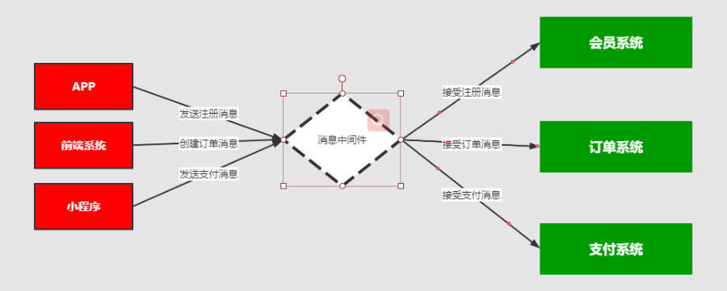

从上图中可以看出来，消息中间件的是

> 1：利用可靠的消息传递机制进行系统和系统直接的通讯
>
> 2：通过提供消息传递和消息的排队机制，它可以在分布式系统环境下扩展进程间的通讯。

## 6、消息中间件应用的场景

> 1:跨系统数据传递
>
> 2:高并发的流量削峰
>
> 3:数据的分发和异步处理
>
> 4:大数据分析与传递
>
> 5:分布式事务

比如你有一个数据要进行迁移或者请求并发过多的时候，比如你有10W的并发请求下订单，我们可以在这些订单入库之前，我们可以把订单请求堆积到消息队列中，让它稳健可靠的入库和执行。

## 7、消息中间件的本质及设计

它是一种接受数据，接受请求、存储数据、发送数据等功能的技术服务。

MQ消息队列：负责数据的传接受，存储和传递，所以性能要过于普通服务和技术。

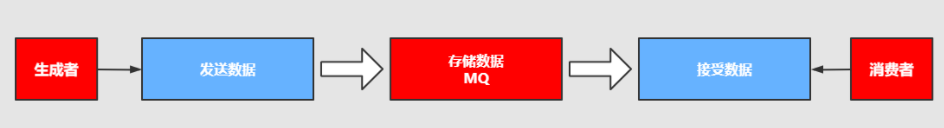

# 二、消息队列协议

## 1、什么是协议

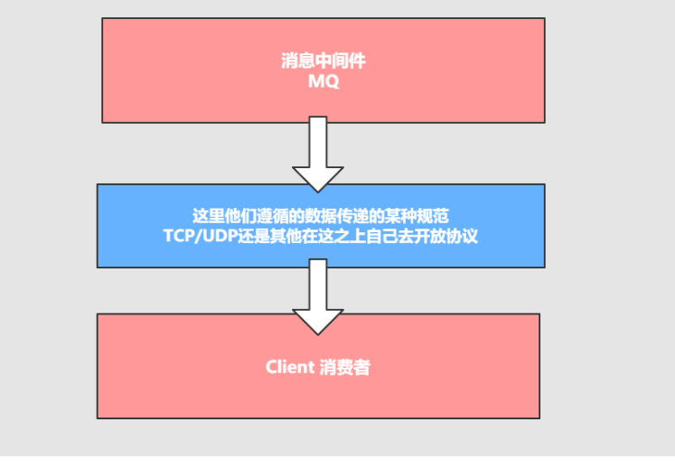

我们知道消息中间件负责数据的传递，存储，和分发消费三个部分，数据的存储和分发的过程中肯定要遵循某种约定成俗的规范，你是采用底层的TCP/IP，UDP协议还是其他的自己取构建等，而这些约定成俗的规范就称之为：协议。

### **面试题：为什么消息中间件不直接使用http协议呢？**

> 1: 因为http请求报文头和响应报文头是比较复杂的，包含了cookie，数据的加密解密，状态码，响应码等附加的功能，但是对于一个消息而言，我们并不需要这么复杂，也没有这个必要性，它其实就是负责数据传递，存储，分发就行，一定要追求的是高性能。尽量简洁，快速。
>
> 2:大部分情况下http大部分都是短链接，在实际的交互过程中，一个请求到响应很有可能会中断，中断以后就不会就行持久化，就会造成请求的丢失。这样就不利于消息中间件的业务场景，因为消息中间件可能是一个长期的获取消息的过程，出现问题和故障要对数据或消息就行持久化等，目的是为了保证消息和数据的高可靠和稳健的运行。

## 2、AMQP协议

AMQP：(全称：`Advanced Message Queuing Protocol`) 是高级消息队列协议。由摩根大通集团联合其他公司共同设计。是一个提供统一消息服务的应用层标准高级消息队列协议，是应用层协议的一个开放标准，为面向消息的中间件设计。基于此协议的客户端与消息中间件可传递消息，并不受客户端/中间件不同产品，不同的开发语言等条件的限制。Erlang中的实现有RabbitMQ等。
特性：

> 1：分布式事务支持。
>
> 2：消息的持久化支持。
>
> 3：高性能和高可靠的消息处理优势。

AMQP协议的支持者：


## 4、MQTT协议

MQTT协议：（Message Queueing Telemetry Transport）消息队列是IBM开放的一个即时通讯协议，物联网系统架构中的重要组成部分。

特点：

> 1：轻量
>
> 2：结构简单
>
> 3：传输快，不支持事务
>
> 4：没有持久化设计。

应用场景：

> 1：适用于计算能力有限
>
> 2：低带宽
>
> 3：网络不稳定的场景。

支持者：


## 5、OpenMessage协议


是近几年由阿里、雅虎和滴滴出行、Stremalio等公司共同参与创立的分布式消息中间件、流处理等领域的应用开发标准。
特点：

> 1：结构简单
>
> 2：解析速度快
>
> 3：支持事务和持久化设计。

## 6、Kafka协议


Kafka协议是基于TCP/IP的二进制协议。消息内部是通过长度来分割，由一些基本数据类型组成。

特点是：

> 1：结构简单
>
> 2：解析速度快
>
> 3：无事务支持
>
> 4：有持久化设计

# 三、消息队列特性

## 1、持久化

简单来说就是将数据存入磁盘，而不是存在内存中随服务器重启断开而消失，使数据能够永久保存。

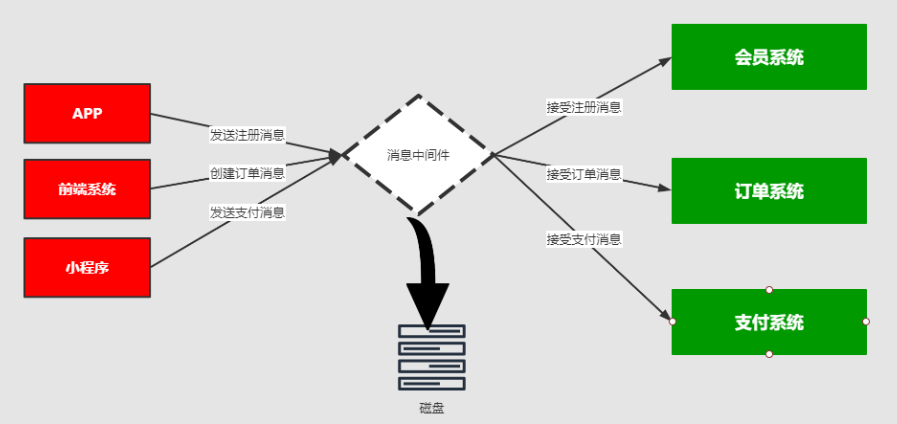

### 常见的持久化方式

| ActiveMQ | RabbitMQ | Kafka | RocketMQ |      |
| -------- | -------- | ----- | -------- | ---- |
| 文件存储 | 支持     | 支持  | 支持     | 支持 |
| 数据库   | 支持     | /     | /        | /    |

## 2、消息的分发策略

MQ消息队列有如下几个角色

> 生产者
>
> 存储消息
>
> 消费者

那么生产者生成消息以后，MQ进行存储，消费者是如何获取消息的呢？一般获取数据的方式无外乎推（push）或者拉（pull）两种方式，典型的git就有推拉机制，我们发送的http请求就是一种典型的拉取数据库数据返回的过程。而消息队列MQ是一种推送的过程，而这些推机制会适用到很多的业务场景也有很多对应推机制策略。

### 场景分析一

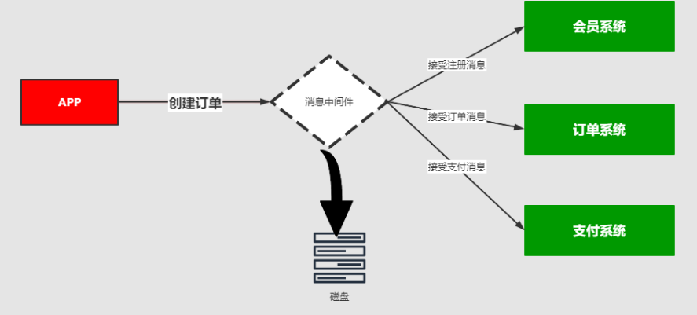

比如我在APP上下了一个订单，我们的系统和服务很多，我们如何得知这个消息被那个系统或者那些服务或者系统进行消费，那这个时候就需要一个分发的策略。这就需要消费策略。或者称之为消费的方法论。

### 场景分析二

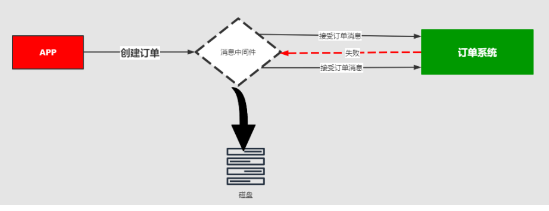

在发送消息的过程中可能会出现异常，或者网络的抖动，故障等等因为造成消息的无法消费，比如用户在下订单，消费MQ接受，订单系统出现故障，导致用户支付失败，那么这个时候就需要消息中间件就必须支持消息重试机制策略。也就是支持：出现问题和故障的情况下，消息不丢失还可以进行重发。

### 消息分发策略的机制和对比

| ActiveMQ | RabbitMQ | Kafka | RocketMQ |      |
| -------- | -------- | ----- | -------- | ---- |
| 发布订阅 | 支持     | 支持  | 支持     | 支持 |
| 轮询分发 | 支持     | 支持  | 支持     | /    |
| 公平分发 | /        | 支持  | 支持     | /    |
| 重发     | 支持     | 支持  | /        | 支持 |
| 消息拉取 | /        | 支持  | 支持     | 支持 |

## 3、高可用和高可靠

### 什么是高可用机制

所谓高可用：是指产品在规定的条件和规定的时刻或时间内处于可执行规定功能状态的能力。

当业务量增加时，请求也过大，一台消息中间件服务器的会触及硬件（CPU,内存，磁盘）的极限，一台消息服务器你已经无法满足业务的需求，所以消息中间件必须支持集群部署。来达到高可用的目的。

### 集群模式1 - Master-slave主从共享数据的部署方式

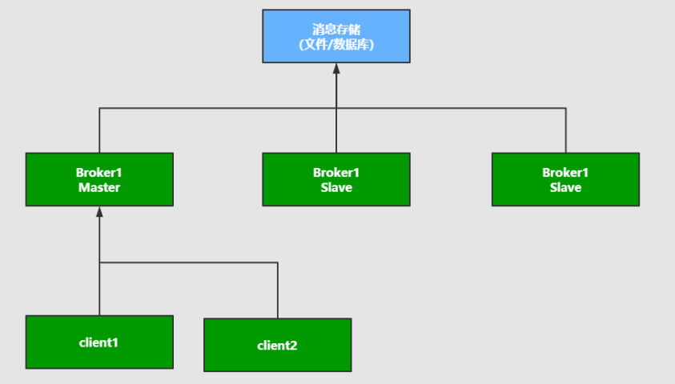

解说：生产者讲消费发送到Master节点，所有的都连接这个消息队列共享这块数据区域，Master节点负责写入，一旦Master挂掉，slave节点继续服务。从而形成高可用，

### 集群模式2 - Master- slave主从同步部署方式

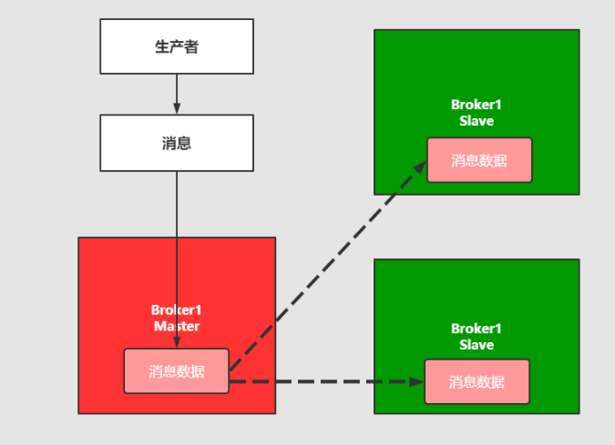

解释：这种模式写入消息同样在Master主节点上，但是主节点会同步数据到slave节点形成副本，和zookeeper或者redis主从机制很类同。这样可以达到负载均衡的效果，如果消费者有多个这样就可以去不同的节点就行消费，以为消息的拷贝和同步会暂用很大的带宽和网络资源。在后续的rabbtmq中会有使用。

### 集群模式3 - 多主集群同步部署模式

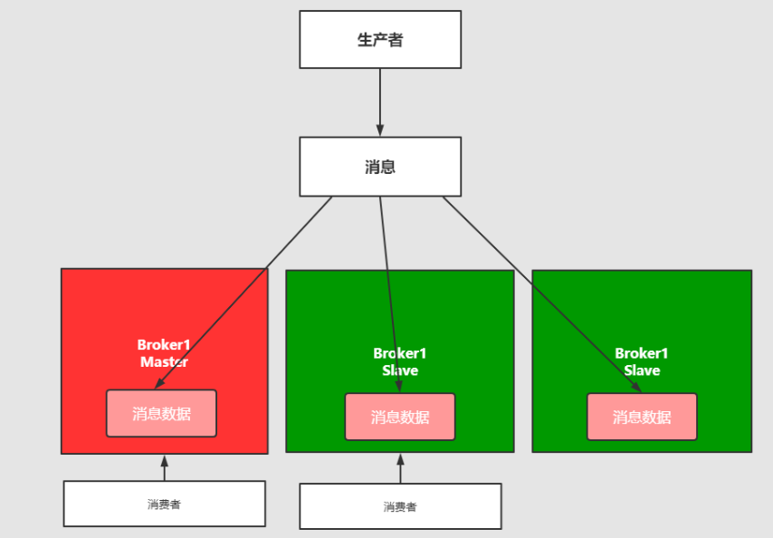

解释：和上面的区别不是特别的大，但是它的写入可以往任意节点去写入。

### 集群模式4 - 多主集群转发部署模式

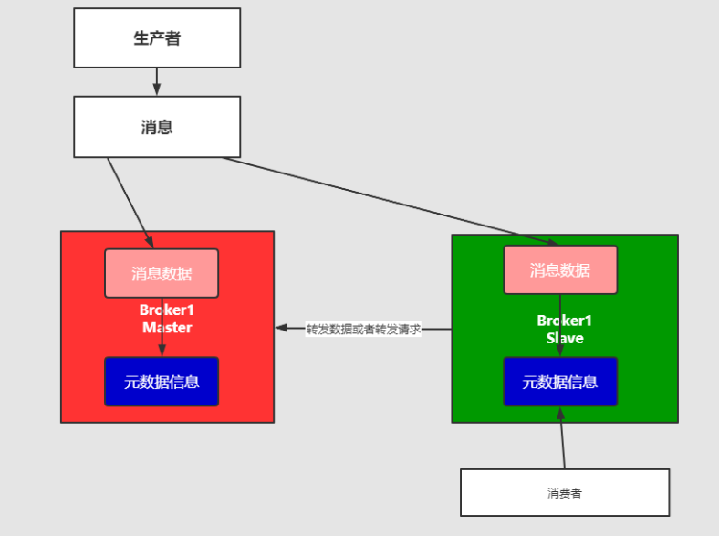

解释：如果你插入的数据是broker-1中，元数据信息会存储数据的相关描述和记录存放的位置（队列）。

它会对描述信息也就是元数据信息就行同步，如果消费者在broker-2中进行消费，发现自己几点没有对应的消息，可以从对应的元数据信息中去查询，然后返回对应的消息信息，场景：比如买火车票或者黄牛买演唱会门票，比如第一个黄牛有顾客说要买的演唱会门票，但是没有但是他会去联系其他的黄牛询问，如果有就返回。

### 集群模式5 Master-slave与Breoker-cluster组合的方案

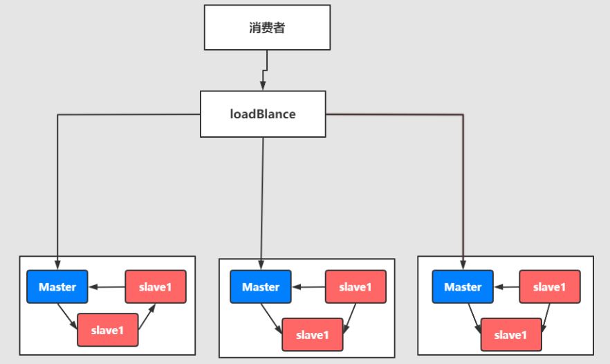

解释：实现多主多从的热备机制来完成消息的高可用以及数据的热备机制，在生产规模达到一定的阶段的时候，这种使用的频率比较高

这么集群模式，具体在后续的课程中会进行一个分析和讲解。他们的最终目的都是为保证：消息服务器不会挂掉，出现了故障依然可以抱着消息服务继续使用。

反正终归三句话：

> 要么消息共享
>
> 要么消息同步
>
> 要么元数据共享

### 什么是高可靠机制

所谓高可用是指：是指系统可以无故障低持续运行，比如一个系统突然崩溃，报错，异常等等并不影响线上业务的正常运行，出错的几率极低，就称之为：高可靠。

在高并发的业务场景中，如果不能保证系统的高可靠，那造成的隐患和损失是非常严重的。

如何保证中间件消息的可靠性呢？可以从两个方面考虑：

> 1：消息的传输：通过协议来保证系统间数据解析的正确性。
>
> 2：消息的存储可靠：通过持久化来保证消息的可靠性。

# 四、RabbitMQ入门及安装

## 1、Windows系统

### 下载

rabbitMQ是Erlang语言开发的所以先下载Erlang

下载Erlang地址：https://www.erlang.org/downloads


下载RabbitMQ地址：https://www.rabbitmq.com/download.html

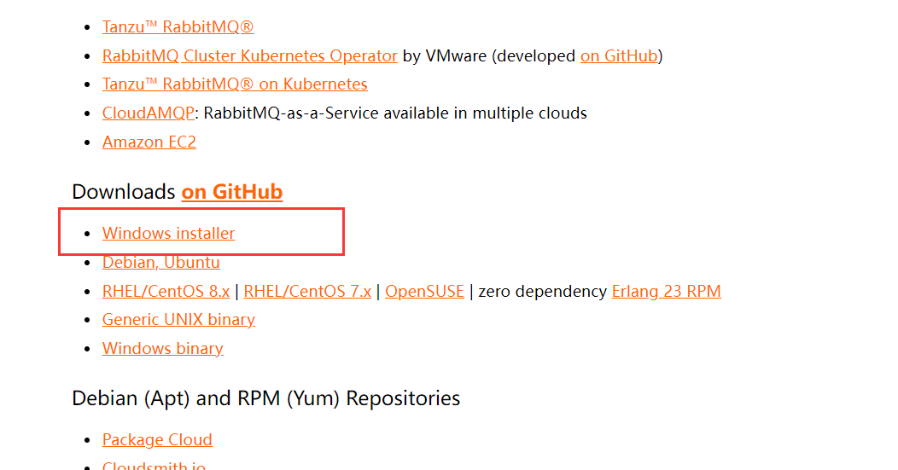

注意版本：

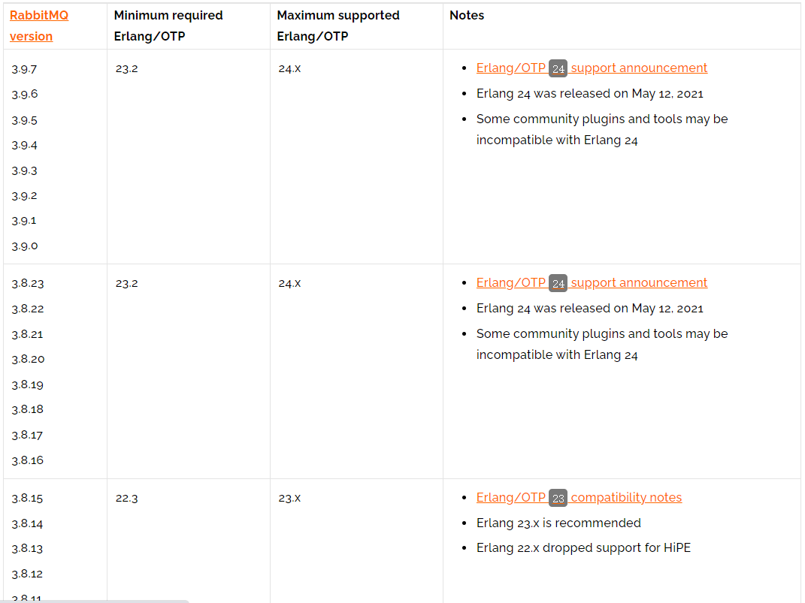

### 配置环境变量

安装erlang后，配置环境变量

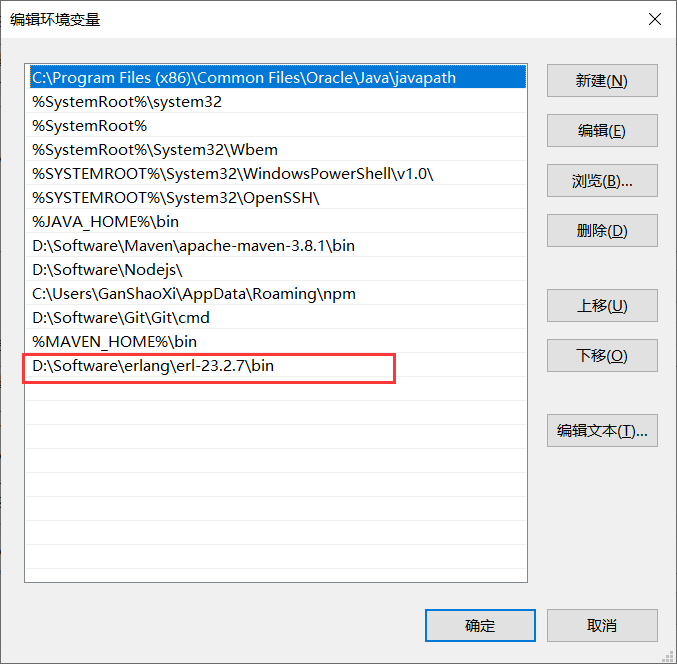

检查是否安装成功：

在命令行输入：erl

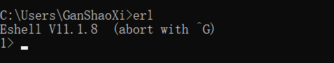

### 安装RabbitMQ


双击安装

安装完成后，开始安装RabbitMQ-Plugins插件

```sh
cd D:\software\RabbitMQ\rabbitmq_server-3.8.8\sbin
```

然后运行命令：

```sh
rabbitmq-plugins enable rabbitmq_management
```

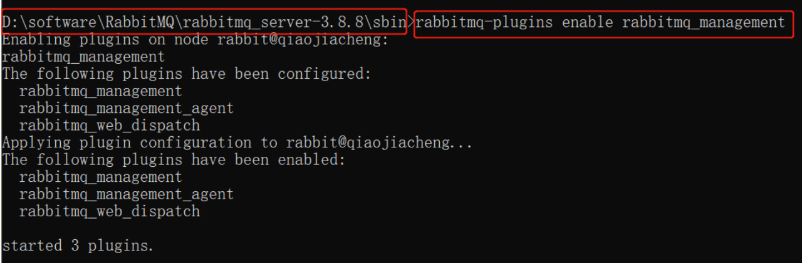

执行

```sh
rabbitmqctl status
```

出现以下内容，说明成功

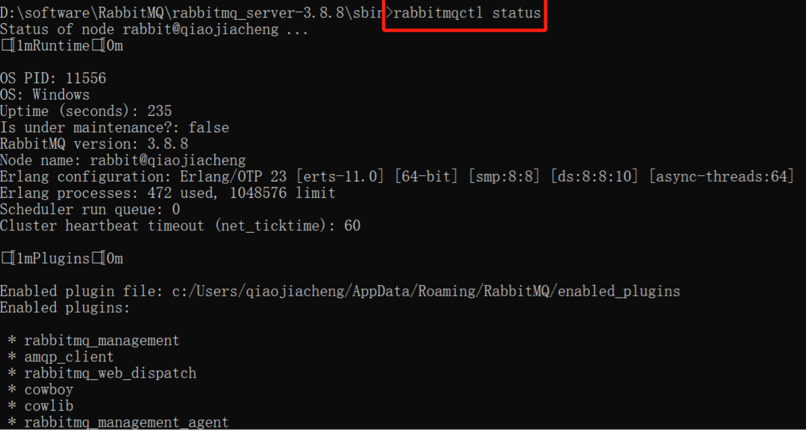

然后双击运行

```
rabbitmq-server.bat
```

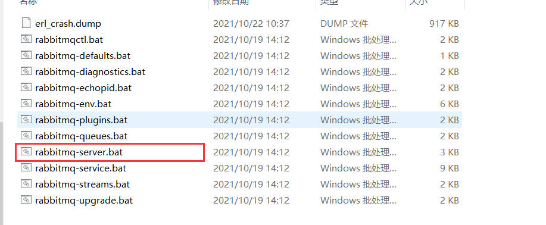

在浏览器访问http://localhost:15672/

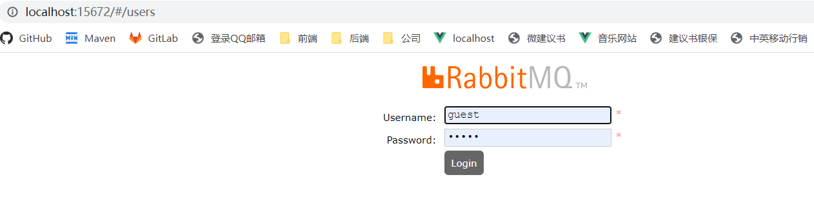

初始账号密码为：`guest/guest`

### 授权账号和密码

新增用户

```
rabbitmqctl add_user admin admin
```

设置用户分配操作权限

```
rabbitmqctl set_user_tags admin administrator
```

用户级别：

> - 1、administrator 可以登录控制台、查看所有信息、可以对rabbitmq进行管理
> - 2、monitoring 监控者 登录控制台，查看所有信息
> - 3、policymaker 策略制定者 登录控制台,指定策略
> - 4、managment 普通管理员 登录控制台

为用户添加资源权限

```
rabbitmqctl.bat set_permissions -p / admin ".*" ".*" ".*"
```

小结：

```sh
rabbitmqctl add_user 账号 密码
rabbitmqctl set_user_tags 账号 administrator
rabbitmqctl change_password Username Newpassword 修改密码
rabbitmqctl delete_user Username 删除用户
rabbitmqctl list_users 查看用户清单
rabbitmqctl set_permissions -p / 用户名 ".*" ".*" ".*" 为用户设置administrator角色
rabbitmqctl set_permissions -p / root ".*" ".*" ".*"
```

## 2、Simple 简单模式-入门

### 实现步骤

> 1：jdk1.8
>
> 2：构建一个maven工程
>
> 3：导入rabbitmq的maven依赖
>
> 4：启动rabbitmq-server服务
>
> 5：定义生产者
>
> 6：定义消费者
>
> 7：观察消息的在rabbitmq-server服务中的过程

### 导入rabbitmq的maven依赖

```xml
<dependency>
    <groupId>com.rabbitmq</groupId>
    <artifactId>amqp-client</artifactId>
    <version>5.10.0</version>
</dependency>
```

### 导入spring依赖

```xml
<dependency>
    <groupId>org.springframework.amqp</groupId>
    <artifactId>spring-amqp</artifactId>
    <version>2.2.5.RELEASE</version>
</dependency>
<dependency>
    <groupId>org.springframework.amqp</groupId>
    <artifactId>spring-rabbit</artifactId>
    <version>2.2.5.RELEASE</version>
</dependency>
```

### 导入springboot依赖

```xml
<dependency>
    <groupId>org.springframework.boot</groupId>
    <artifactId>spring-boot-starter-amqp</artifactId>
</dependency>
```

上面根据自己的项目环境进行选择即可。

番外：rabbitmq和spring同属一个公司开放的产品，所以他们的支持也是非常完善，这也是为什么推荐使用rabbitmq的一个原因。

### 启动rabbitmq-server服务

```sh
systemctl start rabbitmq-server
或者
docker start myrabbit
```

### 定义生产者

```java
package com.daniel.frist;
import com.rabbitmq.client.ConnectionFactory;
import com.rabbitmq.client.Connection;
import com.rabbitmq.client.Channel;

public class MyRabbitMQTest {

    public static void main(String[] args) {
        // 1: 创建连接工厂
        ConnectionFactory connectionFactory = new ConnectionFactory();

        // 2: 设置连接属性
        connectionFactory.setHost("localhost");
        connectionFactory.setPort(5672);
        connectionFactory.setVirtualHost("/");
        connectionFactory.setUsername("admin");
        connectionFactory.setPassword("admin");
        Connection connection = null;
        Channel channel = null;
        try {
            // 3: 从连接工厂中获取连接
            connection = connectionFactory.newConnection("生产者");
            // 4: 从连接中获取通道channel
            channel = connection.createChannel();
            // 5: 申明队列queue存储消息
            /*
             *  如果队列不存在，则会创建
             *  Rabbitmq不允许创建两个相同的队列名称，否则会报错。
             *
             *  @params1： queue 队列的名称
             *  @params2： durable 队列是否持久化
             *  @params3： exclusive 是否排他，即是否私有的，如果为true,会对当前队列加锁，其他的通道不能访问，并且连接自动关闭
             *  @params4： autoDelete 是否自动删除，当最后一个消费者断开连接之后是否自动删除消息。
             *  @params5： arguments 可以设置队列附加参数，设置队列的有效期，消息的最大长度，队列的消息生命周期等等。
             * */
            channel.queueDeclare("queue1", false, false, false, null);
            // 6： 准备发送消息的内容
            String message = "Hello World!!!";
            // 7: 发送消息给中间件rabbitmq-server
            // @params1: 交换机exchange
            // @params2: 队列名称/routing
            // @params3: 属性配置
            // @params4: 发送消息的内容
            channel.basicPublish("", "queue1", null, message.getBytes());
            System.out.println("消息发送成功!");
        } catch (Exception ex) {
            ex.printStackTrace();
            System.out.println("发送消息出现异常...");
        } finally {
            // 7: 释放连接关闭通道
            if (channel != null && channel.isOpen()) {
                try {
                    channel.close();
                } catch (Exception ex) {
                    ex.printStackTrace();
                }
            }
            if (connection != null) {
                try {
                    connection.close();
                } catch (Exception ex) {
                    ex.printStackTrace();
                }
            }
        }
    }
}
```

执行发送，这个时候可以在web控制台查看到这个队列queue的信息

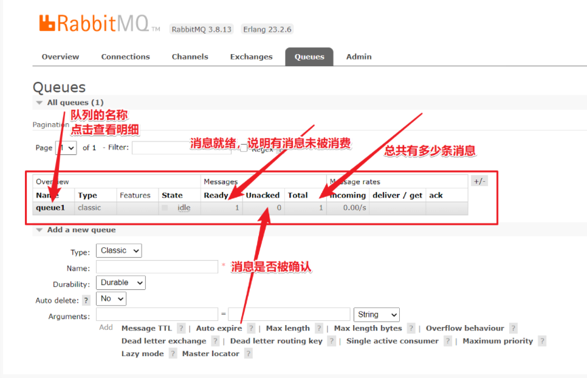

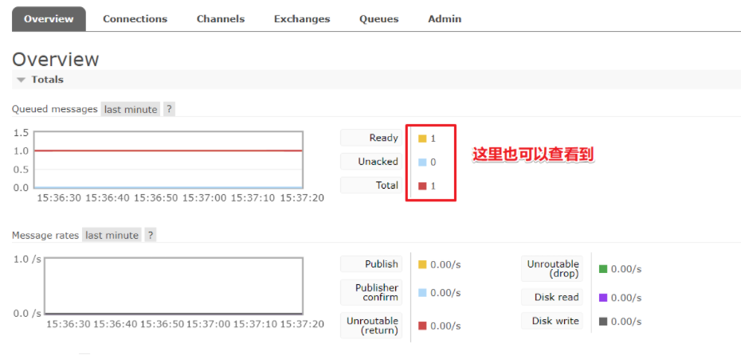

我们可以进行对队列的消息进行预览和测试如下：

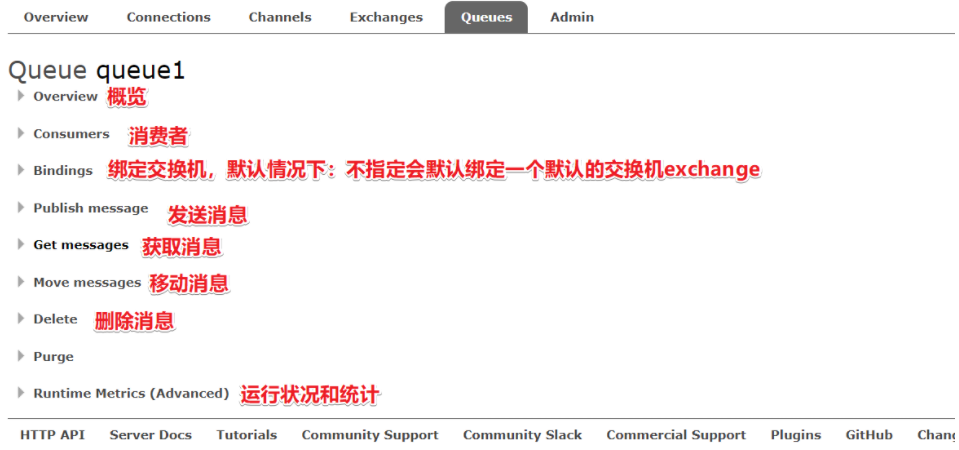

进行预览和获取消息进行测试

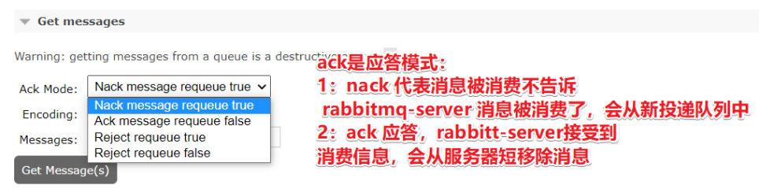

### 定义消费者

```java
package com.daniel.frist;

import com.rabbitmq.client.*;
import java.io.IOException;

public class Consumer {
    public static void main(String[] args) {
        ConnectionFactory connectionFactory = new ConnectionFactory();
        connectionFactory.setHost("127.0.0.1");
        connectionFactory.setPort(5672);
        connectionFactory.setUsername("admin");
        connectionFactory.setPassword("admin");
        connectionFactory.setVirtualHost("/");
        
        Connection connection = null;
        Channel channel = null;
        
        try {
            connection = connectionFactory.newConnection("消费者");
            channel = connection.createChannel();
            
            channel.basicConsume("queue1", true, new DeliverCallback() {
                @Override
                public void handle(String s, Delivery delivery) throws IOException {
                    System.out.println("接收到的消息是：" + new String(delivery.getBody(), "UTF-8"));
                }
            }, new CancelCallback() {
                @Override
                public void handle(String s) throws IOException {
                    System.out.println("接收失败了！！！！！！！！！！！");
                }
            });
            System.out.println("正在接收消息。。。。");
            System.in.read();
        }catch (Exception e) {
            e.printStackTrace();
        }
    }
}

```

测试结果：

当队列中无数据时，启动消费者

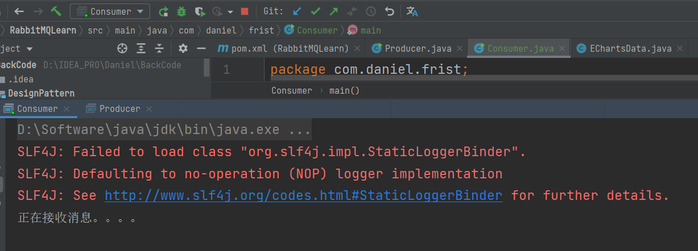

启动生产者，向队列发送数据

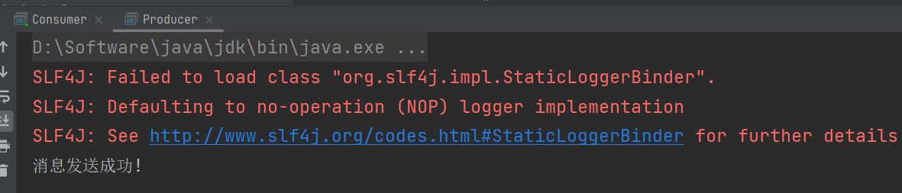

此时看消费者，发现会受到消息

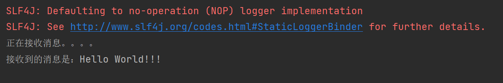

此时查看网站，ready为0，消息被发送后就被消费了，所以没有消息是就绪状态。

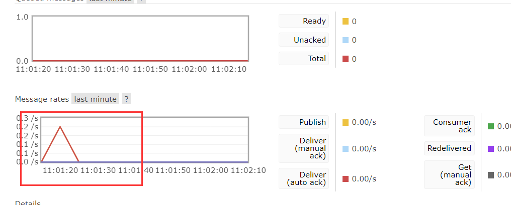

# 五、RabbitMQ模式

## 1、AMQP

### 什么是AMQP

AMQP全称：Advanced Message Queuing Protocol(高级消息队列协议)。是应用层协议的一个开发标准，为面向消息的中间件设计。

### AMQP生产者流转过程

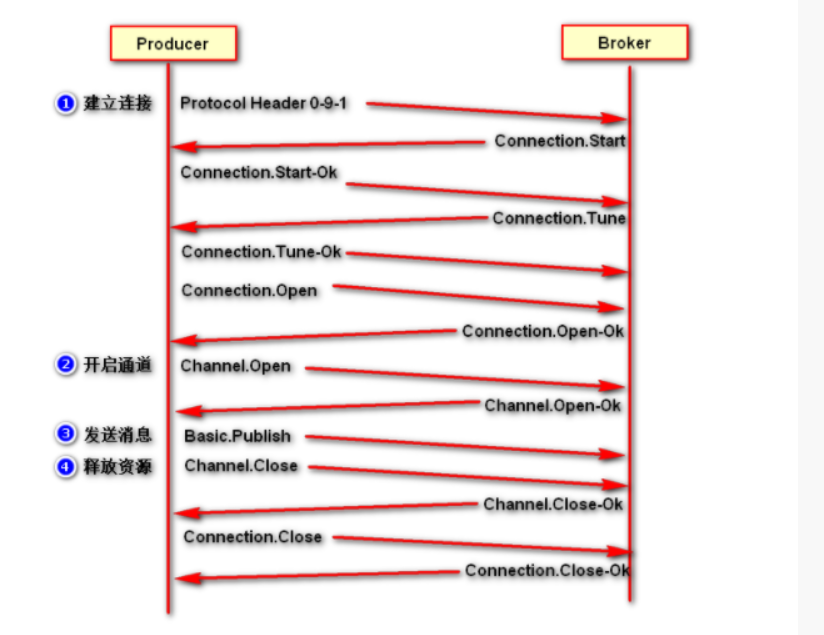

### AMQP消费者流转过程

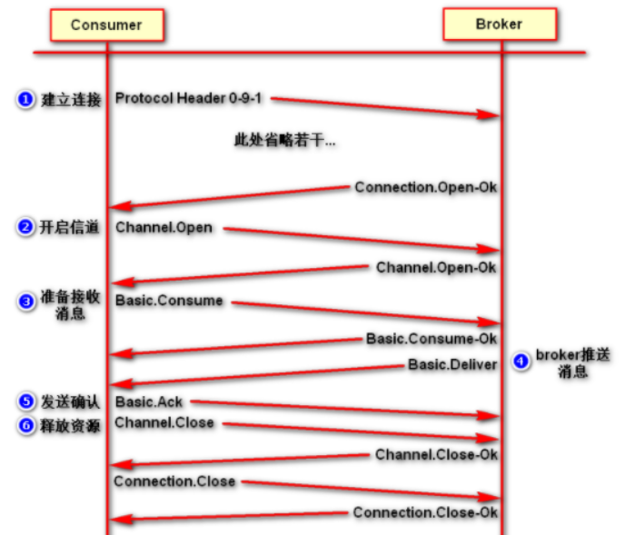

## 2、RabbitMQ的核心组成部分

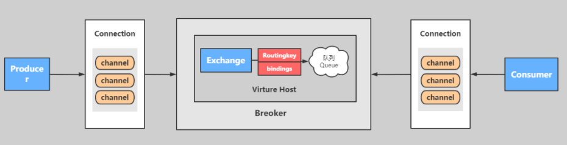

### 名词解释

> **Server**：又称Broker ,接受客户端的连接，实现AMQP实体服务。 安装rabbitmq-server
>
> **Connection**：连接，应用程序与Broker的网络连接 TCP/IP/ 三次握手和四次挥手
>
> **Channel**：网络信道，几乎所有的操作都在Channel中进行，Channel是进行消息读写的通道，客户端可以建立对各Channel，每个Channel代表一个会话任务。
>
> **Message** :消息：服务与应用程序之间传送的数据，由Properties和body组成，Properties可是对消息进行修饰，比如消息的优先级，延迟等高级特性，Body则就是消息体的内容。
>
> **Virtual Host** 虚拟地址，用于进行逻辑隔离，最上层的消息路由，一个虚拟主机理由可以有若干个Exhange和Queueu，同一个虚拟主机里面不能有相同名字的Exchange
>
> **Exchange**：交换机，接受消息，根据路由键发送消息到绑定的队列。(==不具备消息存储的能力==)
>
> **Bindings**：Exchange和Queue之间的虚拟连接，binding中可以保护多个routing key.
>
> **Routing key**：是一个路由规则，虚拟机可以用它来确定如何路由一个特定消息。
>
> **Queue**：队列：也成为Message Queue,消息队列，保存消息并将它们转发给消费者。

### RabbitMQ整体架构

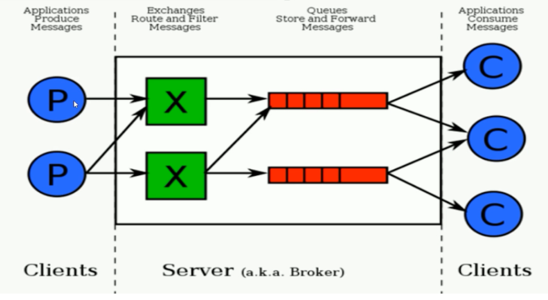

### RabbitMQ的运行流程

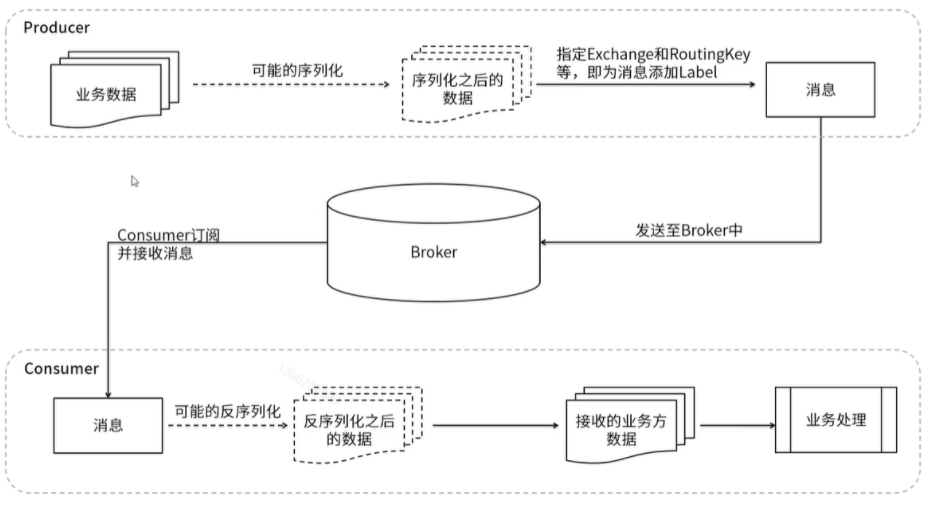

## 3、fanout模式

### fanout模式图解

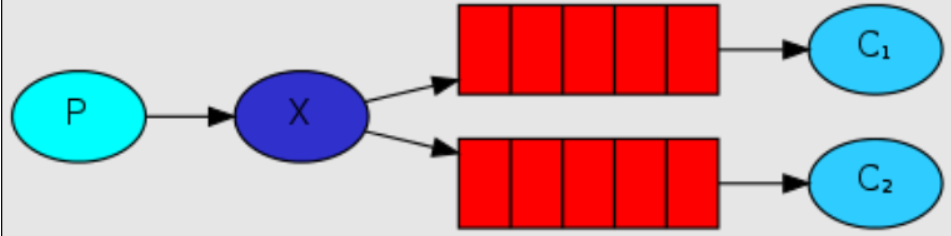

### fanout模式具体实现

生产者

```java
package com.daniel.fanout;

import com.rabbitmq.client.Channel;
import com.rabbitmq.client.Connection;
import com.rabbitmq.client.ConnectionFactory;

/**
 *   类说明：Fanout模式 --生产者
* @author      GanShaoXi
* @date        2021/10/26 14:30
*/
public class Producer {
    public static void main(String[] args) {
        // 创建连接工厂
        ConnectionFactory connectionFactory = new ConnectionFactory();
        // 设置连接信息
        connectionFactory.setHost("localhost");
        connectionFactory.setPort(5672);
        connectionFactory.setUsername("admin");
        connectionFactory.setPassword("admin");
        connectionFactory.setVirtualHost("/");
    
        Connection connection = null;
        Channel channel = null;
        
        try {
            // 获取连接
            connection = connectionFactory.newConnection("生产者");
            // 通过连接获取通道
            channel = connection.createChannel();
            // 准备发送的消息
            
            String message = "fanout模式-学习";
            
            // 定义交换机
            String exchangeName =  "fanout_exchange";
            String exchangeType = "fanout";
            /*
             @params1: 交换机的名称
             @params2: 交换机的类型
             @params3: 是否持久化 true为持久化，false为非持久化重启就会丢失
             */
            channel.exchangeDeclare(exchangeName,exchangeType,true);
            
            // 定义队列
            String queueName1 = "fanout_queue1";
            String queueName2 = "fanout_queue2";
            String queueName3 = "fanout_queue3";
            /*
             @params1: 队列名称
             @params2: 队列是否持久化
             @params3: 是否具有排他性
             @params4: 是否自动删除
             @params5: 是否携带匹配参数
             */
            channel.queueDeclare(queueName1,true,false,false,null);
            channel.queueDeclare(queueName2,true,false,false,null);
            channel.queueDeclare(queueName3,true,false,false,null);
            
            // 绑定交换机和队列
            /*
             @params1: 队列名称
             @params2: 交换机名称
             @params3: routingkey
             */
            channel.queueBind(queueName1,exchangeName,"");
            channel.queueBind(queueName2,exchangeName,"");
            channel.queueBind(queueName3,exchangeName,"");
            // 发送消息给中间件rabbitmq-server
            /*
             @params1: 交换机exchange
             @params2: 队列名称/routingkey
             @params3: 属性配置
             @params4: 发送消息的内容
             */
            channel.basicPublish(exchangeName, "", null, message.getBytes());
    
            System.out.println("消息发送成功!");
            
        }catch (Exception ex) {
            ex.printStackTrace();
            System.out.println("发送消息出现异常...");
        } finally {
            // 释放连接关闭通道
            if (channel != null && channel.isOpen()) {
                try {
                    channel.close();
                } catch (Exception ex) {
                    ex.printStackTrace();
                }
            }
            if (connection != null) {
                try {
                    connection.close();
                } catch (Exception ex) {
                    ex.printStackTrace();
                }
            }
        }
        

    }
}

```

消费者

```java
package com.daniel.fanout;

import com.rabbitmq.client.*;

import java.io.IOException;

public class Consumer {
    
    private static Runnable runnable = () -> {
        // 创建连接工厂
        ConnectionFactory connectionFactory = new ConnectionFactory();
        // 设置连接属性
        connectionFactory.setHost("localhost");
        connectionFactory.setPort(5672);
        connectionFactory.setVirtualHost("/");
        connectionFactory.setUsername("admin");
        connectionFactory.setPassword("admin");
        // 获取队列的名称
        final String queueName = Thread.currentThread().getName();
        Connection connection = null;
        Channel channel = null;
        try {
            // 从连接工厂中获取连接
            connection = connectionFactory.newConnection("消费者");
            // 从连接中获取通道channel
            channel = connection.createChannel();

            // 定义接受消息的回调
            Channel finalChannel = channel;
            finalChannel.basicConsume(queueName, true, new DeliverCallback() {
                @Override
                public void handle(String s, Delivery delivery) throws IOException {
                    System.out.println(queueName + "：收到消息是：" + new String(delivery.getBody(), "UTF-8"));
                }
            }, new CancelCallback() {
                @Override
                public void handle(String s) throws IOException {
                }
            });
            System.out.println(queueName + "：开始接受消息");
            System.in.read();
        } catch (Exception ex) {
            ex.printStackTrace();
            System.out.println("发送消息出现异常...");
        } finally {
            // 7: 释放连接关闭通道
            if (channel != null && channel.isOpen()) {
                try {
                    channel.close();
                } catch (Exception ex) {
                    ex.printStackTrace();
                }
            }
            if (connection != null && connection.isOpen()) {
                try {
                    connection.close();
                } catch (Exception ex) {
                    ex.printStackTrace();
                }
            }
        }
    };
    
    
    public static void main(String[] args) {
        new Thread(runnable,"fanout_queue1").start();
        new Thread(runnable,"fanout_queue2").start();
        new Thread(runnable,"fanout_queue3").start();
    }
}

```

测试结果：

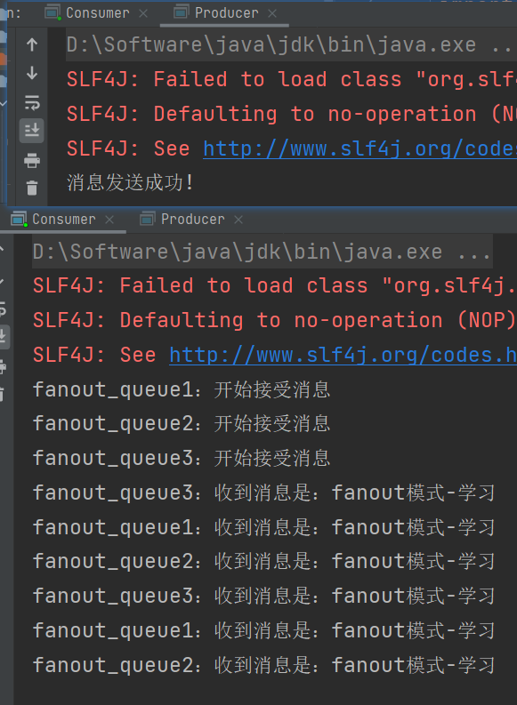

## 4、Direct模式

### Direct模式图解


### Direct模式具体实现

生产者：

```java
package com.daniel.direct;

import com.rabbitmq.client.Channel;
import com.rabbitmq.client.Connection;
import com.rabbitmq.client.ConnectionFactory;

/**
 *   类说明：Direct模式（发布订阅模式）--生产者
* @author      GanShaoXi
* @date        2021/10/26 14:30
*/
public class Producer {
    public static void main(String[] args) {
        // 创建连接工厂
        ConnectionFactory connectionFactory = new ConnectionFactory();
        // 设置连接信息
        connectionFactory.setHost("localhost");
        connectionFactory.setPort(5672);
        connectionFactory.setUsername("admin");
        connectionFactory.setPassword("admin");
        connectionFactory.setVirtualHost("/");
    
        Connection connection = null;
        Channel channel = null;
        
        try {
            // 获取连接
            connection = connectionFactory.newConnection("生产者");
            // 通过连接获取通道
            channel = connection.createChannel();
            // 准备发送的消息
            
            String message = "direct模式-学习";
            
            // 定义交换机
            String exchangeName =  "direct_exchange";
            String exchangeType = "direct";
            /*
             @params1: 交换机的名称
             @params2: 交换机的类型
             @params3: 是否持久化 true为持久化，false为非持久化重启就会丢失
             */
            channel.exchangeDeclare(exchangeName,exchangeType,true);
            
            // 定义队列
            String queueName1 = "direct_queue1";
            String queueName2 = "direct_queue2";
            String queueName3 = "direct_queue3";
            /*
             @params1: 队列名称
             @params2: 队列是否持久化
             @params3: 是否具有排他性
             @params4: 是否自动删除
             @params5: 是否携带匹配参数
             */
            channel.queueDeclare(queueName1,true,false,false,null);
            channel.queueDeclare(queueName2,true,false,false,null);
            channel.queueDeclare(queueName3,true,false,false,null);
            
            // 绑定交换机和队列
            /*
             @params1: 队列名称
             @params2: 交换机名称
             @params3: routingkey
             */
            channel.queueBind(queueName1,exchangeName,"key1");
            channel.queueBind(queueName2,exchangeName,"key2");
            channel.queueBind(queueName3,exchangeName,"key1");
            // 发送消息给中间件rabbitmq-server
            /*
             @params1: 交换机exchange
             @params2: 队列名称/routingkey
             @params3: 属性配置
             @params4: 发送消息的内容
             */
            channel.basicPublish(exchangeName, "key1", null, message.getBytes());
    
            System.out.println("消息发送成功!");
            
        }catch (Exception ex) {
            ex.printStackTrace();
            System.out.println("发送消息出现异常...");
        } finally {
            // 释放连接关闭通道
            if (channel != null && channel.isOpen()) {
                try {
                    channel.close();
                } catch (Exception ex) {
                    ex.printStackTrace();
                }
            }
            if (connection != null) {
                try {
                    connection.close();
                } catch (Exception ex) {
                    ex.printStackTrace();
                }
            }
        }
        

    }
}

```

消费者

```java
package com.daniel.direct;

import com.rabbitmq.client.*;

import java.io.IOException;

public class Consumer {
    
    private static Runnable runnable = () -> {
        // 1: 创建连接工厂
        ConnectionFactory connectionFactory = new ConnectionFactory();
        // 2: 设置连接属性
        connectionFactory.setHost("localhost");
        connectionFactory.setPort(5672);
        connectionFactory.setVirtualHost("/");
        connectionFactory.setUsername("admin");
        connectionFactory.setPassword("admin");
        //获取队列的名称
        final String queueName = Thread.currentThread().getName();
        Connection connection = null;
        Channel channel = null;
        try {
            // 3: 从连接工厂中获取连接
            connection = connectionFactory.newConnection("消费者");
            // 4: 从连接中获取通道channel
            channel = connection.createChannel();
            // 5: 申明队列queue存储消息
            /*
             *  如果队列不存在，则会创建
             *  Rabbitmq不允许创建两个相同的队列名称，否则会报错。
             *
             *  @params1： queue 队列的名称
             *  @params2： durable 队列是否持久化
             *  @params3： exclusive 是否排他，即是否私有的，如果为true,会对当前队列加锁，其他的通道不能访问，并且连接自动关闭
             *  @params4： autoDelete 是否自动删除，当最后一个消费者断开连接之后是否自动删除消息。
             *  @params5： arguments 可以设置队列附加参数，设置队列的有效期，消息的最大长度，队列的消息生命周期等等。
             * */
            // 这里如果queue已经被创建过一次了，可以不需要定义
            //channel.queueDeclare("queue1", false, false, false, null);
            // 6： 定义接受消息的回调
            Channel finalChannel = channel;
            finalChannel.basicConsume(queueName, true, new DeliverCallback() {
                @Override
                public void handle(String s, Delivery delivery) throws IOException {
                    System.out.println(queueName + "：收到消息是：" + new String(delivery.getBody(), "UTF-8"));
                }
            }, new CancelCallback() {
                @Override
                public void handle(String s) throws IOException {
                }
            });
            System.out.println(queueName + "：开始接受消息");
            System.in.read();
        } catch (Exception ex) {
            ex.printStackTrace();
            System.out.println("发送消息出现异常...");
        } finally {
            // 7: 释放连接关闭通道
            if (channel != null && channel.isOpen()) {
                try {
                    channel.close();
                } catch (Exception ex) {
                    ex.printStackTrace();
                }
            }
            if (connection != null && connection.isOpen()) {
                try {
                    connection.close();
                } catch (Exception ex) {
                    ex.printStackTrace();
                }
            }
        }
    };
    
    
    public static void main(String[] args) {
        new Thread(runnable,"direct_queue1").start();
        new Thread(runnable,"direct_queue2").start();
        new Thread(runnable,"direct_queue3").start();
    }
}

```

测试结果：

正如配置只有key1的队列收到了消息

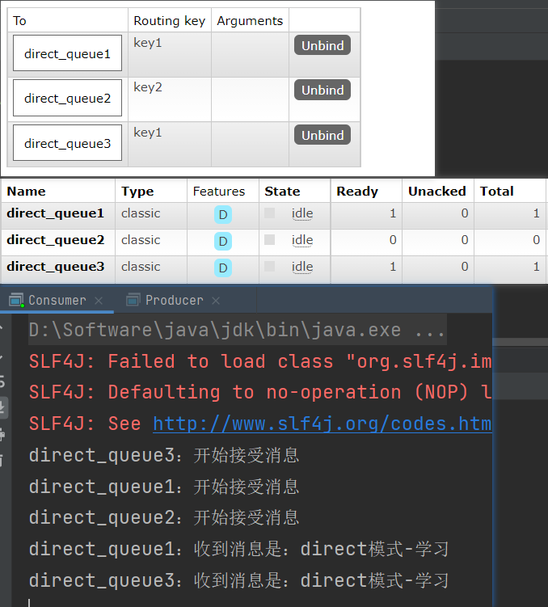

## 5、Topic模式

### Topic模式图解

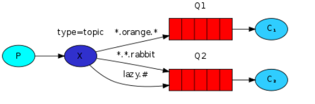

### Topic模式具体实现

前提概要：

规则配置中的符号含义（注意字段之间使用` . `隔开）

> `*` :  表示有且仅有一个字段
>
> `#` :  表示可以有0个，一个，或多个字段

例：

`*.orange.*`    可匹配有：`com.orange.cn`   不可匹配有 ：`top.com.orange.cn` 、`orange.cn` 、`orange`

`#.orange.*`    可匹配有：`com.orange.cn` 、`top.com.orange.cn`、、`orange.cn`    不可匹配有 ：`orange`

生产者

```java
package com.daniel.topic;

import com.rabbitmq.client.Channel;
import com.rabbitmq.client.Connection;
import com.rabbitmq.client.ConnectionFactory;

/**
 *   类说明：Topic模式（发布订阅模式）--生产者
* @author      GanShaoXi
* @date        2021/10/26 14:30
*/
public class Producer {
    public static void main(String[] args) {
        // 创建连接工厂
        ConnectionFactory connectionFactory = new ConnectionFactory();
        // 设置连接信息
        connectionFactory.setHost("localhost");
        connectionFactory.setPort(5672);
        connectionFactory.setUsername("admin");
        connectionFactory.setPassword("admin");
        connectionFactory.setVirtualHost("/");
    
        Connection connection = null;
        Channel channel = null;
        
        try {
            // 获取连接
            connection = connectionFactory.newConnection("生产者");
            // 通过连接获取通道
            channel = connection.createChannel();
            // 准备发送的消息
            
            String message = "topic模式-学习";
            
            // 定义交换机
            String exchangeName =  "topic_exchange";
            String exchangeType = "topic";
            /*
             @params1: 交换机的名称
             @params2: 交换机的类型
             @params3: 是否持久化 true为持久化，false为非持久化重启就会丢失
             */
            channel.exchangeDeclare(exchangeName,exchangeType,true);
            
            // 定义队列
            String queueName1 = "topic_queue1";
            String queueName2 = "topic_queue2";
            String queueName3 = "topic_queue3";
            String queueName4 = "topic_queue4";
            /*
             @params1: 队列名称
             @params2: 队列是否持久化
             @params3: 是否具有排他性
             @params4: 是否自动删除
             @params5: 是否携带匹配参数
             */
            channel.queueDeclare(queueName1,true,false,false,null);
            channel.queueDeclare(queueName2,true,false,false,null);
            channel.queueDeclare(queueName3,true,false,false,null);
            channel.queueDeclare(queueName4,true,false,false,null);
            
            // 绑定交换机和队列
            /*
             @params1: 队列名称
             @params2: 交换机名称
             @params3: routingkey
             */
            channel.queueBind(queueName1,exchangeName,"key.*");
            channel.queueBind(queueName2,exchangeName,"#.key.#");
            channel.queueBind(queueName3,exchangeName,"#.key.user.#");
            channel.queueBind(queueName4,exchangeName,"#.com.#");
            // 发送消息给中间件rabbitmq-server
            /*
             @params1: 交换机exchange
             @params2: 队列名称/routingkey
             @params3: 属性配置
             @params4: 发送消息的内容
             */
            channel.basicPublish(exchangeName, "admin.key.user.com", null, message.getBytes());
    
            System.out.println("消息发送成功!");
            
        }catch (Exception ex) {
            ex.printStackTrace();
            System.out.println("发送消息出现异常...");
        } finally {
            // 释放连接关闭通道
            if (channel != null && channel.isOpen()) {
                try {
                    channel.close();
                } catch (Exception ex) {
                    ex.printStackTrace();
                }
            }
            if (connection != null) {
                try {
                    connection.close();
                } catch (Exception ex) {
                    ex.printStackTrace();
                }
            }
        }
        

    }
}

```

消费者

```java
package com.daniel.topic;

import com.rabbitmq.client.*;

import java.io.IOException;

public class Consumer {
    
    private static Runnable runnable = () -> {
        // 1: 创建连接工厂
        ConnectionFactory connectionFactory = new ConnectionFactory();
        // 2: 设置连接属性
        connectionFactory.setHost("localhost");
        connectionFactory.setPort(5672);
        connectionFactory.setVirtualHost("/");
        connectionFactory.setUsername("admin");
        connectionFactory.setPassword("admin");
        //获取队列的名称
        final String queueName = Thread.currentThread().getName();
        Connection connection = null;
        Channel channel = null;
        try {
            // 3: 从连接工厂中获取连接
            connection = connectionFactory.newConnection("消费者");
            // 4: 从连接中获取通道channel
            channel = connection.createChannel();
            // 5: 申明队列queue存储消息
            /*
             *  如果队列不存在，则会创建
             *  Rabbitmq不允许创建两个相同的队列名称，否则会报错。
             *
             *  @params1： queue 队列的名称
             *  @params2： durable 队列是否持久化
             *  @params3： exclusive 是否排他，即是否私有的，如果为true,会对当前队列加锁，其他的通道不能访问，并且连接自动关闭
             *  @params4： autoDelete 是否自动删除，当最后一个消费者断开连接之后是否自动删除消息。
             *  @params5： arguments 可以设置队列附加参数，设置队列的有效期，消息的最大长度，队列的消息生命周期等等。
             * */
            // 这里如果queue已经被创建过一次了，可以不需要定义
            //channel.queueDeclare("queue1", false, false, false, null);
            // 6： 定义接受消息的回调
            Channel finalChannel = channel;
            finalChannel.basicConsume(queueName, true, new DeliverCallback() {
                @Override
                public void handle(String s, Delivery delivery) throws IOException {
                    System.out.println(queueName + "：收到消息是：" + new String(delivery.getBody(), "UTF-8"));
                }
            }, new CancelCallback() {
                @Override
                public void handle(String s) throws IOException {
                }
            });
            System.out.println(queueName + "：开始接受消息");
            System.in.read();
        } catch (Exception ex) {
            ex.printStackTrace();
            System.out.println("发送消息出现异常...");
        } finally {
            // 7: 释放连接关闭通道
            if (channel != null && channel.isOpen()) {
                try {
                    channel.close();
                } catch (Exception ex) {
                    ex.printStackTrace();
                }
            }
            if (connection != null && connection.isOpen()) {
                try {
                    connection.close();
                } catch (Exception ex) {
                    ex.printStackTrace();
                }
            }
        }
    };
    
    
    public static void main(String[] args) {
        new Thread(runnable,"topic_queue1").start();
        new Thread(runnable,"topic_queue2").start();
        new Thread(runnable,"topic_queue3").start();
        new Thread(runnable,"topic_queue4").start();
    }
}

```

测试结果：

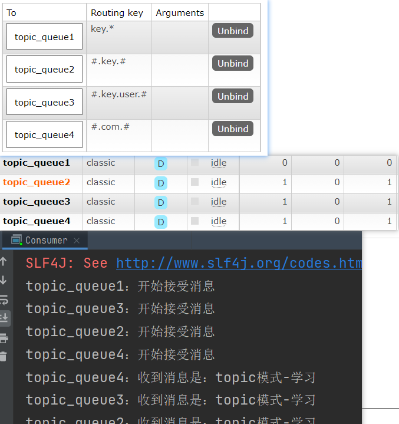

## 6、work模式-轮询模式

==注意==：如果未使用手动应答机制，则默认使用轮询算法分发数据

### work模式中的轮询模式图解

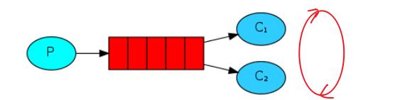

从消息队列中依次循环分发，列如：第一条分发给C1，第二条分发给C2，第三条分发给C1，第四条分发给C2，第五条·····

### work模式中的轮询模式具体实现

生产者

```java
package com.daniel.work.lunxun;

import com.rabbitmq.client.Channel;
import com.rabbitmq.client.Connection;
import com.rabbitmq.client.ConnectionFactory;

/**
 *   类说明：Work模式下的轮询分发（平均分配）--生产者
* @author      GanShaoXi
* @date        2021/10/26 14:30
*/
public class Producer {
    public static void main(String[] args) {
        // 创建连接工厂
        ConnectionFactory connectionFactory = new ConnectionFactory();
        // 设置连接信息
        connectionFactory.setHost("localhost");
        connectionFactory.setPort(5672);
        connectionFactory.setUsername("admin");
        connectionFactory.setPassword("admin");
        connectionFactory.setVirtualHost("/");
    
        Connection connection = null;
        Channel channel = null;
        
        try {
            // 获取连接
            connection = connectionFactory.newConnection("生产者");
            // 通过连接获取通道
            channel = connection.createChannel();
            
            
            // 定义队列
            String queueName = "lunxun_work_queue";
            
            /*
             @params1: 队列名称
             @params2: 队列是否持久化
             @params3: 是否具有排他性
             @params4: 是否自动删除
             @params5: 是否携带匹配参数
             */
            channel.queueDeclare(queueName,true,false,false,null);
            
           
            // 发送消息给中间件rabbitmq-server
            /*
             @params1: 交换机exchange
             @params2: 队列名称/routingkey
             @params3: 属性配置
             @params4: 发送消息的内容
             */
            for( int i = 0 ;i <20 ; i++ ){
                String message = "轮询工作模式——"+i;
                channel.basicPublish("", queueName, null, message.getBytes());
            }
            System.out.println("消息发送成功!");
            
        }catch (Exception ex) {
            ex.printStackTrace();
            System.out.println("发送消息出现异常...");
        } finally {
            // 释放连接关闭通道
            if (channel != null && channel.isOpen()) {
                try {
                    channel.close();
                } catch (Exception ex) {
                    ex.printStackTrace();
                }
            }
            if (connection != null) {
                try {
                    connection.close();
                } catch (Exception ex) {
                    ex.printStackTrace();
                }
            }
        }
    }
}

```

消费者1：

```java
package com.daniel.work.lunxun;

import com.rabbitmq.client.*;

import java.io.IOException;

public class Consumer1 {
    public static void main(String[] args) {
        // 创建连接工厂
        ConnectionFactory connectionFactory = new ConnectionFactory();
        // 设置连接属性
        connectionFactory.setHost("localhost");
        connectionFactory.setPort(5672);
        connectionFactory.setVirtualHost("/");
        connectionFactory.setUsername("admin");
        connectionFactory.setPassword("admin");
        Connection connection = null;
        Channel channel = null;
        try {
            // 从连接工厂中获取连接
            connection = connectionFactory.newConnection("消费者-Consumer1");
            // 从连接中获取通道channel
            channel = connection.createChannel();

            // 定义接受消息的回调
            Channel finalChannel = channel;
            finalChannel.basicQos(1);
            finalChannel.basicConsume("lunxun_work_queue", true, new DeliverCallback() {
                @Override
                public void handle(String s, Delivery delivery) throws IOException {
                    try{
                        System.out.println("Consumer1-收到消息是：" + new String(delivery.getBody(), "UTF-8"));
                        Thread.sleep(2000);
                    }catch(Exception ex){
                        ex.printStackTrace();
                    }
                }
            }, new CancelCallback() {
                @Override
                public void handle(String s) throws IOException {
                }
            });
            System.out.println("Consumer1-开始接受消息");
            System.in.read();
        } catch (Exception ex) {
            ex.printStackTrace();
            System.out.println("发送消息出现异常...");
        } finally {
            // 7: 释放连接关闭通道
            if (channel != null && channel.isOpen()) {
                try {
                    channel.close();
                } catch (Exception ex) {
                    ex.printStackTrace();
                }
            }
            if (connection != null && connection.isOpen()) {
                try {
                    connection.close();
                } catch (Exception ex) {
                    ex.printStackTrace();
                }
            }
        }
    }
}

```

消费者2：

```java
package com.daniel.work.lunxun;

import com.rabbitmq.client.*;

import java.io.IOException;

public class Consumer2 {
    public static void main(String[] args) {
        // 创建连接工厂
        ConnectionFactory connectionFactory = new ConnectionFactory();
        // 设置连接属性
        connectionFactory.setHost("localhost");
        connectionFactory.setPort(5672);
        connectionFactory.setVirtualHost("/");
        connectionFactory.setUsername("admin");
        connectionFactory.setPassword("admin");
        Connection connection = null;
        Channel channel = null;
        try {
            // 从连接工厂中获取连接
            connection = connectionFactory.newConnection("消费者-Consumer2");
            // 从连接中获取通道channel
            channel = connection.createChannel();

            // 定义接受消息的回调
            Channel finalChannel = channel;
            finalChannel.basicQos(1);
            finalChannel.basicConsume("lunxun_work_queue", true, new DeliverCallback() {
                @Override
                public void handle(String s, Delivery delivery) throws IOException {
                    try{
                        System.out.println("Consumer2-收到消息是：" + new String(delivery.getBody(), "UTF-8"));
                        Thread.sleep(2000);
                    }catch(Exception ex){
                        ex.printStackTrace();
                    }
                }
            }, new CancelCallback() {
                @Override
                public void handle(String s) throws IOException {
                }
            });
            System.out.println("Consumer2-开始接受消息");
            System.in.read();
        } catch (Exception ex) {
            ex.printStackTrace();
            System.out.println("发送消息出现异常...");
        } finally {
            // 7: 释放连接关闭通道
            if (channel != null && channel.isOpen()) {
                try {
                    channel.close();
                } catch (Exception ex) {
                    ex.printStackTrace();
                }
            }
            if (connection != null && connection.isOpen()) {
                try {
                    connection.close();
                } catch (Exception ex) {
                    ex.printStackTrace();
                }
            }
        }
    }
}

```

测试结果：

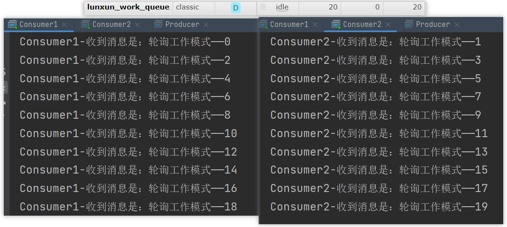

## 7、work模式-公平模式

### work模式下公平模式图解

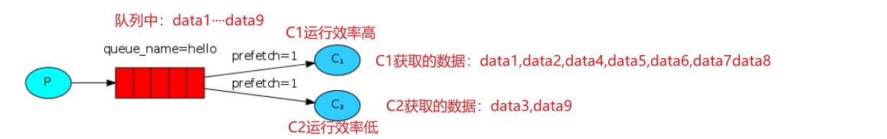

### work模式下公平模式具体实现

前期概要：

```java
finalChannel.basicQos(1);
```

该语句用于设置每次分发的数据量，例如：数据量为1w条，此时如果设置为10条，则每次给消费者分发10条

```java
finalChannel.basicConsume("fair_work_queue", false, new DeliverCallback() {// 略····}
```

若使用公平分发需要将`basicConsume`方法的参数二设置为：`false `（手动应答）

```java
//更改为手动应答需要手动设置
finalChannel.basicAck(delivery.getEnvelope().getDeliveryTag(),false);
```

#### 什么是消息应答模式

为了确保消息不会丢失，RabbitMQ支持消息应答。消费者发送一个消息应答，告诉RabbitMQ这个消息已经接收并且处理完毕了。RabbitMQ就可以删除它了。

如果一个消费者挂掉却没有发送应答，RabbitMQ会理解为这个消息没有处理完全，然后交给另一个消费者去重新处理。这样，你就可以确认即使消费者偶尔挂掉也不会丢失任何消息了。

没有任何消息超时限制；只有当消费者挂掉时，RabbitMQ才会重新投递。即使处理一条消息会花费很长的时间。

消息应答是默认打开的。我们通过显示的设置`autoAsk=false`关闭这种机制。一旦我们完成任务，消费者会自动发送应答。通知RabbitMQ消息已被处理，可以从内存删除。如果消费者因宕机或链接失败等原因没有发送ACK（不同于ActiveMQ，在RabbitMQ里，消息没有过期的概念），则RabbitMQ会将消息重新发送给其他监听在队列的下一个消费者。

生产者

```java
package com.daniel.work.fair;

import com.rabbitmq.client.Channel;
import com.rabbitmq.client.Connection;
import com.rabbitmq.client.ConnectionFactory;

/**
 *   类说明：Work模式下的公平分发（能者多劳）--生产者
* @author      GanShaoXi
* @date        2021/10/26 14:30
*/
public class Producer {
    public static void main(String[] args) {
        // 创建连接工厂
        ConnectionFactory connectionFactory = new ConnectionFactory();
        // 设置连接信息
        connectionFactory.setHost("localhost");
        connectionFactory.setPort(5672);
        connectionFactory.setUsername("admin");
        connectionFactory.setPassword("admin");
        connectionFactory.setVirtualHost("/");
    
        Connection connection = null;
        Channel channel = null;
        
        try {
            // 获取连接
            connection = connectionFactory.newConnection("生产者");
            // 通过连接获取通道
            channel = connection.createChannel();
            
            
            // 定义队列
            String queueName = "fair_work_queue";
            
            /*
             @params1: 队列名称
             @params2: 队列是否持久化
             @params3: 是否具有排他性
             @params4: 是否自动删除
             @params5: 是否携带匹配参数
             */
            channel.queueDeclare(queueName,true,false,false,null);
            
           
            // 发送消息给中间件rabbitmq-server
            /*
             @params1: 交换机exchange
             @params2: 队列名称/routingkey
             @params3: 属性配置
             @params4: 发送消息的内容
             */
            for( int i = 0 ;i <20 ; i++ ){
                String message = "能者多劳（公平）工作模式——"+i;
                channel.basicPublish("", queueName, null, message.getBytes());
            }
            System.out.println("消息发送成功!");
            
        }catch (Exception ex) {
            ex.printStackTrace();
            System.out.println("发送消息出现异常...");
        } finally {
            // 释放连接关闭通道
            if (channel != null && channel.isOpen()) {
                try {
                    channel.close();
                } catch (Exception ex) {
                    ex.printStackTrace();
                }
            }
            if (connection != null) {
                try {
                    connection.close();
                } catch (Exception ex) {
                    ex.printStackTrace();
                }
            }
        }
    }
}

```

消费者1：

```java
package com.daniel.work.fair;

import com.rabbitmq.client.*;

import java.io.IOException;

public class Consumer1 {
    public static void main(String[] args) {
        // 创建连接工厂
        ConnectionFactory connectionFactory = new ConnectionFactory();
        // 设置连接属性
        connectionFactory.setHost("localhost");
        connectionFactory.setPort(5672);
        connectionFactory.setVirtualHost("/");
        connectionFactory.setUsername("admin");
        connectionFactory.setPassword("admin");
        Connection connection = null;
        Channel channel = null;
        try {
            // 从连接工厂中获取连接
            connection = connectionFactory.newConnection("消费者-Consumer1");
            // 从连接中获取通道channel
            channel = connection.createChannel();

            // 定义接受消息的回调
            Channel finalChannel = channel;
            finalChannel.basicQos(1);// 类似cpu轮片时间，值越大，一次分发越多
            /*
              @params2:公平分发需将参数二改为false，通过手动应答接收
             */
            finalChannel.basicConsume("fair_work_queue", false, new DeliverCallback() {
                @Override
                public void handle(String s, Delivery delivery) throws IOException {
                    try{
                        System.out.println("Consumer1-收到消息是：" + new String(delivery.getBody(), "UTF-8"));
                        //更改为手动应答
                        finalChannel.basicAck(delivery.getEnvelope().getDeliveryTag(),false);
                        Thread.sleep(2000);
                    }catch(Exception ex){
                        ex.printStackTrace();
                    }
                }
            }, new CancelCallback() {
                @Override
                public void handle(String s) throws IOException {
                }
            });
            System.out.println("Consumer1-开始接受消息");
            System.in.read();
        } catch (Exception ex) {
            ex.printStackTrace();
            System.out.println("发送消息出现异常...");
        } finally {
            // 7: 释放连接关闭通道
            if (channel != null && channel.isOpen()) {
                try {
                    channel.close();
                } catch (Exception ex) {
                    ex.printStackTrace();
                }
            }
            if (connection != null && connection.isOpen()) {
                try {
                    connection.close();
                } catch (Exception ex) {
                    ex.printStackTrace();
                }
            }
        }
    }
}

```

消费者2：

```java
package com.daniel.work.fair;

import com.rabbitmq.client.*;

import java.io.IOException;

public class Consumer2 {
    public static void main(String[] args) {
        // 创建连接工厂
        ConnectionFactory connectionFactory = new ConnectionFactory();
        // 设置连接属性
        connectionFactory.setHost("localhost");
        connectionFactory.setPort(5672);
        connectionFactory.setVirtualHost("/");
        connectionFactory.setUsername("admin");
        connectionFactory.setPassword("admin");
        Connection connection = null;
        Channel channel = null;
        try {
            // 从连接工厂中获取连接
            connection = connectionFactory.newConnection("消费者-Consumer2");
            // 从连接中获取通道channel
            channel = connection.createChannel();

            // 定义接受消息的回调
            Channel finalChannel = channel;
            finalChannel.basicQos(1);// 类似cpu轮片时间，值越大，一次分发越多
            /*
              @params2:公平分发需将参数二改为：false，通过手动应答接收
             */
            finalChannel.basicConsume("fair_work_queue", false, new DeliverCallback() {
                @Override
                public void handle(String s, Delivery delivery) throws IOException {
                    try{
                        System.out.println("Consumer2-收到消息是：" + new String(delivery.getBody(), "UTF-8"));
                        //更改为手动应答
                        finalChannel.basicAck(delivery.getEnvelope().getDeliveryTag(),false);
                        Thread.sleep(1000);
                    }catch(Exception ex){
                        ex.printStackTrace();
                    }
                }
            }, new CancelCallback() {
                @Override
                public void handle(String s) throws IOException {
                }
            });
            System.out.println("Consumer2-开始接受消息");
            System.in.read();
        } catch (Exception ex) {
            ex.printStackTrace();
            System.out.println("发送消息出现异常...");
        } finally {
            // 7: 释放连接关闭通道
            if (channel != null && channel.isOpen()) {
                try {
                    channel.close();
                } catch (Exception ex) {
                    ex.printStackTrace();
                }
            }
            if (connection != null && connection.isOpen()) {
                try {
                    connection.close();
                } catch (Exception ex) {
                    ex.printStackTrace();
                }
            }
        }
    }
}

```

测试结果：

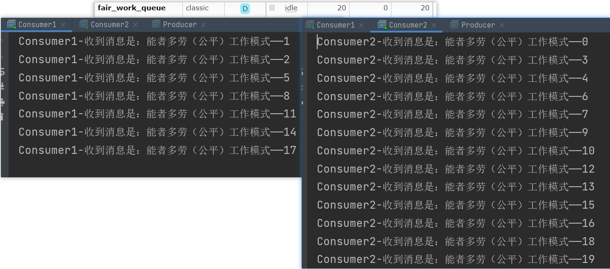

# 六、SpringBoot整合

## 1、fanout模式

创建springboot项目，导入相关依赖

```xml
<dependency>
    <groupId>org.springframework.boot</groupId>
    <artifactId>spring-boot-starter-amqp</artifactId>
</dependency>
<dependency>
    <groupId>org.springframework.boot</groupId>
    <artifactId>spring-boot-starter-web</artifactId>
</dependency>
```

### 模式结构图

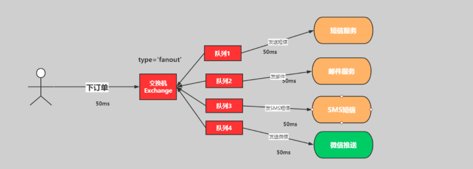

### 配置application.yml

```yml
# 服务端口
server:
  port: 8080
# 配置rabbitmq服务
spring:
  rabbitmq:
    username: admin
    password: admin
    virtual-host: /
    host: localhost
    port: 5672
```

### 创建交换机和队列

创建交换机和队列，并且将其两者绑定

```java
package com.danile.mqboot.config;

import org.springframework.amqp.core.*;
import org.springframework.context.annotation.Bean;
import org.springframework.context.annotation.Configuration;

@Configuration
public class MyMqConfig {
    // 创建交换机
    @Bean
    public FanoutExchange fanoutExchange(){
        return  new FanoutExchange("test_fanout_exchange",true,false);
    }
    
    /** 创建队列
     durable:是否持久化,默认是false,持久化队列：会被存储在磁盘上，当消息代理重启时仍然存在，暂存队列：当前连接有效
     exclusive:默认也是false，只能被当前创建的连接使用，而且当连接关闭后队列即被删除。此参考优先级高于durable
     autoDelete:是否自动删除，当没有生产者或者消费者使用此队列，该队列会自动删除。
    一般设置一下队列的持久化就好,其余两个就是默认false
     */
    @Bean
    public Queue emailQueue(){
        return new Queue("email_queue",true);
    }
    @Bean
    public Queue smsQueue(){
        return new Queue("sms_queue",true);
    }
    @Bean
    public Queue wechatQueue(){
        return new Queue("wechat_queue",true);
    }
    
    // 绑定交换机和队列
    @Bean
    public Binding emailBind(){
        return BindingBuilder.bind(emailQueue()).to(fanoutExchange());
    }
    @Bean
    public Binding smsBind(){
        return BindingBuilder.bind(smsQueue()).to(fanoutExchange());
    }
    @Bean
    public Binding wechatBind(){
        return BindingBuilder.bind(wechatQueue()).to(fanoutExchange());
    }
    
}

```

### 定义订单的生产者

```java
package com.danile.mqboot.service;

import org.springframework.amqp.rabbit.core.RabbitTemplate;
import org.springframework.beans.factory.annotation.Autowired;
import org.springframework.stereotype.Service;

import java.util.HashMap;
import java.util.Map;
import java.util.UUID;

@Service
public class ProductService {
    
    @Autowired
    private RabbitTemplate rabbitTemplate;
    
    /**
     * 生成订单信息
     * @param userID 用户ID
     * @param num 产品数量
     */
    public void product(String userID,Integer num){
        // 通过UUID生成随机订单号
        String productId = UUID.randomUUID().toString();
        String routeKey = "";
        // 使用map集合打包数据，并发送，注意接收时使用Map类型接收
        Map<String,Object> map = new HashMap<>();
        map.put("userid",userID);
        map.put("productid",productId);
        map.put("count",num);
        System.out.println("生产产品中。。。。"+productId);
        // 参数1：交换机名称  参数2：路由Key 参数3：object类型数据，此处发送map集合
        rabbitTemplate.convertAndSend("test_fanout_exchange",routeKey,map);
    }
}

```

此时已完成数据从生产到发送到队列，此时应该需要消费者进行消费，所以新建项目，用于接收数据

### 新建消费者接收数据

```java
package com.danile.mqboot.consumer;

import org.springframework.amqp.rabbit.annotation.RabbitHandler;
import org.springframework.amqp.rabbit.annotation.RabbitListener;
import org.springframework.stereotype.Component;

import java.util.Map;

@Component
@RabbitListener(queues = {"email_queue"}) // 接收数据的队列名
public class EmailConsumer {
    @RabbitHandler  // 通过此注解，会将队列中的消息注入到参数msg中
    public void getMessage(Map msg){  // 注意接收数据的数据类型，应与发送数据的类型相同，防止反序列化失败
        System.out.println("Email收到消息=====》"+msg);
    }
}

```

## 2、direct模式

相较于fanout模式，direct模式多了RouterKey 

###  创建交换机和队列

```java
package com.danile.mqboot.config;

import org.springframework.amqp.core.*;
import org.springframework.context.annotation.Bean;
import org.springframework.context.annotation.Configuration;

@Configuration
public class MyMqConfig {
    // 创建交换机
    @Bean
    public DirectExchange directExchange(){
        return  new DirectExchange("test_direct_exchange",true,false);
    }
    
    /** 创建队列
     durable:是否持久化,默认是false,持久化队列：会被存储在磁盘上，当消息代理重启时仍然存在，暂存队列：当前连接有效
     exclusive:默认也是false，只能被当前创建的连接使用，而且当连接关闭后队列即被删除。此参考优先级高于durable
     autoDelete:是否自动删除，当没有生产者或者消费者使用此队列，该队列会自动删除。
    一般设置一下队列的持久化就好,其余两个就是默认false
     */
    @Bean
    public Queue emailQueue(){
        return new Queue("email_queue",true);
    }
    @Bean
    public Queue smsQueue(){
        return new Queue("sms_queue",true);
    }
    @Bean
    public Queue wechatQueue(){
        return new Queue("wechat_queue",true);
    }
    
    // 绑定交换机和队列
    @Bean
    public Binding emailBind(){
        return BindingBuilder.bind(emailQueue()).to(directExchange()).with("email");
    }
    @Bean
    public Binding smsBind(){
        return BindingBuilder.bind(smsQueue()).to(directExchange()).with("ssm");
    }
    @Bean
    public Binding wechatBind(){
        return BindingBuilder.bind(wechatQueue()).to(directExchange()).with("wechat");
    }
    
}

```

### 生产者

```java
package com.danile.mqboot.service;

import org.springframework.amqp.rabbit.core.RabbitTemplate;
import org.springframework.beans.factory.annotation.Autowired;
import org.springframework.stereotype.Service;

import java.util.HashMap;
import java.util.Map;
import java.util.UUID;

@Service
public class ProductService {
    
    @Autowired
    private RabbitTemplate rabbitTemplate;
    
    /**
     * 生成订单信息
     * @param userID 用户ID
     * @param num 产品数量
     */
    public void product(String userID,Integer num){
        // 通过UUID生成随机订单号
        String productId = UUID.randomUUID().toString();
        String routeKey = "ssm";
        // 使用map集合打包数据，并发送，注意接收时使用Map类型接收
        Map<String,Object> map = new HashMap<>();
        map.put("userid",userID);
        map.put("productid",productId);
        map.put("count",num);
        System.out.println("生产产品中。。。。"+productId);
        // 参数1：交换机名称  参数2：路由Key 参数3：object类型数据，此处发送map集合
        rabbitTemplate.convertAndSend("test_direct_exchange",routeKey,map);
    }
}

```

## 3、topic模式（使用注解配置）

使用注解创建交换机和队列，并且使用消费者接收

### email接收

```java
package com.danile.mqboot.consumer.topic;

import org.springframework.amqp.core.ExchangeTypes;
import org.springframework.amqp.rabbit.annotation.*;
import org.springframework.stereotype.Component;

import java.util.Map;

// bindings其实就是用来确定队列和交换机绑定关系
@RabbitListener(bindings =
@QueueBinding(
        // email_topic_queue 是队列名字，这个名字你可以自定随便定义。
        value = @Queue(value = "email_topic_queue", declare = "true", autoDelete = "false"),
        // test_topic_exchange 交换机的名字 必须和生产者保持一致,这里是确定的rabbitmq模式是：topic模式
        exchange = @Exchange(value = "test_topic_exchange", type = ExchangeTypes.FANOUT),
        // RouterKey
        key = "*.email.#"
)
)
public class EmailTopicConsumer {
    @RabbitHandler  // 通过此注解，会将队列中的消息注入到参数msg中
    public void getMessage(Map msg) {  // 注意接收数据的数据类型，应与发送数据的类型相同，防止反序列化失败
        System.out.println("Email收到消息=====》" + msg);
    }
}
```

### sms接收

```java
package com.danile.mqboot.consumer.topic;

import org.springframework.amqp.core.ExchangeTypes;
import org.springframework.amqp.rabbit.annotation.*;
import org.springframework.stereotype.Component;

import java.util.Map;

// bindings其实就是用来确定队列和交换机绑定关系
@RabbitListener(bindings =
@QueueBinding(
        // email_topic_queue 是队列名字，这个名字你可以自定随便定义。
        value = @Queue(value = "ssm_topic_queue", declare = "true", autoDelete = "false"),
        // test_topic_exchange 交换机的名字 必须和生产者保持一致,这里是确定的rabbitmq模式是：topic模式
        exchange = @Exchange(value = "test_topic_exchange", type = ExchangeTypes.FANOUT),
        // RouterKey
        key = "#.ssm.#"
)
)
@Component
public class SMSTopicConsumer {
    @RabbitHandler
    public void getMessage(Map msg) {
        System.out.println("SSMTopic收到消息=====》" + msg);
    }
}

```

### wechat接收

```java
package com.danile.mqboot.consumer.topic;

import org.springframework.amqp.core.ExchangeTypes;
import org.springframework.amqp.rabbit.annotation.*;
import org.springframework.stereotype.Component;

import java.util.Map;

// bindings其实就是用来确定队列和交换机绑定关系
@RabbitListener(bindings =
@QueueBinding(
        // email_topic_queue 是队列名字，这个名字你可以自定随便定义。
        value = @Queue(value = "wechat_topic_queue", declare = "true", autoDelete = "false"),
        // test_topic_exchange 交换机的名字 必须和生产者保持一致,这里是确定的rabbitmq模式是：topic模式
        exchange = @Exchange(value = "test_topic_exchange", type = ExchangeTypes.FANOUT),
        // RouterKey
        key = "*.wechat"
)
)
public class WechatTopicConsumer {
    @RabbitHandler
    public void getMessage(Map msg) {
        System.out.println("WechatTopic收到消息=====》" + msg);
    }
}
```

创建生产者发送数据

```java
package com.danile.mqboot.service;

import org.springframework.amqp.rabbit.core.RabbitTemplate;
import org.springframework.beans.factory.annotation.Autowired;
import org.springframework.stereotype.Service;

import java.util.HashMap;
import java.util.Map;
import java.util.UUID;

@Service
public class ProductService {
    
    @Autowired
    private RabbitTemplate rabbitTemplate;
    
    public void productTopic(String userID,Integer num,String routeKey){
        // 通过UUID生成随机订单号
        String productId = UUID.randomUUID().toString();
        // 使用map集合打包数据，并发送，注意接收时使用Map类型接收
        Map<String,Object> map = new HashMap<>();
        map.put("userid",userID);
        map.put("productid",productId);
        map.put("count",num);
        System.out.println("生产产品中。。。。"+productId);
        // 参数1：交换机名称  参数2：路由Key 参数3：object类型数据，此处发送map集合
        rabbitTemplate.convertAndSend("test_topic_exchange",routeKey,map);
    }
}

```

# 七、RabbitMQ高级

## 1、过期时间TTL

### 概述

过期时间TTL表示可以对消息设置预期的时间，在这个时间内都可以被消费者接收获取；过了之后消息将自动被删除。RabbitMQ可以对**消息和队列**设置TTL。目前有两种方法可以设置。

- 第一种方法是通过队列属性设置，队列中所有消息都有相同的过期时间。
- 第二种方法是对消息进行单独设置，每条消息TTL可以不同。

如果上述两种方法同时使用，则消息的过期时间以两者之间TTL较小的那个数值为准。消息在队列的生存时间一旦超过设置的TTL值，就称为dead message被投递到死信队列， 消费者将无法再收到该消息。

### 设置队列TTL

```java
package com.xuexiangban.rabbitmq.ttl;
import com.rabbitmq.client.AMQP;
import com.rabbitmq.client.Channel;
import com.rabbitmq.client.Connection;
import com.rabbitmq.client.ConnectionFactory;
import org.springframework.amqp.core.Message;
import org.springframework.amqp.core.MessageProperties;
import java.util.HashMap;
import java.util.Map;

public class Producer {
    public static void main(String[] args) {
        // 1: 创建连接工厂
        ConnectionFactory connectionFactory = new ConnectionFactory();
        // 2: 设置连接属性
        connectionFactory.setHost("localhost");
        connectionFactory.setPort(5672);
        connectionFactory.setVirtualHost("/");
        connectionFactory.setUsername("admin");
        connectionFactory.setPassword("admin");
        Connection connection = null;
        Channel channel = null;
        try {
            // 3: 从连接工厂中获取连接
            connection = connectionFactory.newConnection("生产者");
            // 4: 从连接中获取通道channel
            channel = connection.createChannel();
            // 5: 申明队列queue存储消息
            /*
             *  如果队列不存在，则会创建
             *  Rabbitmq不允许创建两个相同的队列名称，否则会报错。
             *
             *  @params1： queue 队列的名称
             *  @params2： durable 队列是否持久化
             *  @params3： exclusive 是否排他，即是否私有的，如果为true,会对当前队列加锁，其他的通道不能访问，并且连接自动关闭
             *  @params4： autoDelete 是否自动删除，当最后一个消费者断开连接之后是否自动删除消息。
             *  @params5： arguments 可以设置队列附加参数，设置队列的有效期，消息的最大长度，队列的消息生命周期等等。
             * */
            Map<String,Object> args2 = new HashMap<>();
            args2.put("x-message-ttl",5000);
            channel.queueDeclare("ttl.queue", true, false, false, args2);
            // 6： 准备发送消息的内容
            String message = "Hello World！！！";
            Map<String, Object> headers = new HashMap<String, Object>();
            headers.put("x", "1");
            headers.put("y", "1");
            AMQP.BasicProperties basicProperties = new AMQP.BasicProperties().builder()
                    .deliveryMode(2) // 传送方式
                    .priority(1)
                    .contentEncoding("UTF-8") // 编码方式
                    .expiration("3000") // 过期时间
                    .headers(headers).build(); //自定义属性
            // 7: 发送消息给中间件rabbitmq-server
            // @params1: 交换机exchange
            // @params2: 队列名称/routing
            // @params3: 属性配置
            // @params4: 发送消息的内容
            for (int i = 0; i <100 ; i++) {
                channel.basicPublish("", "ttl.queue", basicProperties, message.getBytes());
                System.out.println("消息发送成功!");
                Thread.sleep(1000);
            }
        } catch (Exception ex) {
            ex.printStackTrace();
            System.out.println("发送消息出现异常...");
        } finally {
            // 7: 释放连接关闭通道
            if (channel != null && channel.isOpen()) {
                try {
                    channel.close();
                } catch (Exception ex) {
                    ex.printStackTrace();
                }
            }
            if (connection != null && connection.isOpen()) {
                try {
                    connection.close();
                } catch (Exception ex) {
                    ex.printStackTrace();
                }
            }
        }
    }
}
```

### 测试类

```java
package com.xuexiangban.rabbitmq.ttl;
import com.rabbitmq.client.*;
import java.io.IOException;

public class Consumer {
    public static void main(String[] args) {
        // 1: 创建连接工厂
        ConnectionFactory connectionFactory = new ConnectionFactory();
        // 2: 设置连接属性
        connectionFactory.setHost("47.104.141.27");
        connectionFactory.setPort(5672);
        connectionFactory.setVirtualHost("/");
        connectionFactory.setUsername("admin");
        connectionFactory.setPassword("admin");
        Connection connection = null;
        Channel channel = null;
        try {
            // 3: 从连接工厂中获取连接
            connection = connectionFactory.newConnection("消费者");
            // 4: 从连接中获取通道channel
            channel = connection.createChannel();
            // 5: 申明队列queue存储消息
            /*
             *  如果队列不存在，则会创建
             *  Rabbitmq不允许创建两个相同的队列名称，否则会报错。
             *
             *  @params1： queue 队列的名称
             *  @params2： durable 队列是否持久化
             *  @params3： exclusive 是否排他，即是否私有的，如果为true,会对当前队列加锁，其他的通道不能访问，并且连接自动关闭
             *  @params4： autoDelete 是否自动删除，当最后一个消费者断开连接之后是否自动删除消息。
             *  @params5： arguments 可以设置队列附加参数，设置队列的有效期，消息的最大长度，队列的消息生命周期等等。
             * */
            // 这里如果queue已经被创建过一次了，可以不需要定义
            //channel.queueDeclare("queue1", false, false, false, null);
            // 6： 定义接受消息的回调
            Channel finalChannel = channel;
            finalChannel.basicConsume("ttl.queue", true, new DefaultConsumer(channel){
                @Override
                public void handleDelivery(String consumerTag, Envelope envelope, AMQP.BasicProperties properties, byte[] body) throws IOException {
                    System.out.println(properties);
                    System.out.println("获取的消息是：" + new String(body,"UTF-8"));
                }
            });
            System.out.println("开始接受消息");
            System.in.read();
        } catch (Exception ex) {
            ex.printStackTrace();
            System.out.println("发送消息出现异常...");
        } finally {
            // 7: 释放连接关闭通道
            if (channel != null && channel.isOpen()) {
                try {
                    channel.close();
                } catch (Exception ex) {
                    ex.printStackTrace();
                }
            }
            if (connection != null && connection.isOpen()) {
                try {
                    connection.close();
                } catch (Exception ex) {
                    ex.printStackTrace();
                }
            }
        }
    }
}
```

> 参数 x-message-ttl 的值 必须是非负 32 位整数 (0 <= n <= 2^32-1) ，以毫秒为单位表示 TTL 的值。这样，值 6000 表示存在于 队列 中的当前 消息 将最多只存活 6 秒钟。

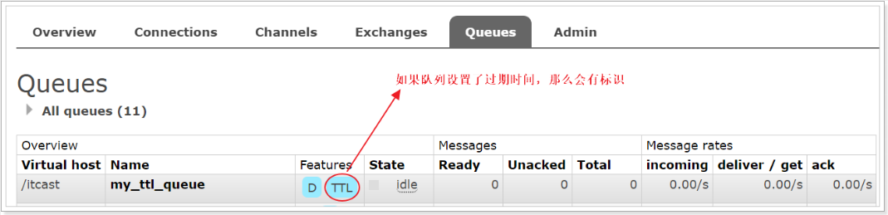

### 设置消息TTL

消息的过期时间；只需要在发送消息（可以发送到任何队列，不管该队列是否属于某个交换机）的时候设置过期时间即可。在测试类中编写如下方法发送消息并设置过期时间到队列：

```java
package com.xuexiangban.rabbitmq.ttl;
import com.rabbitmq.client.AMQP;
import com.rabbitmq.client.Channel;
import com.rabbitmq.client.Connection;
import com.rabbitmq.client.ConnectionFactory;
import java.util.HashMap;
import java.util.Map;

public class MessageTTLProducer {
    public static void main(String[] args) {
        // 1: 创建连接工厂
        ConnectionFactory connectionFactory = new ConnectionFactory();
        // 2: 设置连接属性
        connectionFactory.setHost("localhost");
        connectionFactory.setPort(5672);
        connectionFactory.setVirtualHost("/");
        connectionFactory.setUsername("admin");
        connectionFactory.setPassword("admin");
        Connection connection = null;
        Channel channel = null;
        try {
            // 3: 从连接工厂中获取连接
            connection = connectionFactory.newConnection("生产者");
            // 4: 从连接中获取通道channel
            channel = connection.createChannel();
            // 5: 申明队列queue存储消息
            /*
             *  如果队列不存在，则会创建
             *  Rabbitmq不允许创建两个相同的队列名称，否则会报错。
             *
             *  @params1： queue 队列的名称
             *  @params2： durable 队列是否持久化
             *  @params3： exclusive 是否排他，即是否私有的，如果为true,会对当前队列加锁，其他的通道不能访问，并且连接自动关闭
             *  @params4： autoDelete 是否自动删除，当最后一个消费者断开连接之后是否自动删除消息。
             *  @params5： arguments 可以设置队列附加参数，设置队列的有效期，消息的最大长度，队列的消息生命周期等等。
             * */
            channel.queueDeclare("ttl.queue2", true, false, false, null);
            // 6： 准备发送消息的内容
            String message = "Hello World！！！";
            Map<String, Object> headers = new HashMap<String, Object>();
            headers.put("x", "1");
            headers.put("y", "1");
            AMQP.BasicProperties basicProperties = new AMQP.BasicProperties().builder()
                    .deliveryMode(2) // 传送方式
                    .priority(1)
                    .contentEncoding("UTF-8") // 编码方式
                    .expiration("5000") // 过期时间
                    .headers(headers).build(); //自定义属性
            // 7: 发送消息给中间件rabbitmq-server
            // @params1: 交换机exchange
            // @params2: 队列名称/routing
            // @params3: 属性配置
            // @params4: 发送消息的内容
            for (int i = 0; i <10 ; i++) {
                channel.basicPublish("", "ttl.queue2", basicProperties, message.getBytes());
                System.out.println("消息发送成功!");
            }
        } catch (Exception ex) {
            ex.printStackTrace();
            System.out.println("发送消息出现异常...");
        } finally {
            // 7: 释放连接关闭通道
            if (channel != null && channel.isOpen()) {
                try {
                    channel.close();
                } catch (Exception ex) {
                    ex.printStackTrace();
                }
            }
            if (connection != null && connection.isOpen()) {
                try {
                    connection.close();
                } catch (Exception ex) {
                    ex.printStackTrace();
                }
            }
        }
    }
}
```

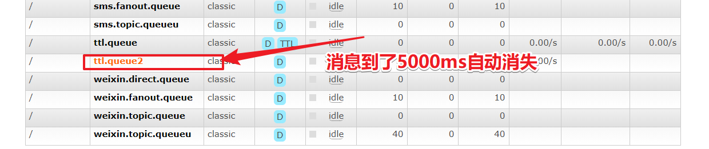

> expiration 字段以微秒为单位表示 TTL 值。且与 x-message-ttl 具有相同的约束条件。因为 expiration 字段必须为字符串类型，broker 将只会接受以字符串形式表达的数字。
>
> 当同时指定了 queue 和 message 的 TTL 值，则两者中较小的那个才会起作用。

