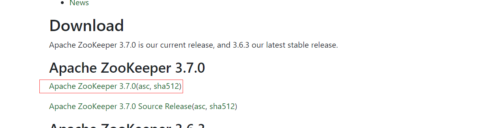
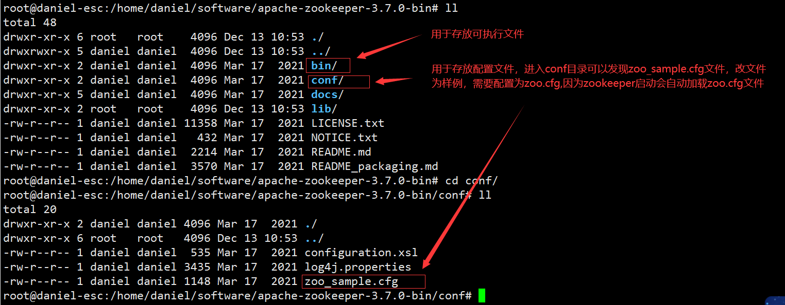
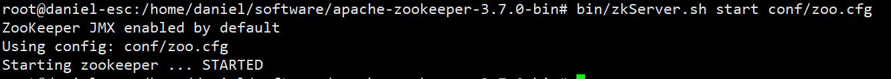

# zookeeper安装

## 下载

[zookeeper下载](https://zookeeper.apache.org/releases.html)



## 搭建zookeeper

在搭建zookeeper之前要保证服务器安装了jdk

```java
# 执行java和javac检查是否安装
    java
    javac
```

从官方下载安装包并上传至服务器解压，查看解压目录如下：



配置zoo.cfg文件

复制zoo_sample.cfg文件为zoo.cfg

```sh
cp zoo_sample.cfg zoo.cfg
```

使用vim打开zoo.cfg

```properties
# zookeeper中时间的基本单位，以2秒为单位（毫秒）
tickTime=2000
# 允许follower初始化连接到leader的最大时长为10*2000毫秒=20秒
initLimit=10
# 允许follower与leader数据同步的最大时长，10秒
syncLimit=5
# zookeeper数据存储及日志保存目录（如果没有指定dataLogDir目录，则日志也存放在该位置）
dataDir=/home/daniel/software/apache-zookeeper-3.7.0-bin/zookeeper
# 对客户端提供的端口号
clientPort=2181
# 单个客户端与zookeeper连接的最大并发连接数
maxClientCnxns=60
# 保存数据快照的数量，之外的将被清除
autopurge.snapRetainCount=3
#自动清除任务的间隔时间，小时为单位，默认为0，表示不自动清除
autopurge.purgeInterval=1
```

启动zookeeper

```sh
bin/zkServer.sh start conf/zoo.cfg 
```

启动成功如下：




