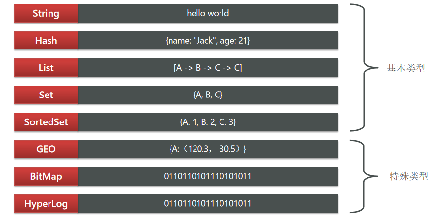
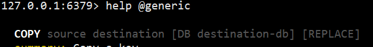
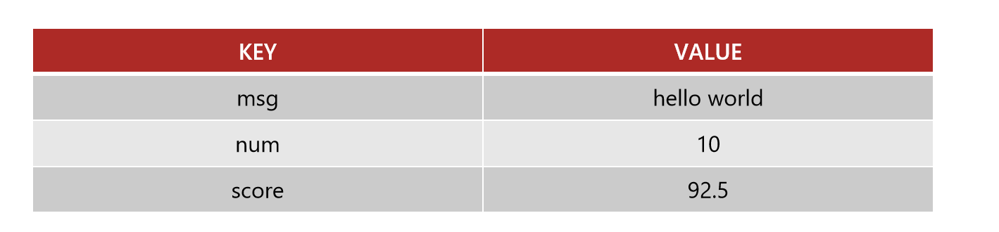
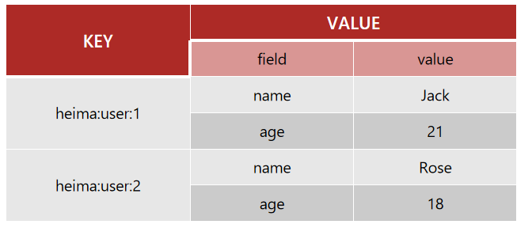
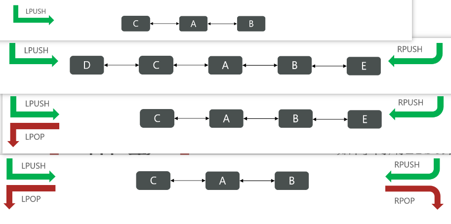
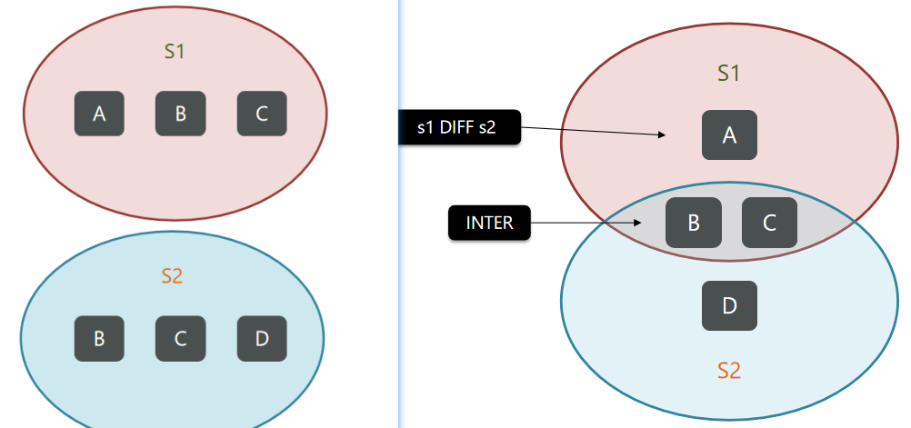
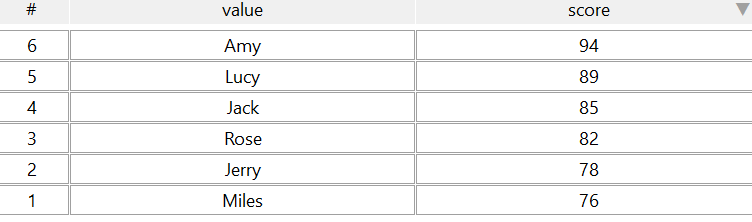

# 一、Redis的数据结构

Redis是一个`key-value`的数据库，`key`一般是String类型，不过value的类型多种多样：



Redis为了方便我们学习，将操作不同数据类型的命令也做了分组，在官网（ https://redis.io/commands ）可以查看到不同的命令



# 二、Redis的通用命令

通用指令是部分数据类型的，都可以使用的指令，常见的有：

> `KEYS`：查看符合模板的所有key
>
> `DEL`：删除一个指定的key
>
> `EXISTS`：判断key是否存在
>
> `EXPIRE`：给一个key设置有效期，有效期到期时该key会被自动删除
>
> `TTL`：查看一个KEY的剩余有效期

通过help [command] 可以查看一个命令的具体用法，例如：


## 1、string类型

String类型，也就是字符串类型，是Redis中最简单的存储类型。

其value是字符串，不过根据字符串的格式不同，又可以分为3类：

> `string`：普通字符串
>
> `int`：整数类型，可以做自增、自减操作
>
> `float`：浮点类型，可以做自增、自减操作

不管是哪种格式，底层都是字节数组形式存储，只不过是编码方式不同。字符串类型的最大空间不能超过`512m`.




### String的常见命令

> SET：添加或者修改已经存在的一个String类型的键值对
>
> GET：根据key获取String类型的value
>
> MSET：批量添加多个String类型的键值对
>
> MGET：根据多个key获取多个String类型的value
>
> INCR：让一个整型的key自增1
>
> INCRBY:让一个整型的key自增并指定步长，例如：incrby num 2 让num值自增2
>
> INCRBYFLOAT：让一个浮点类型的数字自增并指定步长
>
> SETNX：添加一个String类型的键值对，前提是这个key不存在，否则不执行
>
> SETEX：添加一个String类型的键值对，并且指定有效期

### key的结构

Redis没有类似MySQL中的Table的概念，我们该如何区分不同类型的key呢？

例如，需要存储用户、商品信息到redis，有一个用户id是1，有一个商品id恰好也是1

Redis的key允许有多个单词形成层级结构，多个单词之间用`':'`隔开，格式如下：

```
项目名:业务名:类型:id
```

这个格式并非固定，也可以根据自己的需求来删除或添加词条。

例如我们的项目名称叫 heima，有user和product两种不同类型的数据，我们可以这样定义key：

> user相关的`key:heima:user:1`
>
> product相关的`key:heima:product:1`

如果Value是一个Java对象，例如一个User对象，则可以将对象序列化为JSON字符串后存储：

| **KEY**           | **VALUE**                                   |
| ----------------- | ------------------------------------------- |
| `heima:user:1`    | `{"id":1, "name": "Jack", "age": 21}`       |
| `heima:product:1` | `{"id":1, "name": "小米11", "price": 4999}` |

## 2、Hash类型

Hash类型，也叫散列，其value是一个无序字典，类似于Java中的HashMap结构。

String结构是将对象序列化为JSON字符串后存储，当需要修改对象某个字段时很不方便：

| **KEY**      | **VALUE**             |
| ------------ | --------------------- |
| heima:user:1 | {name:"Jack", age:21} |
| heima:user:2 | {name:"Rose", age:18} |

### Hash结构

Hash结构可以将对象中的每个字段独立存储，可以针对单个字段做CRUD：




### Hash常见命令

> HSET key field value：添加或者修改hash类型key的field的值
>
> HGET key field：获取一个hash类型key的field的值
>
> HMSET：批量添加多个hash类型key的field的值
>
> HMGET：批量获取多个hash类型key的field的值
>
> HGETALL：获取一个hash类型的key中的所有的field和value
>
> HKEYS：获取一个hash类型的key中的所有的field
>
> HVALS：获取一个hash类型的key中的所有的value
>
> HINCRBY:让一个hash类型key的字段值自增并指定步长
>
> HSETNX：添加一个hash类型的key的field值，前提是这个field不存在，否则不执行

## 3、List类型

Redis中的List类型与Java中的LinkedList类似，可以看做是一个双向链表结构。

既可以支持正向检索和也可以支持反向检索。

特征也与LinkedList类似：

> 有序
>
> 元素可以重复
>
> 插入和删除快
>
> 查询速度一般

常用来存储一个有序数据，例如：朋友圈点赞列表，评论列表等。

### List的常见命令

> LPUSH key  element ... ：向列表左侧插入一个或多个元素
>
> LPOP key：移除并返回列表左侧的第一个元素，没有则返回nil
>
> RPUSH key  element ... ：向列表右侧插入一个或多个元素
>
> RPOP key：移除并返回列表右侧的第一个元素
>
> LRANGE key star end：返回一段角标范围内的所有元素
>
> BLPOP和BRPOP：与LPOP和RPOP类似，只不过在没有元素时等待指定时间，而不是直接返回nil




如何利用List结构模拟一个栈?

入口和出口在同一边如何利用List结构模拟一个队列?

入口和出口在不同边如何利用List结构模拟一个阻塞队列?

入口和出口在不同边出队时采用BLPOP或BRPOP

## 4、Set类型

Redis的Set结构与Java中的HashSet类似，可以看做是一个value为null的HashMap。

因为也是一个hash表，因此具备与HashSet类似的特征：

> 无序
>
> 元素不可重复
>
> 查找快
>
> 支持交集、并集、差集等功能

### String的常见命令

> SADD key member ... ：向set中添加一个或多个元素
>
> SREM key member ... : 移除set中的指定元素
>
> SCARD key： 返回set中元素的个数
>
> SISMEMBER key member：判断一个元素是否存在于set中
>
> SMEMBERS：获取set中的所有元素
>
> SINTER key1 key2 ... ：求key1与key2的交集



> SDIFF key1 key2 ... ：求key1与key2的差集
>
> SUNION key1 key2 ..：求key1和key2的并集

### Set命令练习

a.将下列数据用Redis的Set集合来存储：

张三的好友有：李四、王五、赵六

```sh
sadd zhangsan lisi wangwu zhaoliu
```

李四的好友有：王五、麻子、二狗

```sh
sadd lisi wangwu mazi ergou
```

b.利用Set的命令实现下列功能：

计算张三的好友有几人

```sh
scard zhangsan
```

计算张三和李四有哪些共同好友

```sh
sinter zhangsan lisi
1) "wangwu"
```

查询哪些人是张三的好友却不是李四的好友

```sh
sdiff zhangsan lisi
1) "lisi"
2) "zhaoliu"
```

查询张三和李四的好友总共有哪些人

```sh
SUNION zhangsan lisi
1) "lisi"
2) "wangwu"
3) "zhaoliu"
4) "ergou"
5) "mazi"
```

判断李四是否是张三的好友

```
SISMEMBER zhangsan lisi
(integer) 1
```

判断张三是否是李四的好友

```
SISMEMBER lisi zhangsan
(integer) 0
```

将李四从张三的好友列表中移除

```
SREM zhangsan lisi
(integer) 1
```

## 5、SortedSet类型

Redis的SortedSet是一个可排序的set集合，与Java中的`TreeSet`有些类似，但底层数据结构却差别很大。SortedSet中的每一个元素都带有一个`score`属性，可以基于score属性对元素排序，底层的实现是一个跳表（`SkipList`）加 `hash`表。

SortedSet具备下列特性：

> 可排序
>
> 元素不重复
>
> 查询速度快

因为SortedSet的可排序特性，经常被用来实现`排行榜`这样的功能。

### SortedSet的常见命令

> ZADD key score member：添加一个或多个元素到sorted set ，如果已经存在则更新其score值
>
> ZREM key member：删除sorted set中的一个指定元素
>
> ZSCORE key member : 获取sorted set中的指定元素的score值
>
> ZRANK key member：获取sorted set 中的指定元素的排名
>
> ZCARD key：获取sorted set中的元素个数
>
> ZCOUNT key min max：统计score值在给定范围内的所有元素的个数
>
> ZINCRBY key increment member：让sorted set中的指定元素自增，步长为指定的increment值
>
> ZRANGE key min max：按照score排序后，获取指定排名范围内的元素
>
> ZRANGEBYSCORE key min max：按照score排序后，获取指定score范围内的元素
>
> ZDIFF、ZINTER、ZUNION：求差集、交集、并集

注意：所有的排名默认都是`升序`，如果要降序则在命令的Z后面添加`REV`即可

### SortedSet命令练习

将班级的下列学生得分存入Redis的SortedSet中：

`Jack 85, Lucy 89, Rose 82, Tom 95, Jerry 78, Amy 92, Miles 76`

```sh
zadd students 85 Jack 89 Lucy 82 Rose 95 Tom 78 Jerry 92 Amy 76 Miles
(integer) 7
```

并实现下列功能：

删除Tom同学

```
zrem students Tom
(integer) 1
```

获取Amy同学的分数

```
ZSCORE students Amy
"92"
```

获取Rose同学的排名

```
ZRANK students Rose
(integer) 2
```

查询80分以下有几个学生

```sh
ZCOUNT students 0 80
(integer) 2
```

给Amy同学加2分

```sh
ZINCRBY students 2 Amy
"94"
```

查出成绩前3名的同学

```
成绩前3名
ZRANGE students 0 2 REV
1) "Amy"
2) "Lucy"
3) "Jack"
成绩后3名
ZRANGE students 0 2
1) "Miles"
2) "Jerry"
3) "Rose"
```



查出成绩80分以下的所有同学

```
ZRANGEBYSCORE students 0 80
1) "Miles"
2) "Jerry"
```


