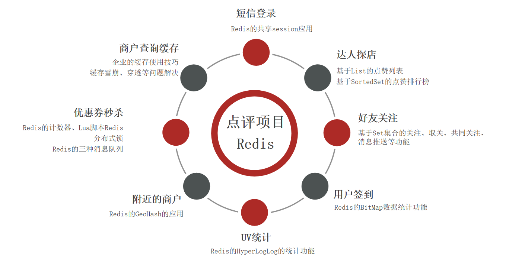
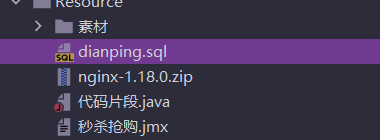
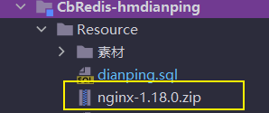
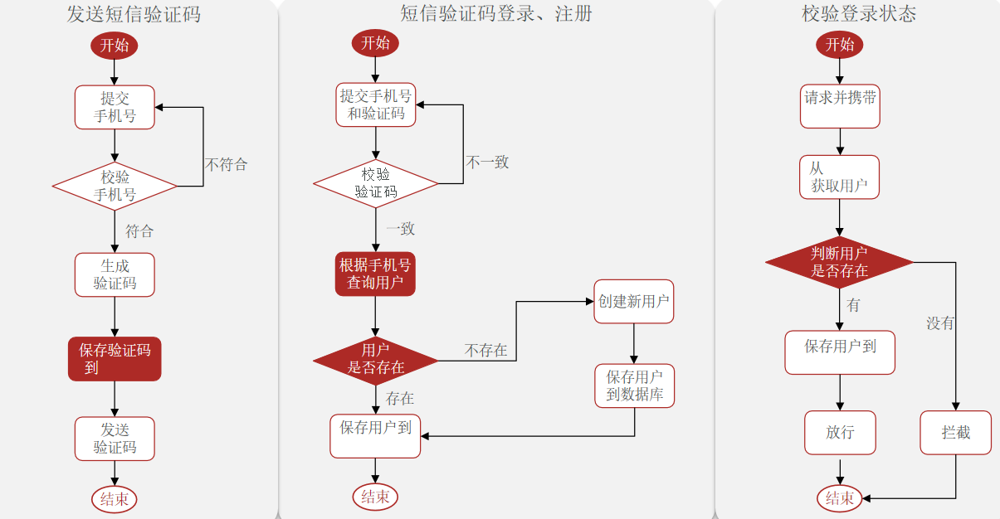

# 一、项目介绍



# 二、短信登录

## 1、项目准备

### 导入sql

导入课前资料提供的`SQL`文件



其中的表有：

> `tb_user`：用户表
>
> `tb_user_info`：用户详情表
>
> `tb_shop`：商户信息表
>
> `tb_shop_type`：商户类型表
>
> `tb_blog`：用户日记表（达人探店日记）
>
> `tb_follow`：用户关注表
>
> `b_voucher`：优惠券表
>
> `b_voucher_order`：优惠券的订单表

### 导入后端项目

在资料中提供了一个项目源码


启动项目后，在浏览器访问：http://localhost:8081/shop-type/list ，如果可以看到数据则证明运行没有问题

不要忘了修改`application.yaml`文件中的`mysql`、`redis`地址信息

### 前端项目

在资料中提供了一个`nginx`文件夹



将其复制到任意目录，要确保该目录不包含中文、特殊字符和空格。

在`nginx`所在目录下打开一个CMD窗口，输入命令：

```sh
start nginx.exe
```

打开chrome浏览器,，输入 http://localhost:8080 显示页面则表示成功

### 基于Session实现登录




# 商户查询缓存

# 优惠券秒杀

# 达人探店

# 好友关注

# 附近的商户

# 用户签到

# UV统计