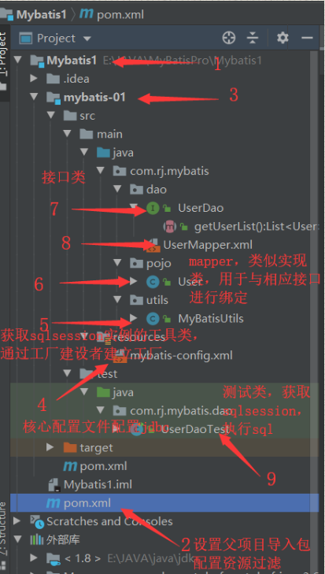
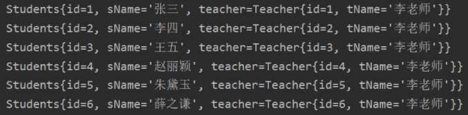
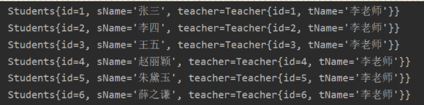
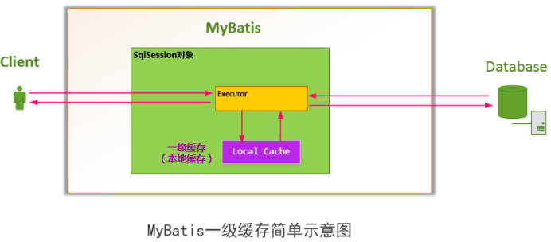
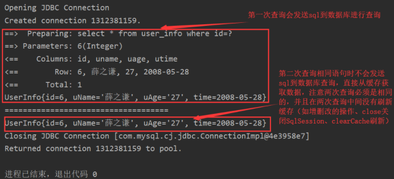
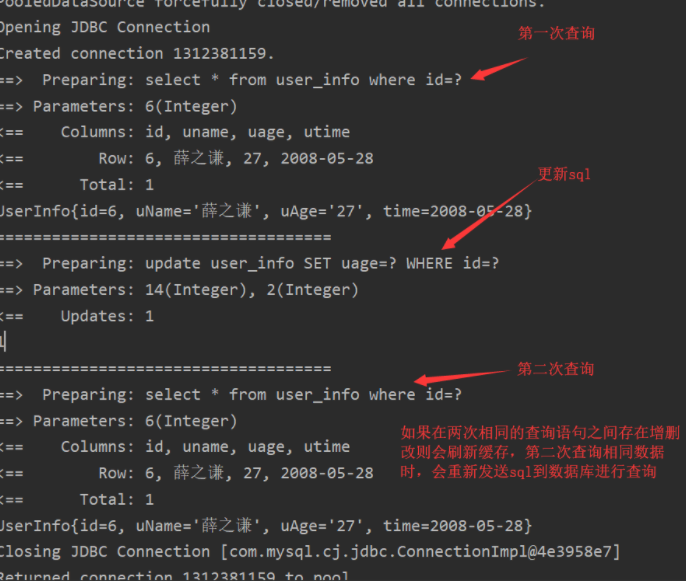
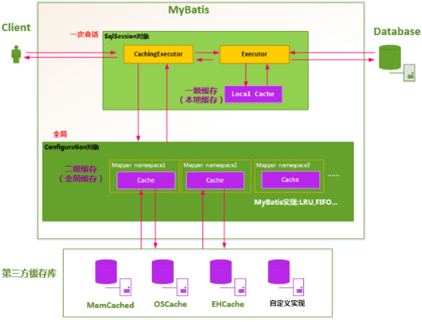
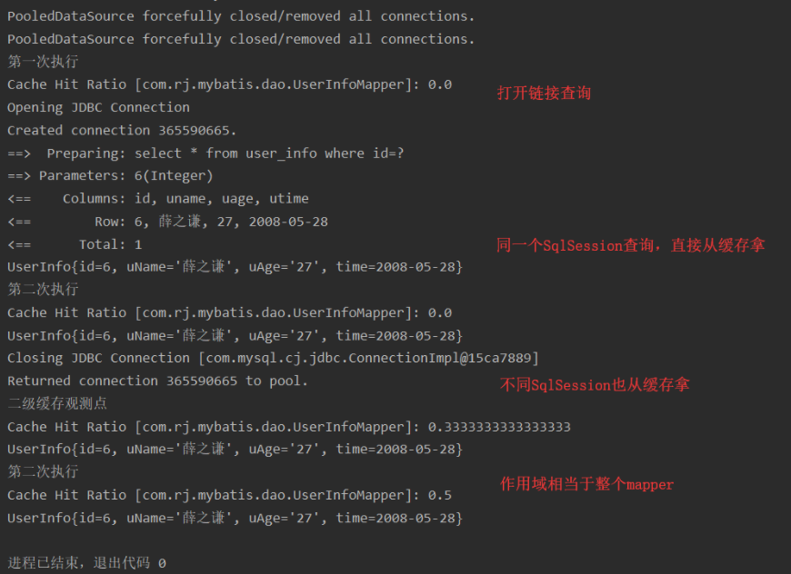

# 一、基本用法

## 1、配置

### 方式一：通过xml配置

#### 项目结构



#### mybatis核心配置文件

```xml
<?xml version="1.0" encoding="UTF-8" ?>
<!DOCTYPE configuration
        PUBLIC "-//mybatis.org//DTD Config 3.0//EN"
        "http://mybatis.org/dtd/mybatis-3-config.dtd">
<!--configuration核心配置文件-->
<configuration>
    <!--environments多环境配置,默认为development-->
    <environments default="development">
        <!--environment环境配置-->
        <environment id="development">
            <!--transactionManager事务管理，默认使用jdbc的事务管理-->
            <transactionManager type="JDBC"/>
            <!--dataSource数据源-->
            <dataSource type="POOLED">
                <!--配置的属性，此处为数据库的jdbc配置-->
                <property name="driver" value="com.mysql.cj.jdbc.Driver"/>
                <property name="url" value="jdbc:mysql://localhost:3306/mybatis?useUnicode=true&amp;useJDBCCompliantTimezoneShift=true&amp;useLegacyDatetimeCode=false&amp;serverTimezone=UTC"/>
                <property name="username" value="root"/>
                <property name="password" value="201710262118"/>
            </dataSource>
        </environment>
    </environments>
    <!--    每一个mapper都应该在mybatis核心配置文件中进行配置-->
    <mappers>
         <mapper resource="com/rj/mybatis/dao/UserMapper.xml"/>
    </mappers>
</configuration>
```

#### 从 XML 中构建 SqlSessionFactory

每个基于 `MyBatis `的应用都是以一个 `SqlSessionFactory `的实例为核心的。

`SqlSessionFactory `的实例可以通过`SqlSessionFactoryBuilder `获得。而 `SqlSessionFactoryBuilder `则可以从 XML 配置文件或一个预先配置的 `Configuration `实例来构建出 `SqlSessionFactory `实例。

从 `XML `文件中构建 `SqlSessionFactory `的实例非常简单，建议使用类路径下的资源文件进行配置。 但也可以使用任意的输入流`（InputStream）`实例，比如用文件路径字符串或 `file:// URL `构造的输入流。`MyBatis `包含一个名叫 `Resources `的工具类，它包含一些实用方法，使得从类路径或其它位置加载资源文件更加容易。

```java
String resource = "org/mybatis/example/mybatis-config.xml";
InputStream inputStream = Resources.getResourceAsStream(resource);
SqlSessionFactory sqlSessionFactory = new SqlSessionFactoryBuilder().build(inputStream);
```

#### 示例：

```java
public class MyBatisUtils {
    private static SqlSessionFactory sqlSessionFactory;
//    固定写法使用Mybatis获得SqlSessionFactory
    static {
        try {
            String resource = "mybatis-config.xml";
            InputStream inputStream = Resources.getResourceAsStream(resource);
            sqlSessionFactory =new SqlSessionFactoryBuilder().build(inputStream);
        } catch (IOException e) {
            e.printStackTrace();
        }
    }
//    既然有了 SqlSessionFactory，顾名思义，我们可以从中获得 SqlSession 的实例。
//    SqlSession 提供了在数据库执行 SQL 命令所需的所有方法。
//    你可以通过 SqlSession 实例来直接执行已映射的 SQL 语句
    
    /
     * 通过sqlSessionFactory获得sqlSession实例
     * @return SqlSession
     */
    public static SqlSession getSqlSession(){
        return sqlSessionFactory.openSession();
    }
}
```


### 方式二：通过Spring整合配置

添加db.properties

```properties
comboPooledDataSource=com.mchange.v2.c3p0.ComboPooledDataSource
mysql.jdbc.driver = com.mysql.cj.jdbc.Driver
mysql.jdbc.url = jdbc:mysql://localhost:3306/user?useUnicode=true&useJDBCCompliantTimezoneShift=true&useLegacyDatetimeCode=false&serverTimezone=UTC
mysql.jdbc.user =root
mysql.jdbc.pow =201710262118
```

​        

在ApplicationContext.xml中添加

```xml
<?xml version="1.0" encoding="UTF-8"?>
<beans xmlns="http://www.springframework.org/schema/beans"
       xmlns:xsi="http://www.w3.org/2001/XMLSchema-instance"
       xmlns:context="http://www.springframework.org/schema/context" 
       xmlns:tx="http://www.springframework.org/schema/tx"
       xmlns:aop="http://www.springframework.org/schema/aop"
       xsi:schemaLocation="http://www.springframework.org/schema/beans
                           http://www.springframework.org/schema/beans/spring-beans.xsd
                           http://www.springframework.org/schema/context
                           https://www.springframework.org/schema/context/spring-context.xsd 
                           http://www.springframework.org/schema/tx 
                           http://www.springframework.org/schema/tx/spring-tx.xsd 
                           http://www.springframework.org/schema/aop 
                           https://www.springframework.org/schema/aop/spring-aop.xsd">
    <!--    开启扫描，只扫描service和dao层，controller不需spring扫描-->
    <context:component-scan base-package="com.rj.ssm">
        <!--        配置那些注解不扫描-->
        <context:exclude-filter type="annotation" expression="org.springframework.stereotype.Controller"/>
    </context:component-scan>
    <!--    spring整合mybatis-->
    <!--    加载配置文件db.properties-->
    <context:property-placeholder location="classpath:db.properties"/>
    <!--    加载多个配置文件properties
    <bean class="org.springframework.beans.factory.config.PropertyPlaceholderConfigurer">
        <property name="locations">
            <list>
                <value>classpath:db.properties</value>
                <value>classpath:solr.properties</value>
            </list>
        </property>
    </bean> -->
    <!--    配置连接池-->
    <bean id="dataSource" class="${comboPooledDataSource}">
        <property name="driverClass" value="${mysql.jdbc.driver}"/>
        <property name="jdbcUrl" value="${mysql.jdbc.url}"/>
        <property name="user" value="${mysql.jdbc.user}"/>
        <property name="password" value="${mysql.jdbc.pow}"/>
    </bean>
    <!--    配置SqlSessionFactoryBean工厂-->
    <bean id="sqlSessionFactory" class="org.mybatis.spring.SqlSessionFactoryBean">
        <property name="dataSource" ref="dataSource"></property>
    </bean>
    <!--    配置接口所在包-->
    <bean id="mapperScanner" class="org.mybatis.spring.mapper.MapperScannerConfigurer">
        <property name="basePackage" value="com.rj.ssm.dao"></property>
    </bean>
    <!--    配置声明式事务-->
    <!--    配置事务管理器-->
    <bean id="transactionManager" class="org.springframework.jdbc.datasource.DataSourceTransactionManager">
        <property name="dataSource" ref="dataSource"></property>
    </bean>
    <!--    配置事务通知-->
    <tx:advice id="txAdvice" transaction-manager="transactionManager">
        <tx:attributes>
            <tx:method name="find*" read-only="true"/>
            <tx:method name="*" isolation="DEFAULT"/>
        </tx:attributes>
    </tx:advice>
    <!--    配置AOP增强-->
    <aop:config>
        <aop:advisor advice-ref="txAdvice" pointcut="execution(* com.rj.ssm.services.impl.*ServiceImpl.*(..))">
        </aop:advisor>
    </aop:config>
</beans>
```

### 方式三：springboot整合

#### application.yml

```yml
spring:
  # mysql 配置
  datasource:
    driver-class-name: com.mysql.cj.jdbc.Driver
    url: jdbc:mysql://localhost:3306/demo?serverTimezone=UTC
    username: root
    password: daniel
#spring集成Mybatis环境
#pojo别名扫描包
mybatis.type-aliases-package=com.itheima.domain
#加载Mybatis映射文件
mybatis.mapper-locations=classpath:mapper/*Mapper.xml
```


## 2、简单CRUD

### 接口

```java
public interface UserMapper {
//    定义查询所有的用户
    List<User> getUserList();
//    定义根据id查询用户
    User getUserById(int id);
//    定义insert一个User
    int addUser(User user);
//    删除用户
    int deleteUser(int id);
//    修改用户
    int updateUser(User user);
}
```

### mapper.xml

```xml
<?xml version="1.0" encoding="UTF-8" ?>
<!DOCTYPE mapper
        PUBLIC "-//mybatis.org//DTD Mapper 3.0//EN"
        "http://mybatis.org/dtd/mybatis-3-mapper.dtd">
<!--namespace为命名空间，用于绑定对应的Dao/Mapper接口,例如下面绑定了UserDao接口-->
<mapper namespace="com.rj.mybatis.dao.UserMapper">
<!--    查询所有用户-->
    <!--    select标签用于查询-->
    <!--    id表示绑定接口的方法,resultType设置返回结果集的类型-->
    <!--    标签内容直接写sql语句-->
    <select id="getUserList" resultType="com.rj.mybatis.pojo.User">
        SELECT * FROM mybatis.tb_user
    </select>
<!--根据id查询用户，resultType映射的实体类类型，parameterType传入的参数类型-->
    <select id="getUserById" resultType="com.rj.mybatis.pojo.User" parameterType="int">
        SELECT * FROM mybatis.tb_user WHERE id=#{id}
    </select>
<!--    插入数据-->
    <insert id="addUser"  parameterType="com.rj.mybatis.pojo.User">
        insert into mybatis.tb_user(id,uname,upass) values(#{id},#{uname},#{upass})
    </insert>
<!--     删除用户根据id-->
    <delete id="deleteUser" parameterType="int">
        delete from mybatis.tb_user where id=#{id}
    </delete>
<!--    更新用户数据表-->
    <update id="updateUser" parameterType="com.rj.mybatis.pojo.User">
        update mybatis.tb_user set  uname=#{uname},upass=#{upass}  where id=#{id}
    </update>
<!--    模糊查询-->
    <select id="likeUser" resultType="com.rj.mybatis.pojo.User" parameterType="String">
        SELECT * FROM tb_user WHERE uname LIKE concat("%",#{value},"%")
    </select>
</mapper>
```

## 3、多对一处理

### 数据库建表

```sql
CREATE TABLE teacher(
	id INT(10) NOT NULL,
	tname VARCHAR(30),
	PRIMARY KEY(id)
)ENGINE=INNODB DEFAULT CHARSET=utf8

INSERT INTO teacher VALUES(1,"李老师")

CREATE TABLE students
(
	id INT(10) NOT NULL,
	sname VARCHAR(30),
	tid INT(10),
	KEY fktid (tid),
	CONSTRAINT fktid FOREIGN KEY (tid) REFERENCES teacher(id)
)ENGINE=INNODB DEFAULT CHARSET=utf8

INSERT INTO students VALUES(1,"张三",1);
INSERT INTO students VALUES(2,"李四",1);
INSERT INTO students VALUES(3,"王五",1);
INSERT INTO students VALUES(4,"赵丽颖",1);
INSERT INTO students VALUES(5,"朱黛玉",1);
INSERT INTO students VALUES(6,"薛之谦",1);
```

### 代码

TeacherMapper 

```java
public interface TeacherMapper { 
    //    查询老师    
    List<Teacher> getAllTeacher();
}              
```

StudentsMapper 

```java
public interface StudentsMapper {
    //    通过子查询来查出学生及老师   
    List<Students> getStudents();
}              
```

方式一：通过子查询来查询

StudentsMapper.xml

```xml
<mapper namespace="com.rj.mybatis.dao.StudentsMapper">
    <select id="getStudents" resultMap="studentsResultMap">
        select *  from students
    </select>
    <resultMap id="studentsResultMap" type="students">
        <result property="id" column="id"></result>
        <result property="sName" column="sname"></result>
<!--    关联Teacher表-->
        <association property="teacher" column="tid" javaType="teacher" select="getTeacher"/>
    </resultMap>
<!--    嵌套子查询调用此查询，类型为Teacher-->
    <select id="getTeacher" resultType="Teacher">
        select *  from teacher where id=#{tid}
    </select>
</mapper>  
```

方式二：通过连表查询（更易理解）

```xml
<!--    方法二连表查询-->
    <select id="getStudents2" resultMap="students2Map">
        select * from students s,teacher t where s.tid=t.id
    </select>
    <resultMap id="students2Map" type="students">
        <result property="id" column="id"></result>
        <result property="sName" column="sname"></result>
        <association property="teacher" javaType="teacher">
            <result property="id" column="id"></result>
           <result property="tName" column="tname"></result>
        </association>
    </resultMap>
```

​        

测试

```java
@Test
public void getStudents(){
    SqlSession sqlSession = SqlSessionUtils.getSqlSession();
    StudentsMapper mapper = sqlSession.getMapper(StudentsMapper.class);
    List<Students> list = mapper.getStudents();
    for (Students students : list) {
        System.out.println(students);
    }
    sqlSession.close();
}       
```

结果：



## 4、一对多处理

数据库和接口使用多对一中的表和接口

### 代码

StudentsMapper.xml

```xml
<mapper namespace="com.rj.mybatis.dao.StudentsMapper">
    <select id="getStudents" resultMap="studentsResultMap">
        select *  from students
    </select>
    <resultMap id="studentsResultMap" type="students">
        <result property="id" column="id"></result>
        <result property="sName" column="sname"></result>
        <!--    关联Teacher表-->
        <association property="teacher" column="tid" javaType="teacher" select="getTeacher"/>
    </resultMap>
    <!--    嵌套子查询调用此查询，类型为Teacher-->
    <select id="getTeacher" resultType="Teacher">
        select *  from teacher where id=#{tid}
    </select>
</mapper>
```

方式二：通过连表查询（更易理解）

```xml
<!--    方法二连表查询-->
<select id="getStudents2" resultMap="students2Map">
    select * from students s,teacher t where s.tid=t.id
</select>
<resultMap id="students2Map" type="students">
    <result property="id" column="id"></result>
    <result property="sName" column="sname"></result>
    <association property="teacher" javaType="teacher">
        <result property="id" column="id"></result>
        <result property="tName" column="tname"></result>
    </association>
</resultMap>
```

测试

```java
@Test
public void getStudents(){
    SqlSession sqlSession = SqlSessionUtils.getSqlSession();
    StudentsMapper mapper = sqlSession.getMapper(StudentsMapper.class);
    List<Students> list = mapper.getStudents();
    for (Students students : list) {
        System.out.println(students);
    }
    sqlSession.close();
}
```

结果：



# 二、简介

## 1、什么是MyBatis?

### 历史 

前身是iBatis，原来是Apache的一个开源项目，在2010年6月份这个项目迁移到了Google Code，随着该项目的不断升级，iBatis3.x也正式推出，并同时改名为MyBatis。随后MyBatis项目迁移到了Github。

MyBatis 本是apache的一个开源项目iBatis, 2010年这个项目由apache software foundation 迁移到了google code，并且改名为MyBatis 。2013年11月迁移到Github。

iBATIS一词来源于"internet"和"abatis"的组合，是一个基于Java的持久层框架。iBATIS提供的持久层框架包括SQL Maps和Data Access Objects（DAO）。

MyBatis 是支持普通 SQL查询，存储过程和高级映射的优秀持久层框架。MyBatis 消除了几乎所有的JDBC代码和参数的手工设置以及结果集的检索。MyBatis 使用简单的 XML或注解用于配置和原始映射，将接口和 Java 的POJOs（Plain Ordinary Java Objects，普通的 Java对象）映射成数据库中的记录。

### 官网地址

https://mybatis.org/mybatis-3/ 

### 为什么要学习MyBatis框架

ORM【对象关系映射】

> O：Object 
>
> R：Relationship 
>
> M：Mapping              

作用：就是将Java的面向对象的数据【实体】转换成MySQL的面向关系的数据【表】

原生态jdbc程序的问题及总结

数据库连接，使用时就创建，不使用立即释放，对数据库进行频繁连接开启和关闭，造成数据库资源浪费，影响数据库性能。

解决办法：使用数据库连接池管理数据库连接。

问题A：将sql语句硬编码到java代码中，如果sql 语句修改，需要重新编译java代码，不利于系统维护。

解决办法：就如同我们jdbc的url、user和password等信息单独的配置在一个配置文件中一样，期望可以将sql语句配置在配置文件中，即使sql变化，不需要对java代码进行重新编译。

问题B：向preparedStatement中设置参数，对占位符号位置和设置参数值，硬编码在java代码中，不利于系统维护。

解决办法：将sql语句及占位符号和参数全部配置在配置文件中 。

问题C：从resutSet中遍历结果集数据时，存在硬编码，将获取表的字段进行硬编码，如果表的字段修改了则代码也需要修改，不利于系统维护。

解决办法：将查询的结果集，自动映射成java对象。

总结

使用MyBatis。mybatis让开发者将主要精力放在sql上，通过mybatis提供的映射方式可以很灵活的写出满足需要sql语句，换句话说，mybatis可以将向preparedStatement中的输入参数自动进行输入映射，将查询结果集灵活映射成java对象。

MyBatis 是支持定制化 SQL、存储过程以及高级映射的优秀的持久层框架。MyBatis 避免了几乎所有的 JDBC 代码和手动设置参数以及获取结果集。MyBatis可以使用简单的XML或注解用于配置和原始映射，将接口和Java的实体映射成数据库中的记录。

## 2、为什么会有 MyBatis?

### 原始jdbc

```java
public class CRUDDao {
    //MySQL数据库驱动
    public static String driverClass = "com.mysql.jdbc.Driver";
    //MySQL用户名
    public static String userName = "root";
    //MySQL密码
    public static String passWord = "root";
    //MySQL URL
    public static String url = "jdbc:mysql://localhost:3306/test";
    //定义数据库连接
    public static Connection conn = null;
    //定义声明数据库语句,使用 预编译声明 PreparedStatement提高数据库执行性能
    public static PreparedStatement ps = null;
    //定义返回结果集
    public static ResultSet rs = null;
    /
    * 查询 person 表信息
    * @return：返回 person 的 list 集合
    */
    public static List readPerson(){
        List list = newArrayList<>();
        try{
            //加载数据库驱动
            Class.forName(driverClass);
            //获取数据库连接
            conn = DriverManager.getConnection(url, userName, passWord);
            //定义 sql 语句,?表示占位符
            String sql = "select * from person where pname=?";
            //获取预编译处理的statement
            ps = conn.prepareStatement(sql);
            //设置sql语句中的参数，第一个为sql语句中的参数的?(从1开始)，第二个为设置的参数值
            ps.setString(1, "qzy");
            //向数据库发出 sql 语句查询，并返回结果集
            rs = ps.executeQuery();
            while(rs.next()) {
                Person p = newPerson();
                p.setPid(rs.getLong(1));
                p.setPname(rs.getString(2));
                list.add(p);
            }
        } catch(Exception e) {
            e.printStackTrace();
        }finally{
            //关闭数据库连接
            if(rs!=null){
                try{
                    rs.close();
                } catch(SQLException e) {
                    e.printStackTrace();
                }
            }
            if(ps!=null){
                try{
                    ps.close();
                } catch(SQLException e) {
                    e.printStackTrace();
                }
            }
            if(conn!=null){
                try{
                    conn.close();
                } catch(SQLException e) {
                    e.printStackTrace();
                }
            }
        }
        return list;
    }
    public static void main(String[] args) {
        System.out.println(CRUDDao.readPerson());
    }
}
```

通过上面的例子我们可以分析如下几点：

　　①、问题一：数据库连接，使用时就创建，使用完毕就关闭，这样会对数据库进行频繁的获取连接和关闭连接，造成数据库资源浪费，影响数据库性能。

　　　　设想解决：使用数据库连接池管理数据库连接

　　②、问题二：将 sql 语句硬编码到程序中，如果sql语句修改了，那么需要重新编译 Java 代码，不利于系统维护

　　　　设想解决：将 sql 语句配置到 xml 文件中，即使 sql 语句变化了，我们也不需要对 Java 代码进行修改，重新编译

　　③、问题三：在 PreparedStatement 中设置参数，对占位符设置值都是硬编码在Java代码中，不利于系统维护

　　　　设想解决：将 sql 语句以及占位符和参数都配置到 xml 文件中

　　④、问题四：从 resultset 中遍历结果集时，对表的字段存在硬编码，不利于系统维护

　　　　设想解决：将查询的结果集自动映射为 Java 对象

　　⑤、问题五：重复性代码特别多，频繁的 try-catch

　　　　设想解决：将其整合到一个 try-catch 代码块中

　　⑥、问题六：缓存做的很差，如果存在数据量很大的情况下，这种方式性能特别低

　　　　设想解决：集成缓存框架去操作数据库

　　⑦、问题七：sql 的移植性不好，如果换个数据库，那么sql 语句可能要重写

　　　　设想解决：在 JDBC 和 数据库之间插入第三方框架，用第三方去生成 sql 语句，屏蔽数据库的差异

　　既然直接使用 JDBC 操作数据库有那么多的缺点，那么我们如何去解决呢？请看下面 mybatis 框架的入门实例介绍。

# 三、Map和模糊查询

## 1、UserMapper.java(部分代码)

```java
//    创建模糊查询
    List<User> likeUser(String value);
//    通过map来查询
    List<User> mapUserSelect(HashMap<String,Object> map);
```

​         

## 2、UserMapper.xml(部分代码)

```xml
<!--    模糊查询-->
    <select id="likeUser" resultType="com.rj.mybatis.pojo.User" parameterType="String">
        SELECT * FROM tb_user WHERE uname LIKE concat("%",#{value},"%")
    </select>
<!--    通过万能的map来查询-->
    <select id="mapUserSelect" resultType="com.rj.mybatis.pojo.User" parameterType="map">
        select * from tb_user where id= #{userId} or upass=#{userPass}
    </select>
```

## 3、UserMapperTest.java(部分代码)

注意：map中的key值要与占位符字段名相同，否则会传入null值到占位符，不报错但会导致查询的数据不完整

```java
    @Test
    public void mapUserSelect(){
        SqlSession sqlSession = MyBatisUtils.getSqlSession();
        UserMapper mapper = sqlSession.getMapper(UserMapper.class);
        HashMap<String, Object> map = new HashMap<String, Object>();
        map.put("userId",3);
        map.put("userPass","999999");
        List<User> list = mapper.mapUserSelect(map);
        for (User user : list) {
            System.out.println(user);
        }
        sqlSession.close();
    }
//    模糊查询
    @Test
    public void likeUserTest(){
        SqlSession sqlSession = MyBatisUtils.getSqlSession();
        UserMapper mapper = sqlSession.getMapper(UserMapper.class);
        List<User> list = mapper.likeUser("a");
        for (User user : list) {
            System.out.println(user);
        }
        sqlSession.close();
    }
```

# 四、配置解析

核心配置文件==``mybatis-config.xml``==

## 1、配置结构

MyBatis 的配置文件包含了会深深影响 MyBatis 行为的设置和属性信息。 配置文档的顶层结构如下：

> ==configuration（配置）==
>
> ==properties（属性）==
>
> settings（设置）
>
> typeAliases（类型别名）
>
> typeHandlers（类型处理器）
>
> objectFactory（对象工厂）
>
> plugins（插件）
>
> ==environments（环境配置）==
>
> ​		environment（环境变量）
>
> ​				transactionManager（事务管理器）
>
> ​				dataSource（数据源）
>
> databaseIdProvider（数据库厂商标识）
>
> ==mappers（映射器）==

## 2、属性（properties）

我们可以通过properties来实现引用配置文件

这些属性可以在外部进行配置，并可以进行动态替换。你既可以在典型的 Java 属性文件中配置这些属性，也可以在 properties 元素的子元素中设置。

```xml
<!--    引入外部配置文件-->
<properties resource="db.properties">
    <property name="" value=""/>
    <!--   标签内可配置文件额外属性-->
</properties>
```

设置好的属性可以在整个配置文件中用来替换需要动态配置的属性值。比如:

```xml
<dataSource type="POOLED">
  <property name="driver" value="${driver}"/>
  <property name="url" value="${url}"/>
  <property name="username" value="${username}"/>
  <property name="password" value="${password}"/>
</dataSource>
```

这个例子中的 username 和 password 将会由 properties 元素中设置的相应值来替换。 driver 和 url 属性将会由 config.properties 文件中对应的值来替换。这样就为配置提供了诸多灵活选择。

也可以在 `SqlSessionFactoryBuilder.build() `方法中传入属性值。例如：

```java
SqlSessionFactory factory = new SqlSessionFactoryBuilder().build(reader, props);
// ... 或者 ...
SqlSessionFactory factory = new SqlSessionFactoryBuilder().build(reader, environment, props);
```

如果一个属性在不只一个地方进行了配置，那么，MyBatis 将按照下面的顺序来加载：

> 首先读取在 properties 元素体内指定的属性。
>
> 然后根据 properties 元素中的 resource 属性读取类路径下属性文件，或根据 url 属性指定的路径读取属性文件，并覆盖之前读取过的同名属性。
>
> 最后读取作为方法参数传递的属性，并覆盖之前读取过的同名属性。

因此，通过方法参数传递的属性具有最高优先级，resource/url 属性中指定的配置文件次之，最低优先级的则是 properties 元素中指定的属性。

从 MyBatis 3.4.2 开始，你可以为占位符指定一个默认值。例如：

```xml
<dataSource type="POOLED">
    <!-- ... -->
    <property name="username" value="${username:ut_user}"/> 
    <!-- 如果属性 'username' 没有被配置，'username' 属性的值将为 'ut_user' -->
</dataSource>
```

这个特性默认是关闭的。要启用这个特性，需要添加一个特定的属性来开启这个特性。例如：

```xml
<properties resource="org/mybatis/example/config.properties">
    <!-- ... -->
    <property name="org.apache.ibatis.parsing.PropertyParser.enable-default-value" value="true"/> 
    <!-- 启用默认值特性 -->
</properties>
```

==提示==：如果你在属性名中使用了 `":" `字符（`如：db:username`），或者在 SQL 映射中使用了 `OGNL `表达式的三元运算符`（如： ${tableName != null ? tableName : 'global_constants'}）`，就需要设置特定的属性来修改分隔属性名和默认值的字符。

例如：

```xml
<properties resource="org/mybatis/example/config.properties">
    <!-- ... -->
    <property name="org.apache.ibatis.parsing.PropertyParser.default-value-separator" value="?:"></property> 
    <!-- 修改默认值的分隔符 -->
</properties>
<dataSource type="POOLED">
    <!-- ... -->
    <property name="username" value="${db:username?:ut_user}"/>
</dataSource>
```

## 3、设置（settings）

这是 MyBatis 中极为重要的调整设置，它们会改变 MyBatis 的运行时行为。 下表描述了设置中各项设置的含义、默认值等。

| 设置名                           | 描述                                                         | 有效值                                                       | 默认值                                                |
| -------------------------------- | :----------------------------------------------------------- | ------------------------------------------------------------ | ----------------------------------------------------- |
| ==cacheEnabled==                 | 全局性地开启或关闭所有映射器配置文件中已配置的任何缓存。     | true \| false                                                | true                                                  |
| ==lazyLoadingEnabled==           | 延迟加载的全局开关。当开启时，所有关联对象都会延迟加载。 特定关联关系中可通过设置 fetchType 属性来覆盖该项的开关状态。 | true \| false                                                | false                                                 |
| aggressiveLazyLoading            | 开启时，任一方法的调用都会加载该对象的所有延迟加载属性。 否则，每个延迟加载属性会按需加载（参考 lazyLoadTriggerMethods)。 | true \| false                                                | false （在 3.4.1 及之前的版本中默认为 true）          |
| multipleResultSetsEnabled        | 是否允许单个语句返回多结果集（需要数据库驱动支持）。         | true \| false                                                | true                                                  |
| useColumnLabel                   | 使用列标签代替列名。实际表现依赖于数据库驱动，具体可参考数据库驱动的相关文档，或通过对比测试来观察。 | true \| false                                                | true                                                  |
| ==useGeneratedKeys==             | 允许 JDBC 支持自动生成主键，需要数据库驱动支持。如果设置为 true，将强制使用自动生成主键。尽管一些数据库驱动不支持此特性，但仍可正常工作（如 Derby）。 | true \| false                                                | False                                                 |
| autoMappingBehavior              | 指定 MyBatis 应如何自动映射列到字段或属性。 NONE 表示关闭自动映射；PARTIAL 只会自动映射没有定义嵌套结果映射的字段。 FULL 会自动映射任何复杂的结果集（无论是否嵌套）。 | NONE, PARTIAL, FULL                                          | PARTIAL                                               |
| autoMappingUnknownColumnBehavior | 指定发现自动映射目标未知列（或未知属性类型）的行为。NONE: 不做任何反应WARNING: 输出警告日志（'org.apache.ibatis.session.AutoMappingUnknownColumnBehavior' 的日志等级必须设置为 WARN）FAILING: 映射失败 (抛出 SqlSessionException) | NONE, WARNING, FAILING                                       | NONE                                                  |
| defaultExecutorType              | 配置默认的执行器。SIMPLE 就是普通的执行器；REUSE 执行器会重用预处理语句（PreparedStatement）； BATCH 执行器不仅重用语句还会执行批量更新。 | SIMPLE REUSE BATCH                                           | SIMPLE                                                |
| defaultStatementTimeout          | 设置超时时间，它决定数据库驱动等待数据库响应的秒数。         | 任意正整数                                                   | 未设置 (null)                                         |
| defaultFetchSize                 | 为驱动的结果集获取数量（fetchSize）设置一个建议值。此参数只可以在查询设置中被覆盖。 | 任意正整数                                                   | 未设置 (null)                                         |
| defaultResultSetType             | 指定语句默认的滚动策略。（新增于 3.5.2）                     | FORWARD_ONLY \| SCROLL_SENSITIVE \| SCROLL_INSENSITIVE \| DEFAULT（等同于未设置） | 未设置 (null)                                         |
| safeRowBoundsEnabled             | 是否允许在嵌套语句中使用分页（RowBounds）。如果允许使用则设置为 false。 | true \| false                                                | False                                                 |
| safeResultHandlerEnabled         | 是否允许在嵌套语句中使用结果处理器（ResultHandler）。如果允许使用则设置为 false。 | true \| false                                                | True                                                  |
| ==mapUnderscoreToCamelCase==     | 是否开启驼峰命名自动映射，即从经典数据库列名 A_COLUMN 映射到经典 Java 属性名 aColumn。 | true \| false                                                | False                                                 |
| localCacheScope                  | MyBatis 利用本地缓存机制（Local Cache）防止循环引用和加速重复的嵌套查询。 默认值为 SESSION，会缓存一个会话中执行的所有查询。 若设置值为 STATEMENT，本地缓存将仅用于执行语句，对相同 SqlSession 的不同查询将不会进行缓存。 | SESSION \| STATEMENT                                         | SESSION                                               |
| jdbcTypeForNull                  | 当没有为参数指定特定的 JDBC 类型时，空值的默认 JDBC 类型。 某些数据库驱动需要指定列的 JDBC 类型，多数情况直接用一般类型即可，比如 NULL、VARCHAR 或 OTHER。 | JdbcType 常量，常用值：NULL、VARCHAR 或 OTHER。              | OTHER                                                 |
| lazyLoadTriggerMethods           | 指定对象的哪些方法触发一次延迟加载。                         | 用逗号分隔的方法列表。                                       | equals,clone,hashCode,toString                        |
| defaultScriptingLanguage         | 指定动态 SQL 生成使用的默认脚本语言。                        | 一个类型别名或全限定类名。                                   | org.apache.ibatis.scripting.xmltags.XMLLanguageDriver |
| defaultEnumTypeHandler           | 指定 Enum 使用的默认 TypeHandler 。（新增于 3.4.5）          | 一个类型别名或全限定类名。                                   | org.apache.ibatis.type.EnumTypeHandler                |
| callSettersOnNulls               | 指定当结果集中值为 null 的时候是否调用映射对象的 setter（map 对象时为 put）方法，这在依赖于 Map.keySet() 或 null 值进行初始化时比较有用。注意基本类型（int、boolean 等）是不能设置成 null 的。 | true \| false                                                | false                                                 |
| returnInstanceForEmptyRow        | 当返回行的所有列都是空时，MyBatis默认返回 null。 当开启这个设置时，MyBatis会返回一个空实例。 请注意，它也适用于嵌套的结果集（如集合或关联）。（新增于 3.4.2） | true \| false                                                | false                                                 |
| ==logPrefix==                    | 指定 MyBatis 增加到日志名称的前缀。                          | 任何字符串                                                   | 未设置                                                |
| logImpl                          | 指定 MyBatis 所用日志的具体实现，未指定时将自动查找。        | SLF4J \| LOG4J \| LOG4J2 \| JDK_LOGGING \| COMMONS_LOGGING \| STDOUT_LOGGING \| NO_LOGGING | 未设置                                                |
| proxyFactory                     | 指定 Mybatis 创建可延迟加载对象所用到的代理工具。            | CGLIB \| JAVASSIST                                           | JAVASSIST （MyBatis 3.3 以上）                        |
| vfsImpl                          | 指定 VFS 的实现                                              | 自定义 VFS 的实现的类全限定名，以逗号分隔。                  | 未设置                                                |
| useActualParamName               | 允许使用方法签名中的名称作为语句参数名称。 为了使用该特性，你的项目必须采用 Java 8 编译，并且加上 -parameters 选项。（新增于 3.4.1） | true \| false                                                | true                                                  |
| configurationFactory             | 指定一个提供 Configuration 实例的类。 这个被返回的 Configuration 实例用来加载被反序列化对象的延迟加载属性值。 这个类必须包含一个签名为static Configuration getConfiguration() 的方法。（新增于 3.2.3） | 一个类型别名或完全限定类名。                                 | 未设置                                                |
| shrinkWhitespacesInSql           | Removes extra whitespace characters from the SQL. Note that this also affects literal strings in SQL. (Since 3.5.5) | true \| false                                                | false                                                 |

一个配置完整的 settings 元素的示例如下：

```xml
<settings>
  <setting name="cacheEnabled" value="true"/>
  <setting name="lazyLoadingEnabled" value="true"/>
  <setting name="multipleResultSetsEnabled" value="true"/>
  <setting name="useColumnLabel" value="true"/>
  <setting name="useGeneratedKeys" value="false"/>
  <setting name="autoMappingBehavior" value="PARTIAL"/>
  <setting name="autoMappingUnknownColumnBehavior" value="WARNING"/>
  <setting name="defaultExecutorType" value="SIMPLE"/>
  <setting name="defaultStatementTimeout" value="25"/>
  <setting name="defaultFetchSize" value="100"/>
  <setting name="safeRowBoundsEnabled" value="false"/>
  <setting name="mapUnderscoreToCamelCase" value="false"/>
  <setting name="localCacheScope" value="SESSION"/>
  <setting name="jdbcTypeForNull" value="OTHER"/>
  <setting name="lazyLoadTriggerMethods" value="equals,clone,hashCode,toString"/>
</settings>
```

## 4、类型别名（typeAliases）

类型别名可为 Java 类型设置一个缩写名字。 它仅用于 XML 配置，意在降低冗余的全限定类名书写。例如：

```xml
<typeAliases>
  <typeAlias alias="Author" type="domain.blog.Author"/>
  <typeAlias alias="Blog" type="domain.blog.Blog"/>
  <typeAlias alias="Comment" type="domain.blog.Comment"/>
  <typeAlias alias="Post" type="domain.blog.Post"/>
  <typeAlias alias="Section" type="domain.blog.Section"/>
  <typeAlias alias="Tag" type="domain.blog.Tag"/>
</typeAliases>
```

当这样配置时，Blog 可以用在任何使用 domain.blog.Blog 的地方。也可以指定一个包名，MyBatis 会在包名下面搜索需要的 Java Bean，比如：

```xml
<typeAliases>
  <package name="domain.blog"/>
</typeAliases>
```

每一个在包 domain.blog 中的 Java Bean，在没有注解的情况下，会使用 Bean 的首字母小写的非限定类名来作为它的别名。 比如 domain.blog.Author 的别名为 author；若有注解，则别名为其注解值。见下面的例子：

```java
@Alias("author")
public class Author {
    ...
}
```

下面是一些为常见的 Java 类型内建的类型别名。它们都是不区分大小写的：

==注意==:为了应对原始类型的命名重复，采取了特殊的命名风格。

| 别名       | 映射的类型 |
| ---------- | ---------- |
| _byte      | byte       |
| _long      | long       |
| _short     | short      |
| _int       | int        |
| _integer   | int        |
| _double    | double     |
| _float     | float      |
| _boolean   | boolean    |
| string     | String     |
| byte       | Byte       |
| long       | Long       |
| short      | Short      |
| int        | Integer    |
| integer    | Integer    |
| double     | Double     |
| float      | Float      |
| boolean    | Boolean    |
| date       | Date       |
| decimal    | BigDecimal |
| bigdecimal | BigDecimal |
| object     | Object     |
| map        | Map        |
| hashmap    | HashMap    |
| list       | List       |
| arraylist  | ArrayList  |
| collection | Collection |
| iterator   | Iterator   |

## 5、环境配置（environments）

MyBatis 可以配置成适应多种环境

尽管可以配置多个环境，但每个 SqlSessionFactory 实例只能选择一种环境。

### 5.1、事务管理器（`transactionManager`）

事务管理器一共有两种（默认JDBC）：

在 MyBatis 中有两种类型的事务管理器（也就是 `type="[JDBC|MANAGED]"`）：

JDBC – 这个配置直接使用了 JDBC 的提交和回滚设施，它依赖从数据源获得的连接来管理事务作用域。

MANAGED – 这个配置几乎没做什么。它从不提交或回滚一个连接，而是让容器来管理事务的整个生命周期（比如 JEE 应用服务器的上下文）。 默认情况下它会关闭连接。然而一些容器并不希望连接被关闭，因此需要将 closeConnection 属性设置为 false 来阻止默认的关闭行为。

### 5.2、数据源（`dataSource`）

`dataSource `元素使用标准的 `JDBC `数据源接口来配置 `JDBC` 连接对象的资源。

大多数 MyBatis 应用程序会按示例中的例子来配置数据源。虽然数据源配置是可选的，但如果要启用延迟加载特性，就必须配置数据源。

有三种内建的数据源类型（也就是 `type="[UNPOOLED|POOLED|JNDI]"`）：

#### UNPOOLED（无连接池）

 这个数据源的实现会每次请求时打开和关闭连接。 性能表现则依赖于使用的数据库，对某些数据库来说，使用连接池并不重要，这个配置就很适合这种情形。

UNPOOLED 类型的数据源仅仅需要配置以下 5 种属性：

driver – 这是 JDBC 驱动的 Java 类全限定名（并不是 JDBC 驱动中可能包含的数据源类）。

> url – 这是数据库的 JDBC URL 地址。
>
> username – 登录数据库的用户名。
>
> password – 登录数据库的密码。
>
> defaultTransactionIsolationLevel – 默认的连接事务隔离级别。
>
> defaultNetworkTimeout – 等待数据库操作完成的默认网络超时时间（单位：毫秒）。

作为可选项，你也可以传递属性给数据库驱动。只需在属性名加上"driver."前缀即可，例如：

> driver.encoding=UTF8

这将通过` DriverManager.getConnection(url, driverProperties)` 方法传递值为 `UTF8 `的 `encoding `属性给数据库驱动。

#### POOLED（连接池）

 这种数据源的实现利用"池"的概念将 JDBC 连接对象组织起来，避免了创建新的连接实例时所必需的初始化和认证时间。 这种处理方式很流行，能使并发 Web 应用快速响应请求。

除了上述提到 UNPOOLED 下的属性外，还有更多属性用来配置 POOLED 的数据源：

> poolMaximumActiveConnections – 在任意时间可存在的活动（正在使用）连接数量，默认值：10
>
> poolMaximumIdleConnections – 任意时间可能存在的空闲连接数。
>
> poolMaximumCheckoutTime – 在被强制返回之前，池中连接被检出（checked out）时间，默认值：20000 毫秒（即 20 秒）
>
> poolTimeToWait – 这是一个底层设置，如果获取连接花费了相当长的时间，连接池会打印状态日志并重新尝试获取一个连接（避免在误配置的情况下一直失败且不打印日志），默认值：20000 毫秒（即 20 秒）。
>
> poolMaximumLocalBadConnectionTolerance – 这是一个关于坏连接容忍度的底层设置， 作用于每一个尝试从缓存池获取连接的线程。 如果这个线程获取到的是一个坏的连接，那么这个数据源允许这个线程尝试重新获取一个新的连接，但是这个重新尝试的次数不应该超过 poolMaximumIdleConnections 与 poolMaximumLocalBadConnectionTolerance 之和。 默认值：3（新增于 3.4.5）
>
> poolPingQuery – 发送到数据库的侦测查询，用来检验连接是否正常工作并准备接受请求。默认是"NO PING QUERY SET"，这会导致多数数据库驱动出错时返回恰当的错误消息。
>
> poolPingEnabled – 是否启用侦测查询。若开启，需要设置 poolPingQuery 属性为一个可执行的 SQL 语句（最好是一个速度非常快的 SQL 语句），默认值：false。
>
> poolPingConnectionsNotUsedFor – 配置 poolPingQuery 的频率。可以被设置为和数据库连接超时时间一样，来避免不必要的侦测，默认值：0（即所有连接每一时刻都被侦测 — 当然仅当 poolPingEnabled 为 true 时适用）。

#### JNDI

 这个数据源实现是为了能在如 EJB 或应用服务器这类容器中使用，容器可以集中或在外部配置数据源，然后放置一个 JNDI 上下文的数据源引用。

这种数据源配置只需要两个属性：

> initial_context – 这个属性用来在 InitialContext 中寻找上下文（即，initialContext.lookup(initial_context)）。这是个可选属性，如果忽略，那么将会直接从 InitialContext 中寻找 data_source 属性。
>
> data_source – 这是引用数据源实例位置的上下文路径。提供了 initial_context 配置时会在其返回的上下文中进行查找，没有提供时则直接在 InitialContext 中查找。

和其他数据源配置类似，可以通过添加前缀`"env."`直接把属性传递给 `InitialContext`。比如：

> env.encoding=UTF8

这就会在 `InitialContext `实例化时往它的构造方法传递值为 `UTF8 `的 `encoding `属性。

```xml
<!--environments默认只能选择一个环境-->
<environments default="development">
  <environment id="development">
    <transactionManager type="JDBC">
      <property name="..." value="..."/>
    </transactionManager>
    <dataSource type="POOLED">
      <property name="driver" value="${driver}"/>
      <property name="url" value="${url}"/>
      <property name="username" value="${username}"/>
      <property name="password" value="${password}"/>
    </dataSource>
  </environment>
</environments>
```

## 6、映射器（mappers）

`MapperRegistry`：注册绑定我们的`mapper.xml`

既然 MyBatis 的行为已经由上述元素配置完了，我们现在就要来定义 SQL 映射语句了。 但首先，我们需要告诉 MyBatis 到哪里去找到这些语句。 在自动查找资源方面，Java 并没有提供一个很好的解决方案，所以最好的办法是直接告诉 MyBatis 到哪里去找映射文件。 你可以使用相对于类路径的资源引用，或完全限定资源定位符（`包括 file:/// 形式的 URL`），或类名和包名等。例如：

```xml
<!-- 使用相对于类路径的资源引用 -->
<mappers>
  <mapper resource="org/mybatis/builder/AuthorMapper.xml"/>
  <mapper resource="org/mybatis/builder/BlogMapper.xml"/>
  <mapper resource="org/mybatis/builder/PostMapper.xml"/>
</mappers>
```

```xml
<!-- 使用完全限定资源定位符（URL） -->
<mappers>
  <mapper url="file:///var/mappers/AuthorMapper.xml"/>
  <mapper url="file:///var/mappers/BlogMapper.xml"/>
  <mapper url="file:///var/mappers/PostMapper.xml"/>
</mappers>
```

```xml
<!-- 使用class来注册绑定,使用映射器接口实现类的完全限定类名 -->
<mappers>
  <mapper class="org.mybatis.builder.AuthorMapper"/>
  <mapper class="org.mybatis.builder.BlogMapper"/>
  <mapper class="org.mybatis.builder.PostMapper"/>
</mappers>
```

```xml
<!-- 使用包来注册绑定,将包内的映射器接口实现全部注册为映射器 -->
<mappers>
    <package name="com.rj.web.mappers"/>
</mappers>
```

== 注意： ==

-  使用包名注册绑定，接口名一定要和配置文件同名 
-  接口和配置文件必须在同一个包下 

# 五、使用注解开发

对于像 BlogMapper 这样的映射器类来说，还有另一种方法来完成语句映射。 它们映射的语句可以不用 XML 来配置，而可以使用 Java 注解来配置。

例如：

```java
package org.mybatis.example;
public interface BlogMapper {
  @Select("SELECT * FROM blog WHERE id = #{id}")
  Blog selectBlog(int id);
}
```

使用注解来映射简单语句会使代码显得更加简洁，但对于稍微复杂一点的语句，Java 注解不仅力不从心，还会让你本就复杂的 SQL 语句更加混乱不堪。 因此，如果你需要做一些很复杂的操作，最好用 XML 来映射语句。

选择何种方式来配置映射，以及认为是否应该要统一映射语句定义的形式，完全取决于你和你的团队。 换句话说，永远不要拘泥于一种方式，你可以很轻松的在基于注解和 XML 的语句映射方式间自由移植和切换。

本质：==反射机制==

## 1、复杂注解说明

### @Results注解

​	代替的是标签`<resultMap>`

该注解中可以使用单个`@Result`注解，也可以使用`@Result`集合

```java
@Results({@Result()， @Result()})或@Results(@Result())
```

### @Result注解

​	代替了`<id>`标签和`<result>`标签

`@Result`中属性介绍：

> ​	`id`是否是主键字段
>
> ​	`column`数据库的列名
>
> ​	`property`实体类的属性名
>
> ​	`one`需要使用的@One注解(@Result(one=@One) ()))
>
> ​	`many`需要使用的@Many注解(@Result(many=@many) ()))

### @One注解(一对一)

​	代替了`<assocation>`标签，是多表查询的关键，在注解中用来指定子查询返回单一对象。

@One注解属性介绍：

> `select`指定用来多表查询的`sqlmapper`

​	使用格式：

```java
@Result(column=" ",property="",one=@One(select=""))
```

### @Many 注解（多对一）

​	代替了`<Collection>`标签,是多表查询的关键，在注解中用来指定子查询返回对象集合。

​	使用格式：

```java
Result(property="",column="",many=@Many(select=""))	
```

### @ResultMap注解

使用@Results注解来标注之前的resultMap，使用@ResultMap来标注结果集引用的resultMap

```java

@Select({"select id,user_name,user_password,user_email,user_info,head_img,create_time from sys_user where id = #{id}"})
@Results(id="userMap", value={  // 结果集映射
    @Result(column="id", property="id", id=true),
    @Result(column="user_name", property="userName"),
    @Result(column="user_password ", property="userPassword"),
    @Result(column="user_email", property="userEmail"),
    @Result(column="user_info", property="userInfo"),
    @Result(column="head_img", property="headImg", jdbcType=JdbcType.BLOB),
    @Result(column="create_time", property="createTime", jdbcType=JdbcType.TIMESTAMP)
})
SysUser selectUserByUserId(Long id);

@Select({"select * from sys_user"})
@ResultMap("userMap") // 此处引用映射结果集
List<SysUser> selectUsers();
```


## 2、基于注解的CRUD

```java
public interface UserMapper {
//    查询所有人
    @Select("select * from tb_user")
    List<User> allUser();
//    增加
    @Insert("insert into tb_user values(#{id},#{userName},#{userPass})")
    int addUser(User user);
//    删除
    @Delete("delete from tb_user where id=#{id}")
    int deleteUser(@Param("id") int id);
//    修改
    @Update("update tb_user set uname=#{userName},upass=#{userPass} where id=#{id}")
    int updateUser(User user); 
}
```

测试类

```java
public class UserTest {
    private Logger logger = Logger.getLogger(UserTest.class);

@Test
public void testSelect(){
    SqlSession sqlSession = SqlSessionUtils.getSqlSession();
    UserMapper mapper = sqlSession.getMapper(UserMapper.class);
    List<User> list = mapper.allUser();
    if (list != null) {
        logger.debug("成功获取到数据");
    }
    for (User user : list) {
        System.out.println(user);
    }
    sqlSession.close();
}

//    增加用户
    @Test
    public void addTest(){
        SqlSession sqlSession = SqlSessionUtils.getSqlSession();
        UserMapper mapper = sqlSession.getMapper(UserMapper.class);
        int result = mapper.addUser(new User(5, "hello", "125455"));
        if (result>0) {
            logger.debug("成功插入"+result+"数据");
        }
        sqlSession.commit();
        sqlSession.close();
    }
//    删除用户
    @Test
    public void deleteTest(){
        SqlSession sqlSession = SqlSessionUtils.getSqlSession();
        UserMapper mapper = sqlSession.getMapper(UserMapper.class);
        int result = mapper.deleteUser(5);
        if(result>0){
            logger.debug("成功删除"+result+"个用户");
        }
        sqlSession.commit();
        sqlSession.close();
    }
//    修改用户
    @Test
    public void updateUser(){
        SqlSession sqlSession = SqlSessionUtils.getSqlSession();
        UserMapper mapper = sqlSession.getMapper(UserMapper.class);
        int result = mapper.updateUser(new User(3, "赵丽颖", "159357"));
        if(result>0){
            logger.debug("成功修改"+result+"一个用户");
        }
        sqlSession.commit();
        sqlSession.close();
    }
}
```

##    3、一对一查询

一个账户对应一个用户

### 添加User实体类

```java
public class User implements Serializable {
    private Integer userId;
    private String userName;
    private Date userBirthday;
    private String userSex;
    private String userAddress;
}
```

### 添加Account实体类

```java
public class Account implements Serializable {
    private Integer id;
    private Integer uid;
    private Double money;
    private User user;
}
```

### 添加Account的持久层接口IAccountDao并使用注解配置

```java
public interface IAccountDao {
    @Select("select * from account")
    @Results(
        id = "accountMap",
        value = {
            @Result(id = true, column = "id", property = "id"),
            @Result(column = "uid", property = "uid"),
            @Result(column = "money", property = "money"),
            @Result(column = "uid",
                    property = "user",
                    one=@One(select = "org.codeaction.dao.IUserDao.findById")
                   )
        }
    )
    //查询所有账户，并查询其用户
    List<Account> findAll();
}
```

### 添加User的持久层接口IUserDao并使用注解配置

```java
public interface IUserDao {
    @Select("select * from user")
    @Results(id = "userMap", value = {
            @Result(id = true, column = "id", property = "userId"),
            @Result(column = "username", property = "userName"),
            @Result(column = "birthday", property = "userBirthday"),
            @Result(column = "sex", property = "userSex"),
            @Result(column = "address", property = "userAddress")
    })
    List<User> findAll();
    // 查询单个用户，通过主键查询
    @Select("select * from user where id=#{uid}")
    @ResultMap(value = {"userMap"})
    User findById(Integer id);
}
```

### 添加测试类

```java
public class MyBatisTest {
    private InputStream in;
    private SqlSession session;

    @Before
    public void init() throws IOException {
        //读取配置文件
        in = Resources.getResourceAsStream("SqlMapConfig.xml");
        //创建SqlSessionFactory工厂
        SqlSessionFactoryBuilder builder = new SqlSessionFactoryBuilder();
        SqlSessionFactory factory = builder.build(in);
        //使用工厂生产SqlSession对象
        session = factory.openSession();
    }

    @After
    public void destroy() throws IOException {
        //提交事务
        session.commit();
        //释放资源
        session.close();
        in.close();
    }

    @Test
    public void testFindAllAccount() throws IOException {
        //使用SqlSession创建Dao接口的代理对象
        IAccountDao accountDao = session.getMapper(IAccountDao.class);
        //使用代理对象执行方法
        List<Account> list = accountDao.findAll();
        list.forEach(account -> {
            System.out.println(account);
            System.out.println(account.getUser());
        });
    }
}
```

运行测试方法，控制台输出如下：

```
Account{id=1, uid=41, money=1000.0}
User{userId=41, userName='王一', userBirthday=Tue Dec 27 17:47:08 CST 2011, userSex='男', userAddress='北京'}
Account{id=2, uid=45, money=1000.0}
User{userId=45, userName='Max', userBirthday=Tue May 04 12:04:06 CST 2010, userSex='男', userAddress='西宁'}
Account{id=3, uid=41, money=2000.0}
User{userId=41, userName='王一', userBirthday=Tue Dec 27 17:47:08 CST 2011, userSex='男', userAddress='北京'}
```

## 4、一对多查询

一个用户可能对应多个账号

### 修改实体类User

```java
public class User implements Serializable {
    private Integer userId;
    private String userName;
    private Date userBirthday;
    private String userSex;
    private String userAddress;
    private List<Account> accounts;
}
```

### 修改IUserDao

```java
public interface IUserDao {
    // 查询所有用户
    @Select("select * from user")
    @Results(id = "userMap", value = {
            @Result(id = true, column = "id", property = "userId"),
            @Result(column = "username", property = "userName"),
            @Result(column = "birthday", property = "userBirthday"),
            @Result(column = "sex", property = "userSex"),
            @Result(column = "address", property = "userAddress"),
            @Result(column = "id", property = "accounts",
                many = @Many(select = "org.codeaction.dao.IAccountDao.findByUid")
            )
    })
    List<User> findAll();
    // 查询用户，通过id
    @Select("select * from user where id=#{uid}")
    @ResultMap(value = {"userMap"})
    User findById(Integer id);
}
```

### 修改IAccountDao

```java
public interface IAccountDao {
    // 查询所有账户
    @Select("select * from account")
    @Results(
        id = "accountMap",
        value = {
            @Result(id = true, column = "id", property = "id"),
            @Result(column = "uid", property = "uid"),
            @Result(column = "money", property = "money"),
            @Result(column = "uid",
                    property = "user",
                    one=@One(select = "org.codeaction.dao.IUserDao.findById")
            )
        }
    )
    List<Account> findAll();
	// 查询账户列表，根据用户id
    @Select("select * from account where uid = #{uid}")
    List<Account> findByUid(Integer uid);
}
```

### 添加测试方法

```java
@Test
public void testFindAllUser() {
    //使用SqlSession创建Dao接口的代理对象
    IUserDao userDao = session.getMapper(IUserDao.class);
    //使用代理对象执行方法
    List<User> list = userDao.findAll();
    list.forEach(user -> {
        System.out.println(user);
        user.getAccounts().forEach(System.out::println);
    });
}
```

运行测试方法，控制台输出如下：

```
User{userId=41, userName='王一', userBirthday=Tue Dec 27 17:47:08 CST 2011, userSex='男', userAddress='北京', accounts=[Account{id=1, uid=41, money=1000.0}, Account{id=3, uid=41, money=2000.0}]}
Account{id=1, uid=41, money=1000.0}
Account{id=3, uid=41, money=2000.0}
User{userId=42, userName='王二', userBirthday=Sat Mar 12 15:09:37 CST 2011, userSex='女', userAddress='上海', accounts=[]}
User{userId=43, userName='老李', userBirthday=Wed Mar 14 11:34:34 CST 2012, userSex='女', userAddress='天津', accounts=[]}
User{userId=45, userName='Max', userBirthday=Tue May 04 12:04:06 CST 2010, userSex='男', userAddress='西宁', accounts=[Account{id=2, uid=45, money=1000.0}]}
Account{id=2, uid=45, money=1000.0}
User{userId=46, userName='老王', userBirthday=Sat Aug 07 17:37:26 CST 1999, userSex='女', userAddress='拉萨', accounts=[]}
User{userId=48, userName='John', userBirthday=Mon Jan 08 11:44:00 CST 1990, userSex='女', userAddress='广州', accounts=[]}
User{userId=50, userName='Lucy', userBirthday=Wed Dec 03 20:09:32 CST 2008, userSex='m', userAddress='哈尔滨', accounts=[]}
User{userId=58, userName='张三', userBirthday=Fri May 15 18:50:04 CST 2020, userSex='男', userAddress='南昌', accounts=[]}
User{userId=59, userName='小李', userBirthday=Wed May 20 20:17:41 CST 2020, userSex='女', userAddress='CHN', accounts=[]}
```

# 六、动态 SQL

动态 SQL 是 MyBatis 的强大特性之一。如果你使用过 JDBC 或其它类似的框架，你应该能理解根据不同条件拼接 SQL 语句有多痛苦，例如拼接时要确保不能忘记添加必要的空格，还要注意去掉列表最后一个列名的逗号。利用动态 SQL，可以彻底摆脱这种痛苦。

使用动态 SQL 并非一件易事，但借助可用于任何 SQL 映射语句中的强大的动态 SQL 语言，MyBatis 显著地提升了这一特性的易用性。

如果你之前用过 JSTL 或任何基于类 XML 语言的文本处理器，你对动态 SQL 元素可能会感觉似曾相识。在 MyBatis 之前的版本中，需要花时间了解大量的元素。借助功能强大的基于 OGNL 的表达式，MyBatis 3 替换了之前的大部分元素，大大精简了元素种类，现在要学习的元素种类比原来的一半还要少。

> if
>
> choose (when, otherwise)
>
> trim (where, set)
>
> foreach


## 1、if

使用动态 SQL 最常见情景是根据条件包含 where 子句的一部分。比如：

```xml
<select id="findActiveBlogWithTitleLike"
     resultType="Blog">
  SELECT * FROM BLOG
  WHERE state = ‘ACTIVE’
  <if test="title != null">
    AND title like #{title}
  </if>
</select>
```

这条语句提供了可选的查找文本功能。如果不传入"` title`"，那么所有处于"`ACTIVE`"状态的 BLOG 都会返回；如果传入了 "title" 参数，那么就会对 "`title` "一列进行模糊查找并返回对应的 "`BLOG `"结果（细心的读者可能会发现，"`title`"的参数值需要包含查找掩码或通配符字符）。
如果希望通过 "`title`" 和 "`author`" 两个参数进行可选搜索该怎么办呢？首先，我想先将语句名称修改成更名副其实的名称；接下来，只需要加入另一个条件即可。

```xml
<select id="findActiveBlogLike"
     resultType="Blog">
  SELECT * FROM BLOG WHERE state = ‘ACTIVE’
  <if test="title != null">
    AND title like #{title}
  </if>
  <if test="author != null and author.name != null">
    AND author_name like #{author.name}
  </if>
</select>
```

### eg：

```xml
<resultMap id="queryMap" type="userInfo">
    <result property="id" column="id"></result>
    <result property="uName" column="uname"></result>
    <result property="uAge" column="uage"></result>
    <result property="time" column="utime"></result>
</resultMap>
<!--    if语句-->
<select id="queryUserByIf" resultMap="queryMap" parameterType="map">
    select * from user_info
    <where>
        <if test="id !=null" >
            id =#{id}
        </if>
        <if test="uAge!=null">
            or uage=#{uAge}
        </if>
    </where>
</select>
```

## 2、choose、when、otherwise

有时候，我们不想使用所有的条件，而只是想从多个条件中选择一个使用。针对这种情况，MyBatis 提供了 choose 元素，它有点像 Java 中的 switch 语句。

还是上面的例子，但是策略变为：传入了 "`title`" 就按 "`title`" 查找，传入了 "`author`" 就按 "`author`" 查找的情形。若两者都没有传入，就返回标记为 `featured `的 `BLOG`（这可能是管理员认为，与其返回大量的无意义随机 `Blog`，还不如返回一些由管理员挑选的 `Blog`）。

```xml
<select id="findActiveBlogLike"
     resultType="Blog">
  SELECT * FROM BLOG WHERE state = ‘ACTIVE’
  <choose>
    <when test="title != null">
      AND title like #{title}
    </when>
    <when test="author != null and author.name != null">
      AND author_name like #{author.name}
    </when>
    <otherwise>
      AND featured = 1
    </otherwise>
  </choose>
</select>
```

### eg:

```xml
<!--    choose查询,注意#是防止sql注入自动在字段外加'号，group by查询时可能查不到，所以使用$-->
    <select id="queryUserByChoose" parameterType="map" resultMap="queryMap" resultType="userInfo">
        select * from user_info
        <where>
            <choose>
                <when test="id!=null">id =#{id}</when>
                <when test="uAge!=null">uage =#{uAge}</when>
                <when test="uName!=null">uname =#{uName}</when>
                <when test="time!=null">utime =#{utime}</when>
                <otherwise></otherwise>
            </choose>
        </where>
        <if test="column!=null">group by ${column}</if>
    </select>
```

## 3、trim、where、set

前面几个例子已经合宜地解决了一个臭名昭著的动态 SQL 问题。现在回到之前的 "`if`" 示例，这次我们将 "`state = 'ACTIVE'`" 设置成动态条件，看看会发生什么。

```xml
<select id="findActiveBlogLike"
     resultType="Blog">
  SELECT * FROM BLOG
  WHERE
  <if test="state != null">
    state = #{state}
  </if>
  <if test="title != null">
    AND title like #{title}
  </if>
  <if test="author != null and author.name != null">
    AND author_name like #{author.name}
  </if>
</select>
```

如果没有匹配的条件会怎么样？最终这条 SQL 会变成这样：

```sql
SELECT * FROM BLOG
WHERE
```

这会导致查询失败。如果匹配的只是第二个条件又会怎样？这条 SQL 会是这样:

```sql
SELECT * FROM BLOG
WHERE
AND title like 'someTitle'
```

这个查询也会失败。这个问题不能简单地用条件元素来解决。这个问题是如此的难以解决，以至于解决过的人不会再想碰到这种问题。
MyBatis 有一个简单且适合大多数场景的解决办法。而在其他场景中，可以对其进行自定义以符合需求。而这，只需要一处简单的改动：

```xml
<select id="findActiveBlogLike"
     resultType="Blog">
  SELECT * FROM BLOG
  <where>
    <if test="state != null">
         state = #{state}
    </if>
    <if test="title != null">
        AND title like #{title}
    </if>
    <if test="author != null and author.name != null">
        AND author_name like #{author.name}
    </if>
  </where>
</select>
```

where 元素只会在子元素返回任何内容的情况下才插入 "WHERE" 子句。而且，若子句的开头为 "AND" 或 "OR"，where 元素也会将它们去除。

如果 where 元素与你期望的不太一样，你也可以通过自定义 trim 元素来定制 where 元素的功能。比如，和 where 元素等价的自定义 trim 元素为：

```xml
<trim prefix="WHERE" prefixOverrides="AND |OR ">
  ...
</trim>
```

prefixOverrides 属性会忽略通过管道符分隔的文本序列（注意此例中的空格是必要的）。上述例子会移除所有 prefixOverrides 属性中指定的内容，并且插入 prefix 属性中指定的内容。

用于动态更新语句的类似解决方案叫做 set。set 元素可以用于动态包含需要更新的列，忽略其它不更新的列。比如：

```xml
<update id="updateAuthorIfNecessary">
  update Author
    <set>
      <if test="username != null">username=#{username},</if>
      <if test="password != null">password=#{password},</if>
      <if test="email != null">email=#{email},</if>
      <if test="bio != null">bio=#{bio}</if>
    </set>
  where id=#{id}
</update>
```

这个例子中，set 元素会动态地在行首插入 SET 关键字，并会删掉额外的逗号（这些逗号是在使用条件语句给列赋值时引入的）。
来看看与 set 元素等价的自定义 trim 元素吧：

```xml
<trim prefix="SET" suffixOverrides=",">
  ...
</trim>
```

注意，我们覆盖了后缀值设置，并且自定义了前缀值。

### eg:（我们写一段更新语句）

```xml
<!--    更新语句-->
<update id="updateUser" parameterType="userInfo">
    update user_info
    <set>
        <if test="uName!=null">
            uname=#{uName},
        </if>
        <if test="uAge!=null">
            uage=#{uAge},
        </if>
        <if test="time!=null">
            utime=#{time}
        </if>
    </set>
    <where>
        id=#{id}
    </where>
</update>
```

## 4、SQL片段

将重复的sql语句提取出来，提高代码的复用

### eg：将上例代码用SQL片段编写

```xml
<!--    更新语句-->
    <update id="updateUser" parameterType="userInfo">
        update user_info
        <include refid="set-if"></include>
        <where>
            id=#{id}
        </where>
    </update>
<!--    写sql片段-->
    <sql id="set-if" >
        <set>
            <if test="uName!=null">
                uname=#{uName},
            </if>
            <if test="uAge!=null">
                uage=#{uAge},
            </if>
            <if test="time!=null">
                utime=#{time}
            </if>
        </set>
    </sql>
```

## 5、foreach

动态 SQL 的另一个常见使用场景是对集合进行遍历（尤其是在构建 IN 条件语句的时候）。比如：

```xml
<select id="selectPostIn" resultType="domain.blog.Post">
  SELECT *
  FROM POST P
  WHERE ID in
  <foreach item="item" index="index" collection="list"
      open="(" separator="," close=")">
        #{item}
  </foreach>
</select>
```

foreach 元素的功能非常强大，它允许你指定一个集合，声明可以在元素体内使用的集合项（item）和索引（index）变量。它也允许你指定开头与结尾的字符串以及集合项迭代之间的分隔符separator。这个元素也不会错误地添加多余的分隔符！

==提示==：你可以将任何可迭代对象（如 List、Set 等）、Map 对象或者数组对象作为集合参数传递给 foreach。当使用可迭代对象或者数组时，index 是当前迭代的序号，item 的值是本次迭代获取到的元素。当使用 Map 对象（或者 Map.Entry 对象的集合）时，index 是键，item 是值。

至此，我们已经完成了与 `XML `配置及映射文件相关的讨论。

### eg：查询id为1到4的用户

```xml
<!--    遍历查询-->
    <select id="foreachUser" resultType="userInfo" resultMap="queryMap" parameterType="list">
        select * from user_info
        <where>
            id in
            <foreach collection="list" item="item" index="index" open="(" close=")" separator=",">
                #{item}
            </foreach>
        </where>
    </select>
```


```java
@Test
public void foreachUser() {
    SqlSession sqlSession = SqlSessionUtils.getSqlSession();
    UserInfoMapper mapper = sqlSession.getMapper(UserInfoMapper.class);
    List<Integer> list = new ArrayList<Integer>();
    for( int i = 1 ;i <5 ; i++ ){
        list.add(i);
    }
    List<UserInfo> list1 = mapper.foreachUser(list);
    for (UserInfo userInfo : list1) {
        System.out.println(userInfo);
    }
    sqlSession.close();
}
```

## 6、script

要在带注解的映射器接口类中使用动态 SQL，可以使用 script 元素。比如:

```java
  @Update({"<script>",
      "update Author",
      "  <set>",
      "    <if test='username != null'>username=#{username},</if>",
      "    <if test='password != null'>password=#{password},</if>",
      "    <if test='email != null'>email=#{email},</if>",
      "    <if test='bio != null'>bio=#{bio}</if>",
      "  </set>",
      "where id=#{id}",
      "</script>"})
    void updateAuthorValues(Author author);
```

## 7、bind

bind 元素允许你在 OGNL 表达式以外创建一个变量，并将其绑定到当前的上下文。比如：

```xml
<select id="selectBlogsLike" resultType="Blog">
  <bind name="pattern" value="'%' + _parameter.getTitle() + '%'" />
  SELECT * FROM BLOG
  WHERE title LIKE #{pattern}
</select>
```

## 8、多数据库支持

如果配置了 `databaseIdProvider`，你就可以在动态代码中使用名为 "`_databaseId`" 的变量来为不同的数据库构建特定的语句。比如下面的例子：

```xml
<insert id="insert">
  <selectKey keyProperty="id" resultType="int" order="BEFORE">
    <if test="_databaseId == 'oracle'">
      select seq_users.nextval from dual
    </if>
    <if test="_databaseId == 'db2'">
      select nextval for seq_users from sysibm.sysdummy1"
    </if>
  </selectKey>
  insert into users values (#{id}, #{name})
</insert>
```

## 9、动态 SQL 中的插入脚本语言

MyBatis 从 3.2 版本开始支持插入脚本语言，这允许你插入一种语言驱动，并基于这种语言来编写动态 SQL 查询语句。
可以通过实现以下接口来插入一种语言：

```java
public interface LanguageDriver {
  ParameterHandler createParameterHandler(MappedStatement mappedStatement, Object parameterObject, BoundSql boundSql);
  SqlSource createSqlSource(Configuration configuration, XNode script, Class<?> parameterType);
  SqlSource createSqlSource(Configuration configuration, String script, Class<?> parameterType);
}
```

实现自定义语言驱动后，你就可以在 mybatis-config.xml 文件中将它设置为默认语言：

```xml
<typeAliases>
  <typeAlias type="org.sample.MyLanguageDriver" alias="myLanguage"/>
</typeAliases>
<settings>
  <setting name="defaultScriptingLanguage" value="myLanguage"/>
</settings>
```

或者，你也可以使用 lang 属性为特定的语句指定语言：

```xml
<select id="selectBlog" lang="myLanguage">
  SELECT * FROM BLOG
</select>
```

或者，在你的 mapper 接口上添加 @Lang 注解：

```java
public interface Mapper {
  @Lang(MyLanguageDriver.class)
  @Select("SELECT * FROM BLOG")
  List<Blog> selectBlog();
}
```

提示 可以使用` Apache Velocity `作为动态语言，更多细节请参考` MyBatis-Velocity `项目。

你前面看到的所有 xml 标签都由默认 MyBatis 语言提供，而它由语言驱动 `org.apache.ibatis.scripting.xmltags.XmlLanguageDriver`（别名为 xml）所提供。

# 七、一级和二级缓存


## 1、一级缓存

　　Mybatis对缓存提供支持，但是在没有配置的默认情况下，它只开启一级缓存，一级缓存只是相对于同一个SqlSession而言。所以在参数和SQL完全一样的情况下，我们使用同一个SqlSession对象调用一个Mapper方法，往往只执行一次SQL，因为使用SelSession第一次查询后，MyBatis会将其放在缓存中，以后再查询的时候，如果没有声明需要刷新，并且缓存没有超时的情况下，SqlSession都会取出当前缓存的数据，而不会再次发送SQL到数据库。



　　为什么要使用一级缓存，不用多说也知道个大概。但是还有几个问题我们要注意一下。

### 一级缓存的生命周期有多长？

　　a、MyBatis在开启一个数据库会话时，会 创建一个新的SqlSession对象，SqlSession对象中会有一个新的Executor对象。Executor对象中持有一个新的PerpetualCache对象；当会话结束时，SqlSession对象及其内部的Executor对象还有PerpetualCache对象也一并释放掉。

　　b、如果SqlSession调用了close()方法，会释放掉一级缓存PerpetualCache对象，一级缓存将不可用。

　　c、如果SqlSession调用了clearCache()，会清空PerpetualCache对象中的数据，但是该对象仍可使用。

　　d、SqlSession中执行了任何一个update操作(update()、delete()、insert()) ，都会清空PerpetualCache对象的数据，但是该对象可以继续使用

 eg：

```java
@Test
public void userInfoQuery() {
    SqlSession sqlSession = SqlSessionUtils.getSqlSession();
    UserInfoMapper mapper = sqlSession.getMapper(UserInfoMapper.class);
    UserInfo userInfo1 = mapper.getQueryAllUser(6);
    System.out.println(userInfo1);
    System.out.println("====================================");
    UserInfo userInfo2 = mapper.getQueryAllUser(6);
    System.out.println(userInfo2);
    sqlSession.close();
}
```



==增删改会刷新缓存==

```java
@Test
public void userInfoQuery() {
    SqlSession sqlSession = SqlSessionUtils.getSqlSession();
    UserInfoMapper mapper = sqlSession.getMapper(UserInfoMapper.class);
    UserInfo userInfo1 = mapper.getQueryAllUser(6);
    System.out.println(userInfo1);
    System.out.println("====================================");
    HashMap<String, Object> map = new HashMap<String, Object>();
    map.put("id",2);
    map.put("uAge",14);
    int i = mapper.updateUser(map);
    System.out.println(i);
    System.out.println("====================================");
    UserInfo userInfo2 = mapper.getQueryAllUser(6);
    System.out.println(userInfo2);
    sqlSession.close();
}
```



###   怎么判断某两次查询是完全相同的查询？

　mybatis认为，对于两次查询，如果以下条件都完全一样，那么就认为它们是完全相同的两次查询。 

　　 2.1   传入的statementId 

　　 2.2   查询时要求的结果集中的结果范围 

　　 2.3   这次查询所产生的最终要传递给JDBC java.sql.Preparedstatement的Sql语句字符串（boundSql.getSql() ） 

　　 2.4   传递给java.sql.Statement要设置的参数值 

## 2、 二级缓存

　　 MyBatis的二级缓存是  Application级别的缓存，它可以提高对数据库查询的效率，以提高应用的性能。 

　　 MyBatis的缓存机制整体设计以及二级缓存的工作模式 



`SqlSessionFactory`层面上的二级缓存默认是不开启的，二级缓存的开席需要进行配置，实现二级缓存的时候，`MyBatis`要求返回的`POJO`必须是可序列化的。 也就是要求实现`Serializable`接口，配置方法很简单，只需要在映射`XML`文件配置就可以开启缓存了`<cache/>`，如果我们配置了二级缓存就意味着：

> 映射语句文件中的所有select语句将会被缓存。
>
> 映射语句文件中的所有insert、update和delete语句会刷新缓存。
>
> 缓存会使用默认的Least Recently Used（LRU，最近最少使用的）算法来收回。
>
> 根据时间表，比如No Flush Interval,（CNFI没有刷新间隔），缓存不会以任何时间顺序来刷新。
>
> 缓存会存储列表集合或对象(无论查询方法返回什么)的1024个引用
>
> 缓存会被视为是read/write(可读/可写)的缓存，意味着对象检索不是共享的，而且可以安全的被调用者修改，不干扰其他调用者或线程所做的潜在修改。

实践：

### 在 mybatis-config.xml中开启二级缓存

```xml
<?xml version="1.0" encoding="UTF-8" ?>
<!DOCTYPE configuration PUBLIC "-//mybatis.org//DTD Config 3.0//EN"
        "http://mybatis.org/dtd/mybatis-3-config.dtd">
<configuration>
    <settings>
        <!--这个配置使全局的映射器(二级缓存)启用或禁用缓存-->
        <setting name="cacheEnabled" value="true" />
        .....
    </settings>
    ....
</configuration>
```

### 创建一个POJO Bean并序列化

　由于二级缓存的数据不一定都是存储到内存中，它的存储介质多种多样，所以需要给缓存的对象执行序列化。(如果存储在内存中的话，实测不序列化也可以的。)

```java
package com.yihaomen.mybatis.model;

import com.yihaomen.mybatis.enums.Gender;
import java.io.Serializable;
import java.util.List;

/**
 *  @ProjectName: springmvc-mybatis 
 */
public class Student implements Serializable{

    private static final long serialVersionUID = 735655488285535299L;
    private String id;
    private String name;
    private int age;
    private Gender gender;
    private List<Teacher> teachers;

    setters&getters()....;
    toString();        
}
 
```

### 在映射文件中开启二级缓存

```xml
<?xml version="1.0" encoding="UTF-8" ?>
<!DOCTYPE mapper
        PUBLIC "-//mybatis.org//DTD Mapper 3.0//EN"
        "http://mybatis.org/dtd/mybatis-3-mapper.dtd">
<mapper namespace="com.rj.mybatis.dao.UserInfoMapper">
    <!--开启本mapper的namespace下的二级缓存-->
    <!--
        eviction:代表的是缓存回收策略，目前MyBatis提供以下策略。
        (1) LRU,最近最少使用的，一处最长时间不用的对象
        (2) FIFO,先进先出，按对象进入缓存的顺序来移除他们
        (3) SOFT,软引用，移除基于垃圾回收器状态和软引用规则的对象
        (4) WEAK,弱引用，更积极的移除基于垃圾收集器状态和弱引用规则的对象。这里采用的是LRU，
                移除最长时间不用的对形象

        flushInterval:刷新间隔时间，单位为毫秒，这里配置的是100秒刷新，如果你不配置它，那么当
        SQL被执行的时候才会去刷新缓存。

        size:引用数目，一个正整数，代表缓存最多可以存储多少个对象，不宜设置过大。设置过大会导致内存溢出。
        这里配置的是1024个对象

        readOnly:只读，意味着缓存数据只能读取而不能修改，这样设置的好处是我们可以快速读取缓存，缺点是我们没有
        办法修改缓存，他的默认值是false，不允许我们修改
    -->
    <cache eviction="LRU" flushInterval="100000" readOnly="true" size="1024"/>
    <!--可以通过设置useCache来规定这个sql是否开启缓存，ture是开启，false是关闭-->
    <!--    flushCache="true"是刷新二级缓存-->
    <!--<select id="getQueryAllUser" resultMap="queryMap" parameterType="_int" useCache="true" flushCache="true">-->
    <select id="getQueryAllUser" resultMap="queryMap" parameterType="_int" useCache="true">
        select * from user_info where id=#{id}
    </select>
    <resultMap id="queryMap" type="userInfo">
        <result property="id" column="id"></result>
        <result property="uName" column="uname"></result>
        <result property="uAge" column="uage"></result>
        <result property="time" column="utime"></result>
    </resultMap>

</mapper>
```

测试：

```java
@Test
public void queryUserByIf() {
    SqlSession sqlSession = SqlSessionUtils.getSqlSession();
    UserInfoMapper mapper = sqlSession.getMapper(UserInfoMapper.class);
    HashMap<String, Object> map = new HashMap<String, Object>();
    map.put("id",6);
    System.out.println("第一次执行");
    UserInfo user = mapper.getQueryAllUser(6);
    System.out.println(user);
    System.out.println("第二次执行");
    UserInfo user2 = mapper.getQueryAllUser(6);
    System.out.println(user2);
    sqlSession.commit();
    sqlSession.close();
    System.out.println("二级缓存观测点");
    SqlSession sqlSession2 = SqlSessionUtils.getSqlSession();
    UserInfoMapper mapper2 = sqlSession2.getMapper(UserInfoMapper.class);
    UserInfo user3 = mapper2.getQueryAllUser(6);
    System.out.println(user3);
    System.out.println("第二次执行");
    UserInfo user4 = mapper2.getQueryAllUser(6);
    System.out.println(user4);
    sqlSession2.close();
}
```

结果：



sql只执行了一次，二级缓存生效了。

