参考教程：[w3cschool](https://www.w3cschool.cn/wkspring/)

# 一、Spring概述

## 1、Spring是什么？

在`org.springframework.beans`和`org.springframework.context`包是Spring框架的IoC容器的基础。该 [`BeanFactory`](https://docs.spring.io/spring-framework/docs/5.3.9/javadoc-api/org/springframework/beans/factory/BeanFactory.html) 接口提供了一种能够管理任何类型对象的高级配置机制。 [`ApplicationContext`](https://docs.spring.io/spring-framework/docs/5.3.9/javadoc-api/org/springframework/context/ApplicationContext.html) 是 的子接口`BeanFactory`。

Spring是一个分层的 full-stack（一站式）轻量级框架，以Ioc（Inversion of Control，控制反转）和AOP（Aspect Oriented Programming，面向切片编程）为内核，使用简单的JavaBean来完成以前只能由EJB（Enterprise Java Beans）完成的工作，取代了臃肿、低效的EJB。

Spring致力于JavaEE应用各层的解决方案，是企业应用一站式开发很好的选择，在表现层它提供了Spring MVC以及整合Struts的功能，在业务逻辑层可以管理事务、记录日志等，在持久层可以整合Hibernate、Mybatis等框架。虽然Spring贯穿表现层、业务逻辑层、持久层，但Spring并不是要取代那些已有的优秀框架，而是可以高度开放的与其它优秀框架无缝整合。


## 2、历史

2002年，Rod Jahnson首次推出了Spring框架雏形interface21框架。

2004年3月24日，Spring框架以interface21框架为基础，经过重新设计，发布了1.0正式版。

## 3、优点

优点

> 1、Spring是一个开源免费的框架 , 容器  .
>
> 2、Spring是一个轻量级的框架 , 非侵入式的 .
>
> 3、控制反转 IoC  , 面向切面 Aop
>
> 4、对事物的支持 , 对框架的支持

Spring是一个轻量级的控制反转(IoC)和面向切面(AOP)的容器（框架）。

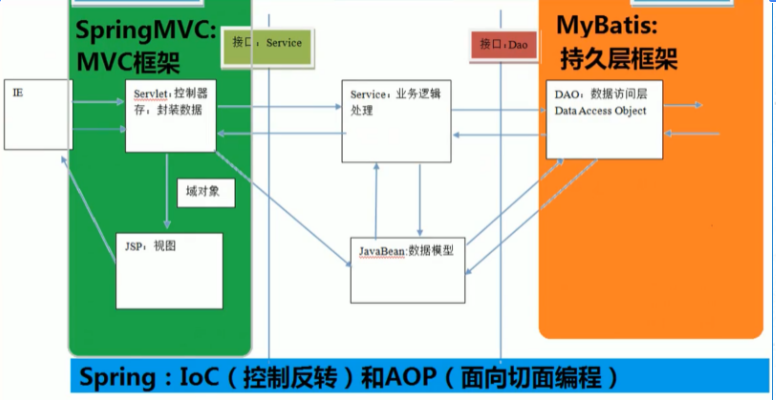

Spring 框架是一个分层架构，由 7 个定义良好的模块组成。Spring 模块构建在核心容器之上，核心容器定义了创建、配置和管理 bean 的方式 .

组成 Spring 框架的每个模块（或组件）都可以单独存在，或者与其他一个或多个模块联合实现。每个模块的功能如下：

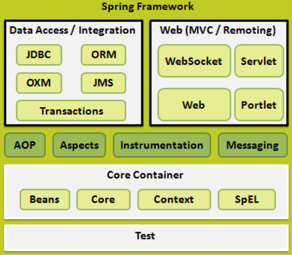

核心容器：核心容器提供 Spring 框架的基本功能。核心容器的主要组件是 BeanFactory，它是工厂模式的实现。BeanFactory 使用*控制反转*（IOC） 模式将应用程序的配置和依赖性规范与实际的应用程序代码分开。

Spring 上下文：Spring 上下文是一个配置文件，向 Spring 框架提供上下文信息。Spring 上下文包括企业服务，例如 JNDI、EJB、电子邮件、国际化、校验和调度功能。

Spring AOP：通过配置管理特性，Spring AOP 模块直接将面向切面的编程功能 , 集成到了 Spring 框架中。所以，可以很容易地使 Spring 框架管理任何支持 AOP的对象。Spring AOP 模块为基于 Spring 的应用程序中的对象提供了事务管理服务。通过使用 Spring AOP，不用依赖组件，就可以将声明性事务管理集成到应用程序中。

Spring DAO：JDBC DAO 抽象层提供了有意义的异常层次结构，可用该结构来管理异常处理和不同数据库供应商抛出的错误消息。异常层次结构简化了错误处理，并且极大地降低了需要编写的异常代码数量（例如打开和关闭连接）。Spring DAO 的面向 JDBC 的异常遵从通用的 DAO 异常层次结构。

Spring ORM：Spring 框架插入了若干个 ORM 框架，从而提供了 ORM 的对象关系工具，其中包括 JDO、Hibernate 和 iBatis SQL Map。所有这些都遵从 Spring 的通用事务和 DAO 异常层次结构。

Spring Web 模块：Web 上下文模块建立在应用程序上下文模块之上，为基于 Web 的应用程序提供了上下文。所以，Spring 框架支持与 Jakarta Struts 的集成。Web 模块还简化了处理多部分请求以及将请求参数绑定到域对象的工作。

Spring MVC 框架：MVC 框架是一个全功能的构建 Web 应用程序的 MVC 实现。通过策略接口，MVC 框架变成为高度可配置的，MVC 容纳了大量视图技术，其中包括 JSP、Velocity、Tiles、iText 和 POI。

## 4、拓展

Spring Boot与Spring Cloud

Spring Boot 是 Spring 的一套快速配置脚手架，可以基于Spring Boot 快速开发单个微服务;

Spring Cloud是基于Spring Boot实现的；

Spring Boot专注于快速、方便集成的单个微服务个体，Spring Cloud关注全局的服务治理框架；

Spring Boot使用了约束优于配置的理念，很多集成方案已经帮你选择好了，能不配置就不配置 , Spring Cloud很大的一部分是基于Spring Boot来实现，Spring Boot可以离开Spring Cloud独立使用开发项目，但是Spring Cloud离不开Spring Boot，属于依赖的关系。

SpringBoot在SpringClound中起到了承上启下的作用，如果你要学习SpringCloud必须要学习SpringBoot。

# 二、IOC理论推导

## 1、IoC基础

新建一个空白的maven项目

分析实现

我们先用我们原来的方式写一段代码 .

### 1、先写一个UserDao接口

```java
public interface UserDao {
   public void getUser();
}
```

### 2、再去写Dao的实现类

```java
public class UserDaoImpl implements UserDao {
   @Override
   public void getUser() {
       System.out.println("获取用户数据");
  }
}
```

### 3、然后去写UserService的接口

```java
public interface UserService {
   public void getUser();
}
```

### 4、最后写Service的实现类

```java
public class UserServiceImpl implements UserService {
   private UserDao userDao = new UserDaoImpl();

   @Override
   public void getUser() {
       userDao.getUser();
  }
}
```

### 5、测试一下       

```java
@Test
public void test(){
   UserService service = new UserServiceImpl();
   service.getUser();
}
```

这是我们原来的方式 , 开始大家也都是这么去写的对吧。 那我们现在修改一下。

把Userdao的实现类增加一个。

```java
public class UserDaoMySqlImpl implements UserDao {
   @Override
   public void getUser() {
       System.out.println("MySql获取用户数据");
  }
}
```

紧接着我们要去使用MySql的话 , 我们就需要去service实现类里面修改对应的实现

```java
public class UserServiceImpl implements UserService {
   private UserDao userDao = new UserDaoMySqlImpl();

   @Override
   public void getUser() {
       userDao.getUser();
  }
}
```

在假设, 我们再增加一个Userdao的实现类 .

```java
public class UserDaoOracleImpl implements UserDao {
   @Override
   public void getUser() {
       System.out.println("Oracle获取用户数据");
  }
}     
```

那么我们要使用Oracle , 又需要去service实现类里面修改对应的实现 . 假设我们的这种需求非常大 , 这种方式就根本不适用了, 甚至反人类对吧 , 每次变动 , 都需要修改大量代码 . 这种设计的耦合性太高了, 牵一发而动全身 .

那我们如何去解决呢 ? 

我们可以在需要用到他的地方 , 不去实现它 , 而是留出一个接口 , 利用set , 我们去代码里修改下 .

```java
public class UserServiceImpl implements UserService {
   private UserDao userDao;
// 利用set实现
   public void setUserDao(UserDao userDao) {
       this.userDao = userDao;
  }

   @Override
   public void getUser() {
       userDao.getUser();
  }
}
```

现在去我们的测试类里 , 进行测试 ;

```java
@Test
public void test(){
   UserServiceImpl service = new UserServiceImpl();
   service.setUserDao( new UserDaoMySqlImpl() );
   service.getUser();
   //那我们现在又想用Oracle去实现呢
   service.setUserDao( new UserDaoOracleImpl() );
   service.getUser();
}       
```

大家发现了区别没有 ? 可能很多人说没啥区别 . 但是同学们 , 他们已经发生了根本性的变化 , 很多地方都不一样了 . 仔细去思考一下 , 以前所有东西都是由程序去进行控制创建 , 而现在是由我们自行控制创建对象 , 把主动权交给了调用者 . 程序不用去管怎么创建,怎么实现了 . 它只负责提供一个接口 .

这种思想 , 从本质上解决了问题 , 我们程序员不再去管理对象的创建了 , 更多的去关注业务的实现 . 耦合性大大降低 . 这也就是IOC的原型 !

## 2、IOC本质

控制反转IoC(Inversion of Control)，是一种设计思想，DI(依赖注入)是实现IoC的一种方法，也有人认为DI只是IoC的另一种说法。没有IoC的程序中 , 我们使用面向对象编程 , 对象的创建与对象间的依赖关系完全硬编码在程序中，对象的创建由程序自己控制，控制反转后将对象的创建转移给第三方，个人认为所谓控制反转就是：获得依赖对象的方式反转了。

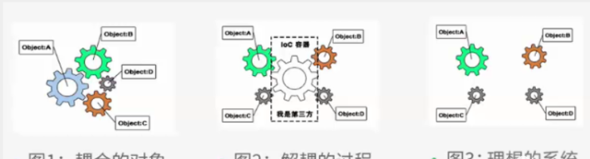

IoC是Spring框架的核心内容，使用多种方式完美的实现了IoC，可以使用XML配置，也可以使用注解，新版本的Spring也可以零配置实现IoC。

Spring容器在初始化时先读取配置文件，根据配置文件或元数据创建与组织对象存入容器中，程序使用时再从Ioc容器中取出需要的对象。

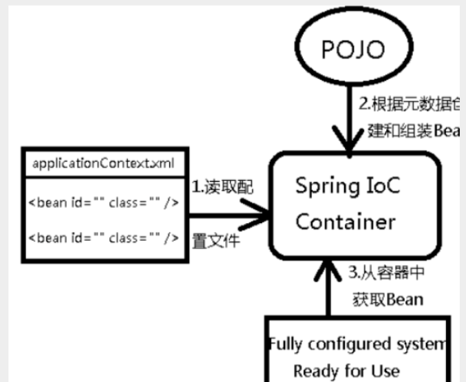

采用XML方式配置Bean的时候，Bean的定义信息是和实现分离的，而采用注解的方式可以把两者合为一体，Bean的定义信息直接以注解的形式定义在实现类中，从而达到了零配置的目的。

==控制反转是一种通过描述（XML或注解）并通过第三方去生产或获取特定对象的方式。在Spring中实现控制反转的是IoC容器，其实现方法是依赖注入（Dependency Injection,DI）。==

## 3、控制反转

在讨论控制反转之前，我们先来看看软件系统中耦合的对象。

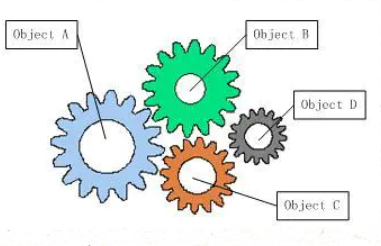

从图中可以看到，软件中的对象就像齿轮一样，协同工作，但是互相耦合，一个零件不能正常工作，整个系统就崩溃了。这是一个强耦合的系统。齿轮组中齿轮之间的啮合关系,与软件系统中对象之间的耦合关系非常相似。对象之间的耦合关系是无法避免的，也是必要的，这是协同工作的基础。现在，伴随着工业级应用的规模越来越庞大，对象之间的依赖关系也越来越复杂，经常会出现对象之间的多重依赖性关系，因此，架构师和设计师对于系统的分析和设计，将面临更大的挑战。对象之间耦合度过高的系统，必然会出现牵一发而动全身的情形。

为了解决对象间耦合度过高的问题，软件专家Michael Mattson提出了IoC理论，用来实现对象之间的“解耦”。

控制反转（Inversion of Control）是一种是面向对象编程中的一种设计原则，用来减低计算机代码之间的耦合度。其基本思想是：借助于“第三方”实现具有依赖关系的对象之间的解耦。

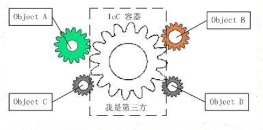

由于引进了中间位置的“第三方”，也就是IOC容器，使得A、B、C、D这4个对象没有了耦合关系，齿轮之间的传动全部依靠“第三方”了，全部对象的控制权全部上缴给“第三方”IOC容器，所以，IOC容器成了整个系统的关键核心，它起到了一种类似“粘合剂”的作用，把系统中的所有对象粘合在一起发挥作用，如果没有这个“粘合剂”，对象与对象之间会彼此失去联系，这就是有人把IOC容器比喻成“粘合剂”的由来。 我们再来看看，控制反转(IOC)到底为什么要起这么个名字？我们来对比一下：

1. 软件系统在没有引入IOC容器之前，如图1所示，对象A依赖于对象B，那么对象A在初始化或者运行到某一点的时候，自己必须主动去创建对象B或者使用已经创建的对象B。无论是创建还是使用对象B，控制权都在自己手上。
2. 软件系统在引入IOC容器之后，这种情形就完全改变了，如图2所示，由于IOC容器的加入，对象A与对象B之间失去了直接联系，所以，当对象A运行到需要对象B的时候，IOC容器会主动创建一个对象B注入到对象A需要的地方。 通过前后的对比，我们不难看出来：对象A获得依赖对象B的过程,由主动行为变为了被动行为，控制权颠倒过来了，这就是“控制反转”这个名称的由来。

控制反转不只是软件工程的理论，在生活中我们也有用到这种思想。再举一个现实生活的例子： 海尔公司作为一个电器制商需要把自己的商品分销到全国各地，但是发现，不同的分销渠道有不同的玩法，于是派出了各种销售代表玩不同的玩法，随着渠道越来越多，发现，每增加一个渠道就要新增一批人和一个新的流程，严重耦合并依赖各渠道商的玩法。实在受不了了，于是制定业务标准，开发分销信息化系统，只有符合这个标准的渠道商才能成为海尔的分销商。让各个渠道商反过来依赖自己标准。反转了控制，倒置了依赖。

我们把海尔和分销商当作软件对象，分销信息化系统当作IOC容器，可以发现，在没有IOC容器之前，分销商就像图1中的齿轮一样，增加一个齿轮就要增加多种依赖在其他齿轮上，势必导致系统越来越复杂。开发分销系统之后，所有分销商只依赖分销系统，就像图2显示那样，可以很方便的增加和删除齿轮上去。

## 4、依赖注入

依赖注入就是将实例变量传入到一个对象中去(Dependency injection means giving an object its instance variables)。

什么是依赖

如果在 Class A 中，有 Class B 的实例，则称 Class A 对 Class B 有一个依赖。例如下面类 Human 中用到一个 Father 对象，我们就说类 Human 对类 Father 有一个依赖。

​              

```java
public class Human {  
//    ...    Father father;    ...   
        public Human() {       
        father = new Father(); 
    } 
}               
```


仔细看这段代码我们会发现存在一些问题：

1. 如果现在要改变 father 生成方式，如需要用new Father(String name)初始化 father，需要修改 Human 代码；
2. 如果想测试不同 Father 对象对 Human 的影响很困难，因为 father 的初始化被写死在了 Human 的构造函数中；
3. 如果new Father()过程非常缓慢，单测时我们希望用已经初始化好的 father 对象 Mock 掉这个过程也很困难。

依赖注入

上面将依赖在构造函数中直接初始化是一种 Hard init 方式，弊端在于两个类不够独立，不方便测试。我们还有另外一种 Init 方式，如下

```java
public class Human {
    ...
    Father father;
    ...
    public Human(Father father) {
        this.father = father;
    }
}
```

上面代码中，我们将 father 对象作为构造函数的一个参数传入。在调用 Human 的构造方法之前外部就已经初始化好了 Father 对象。像这种非自己主动初始化依赖，而通过外部来传入依赖的方式，我们就称为依赖注入。 现在我们发现上面 1 中存在的两个问题都很好解决了，简单的说依赖注入主要有两个好处：

1. 解耦，将依赖之间解耦。
2. 因为已经解耦，所以方便做单元测试，尤其是 Mock 测试。

控制反转和依赖注入的关系

我们已经分别解释了控制反转和依赖注入的概念。有些人会把控制反转和依赖注入等同，但实际上它们有着本质上的不同。

- 控制反转
- 是一种思想
- 依赖注入
- 是一种设计模式

IoC框架使用依赖注入作为实现控制反转的方式，但是控制反转还有其他的实现方式，例如说[ServiceLocator](https://link.jianshu.com?t=http://martinfowler.com/articles/injection.html#UsingAServiceLocator)，所以不能将控制反转和依赖注入等同。

Spring中的依赖注入

上面我们提到，依赖注入是实现控制反转的一种方式。下面我们结合Spring的IoC容器，简单描述一下这个过程。

```java
class MovieLister...
    private MovieFinder finder;
    public void setFinder(MovieFinder finder) {
        this.finder = finder;
    }

class ColonMovieFinder...
    public void setFilename(String filename) {
        this.filename = filename;
    }

```

我们先定义两个类，可以看到都使用了依赖注入的方式，通过外部传入依赖，而不是自己创建依赖。那么问题来了，谁把依赖传给他们，也就是说谁负责创建finder，并且把finder传给MovieLister。答案是Spring的IoC容器。

要使用IoC容器，首先要进行配置。这里我们使用xml的配置，也可以通过代码注解方式配置。下面是spring.xml的内容

```xml
<beans>
    <bean id="MovieLister" class="spring.MovieLister">
        <property name="finder">
            <ref local="MovieFinder"/>
        </property>
    </bean>
    <bean id="MovieFinder" class="spring.ColonMovieFinder">
        <property name="filename">
            <value>movies1.txt</value>
        </property>
    </bean>
</beans>
```

在Spring中，每个bean代表一个对象的实例，默认是单例模式，即在程序的生命周期内，所有的对象都只有一个实例，进行重复使用。通过配置bean，IoC容器在启动的时候会根据配置生成bean实例。具体的配置语法参考Spring文档。这里只要知道IoC容器会根据配置创建MovieFinder，在运行的时候把MovieFinder赋值给MovieLister的finder属性，完成依赖注入的过程。

## 5、加载配置文件测试

下面给出测试代码

```java
public void testWithSpring() throws Exception {
    ApplicationContext ctx = new FileSystemXmlApplicationContext("spring.xml");//1
    MovieLister lister = (MovieLister) ctx.getBean("MovieLister");//2
    Movie[] movies = lister.moviesDirectedBy("Sergio Leone");
    assertEquals("Once Upon a Time in the West", movies[0].getTitle());
}

```

1. 根据配置生成ApplicationContext，即IoC容器。
2.  2. 从容器中获取MovieLister的实例。

总结

1. 控制反转是一种在软件工程中解耦合的思想，调用类只依赖接口，而不依赖具体的实现类，减少了耦合。控制权交给了容器，在运行的时候才由容器决定将具体的实现动态的“注入”到调用类的对象中。

2. 依赖注入是一种设计模式，可以作为控制反转的一种实现方式。依赖注入就是将实例变量传入到一个对象中去(Dependency injection means giving an object its instance variables)。

3. 通过IoC框架，类A依赖类B的强耦合关系可以在运行时通过容器建立，也就是说把创建B实例的工作移交给容器，类A只管使用就可以。

下面的是参考自知乎。

要了解控制反转( Inversion of Control ), 我觉得有必要先了解软件设计的一个重要思想：依赖倒置原则（Dependency Inversion Principle ）。

什么是依赖倒置原则？假设我们设计一辆汽车：先设计轮子，然后根据轮子大小设计底盘，接着根据底盘设计车身，最后根据车身设计好整个汽车。这里就出现了一个“依赖”关系：汽车依赖车身，车身依赖底盘，底盘依赖轮子。

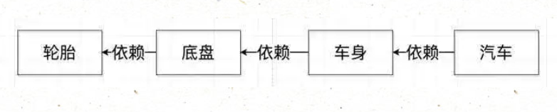

这样的设计看起来没问题，但是可维护性却很低。假设设计完工之后，上司却突然说根据市场需求的变动，要我们把车子的轮子设计都改大一码。这下我们就蛋疼了：因为我们是根据轮子的尺寸设计的底盘，轮子的尺寸一改，底盘的设计就得修改；同样因为我们是根据底盘设计的车身，那么车身也得改，同理汽车设计也得改——整个设计几乎都得改！

我们现在换一种思路。我们先设计汽车的大概样子，然后根据汽车的样子来设计车身，根据车身来设计底盘，最后根据底盘来设计轮子。这时候，依赖关系就倒置过来了：轮子依赖底盘， 底盘依赖车身， 车身依赖汽车。

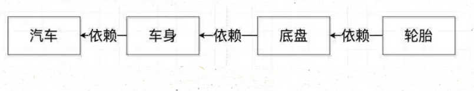

这时候，上司再说要改动轮子的设计，我们就只需要改动轮子的设计，而不需要动底盘，车身，汽车的设计了。

这就是依赖倒置原则——把原本的高层建筑依赖底层建筑“倒置”过来，变成底层建筑依赖高层建筑。高层建筑决定需要什么，底层去实现这样的需求，但是高层并不用管底层是怎么实现的。这样就不会出现前面的“牵一发动全身”的情况。

控制反转（Inversion of Control） 就是依赖倒置原则的一种代码设计的思路。具体采用的方法就是所谓的依赖注入（Dependency Injection）。其实这些概念初次接触都会感到云里雾里的。说穿了，这几种概念的关系大概如下：

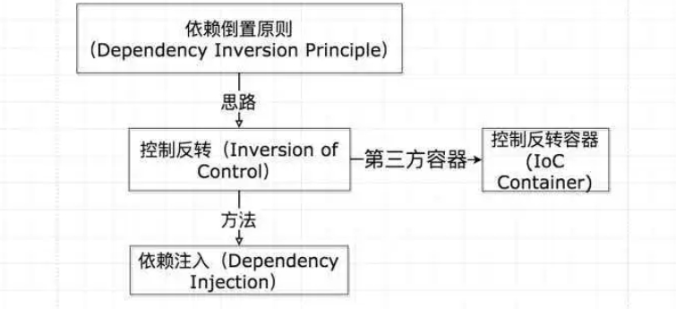

为了理解这几个概念，我们还是用上面汽车的例子。只不过这次换成代码。我们先定义四个Class，车，车身，底盘，轮胎。然后初始化这辆车，最后跑这辆车。代码结构如下：

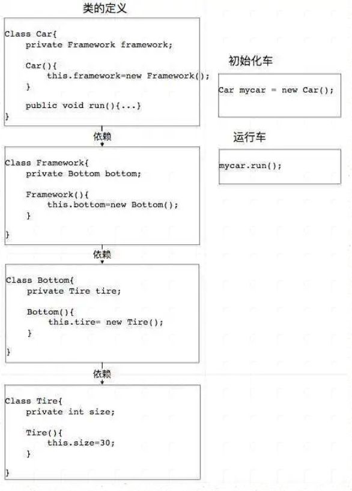

这样，就相当于上面第一个例子，上层建筑依赖下层建筑——每一个类的构造函数都直接调用了底层代码的构造函数。假设我们需要改动一下轮胎（Tire）类，把它的尺寸变成动态的，而不是一直都是30。我们需要这样改：

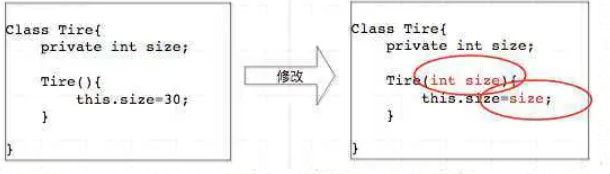

由于我们修改了轮胎的定义，为了让整个程序正常运行，我们需要做以下改动：

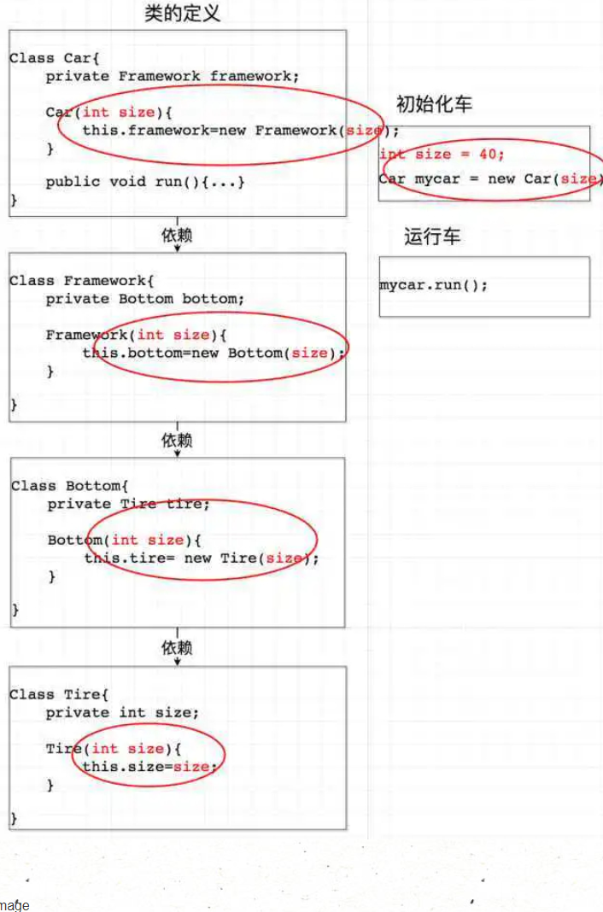

由此我们可以看到，仅仅是为了修改轮胎的构造函数，这种设计却需要修改整个上层所有类的构造函数！在软件工程中，这样的设计几乎是不可维护的——在实际工程项目中，有的类可能会是几千个类的底层，如果每次修改这个类，我们都要修改所有以它作为依赖的类，那软件的维护成本就太高了。

所以我们需要进行控制反转（IoC），及上层控制下层，而不是下层控制着上层。我们用依赖注入（Dependency Injection）这种方式来实现控制反转。所谓依赖注入，就是把底层类作为参数传入上层类，实现上层类对下层类的“控制”。这里我们用构造方法传递的依赖注入方式重新写车类的定义：

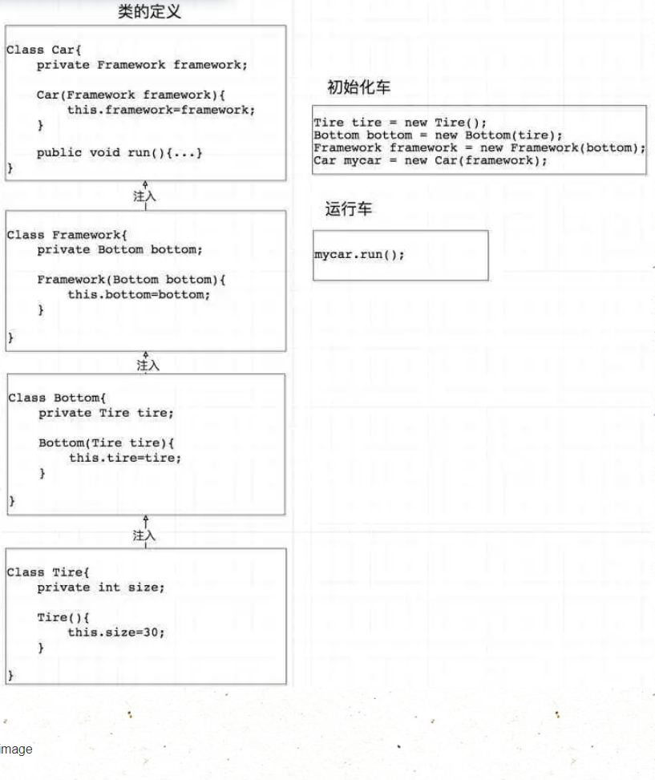

这里我们再把轮胎尺寸变成动态的，同样为了让整个系统顺利运行，我们需要做如下修改：

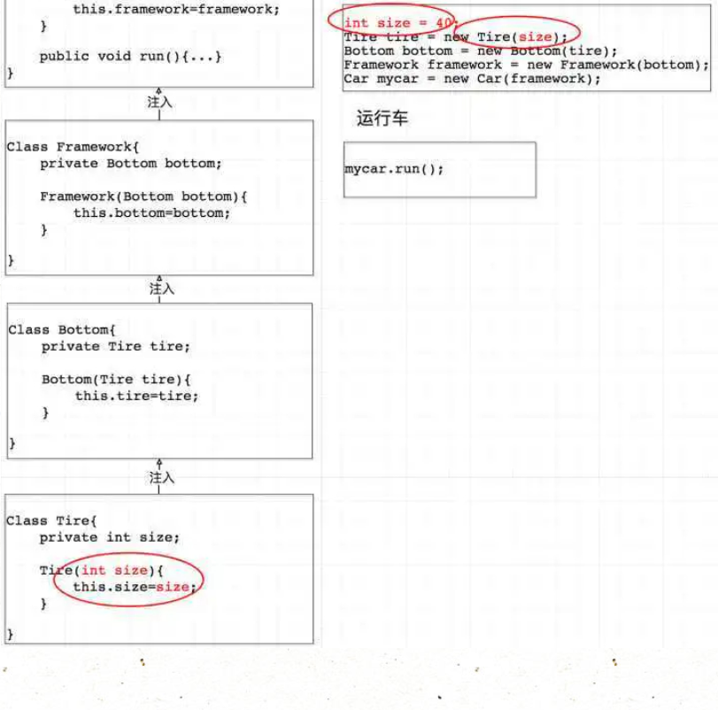

看到没？这里我只需要修改轮胎类就行了，不用修改其他任何上层类。这显然是更容易维护的代码。不仅如此，在实际的工程中，这种设计模式还有利于不同组的协同合作和单元测试：比如开发这四个类的分别是四个不同的组，那么只要定义好了接口，四个不同的组可以同时进行开发而不相互受限制；而对于单元测试，如果我们要写Car类的单元测试，就只需要Mock一下Framework类传入Car就行了，而不用把Framework, Bottom, Tire全部new一遍再来构造Car。

这里我们是采用的构造函数传入的方式进行的依赖注入。其实还有另外两种方法：Setter传递和接口传递。这里就不多讲了，核心思路都是一样的，都是为了实现控制反转。

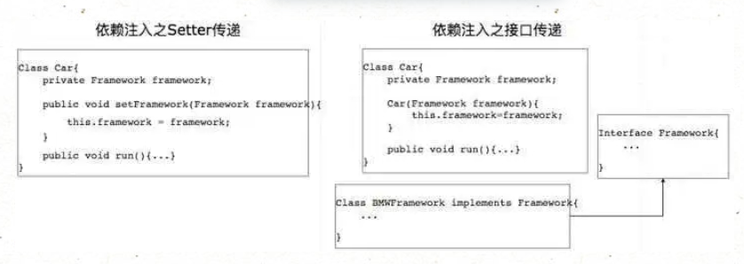

看到这里你应该能理解什么控制反转和依赖注入了。那什么是控制反转容器(IoC Container)呢？其实上面的例子中，对车类进行初始化的那段代码发生的地方，就是控制反转容器。

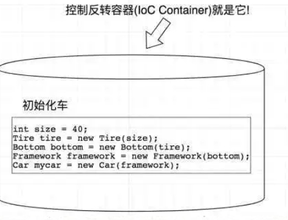

显然你也应该观察到了，因为采用了依赖注入，在初始化的过程中就不可避免的会写大量的new。这里IoC容器就解决了这个问题。这个容器可以自动对你的代码进行初始化，你只需要维护一个Configuration（可以是xml可以是一段代码），而不用每次初始化一辆车都要亲手去写那一大段初始化的代码。这是引入IoC Container的第一个好处。

IoC Container的第二个好处是：我们在创建实例的时候不需要了解其中的细节。在上面的例子中，我们自己手动创建一个车instance时候，是从底层往上层new的：


这个过程中，我们需要了解整个Car/Framework/Bottom/Tire类构造函数是怎么定义的，才能一步一步new/注入。

而IoC Container在进行这个工作的时候是反过来的，它先从最上层开始往下找依赖关系，到达最底层之后再往上一步一步new（有点像深度优先遍历）：

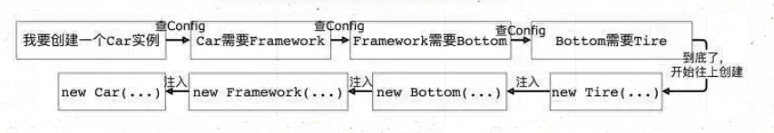

这里IoC Container可以直接隐藏具体的创建实例的细节，在我们来看它就像一个工厂：

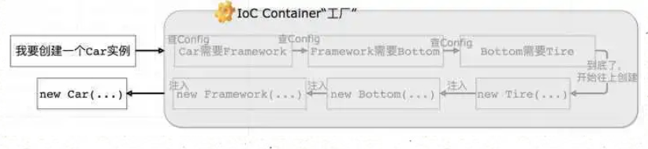

我们就像是工厂的客户。我们只需要向工厂请求一个Car实例，然后它就给我们按照Config创建了一个Car实例。我们完全不用管这个Car实例是怎么一步一步被创建出来。

实际项目中，有的Service Class可能是十年前写的，有几百个类作为它的底层。假设我们新写的一个API需要实例化这个Service，我们总不可能回头去搞清楚这几百个类的构造函数吧？IoC Container的这个特性就很完美的解决了这类问题——因为这个架构要求你在写class的时候需要写相应的Config文件，所以你要初始化很久以前的Service类的时候，前人都已经写好了Config文件，你直接在需要用的地方注入这个Service就可以了。这大大增加了项目的可维护性且降低了开发难度。

# 三、快速搭建

HelloSpring

## 1、导入Jar包

==注 : spring 需要导入commons-logging进行日志记录 . 我们利用maven , 他会自动下载对应的依赖项 .==

```xml
<dependency>
   <groupId>org.springframework</groupId>
   <artifactId>spring-webmvc</artifactId>
   <version>5.1.10.RELEASE</version>
</dependency>
```

## 2、编写代码

### 编写一个Hello实体类

```java
public class Hello {
   private String name;

   public String getName() {
       return name;
  }
   public void setName(String name) {
       this.name = name;
  }

   public void show(){
       System.out.println("Hello,"+ name );
  }
}
```

### 编写beans.xml

```xml
<?xml version="1.0" encoding="UTF-8"?>
<beans xmlns="http://www.springframework.org/schema/beans"
      xmlns:xsi="http://www.w3.org/2001/XMLSchema-instance"
      xsi:schemaLocation="http://www.springframework.org/schema/beans
       http://www.springframework.org/schema/beans/spring-beans.xsd">

   <!--bean就是java对象 , 由Spring创建和管理-->
   <bean id="hello" class="com.kuang.pojo.Hello">
       <property name="name" value="Spring"/>
   </bean>

</beans>
```

### 测试

ClassPathXmlApplicationContext加载文件

```java
@Test
public void test(){
   //解析beans.xml文件 , 生成管理相应的Bean对象
   ApplicationContext context = new ClassPathXmlApplicationContext("beans.xml");
   //getBean : 参数即为spring配置文件中bean的id .
   Hello hello = (Hello) context.getBean("hello");
   hello.show();
}          
```

思考

- Hello 对象是谁创建的 ?  【hello 对象是由Spring创建的
- Hello 对象的属性是怎么设置的 ?  hello 对象的属性是由Spring容器设置的

这个过程就叫控制反转 :

- 控制 : 谁来控制对象的创建 , 传统应用程序的对象是由程序本身控制创建的 , 使用Spring后 , 对象是由Spring来创建的
- 反转 : 程序本身不创建对象 , 而变成被动的接收对象 .

依赖注入 : 就是利用set方法来进行注入的.

 IOC是一种编程思想，由主动的编程变成被动的接收

可以通过newClassPathXmlApplicationContext去浏览一下底层源码 .

## 3、修改案例一

我们在案例一中， 新增一个Spring配置文件beans.xml

```java
<?xml version="1.0" encoding="UTF-8"?>
<beans xmlns="http://www.springframework.org/schema/beans"
      xmlns:xsi="http://www.w3.org/2001/XMLSchema-instance"
      xsi:schemaLocation="http://www.springframework.org/schema/beans
       http://www.springframework.org/schema/beans/spring-beans.xsd">

   <bean id="MysqlImpl" class="com.kuang.dao.impl.UserDaoMySqlImpl"/>
   <bean id="OracleImpl" class="com.kuang.dao.impl.UserDaoOracleImpl"/>

   <bean id="ServiceImpl" class="com.kuang.service.impl.UserServiceImpl">
       <!--注意: 这里的name并不是属性 , 而是set方法后面的那部分 , 首字母小写-->
       <!--引用另外一个bean , 不是用value 而是用 ref-->
       <property name="userDao" ref="OracleImpl"/>
   </bean>

</beans>
```

测试

```java
@Test
public void test2(){
   ApplicationContext context = new ClassPathXmlApplicationContext("beans.xml");
   UserServiceImpl serviceImpl = (UserServiceImpl) context.getBean("ServiceImpl");
   serviceImpl.getUser();
}
```

OK , 到了现在 , 我们彻底不用再程序中去改动了 , 要实现不同的操作 , 只需要在xml配置文件中进行修改 , 所谓的IoC,一句话搞定 : 对象由Spring 来创建 , 管理 , 装配 ! 

## 4、IOC创建对象方式

### 通过无参构造方法来创建

#### 1、User.java

```java
public class User {

   private String name;

   public User() {
       System.out.println("user无参构造方法");
  }

   public void setName(String name) {
       this.name = name;
  }

   public void show(){
       System.out.println("name="+ name );
  }

}
```

  

#### 2、beans.xml

```xml
<?xml version="1.0" encoding="UTF-8"?>
<beans xmlns="http://www.springframework.org/schema/beans"
      xmlns:xsi="http://www.w3.org/2001/XMLSchema-instance"
      xsi:schemaLocation="http://www.springframework.org/schema/beans
       http://www.springframework.org/schema/beans/spring-beans.xsd">

   <bean id="user" class="com.kuang.pojo.User">
       <property name="name" value="kuangshen"/>
   </bean>

</beans>
```

#### 3、测试类

```java
@Test
public void test(){
   ApplicationContext context = new ClassPathXmlApplicationContext("beans.xml");
   //在执行getBean的时候, user已经创建好了 , 通过无参构造
   User user = (User) context.getBean("user");
   //调用对象的方法 .
   user.show();
}
```

结果可以发现，在调用show方法之前，User对象已经通过无参构造初始化了！

### 通过有参构造方法来创建

#### 1、UserT . java

```java
public class UserT {

   private String name;

   public UserT(String name) {
       this.name = name;
  }

   public void setName(String name) {
       this.name = name;
  }

   public void show(){
       System.out.println("name="+ name );
  }

}
```

#### 2、beans.xml 有三种方式编写

```xml
<!-- 第一种根据index参数下标设置 -->
<bean id="userT" class="com.kuang.pojo.UserT">
   <!-- index指构造方法 , 下标从0开始 -->
   <constructor-arg index="0" value="kuangshen2"/>
</bean>
<!-- 第二种根据参数名字设置 -->
<bean id="userT" class="com.kuang.pojo.UserT">
   <!-- name指参数名 -->
   <constructor-arg name="name" value="kuangshen2"/>
</bean>
<!-- 第三种根据参数类型设置 -->
<bean id="userT" class="com.kuang.pojo.UserT">
   <constructor-arg type="java.lang.String" value="kuangshen2"/>
</bean>
```

#### 3、测试

```java
@Test
public void testT(){
   ApplicationContext context = new ClassPathXmlApplicationContext("beans.xml");
   UserT user = (UserT) context.getBean("userT");
   user.show();
}
```

结论：在配置文件加载的时候。其中管理的对象都已经初始化了！

## 5、Spring配置

### 别名

alias 设置别名 , 为bean设置别名 , 可以设置多个别名

```xml
<!--设置别名：在获取Bean的时候可以使用别名获取-->
<alias name="userT" alias="userNew"/>
Bean的配置
<!--bean就是java对象,由Spring创建和管理-->

<!--
   id 是bean的标识符,要唯一,如果没有配置id,name就是默认标识符
   如果配置id,又配置了name,那么name是别名
   name可以设置多个别名,可以用逗号,分号,空格隔开
   如果不配置id和name,可以根据applicationContext.getBean(.class)获取对象;

class是bean的全限定名=包名+类名
-->
<bean id="hello" name="hello2 h2,h3;h4" class="com.kuang.pojo.Hello">
   <property name="name" value="Spring"/>
</bean>
```

### import

团队的合作通过import来实现 .

```xml
<import resource="{path}/beans.xml"/>              
```

# 四、Spring IoC 容器

## 1、IoC 容器

Spring 容器是 Spring 框架的核心。容器将创建对象，把它们连接在一起，配置它们，并管理他们的整个生命周期从创建到销毁。Spring 容器使用依赖注入DI（dependency injection）来管理组成一个应用程序的组件。这些对象被称为 Spring Beans。

通过阅读配置元数据提供的指令，容器知道对哪些对象进行实例化，配置和组装。配置元数据可以通过 XML，Java 注释或 Java 代码来表示。下图是 Spring 如何工作的高级视图。 Spring IoC 容器利用 Java 的 POJO 类和配置元数据来生成完全配置和可执行的系统或应用程序。

IOC 容器IoC(Inversion of Control)具有依赖注入功能的容器，它可以创建对象，IOC 容器负责实例化、定位、配置应用程序中的对象及建立这些对象间的依赖。通常new一个实例，控制权由程序员控制，而"控制反转"是指new实例工作不由程序员来做而是交给Spring容器来做。在Spring中[BeanFactory](https://www.w3cschool.cn/wkspring/j3181mm3.html)是IOC容器的实际代表者。


| 1    | Spring BeanFactory 容器它是最简单的容器，给 DI 提供了基本的支持，它用 org.springframework.beans.factory.BeanFactory 接口来定义。BeanFactory 或者相关的接口，如 BeanFactoryAware，InitializingBean，DisposableBean，在 Spring 中仍然存在具有大量的与 Spring 整合的第三方框架的反向兼容性的目的。 |
| ---- | ------------------------------------------------------------ |
| 2    | Spring ApplicationContext 容器该容器添加了更多的企业特定的功能，例如从一个属性文件中解析文本信息的能力，发布应用程序事件给感兴趣的事件监听器的能力。该容器是由 org.springframework.context.ApplicationContext 接口定义。 |

## 2、Spring 的 BeanFactory 容器

这是一个最简单的容器，它主要的功能是为依赖注入 （DI） 提供支持，这个容器接口在 `org.springframework.beans.factory.BeanFactory`中被定义。`BeanFactory `和相关的接口，比如`BeanFactoryAware`、`DisposableBean`、`InitializingBean`，仍旧保留在 Spring 中，主要目的是向后兼容已经存在的和那些 Spring 整合在一起的第三方框架。

在 Spring 中，有大量对 `BeanFactory `接口的实现。其中，最常被使用的是 `XmlBeanFactory` 类。这个容器从一个 XML 文件中读取配置元数据，由这些元数据来生成一个被配置化的系统或者应用。

在资源宝贵的移动设备或者基于 `applet `的应用当中， `BeanFactory `会被优先选择。否则，一般使用的是 `ApplicationContext`，除非你有更好的理由选择 `BeanFactory`。

### 例子：

假设我们已经，按照下面的步骤，我们可以创建一个 Spring 应用程序。

| 步骤 | 描述                                                         |
| :--: | :----------------------------------------------------------- |
|  1   | 创建一个名为 *SpringExample* 的工程并在 src 文件夹下新建一个名为 *com.tutorialspoint* 文件夹。 |
|  2   | 点击右键，选择 *Add External JARs* 选项，导入 Spring 的库文件，正如我们在 *Spring Hello World Example* 章节中提到的导入方式。 |
|  3   | 在 *com.tutorialspoint* 文件夹下创建 *HelloWorld.java* 和 *MainApp.java* 两个类文件。 |
|  4   | 在 src 文件夹下创建 Bean 的配置文件 *Beans.xml*              |
|  5   | 最后的步骤是创建所有 Java 文件和 Bean 的配置文件的内容，按照如下所示步骤运行应用程序。 |

下面是文件 HelloWorld.java 的内容：

```java
package com.tutorialspoint;
public class HelloWorld {
   private String message;
   public void setMessage(String message){
    this.message  = message;
   }
   public void getMessage(){
    System.out.println("Your Message : " + message);
   }
}
```

下面是文件 MainApp.java 的内容：

```java
package com.tutorialspoint;
import org.springframework.beans.factory.InitializingBean;
import org.springframework.beans.factory.xml.XmlBeanFactory;
import org.springframework.core.io.ClassPathResource;
public class MainApp {
   public static void main(String[] args) {
      XmlBeanFactory factory = new XmlBeanFactory
                             (new ClassPathResource("Beans.xml"));
      HelloWorld obj = (HelloWorld) factory.getBean("helloWorld");
      obj.getMessage();
   }
}
```

在主程序当中，我们需要注意以下两点：

- 第一步利用框架提供的 XmlBeanFactory() API 去生成工厂 bean 以及利用 ClassPathResource() API 去加载在路径 CLASSPATH 下可用的 bean 配置文件。XmlBeanFactory() API 负责创建并初始化所有的对象，即在配置文件中提到的 bean。
- 第二步利用第一步生成的 bean 工厂对象的 getBean() 方法得到所需要的 bean。 这个方法通过配置文件中的 bean ID 来返回一个真正的对象，该对象最后可以用于实际的对象。一旦得到这个对象，你就可以利用这个对象来调用任何方法。

下面是配置文件 Beans.xml 中的内容：

```xml
<?xml version="1.0" encoding="UTF-8"?>
<beans xmlns="http://www.springframework.org/schema/beans"
    xmlns:xsi="http://www.w3.org/2001/XMLSchema-instance"
    xsi:schemaLocation="http://www.springframework.org/schema/beans
    http://www.springframework.org/schema/beans/spring-beans-3.0.xsd">

   <bean id="helloWorld" class="com.tutorialspoint.HelloWorld">
       <property name="message" value="Hello World!"/>
   </bean>

</beans>
```

如果你已经完成上面的内容，接下来，让我们运行这个应用程序。如果程序没有错误，你将从控制台看到以下信息：

```java
Your Message : Hello World!
```

## 3、Spring ApplicationContext 容器

Application Context 是 BeanFactory 的子接口，也被称为 Spring 上下文。

Application Context 是 spring 中较高级的容器。和 BeanFactory 类似，它可以加载配置文件中定义的 bean，将所有的 bean 集中在一起，当有请求的时候分配 bean。 另外，它增加了企业所需要的功能，比如，从属性文件中解析文本信息和将事件传递给所指定的监听器。这个容器在 `org.springframework.context.ApplicationContext interface` 接口中定义。

`ApplicationContext `包含 `BeanFactory `所有的功能，一般情况下，相对于 `BeanFactory`，`ApplicationContext `会更加优秀。当然，`BeanFactory `仍可以在轻量级应用中使用，比如移动设备或者基于 `applet `的应用程序。

最常被使用的 `ApplicationContext `接口实现：

- `FileSystemXmlApplicationContext`：该容器从 XML 文件中加载已被定义的 bean。在这里，你需要提供给构造器 XML 文件的完整路径。
- `ClassPathXmlApplicationContext`：该容器从 XML 文件中加载已被定义的 bean。在这里，你不需要提供 XML 文件的完整路径，只需正确配置 CLASSPATH 环境变量即可，因为，容器会从 CLASSPATH 中搜索 bean 配置文件。
- `WebXmlApplicationContext`：该容器会在一个 web 应用程序的范围内加载在 XML 文件中已被定义的 bean。

我们已经在 Spring Hello World Example章节中看到过 ClassPathXmlApplicationContext 容器，并且，在基于 spring 的 web 应用程序这个独立的章节中，我们讨论了很多关于 WebXmlApplicationContext。所以，接下来，让我们看一个关于 `FileSystemXmlApplicationContext `的例子。

### 例子:

假设我们已经，按照下面的步骤，我们可以创建一个 Spring 应用程序。

| 步骤 | 描述                                                         |
| ---- | ------------------------------------------------------------ |
| 1    | 创建一个名为 SpringExample 的工程， 在 src 下新建一个名为 com.tutorialspoint 的文件夹src |
| 2    | 点击右键，选择 Add External JARs 选项，导入 Spring 的库文件，正如我们在 Spring Hello World Example 章节中提到的导入方式。 |
| 3    | 在 com.tutorialspoint 文件夹下创建 HelloWorld.java 和 MainApp.java 两个类文件。 |
| 4    | 文件夹下创建 Bean 的配置文件 Beans.xml。                     |
| 5    | 最后的步骤是编辑所有 JAVA 文件的内容和 Bean 的配置文件,按照以前我们讲的那样去运行应用程序。 |

下面是文件 HelloWorld.java 的内容：

```java
package com.tutorialspoint;
public class HelloWorld {
   private String message;
   public void setMessage(String message){
      this.message  = message;
   }
   public void getMessage(){
      System.out.println("Your Message : " + message);
   }
}
```

下面是文件 MainApp.java 的内容：

```java
package com.tutorialspoint;
import org.springframework.context.ApplicationContext;
import org.springframework.context.support.FileSystemXmlApplicationContext;
public class MainApp {
   public static void main(String[] args) {
      ApplicationContext context = new FileSystemXmlApplicationContext
            ("C:/Users/ZARA/workspace/HelloSpring/src/Beans.xml");
      HelloWorld obj = (HelloWorld) context.getBean("helloWorld");
      obj.getMessage();
   }
}
```

在主程序当中，我们需要注意以下两点：

- 第一步生成工厂对象。加载完指定路径下 bean 配置文件后，利用框架提供的 FileSystemXmlApplicationContext API 去生成工厂 bean。FileSystemXmlApplicationContext 负责生成和初始化所有的对象，比如，所有在 XML bean 配置文件中的 bean。
- 第二步利用第一步生成的上下文中的 getBean() 方法得到所需要的 bean。 这个方法通过配置文件中的 bean ID 来返回一个真正的对象。一旦得到这个对象，就可以利用这个对象来调用任何方法。

下面是配置文件 Beans.xml 中的内容：

```java
<?xml version="1.0" encoding="UTF-8"?>
<beans xmlns="http://www.springframework.org/schema/beans"
    xmlns:xsi="http://www.w3.org/2001/XMLSchema-instance"
    xsi:schemaLocation="http://www.springframework.org/schema/beans
    http://www.springframework.org/schema/beans/spring-beans-3.0.xsd">

   <bean id="helloWorld" class="com.tutorialspoint.HelloWorld">
       <property name="message" value="Hello World!"/>
   </bean>

</beans>
```

如果你已经完成上面的内容，接下来，让我们运行这个应用程序。如果程序没有错误，你将从控制台看到以下信息：

```java
Your Message : Hello World!
```

