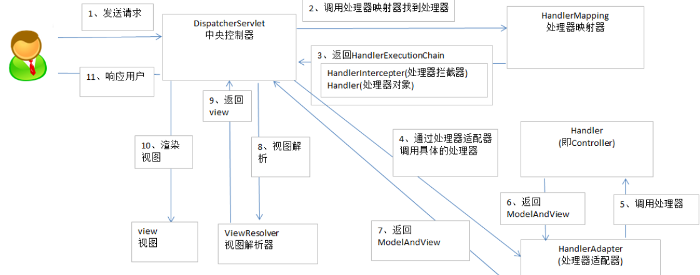
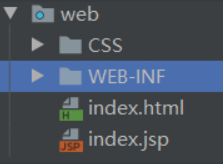
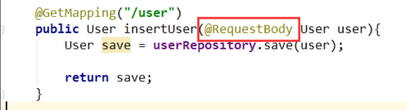
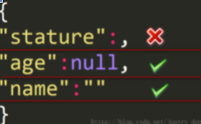
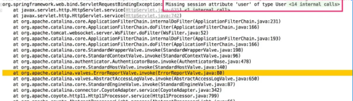
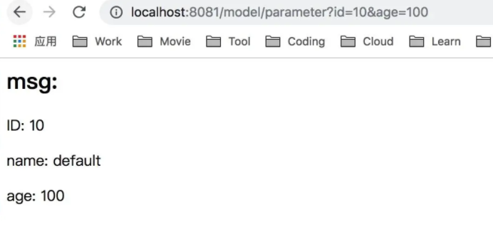
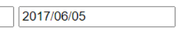
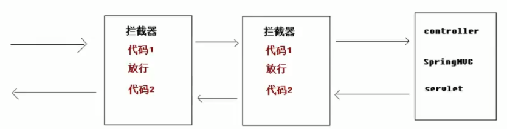
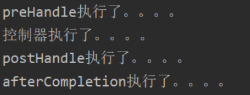
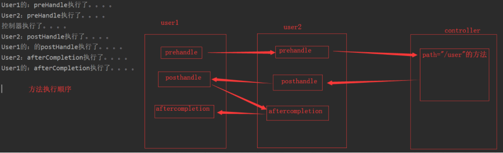

# 一、Spring MVC 框架概述

Spring web     MVC 框架提供了模型-视图-控制的体系结构和可以用来开发灵活、松散耦合的 web 应用程序的组件。MVC 模式导致了应用程序的不同方面(输入逻辑、业务逻辑和 UI 逻辑)的分离，同时提供了在这些元素之间的松散耦合。

- **模型**封装了应用程序数据，并且通常它们由 POJO 组成。
- **视图**主要用于呈现模型数据，并且通常它生成客户端的浏览器可以解释的 HTML 输出。
- **控制器**主要用于处理用户请求，并且构建合适的模型并将其传递到视图呈现。

## 1、DispatcherServlet

Spring Web 模型-视图-控制（MVC）框架是围绕 *DispatcherServlet* 设计的，*DispatcherServlet* 用来处理所有的 HTTP 请求和响应。Spring Web MVC *DispatcherServlet* 的请求处理的工作流程如下图所示：


下面是对应于 *DispatcherServlet* 传入 HTTP 请求的事件序列：

- 收到一个 HTTP 请求后，*DispatcherServlet* 根据 *HandlerMapping* 来选择并且调用适当的*控制器*。
- *控制器*接受请求，并基于使用的 GET 或 POST 方法来调用适当的 service 方法。Service 方法将设置基于定义的业务逻辑的模型数据，并返回视图名称到 *DispatcherServlet* 中。
- *DispatcherServlet* 会从 *ViewResolver* 获取帮助，为请求检取定义视图。
- 一旦确定视图，*DispatcherServlet* 将把模型数据传递给视图，最后呈现在浏览器中。

上面所提到的所有组件，即 HandlerMapping、Controller 和 ViewResolver 是 *WebApplicationContext* 的一部分，而 *WebApplicationContext* 是带有一些对 web 应用程序必要的额外特性的 *ApplicationContext* 的扩展。

## 2、需求的配置

你需要映射你想让 *DispatcherServlet* 处理的请求，通过使用在 **web.xml** 文件中的一个 URL 映射。下面是一个显式声明和映射 **HelloWeb** *DispatcherServlet* 的示例：


**web.xml** 文件将被保留在你的应用程序的 *WebContent/WEB-INF* 目录下。好的，在初始化 **HelloWeb** *DispatcherServlet* 时，该框架将尝试加载位于该应用程序的 *WebContent/WEB-INF* 目录中文件名为 `[servlet-name]-servlet.xml` 的应用程序内容。在这种情况下，我们的文件将是 **HelloWeb-servlet.xml**。

接下来，`servlet-mapping` 标签表明哪些 URLs 将被 DispatcherServlet 处理。这里所有以 **.jsp** 结束的 HTTP 请求将由 **HelloWeb** DispatcherServle t处理。

``

如果你不想使用默认文件名 `[servlet-name]-servlet.xml` 和默认位置 *WebContent/WEB-INF*，你可以通过在 web.xml 文件中添加 servlet 监听器 *ContextLoaderListener* 自定义该文件的名称和位置，如下所示：

```xml
<web-app...>

....
<context-param>
   <param-name>contextConfigLocation</param-name>
   <param-value>/WEB-INF/HelloWeb-servlet.xml</param-value>
</context-param>
<listener>
   <listener-class>
      org.springframework.web.context.ContextLoaderListener
   </listener-class>
</listener>
</web-app>
```

现在，检查 **HelloWeb-servlet.xml** 文件的请求配置，该文件位于 web 应用程序的 *WebContent/WEB-INF* 目录下：


```xml
<beans xmlns="http://www.springframework.org/schema/beans"
   xmlns:context="http://www.springframework.org/schema/context"
   xmlns:xsi="http://www.w3.org/2001/XMLSchema-instance"
   xsi:schemaLocation="
   http://www.springframework.org/schema/beans
   http://www.springframework.org/schema/beans/spring-beans-3.0.xsd
   http://www.springframework.org/schema/context 
   http://www.springframework.org/schema/context/spring-context-3.0.xsd">

   <context:component-scan base-package="com.tutorialspoint" />

   <bean class="org.springframework.web.servlet.view.InternalResourceViewResolver">
      <property name="prefix" value="/WEB-INF/jsp/" />
      <property name="suffix" value=".jsp" />
   </bean>

</beans>
```

尝试一下

以下是关于 **HelloWeb-servlet.xml** 文件的一些要点：

- `[servlet-name]-servlet.xml` 文件将用于创建 bean 定义，重新定义在全局范围内具有相同名称的任何已定义的 bean。
- ` <context:component-scan>`标签将用于激活 Spring MVC 注释扫描功能，该功能允许使用注释，如 @Controller 和 @RequestMapping 等等。
- *InternalResourceViewResolver* 将使用定义的规则来解决视图名称。按照上述定义的规则，一个名称为 **hello** 的逻辑视图将发送给位于 `/WEB-INF/jsp/hello.jsp` 中实现的视图。

下一节将向你展示如何创建实际的组件，例如控制器，模式和视图。

## 3、定义控制器

DispatcherServlet 发送请求到控制器中执行特定的功能。**@Controller** 注释表明一个特定类是一个控制器的作用。**@RequestMapping** 注释用于映射 URL 到整个类或一个特定的处理方法。


```java
@Controller
@RequestMapping("/hello")
public class HelloController{
   @RequestMapping(method = RequestMethod.GET)
   public String printHello(ModelMap model) {
      model.addAttribute("message", "Hello Spring MVC Framework!");
      return "hello";
   }
}
```

**@Controller** 注释定义该类作为一个 Spring MVC 控制器。在这里，第一次使用的 **@RequestMapping** 表明在该控制器中处理的所有方法都是相对于 **/hello** 路径的。下一个注释 **@RequestMapping(method = RequestMethod.GET)** 用于声明 *printHello()* 方法作为控制器的默认 service 方法来处理 HTTP GET 请求。你可以在相同的 URL 中定义其他方法来处理任何 POST 请求。

你可以用另一种形式来编写上面的控制器，你可以在 *@RequestMapping* 中添加额外的属性，如下所示：


```
@Controller
public class HelloController{
   @RequestMapping(value = "/hello", method = RequestMethod.GET)
   public String printHello(ModelMap model) {
      model.addAttribute("message", "Hello Spring MVC Framework!");
      return "hello";
   }
}
```

**值**属性表明 URL 映射到哪个处理方法，**方法**属性定义了 service 方法来处理 HTTP GET 请求。关于上面定义的控制器，这里有以下几个要注意的要点：

- 你将在一个 service 方法中定义需要的业务逻辑。你可以根据每次需求在这个方法中调用其他方法。
- 基于定义的业务逻辑，你将在这个**方法**中创建一个模型。你可以设置不同的模型属性，这些属性将被视图访问并显示最终的结果。这个示例创建了一个带有属性 “message” 的模型。
- 一个定义的 service 方法可以返回一个包含**视图**名称的字符串用于呈现该模型。这个示例返回 “hello” 作为逻辑视图的名称。

## 4、创建 JSP 视图

对于不同的表示技术，Spring MVC 支持许多类型的视图。这些包括 JSP、HTML、PDF、Excel 工作表、XML、Velocity 模板、XSLT、JSON、Atom 和 RSS 提要、JasperReports 等等。但我们最常使用利用 JSTL 编写的 JSP 模板。所以让我们在 /WEB-INF/hello/hello.jsp 中编写一个简单的 **hello** 视图：

```jsp
<html>
   <head>
   <title>Hello Spring MVC</title>
   </head>
   <body>
   <h2>${message}</h2>
   </body>
</html>
```

其中，**${message}** 是我们在控制器内部设置的属性。你可以在你的视图中有多个属性显示。

## 5、Spring Web MVC 框架例子

基于上述概念，让我们看看一些重要的例子来帮助你建立 Spring Web 应用程序：

| 序号 | 例子 & 描述                                                  |
| ---- | ------------------------------------------------------------ |
| 1    | [Spring MVC Hello World Example](https://www.w3cschool.cn/wkspring/21es1mmi.html)这个例子将解释如何编写一个简单的 Spring Web Hello World 应用程序。 |
| 2    | [Spring MVC Form Handling Example](https://www.w3cschool.cn/wkspring/v41f1mmk.html)这个例子将解释如何编写一个 Spring Web 应用程序，它使用 HTML 表单提交数据到控制器，并且显示处理结果。 |
| 3    | [Spring Page Redirection Example](https://www.w3cschool.cn/wkspring/pjt21mml.html)学习在 Spring MVC 框架中如何使用页面重定向功能。 |
| 4    | [Spring Static Pages Example](https://www.w3cschool.cn/wkspring/zlmb1mmo.html)学习在 Spring MVC 框架中如何访问静态页面和动态页面。 |
| 5    | [Spring Exception Handling Example](https://www.w3cschool.cn/wkspring/1hqc1mmr.html)学习在 Spring MVC 框架中如何处理异常。 |

## 6、SpringMVC流程图详解

要把SpringMVC流程图搞明白，首先需要先搞明白6个组件     

### DisPatcherServlet 前端控制器

核心。用户在浏览器输入url，发起请求，首先会到达DisPatcherServlet，由它来调用其他组件来配合工作的完成，DisPatcherServlet的存在大大降低了组件之间的耦合性 

### HandlerMapping 处理器映射器

记录url与处理器的映射，方式有注解、XML配置等 

### HandLer 处理器

后端控制器（通俗一点：Controller层所写的业务代码）。对用户的请求进行处理 

### HandlerAdapter 处理器适配器

通过HandlerAdapter对处理器进行执行，这是适配器模式的应用，通过扩展适配器可以对更多类型的处理器进行执行。（我也不太明白） 

### ViewResolver 视图解析器

ViewResolver负责解析view视图，并进行渲染（数据填充），将处理结果通过页面展示给用户看 

### View 视图

View是一个接口，实现类支持不同的View类型（jsp、freemarker、velocity） 

一般情况下需要通过页面标签或者页面模板技术将模型数据通过页面展示给用户，需要由程序员根据业务需求开发具体的页面。



### 流程说明

1.用户发送请求至 前端控制器DispatcherServlet。

2.前端控制器DispatcherServlet收到请求后调用处理器映射器HandlerMapping。

3.处理器映射器HandlerMapping根据请求的Url找到具体的处理器，生成处理器对象Handler及处理器拦截器HandlerIntercepter（如果有则生成）一并返回给前端控制器DispatcherServlet。

4.前端控制器DispatcherServlet通过处理器适配器HandlerAdapter调用处理器Controller。

5.执行处理器（Controller，也叫后端控制器）

6.处理器Controller执行完后返回ModelAnView。

7.处理器映射器HandlerAdapter将处理器Controller执行返回的结果ModelAndView返回给前端控制器DispatcherServlet。

8.前端控制器DispatcherServlet将ModelAnView传给视图解析器ViewResolver。

9.视图解析器ViewResolver解析后返回具体的视图View。

10.前端控制器DispatcherServlet对视图View进行渲染视图（即：将模型数据填充至视图中）

11.前端控制器DispatcherServlet响应用户。

## 7、SpringMVC与Struts2的主要区别？

①springmvc的入口是一个servlet即前端控制器，而struts2入口是一个filter过虑器。

②springmvc是基于方法开发，传递参数是通过方法形参，可以设计为单例或多例(建议单例)，struts2是基于类开发，传递参数是通过类的属性，只能设计为多例。 

③Struts采用值栈存储请求和响应的数据，通过OGNL存取数据， springmvc通过参数解析器是将request对象内容进行解析成方法形参，将响应数据和页面封装成ModelAndView对象，最后又将模型数据通过request对象传输到页面。 Jsp视图解析器默认使用jstl。

# 二、入门程序

## 1、导入依赖

```xml
<!-- https://mvnrepository.com/artifact/org.springframework/spring-webmvc -->
<dependency>
    <groupId>org.springframework</groupId>
    <artifactId>spring-webmvc</artifactId>
    <version>5.2.2.RELEASE</version>
</dependency>
```

​        

## 2、配置web.xml

### 配置DispatcherServlet

同时配置`springmvc.xml`配置文件

```xml
   <servlet>
<!--       所有请求都会经过DispatcherServlet-->
        <servlet-name>DispatcherServlet</servlet-name>
        <servlet-class>org.springframework.web.servlet.DispatcherServlet</servlet-class>
<!--        配置springmvc.xml配置文件-->
        <init-param>
            <param-name>contextConfigLocation</param-name>
            <param-value>classpath:springmvc.xml</param-value>
        </init-param>
    </servlet>
    <servlet-mapping>
        <servlet-name>DispatcherServlet</servlet-name>
        <url-pattern>/</url-pattern>
    </servlet-mapping>
```

###  配置编码

```xml
<filter>
    <filter-name>CharacterEncodingFilter</filter-name>
    <filter-class>org.springframework.web.filter.CharacterEncodingFilter</filter-class>
    <init-param>
        <param-name>encoding</param-name>
        <param-value>utf-8</param-value>
    </init-param>
</filter>
<filter-mapping>
    <filter-name>CharacterEncodingFilter</filter-name>
    <url-pattern>/*</url-pattern>
</filter-mapping>
```

注意：url-pattern中的/表示拦截所有请求       

```xml
<?xml version="1.0" encoding="UTF-8"?>
<beans xmlns="http://www.springframework.org/schema/beans"
       xmlns:mvc="http://www.springframework.org/schema/mvc"
       xmlns:context="http://www.springframework.org/schema/context"
       xmlns:xsi="http://www.w3.org/2001/XMLSchema-instance"
       xsi:schemaLocation="
       http://www.springframework.org/schema/mvc
       http://www.springframework.org/schema/mvc/spring-mvc.xsd
       http://www.springframework.org/schema/context
       http://www.springframework.org/schema/context/spring-context.xsd
       http://www.springframework.org/schema/beans
       http://www.springframework.org/schema/beans/spring-beans.xsd">
<!--    添加注解扫描，指定到要扫描到控制器的包-->
    <context:component-scan base-package="com.rj.mvc.controller"/>
<!--    视图解析器对象-->
    <bean id="InternalResourceViewResolver" class="org.springframework.web.servlet.view.InternalResourceViewResolver">
<!--    prefix表示前缀，suffix表示后缀，当传入名称时会拼接成：/WEB-INF/pages/xxx.jsp-->
        <property name="prefix" value="/WEB-INF/pages/"/>
        <property name="suffix" value=".jsp"/>
    </bean>
<!--    开启mvc注解支持-->
    <mvc:annotation-driven/>
</beans>
```

## 3、编写控制器

```java
package com.rj.mvc.controller;

import org.springframework.stereotype.Controller;
import org.springframework.web.bind.annotation.RequestMapping;
//控制器类
@Controller
public class HelloController {
//    RequestMapping作用是请求来后会执行此方法，path为配置访问路径
//    return默认返回success表示是会找到名称为success的view
    @RequestMapping(path = "/hello")
    public String say(){
        System.out.println("Hello MVC!!!");
        return "success";
    }
}
```

## 4、补充web.xml中的文件加载

此处通过监听器加载spring配置文件，使用类路径资源加载

```xml
<context-param>
   <param-name>contextConfigLocation</param-name>
   <param-value>classpath:applicationcontext.xml</param-value>
</context-param>
<listener>
   <listener-class>
      org.springframework.web.context.ContextLoaderListener
   </listener-class>
</listener>
```

## 5、静态资源访问处理

采用RESTful架构后，需要将web.xml中控制器拦截的请求设置为/，这样会将css,js等静态资源进行拦截，发送404错误。
解决方法：

```java
<mvc:resources/>
<mvc:resources mapping="请求URI" location="资源位置" />
<mvc:default-servlet-handler/>
<mvc:default-servlet-handler/> 
```

### 1.对于webapps目录下的静态资源



当使用springmvc时，会出现拦截静态资源的情况，该目录可以访问，所以可直接开启拦截即可

#### web.xml

```xml
<!--    配置静态页面访问-->
    <servlet-mapping>
        <servlet-name>default</servlet-name>
        <url-pattern>*.html</url-pattern>
    </servlet-mapping>
    <servlet-mapping>
        <servlet-name>default</servlet-name>
        <url-pattern>*.CSS</url-pattern>
    </servlet-mapping>
    <servlet-mapping>
        <servlet-name>default</servlet-name>
        <url-pattern>*.js</url-pattern>
    </servlet-mapping>
    <servlet-mapping>
        <servlet-name>default</servlet-name>
        <url-pattern>*.png</url-pattern>
    </servlet-mapping>
```

#### html或jsp引入路径

```html
<link href="CSS/index.css" rel="stylesheet" type="text/css">
```

#### ==注意==

```http
/CSS/index.css表示访问路径为：http://localhost:2118/CSS/index.css 无法访问到资源
CSS/index.css表示访问路径为：http://localhost:2118/webapps/CSS/index.css 指定了项目下的资源
```

### 2.对于WEB-INF目录下的静态资源

WEB-INF目录相对安全，用户无法直接访问，所以需要在springmvc的配置文件中添加映射

```xml
<?xml version="1.0" encoding="UTF-8"?>
<beans xmlns="http://www.springframework.org/schema/beans"
       xmlns:xsi="http://www.w3.org/2001/XMLSchema-instance"
       xmlns:mvc="http://www.springframework.org/schema/mvc"
       xmlns:context="http://www.springframework.org/schema/context"
       xsi:schemaLocation="
       http://www.springframework.org/schema/mvc
       http://www.springframework.org/schema/mvc/spring-mvc.xsd
       http://www.springframework.org/schema/context
       http://www.springframework.org/schema/context/spring-context.xsd
       http://www.springframework.org/schema/beans
       http://www.springframework.org/schema/beans/spring-beans.xsd">
<!--    开启扫描-->
    <context:component-scan base-package="com.rj.mvc02.controller"/>
<!--    视图解析器-->
    <bean id="InternalResourceViewResolver" class="org.springframework.web.servlet.view.InternalResourceViewResolver">
        <property name="prefix" value="/WEB-INF/Pages/"/>
        <property name="suffix" value=".jsp"/>
    </bean>
<!--    开启注解支持-->
    <mvc:annotation-driven/>
<!--    设置静态资源访问-->
    <mvc:resources location="/WEB-INF/CSS/" mapping="/CSS/**"/>
    <mvc:resources location="/WEB-INF/js/" mapping="/js/**"/>
</beans>
```

#### testVoid.jsp页面引入

```html
<link rel="stylesheet" type="text/css" href="CSS/index.css">
```

# 三、常用注解

## 1、@RequestMapping详解

@RequestMapping注解可以将HTTP请求映射给 controller来处理，包括返回视图页面的controller和Rest服务的controller。

@RequestMapping 可以添加到类或者方法上。

```java
@Controller
@RequestMapping(value = "/", method = RequestMethod.GET)
public class ContactController {

    @RequestMapping(value = "/", method = RequestMethod.GET)
    public String redirectToContactPage() {
        return  "redirect:contact";
    }

    @RequestMapping(value = "/admin", method = RequestMethod.GET)
    public String toAdminPage() {
        return "admin";
    }

    @RequestMapping(value = "/contact", method = RequestMethod.GET)
    public String toContactForOhersPage() {
        return "contact";
    }
}

```

在上面的例子中，@RequestMapping加在了类和方法上：

- 访问/的请求会被ContactController的redirectToContactPage()方法处理
- 访问/admin的请求会被ContactController的toAdminPage()方法处理

### @RequestMapping 映射多个URL

```java
@Controller
@RequestMapping("/")
public class ContactController {
 
    @RequestMapping(value={"", "/page", "page*","view/*"})
    String multipleMapping(){
        return "Hello";
    } 
}   
```

访问下列地址都会被ContactController的multipleMapping方法处理：

```
localhost:8080/
localhost:8080/page
localhost:8080/pagehello
localhost:8080/view/
localhost:8080/view/view1
```

###  Spring对RESTful的支持

HTTP请求有GET, POST, PUT， DELETE等，@RequestMapping可以处理特定的请求类型。相当于如下注解：

> - GetMapping
> - PostMapping
> - PutMapping
> - DeleteMapping

```java
@RequestMapping(value = "/{id}", method = RequestMethod.GET)
@RequestMapping(value = "/{id}", method = RequestMethod.POST)
@RequestMapping(value = "/{id}", method = RequestMethod.DELETE)   // 因为这个需要Ajax请求，所有返回的是个json
@ResponseBody
@RequestMapping(value = "/{id}", method = RequestMethod.PUT)
```

可以采用Ajax方式发送PUT和DELETE请求

```js
$.ajax( {  
    type : "DELETE",  
    url : "/spring_crud_restful/emp/deleteEmp/" + id,  
    dataType : "json",  
    success : function(data) {  
        alert(data);  
        location.href = "/spring_crud_restful/emp/listEmp/1";  
    }  
});
```


## 2、@RequestParam请求参数

使用@RequestParam可以将HTTP请求参数绑定到controller中方法的参数上，例如

```java
@Controller
@RequestMapping("/")
public class ContactController { 
    @RequestMapping(value="/hello")
    String sayHelloToUser(@RequestParam("username") String username){
        return "Hello " + username;
    }    
    @RequestMapping(value="/hi")
    String sayHiToUser(@RequestParam String username){
        return "Hello " + username;
    }
}
```

- 当访问localhost:8080/hello?username=ted时，值ted会绑定到参数username上，结果是Hello ted。
- 当HTTP请求参数和controller方法的参数名称相同时，可以省略，如sayHiToUser方法
- @RequestParam默认要求参数是必要的，通过设置@RequestParam(value = "username", required = false)设为可选，这样HTTP请求不带username参数也是可以访问到指定的方法。
- 当HTTP请求不带username参数时，还可以设置它的默认值，如@RequestParam(value = "username", defaultValue = "mattie")


##  3、@PathVariable映射URL

映射 URL 绑定的占位符

通过 @PathVariable 可以将 URL 中占位符参数绑定到控制器处理方法的入参中:URL 中的 {xxx} 占位符可以通过

@PathVariable("xxx") 绑定到操作方法的入参中。

一般与@RequestMapping(method = RequestMethod.GET)一起使用

和注解@PathVariable联合使用，可以解析HTTP请求中的动态URL。将URL中的地址作为参数接收使用

```java
@Controller
@RequestMapping("/")
public class ContactController {

      @RequestMapping(value = "/contacts/{contactname}", method = RequestMethod.GET)
      String getContactName(@PathVariable("contactname") String name){
        return "Contact name is " + name; 
      }
      
}
```

上面的例子中，访问`localhost:8080/contacts/ted`和`localhost:8080/contacts/mattie`都会被`ContactController`的`getContactName`方法处理，结果分别是`Contact name is ted`和`Contact name is mattie`。

动态URL也可以使用正则来匹配：

```java
@Controller
@RequestMapping("/")
public class ShopController {
      @RequestMapping(value = "/{id:[a-z]+}/{productname}", method = RequestMethod.GET)
      String getProductName(@PathVariable("productname") String productName){
        return "Product name is " + productName; 
      }      
}
```

上面的例子中，访问`localhost:8080/wears/shoes`和`localhost:8080/foods/bread`都会被`ShopController`的`getProductName`方法处理

但是访问`localhost:8080/101/fun`不会被处理。

==注意==； `@RequestParam`和`@PathVariable`的区别：

> @RequestParam解析URL中特定的**请求参数的值**；
>
> @PathVariable用来匹配URL路径的**规则和模式**。

## 4、@RequestBody

### 作用：

主要用来接收**前端传递给后端**的**json字符串中的数据的**(请求体中的数据的)；

### 要求：

GET方式无请求体，所以使用@RequestBody接收数据时，前端不能使用GET方式提交数据，而是用POST方式进行提交。

在后端的同一个接收方法里，@RequestBody与@RequestParam()可以同时使用，@RequestBody最多只能有一个，而@RequestParam()可以有多个。

简言之：

> 一个请求只有一个@RequestBody；
>
> 一个请求可以有多个@RequestParam。

 

同时使用@RequestParam（）和@RequestBody，@RequestParam( )指定的参数可以是普通元素、数组、集合、对象等等

即: @RequestBody 与@RequestParam()可以同时使用时，原SpringMVC接收参数的机制不变，

> **RequestBody 接收的是请求体里面的数据(**get是默认的请求体，post是提交表单需要的请求体**)**；
>
> **RequestParam接收的是key-value里面的参数**，所以它会被切面进行处理从而可以用普通元素、数组、集合、对象等接收)。

因此：如果参数时放在请求体中，传入后台的话，那么后台要用@RequestBody才能接收到

　　　　 否则就会在数据库中不能完成curd操作；　



如果不是放在 请求体中的话，那么后台接收前台传过来的参数时，要用@RequestParam来接收，或则形参前什么也不写也能接收。

### 参数前写了@RequestParam(xxx)

​    1、前端必须有对应的xxx名字才行(不管是否有值，可通过设置该注解的`required`属性来调节是否必须传)

​    2、如果没有xxx名的话，那么请求会出错，报400。

 

### 参数前不写@RequestParam(xxx)

　　1、前端是否有对应的xxx名字都行，如果有xxx名*的话，那么就会自动匹配*

　　2、没有的话，请求也能正确发送。

==注==：这里与feign消费服务时不同；feign消费服务时，如果参数前什么也不写，那么会被默认`@RequestBody`的。

如果后端参数是一个对象，且该参数前是以@RequestBody修饰的，那么前端传递json参数时，必须满足以下要求：

后端@RequestBody注解对应的类在将HTTP的输入流(含请求体)装配到目标类

(也就是：@RequestBody后面的类)时，会根据json字符串中的key来匹配对应实体类的属性，如果匹配一致且json中的该key对应的值符合）

(或者说：实体类的对应属性的类型要求时,会调用实体类的setter方法将值赋给该属性。)

> 　　1、json字符串中，如果value为 "" 的话（空串），后端对应属性如果是String类型的，那么接受到的就是 "" 
>
> 如果是后端属性的类型是Integer、Double等类型，那么接收到的就是null。
>
> 　　2、json字符串中，如果value为null的话，后端对应收到的就是null。
>
> 　　3、如果某个参数没有value的话，在传json字符串给后端时，要么干脆就不把该字段写到json字符串中；要么写value时， 必须有值，null 或""都行。

　　　 千万不能有类似"stature":，这样的写法，如:

​               

 

### 总结：

> 结论①：@JsonAlias注解，实现:json转模型时，使json中的特定key能转化为特定的模型属性;但是模型转json时，
>
> ​        对应的转换后的key仍然与属性名一致
>
> 结论②：@JsonProperty注解，实现：json转模型时，使json中的特定key能转化为指定的模型属性；同样的，模
>
> ​        型转json时，对应的转换后的key为指定的key
>
> 结论③：@JsonAlias注解需要依赖于setter、getter，而@JsonProperty注解不需要。
>
> 结论④：在不考虑上述两个注解的一般情况下，key与属性匹配时,默认大小写敏感。
>
> 结论⑤：有多个相同的key的json字符串中，转换为模型时，会以相同的几个key中，排在最后的那个key的值给模
>
> ​        型属性复制，因为setter会覆盖原来的值。见示例中的gender属性。
>
> 结论⑥：后端@RequestBody注解对应的类在将HTTP的输入流(含请求体)装配到目标类(即:@RequestBody后面
>
> ​        的类)时，会根据json字符串中的key来匹配对应实体类的属性，如果匹配一致且json中的该key对应的值
>
> ​        符合(或可转换为)实体类的对应属性的类型要求时，会调用实体类的setter方法将值赋给该属性。

## 5、@RequestHeader

　　请求头包含了若干个属性，服务器可据此获知客户端的信息，通过@RequestHeader即可将请求头中的属性值绑定到处理方法的入参中；

```java
/**
     * 用法同上篇@RequestParam
     * 作用：映射请求头信息
     * @param al
     * @return
 */
@RequestMapping("/testRequestHeader")
public String testRequestHeader(@RequestHeader(value="Accept-Language") String al){
    System.out.println("SpringMVCTest.testRequestHeader()："+al);
    return SUCCESS;
}
//結果
//SpringMVCTest.testRequestHeader()：zh-CN,zh;q=0.8,zh-TW;q=0.7,zh-HK;q=0.5,en-US;q=0.3,en;q=0.2
```

## 6、@ModelAttribute

在SpringMVC的Controller中使用@ModelAttribute时，其位置包括下面三种：

> - 应用在方法上
> - 应用在方法的参数上
> - 应用在方法上，并且方法也使用了@RequestMapping

**应用在方法上**

首先说明一下，被@ModelAttribute注解的方法会在Controller每个方法执行之前都执行，因此对于一个Controller中包含多个URL的时候，要谨慎使用。

**1）使用@ModelAttribute注解无返回值的方法**

```java
@Controller
@RequestMapping(value = "/modelattribute")
public class ModelAttributeController {

    @ModelAttribute
    public void myModel(@RequestParam(required = false) String abc, Model model) {
        model.addAttribute("attributeName", abc);
    }

    @RequestMapping(value = "/method")
    public String method() {
        return "method";
    }
}
```

==这个例子，在请求`/modelattribute/method?abc=aaa`后，会先执行`myModel`方法，然后接着执行`method`方法，参数`abc`的值被放到`Model`中后，接着被带到`method`方法中。==

当返回视图`/modelattribute/method`时，`Model`会被带到页面上，当然你在使用`@RequestParam`的时候可以使用`required`来指定参数是否是必须的。

如果把`myModel`和`method`合二为一，代码如下，这也是我们最常用的方法：

```java
@RequestMapping(value = "/method")
public String method(@RequestParam(required = false) String abc,Model model) {
    model.addAttribute("attributeName", abc);
    return "method";
} 
```

**2）使用@ModelAttribute注解带有返回值的方法**

```java
@ModelAttribute
public String myModel(@RequestParam(required = false) String abc) {
    return abc;
}

@ModelAttribute
public Student myModel(@RequestParam(required = false) String abc) {
    Student student = new Student(abc);
    return student;
}

@ModelAttribute
public int myModel(@RequestParam(required = false) int number) {
    return number;
}  
```

对于这种情况，返回值对象会被默认放到隐含的`Model`中，在`Model`中的`key`为**返回值首字母小写**，value为返回的值。

上面3种情况等同于：

```java
model.addAttribute("string", abc);
model.addAttribute("int", number);
model.addAttribute("student", student);
```

**在jsp页面使用**

`${int}`表达式时会报错：`javax.el.ELException: Failed to parse the expression [${int}]`

解决办法：

在tomcat的配置文件`conf/catalina.properties`添加配置`org.apache.el.parser.SKIP_IDENTIFIER_CHECK=true`

**自定义**

如果只能这样，未免太局限了，我们很难接受key为string、int、float等等这样的。

想自定义其实很简单，只需要给@ModelAttribute添加value属性即可，如下：

```java
@ModelAttribute(value = "num")
public int myModel(@RequestParam(required = false) int number) {
    return number;
}
```

这样就相当于`model.addAttribute("num", number);`。

**使用@ModelAttribute注解的参数**

```java
@Controller
@RequestMapping(value = "/modelattribute")
public class ModelAttributeParamController {

    @ModelAttribute(value = "attributeName")
    public String myModel(@RequestParam(required = false) String abc) {
        return abc;
    }

    @ModelAttribute
    public void myModel3(Model model) {
        model.addAttribute("name", "zong");
        model.addAttribute("age", 20);
    }

    @RequestMapping(value = "/param")
    public String param(@ModelAttribute("attributeName") String str,
                       @ModelAttribute("name") String str2,
                       @ModelAttribute("age") int str3) {
        return "param";
    }
}
```

从代码中可以看出，使用`@ModelAttribute`注解的参数，意思是从前面的`Model`中提取对应名称的属性。

**这里提及一下`@SessionAttributes`的使用：**

> - 如果在类上面使用了@SessionAttributes("attributeName")注解，而本类中恰巧存在attributeName，则会将attributeName放入到session作用域。
> - 如果在类上面使用了@SessionAttributes("attributeName")注解，SpringMVC会在执行方法之前，自动从session中读取key为attributeName的值，并注入到Model中。所以我们在方法的参数中使用ModelAttribute("attributeName")就会正常的从Model读取这个值，也就相当于获取了session中的值。
> - 使用了@SessionAttributes之后，Spring无法知道什么时候要清掉@SessionAttributes存进去的数据，如果要明确告知，也就是在方法中传入SessionStatus对象参数，并调用status.setComplete就可以了。

应用在方法上，并且方法上也使用了@RequestMapping

```java
@Controller
@RequestMapping(value = "/modelattribute")
public class ModelAttributeController {

    @RequestMapping(value = "/test")
    @ModelAttribute("name")
    public String test(@RequestParam(required = false) String name) {
        return name;
    }
}
```

这种情况下，返回值String（或者其他对象）就不再是视图了，而是放入到Model中的值，此时对应的页面就是@RequestMapping的值test。

如果类上有@RequestMapping，则视图路径还要加上类的@RequestMapping的值，本例中视图路径为modelattribute/test.jsp。

## 7、@SessionAttribues

session存储也是后端比较重要的一个知识点，面试的时候常常会拿来与cookie对比，还有一些分布式Session，单点登录等问题啊，不过使用Spring的时候，它已经给我们的Session做了很多方便的操作，其中就有`@SessionAttribues`和`@SessionAttribute`注解。

**简介**

@SessionAttributes用于在会话中存储Model的属性，一般作用在类的级别。像下面的代码，model的属性user会被存储到session中，因为@ModelAttribute与@SessionAttributes有相同的注解。

```java
@Controller
@SessionAttributes("user")
public class ModelController {

    @ModelAttribute("user")
    public User initUser(){
        User user = new User();
        user.setName("default");
        return user;
    }

}
```

@SessionAttribute是用于获取已经存储的session数据，并且作用在方法的层面上。

```java
   @RequestMapping("/session")
    public String session(@SessionAttribute("user") User user){
        // do something
        return "index";
    }
```

**实例**

这个时候，我们已经有能运行的项目了。接下来准备代码

准备java文件。先准备@SessionAttributes的文件，用于存储session

```java
@Controller
@RequestMapping("/model")
@SessionAttributes("user")
public class ModelController {

    @ModelAttribute("user")
    public User initUser(){
        User user = new User();
        user.setName("default");
        return user;
    }

    @RequestMapping("/parameter")
    public String parameter(@ModelAttribute("user") User user ) {

        return "index";
    }

}
```

准备@SessionAttribute的文件，用于检索session，以验证注解是否正确。

```java
@Controller
public class SessionController {
    @RequestMapping("/session")
    public String session(@SessionAttribute("user") User user, HttpServletRequest request){
        return "index";
    }
}
```

**进行测试**

不经过`@SessionAttributes`会直接报错

访问/session



先经过@SessionAttributes

访问/parameter



然后访问/session的url。这个地址，我们没有传递任何参数，可以看到从session中获取user对象成功了。

# 四、参数绑定

## 1、基础类型

原始类型：id必须要传，否则报错。

```java
@RequestMapping("/test")
@ResponseBody
public ResponseData test(int id) {}
```

包装类型：id可以不传，后台接受到null。

```java
@RequestMapping("/test")
@ResponseBody
public ResponseData test(Integer id) {}
```

## 2、list和set

### from表单

```html
<form action="${ctx}/test/test" method="post">
    <input type="text" name="ids">
    <input type="text" name="ids">
    <input type="text" name="ids">
    <input type="submit">
</form>
```

### ajax

```js
var data = [];
data.push(1);
data.push(2);
data.push(3);
$.ajax({
    url: ctx + "/test/test",
    traditional:true,//必要
    data: {ids: data},
    success: function (result) {
        alert(result);
    }
})
```

### 控制器

```java
@RequestMapping("/test")
@ResponseBody
public ResponseData test(@RequestParam List<Integer>ids) {}
```

## 3、数组

同理使用list中的前台页面，后台接收如下：

```java
@RequestMapping("/test")
@ResponseBody
public ResponseData test(Integer[]ids) {
}
```

## 4、map集合

表单

```html
<form action="${ctx}/test/test" method="post">
    <input type="text" name="name">
    <input type="text" name="sex">
    <input type="submit">
</form>
```

ajax

```java
var data = {name:"zhangsan",sex:"man"};
$.ajax({
    url: ctx + "/test/test",
    data:data,
    success: function (result) {
        alert(result);
    }
});
```

控制器

```java
@RequestMapping("/test")
@ResponseBody
public ResponseData test(@RequestParam Map<String,String> params) {}
```

## 5、数据转换为对象

前台中name值要与javabean中的字段名相同，否则获取不到

```html
<form action="${ctx}/test/test" method="post">
    <input type="text" name="name">
    <input type="text" name="sex">
    <input type="submit">
</form>
```

后台控制器

```java
@RequestMapping("/test")
@ResponseBody
public ResponseData test(User user) {}
```

java bean

```java
public class User{
    private String name;
    private String sex;
    //get and set ...
}
```

## 6、pojo包含引用类型

from

```html
<form action="test" method="post">
    <input type="text" name="account" value="admin">
    <input type="password" name="pass" value="123">
    <input type="text" name="user.name" value="张三">
    <input type="text" name="user.age" value="23">
    <input type="submit">
</form>         
```

后台

```java
@Controller
public class TestController {
    @RequestMapping(path = "/test")
    public String test(Account account, HttpServletRequest request){
        try {
            request.setCharacterEncoding("UTF-8");
        } catch (UnsupportedEncodingException e) {
            e.printStackTrace();
        }
        System.out.println(account);
        System.out.println("Hello");
        return "success";
    }
}
```

java bean中声明引用的对象，并设置get、set方法

```java
public class Account {
    private String account;
    private String pass;
    private User user;
    //省略get、set方法
    }
```

```java
public class User {
    private String name;
    private String age;
    //省略get、set方法
    }
```


## 7、pojo包含list

前台form

```html
<form action="${ctx}/test/test" method="post">
    <input type="text" name="userName" value="zhangsan">
    <input type="text" name="sex" value="123">
    <input type="text" name="posts[0].code" value="232"/>
    <input type="text" name="posts[0].name" value="ad"/>
    <input type="text" name="posts[1].code" value="ad"/>
    <input type="text" name="posts[1].name" value="232"/>
    <input type="submit">
</form>
```

ajax

```js
var user={userName:"zhangsan",password:"123"};
user['posts[0].name']="ada";
user['posts[0].code']="ada";
user['posts[1].name']="ad";
user['posts[1].code']="ad2323a";
$.ajax({
    url: ctx + "/test/test",
    type:"post",
    contentType: "application/x-www-form-urlencoded",
    data:user,
    success: function (result) {
        alert(result);
    }
});
```

后台

```java
public class User{
    private String name;
    private String sex;
    private List<Post> posts;
    //get and set ...
}     
```

```java
public class Post {
    private String code;
    private String name;
    //get and set ...
}
```

```java
@RequestMapping("/test")
@ResponseBody
public ResponseData test(User user) {}
```

## 8、date时间类型

### 使用注解方式

#### 绑定单个方法

对于传递参数为Date类型，可以在参数前添加@DateTimeFormat注解。如下：

```java
@RequestMapping("/test")
public void test(@DateTimeFormat(pattern="yyyy-MM-dd HH:mm:ss") Date date){}
```

如果传递过来的是对象，可以在对象属性上添加注解。

```java
@RequestMapping("/test")
public void test(Person person){}

Public class Person{
    @DateTimeFormat(pattern="yyyy-MM-dd HH:mm:ss")
    Private Date date;
    Private String name;
}  
```

#### 绑定整个controller的所有方法：

```java
@Controller
public class FormController {

    @InitBinder
    public void initBinder(WebDataBinder binder) {
        SimpleDateFormat dateFormat = new SimpleDateFormat("yyyy-MM-dd");
        dateFormat.setLenient(false);
        binder.registerCustomEditor(Date.class, new CustomDateEditor(dateFormat, false));
    }
}
```

```java
@Controller
public class FormController {
   @InitBinder
    protected void initBinder(WebDataBinder binder) {
        binder.addCustomFormatter(new DateFormatter("yyyy-MM-dd"));
    }
}
```

### 通过实现Converter转换

前台字符串格式为（除开此格式会报错）



此格式可以自动转换为日期类型        

```
 date=Mon Jun 05 00:00:00 CST 2017              
```

如果要使用其他格式可以自定义其格式转换（原始格式会失效）

#### 实现接口converter

```java
public class StringToDateConverter implements Converter<String, Date> {
    public Date convert(String s) {
        DateFormat df = new SimpleDateFormat("yyyy-MM-dd");
        Date date = null;
        try {
            date= df.parse(s);
        } catch (ParseException e) {
            e.printStackTrace();
        }
        return date;
    }
}
```

**springmvc.xml配置**

```java
<!--    配置自定义日期-->
    <bean id="ConversionServiceFactoryBean" class="org.springframework.context.support.ConversionServiceFactoryBean">
        <property name="converters">
            <set>
        <bean class="com.rj.mvc.utils.StringToDateConverter"/>
            </set>
        </property>
    </bean>
    <!--    开启mvc注解支持-->
    <mvc:annotation-driven conversion-service="ConversionServiceFactoryBean"/>
```

## 9、枚举类型

mvc配置文件添加：

```xml
 <!--枚举类型转化器-->
    <bean id="formattingConversionService"
          class="org.springframework.format.support.FormattingConversionServiceFactoryBean">
        <property name="converters">
            <set>
                <bean class="org.springframework.core.convert.support.StringToEnumConverterFactory"/>
            </set>
        </property>
    </bean>
```

### 参考：

[Spring Boot绑定枚举类型参数](https://blog.csdn.net/u014527058/article/details/62883573)

[Spring MVC 自动为对象注入枚举类型](https://www.cnblogs.com/lonelywolfmoutain/p/4198608.html)

## 10、json格式对象

**后台**

```java
@RequestMapping(value = "introductionData.do", method = {RequestMethod.POST})
@ResponseBody
public RestResult introductionData(@RequestBody SignData signData) {
}
```

```java
public class SignData {
    private ApplicationInformation applicationInformation;
    private ApplyUserInformation applyUserInformation;
    private StudentInformation studentInformation;
    private List<VolunteerItem> volunteerItems;
    private ResidencePermit residencePermit;
    private List<Family> families;
    //get and set ...
}
```

**前台**

```js
var data = {}
var applyUserInformation = {
    "applyName": APPLYNAME,
    "applyCardType": "0",
    "applyCardID": APPLYIDCARD,
    "applyMobile": APPLYMOBILE
};
var applicationInformation = {
    "live_address": nowaddress,
    "addressJZArea": addressJZArea,
    "schoolLevel": schoolLevel,
    "schoolType": schoolType,
    "applyName": APPLYNAME,
    "contacts": contacts,
    "contactNumber": contactNumber
};
var studentInformation = {
    "cardType": cardType,
    "cardID": cardID,
    "studentName": studentName,
    "studentType": studentType,
    "studentType1": studentSpecialCase,
    "isDisability": "0",
    "studentCategory": "0",
    "birthday":birthday,
    "graduationschool":SchoolName,
    "graduationclass":classNameinfo,
    "applyName": APPLYNAME
};
data["applyUserInformation"] = applyUserInformation;
data["applicationInformation"] = applicationInformation;
data["studentInformation"] = studentInformation;

$.ajax({
    url: ctx + '/overseasData.do',
    type: "post",
    data: JSON.stringify(data),
    contentType: "application/json;charset=utf-8",
    success: function (result) {}
})
```

# 五、乱码问题

springmvc提供了在web.xml中配置filter来解决乱码问题

```xml
<!--    配置中文乱码字符集-->
    <filter>
        <filter-name>characterEncodingFilter</filter-name>
        <filter-class>org.springframework.web.filter.CharacterEncodingFilter</filter-class>
        <init-param>
            <param-name>encoding</param-name>
            <param-value>UTF-8</param-value>
        </init-param>
    </filter>
    <filter-mapping>
        <filter-name>characterEncodingFilter</filter-name>
        <url-pattern>/*</url-pattern>
    </filter-mapping>
```

**CharacterEncodingFilter类**

```java
public class CharacterEncodingFilter extends OncePerRequestFilter {
    @Nullable
    private String encoding;//表示设置的字符编码名，可通过init-param进行配置
    private boolean forceRequestEncoding;
    private boolean forceResponseEncoding;
    。。。
```

# 六、Spring MVC响应方式

## 1、响应请求方式

| **序号** | **方式**                                | **说明**                               |
| -------- | --------------------------------------- | -------------------------------------- |
| 1        | 不响应                                  | 方法返回值为void                       |
| 2        | ModelAndView                            | 通过setViewModel实现                   |
| 3        | 直接响应页面                            | 通过String返回值，直接返回响应跳转地址 |
| 4        | 重定向                                  | 跳转地址前添加 redirect:  实现重定向   |
| 5        | HttpServletRequest和HttpServletResponse | 通过原生servlet的api进行跳转           |

## 2、环境配置

### web.xml

```xml
<?xml version="1.0" encoding="UTF-8"?>
<web-app xmlns="http://xmlns.jcp.org/xml/ns/javaee"
         xmlns:xsi="http://www.w3.org/2001/XMLSchema-instance"
         xsi:schemaLocation="http://xmlns.jcp.org/xml/ns/javaee http://xmlns.jcp.org/xml/ns/javaee/web-app_4_0.xsd"
         version="4.0">
<!--    配置欢迎页面-->
    <welcome-file-list>
        <welcome-file>index.html</welcome-file>
    </welcome-file-list>
<!--    配置DispatcherServlet-->
    <servlet>
        <servlet-name>DispatcherServlet</servlet-name>
        <servlet-class>org.springframework.web.servlet.DispatcherServlet</servlet-class>
        <init-param>
            <param-name>contextConfigLocation</param-name>
            <param-value>classpath:springmvc.xml</param-value>
        </init-param>
        <load-on-startup>1</load-on-startup>
    </servlet>
    <servlet-mapping>
        <servlet-name>DispatcherServlet</servlet-name>
        <url-pattern>/</url-pattern>
    </servlet-mapping>
<!--    配置静态页面访问-->
    <servlet-mapping>
        <servlet-name>default</servlet-name>
        <url-pattern>*.html</url-pattern>
    </servlet-mapping>
<!--    配置解决中文乱码-->
    <filter>
        <filter-name>characterEncodingFilter</filter-name>
        <filter-class>org.springframework.web.filter.CharacterEncodingFilter</filter-class>
        <init-param>
            <param-name>encoding</param-name>
            <param-value>UTF-8</param-value>
        </init-param>
    </filter>
    <filter-mapping>
        <filter-name>characterEncodingFilter</filter-name>
        <url-pattern>/*</url-pattern>
    </filter-mapping>
</web-app>
```

### springmvc.xml

```xml
<?xml version="1.0" encoding="UTF-8"?>
<beans xmlns="http://www.springframework.org/schema/beans"
       xmlns:xsi="http://www.w3.org/2001/XMLSchema-instance"
       xmlns:mvc="http://www.springframework.org/schema/mvc"
       xmlns:context="http://www.springframework.org/schema/context"
       xsi:schemaLocation="
       http://www.springframework.org/schema/mvc
       http://www.springframework.org/schema/mvc/spring-mvc.xsd
       http://www.springframework.org/schema/context
       http://www.springframework.org/schema/context/spring-context.xsd
       http://www.springframework.org/schema/beans
       http://www.springframework.org/schema/beans/spring-beans.xsd">
<!--    开启扫描-->
    <context:component-scan base-package="com.rj.mvc02.controller"/>
<!--    视图解析器-->
    <bean id="InternalResourceViewResolver" class="org.springframework.web.servlet.view.InternalResourceViewResolver">
        <property name="prefix" value="/WEB-INF/Pages/"/>
        <property name="suffix" value=".jsp"/>
    </bean>
<!--    开启注解支持-->
    <mvc:annotation-driven/>
<!--    设置静态资源-->
    <mvc:resources location="/WEB-INF/CSS/" mapping="/CSS/**"/>
</beans>
```

## 3、返回值为void

```
@Controller
public class RespController {
    @RequestMapping(path = "/testVoid")//无返回值且未加@ResponseBody则会通过视图解析器寻找testVoid.jsp页面
    @ResponseBody  //加上@ResponseBody注解则表明不进行视图跳转
    public void test(){
        System.out.println("无响应。。。");
    }
}
```

无返回值时当用户访问 /testVoid 如果没有添加@ResponseBody	视图解析器会自动寻找路径为/testVoid.jsp文件，如果没有该文件则会报404错误。在controller中我们会用@ResponseBody注解来表明要不要进行视图跳转，只要不进行视图跳转就得@ResponseBody注解

## 4、ModelAndView

```java
    @RequestMapping(path = "/testModelAndView")
    public ModelAndView test1(){
        ModelAndView view = new ModelAndView();
        view.setViewName("testModelAndView");//通过视图解析器寻找testModelAndView.jsp
//        view.setViewName("redirect:index.jsp");
//        若想跳转根目录的页面则加上redirect：
        return view;
    }
```

## 5、通过String直接响应页面

```java
    @RequestMapping(path = "testString")
    public String test2(){
        return "testString";//通过视图解析器寻找testString.jsp
//        return "redirect:index.jsp";
//        若想跳转根目录的页面则加上redirect：
    }
```

## 6、通过前缀重定向和转发

```java
    @RequestMapping(path = "testString")
    public String test2(){
        return "redirect:index.jsp";//重定向到根目录
        //return "forward:/WEB-INF/Pages/testString.jsp";
    }
```

## 7、通过原生的Servlet的API进行跳转

如果需要使用setvlet原生api则直接在方法声明形参即可使用（注意导入servlet包）

```java
@RequestMapping(path = "/testServlet")
public void testServlet(HttpServletRequest request, HttpServletResponse response) throws IOException {
    response.sendRedirect("index.jsp");
}
```

```html
<body>
    <a href="testVoid" >html测试Void</a><br>
    <a href="testModelAndView" >testModelAndView测试</a><br>
    <a href="testString" >testString测试</a><br>
    <a href="testRedirect" >testRedirect测试</a><br>
    <a href="testServlet" >testServlet测试</a><br>
</body>
```

# 七、异常处理

## 1、自定义异常消息类

```java
public class SysException extends Exception {
    private  String msg;
    public SysException( String msg) {
        this.msg = msg;
    }
    public String getMsg() {
        return msg;
    }
    public void setMsg(String msg) {
        this.msg = msg;
    }
}
```

## 2、实现HandlerExceptionResolver接口

```java
public class SysHandlerExceptionResolver implements HandlerExceptionResolver {
    public ModelAndView resolveException(HttpServletRequest httpServletRequest, HttpServletResponse httpServletResponse, Object o, Exception ex) {
//        获取异常处理
        SysException sysException=null;
        if (ex instanceof SysException){
            sysException = (SysException)ex;
        }else {
            sysException = new SysException("系统出现问题，此异常不是SysException");
        }
        ModelAndView modelAndView = new ModelAndView();
        modelAndView.addObject("msg",sysException.getMsg());
        modelAndView.setViewName("error");
        return modelAndView;
    }
}
```

## 3、在配置文件中添加bean

```xml
<bean id="SysHandlerExceptionResolver" class="com.rj.mvc07.exception.SysHandlerExceptionResolver">
</bean>
```

## 4、编写一个异常

当异常发生时，让程序抛出自定义异常。该异常会被实现HandlerExceptionResolver 接口的方法捕获

```java
@Controller
public class UserController {
    @RequestMapping(path = "/testException")
    public String testException() throws Exception{
        System.out.println("进入异常处理。。。。");
        try {
            int i= 10/0;
        }catch (Exception e) {
            //控制台打印异常
            e.printStackTrace();
            //抛出自定义异常
            throw new SysException("抛出了自定义异常！！！！！！！");
        }
        return "success";
    }
}
```

前台

```html
<a href="testException" >异常处理</a>
```

# 八、拦截器



## 1、单个拦截器

```java
@Controller
public class InterceptorController {
    @RequestMapping(path = "/user")
    public String User(){
        System.out.println("控制器执行了。。。。");
        return "success";
    }
}
```

实现`HandlerInterceptor`接口，重写方法

```java
public class UserInterceptor implements HandlerInterceptor {
    public boolean preHandle(HttpServletRequest request, HttpServletResponse response, Object handler) throws Exception {
        System.out.println("preHandle执行了。。。。");
//        return返回true表示放行
        return true;
    }
    
    public void postHandle(HttpServletRequest request, HttpServletResponse response, Object handler, ModelAndView modelAndView) throws Exception {
        System.out.println("postHandle执行了。。。。");
    }
    
    public void afterCompletion(HttpServletRequest request, HttpServletResponse response, Object handler, Exception ex) throws Exception {
        System.out.println("afterCompletion执行了。。。。");
    }
}
```

以上类中包含三个方法分别是preHandle、postHandle与afterCompletion

他们的执行时机如下：

### preHandle

> 调用时间 ：Controller方法处理之前
>
> 执行顺序 ：链式Intercepter情况下，Intercepter按照声明的顺序一个接一个执行
>
> 若返回false ，则中断执行，注意：不会进入afterCompletion

### postHandle 

> 调用前提 ：preHandle返回true
>
> 调用时间 ：Controller方法处理完之后，DispatcherServlet进行视图的渲染之前，也就是说在这个方法中你可以对ModelAndView进行操作
>
> 执行顺序 ：链式Intercepter情况下，Intercepter按照声明的顺序倒着执行。
>
> 备注：postHandle虽然post打头，但post、get方法都能处理

### afterCompletion 

> 调用前提 ：preHandle返回true
>
> 调用时间 ：DispatcherServlet进行视图的渲染之后
>
> 多用于清理资源

==注意：interceptors可配置多个拦截器，拦截器执行顺序按照配置的拦截器顺序由上到下执行==

```xml
<!--    配置拦截器-->
    <mvc:interceptors>
        <mvc:interceptor>
<!--            配置要拦截的方法-->
            <mvc:mapping path="/user"/>
<!--            <mvc:exclude-mapping path=""/>配置不要拦截的方法-->
<!--            配置拦截器-->
            <bean class="com.rj.interceptor.intercep.UserInterceptor"/>
        </mvc:interceptor>
    </mvc:interceptors>
```

执行结果：



## 2、配置多个拦截器

### User1Interceptor

```java
public class User1Interceptor implements HandlerInterceptor {
    public boolean preHandle(HttpServletRequest request, HttpServletResponse response, Object handler) throws Exception {
        System.out.println("User1的：preHandle执行了。。。。");
//        return返回true表示放行
        return true;
    }
    
    public void postHandle(HttpServletRequest request, HttpServletResponse response, Object handler, ModelAndView modelAndView) throws Exception {
        System.out.println("User1的：的postHandle执行了。。。。");
    }
    
    public void afterCompletion(HttpServletRequest request, HttpServletResponse response, Object handler, Exception ex) throws Exception {
        System.out.println("User1的：afterCompletion执行了。。。。");
    }
}
```

### User2Interceptor

```java
public class User2Interceptor implements HandlerInterceptor {
    public boolean preHandle(HttpServletRequest request, HttpServletResponse response, Object handler) throws Exception {
        System.out.println("User2：preHandle执行了。。。。");
//        return返回true表示放行
        return true;
    }
    
    public void postHandle(HttpServletRequest request, HttpServletResponse response, Object handler, ModelAndView modelAndView) throws Exception {
        System.out.println("User2：postHandle执行了。。。。");
    }
    
    public void afterCompletion(HttpServletRequest request, HttpServletResponse response, Object handler, Exception ex) throws Exception {
        System.out.println("User2：afterCompletion执行了。。。。");
    }
}
```

### 配置文件

```xml
	<!--    配置拦截器-->
<mvc:interceptors>
    <mvc:interceptor>
        <!--            配置要拦截的方法-->
        <mvc:mapping path="/user"/>
        <!--            <mvc:exclude-mapping path=""/>配置不要拦截的方法-->
        <!--            配置拦截器-->
        <bean class="com.rj.interceptor.intercep.User1Interceptor"/>
    </mvc:interceptor>
<!--        配置第二个拦截器-->
    <mvc:interceptor>
        <mvc:mapping path="/user"/>
        <bean class="com.rj.interceptor.intercep.User2Interceptor"/>
    </mvc:interceptor>
</mvc:interceptors>
```

### 执行结果



