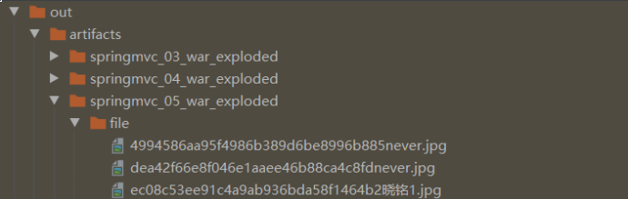
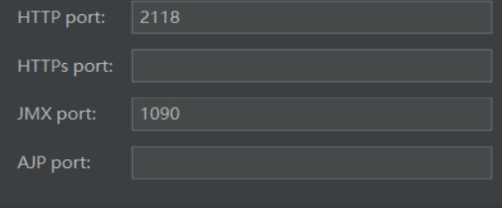
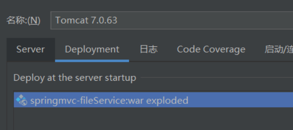
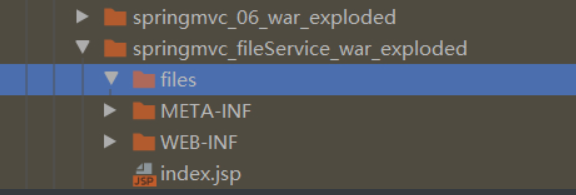
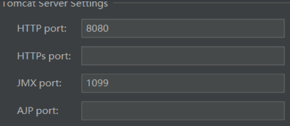
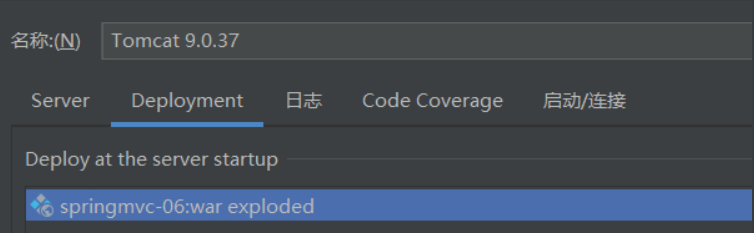

# 一、传统方式上传下载

使用fileupload组件进行

## 1、导入依赖

```xml
<!--        文件上传-->
<!-- https://mvnrepository.com/artifact/commons-fileupload/commons-fileupload -->
<dependency>
    <groupId>commons-fileupload</groupId>
    <artifactId>commons-fileupload</artifactId>
    <version>1.4</version>
</dependency>
<!-- https://mvnrepository.com/artifact/commons-io/commons-io -->
<dependency>
    <groupId>commons-io</groupId>
    <artifactId>commons-io</artifactId>
    <version>2.7</version>
</dependency>
```

## 2、文件上传

### 前台

上传文件必须使用`enctype="multipart/form-data"`

```html
<form action="fileUpLoad" enctype="multipart/form-data" method="post">
     <input type="text" name="name"><br>
     <input type="password" name="pow"><br>
     <input type="file" name="file1"><br>
     <input type="file" name="file2"><br>
     <input type="file" name="file3"><br>
     <input type="file" name="file4"><br>
     <input type="submit" value="上传">
</form>
```

### 控制器

```java
@RequestMapping(path = "/fileUpLoad",method = RequestMethod.POST)
public String fileUpLoad(HttpServletRequest request){
    System.out.println("fileupload上传！！");
    //        设置保存路径
    String realPath = request.getSession().getServletContext().getRealPath("/file/");
    System.out.println(realPath);
    //        判断文件或目录是否存在
    File file = new File(realPath);
    if (!file.exists()){
        //            创建文件夹
        file.mkdirs();
        System.out.println("创建文件成功！！！");
    }
    //        创建工厂
    DiskFileItemFactory fileItemFactory = new DiskFileItemFactory();
    //        创建解析器（解析request对象）
    ServletFileUpload servletFileUpload = new ServletFileUpload(fileItemFactory);
    //        使用解析器解析request对象,获取文件集合
    List<FileItem> fileItems = null;
    try {
        fileItems = servletFileUpload.parseRequest(request);
        //        遍历
        for (FileItem fileItem : fileItems) {
            //            判断是否是普通表单项
            if (fileItem.isFormField()){
                System.out.println("不是文件");
            }else {
                //                获取文件名
                String name = fileItem.getName();
                System.out.println(name);
                //                获取唯一码，防止文件重名
                String uuid = UUID.randomUUID().toString().replaceAll("-", "");
                //                判断文件是否为空
                if (name== null||name.isEmpty()) {
                    continue;
                }
                //                将文件写入指定路径
                fileItem.write(new File(realPath,uuid+name));
                //                获取文件类型
                System.out.println(fileItem.getContentType());
                //                获取文件大小
                System.out.println(fileItem.getSize());
            }
        }
    } catch (Exception e) {
        e.printStackTrace();
    }
    return "success";
}
```




## 3、文件下载

### 前台

```html
<a href="downLoad?fileName=4994586aa95f4986b389d6be8996b885never.jpg">下载1</a>
```

### 控制器

```java
@RequestMapping(path = "/downLoad")
public void downLoad(String fileName,HttpServletRequest req,HttpServletResponse resp) {
    if (fileName != null) {
        //            获取下载路径
        String realPath = req.getSession().getServletContext().getRealPath("/file/");
        //            创建虚拟文件路径(下载的文件)
        File file = new File(realPath,fileName);
        //            创建输出流
        OutputStream outputStream=null;
        //            判断文件是否存在
        if (file.exists()){
            //                设置下载完毕后不打开文件
            resp.setContentType("application/force-download");
            //                设置文件名
            resp.setHeader("Content-Disposition", "attachment;filename="+fileName);
            try {
                outputStream = resp.getOutputStream();
                //使用工具类，写入输出流
                outputStream.write(FileUtils.readFileToByteArray(file));
                outputStream.flush();
            } catch (IOException e) {
                e.printStackTrace();
            }finally{
                if(outputStream != null){
                    try {
                        outputStream.close();
                    } catch (IOException e) {
                        e.printStackTrace();
                    }
                }
            }
        }
    }
}
```

# 二、SpringMVC文件上传下载

使用fileupload组件进行

## 1、导入依赖

```xml
<!--        文件上传-->
<!-- https://mvnrepository.com/artifact/commons-fileupload/commons-fileupload -->
<dependency>
    <groupId>commons-fileupload</groupId>
    <artifactId>commons-fileupload</artifactId>
    <version>1.4</version>
</dependency>
<!-- https://mvnrepository.com/artifact/commons-io/commons-io -->
<dependency>
    <groupId>commons-io</groupId>
    <artifactId>commons-io</artifactId>
    <version>2.7</version>
</dependency>

```

## 2、配置文件解析器

==注意：此处配置文件解析器时，id必须为multipartResolver，包括大小写必须一致，否则报错==

```xml
<!--    配置文件解析器对象-->
    <bean id="multipartResolver" class="org.springframework.web.multipart.commons.CommonsMultipartResolver">
        <!-- 限制文件上传总大小，不设置默认没有限制，单位为字节 200*1024*1024即200M -->
        <property name="maxUploadSize" value="209715200" />
        <!-- 设置每个上传文件的大小上限 -->
        <property name="maxUploadSizePerFile" value="1048576"/>
        <!-- 处理文件名中文乱码 -->
        <property name="defaultEncoding" value="UTF-8" />
        <!-- resolveLazily属性启用是为了推迟文件解析，以便捕获文件大小异常 -->
        <property name="resolveLazily" value="true" />
    </bean>
```

## 3、上传文件

### 前台代码

```html
<form action="mvcFileUpLoad" enctype="multipart/form-data" method="post">
     <input type="text" name="name"><br>
     <input type="password" name="pow"><br>
     <input type="file" name="file"><br>
     <input type="file" name="file"><br>
     <input type="file" name="file"><br>
     <input type="file" name="file"><br>
     <input type="submit" value="上传">
</form>
```

### 控制器

mvc方式省略了手动解析request

```java
@RequestMapping(path = "/mvcFileUpLoad",method = RequestMethod.POST)
public String mvcFileUpLoad(HttpServletRequest request,MultipartHttpServletRequest multiRequest){
    System.out.println("mvcFileUpLoad上传！！");
    //另一种遍历方式，这时候要求前端文件表单的name值都为file,如果是单个文件可直接使用MultipartFile接受参数
    List<MultipartFile> files = multiRequest.getFiles("file");
    //设置保存路径
    String realPath = request.getSession().getServletContext().getRealPath("/file/");
    System.out.println(realPath);
    //判断文件或目录是否存在
    File file = new File(realPath);
    if (!file.exists()){
        //创建文件夹
        file.mkdirs();
        System.out.println("创建文件成功！！！");
    }
    if(files != null && !files.isEmpty()){
        for (MultipartFile multipartFile : files) {
            //获取文件名
            String name = multipartFile.getOriginalFilename();
            System.out.println(name);
            //判断文件明是否为null或者为空，如是则跳出本次循环
            if (name==null||name.isEmpty()){
                continue;
            }
            //    获取唯一码，防止文件重名
            String uuid = UUID.randomUUID().toString().replaceAll("-", "");
            //将文件写入指定路径
            try {
                multipartFile.transferTo(new File(realPath,uuid+name));
            } catch (IOException e) {
                e.printStackTrace();
            }
            //                获取文件类型
            System.out.println(multipartFile.getContentType());
            //                获取文件大小
            System.out.println(multipartFile.getSize());
        }
    }
    return "success";
}
```

## 4、下载文件

### 前台

```html
<a href="mvcDownLoad?fileName=60b6e7d683c5407c8605013ea4670803never.jpg">下载2</a>
```

### 控制器

```java
@RequestMapping(path = "/mvcDownLoad")
public void mvcDownLoad(String fileName,HttpServletRequest req,HttpServletResponse resp) {
    if (fileName != null) {
        //            获取下载路径
        String realPath = req.getSession().getServletContext().getRealPath("/file/");
        //            创建虚拟文件路径(下载的文件)
        File file = new File(realPath,fileName);
        //            创建输出流
        OutputStream outputStream=null;
        //            判断文件是否存在
        if (file.exists()){
            //                设置下载完毕后不打开文件
            resp.setContentType("application/force-download");
            //                设置文件名
            resp.setHeader("Content-Disposition", "attachment;filename="+fileName);
            try {
                outputStream = resp.getOutputStream();
                //使用工具类，写入输出流
                outputStream.write(FileUtils.readFileToByteArray(file));
                outputStream.flush();
            } catch (IOException e) {
                e.printStackTrace();
            }finally{
                if(outputStream != null){
                    try {
                        outputStream.close();
                    } catch (IOException e) {
                        e.printStackTrace();
                    }
                }
            }
        }
    }
}
```


# 三、跨服务器上传

## 1、环境搭建

由于本机测试，所以需要配置两个Tomcat，但两个端口号应不同，此处我配置如下：

tomcat7作为文件服务器

### **配置端口**



### **设置tomcat7可写入**

tomcat服务器默认是不可写操作，只允许读，所以在Tomcat文件夹下找到conf下的web.xml文件并向文件的servlet标签内加入

```xml
<init-param>    
    <param-name>readonly</param-name>
    <param-value>false</param-value>
</init-param>              
```

**部署项目**



**手动创建保存文件目录**



tomcat9作为上传服务器

**配置端口**



**部署项目**



**上传文件**

**项目结构**


### **pom.xml**

==导入springmvc支持包和跨服务器支持包==

```xml
<!-- https://mvnrepository.com/artifact/org.springframework/spring-webmvc -->
        <dependency>
            <groupId>org.springframework</groupId>
            <artifactId>spring-webmvc</artifactId>
            <version>5.2.2.RELEASE</version>
        </dependency>
        <dependency>
            <groupId>javax.servlet</groupId>
            <artifactId>javax.servlet-api</artifactId>
            <version>4.0.1</version>
        </dependency>
<!--        导入跨服务器上传文件包-->
        <dependency>
            <groupId>com.sun.jersey</groupId>
            <artifactId>jersey-client</artifactId>
            <version>1.19.4</version>
        </dependency>
        <dependency>
            <groupId>com.sun.jersey</groupId>
            <artifactId>jersey-core</artifactId>
            <version>1.19.4</version>
        </dependency>
<!--        文件上传-->
        <!-- https://mvnrepository.com/artifact/commons-fileupload/commons-fileupload -->
        <dependency>
            <groupId>commons-fileupload</groupId>
            <artifactId>commons-fileupload</artifactId>
            <version>1.4</version>
        </dependency>
        <!-- https://mvnrepository.com/artifact/commons-io/commons-io -->
        <dependency>
            <groupId>commons-io</groupId>
            <artifactId>commons-io</artifactId>
            <version>2.7</version>
        </dependency>
```

### **web.xml**

```xml
<servlet-mapping>
    <servlet-name>default</servlet-name>
    <url-pattern>*.jpg</url-pattern>
</servlet-mapping>
<servlet>
    <servlet-name>DispatcherServlet</servlet-name>
    <servlet-class>org.springframework.web.servlet.DispatcherServlet</servlet-class>
    <init-param>
        <param-name>contextConfigLocation</param-name>
        <param-value>classpath:springmvc-config.xml</param-value>
    </init-param>
    <load-on-startup>2</load-on-startup>
</servlet>
<servlet-mapping>
    <servlet-name>DispatcherServlet</servlet-name>
    <url-pattern>/</url-pattern>
</servlet-mapping>
<!--    配置编码格式-->
<filter>
    <filter-name>CharacterEncodingFilter</filter-name>
    <filter-class>org.springframework.web.filter.CharacterEncodingFilter</filter-class>
    <init-param>
        <param-name>encoding</param-name>
        <param-value>UTF-8</param-value>
    </init-param>
</filter>
<filter-mapping>
    <filter-name>CharacterEncodingFilter</filter-name>
    <url-pattern>/*</url-pattern>
</filter-mapping>
```

### **springmvc-config.xml**

```xml
<!--    开启扫描-->
    <context:component-scan base-package="com.rj.mvc06.controller"/>
<!--    必须配置视图解析器-->
    <bean id="InternalResourceViewResolver" class="org.springframework.web.servlet.view.InternalResourceViewResolver">
        <property name="prefix" value="/WEB-INF/pages/"></property>
        <property name="suffix" value=".jsp"></property>
    </bean>
<!--    配置文件解析器对象-->
    <bean id="multipartResolver" class="org.springframework.web.multipart.commons.CommonsMultipartResolver">
        <!-- 限制文件上传总大小，不设置默认没有限制，单位为字节 200*1024*1024即200M -->
        <property name="maxUploadSize" value="209715200" />
        <!-- 设置每个上传文件的大小上限 -->
        <property name="maxUploadSizePerFile" value="1048576"/>
        <!-- 处理文件名中文乱码 -->
        <property name="defaultEncoding" value="UTF-8" />
        <!-- resolveLazily属性启用是为了推迟文件解析，以便捕获文件大小异常 -->
        <property name="resolveLazily" value="true" />
    </bean>
    
    <mvc:annotation-driven/>    
```

### **前台**

注意控制器使用`MultipartHttpServletRequest`接收文件 ，所以name值应该****相同**    

```html
<form action="mvcFileUpLoad" enctype="multipart/form-data" method="post">
     <input type="file" name="file"><br>
     <input type="file" name="file"><br>
     <input type="file" name="file"><br>
     <input type="file" name="file"><br>
     <input type="submit" value="上传">
</form>
```

### **控制器**

```java
package com.rj.mvc06.controller;

import com.sun.jersey.api.client.Client;
import com.sun.jersey.api.client.WebResource;
import org.springframework.stereotype.Controller;
import org.springframework.web.bind.annotation.RequestMapping;
import org.springframework.web.bind.annotation.RequestMethod;
import org.springframework.web.multipart.MultipartFile;
import org.springframework.web.multipart.MultipartHttpServletRequest;
import java.io.IOException;
import java.util.List;
import java.util.UUID;

@Controller
public class FileController {
    @RequestMapping(path = "/mvcFileUpLoad",method = RequestMethod.POST)
    public String mvcFileUpLoad(MultipartHttpServletRequest multiRequest){
        System.out.println("mvcFileUpLoad上传！！");
        //另一种遍历方式，这时候要求前端文件表单的name值都为file,如果是单个文件可直接使用MultipartFile接受参数
        List<MultipartFile> files = multiRequest.getFiles("file");
        //设置服务器保存路径
        String path="http://localhost:2118/springmvc_fileService/files/";
        //判断文件集合是否为空或为null
        if(files != null && !files.isEmpty()){
            //遍历文件集合
            for (MultipartFile multipartFile : files) {
                //获取文件名
                String name = multipartFile.getOriginalFilename();
                System.out.println(name);
                //判断文件明是否为null或者为空，如是则跳出本次循环
                if (name==null||name.isEmpty()){
                    continue;
                }
                // 将名字替换为唯一码
                String[] split = name.split("\\.");
                name = "."+split[split.length-1];
                //获取唯一码，防止文件重名
                String uuid = UUID.randomUUID().toString().replaceAll("-", "");
                //创建客户端对象
                Client client =Client.create();
                //和图片服务器进行连接,并且重命名文件名，注意path结束为/
                WebResource webResource = client.resource(path +uuid+name);
                //上传文件
                try {
                    webResource.put(multipartFile.getBytes());
                } catch (IOException e) {
                    e.printStackTrace();
                }               
            }         
        }
        //跳转成功页面
        return "success";
    }    
}
```

分别启动tomcat7和tomcat9进行上传

**结果如下：**

