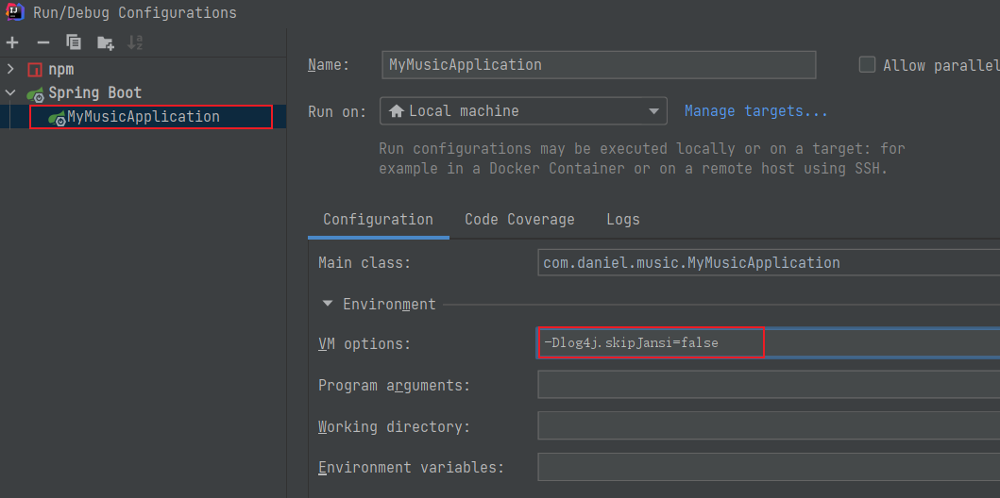

# SpringBoot基础

## 学习目标：

1. 能够理解Spring的优缺点
2. 能够理解SpringBoot的特点
3. 能够理解SpringBoot的核心功能
4. 能够搭建SpringBoot的环境
5. 能够完成application.properties配置文件的配置
6. 能够完成application.yml配置文件的配置
7. 能够使用SpringBoot集成Mybatis
8. 能够使用SpringBoot集成Junit
9. 能够使用SpringBoot集成SpringData JPA

# 一、SpringBoot简介

## 1.1  原有Spring优缺点分析

### 1.1.1 Spring的优点分析

Spring是Java企业版（Java Enterprise Edition，JEE，也称J2EE）的轻量级代替品。无需开发重量级的Enterprise JavaBean（EJB），Spring为企业级Java开发提供了一种相对简单的方法，通过依赖注入和面向切面编程，用简单的Java对象（Plain Old Java Object，POJO）实现了EJB的功能。

### 1.1.2 Spring的缺点分析

虽然Spring的组件代码是轻量级的，但它的配置却是重量级的。一开始，Spring用XML配置，而且是很多XML配置。Spring 2.5引入了基于注解的组件扫描，这消除了大量针对应用程序自身组件的显式XML配置。Spring 3.0引入了基于Java的配置，这是一种类型安全的可重构配置方式，可以代替XML。

所有这些配置都代表了开发时的损耗。因为在思考Spring特性配置和解决业务问题之间需要进行思维切换，所以编写配置挤占了编写应用程序逻辑的时间。和所有框架一样，Spring实用，但与此同时它要求的回报也不少。

除此之外，项目的依赖管理也是一件耗时耗力的事情。在环境搭建时，需要分析要导入哪些库的坐标，而且还需要分析导入与之有依赖关系的其他库的坐标，一旦选错了依赖的版本，随之而来的不兼容问题就会严重阻碍项目的开发进度。

## 1.2 SpringBoot的概述

### 1.2.1 SpringBoot解决上述Spring的缺点

SpringBoot对上述Spring的缺点进行的改善和优化，基于约定优于配置的思想，可以让开发人员不必在配置与逻辑业务之间进行思维的切换，全身心的投入到逻辑业务的代码编写中，从而大大提高了开发的效率，一定程度上缩短了项目周期。

### 1.2.2 SpringBoot的特点

- 为基于Spring的开发提供更快的入门体验
- 开箱即用，没有代码生成，也无需XML配置。同时也可以修改默认值来满足特定的需求
- 提供了一些大型项目中常见的非功能性特性，如嵌入式服务器、安全、指标，健康检测、外部配置等
- SpringBoot不是对Spring功能上的增强，而是提供了一种快速使用Spring的方式

### 1.2.3 SpringBoot的核心功能

- 起步依赖

  起步依赖本质上是一个Maven项目对象模型（Project Object Model，POM），定义了对其他库的传递依赖，这些东西加在一起即支持某项功能。

  简单的说，起步依赖就是将具备某种功能的坐标打包到一起，并提供一些默认的功能。

- 自动配置

  Spring Boot的自动配置是一个运行时（更准确地说，是应用程序启动时）的过程，考虑了众多因素，才决定Spring配置应该用哪个，不该用哪个。该过程是Spring自动完成的。


​	注意：起步依赖和自动配置的原理剖析会在第三章《SpringBoot原理分析》进行详细讲解

# 二、SpringBoot快速入门

## 2.1 代码实现

### 2.1.1 创建Maven工程

使用idea工具创建一个maven工程，该工程为普通的java工程即可


### 2.1.2 添加SpringBoot的起步依赖

SpringBoot要求，项目要继承SpringBoot的起步依赖spring-boot-starter-parent

```xml
<parent>
    <groupId>org.springframework.boot</groupId>
    <artifactId>spring-boot-starter-parent</artifactId>
    <version>2.0.1.RELEASE</version>
</parent>
```

SpringBoot要集成SpringMVC进行Controller的开发，所以项目要导入web的启动依赖

```xml
<dependencies>
    <dependency>
        <groupId>org.springframework.boot</groupId>
        <artifactId>spring-boot-starter-web</artifactId>
    </dependency>
</dependencies>
```


### 2.1.3 编写SpringBoot引导类

要通过SpringBoot提供的引导类起步SpringBoot才可以进行访问

```java
package com.itheima;

import org.springframework.boot.SpringApplication;
import org.springframework.boot.autoconfigure.SpringBootApplication;

@SpringBootApplication
public class MySpringBootApplication {

    public static void main(String[] args) {
        SpringApplication.run(MySpringBootApplication.class);
    }

}
```

### 2.1.4 编写Controller

在引导类MySpringBootApplication同级包或者子级包中创建QuickStartController

```java
package com.itheima.controller;

import org.springframework.stereotype.Controller;
import org.springframework.web.bind.annotation.RequestMapping;
import org.springframework.web.bind.annotation.ResponseBody;

@Controller
public class QuickStartController {
    
    @RequestMapping("/quick")
    @ResponseBody
    public String quick(){
        return "springboot 访问成功!";
    }
    
}
```

### 2.1.5 测试

执行SpringBoot起步类的主方法，控制台打印日志如下：

```
.   ____          _            __ _ _
 /\\ / ___'_ __ _ _(_)_ __  __ _ \ \ \ \
( ( )\___ | '_ | '_| | '_ \/ _` | \ \ \ \
 \\/  ___)| |_)| | | | | || (_| |  ) ) ) )
  '  |____| .__|_| |_|_| |_\__, | / / / /
 =========|_|==============|___/=/_/_/_/
 :: Spring Boot ::        (v2.0.1.RELEASE)

2018-05-08 14:29:59.714  INFO 5672 --- [           main] com.itheima.MySpringBootApplication      : Starting MySpringBootApplication on DESKTOP-RRUNFUH with PID 5672 (C:\Users\muzimoo\IdeaProjects\IdeaTest\springboot_quick\target\classes started by muzimoo in C:\Users\muzimoo\IdeaProjects\IdeaTest)
... ... ...
o.s.w.s.handler.SimpleUrlHandlerMapping  : Mapped URL path [/**] onto handler of type [class org.springframework.web.servlet.resource.ResourceHttpRequestHandler]
2018-05-08 14:30:03.126  INFO 5672 --- [           main] o.s.j.e.a.AnnotationMBeanExporter        : Registering beans for JMX exposure on startup
2018-05-08 14:30:03.196  INFO 5672 --- [           main] o.s.b.w.embedded.tomcat.TomcatWebServer  : Tomcat started on port(s): 8080 (http) with context path ''
2018-05-08 14:30:03.206  INFO 5672 --- [           main] com.itheima.MySpringBootApplication      : Started MySpringBootApplication in 4.252 seconds (JVM running for 5.583)
```

通过日志发现，Tomcat started on port(s): 8080 (http) with context path ''

tomcat已经起步，端口监听8080，web应用的虚拟工程名称为空

打开浏览器访问url地址为：http://localhost:8080/quick


## 2.2 快速入门解析

### 2.2.2 SpringBoot代码解析

- @SpringBootApplication：标注SpringBoot的启动类，该注解具备多种功能（后面详细剖析）
- SpringApplication.run(MySpringBootApplication.class) 代表运行SpringBoot的启动类，参数为SpringBoot启动类的字节码对象

### 2.2.3 SpringBoot工程热部署

我们在开发中反复修改类、页面等资源，每次修改后都是需要重新启动才生效，这样每次启动都很麻烦，浪费了大量的时间，我们可以在修改代码后不重启就能生效，在 pom.xml 中添加如下配置就可以实现这样的功能，我们称之为热部署。

```xml
<!--热部署配置-->
<dependency>
    <groupId>org.springframework.boot</groupId>
    <artifactId>spring-boot-devtools</artifactId>
</dependency>
```

注意：IDEA进行SpringBoot热部署失败原因

出现这种情况，并不是热部署配置问题，其根本原因是因为Intellij IEDA默认情况下不会自动编译，需要对IDEA进行自动编译的设置，如下：


然后 Shift+Ctrl+Alt+/，选择Registry


### 2.2.4 使用idea快速创建SpringBoot项目


通过idea快速创建的SpringBoot项目的pom.xml中已经导入了我们选择的web的起步依赖的坐标

```xml
<?xml version="1.0" encoding="UTF-8"?>
<project xmlns="http://maven.apache.org/POM/4.0.0" xmlns:xsi="http://www.w3.org/2001/XMLSchema-instance"
	xsi:schemaLocation="http://maven.apache.org/POM/4.0.0 http://maven.apache.org/xsd/maven-4.0.0.xsd">
	<modelVersion>4.0.0</modelVersion>

	<groupId>com.itheima</groupId>
	<artifactId>springboot_quick2</artifactId>
	<version>0.0.1-SNAPSHOT</version>
	<packaging>jar</packaging>

	<name>springboot_quick2</name>
	<description>Demo project for Spring Boot</description>

	<parent>
		<groupId>org.springframework.boot</groupId>
		<artifactId>spring-boot-starter-parent</artifactId>
		<version>2.0.1.RELEASE</version>
		<relativePath/> <!-- lookup parent from repository -->
	</parent>

	<properties>
		<project.build.sourceEncoding>UTF-8</project.build.sourceEncoding>
		<project.reporting.outputEncoding>UTF-8</project.reporting.outputEncoding>
		<java.version>9</java.version>
	</properties>

	<dependencies>
		<dependency>
			<groupId>org.springframework.boot</groupId>
			<artifactId>spring-boot-starter-web</artifactId>
		</dependency>

		<dependency>
			<groupId>org.springframework.boot</groupId>
			<artifactId>spring-boot-starter-test</artifactId>
			<scope>test</scope>
		</dependency>
	</dependencies>

	<build>
		<plugins>
			<plugin>
				<groupId>org.springframework.boot</groupId>
				<artifactId>spring-boot-maven-plugin</artifactId>
			</plugin>
		</plugins>
	</build>


</project>

```

可以使用快速入门的方式创建Controller进行访问，此处不再赘述


# 三、SpringBoot原理分析

## 3.1 起步依赖原理分析

### 3.1.1 分析spring-boot-starter-parent

按住Ctrl点击pom.xml中的spring-boot-starter-parent，跳转到了spring-boot-starter-parent的pom.xml，xml配置如下（只摘抄了部分重点配置）：

```xml
<parent>
  <groupId>org.springframework.boot</groupId>
  <artifactId>spring-boot-dependencies</artifactId>
  <version>2.0.1.RELEASE</version>
  <relativePath>../../spring-boot-dependencies</relativePath>
</parent>
```

按住Ctrl点击pom.xml中的spring-boot-starter-dependencies，跳转到了spring-boot-starter-dependencies的pom.xml，xml配置如下（只摘抄了部分重点配置）：

```xml
<properties>
  	<activemq.version>5.15.3</activemq.version>
  	<antlr2.version>2.7.7</antlr2.version>
  	<appengine-sdk.version>1.9.63</appengine-sdk.version>
  	<artemis.version>2.4.0</artemis.version>
  	<aspectj.version>1.8.13</aspectj.version>
  	<assertj.version>3.9.1</assertj.version>
  	<atomikos.version>4.0.6</atomikos.version>
  	<bitronix.version>2.1.4</bitronix.version>
  	<build-helper-maven-plugin.version>3.0.0</build-helper-maven-plugin.version>
  	<byte-buddy.version>1.7.11</byte-buddy.version>
  	... ... ...
</properties>
<dependencyManagement>
  	<dependencies>
      	<dependency>
        	<groupId>org.springframework.boot</groupId>
        	<artifactId>spring-boot</artifactId>
        	<version>2.0.1.RELEASE</version>
      	</dependency>
      	<dependency>
        	<groupId>org.springframework.boot</groupId>
        	<artifactId>spring-boot-test</artifactId>
        	<version>2.0.1.RELEASE</version>
      	</dependency>
      	... ... ...
	</dependencies>
</dependencyManagement>
<build>
  	<pluginManagement>
    	<plugins>
      		<plugin>
        		<groupId>org.jetbrains.kotlin</groupId>
        		<artifactId>kotlin-maven-plugin</artifactId>
        		<version>${kotlin.version}</version>
      		</plugin>
      		<plugin>
        		<groupId>org.jooq</groupId>
        		<artifactId>jooq-codegen-maven</artifactId>
        		<version>${jooq.version}</version>
      		</plugin>
      		<plugin>
        		<groupId>org.springframework.boot</groupId>
        		<artifactId>spring-boot-maven-plugin</artifactId>
        		<version>2.0.1.RELEASE</version>
      		</plugin>
          	... ... ...
    	</plugins>
  	</pluginManagement>
</build>
```

从上面的spring-boot-starter-dependencies的pom.xml中我们可以发现，一部分坐标的版本、依赖管理、插件管理已经定义好，所以我们的SpringBoot工程继承spring-boot-starter-parent后已经具备版本锁定等配置了。所以起步依赖的作用就是进行依赖的传递。

### 3.1.2 分析spring-boot-starter-web

按住Ctrl点击pom.xml中的spring-boot-starter-web，跳转到了spring-boot-starter-web的pom.xml，xml配置如下（只摘抄了部分重点配置）：

```xml
<?xml version="1.0" encoding="UTF-8"?>
<project xsi:schemaLocation="http://maven.apache.org/POM/4.0.0 http://maven.apache.org/xsd/maven-4.0.0.xsd" xmlns="http://maven.apache.org/POM/4.0.0"
    xmlns:xsi="http://www.w3.org/2001/XMLSchema-instance">
  	<modelVersion>4.0.0</modelVersion>
  	<parent>
    	<groupId>org.springframework.boot</groupId>
    	<artifactId>spring-boot-starters</artifactId>
    	<version>2.0.1.RELEASE</version>
  	</parent>
  	<groupId>org.springframework.boot</groupId>
  	<artifactId>spring-boot-starter-web</artifactId>
  	<version>2.0.1.RELEASE</version>
  	<name>Spring Boot Web Starter</name>
  
  	<dependencies>
    	<dependency>
      		<groupId>org.springframework.boot</groupId>
      		<artifactId>spring-boot-starter</artifactId>
      		<version>2.0.1.RELEASE</version>
      		<scope>compile</scope>
    	</dependency>
    	<dependency>
      		<groupId>org.springframework.boot</groupId>
      		<artifactId>spring-boot-starter-json</artifactId>
      		<version>2.0.1.RELEASE</version>
      		<scope>compile</scope>
    	</dependency>
    	<dependency>
      		<groupId>org.springframework.boot</groupId>
      		<artifactId>spring-boot-starter-tomcat</artifactId>
      		<version>2.0.1.RELEASE</version>
      		<scope>compile</scope>
    	</dependency>
    	<dependency>
      		<groupId>org.hibernate.validator</groupId>
      		<artifactId>hibernate-validator</artifactId>
      		<version>6.0.9.Final</version>
      		<scope>compile</scope>
    	</dependency>
    	<dependency>
      		<groupId>org.springframework</groupId>
      		<artifactId>spring-web</artifactId>
      		<version>5.0.5.RELEASE</version>
      		<scope>compile</scope>
    	</dependency>
    	<dependency>
      		<groupId>org.springframework</groupId>
      		<artifactId>spring-webmvc</artifactId>
      		<version>5.0.5.RELEASE</version>
      		<scope>compile</scope>
    	</dependency>
  	</dependencies>
</project>

```

从上面的spring-boot-starter-web的pom.xml中我们可以发现，spring-boot-starter-web就是将web开发要使用的spring-web、spring-webmvc等坐标进行了“打包”，这样我们的工程只要引入spring-boot-starter-web起步依赖的坐标就可以进行web开发了，同样体现了依赖传递的作用。


## 3.2 自动配置原理解析

按住Ctrl点击查看启动类MySpringBootApplication上的注解@SpringBootApplication

```java
@SpringBootApplication
public class MySpringBootApplication {
    public static void main(String[] args) {
        SpringApplication.run(MySpringBootApplication.class);
    }
}
```

注解@SpringBootApplication的源码

```java
@Target(ElementType.TYPE)
@Retention(RetentionPolicy.RUNTIME)
@Documented
@Inherited
@SpringBootConfiguration
@EnableAutoConfiguration
@ComponentScan(excludeFilters = {
		@Filter(type = FilterType.CUSTOM, classes = TypeExcludeFilter.class),
		@Filter(type = FilterType.CUSTOM, classes = AutoConfigurationExcludeFilter.class) })
public @interface SpringBootApplication {

	/**
	 * Exclude specific auto-configuration classes such that they will never be applied.
	 * @return the classes to exclude
	 */
	@AliasFor(annotation = EnableAutoConfiguration.class)
	Class<?>[] exclude() default {};

	... ... ...

}
```

其中，

@SpringBootConfiguration：等同与@Configuration，既标注该类是Spring的一个配置类

@EnableAutoConfiguration：SpringBoot自动配置功能开启

按住Ctrl点击查看注解@EnableAutoConfiguration

```java
@Target(ElementType.TYPE)
@Retention(RetentionPolicy.RUNTIME)
@Documented
@Inherited
@AutoConfigurationPackage
@Import(AutoConfigurationImportSelector.class)
public @interface EnableAutoConfiguration {
	... ... ...
}
```

其中，@Import(AutoConfigurationImportSelector.class) 导入了AutoConfigurationImportSelector类

按住Ctrl点击查看AutoConfigurationImportSelector源码

```java
public String[] selectImports(AnnotationMetadata annotationMetadata) {
        ... ... ...
        List<String> configurations = getCandidateConfigurations(annotationMetadata,
                                                                   attributes);
        configurations = removeDuplicates(configurations);
        Set<String> exclusions = getExclusions(annotationMetadata, attributes);
        checkExcludedClasses(configurations, exclusions);
        configurations.removeAll(exclusions);
        configurations = filter(configurations, autoConfigurationMetadata);
        fireAutoConfigurationImportEvents(configurations, exclusions);
        return StringUtils.toStringArray(configurations);
}


protected List<String> getCandidateConfigurations(AnnotationMetadata metadata,
			AnnotationAttributes attributes) {
		List<String> configurations = SpringFactoriesLoader.loadFactoryNames(
				getSpringFactoriesLoaderFactoryClass(), getBeanClassLoader());
		
		return configurations;
}

```

其中，SpringFactoriesLoader.loadFactoryNames 方法的作用就是从META-INF/spring.factories文件中读取指定类对应的类名称列表 


spring.factories 文件中有关自动配置的配置信息如下：

```
... ... ...

org.springframework.boot.autoconfigure.web.reactive.function.client.WebClientAutoConfiguration,\
org.springframework.boot.autoconfigure.web.servlet.DispatcherServletAutoConfiguration,\
org.springframework.boot.autoconfigure.web.servlet.ServletWebServerFactoryAutoConfiguration,\
org.springframework.boot.autoconfigure.web.servlet.error.ErrorMvcAutoConfiguration,\
org.springframework.boot.autoconfigure.web.servlet.HttpEncodingAutoConfiguration,\
org.springframework.boot.autoconfigure.web.servlet.MultipartAutoConfiguration,\

... ... ...
```

上面配置文件存在大量的以Configuration为结尾的类名称，这些类就是存有自动配置信息的类，而SpringApplication在获取这些类名后再加载

我们以ServletWebServerFactoryAutoConfiguration为例来分析源码：

```java
@Configuration
@AutoConfigureOrder(Ordered.HIGHEST_PRECEDENCE)
@ConditionalOnClass(ServletRequest.class)
@ConditionalOnWebApplication(type = Type.SERVLET)
@EnableConfigurationProperties(ServerProperties.class)
@Import({ ServletWebServerFactoryAutoConfiguration.BeanPostProcessorsRegistrar.class,
		ServletWebServerFactoryConfiguration.EmbeddedTomcat.class,
		ServletWebServerFactoryConfiguration.EmbeddedJetty.class,
		ServletWebServerFactoryConfiguration.EmbeddedUndertow.class })
public class ServletWebServerFactoryAutoConfiguration {
	... ... ...
}

```

其中，

@EnableConfigurationProperties(ServerProperties.class) 代表加载ServerProperties服务器配置属性类

进入ServerProperties.class源码如下：

```java
@ConfigurationProperties(prefix = "server", ignoreUnknownFields = true)
public class ServerProperties {

	/**
	 * Server HTTP port.
	 */
	private Integer port;

	/**
	 * Network address to which the server should bind.
	 */
	private InetAddress address;
  
  	... ... ...
  
}
```

其中，

prefix = "server" 表示SpringBoot配置文件中的前缀，SpringBoot会将配置文件中以server开始的属性映射到该类的字段中。映射关系如下：


# 四、SpringBoot的配置文件

## 4.1 SpringBoot配置文件类型

### 4.1.1 SpringBoot配置文件类型和作用

SpringBoot是基于约定的，所以很多配置都有默认值，但如果想使用自己的配置替换默认配置的话，就可以使用application.properties或者application.yml（application.yaml）进行配置。

SpringBoot默认会从Resources目录下加载application.properties或application.yml（application.yaml）文件

其中，application.properties文件是键值对类型的文件，之前一直在使用，所以此处不在对properties文件的格式进行阐述。除了properties文件外，SpringBoot还可以使用yml文件进行配置，下面对yml文件进行讲解。

### 4.1.2 application.yml配置文件

#### 4.1.2.1 yml配置文件简介

YML文件格式是YAML (YAML Aint Markup Language)编写的文件格式，YAML是一种直观的能够被电脑识别的的数据数据序列化格式，并且容易被人类阅读，容易和脚本语言交互的，可以被支持YAML库的不同的编程语言程序导入，比如： C/C++, Ruby, Python, Java, Perl, C#, PHP等。YML文件是以数据为核心的，比传统的xml方式更加简洁。

YML文件的扩展名可以使用.yml或者.yaml。

#### 4.1.2.2 yml配置文件的语法

##### 4.1.2.2.1 配置普通数据

- 语法： key: value

- 示例代码：

- ```yaml
  name: haohao
  ```

- 注意：value之前有一个空格

##### 4.1.2.2.2 配置对象数据

- 语法： 

  ​	key: 

  ​		key1: value1

  ​		key2: value2

  ​	或者：

  ​	key: {key1: value1,key2: value2}

- 示例代码：

- ```yaml
  person:
    name: haohao
    age: 31
    addr: beijing
  
  #或者
  
  person: {name: haohao,age: 31,addr: beijing}
  ```

- 注意：key1前面的空格个数不限定，在yml语法中，相同缩进代表同一个级别

##### 4.1.2.2.2 配置Map数据 

同上面的对象写法

##### 4.1.2.2.3 配置数组（List、Set）数据

- 语法： 

  ​	key: 

  ​		- value1

  ​		- value2

  或者：

  ​	key: [value1,value2]

- 示例代码：

- ```yaml
  city:
    - beijing
    - tianjin
    - shanghai
    - chongqing
    
  #或者
  
  city: [beijing,tianjin,shanghai,chongqing]
  
  #集合中的元素是对象形式
  student:
    - name: zhangsan
      age: 18
      score: 100
    - name: lisi
      age: 28
      score: 88
    - name: wangwu
      age: 38
      score: 90
  ```

- 注意：value1与之间的 - 之间存在一个空格

### 4.1.3 SpringBoot配置信息的查询

上面提及过，SpringBoot的配置文件，主要的目的就是对配置信息进行修改的，但在配置时的key从哪里去查询呢？我们可以查阅SpringBoot的官方文档

文档URL：https://docs.spring.io/spring-boot/docs/2.0.1.RELEASE/reference/htmlsingle/#common-application-properties

常用的配置摘抄如下：

```properties
# QUARTZ SCHEDULER (QuartzProperties)
spring.quartz.jdbc.initialize-schema=embedded # Database schema initialization mode.
spring.quartz.jdbc.schema=classpath:org/quartz/impl/jdbcjobstore/tables_@@platform@@.sql # Path to the SQL file to use to initialize the database schema.
spring.quartz.job-store-type=memory # Quartz job store type.
spring.quartz.properties.*= # Additional Quartz Scheduler properties.

# ----------------------------------------
# WEB PROPERTIES
# ----------------------------------------

# EMBEDDED SERVER CONFIGURATION (ServerProperties)
server.port=8080 # Server HTTP port.
server.servlet.context-path= # Context path of the application.
server.servlet.path=/ # Path of the main dispatcher servlet.

# HTTP encoding (HttpEncodingProperties)
spring.http.encoding.charset=UTF-8 # Charset of HTTP requests and responses. Added to the "Content-Type" header if not set explicitly.

# JACKSON (JacksonProperties)
spring.jackson.date-format= # Date format string or a fully-qualified date format class name. For instance, `yyyy-MM-dd HH:mm:ss`.

# SPRING MVC (WebMvcProperties)
spring.mvc.servlet.load-on-startup=-1 # Load on startup priority of the dispatcher servlet.
spring.mvc.static-path-pattern=/** # Path pattern used for static resources.
spring.mvc.view.prefix= # Spring MVC view prefix.
spring.mvc.view.suffix= # Spring MVC view suffix.

# DATASOURCE (DataSourceAutoConfiguration & DataSourceProperties)
spring.datasource.driver-class-name= # Fully qualified name of the JDBC driver. Auto-detected based on the URL by default.
spring.datasource.password= # Login password of the database.
spring.datasource.url= # JDBC URL of the database.
spring.datasource.username= # Login username of the database.

# JEST (Elasticsearch HTTP client) (JestProperties)
spring.elasticsearch.jest.password= # Login password.
spring.elasticsearch.jest.proxy.host= # Proxy host the HTTP client should use.
spring.elasticsearch.jest.proxy.port= # Proxy port the HTTP client should use.
spring.elasticsearch.jest.read-timeout=3s # Read timeout.
spring.elasticsearch.jest.username= # Login username.

```

我们可以通过配置application.poperties 或者 application.yml 来修改SpringBoot的默认配置

例如：

application.properties文件

```properties
server.port=8888
server.servlet.context-path=demo
```

application.yml文件

```yaml
server:
  port: 8888
  servlet:
    context-path: /demo
```


## 4.2 配置文件与配置类的属性映射方式

### 4.2.1 使用注解@Value映射

我们可以通过@Value注解将配置文件中的值映射到一个Spring管理的Bean的字段上

例如：

application.properties配置如下：

```properties
person:
  name: zhangsan
  age: 18
```

或者，application.yml配置如下：

```yaml
person:
  name: zhangsan
  age: 18
```

实体Bean代码如下：

```java
@Controller
public class QuickStartController {

    @Value("${person.name}")
    private String name;
    @Value("${person.age}")
    private Integer age;


    @RequestMapping("/quick")
    @ResponseBody
    public String quick(){
        return "springboot 访问成功! name="+name+",age="+age;
    }

}
```

浏览器访问地址：http://localhost:8080/quick 结果如下：


### 4.2.2 使用注解@ConfigurationProperties映射

通过注解@ConfigurationProperties(prefix="配置文件中的key的前缀")可以将配置文件中的配置自动与实体进行映射

application.properties配置如下：

```properties
person:
  name: zhangsan
  age: 18
```

或者，application.yml配置如下：

```yaml
person:
  name: zhangsan
  age: 18
```

实体Bean代码如下：

```java
@Controller
@ConfigurationProperties(prefix = "person")
public class QuickStartController {

    private String name;
    private Integer age;

    @RequestMapping("/quick")
    @ResponseBody
    public String quick(){
        return "springboot 访问成功! name="+name+",age="+age;
    }

    public void setName(String name) {
        this.name = name;
    }

    public void setAge(Integer age) {
        this.age = age;
    }
}
```

浏览器访问地址：http://localhost:8080/quick 结果如下：


注意：使用@ConfigurationProperties方式可以进行配置文件与实体字段的自动映射，但需要字段必须提供set方法才可以，而使用@Value注解修饰的字段不需要提供set方法


# 五、SpringBoot与整合其他技术

## 5.1 SpringBoot整合Mybatis

### 5.1.1 添加Mybatis的起步依赖

```xml
<!--mybatis起步依赖-->
<dependency>
    <groupId>org.mybatis.spring.boot</groupId>
    <artifactId>mybatis-spring-boot-starter</artifactId>
    <version>1.1.1</version>
</dependency>
```

### 5.1.2 添加数据库驱动坐标

#### MySQL

```xml
<!-- MySQL连接驱动 -->
<dependency>
    <groupId>mysql</groupId>
    <artifactId>mysql-connector-java</artifactId>
</dependency>
```

#### Oracle

```xml
<dependency>
    <groupId>com.oracle.database.jdbc</groupId>
    <artifactId>ojdbc8</artifactId>
    <scope>runtime</scope>
</dependency>
```

### 5.1.3 添加数据库连接信息

#### application.properties

添加数据量的连接信息

##### MySQL

```properties
# MySQL
spring.datasource.driverClassName=com.mysql.jdbc.Driver
spring.datasource.url=jdbc:mysql://127.0.0.1:3306/daniel?useUnicode=true&characterEncoding=utf8
spring.datasource.username=daniel
spring.datas ource.password=daniel
```

##### Oracle

```properties
# Oracle
spring.datasource.driver-class-name=oracle.jdbc.driver.OracleDriver
spring.datasource.url=jdbc:oracle:thin:@localhost:1521:orcl
spring.datasource.username=daniel
spring.datasource.password=daniel
```

#### application.yaml

##### MySQL

```properties
spring:
  # mysql 配置
  datasource:
    driver-class-name: com.mysql.cj.jdbc.Driver
    url: jdbc:mysql://localhost:3306/demo?serverTimezone=UTC
    username: root
    password: daniel

```

##### Oracle

```properties
spring:  
  # 配置 Oracle
  datasource:
    driver-class-name: oracle.jdbc.driver.OracleDriver   # 固定
    url: jdbc:oracle:thin:@localhost:1521:orcl  # 按你本地的来，默认的sid为 orcl
    username: daniel     # 按你本地的来
    password: daniel     # 按你本地的来
```


### 5.1.4 创建user表

在test数据库中创建user表

```sql
-- ----------------------------
-- Table structure for `user`
-- ----------------------------
DROP TABLE IF EXISTS `user`;
CREATE TABLE `user` (
  `id` int(11) NOT NULL AUTO_INCREMENT,
  `username` varchar(50) DEFAULT NULL,
  `password` varchar(50) DEFAULT NULL,
  `name` varchar(50) DEFAULT NULL,
  PRIMARY KEY (`id`)
) ENGINE=InnoDB AUTO_INCREMENT=10 DEFAULT CHARSET=utf8;

-- ----------------------------
-- Records of user
-- ----------------------------
INSERT INTO `user` VALUES ('1', 'zhangsan', '123', '张三');
INSERT INTO `user` VALUES ('2', 'lisi', '123', '李四');
```

### 5.1.5 创建实体Bean

```java
public class User {
    // 主键
    private Long id;
    // 用户名
    private String username;
    // 密码
    private String password;
    // 姓名
    private String name;
  
    //此处省略getter和setter方法 .. ..
    
}
```

### 5.1.6 编写Mapper

```java
@Mapper
public interface UserMapper {
	public List<User> queryUserList();
}
```

注意：@Mapper标记该类是一个mybatis的mapper接口，可以被spring boot自动扫描到spring上下文中

### 5.1.7 配置Mapper映射文件

在src\main\resources\mapper路径下加入UserMapper.xml配置文件"

```xml
<?xml version="1.0" encoding="utf-8" ?>
<!DOCTYPE mapper PUBLIC "-//mybatis.org//DTD Mapper 3.0//EN" "http://mybatis.org/dtd/mybatis-3-mapper.dtd" >
<mapper namespace="com.itheima.mapper.UserMapper">
    <select id="queryUserList" resultType="user">
        select * from user
    </select>
</mapper>
```

### 5.1.8 在application.properties中添加mybatis的信息

```properties
#spring集成Mybatis环境
#pojo别名扫描包
mybatis.type-aliases-package=com.itheima.domain
#加载Mybatis映射文件
mybatis.mapper-locations=classpath:mapper/*Mapper.xml
```

### 5.1.9 编写测试Controller

```java
@Controller
public class MapperController {

    @Autowired
    private UserMapper userMapper;

    @RequestMapping("/queryUser")
    @ResponseBody
    public List<User> queryUser(){
        List<User> users = userMapper.queryUserList();
        return users;
    }

}
```

### 5.1.10 测试


## 5.2 SpringBoot整合Junit

### 5.2.1 添加Junit的起步依赖

```xml
<!--测试的起步依赖-->
<dependency>
    <groupId>org.springframework.boot</groupId>
    <artifactId>spring-boot-starter-test</artifactId>
    <scope>test</scope>
</dependency>
```

### 5.2.2 编写测试类

```java
package com.itheima.test;

import com.itheima.MySpringBootApplication;
import com.itheima.domain.User;
import com.itheima.mapper.UserMapper;
import org.junit.Test;
import org.junit.runner.RunWith;
import org.springframework.beans.factory.annotation.Autowired;
import org.springframework.boot.test.context.SpringBootTest;
import org.springframework.test.context.junit4.SpringRunner;

import java.util.List;

@RunWith(SpringRunner.class)
@SpringBootTest(classes = MySpringBootApplication.class)
public class MapperTest {

    @Autowired
    private UserMapper userMapper;

    @Test
    public void test() {
        List<User> users = userMapper.queryUserList();
        System.out.println(users);
    }

}
```

其中，

SpringRunner继承自SpringJUnit4ClassRunner，使用哪一个Spring提供的测试测试引擎都可以

```java
public final class SpringRunner extends SpringJUnit4ClassRunner 
```

@SpringBootTest的属性指定的是引导类的字节码对象


### 5.2.3 控制台打印信息


## 5.3 SpringBoot整合Spring Data JPA

### 5.3.1 添加Spring Data JPA的起步依赖

```xml
<!-- springBoot JPA的起步依赖 -->
<dependency>
    <groupId>org.springframework.boot</groupId>
    <artifactId>spring-boot-starter-data-jpa</artifactId>
</dependency>
```

### 5.3.2 添加数据库驱动依赖

```xml
<!-- MySQL连接驱动 -->
<dependency>
    <groupId>mysql</groupId>
    <artifactId>mysql-connector-java</artifactId>
</dependency>
```

### 5.3.3 在application.properties中配置数据库和jpa的相关属性

```properties
#DB Configuration:
spring.datasource.driverClassName=com.mysql.jdbc.Driver
spring.datasource.url=jdbc:mysql://127.0.0.1:3306/test?useUnicode=true&characterEncoding=utf8
spring.datasource.username=root
spring.datasource.password=root

#JPA Configuration:
spring.jpa.database=MySQL
spring.jpa.show-sql=true
spring.jpa.generate-ddl=true
spring.jpa.hibernate.ddl-auto=update
spring.jpa.hibernate.naming_strategy=org.hibernate.cfg.ImprovedNamingStrategy
```

### 5.3.4 创建实体配置实体

```java
@Entity
public class User {
    // 主键
    @Id
    @GeneratedValue(strategy = GenerationType.IDENTITY)
    private Long id;
    // 用户名
    private String username;
    // 密码
    private String password;
    // 姓名
    private String name;
 
    //此处省略setter和getter方法... ...
}
```

### 5.3.5 编写UserRepository

```java
public interface UserRepository extends JpaRepository<User,Long>{
    public List<User> findAll();
}
```

### 5.3.6 编写测试类

```java
@RunWith(SpringRunner.class)
@SpringBootTest(classes=MySpringBootApplication.class)
public class JpaTest {

    @Autowired
    private UserRepository userRepository;

    @Test
    public void test(){
        List<User> users = userRepository.findAll();
        System.out.println(users);
    }

}
```

### 5.3.7 控制台打印信息


注意：如果是jdk9，执行报错如下：


原因：jdk缺少相应的jar

解决方案：手动导入对应的maven坐标，如下：

```xml
<!--jdk9需要导入如下坐标-->
<dependency>
    <groupId>javax.xml.bind</groupId>
    <artifactId>jaxb-api</artifactId>
    <version>2.3.0</version>
</dependency>
```


## 5.4 SpringBoot整合Redis

### 5.4.1 添加redis的起步依赖

```xml
<!-- 配置使用redis启动器 -->
<dependency>
    <groupId>org.springframework.boot</groupId>
    <artifactId>spring-boot-starter-data-redis</artifactId>
</dependency>
```

### 5.4.2 配置redis的连接信息

```properties
#Redis
spring.redis.host=127.0.0.1
spring.redis.port=6379
```

### 5.4.3 注入RedisTemplate测试redis操作

```java
@RunWith(SpringRunner.class)
@SpringBootTest(classes = SpringbootJpaApplication.class)
public class RedisTest {

    @Autowired
    private UserRepository userRepository;

    @Autowired
    private RedisTemplate<String, String> redisTemplate;

    @Test
    public void test() throws JsonProcessingException {
        //从redis缓存中获得指定的数据
        String userListData = redisTemplate.boundValueOps("user.findAll").get();
        //如果redis中没有数据的话
        if(null==userListData){
            //查询数据库获得数据
            List<User> all = userRepository.findAll();
            //转换成json格式字符串
            ObjectMapper om = new ObjectMapper();
            userListData = om.writeValueAsString(all);
            //将数据存储到redis中，下次在查询直接从redis中获得数据，不用在查询数据库
            redisTemplate.boundValueOps("user.findAll").set(userListData);
            System.out.println("===============从数据库获得数据===============");
        }else{
            System.out.println("===============从redis缓存中获得数据===============");
        }

        System.out.println(userListData);

    }

}
```

## 5.5 SpringBoot整合AOP实现日志

### 5.5.1 添加AOP的起步依赖

```xml
<dependency>
    <groupId>org.springframework.boot</groupId>
    <artifactId>spring-boot-starter-aop</artifactId>
</dependency>
```

### 5.5.2添加日志切面类

```java
package com.daniel.aspect;

import org.aspectj.lang.JoinPoint;
import org.aspectj.lang.annotation.AfterReturning;
import org.aspectj.lang.annotation.Aspect;
import org.aspectj.lang.annotation.Before;
import org.aspectj.lang.annotation.Pointcut;
import org.slf4j.Logger;
import org.slf4j.LoggerFactory;
import org.springframework.stereotype.Component;
import org.springframework.web.context.request.RequestContextHolder;
import org.springframework.web.context.request.ServletRequestAttributes;

import javax.servlet.http.HttpServletRequest;
import java.util.Arrays;

@Aspect
@Component
public class WebLogAspect {
    
    private Logger logger = LoggerFactory.getLogger(WebLogAspect.class);
    
    /**
     * 定义切入点，切入点为com.daniel.services 下的所有函数
     */
    @Pointcut("execution(public * com.daniel.services..*.*(..))")
    public void webLog(){}
    
    /**
     * 前置通知：在连接点之前执行的通知
     * @param joinPoint
     * @throws Throwable
     */
    @Before("webLog()")
    public void doBefore(JoinPoint joinPoint) throws Throwable {
        // 接收到请求，记录请求内容
        ServletRequestAttributes attributes = (ServletRequestAttributes) RequestContextHolder.getRequestAttributes();
        HttpServletRequest request = attributes.getRequest();
        
        // 记录下请求内容
        logger.info("=============我来源与Before========================");
        logger.info("URL : " + request.getRequestURL().toString());
        logger.info("HTTP_METHOD : " + request.getMethod());
        logger.info("IP : " + request.getRemoteAddr());
        logger.info("CLASS_METHOD : " + joinPoint.getSignature().getDeclaringTypeName() + "." + joinPoint.getSignature().getName());
        logger.info("ARGS : " + Arrays.toString(joinPoint.getArgs()));
    }
    
    @AfterReturning(returning = "ret",pointcut = "webLog()")
    public void doAfterReturning(Object ret) throws Throwable {
        // 处理完请求，返回内容
        logger.info("RESPONSE : " + ret);
    }
}
```

### 5.5.3结果


## 5.6 SpringBoot整合log4j

### 5.6.1 导入依赖

```xml
<dependency>  
    <groupId>org.springframework.boot</groupId>  
    <artifactId>spring-boot-starter-web</artifactId>  
    <exclusions><!-- 去掉springboot默认配置 -->  
        <exclusion>  
            <groupId>org.springframework.boot</groupId>  
            <artifactId>spring-boot-starter-logging</artifactId>  
        </exclusion>  
    </exclusions>  
</dependency> 

<dependency> <!-- 引入log4j依赖 -->  
    <groupId>org.springframework.boot</groupId>  
    <artifactId>spring-boot-starter-log4j</artifactId>  
</dependency> 
```

### 5.6.2 添加配置文件

log4j.properties是log4j的重要配置文件

```properties
#定义根节点
log4j.rootLogger=DEBUG,error,CONSOLE,info

#设置控制台打印
log4j.appender.CONSOLE=org.apache.log4j.ConsoleAppender     
#设置为格式化打印 PatternLayout
log4j.appender.CONSOLE.layout=org.apache.log4j.PatternLayout     
log4j.appender.CONSOLE.layout.ConversionPattern=%d{yyyy-MM-dd-HH-mm} [%t] [%c] [%p] - %m%n    

#设置info级别的日志
log4j.logger.info=info
#输出到日志文件
log4j.appender.info=org.apache.log4j.DailyRollingFileAppender
log4j.appender.info.layout=org.apache.log4j.PatternLayout     
log4j.appender.info.layout.ConversionPattern=%d{yyyy-MM-dd-HH-mm} [%t] [%c] [%p] - %m%n  
#日期文件名格式化
log4j.appender.info.datePattern='.'yyyy-MM-dd
log4j.appender.info.Threshold = info   
#是否追加
log4j.appender.info.append=true
#文件存放位置
log4j.appender.info.File=E:/dance/demo/log/info.log

log4j.logger.error=error  
log4j.appender.error=org.apache.log4j.DailyRollingFileAppender
log4j.appender.error.layout=org.apache.log4j.PatternLayout     
log4j.appender.error.layout.ConversionPattern=%d{yyyy-MM-dd-HH-mm} [%t] [%c] [%p] - %m%n  
log4j.appender.error.datePattern='.'yyyy-MM-dd
log4j.appender.error.Threshold = error   
log4j.appender.error.append=true
log4j.appender.error.File=E:/dance/demo/log/error.log

log4j.logger.DEBUG=DEBUG
log4j.appender.DEBUG=org.apache.log4j.DailyRollingFileAppender
log4j.appender.DEBUG.layout=org.apache.log4j.PatternLayout     
log4j.appender.DEBUG.layout.ConversionPattern=%d{yyyy-MM-dd-HH-mm} [%t] [%c] [%p] - %m%n  
log4j.appender.DEBUG.datePattern='.'yyyy-MM-dd
log4j.appender.DEBUG.Threshold = DEBUG   
log4j.appender.DEBUG.append=true
log4j.appender.DEBUG.File=E:/dance/demo/log/dubug.log
```

## 5.7 springboot整合log4j2

### **导入依赖**

```xml
<!--web-->
<dependency>
    <groupId>org.springframework.boot</groupId>
    <artifactId>spring-boot-starter-web</artifactId>
</dependency>
<!--排除默认的日志     -->
<dependency>
    <groupId>org.springframework.boot</groupId>
    <artifactId>spring-boot-starter-logging</artifactId>
    <exclusions>
        <exclusion>
            <groupId>*</groupId>
            <artifactId>*</artifactId>
        </exclusion>
    </exclusions>
</dependency>
<!-- 引入log4j2依赖 -->
<!-- https://mvnrepository.com/artifact/org.springframework.boot/spring-boot-starter-log4j2 -->
<dependency>s
    <groupId>org.springframework.boot</groupId>
    <artifactId>spring-boot-starter-log4j2</artifactId>
</dependency>
```

### 配置文件log4j2.xml

```xml
<?xml version="1.0" encoding="UTF-8"?>
<!--日志级别以及优先级排序: OFF > FATAL > ERROR > WARN > INFO > DEBUG > TRACE > ALL -->
<!--Configuration后面的status,这个用于设置log4j2自身内部的信息输出,可以不设置,当设置成trace时,你会看到log4j2内部各种详细输出-->
<!--monitorInterval：Log4j能够自动检测修改配置 文件和重新配置本身,设置间隔秒数-->
<configuration status="WARN" monitorInterval="1800">
    <Properties>
        <!-- 日志默认存放的位置,这里设置为项目根路径下,也可指定绝对路径 -->
        <!-- ${web:rootDir}是web项目根路径,java项目没有这个变量,需要删掉,否则会报异常 -->
        <!--<property name="basePath">D://log4j2Logs</property>-->
        <property name="basePath">D:/logs/log4j2Logs</property>
        
        <!-- 控制台默认输出格式,"%-5level":日志级别,"%l":输出完整的错误位置,是小写的L,因为有行号显示,所以影响日志输出的性能 -->
        <property name="console_log_pattern">%d{yyyy-MM-dd HH:mm:ss.SSS} [%-5level] %l - %m%n</property>
        <!-- 日志文件默认输出格式,不带行号输出(行号显示会影响日志输出性能);%C:大写,类名;%M:方法名;%m:错误信息;%n:换行 -->
        <property name="log_pattern">%d{yyyy-MM-dd HH:mm:ss.SSS} [%-5level] %C.%M - %m%n</property>
        
        <!-- 日志默认切割的最小单位 -->
        <property name="every_file_size">20MB</property>
        <!-- 日志默认输出级别 -->
        <property name="output_log_level">DEBUG</property>
        
        <!-- 日志默认存放路径(所有级别日志) -->
        <property name="rolling_fileName">D:/logs/all.log</property>
        <!-- 日志默认压缩路径,将超过指定文件大小的日志,自动存入按"年月"建立的文件夹下面并进行压缩,作为存档 -->
        <property name="rolling_filePattern">${basePath}/%d{yyyy-MM}/all-%d{yyyy-MM-dd}-%i.log.gz</property>
        <!-- 日志默认同类型日志,同一文件夹下可以存放的数量,不设置此属性则默认为7个 -->
        <property name="rolling_max">50</property>
        
        <!-- Info日志默认存放路径(Info级别日志) -->
        <property name="info_fileName">D:/logs/info.log</property>
        <!-- Info日志默认压缩路径,将超过指定文件大小的日志,自动存入按"年月"建立的文件夹下面并进行压缩,作为存档 -->
        <property name="info_filePattern">D:/logs/%d{yyyy-MM}/info-%d{yyyy-MM-dd}-%i.log.gz</property>
        <!-- Info日志默认同一文件夹下可以存放的数量,不设置此属性则默认为7个 -->
        <property name="info_max">10</property>
        
        <!-- Warn日志默认存放路径(Warn级别日志) -->
        <property name="warn_fileName">D:/logs/warn.log</property>
        <!-- Warn日志默认压缩路径,将超过指定文件大小的日志,自动存入按"年月"建立的文件夹下面并进行压缩,作为存档 -->
        <property name="warn_filePattern">D:/logs/%d{yyyy-MM}/warn-%d{yyyy-MM-dd}-%i.log.gz</property>
        <!-- Warn日志默认同一文件夹下可以存放的数量,不设置此属性则默认为7个 -->
        <property name="warn_max">10</property>
        
        <!-- Error日志默认存放路径(Error级别日志) -->
        <property name="error_fileName">D:/logs/error.log</property>
        <!-- Error日志默认压缩路径,将超过指定文件大小的日志,自动存入按"年月"建立的文件夹下面并进行压缩,作为存档 -->
        <property name="error_filePattern">D:/logs/%d{yyyy-MM}/error-%d{yyyy-MM-dd}-%i.log.gz</property>
        <!-- Error日志默认同一文件夹下可以存放的数量,不设置此属性则默认为7个 -->
        <property name="error_max">10</property>
        
        <!-- 控制台显示的日志最低级别 -->
        <property name="console_print_level">INFO</property>
    
    </Properties>
    
    <!--定义appender -->
    <appenders>
        <!-- 用来定义输出到控制台的配置 -->
        <Console name="Console" target="SYSTEM_OUT">
            <!-- 设置控制台只输出level及以上级别的信息(onMatch),其他的直接拒绝(onMismatch)-->
            <ThresholdFilter level="${console_print_level}" onMatch="ACCEPT" onMismatch="DENY"/>
            <!-- 设置输出格式,不设置默认为:%m%n -->
<!--            <PatternLayout pattern="${console_log_pattern}"/>-->
<!--            <PatternLayout pattern="%d %-5level [%t] %c{1.}.%M(%L): %msg%n"/>-->
            <!--    控制台颜色设置-->
<!--            <PatternLayout pattern="%d{yyyy-MM-dd HH:mm:ss.SSS} %highlight{%-5level} [%t] %highlight{%c{1.}.%M(%L)}: %msg%n" />-->
            <PatternLayout pattern="%d %highlight{%-5level}{ERROR=Bright RED, WARN=Bright Yellow, INFO=Bright Green, DEBUG=Bright Cyan, TRACE=Bright White} %style{[%t]}{bright,magenta} %style{%c{1.}.%M(%L)}{cyan}: %msg%n"/>
        </Console>
        
        <!-- 打印root中指定的level级别以上的日志到文件 -->
        <RollingFile name="RollingFile" fileName="${rolling_fileName}" filePattern="${rolling_filePattern}">
            <PatternLayout pattern="${log_pattern}"/>
            <SizeBasedTriggeringPolicy size="${every_file_size}"/>
            <!-- 设置同类型日志,同一文件夹下可以存放的数量,如果不设置此属性则默认存放7个文件 -->
            <DefaultRolloverStrategy max="${rolling_max}"/>
            <!-- 匹配INFO以及以上级别 -->
            <Filters>
                <ThresholdFilter level="INFO" onMatch="ACCEPT" onMismatch="DENY"/>
            </Filters>
        </RollingFile>
        
        <!-- 打印INFO级别的日志到文件 -->
        <RollingFile name="InfoFile" fileName="${info_fileName}" filePattern="${info_filePattern}">
            <PatternLayout pattern="${log_pattern}"/>
            <SizeBasedTriggeringPolicy size="${every_file_size}"/>
            <DefaultRolloverStrategy max="${info_max}"/>
            <!-- 匹配INFO级别 -->
            <Filters>
                <ThresholdFilter level="WARN" onMatch="DENY" onMismatch="NEUTRAL"/>
                <ThresholdFilter level="INFO" onMatch="ACCEPT" onMismatch="DENY"/>
            </Filters>
        </RollingFile>
        
        <!-- 打印WARN级别的日志到文件 -->
        <RollingFile name="WarnFile" fileName="${warn_fileName}" filePattern="${warn_filePattern}">
            <PatternLayout pattern="${log_pattern}"/>
            <SizeBasedTriggeringPolicy size="${every_file_size}"/>
            <DefaultRolloverStrategy max="${warn_max}"/>
            <!-- 匹配WARN级别 -->
            <Filters>
                <ThresholdFilter level="ERROR" onMatch="DENY" onMismatch="NEUTRAL"/>
                <ThresholdFilter level="WARN" onMatch="ACCEPT" onMismatch="DENY"/>
            </Filters>
        </RollingFile>
        
        <!-- 打印ERROR级别的日志到文件 -->
        <RollingFile name="ErrorFile" fileName="${error_fileName}" filePattern="${error_filePattern}">
            <PatternLayout pattern="${log_pattern}"/>
            <SizeBasedTriggeringPolicy size="${every_file_size}"/>
            <DefaultRolloverStrategy max="${error_max}"/>
            <!-- 匹配ERROR级别 -->
            <Filters>
                <ThresholdFilter level="FATAL" onMatch="DENY" onMismatch="NEUTRAL"/>
                <ThresholdFilter level="ERROR" onMatch="ACCEPT" onMismatch="DENY"/>
            </Filters>
        </RollingFile>
        
    </appenders>
    
    <!--然后定义logger,只有定义了logger并引入的appender,appender才会生效-->
    <loggers>
        <!-- 设置对打印sql语句的支持 -->
        <logger name="java.sql" level="info" additivity="false">
            <appender-ref ref="Console"/>
        </logger>
        <!--建立一个默认的root的logger-->
        <root level="${output_log_level}">
            <appender-ref ref="RollingFile"/>
            <appender-ref ref="Console"/>
            <appender-ref ref="InfoFile"/>
            <appender-ref ref="WarnFile"/>
            <appender-ref ref="ErrorFile"/>
        </root>
    </loggers>
</configuration>
```

### application.yml中配置指向

```yml
logging:
	config: classpath:log4j2.xml
```

### 控制台无颜色

在idea中的VM options中输入以下

```sh
-Dlog4j.skipJansi=false
```



# 解决跨域问题

### 注解方式

在接口方法上添加注解

```java
@CrossOrigin // 允许所有ip跨域
@CrossOrigin(origins = "192.168.0.1") //只允许指定ip跨域
```

### SSM框架

#### 方式一：

在pom.xml中导入相关包

```xml
<!-- cors-filter包：配置跨域 -->
<dependency>
    <groupId>com.thetransactioncompany</groupId>
    <artifactId>cors-filter</artifactId>
    <version>2.5</version>
</dependency>
```

在web.xml中配置过滤器

```xml
<!-- 配置跨域过滤器 -->
<filter>
    <filter-name>CORS</filter-name>
    <filter-class>com.thetransactioncompany.cors.CORSFilter</filter-class>
    <init-param>
        <param-name>cors.allowOrigin</param-name>
        <param-value>*</param-value>
    </init-param>
    <init-param>
        <param-name>cors.supportedMethods</param-name>
        <!-- <param-value>*</param-value> --> <!-- 表示所有请求都有效 -->
        <param-value>GET, POST, HEAD, PUT, DELETE</param-value>
    </init-param>
    <init-param>
        <param-name>cors.supportedHeaders</param-name>
        <param-value>Accept, Origin, X-Requested-With, Content-Type, Last-Modified</param-value>
    </init-param>
    <init-param>
        <param-name>cors.exposedHeaders</param-name>
        <param-value>Set-Cookie</param-value>
    </init-param>
    <init-param>
        <param-name>cors.supportsCredentials</param-name>
        <param-value>true</param-value>
    </init-param>
</filter>
<filter-mapping>
    <filter-name>CORS</filter-name>
    <url-pattern>/*</url-pattern>
</filter-mapping>
```

#### 方式二：

在springMVC.xml中配置跨域

```xml
<!-- 接口跨域配置 -->
<mvc:cors>
	<!-- allowed-methods="*" --> <!-- 表示所有请求都有效 -->
	<mvc:mapping path="/**" allowed-origins="*"
		allowed-methods="POST, GET, OPTIONS, DELETE, PUT"
		allowed-headers="Content-Type, Access-Control-Allow-Headers, Authorization, X-Requested-With"
		allow-credentials="true" />
</mvc:cors>
```

#### 方式三：

通过配置类来实现跨域，首先新建一个过滤器配置类

```java
package com.pmsapi.filter;

import java.io.IOException;

import javax.servlet.Filter;
import javax.servlet.FilterChain;
import javax.servlet.FilterConfig;
import javax.servlet.ServletException;
import javax.servlet.ServletRequest;
import javax.servlet.ServletResponse;
import javax.servlet.http.HttpServletRequest;
import javax.servlet.http.HttpServletResponse;

public class CrossingFilter implements Filter {

    private boolean isCross = false;

    @Override
    public void destroy() {
        isCross = false;
    }

    @Override
    public void doFilter(ServletRequest request, ServletResponse response, FilterChain chain)
        throws IOException, ServletException {
        if (isCross) {
            HttpServletRequest httpServletRequest = (HttpServletRequest) request;
            HttpServletResponse httpServletResponse = (HttpServletResponse) response;
            System.out.println("拦截请求: " + httpServletRequest.getServletPath());
            httpServletResponse.setHeader("Access-Control-Allow-Origin", "*");
            // httpServletResponse.setHeader("Access-Control-Allow-Methods", "*"); // 表示所有请求都有效
            httpServletResponse.setHeader("Access-Control-Allow-Methods", "POST, GET, OPTIONS, DELETE");
            httpServletResponse.setHeader("Access-Control-Max-Age", "0");
            httpServletResponse.setHeader("Access-Control-Allow-Headers",
                                          "Origin, No-Cache, X-Requested-With, If-Modified-Since, Pragma, Last-Modified, Cache-Control, Expires, Content-Type, X-E4M-With,userId,token");
            httpServletResponse.setHeader("Access-Control-Allow-Credentials", "true");
            httpServletResponse.setHeader("XDomainRequestAllowed", "1");
        }
        chain.doFilter(request, response);
    }

    @Override
    public void init(FilterConfig filterConfig) throws ServletException {
        String isCrossStr = filterConfig.getInitParameter("IsCross");
        isCross = isCrossStr.equals("true") ? true : false;
        System.out.println("跨域开启状态：" + isCrossStr);
    }
}
```

在web.xml中配置过滤器类

```xml
<!-- 配置跨域过滤器 -->
<filter>
	<filter-name>CrossingFilter</filter-name>
	<filter-class>com.pmsapi.filter.CrossingFilter</filter-class>
	<init-param>
		<param-name>IsCross</param-name>
		<param-value>true</param-value>
	</init-param>
</filter>
<filter-mapping>
	<filter-name>CrossingFilter</filter-name>
	<url-pattern>/*</url-pattern>
</filter-mapping>
```

### SpringBoot框架

通过重写WebMvcConfigurer（全局跨域）

```java
import org.springframework.boot.SpringBootConfiguration;
import org.springframework.web.servlet.config.annotation.CorsRegistry;
import org.springframework.web.servlet.config.annotation.WebMvcConfigurer;


@SpringBootConfiguration
public class CorsConfig implements WebMvcConfigurer {
    @Override
    public void addCorsMappings(CorsRegistry registry) {
        //添加映射路径
        registry.addMapping("/**")
            //是否发送Cookie
            .allowCredentials(true)
            //设置放行哪些原始域   SpringBoot2.4.4下低版本使用.allowedOrigins("*")    
            .allowedOriginPatterns("*")
            //放行哪些请求方式
            .allowedMethods(new String[]{"GET", "POST", "PUT", "DELETE"})
            //.allowedMethods("*") //或者放行全部
            //放行哪些原始请求头部信息
            .allowedHeaders("*")
            //暴露哪些原始请求头部信息
            .exposedHeaders("*");
    }
}
```

