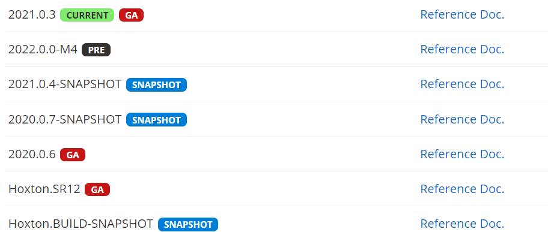

# 一、版本选择

## 1、生成新的Spring Cloud项目

最简单的入门方法是访问[start.spring.io](https://start.spring.io/)，选择您的Spring Boot版本和要使用的Spring Cloud项目。生成项目时，这会将相应的Spring Cloud BOM版本添加到Maven / Gradle文件中。

## 2、将Spring Cloud对应Spring Boot版本

SpringCloud中的版本说明



`SNAPSHOT`：快照版，可以稳定使用，且仍在继续改进版本。

`PRE`：preview edition，预览版,内部测试版. 主要是给开发人员和测试人员测试和找BUG用的，不建议使用；

`RC`：Release Candidate，发行候选版本，基本不再加入新的功能，主要修复bug。是最终发布成正式版的前一个版本，将bug修改完就可以发布成正式版了。

`SR`：Service Release，表示bug修复修正版或更新版，修正了正式版推出后发现的Bug。

`GA`：General Availability，正式发布的版本，官方开始推荐广泛使用，国外有的用GA来表示release版本。

如果您现有的Spring Boot应用程序想要将Spring Cloud添加到该应用程序，则第一步是确定应使用的Spring Cloud版本。您在应用中使用的版本将取决于您使用的Spring Boot的版本。

下表概述了哪个版本的Spring Cloud映射到哪个版本的Spring Boot。

|                         Spring Cloud                         |           Spring Boot            |
| :----------------------------------------------------------: | :------------------------------: |
| [Hoxton](https://github.com/spring-projects/spring-cloud/wiki/Spring-Cloud-Hoxton-Release-Notes) | 2.2.x, 2.3.x (Starting with SR5) |
| [Greenwich](https://github.com/spring-projects/spring-cloud/wiki/Spring-Cloud-Greenwich-Release-Notes) |              2.1.x               |
| [Finchley](https://github.com/spring-projects/spring-cloud/wiki/Spring-Cloud-Finchley-Release-Notes) |              2.0.x               |
| [Edgware](https://github.com/spring-projects/spring-cloud/wiki/Spring-Cloud-Edgware-Release-Notes) |              1.5.x               |
| [Dalston](https://github.com/spring-projects/spring-cloud/wiki/Spring-Cloud-Dalston-Release-Notes) |              1.5.x               |

- 版本对应的详细

  https://start.spring.io/actuator/info对应官网地址

  ```json
  {
  	"git": {
  		"branch": "c3d0cbb64441814bfc39fe8fcb16f6210bc1ae6d",
  		"commit": {
  			"id": "c3d0cbb",
  			"time": "2022-02-20T16:22:17Z"
  		}
  	},
  	"build": {
  		"version": "0.0.1-SNAPSHOT",
  		"artifact": "start-site",
  		"versions": {
  			"spring-boot": "2.6.3",
  			"initializr": "0.13.0-SNAPSHOT"
  		},
  		"name": "start.spring.io website",
  		"time": "2022-02-20T19:25:58.756Z",
  		"group": "io.spring.start"
  	},
  	"bom-ranges": {
  		"azure": {
  			"3.2.0": "Spring Boot >=2.3.0.M1 and <2.4.0-M1",
  			"3.5.0": "Spring Boot >=2.4.0.M1 and <2.5.0-M1",
  			"3.13.0": "Spring Boot >=2.5.0.M1 and <2.7.0-M1"
  		},
  		"codecentric-spring-boot-admin": {
  			"2.4.3": "Spring Boot >=2.3.0.M1 and <2.5.0-M1",
  			"2.5.5": "Spring Boot >=2.5.0.M1 and <2.6.0-M1",
  			"2.6.2": "Spring Boot >=2.6.0.M1 and <2.7.0-M1"
  		},
  		"solace-spring-boot": {
  			"1.1.0": "Spring Boot >=2.3.0.M1 and <2.6.0-M1"
  		},
  		"solace-spring-cloud": {
  			"1.1.1": "Spring Boot >=2.3.0.M1 and <2.4.0-M1",
  			"2.1.0": "Spring Boot >=2.4.0.M1 and <2.6.0-M1"
  		},
  		"spring-cloud": {
  			"Hoxton.SR12": "Spring Boot >=2.2.0.RELEASE and <2.4.0.M1",
  			"2020.0.5": "Spring Boot >=2.4.0.M1 and <2.6.0-M1",
  			"2021.0.0-M1": "Spring Boot >=2.6.0-M1 and <2.6.0-M3",
  			"2021.0.0-M3": "Spring Boot >=2.6.0-M3 and <2.6.0-RC1",
  			"2021.0.0-RC1": "Spring Boot >=2.6.0-RC1 and <2.6.1",
  			"2021.0.1": "Spring Boot >=2.6.1 and <2.6.4-SNAPSHOT",
  			"2021.0.2-SNAPSHOT": "Spring Boot >=2.6.4-SNAPSHOT and <3.0.0-M1",
  			"2022.0.0-M1": "Spring Boot >=3.0.0-M1 and <3.1.0-M1"
  		},
  		"spring-cloud-gcp": {
  			"2.0.8": "Spring Boot >=2.4.0-M1 and <2.6.0-M1",
  			"3.1.0": "Spring Boot >=2.6.0-M1 and <2.7.0-M1"
  		},
  		"spring-cloud-services": {
  			"2.3.0.RELEASE": "Spring Boot >=2.3.0.RELEASE and <2.4.0-M1",
  			"2.4.1": "Spring Boot >=2.4.0-M1 and <2.5.0-M1",
  			"3.3.0": "Spring Boot >=2.5.0-M1 and <2.6.0-M1",
  			"3.4.0": "Spring Boot >=2.6.0-M1 and <2.7.0-M1"
  		},
  		"spring-geode": {
  			"1.3.12.RELEASE": "Spring Boot >=2.3.0.M1 and <2.4.0-M1",
  			"1.4.13": "Spring Boot >=2.4.0-M1 and <2.5.0-M1",
  			"1.5.9": "Spring Boot >=2.5.0-M1 and <2.6.0-M1",
  			"1.6.3": "Spring Boot >=2.6.0-M1 and <2.7.0-M1",
  			"1.7.0-M1": "Spring Boot >=2.7.0-M1 and <2.8.0-M1"
  		},
  		"vaadin": {
  			"14.8.4": "Spring Boot >=2.1.0.RELEASE and <2.8.0-M1"
  		},
  		"wavefront": {
  			"2.0.2": "Spring Boot >=2.1.0.RELEASE and <2.4.0-M1",
  			"2.1.1": "Spring Boot >=2.4.0-M1 and <2.5.0-M1",
  			"2.2.2": "Spring Boot >=2.5.0-M1 and <2.7.0-M1"
  		}
  	},
  	"dependency-ranges": {
  		"native": {
  			"0.9.0": "Spring Boot >=2.4.3 and <2.4.4",
  			"0.9.1": "Spring Boot >=2.4.4 and <2.4.5",
  			"0.9.2": "Spring Boot >=2.4.5 and <2.5.0-M1",
  			"0.10.0": "Spring Boot >=2.5.0-M1 and <2.5.2",
  			"0.10.1": "Spring Boot >=2.5.2 and <2.5.3",
  			"0.10.2": "Spring Boot >=2.5.3 and <2.5.4",
  			"0.10.3": "Spring Boot >=2.5.4 and <2.5.5",
  			"0.10.4": "Spring Boot >=2.5.5 and <2.5.6",
  			"0.10.5": "Spring Boot >=2.5.6 and <2.5.9",
  			"0.10.6": "Spring Boot >=2.5.9 and <2.6.0-M1",
  			"0.11.0-M1": "Spring Boot >=2.6.0-M1 and <2.6.0-RC1",
  			"0.11.0-M2": "Spring Boot >=2.6.0-RC1 and <2.6.0",
  			"0.11.0-RC1": "Spring Boot >=2.6.0 and <2.6.1",
  			"0.11.0": "Spring Boot >=2.6.1 and <2.6.2",
  			"0.11.1": "Spring Boot >=2.6.2 and <2.6.2",
  			"0.11.2": "Spring Boot >=2.6.3 and <2.6.4-SNAPSHOT",
  			"0.11.3-SNAPSHOT": "Spring Boot >=2.6.4-SNAPSHOT and <2.7.0-M1"
  		},
  		"okta": {
  			"1.4.0": "Spring Boot >=2.2.0.RELEASE and <2.4.0-M1",
  			"1.5.1": "Spring Boot >=2.4.0-M1 and <2.4.1",
  			"2.0.1": "Spring Boot >=2.4.1 and <2.5.0-M1",
  			"2.1.4": "Spring Boot >=2.5.0-M1 and <2.7.0-M1"
  		},
  		"mybatis": {
  			"2.1.4": "Spring Boot >=2.1.0.RELEASE and <2.5.0-M1",
  			"2.2.2": "Spring Boot >=2.5.0-M1"
  		},
  		"camel": {
  			"3.5.0": "Spring Boot >=2.3.0.M1 and <2.4.0-M1",
  			"3.10.0": "Spring Boot >=2.4.0.M1 and <2.5.0-M1",
  			"3.13.0": "Spring Boot >=2.5.0.M1 and <2.6.0-M1",
  			"3.15.0": "Spring Boot >=2.6.0.M1 and <2.7.0-M1"
  		},
  		"picocli": {
  			"4.6.2": "Spring Boot >=2.4.0.RELEASE and <2.6.0-M1"
  		},
  		"open-service-broker": {
  			"3.2.0": "Spring Boot >=2.3.0.M1 and <2.4.0-M1",
  			"3.3.1": "Spring Boot >=2.4.0-M1 and <2.5.0-M1",
  			"3.4.0-M2": "Spring Boot >=2.5.0-M1 and <2.6.0-M1"
  		}
  	}
  }
  ```

## 3、本次项目使用版本

|            组件             |     版本      |
| :-------------------------: | :-----------: |
|            cloud            |  Hoxton.SR10  |
|            boot             | 2.3.9.RELEASE |
|        druid.version        |    1.1.16     |
|          java jdk           |     Java8     |
|            Maven            |     3.8.1     |
|            Mysql            |    8.0.16     |
| mybatis.spring.boot.version |     1.3.0     |
|        junit.version        |     4.12      |
|        log4j.version        |    1.2.17     |

spring Cloud为开发人员提供了工具，可以快速构建分布式系统中的一些常见模式(例如配置管理、服务发现、断路器、智能路由、微代理、控制总线)。分布式系统的协调导致了模板模式，使用Spring Cloud开发人员可以快速支持实现这些模式的服务和应用程序。它们可以在任何分布式环境中很好地工作，包括开发人员自己的笔记本电脑、裸金属数据中心和诸如Cloud Foundry这样的托管平台。

==最新可使用==：

- 发行cloud版本：**Hoxton.SR12**
- 支持的boot版本：**2.3.12.RELEASE**

## 4、截止2020年cloud技术使用情况


# 二、父项目的构建(BeginnerSpringCloud)

微服务的构建步骤主要有：

- 建model
- 改pom
- 写yml
- 主启动
- 业务类

## 1、settings配置

### 创建项目

- 使用maven创建基本工程，创建项目BeginnerSpringCloud

### 字符编码

- 统一使用UTF-8字符编码

  

### 注解生效激活


### 选择java版本

- java选择8版本

  

## 2、父项目pom.xml

```xml
<properties>
        <project.build.sourceEncoding>UTF-8</project.build.sourceEncoding>
        <project.reporting.outputEncoding>UTF-8</project.reporting.outputEncoding>
        <spring.cloud.version>Hoxton.SR10</spring.cloud.version>
        <spring.boot.version>2.3.9.RELEASE</spring.boot.version>
        <mysql.version>8.0.16</mysql.version>
        <druid.version>1.1.16</druid.version>
        <mybatis.spring.boot.version>1.3.0</mybatis.spring.boot.version>
        <log4j.version>1.2.17</log4j.version>
        <junit.version>4.12</junit.version>
        <lombok.version>1.18.18</lombok.version>
    </properties>
    <dependencyManagement>
        <dependencies>
            <!-- springCloud -->
            <dependency>
                <groupId>org.springframework.cloud</groupId>
                <artifactId>spring-cloud-dependencies</artifactId>
                <version>${spring.cloud.version}</version>
                <type>pom</type>
                <scope>import</scope>
            </dependency>
            <!-- spring boot -->
            <dependency>
                <groupId>org.springframework.boot</groupId>
                <artifactId>spring-boot-dependencies</artifactId>
                <version>${spring.boot.version}</version>
                <type>pom</type>
                <scope>import</scope>
            </dependency>
            <!-- mysql驱动 -->
            <dependency>
                <groupId>mysql</groupId>
                <artifactId>mysql-connector-java</artifactId>
                <version>${mysql.version}</version>
            </dependency>
            <!-- mybatis -->
            <dependency>
                <groupId>org.mybatis.spring.boot</groupId>
                <artifactId>mybatis-spring-boot-starter</artifactId>
                <version>${mybatis.spring.boot.version}</version>
            </dependency>
            <dependency>
                <groupId>org.mybatis.spring.boot</groupId>
                <artifactId>mybatis-spring-boot-starter</artifactId>
                <version>${mybatis.spring.boot.version}</version>
            </dependency>
            <!-- alibaba druid -->
            <dependency>
                <groupId>com.alibaba</groupId>
                <artifactId>druid</artifactId>
                <version>${druid.version}</version>
            </dependency>
            <!-- log4j -->
            <dependency>
                <groupId>log4j</groupId>
                <artifactId>log4j</artifactId>
                <version>${log4j.version}</version>
            </dependency>
            <!-- junit -->
            <dependency>
                <groupId>junit</groupId>
                <artifactId>junit</artifactId>
                <version>${junit.version}</version>
            </dependency>
            <!-- lombok -->
            <dependency>
                <groupId>org.projectlombok</groupId>
                <artifactId>lombok</artifactId>
                <version>${lombok.version}</version>
            </dependency>
        </dependencies>
    </dependencyManagement>
    <build>
        <finalName>app</finalName>
        <plugins>
            <plugin>
                <groupId>org.springframework.boot</groupId>
                <artifactId>spring-boot-maven-plugin</artifactId>
                <version>2.6.1</version>
            </plugin>
        </plugins>
    </build>
```

- dependencyManagement里只是声明依赖，==并不会导入依赖== ，所以在子项目中要显示的声明所需要的依赖。
- <font color=red>如果不在子项目中声明依赖，是不会从父项目继承该依赖的，只有在子项目中写了具体依赖并且未指定其版本才会在父项目继承，其中version和scope都会继承父pom文件</font>
- 子项目中==使用了版本号== ，就会使用子项目的jar包

# 三、构建公共模块

## 1、新建模块并添加pom

服务名称：==AzCommon==;

```XML
<dependencies>
    <dependency>
        <groupId>org.projectlombok</groupId>
        <artifactId>lombok</artifactId>
    </dependency>
</dependencies>
```

## 2、新建User模块公共类

在User模块中我们将使用到User实体类，创建User.java

```java
package com.daniel.cloud.user.entity;

import lombok.Data;

@Data
public class User {
    private Long id;
    private String username;
    private String address;
}
```

# 三、构建User模块

## 1.创建微服务模块

服务名称：==UserApplication（8800）==;

## 2.在pom添加依赖

```xml
<properties>
        <maven.compiler.source>8</maven.compiler.source>
        <maven.compiler.target>8</maven.compiler.target>
    </properties>
    <dependencies>
<!--        引入公共api-->
        <dependency>
            <groupId>com.daniel.cloud</groupId>
            <artifactId>cloud_api</artifactId>
            <version>0.0.1-SNAPSHOT</version>
        </dependency>
        <dependency>
            <groupId>log4j</groupId>
            <artifactId>log4j</artifactId>
        </dependency>
        
        <dependency>
            <groupId>org.springframework.cloud</groupId>
            <artifactId>spring-cloud-starter-netflix-eureka-client</artifactId>
        </dependency>
        <dependency>
            <groupId>org.springframework.boot</groupId>
            <artifactId>spring-boot-starter-web</artifactId>
        </dependency>
        <dependency>
            <groupId>org.springframework.boot</groupId>
            <artifactId>spring-boot-starter-actuator</artifactId>
        </dependency>
        <dependency>
            <groupId>org.mybatis.spring.boot</groupId>
            <artifactId>mybatis-spring-boot-starter</artifactId>
        </dependency>
        <dependency>
            <groupId>com.alibaba</groupId>
            <artifactId>druid-spring-boot-starter</artifactId>
            <version>1.1.16</version>
        </dependency>
        <!--mysql-connector-java-->
        <dependency>
            <groupId>mysql</groupId>
            <artifactId>mysql-connector-java</artifactId>
        </dependency>
        <!--jdbc-->
        <dependency>
            <groupId>org.springframework.boot</groupId>
            <artifactId>spring-boot-starter-jdbc</artifactId>
        </dependency>
        <dependency>
            <groupId>org.springframework.boot</groupId>
            <artifactId>spring-boot-devtools</artifactId>
            <scope>runtime</scope>
            <optional>true</optional>
        </dependency>
        <dependency>
            <groupId>org.springframework.boot</groupId>
            <artifactId>spring-boot-starter-test</artifactId>
            <scope>test</scope>
        </dependency>
    </dependencies>
    <build>
        <finalName>app</finalName>
        <plugins>
            <plugin>
                <groupId>org.springframework.boot</groupId>
                <artifactId>spring-boot-maven-plugin</artifactId>
            </plugin>
        </plugins>
    </build>

```

## 3.编写yml文件

- ==application.xml==

```yml
server:
  port: 8800
spring:
  application:
    name: AaUserService
  datasource:
    # 当前数据源操作类型
    type: com.alibaba.druid.pool.DruidDataSource
    # mysql驱动类
    driver-class-name: com.mysql.cj.jdbc.Driver
    url: jdbc:mysql://rm-2ze5r466gf23tkopqqo.mysql.rds.aliyuncs.com:3306/spring_cloud?useUnicode=true&useJDBCCompliantTimezoneShift=true&useLegacyDatetimeCode=false&serverTimezone=UTC
    username: daniel
    password: Daniel2118
mybatis:
  mapper-locations: classpath*:mapper/*.xml
  type-aliases-package: com.daniel.cloud.user.entity
  # 它一般对应我们的实体类所在的包，这个时候会自动取对应包中不包括包名的简单类名作为包括包名的别名。多个package之间可以用逗号或者分号等来进行分隔（value的值一定要是包的全）
eureka:
  client:
    # 表示自己就是注册中心，不用注册自己
    register-with-eureka: false
    # 表示自己就是注册中心，不用去注册中心获取其他服务的地址
    fetch-registry: false
```

==在eureaka中配置register-with-eureka: false和fetch-registry: false后防止注册报错==

## 4.编写主启动类

```java
@SpringBootApplication
public class UserApplication {
    public static void main(String[] args) {
        SpringApplication.run(UserApplication.class, args);
    }
}
```

## 5.业务类

### 建MySQL数据库及表

```mysql
CREATE TABLE `tb_user` (
    `id` bigint(20) NOT NULL AUTO_INCREMENT,
    `username` varchar(100) CHARACTER SET utf8 COLLATE utf8_general_ci DEFAULT NULL COMMENT '收件人',
    `address` varchar(255) CHARACTER SET utf8 COLLATE utf8_general_ci DEFAULT NULL COMMENT '地址',
    PRIMARY KEY (`id`) USING BTREE,
    UNIQUE KEY `username` (`username`) USING BTREE
) ENGINE=InnoDB AUTO_INCREMENT=109 DEFAULT CHARSET=utf8 ROW_FORMAT=COMPACT;

INSERT INTO `tb_user` (`id`, `username`, `address`) VALUES ('1','柳岩','湖南省衡阳市');
INSERT INTO `tb_user` (`id`, `username`, `address`) VALUES ('2','文二狗','陕西省西安市');
INSERT INTO `tb_user` (`id`, `username`, `address`) VALUES ('3','华沉鱼','湖北省十堰市');
INSERT INTO `tb_user` (`id`, `username`, `address`) VALUES ('4','张必沉','天津市');
INSERT INTO `tb_user` (`id`, `username`, `address`) VALUES ('5','郑爽爽','辽宁省沈阳市大东区');
INSERT INTO `tb_user` (`id`, `username`, `address`) VALUES ('6','范兵兵','山东省青岛市');
```

### entity层（实体类）

在公共模块（`AzCommon`）中新建User类，前面我们已经新建过

### mapper层（数据访问层）

`UserMapper.java`

```java
@Mapper
public interface UserMapper {
    /**
     * 根据id查询用户
     * @param id
     * @return
     */
    User findById(@Param("id") Long id);

    /**
     * 查询所有用户
     * @return
     */
    List<User> findAll();
}
```

==在resources目录下建立mapper文件对应yml文件路径==

`UserMapper.xml`

```xml
<?xml version="1.0" encoding="UTF-8" ?>
<!DOCTYPE mapper
        PUBLIC "-//mybatis.org//DTD Mapper 3.0//EN"
        "http://mybatis.org/dtd/mybatis-3-mapper.dtd">
<mapper namespace="com.daniel.cloud.mapper.UserMapper">
    <resultMap id="userMap" type="User">
        <result property="address" column="address"></result>
        <result property="id" column="id"></result>
        <result property="username" column="username"></result>
    </resultMap>
    <select id="findById" resultMap="userMap" parameterType="java.lang.Long">
        select * from tb_user where id = #{id}
    </select>
    <select id="findAll" resultMap="userMap">
        select * from tb_user
    </select>
</mapper>
```

### service层

```java
@Service
public class UserService {

    @Autowired
    private UserMapper userMapper;

    public User queryById(Long id) {
        return userMapper.findById(id);
    }

    public List<User> findAll(){
        return userMapper.findAll();
    }
}
```


### controller层（控制器）

```java
@Slf4j
@RestController
@RequestMapping("/user")
public class UserController {

    @Autowired
    private UserService userService;

    @Autowired
    private PatternProperties properties;

    @GetMapping("prop")
    public PatternProperties properties() {
        return properties;
    }

    @GetMapping("now")
    public String now() {
        return LocalDateTime.now().format(DateTimeFormatter.ofPattern(properties.getDateformat()));
    }

    @GetMapping("/{id}")
    public User queryById(@PathVariable("id") Long id,
                          @RequestHeader(value = "Truth", required = false) String truth) {
        System.out.println("truth: " + truth);
        return userService.queryById(id);
    }

    @GetMapping("/all")
    public List<User> queryById() {
        return userService.findAll();
    }
}
```

### 日志

使用log4j

```properties
#设置
log4j.rootLogger=debug,stdout,D,E
#输出信息到控制抬
log4j.appender.stdout=org.apache.log4j.ConsoleAppender
log4j.appender.stdout.Target=System.out
log4j.appender.stdout.layout=org.apache.log4j.PatternLayout
log4j.appender.stdout.layout.ConversionPattern=[%-5p] %d{yyyy-MM-dd HH:mm:ss,SSS} method:%l%n%m%n
#输出DEBUG 级别以上的日志到=D:/Users/10192/Desktop/SSM-整合/src/main/logs/log.log
log4j.appender.D=org.apache.log4j.DailyRollingFileAppender
#配置你自己的log.log输出路径
log4j.appender.D.File=D:/logs/log.log
log4j.appender.D.Append=true
log4j.appender.D.Threshold=DEBUG
log4j.appender.D.layout=org.apache.log4j.PatternLayout
log4j.appender.D.layout.ConversionPattern=%-d{yyyy-MM-dd HH:mm:ss}  [ %t:%r ] - [ %p ]  %m%n
#输出ERROR 级别以上的日志到=D:/Users/10192/Desktop/SSM-整合/src/main/logs/error.log
log4j.appender.E=org.apache.log4j.DailyRollingFileAppender
#配置你自己的error.log的输出路径
log4j.appender.E.File=D:/logs/error.log
log4j.appender.E.Append=true
log4j.appender.E.Threshold=ERROR
log4j.appender.E.layout=org.apache.log4j.PatternLayout
log4j.appender.E.layout.ConversionPattern=%-d{yyyy-MM-dd HH:mm:ss}  [ %t:%r ] - [ %p ]  %m%n
```

# 三、构建Order模块

## 1、新建model

创建服务：==AbOrderService(8810)==

## 2、改pom

```xml
<dependencies>
        <!-- 引入公共模块 -->
        <dependency>
            <groupId>com.daniel.cloud</groupId>
            <artifactId>AzCommon</artifactId>
            <version>1.0-SNAPSHOT</version>
        </dependency>
        <!-- spring boot -->
        <dependency>
            <groupId>org.springframework.boot</groupId>
            <artifactId>spring-boot-starter-web</artifactId>
        </dependency>
        <!-- mysql-->
        <dependency>
            <groupId>mysql</groupId>
            <artifactId>mysql-connector-java</artifactId>
        </dependency>
        <!--mybatis-->
        <dependency>
            <groupId>org.mybatis.spring.boot</groupId>
            <artifactId>mybatis-spring-boot-starter</artifactId>
        </dependency>
        <dependency>
            <groupId>com.alibaba</groupId>
            <artifactId>druid</artifactId>
        </dependency>
    </dependencies>
```

## 3、编写application.yml

```yaml
server:
  port: 8810
spring:
  application:
    name: AbOrderService
  datasource:
    # 当前数据源操作类型
    type: com.alibaba.druid.pool.DruidDataSource
    # mysql驱动类
    driver-class-name: com.mysql.cj.jdbc.Driver
    url: jdbc:mysql://rm-2ze5r466gf23tkopqqo.mysql.rds.aliyuncs.com:3306/spring_cloud?useUnicode=true&useJDBCCompliantTimezoneShift=true&useLegacyDatetimeCode=false&serverTimezone=UTC
    username: daniel
    password: Daniel2118
mybatis:
  mapper-locations: classpath*:mapper/*.xml
  type-aliases-package: com.daniel.cloud.order.entity
  # 它一般对应我们的实体类所在的包，这个时候会自动取对应包中不包括包名的简单类名作为包括包名的别名。多个package之间可以用逗号或者分号等来进行分隔（value的值一定要是包的全）
eureka:
  client:
    # 表示自己就是注册中心，不用注册自己
    register-with-eureka: false
    # 表示自己就是注册中心，不用去注册中心获取其他服务的地址
    fetch-registry: false
```

## 4、编写主启动类

```java
@SpringBootApplication
public class OrderApplication {
    public static void main(String[] args) {
        SpringApplication.run(OrderApplication.class,args);
    }
}
```

## 5、业务类

### 数据库

新建表`tb_order`

```sql
CREATE TABLE `tb_order` (
    `id` bigint(20) NOT NULL AUTO_INCREMENT COMMENT '订单id',
    `user_id` bigint(20) NOT NULL COMMENT '用户id',
    `name` varchar(100) CHARACTER SET utf8 COLLATE utf8_general_ci DEFAULT NULL COMMENT '商品名称',
    `price` bigint(20) NOT NULL COMMENT '商品价格',
    `num` int(10) DEFAULT '0' COMMENT '商品数量',
    PRIMARY KEY (`id`) USING BTREE,
    UNIQUE KEY `username` (`name`) USING BTREE
) ENGINE=InnoDB AUTO_INCREMENT=109 DEFAULT CHARSET=utf8 ROW_FORMAT=COMPACT;

INSERT INTO `tb_order` (`id`, `user_id`, `name`, `price`, `num`) VALUES ('101','1','Apple 苹果 iPhone 12 ','699900','1');
INSERT INTO `tb_order` (`id`, `user_id`, `name`, `price`, `num`) VALUES ('102','2','雅迪 yadea 新国标电动车','209900','1');
INSERT INTO `tb_order` (`id`, `user_id`, `name`, `price`, `num`) VALUES ('103','3','骆驼（CAMEL）休闲运动鞋女','43900','1');
INSERT INTO `tb_order` (`id`, `user_id`, `name`, `price`, `num`) VALUES ('104','4','小米10 双模5G 骁龙865','359900','1');
INSERT INTO `tb_order` (`id`, `user_id`, `name`, `price`, `num`) VALUES ('105','5','OPPO Reno3 Pro 双模5G 视频双防抖','299900','1');
INSERT INTO `tb_order` (`id`, `user_id`, `name`, `price`, `num`) VALUES ('106','6','美的（Midea) 新能效 冷静星II ','544900','1');
INSERT INTO `tb_order` (`id`, `user_id`, `name`, `price`, `num`) VALUES ('107','2','西昊/SIHOO 人体工学电脑椅子','79900','1');
INSERT INTO `tb_order` (`id`, `user_id`, `name`, `price`, `num`) VALUES ('108','3','梵班（FAMDBANN）休闲男鞋','31900','1');


```

### 编写实体类

在公共模块中新建Order类

### mapper层

```java
@Mapper
public interface OrderMapper {
    Order findById(Long id);
}
```

### service层

```java
@Service
public class OrderService {

    @Autowired
    private OrderMapper orderMapper;

    public Order queryOrderById(Long orderId) {
        // 1.查询订单
        Order order = orderMapper.findById(orderId);
        // 4.返回
        return order;
    }
}
```


### controller层

```java
@RestController
@RequestMapping("/order")
public class OrderController {

    @Autowired
    private OrderService orderService;

    @GetMapping("{orderId}")
    public Order queryOrderByUserId(@PathVariable("orderId") Long orderId) {
        // 根据id查询订单并返回
        return orderService.queryOrderById(orderId);
    }
}
```

# 四、服务远程调用

## 1、远程调用分析

### 调用数据问题

我们在开发过程中无法避免的会接触到服务之间的调用，例如：当我们查询订单时想要查询该订单的用户信息时，需要两个服务之间的相互调用

我们直接调用：GET http://localhost:8810/order/101，返回的数据中user是null 如下：

```json
{
  "id": 101,
  "price": 699900,
  "name": "Apple 苹果 iPhone 12 ",
  "num": 1,
  "userId": 1,
  "user": null
}
```

此时User服务只能查到用户信息，Order服务只能查询订单信息

### 分析

如何让Order被调用时查询user服务的数据呢

首先User服务中包含接口：`/user/{id}`

所以如果Order中能够直接调用该接口，即可获取到用户信息

## 2、注册RestTemplate

在OrderServer的OrderApplication中注册RestTemplate，初次使用直接在启动类中添加，后续我们可以在配置类中写

```java
@SpringBootApplication
public class OrderApplication {
    public static void main(String[] args) {
        SpringApplication.run(OrderApplication.class,args);
    }
    
    @Bean
    public RestTemplate restTemplate(){
        return new RestTemplate();
    }
}
```

## 3、更改业务层

```java
@Service
public class OrderService {

    @Autowired
    private OrderMapper orderMapper;

    @Autowired
    private RestTemplate restTemplate;

    public Order queryOrderById(Long orderId) {
        // 1.查询订单
        Order order = orderMapper.findById(orderId);
        // 2.查询用户信息
        // 2.1 请求地址
        String url = "http://localhost:8800/user/"+order.getUserId();

        //3.发送请求
        User user = restTemplate.getForObject(url, User.class);
        order.setUser(user);

        // 4.返回
        return order;
    }
}
```

## 4、测试

请求：GET http://localhost:8810/order/103

```json
{
  "id": 103,
  "price": 43900,
  "name": "骆驼（CAMEL）休闲运动鞋女",
  "num": 1,
  "userId": 3,
  "user": {
    "id": 3,
    "username": "华沉鱼",
    "address": "湖北省十堰市"
  }
}
```

