# 一、提供者与消费者

在服务调用关系中，会有两个不同的角色：

**服务提供者**：一次业务中，被其它微服务调用的服务。（提供接口给其它微服务）

**服务消费者**：一次业务中，调用其它微服务的服务。（调用其它微服务提供的接口）


但是，服务提供者与服务消费者的角色并不是绝对的，而是相对于业务而言。

如果服务A调用了服务B，而服务B又调用了服务C，服务B的角色是什么？

- 对于A调用B的业务而言：A是服务消费者，B是服务提供者
- 对于B调用C的业务而言：B是服务消费者，C是服务提供者


因此，服务B既可以是服务提供者，也可以是服务消费者。

# 二、Eureka的结构和作用

## Eureka的两大组件

回到官网的图片可以看出在这个体系中，有2个主体：Eureka Server和Eureka Client。

### Eureka Server

- 提供服务注册：各个微服务启动时，会通过Eureka Client向Eureka Server进行注册自己的信息（例如服务信息和网络信息），Eureka Server会存储该服务的信息。

- 提供服务信息提供：服务消费者在调用服务时，本地Eureka Client没有的情况下，会到Eureka Server拉取信息。

- 提供服务管理：通过Eureka Client的Cancel、心跳监控、renew等方式来维护该服务提供的信息以确保该服务可用以及服务的更新。

- 信息同步：每个Eureka Server同时也是Eureka Client，多个Eureka Server之间通过P2P复制的方式完成服务注册表的同步。同步时，被同步信息不会同步出去。也就是说有3个Eureka Server，Server1有新的服务信息时，同步到Server2后，Server2和Server3同步时，Server2不会把从Server1那里同步到的信息同步给Server3，只能由Server1自己同步给Server3。

每个可用区有一个Eureka集群，并且每个可用区至少有一个eureka服务器来处理区内故障。为了实现高可用，一般一个可用区中由三个Eureka Server组成。

### Eureka Client

- Eureka Client是一个Java客户端，用于简化与Eureka Server的交互。并且管理当前微服务，同时为当前的微服务提供服务提供者信息。

- Eureka Client会拉取、更新和缓存Eureka Server中的信息。即使所有的Eureka Server节点都宕掉，服务消费者依然可以使用缓存中的信息找到服务提供者。

- Eureka Client在微服务启动后，会周期性地向Eureka Server发送心跳（默认周期为30秒）以续约自己的信息。如果Eureka Server在一定时间内没有接收到某个微服务节点的心跳，Eureka Server将会注销该微服务节点（默认90秒）。

- Eureka Client包含服务提供者Applicaton Service和服务消费者Application Client

- Applicaton Service：服务提供者，提供服务给别个调用。

- Application Client：服务消费者，调用别个提供的服务。

往往大多数服务本身既是服务提供者，也是服务消费者。

其它动作：

- Register：服务注册

当Eureka客户端向Eureka Server注册时，它提供自身的元数据，比如IP地址、端口，运行状况指示符URL，主页等。

- Renew：服务续约

Eureka Client会每隔30秒发送一次心跳来续约。 通过续约来告知Eureka Server该Eureka客户仍然存在，没有出现问题。 正常情况下，如果Eureka Server在90秒没有收到Eureka客户的续约，它会将实例从其注册表中删除。 建议不要更改续约间隔。

- Fetch Registries：获取注册列表信息

Eureka客户端从服务器获取注册表信息，并将其缓存在本地。客户端会使用该信息查找其他服务，从而进行远程调用。该注册列表信息定期（每30秒钟）更新一次。每次返回注册列表信息可能与Eureka客户端的缓存信息不同， Eureka客户端自动处理。如果由于某种原因导致注册列表信息不能及时匹配，Eureka客户端则会重新获取整个注册表信息。 Eureka服务器缓存注册列表信息，整个注册表以及每个应用程序的信息进行了压缩，压缩内容和没有压缩的内容完全相同。Eureka客户端和Eureka 服务器可以使用JSON / XML格式进行通讯。在默认的情况下Eureka客户端使用压缩JSON格式来获取注册列表的信息。

- Cancel：服务下线

Eureka客户端在程序关闭时向Eureka服务器发送取消请求。 发送请求后，该客户端实例信息将从服务器的实例注册表中删除。该下线请求不会自动完成，它需要调用以下内容：

DiscoveryManager.getInstance().shutdownComponent()；

- Eviction 服务剔除

在默认的情况下，当Eureka客户端连续90秒没有向Eureka服务器发送服务续约，即心跳，Eureka服务器会将该服务实例从服务注册列表删除，即服务剔除。

这些问题都需要利用SpringCloud中的注册中心来解决，其中最广为人知的注册中心就是Eureka，其结构如下：


现在再来看问题

问题1：order-service如何得知user-service实例地址？

获取地址信息的流程如下：

- user-service服务实例启动后，将自己的信息注册到eureka-server（Eureka服务端）。这个叫服务注册
- eureka-server保存服务名称到服务实例地址列表的映射关系
- order-service根据服务名称，拉取实例地址列表。这个叫服务发现或服务拉取


问题2：order-service如何从多个user-service实例中选择具体的实例？

- order-service从实例列表中利用负载均衡算法选中一个实例地址
- 向该实例地址发起远程调用


问题3：order-service如何得知某个user-service实例是否依然健康，是不是已经宕机？

- user-service会每隔一段时间（默认30秒）向eureka-server发起请求，报告自己状态，称为心跳
- 当超过一定时间没有发送心跳时，eureka-server会认为微服务实例故障，将该实例从服务列表中剔除
- order-service拉取服务时，就能将故障实例排除了


> 注意：一个微服务，既可以是服务提供者，又可以是服务消费者，因此eureka将服务注册、服务发现等功能统一封装到了eureka-client端

# 三、Eureka的单机环境组建

## 1、eureka-server（9090）构建

新建模块==eureka-server==

注意配置父子pom文件，确定父子关系

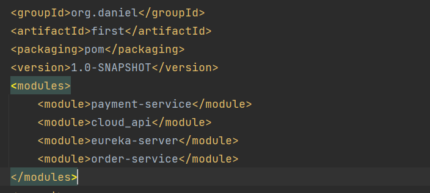

在eureka-server中添加父模块

```xml
<parent>
    <groupId>org.daniel</groupId>
    <artifactId>first</artifactId>
    <version>1.0-SNAPSHOT</version>
</parent>
```

并导入eureka依赖

```xml
<!--        Eureka注意导入server-->
        <dependency>
            <groupId>org.springframework.cloud</groupId>
            <artifactId>spring-cloud-starter-netflix-eureka-server</artifactId>
        </dependency>
```

> 此处之所以没有版本号是应为在父pom中导入了`spring-cloud-dependencies`点进去可以发现已经定义了相关的版本信息
>

新建yml文件

```yaml
server:
  port: 9090
spring:
  application:
    name: eureka-server
eureka:
  client:
    register-with-eureka: false #表示不向注册中心注册自己
#    fetch-registry: false #自己就是服务注册中心，不需要去检索服务
    service-url:
      defaultZone: http://localhost:9090/eureka/
```

主启动

```java
@SpringBootApplication
@EnableEurekaServer
public class EurekaServer {
    
    public static void main(String[] args) {
        SpringApplication.run(EurekaServer.class, args);
    }
    
}
```

==在项目启动类上使用@EnableEurekaServer，可以将项目作为SpringCloud中的注册中心。==激活Eureka服务器相关配置EurekaServerAutoConfiguration的注释，可以将@EnableEurekaServer 这个注解看作是一个开关，开启时，会激活相关配置，会作为注册中心。同时，他又引入了EurekaServerMarkerConfiguration类。

测试

在地址栏输入http://localhost:9090/

出现spring Eureka即配置成功。

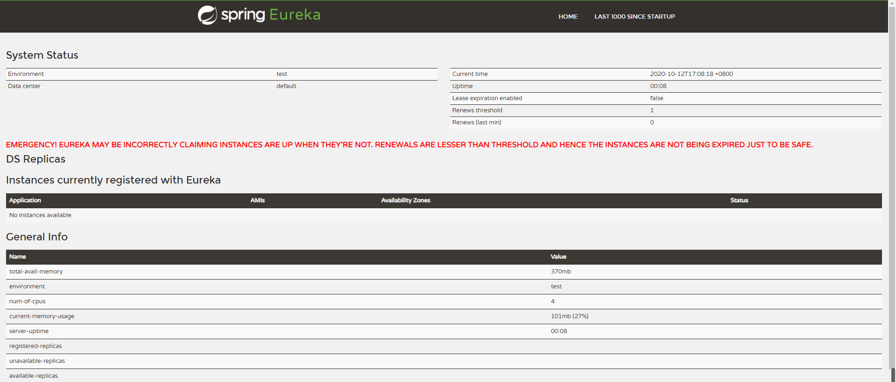

## 2、服务注册

### 将payment-service（9001）

- 添加pom依赖

  ```xml
  <dependency>
      <groupId>org.springframework.cloud</groupId>
      <artifactId>spring-cloud-starter-netflix-eureka-client</artifactId>
  </dependency>
  ```

- 改yml文件

```yml
server:
  port: 9001
spring:
  application:
    name: user-service #user服务名称
  datasource:
    # 当前数据源操作类型
    type: com.alibaba.druid.pool.DruidDataSource
    # mysql驱动类
    driver-class-name: com.mysql.cj.jdbc.Driver
    url: jdbc:mysql://rm-2ze5r466gf23tkopqqo.mysql.rds.aliyuncs.com:3306/spring_cloud?useUnicode=true&useJDBCCompliantTimezoneShift=true&useLegacyDatetimeCode=false&serverTimezone=UTC
    username: daniel
    password: Daniel2118
mybatis:
  mapper-locations: classpath*:mapper/*.xml
  type-aliases-package: com.daniel.cloud.entity
  # 它一般对应我们的实体类所在的包，这个时候会自动取对应包中不包括包名的简单类名作为包括包名的别名。多个package之间可以用逗号或者分号等来进行分隔（value的值一定要是包的全）
eureka:
  client:
    # 表示自己就是注册中心，不用注册自己
#    register-with-eureka: false
    # 表示自己就是注册中心，不用去注册中心获取其他服务的地址
#    fetch-registry: false
    # 注册中心的地址为
    service-url:
      defaultZone: http://localhost:9090/eureka #将payment-service注册到9090端口的eureka
```

==其中spring,.application.name表示该服务的名称也是注册到Eureka中的名称，注意开启注册服务==

- 在主启动上添加注解

  ==在主启动类上添加注解==

  ```java
  @SpringBootApplication
  @EnableEurekaClient //开启EurekaClient，表示自己是客户端
  public class PaymentService9001 {
      public static void main(String[] args) {
          SpringApplication.run(PaymentService9001.class,args);
      }
  }
  ```

  

### order-service（9002）注册到Eureka

导入依赖此步骤与payment-service注册相同此处省略。

### 测试

注意==先开启eureka-server（9090）服务，然后开启其它微服务==

输入http://localhost:9090/，出现下面两个名称则说明注册成功。

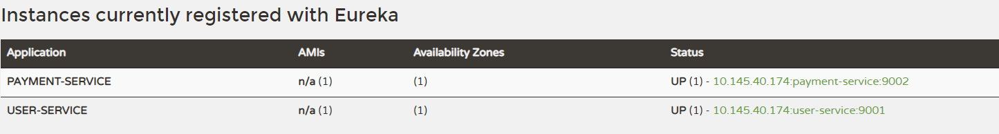

# 四、Eureka多机环境组建

## 1、修改系统文件

由于只有一台机器，所以可以修改windows系统文件模拟多机环境

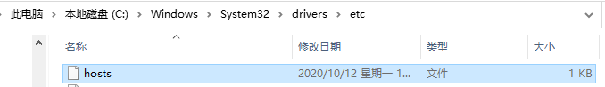

修改hosts添加

```
127.0.0.1 eureka9090.com
127.0.0.1 eureka9091.com
```

## 创建eureka-server1

新建项目==cloud_eureka_server7002==

改pom

```XML
    <dependencies>
        <!--        Eureka注意导入server-->
        <dependency>
            <groupId>org.springframework.cloud</groupId>
            <artifactId>spring-cloud-starter-netflix-eureka-server</artifactId>
        </dependency>
        <!-- SpringBoot整合Web组件 -->
        <dependency>
            <groupId>org.springframework.boot</groupId>
            <artifactId>spring-boot-starter-web</artifactId>
        </dependency>
        <dependency>
            <groupId>org.springframework.boot</groupId>
            <artifactId>spring-boot-starter-actuator</artifactId>
        </dependency>
    </dependencies>
```

写yml

让两个服务都==互相注册，相互守望==，如果有多个EurekaServer在defaultZone中添加其他的服务地址，多个地址之间用==英文逗号==隔开。

```yaml
server:
  port: 9091
spring:
  application:
    name: eureka9091.com
eureka:
  client:
    service-url:
      defaultZone: http://eureka9090.com:9090/eureka/
```

同时改写==eureka-server（9090）==对应的yml

```yaml
server:
  port: 9090
spring:
  application:
    name: eureka9090.com
eureka:
  client:
    service-url:
      defaultZone: http://eureka9091.com:9091/eureka/
```

#### 

$$$$$$$$$$$$$$$$$$$$$$$$$$$$$$


4.5编写主启动类

```java
@SpringBootApplication
@EnableEurekaServer
public class EurekaMain7002 {
    public static void main(String[] args) {
        SpringApplication.run(EurekaMain7002.class,args);
    }
}
```

#### 4.6测试

在地址输入http://eureka9090.com:9090/

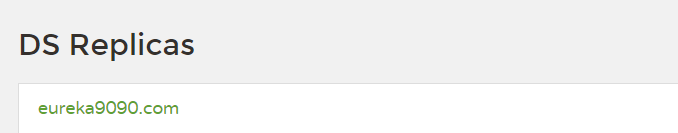

在地址输入http://eureka9091.com:9091/

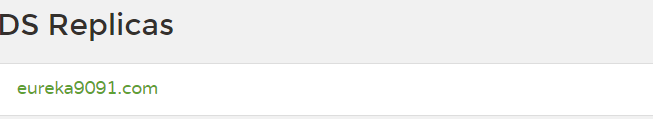

#### 4.7将9001和9002加入到Eureka集群中

修改9001和9001中的yml文件，将其注册到两个server中

```yml
eureka:
  client:
    service-url:
#      defaultZone: http://localhost:9090/eureka/# 单机版
      defaultZone: http://localhost:9090/eureka/,http://eureka9091.com:9091/eureka/
```

> 注意：记得开启eureka的服务注册，将自己注册进去

测试：

==先启动9090和9091，然后等9090和9091启动完毕再启动9001和9002==

访问http://eureka7001.com:7001/

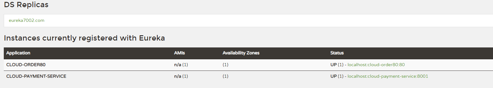

访问http://eureka7002.com:7002/

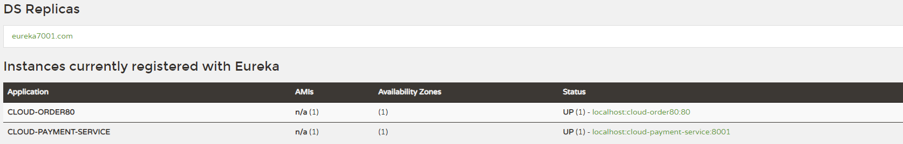

### 5、Eureka负载均衡

#### 5.1新建model

新建cloud_pay_8002结构与8001相同，代码基本相同，需要修改如下：

- pom文件==依赖相同==

- yml文件

  ==将端口号改为8002==

- 主启动

  ```java
  @SpringBootApplication
  @EnableEurekaClient
  public class PayMain8002 {
      public static void main(String[] args){
          SpringApplication.run(PayMain8002.class,args);
      }
  }
  ```

- 业务类

 在controller添加

```java
package com.daniel.cloud.controller;

@RestController
public class PaymentController {
    Logger logger = Logger.getLogger(PaymentController.class);
    @Autowired
    PaymentService paymentService;
    
    @Value("${server.port}")														//注入变量
    private String ServerPort;														//添加端口变量
    @PostMapping(value = "/payment/add")
    public CommonResult add(@RequestBody Payment payment){
        int result = paymentService.add(payment);
        logger.debug("插入一条数据" + result);
        if (result>0){
            return new CommonResult(200,"插入数据库成功,Port:"+ServerPort,result);		//打印端口方便观察
        }else {
            return new CommonResult(444,"插入数据库失败",null);
        }
    }
    
    @GetMapping(value = "/payment/get/{id}")
    public CommonResult getById(@PathVariable("id") Long id){
        Payment payment = paymentService.getPaymentById(id);
        logger.debug("查询到一条数据" + payment);
        if (payment!=null){
            return new CommonResult(200,"查询数据库成功,Port:"+ServerPort,payment);	//打印端口方便观察
        }else {
            return new CommonResult(444,"无对应记录，查询id："+id,null);
        }
    }
}

```

  ==同样把8001服务的controller加上端口，方便观察==

####   5.2修改80端口model

##### 5.2.1修改controller中的PAYMENT_URL

```java
    final String PAYMENT_URL="http://CLOUD-PAYMENT-SERVICE";
```

##### ==5.2.2修改config包下的配置文件==

==开启负载均衡，添加注解@LoadBalanced==

```java
@Configuration
public class OrderConfig {
    @Bean
    @LoadBalanced  							//开启负载均衡
    public RestTemplate getRestTemplate(){
        return new RestTemplate();
    }
}
```

#### 5.3测试

先分别启动7001、7002，启动完毕后再启动80、8001、8002

##### 5.3.1自测

测试http://localhost:8001/payment/get/1

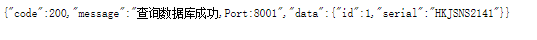

测试http://localhost:8002/payment/get/1

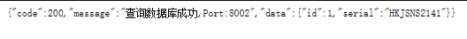

##### 5.3.2测试80

测试http://localhost/order/payment/get/1

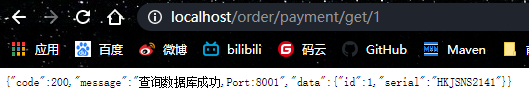

==观察发现port在8001和8002反复切换，证明负载均衡生效==

### 6、修改服务主机名和ip在eureka的web上显示

在8001和8002服务中修改yml，添加如语句：

```yaml
eureka:
  instance:
    instance-id: pay8001
    prefer-ip-address: true   #访问路径可以显示ip地址
```

### 7、eureka服务发现

==对于注册进eureka里面的微服务，可以通过服务来发现该服务的信息。==

#### 7.1controller

以==8001==微服务为例：

```java
//添加discovery
//    注意此处导入的是接口
    @Autowired
    private DiscoveryClient discoveryClient;
    
    @GetMapping(value = "/payment/discovery")
    public Object getDiscovery(){
//        拿到所有注册服务的信息
        List<String> services = discoveryClient.getServices();
        for (String service : services) {
            System.out.println("########element:" +service);
        }
//        拿到指定服务名称的所有的服务注册信息比如8001模块，它与8002模块的名称都相同
//        所以这里返回的是list
        List<ServiceInstance> instances = discoveryClient.getInstances("CLOUD-PAYMENT-SERVICE");
        for (ServiceInstance instance : instances) {
            System.out.println("服务id："+instance.getInstanceId()+
                    "\t服务主机："+instance.getHost()+
                    "\t服务端口："+instance.getPort()+
                    "\t服务Url："+instance.getUri()
                    );
        }
        return this.discoveryClient;
    }
```

#### 7.2在主启动添加注解

==@EnableDiscoveryClient==

```java
@SpringBootApplication
@EnableEurekaClient
@EnableDiscoveryClient			//添加注解
public class PayMain8001 {
    public static void main(String[] args){
        SpringApplication.run(PayMain8001.class,args);
    }
}
```

#### 7.3重启8001测试

输入http://localhost:8001/payment/discovery/

web页面展示

```java
{"discoveryClients":[{"services":["cloud-payment-service","cloud-order80"],"order":0},{"services":[],"order":0}],"services":["cloud-payment-service","cloud-order80"],"order":0}
```

控制台输出：

```java
########element:cloud-payment-service
########element:cloud-order80
服务id：payment8002	服务主机：169.254.207.52	服务端口：8002	服务Url：http://169.254.207.52:8002
服务id：payment8001	服务主机：169.254.207.52	服务端口：8001	服务Url：http://169.254.207.52:8001
```

### 8、Eureka自我保护机制

#### 8.1自我保护背景

首先对Eureka注册中心需要了解的是Eureka各个节点都是平等的，没有ZK中角色的概念， 即使N-1个节点挂掉也不会影响其他节点的正常运行。

默认情况下，==**如果Eureka Server在一定时间内（默认90秒）没有接收到某个微服务实例的心跳，Eureka Server将会移除该实例。**==但是当网络分区故障发生时，微服务与Eureka Server之间无法正常通信，而微服务本身是正常运行的，此时不应该移除这个微服务，所以引入了自我保护机制。

#### 8.2自我保护机制

官方对于自我保护机制的定义：

> 自我保护模式正是一种针对网络异常波动的安全保护措施，使用自我保护模式能使Eureka集群更加的健壮、稳定的运行。

自我保护机制的工作机制是：==**如果在15分钟内超过85%的客户端节点都没有正常的心跳，那么Eureka就认为客户端与注册中心出现了网络故障，Eureka Server自动进入自我保护机制**==，此时会出现以下几种情况：

1. Eureka Server不再从注册列表中移除因为长时间没收到心跳而应该过期的服务。
2. Eureka Server仍然能够接受新服务的注册和查询请求，但是不会被同步到其它节点上，保证当前节点依然可用。
3. 当网络稳定时，当前Eureka Server新的注册信息会被同步到其它节点中。

因此Eureka Server可以很好的应对因网络故障导致部分节点失联的情况，而不会像ZK那样如果有一半不可用的情况会导致整个集群不可用而变成瘫痪。

#### 8.3自我保护开关

Eureka自我保护机制，通过配置`eureka.server.enable-self-preservation`来`true`打开/`false`禁用自我保护机制，==默认打开状态==，建议生产环境打开此配置。

#### 8.4开发环境配置

开发环境中如果要实现服务失效能自动移除，只需要修改以下配置。

##### 8.4.1、 注册中心关闭自我保护机制，修改检查失效服务的时间。

==关闭7001的自我保护==

```yaml
eureka:
  instance:
    hostname: localhost   #单机版
  #    hostname: eureka7001.com #eureka的实例名称 #集群版
  client:
    register-with-eureka: false #表示不向注册中心注册自己
    fetch-registry: false #自己就是服务注册中心，不需要去检索服务
    service-url:
#      defaultZone: http://eureka7002.com:7002/eureka/        #集群版
      defaultzone: http://${eureka.instance.hostname}:${server.port}/eureka/  #单机版
  server:
    enable-self-preservation: true #禁用自我保护
    eviction-interval-timer-in-ms: 3000 #修改检查失效服务的时间
```

##### 8.4.2、 微服务修改减短服务心跳的时间。

==调整8001服务的发送心跳时间间隔及服务端收到心跳等待上限时间==

```yaml
eureka:
  client:
    # 表示自己就是客户端，需要注册到Eureka
    register-with-eureka: true
    # 注册中心获取其他服务的地址
    fetch-registry: true
    # 注册中心的地址为
    service-url:
#      defaultZone: http://eureka7001.com:7001/eureka/,http://eureka7002.com:7002/eureka/
     defaultZone: http://localhost:7001/eureka/   #单机版
  instance:
    instance-id: payment8001
    prefer-ip-address: true   #访问路径可以显示ip地址
    lease-renewal-interval-in-seconds: 1    #Eureka向服务端发送心跳的时间间隔，单位是秒（默认是30秒）
    lease-expiration-duration-in-seconds: 2     #Eureka在服务端收到最后一次心跳等待时间的上限，单位为秒（默认是90秒），超时将剔除服务

```

## 六、服务调用Ribbon

### Ribbon负载均衡:


**Ribbon目前也进入维护,基本上不准备更新了**


**进程内LB(本地负载均衡)**


**集中式LB(服务端负载均衡)**


**区别**


**Ribbon就是负载均衡+RestTemplate**


###3# 使用Ribbon:

##### 1,默认我们使用eureka的新版本时,它默认集成了ribbon:


**==这个starter中集成了reibbon了==**


##### 2,我们也可以手动引入ribbon

**放到order模块中,因为只有order访问pay时需要负载均衡**


##### 3,RestTemplate类:


```java
RestTemplate的:
		xxxForObject()方法,返回的是响应体中的数据
    xxxForEntity()方法.返回的是entity对象,这个对象不仅仅包含响应体数据,还包含响应体信息(状态码等)
```


##### Ribbon常用负载均衡算法:

**IRule接口,Riboon使用该接口,根据特定算法从所有服务中,选择一个服务,**

**Rule接口有7个实现类,每个实现类代表一个负载均衡算法**


##### 使用Ribbon:

**==这里使用eureka的那一套服务==**


**==也就是不能放在主启动类所在的包及子包下==**

###### 1,修改order模块

###### 2,额外创建一个包


###### 3,创建配置类,指定负载均衡算法


###### 4,在主启动类上加一个注解


**表示,访问CLOUD_pAYMENT_SERVICE的服务时,使用我们自定义的负载均衡算法**


##### 自定义负载均衡算法:

###### 1,ribbon的轮询算法原理


###### 2,自定义负载均衡算法:

###### 1,给pay模块(8001,8002),的controller方法添加一个方法,返回当前节点端口


###### 2,修改order模块

去掉@LoadBalanced


###### 3,自定义接口


​					==具体的算法在实现类中实现==

###### 4,接口实现类


###### 5,修改controller:


###### 6,启动服务,测试即可


### 11,OpenFeign


**是一个声明式的web客户端,只需要创建一个接口,添加注解即可完成微服务之间的调用**


==就是A要调用B,Feign就是在A中创建一个一模一样的B对外提供服务的的接口,我们调用这个接口,就可以服务到B==


#### **Feign与OpenFeign区别**


#### 使用OpenFeign

```java
之前的服务间调用,我们使用的是ribbon+RestTemplate
		现在改为使用Feign
```

##### 1,新建一个order项目,用于feign测试

名字cloud_order_feign-80

##### 2,pom文件

##### 3,配置文件


##### 4,主启动类


##### 5,fegin需要调用的其他的服务的接口


##### 6,controller


##### 7测试:

启动两个erueka(7001,7002)

启动两个pay(8001,8002)

启动当前的order模块


**Feign默认使用ribbon实现负载均衡**


#### OpenFeign超时机制:

==OpenFeign默认等待时间是1秒,超过1秒,直接报错==

##### 1,设置超时时间,修改配置文件:

**因为OpenFeign的底层是ribbon进行负载均衡,所以它的超时时间是由ribbon控制**


#### OpenFeign日志:


**OpenFeign的日志级别有:**


##### 	1,使用OpenFeign的日志:

**实现在配置类中添加OpenFeign的日志类**


##### 2,为指定类设置日志级别:


**配置文件中:**


##### 	3,启动服务即可