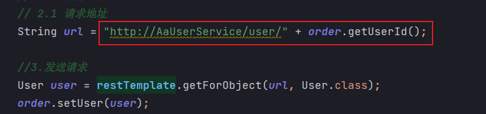
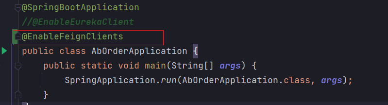
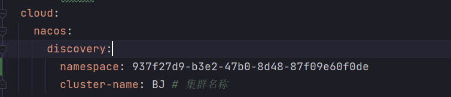
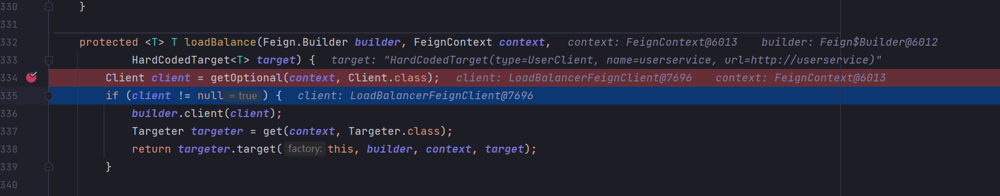
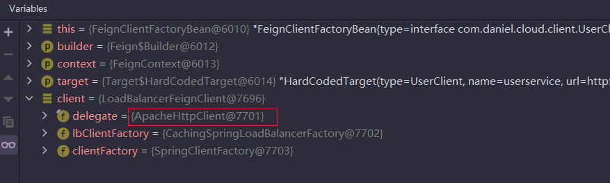
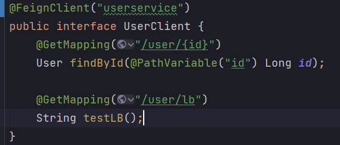
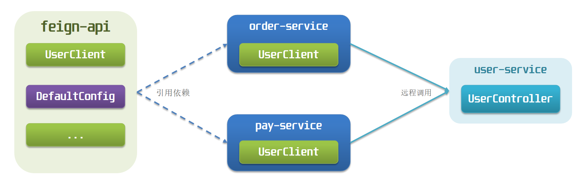
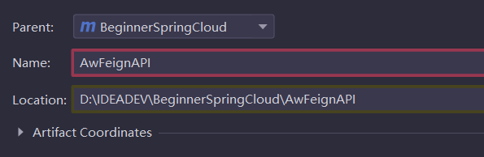
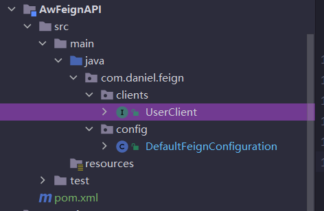
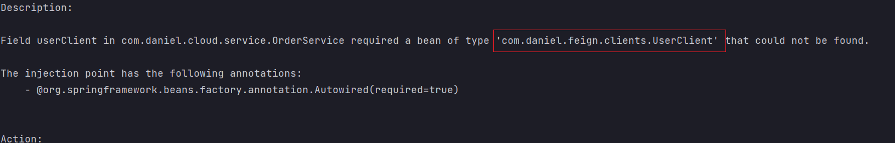

# 一、Feign远程调用

## 1、RestTemplate问题

先来看我们以前利用`RestTemplate`发起远程调用的代码：



存在下面的问题：

> 代码可读性差，编程体验不统一
>
> 参数复杂URL难以维护
>

## 2、Fegin是什么

Feign是一个声明式的http客户端，官方地址：https://github.com/OpenFeign/feign

其作用就是帮助我们优雅的实现http请求的发送，解决上面提到的问题。


Feign 是受[Retrofit](https://github.com/square/retrofit)、[JAXRS-2.0](https://jax-rs-spec.java.net/nonav/2.0/apidocs/index.html)和[WebSocket](http://www.oracle.com/technetwork/articles/java/jsr356-1937161.html)启发的 Java 到 HTTP 客户端绑定器。Feign 的第一个目标是降低将[Denominator](https://github.com/Netflix/Denominator)统一绑定到 HTTP API 的复杂性，而不考虑[ReSTfulness](http://www.slideshare.net/adrianfcole/99problems)。

## 3、Feign替代RestTemplate

Fegin的使用步骤如下：

### 引入依赖

我们在OrderService服务的pom文件中引入feign的依赖：

```xml
<!-- fegin-->
<dependency>
    <groupId>org.springframework.cloud</groupId>
    <artifactId>spring-cloud-starter-openfeign</artifactId>
</dependency>
```


### 添加注解

在`OrderService`的启动类添加注解开启`Feign`的功能：




### 3）编写Feign的客户端

在OrderService中新建一个接口，内容如下：

```java
package com.daniel.cloud.client;

import com.daniel.cloud.user.entity.User;
import org.springframework.cloud.openfeign.FeignClient;
import org.springframework.web.bind.annotation.GetMapping;
import org.springframework.web.bind.annotation.PathVariable;

@FeignClient("userservice")
public interface UserClient {
    @GetMapping("/user/{id}")
    User findById(@PathVariable("id") Long id);
}
```


这个客户端主要是基于`SpringMVC`的注解来声明远程调用的信息，比如：

- 服务名称：userservice
- 请求方式：GET
- 请求路径：/user/{id}
- 请求参数：Long id
- 返回值类型：User

这样，Feign就可以帮助我们发送http请求，无需自己使用RestTemplate来发送了。

### 测试

修改OrderService中的OrderService类中的queryOrderById方法，使用Feign客户端代替RestTemplate：

```java
@Autowired
private UserClient userClient;

public Order queryOrderById(Long orderId) {
    // 1.查询订单
    Order order = orderMapper.findById(orderId);
    // 2.查询用户信息
    User user = userClient.findById(order.getUserId());
    order.setUser(user);
    // 4.返回
    return order;
}
```

重启测试即可，注意order服务和user服务需要在同一命名空间下



### 总结

使用Feign的步骤：

> ① 引入依赖
>
> ② 添加`@EnableFeignClients`注解
>
> ③ 编写`FeignClient`接口
>
> ④ 使用`FeignClient`中定义的方法代替`RestTemplate`
>

`通过测试我们发现Feign也做了负载均衡，但是Feign本身没有负载均衡，而是底层依赖了ribbon`

## 4、自定义配置

Feign可以支持很多的自定义配置，如下表所示：

| 类型                   | 作用             | 说明                                                   |
| ---------------------- | ---------------- | ------------------------------------------------------ |
| **feign.Logger.Level** | 修改日志级别     | 包含四种不同的级别：NONE、BASIC、HEADERS、FULL         |
| feign.codec.Decoder    | 响应结果的解析器 | http远程调用的结果做解析，例如解析json字符串为java对象 |
| feign.codec.Encoder    | 请求参数编码     | 将请求参数编码，便于通过http请求发送                   |
| feign. Contract        | 支持的注解格式   | 默认是SpringMVC的注解                                  |
| feign. Retryer         | 失败重试机制     | 请求失败的重试机制，默认是没有，不过会使用Ribbon的重试 |

一般情况下，默认值就能满足我们使用，如果要自定义时，只需要创建自定义的`@Bean`覆盖默认Bean即可。


下面以日志为例来演示如何自定义配置。

### 配置文件方式

基于配置文件修改feign的日志级别可以针对单个服务：

修改order服务配置

```yaml
feign:  
  client:
    config: 
      userservice: # 针对某个微服务的配置
        loggerLevel: FULL #  日志级别 
```

也可以针对所有服务：

```yaml
feign:  
  client:
    config: 
      default: # 这里用default就是全局配置，如果是写服务名称，则是针对某个微服务的配置
        loggerLevel: FULL #  日志级别 
```


而日志的级别分为四种：

> - `NONE`：不记录任何日志信息，这是默认值。
> - `BASIC`：仅记录请求的方法，URL以及响应状态码和执行时间
> - `HEADERS`：在BASIC的基础上，额外记录了请求和响应的头信息
> - `FULL`：记录所有请求和响应的明细，包括头信息、请求体、元数据。
>


### Java代码方式

也可以基于Java代码来修改日志级别，先声明一个类，然后声明一个Logger.Level的对象：

```java
public class DefaultFeignConfiguration  {
    @Bean
    public Logger.Level feignLogLevel(){
        return Logger.Level.BASIC; // 日志级别为BASIC
    }
}
```


如果要**全局生效**，将其放到启动类的`@EnableFeignClients`这个注解中：

```java
@EnableFeignClients(defaultConfiguration = DefaultFeignConfiguration .class) 
```


如果是**局部生效**，则把它放到对应的@FeignClient这个注解中：

```java
@FeignClient(value = "userservice", configuration = DefaultFeignConfiguration .class) 
```

## 5、Feign使用优化

Feign底层发起http请求，依赖于其它的框架。其底层客户端实现包括：

> `URLConnection`：默认实现，不支持连接池
>
> `Apache HttpClient` ：支持连接池
>
> `OKHttp`：支持连接池


`因此提高Feign的性能主要手段就是使用**连接池**代替默认的URLConnection。`


这里我们用Apache的HttpClient来演示。

### 引入依赖

在OrderService的pom文件中引入Apache的HttpClient依赖：

```xml
<!--httpClient的依赖 -->
<dependency>
    <groupId>io.github.openfeign</groupId>
    <artifactId>feign-httpclient</artifactId>
</dependency>
```


### 配置连接池

在OrderService的application.yml中添加配置：

```yaml
feign:
  client:
    config:
      default:    # 这里用default就是全局配置，如果是写服务名称，则是针对某个微服务的配置
        loggerLevel: FULL #  日志级别
#      userservice: # 针对某个微服务的配置
#        loggerLevel: FULL #  日志级别
  httpclient:
    enabled: true # 开启feign对HttpClient的支持
    max-connections: 200 # 最大的连接数
    max-connections-per-route: 50 # 每个路径的最大连接数
```


接下来，在`FeignClientFactoryBean`中的`loadBalance`方法中打断点：



Debug方式启动OrderService服务，可以看到这里的client，底层就是`Apache HttpClient`：



### 总结

Feign的优化：

1.日志级别尽量用basic

2.使用HttpClient或OKHttp代替URLConnection

①  引入feign-httpClient依赖

②  配置文件开启httpClient功能，设置连接池参数


## 6、最佳实践

所谓最佳实践，就是使用过程中总结的经验，最好的一种使用方式。自习观察可以发现，Feign的客户端与服务提供者的controller代码非常相似：

Order服务中UserService的feign客户端：



UserService中的UserController：


有没有一种办法简化这种重复的代码编写呢？


### 继承方式

一样的代码可以通过继承来共享：

> 1）定义一个API接口，利用定义方法，并基于SpringMVC注解做声明。
>
> 2）Feign客户端和Controller都集成该接口


优点：

- 简单
- 实现了代码共享

缺点：

- 服务提供方、服务消费方紧耦合

- 参数列表中的注解映射并不会继承，因此Controller中必须再次声明方法、参数列表、注解

### 抽取方式

将`Feign`的`Client`抽取为独立模块，并且把默认的Feign配置都放到这个模块中，提供给所有消费者使用。

例如，将`UserClient`、`Feign`的默认配置都抽取到一个`AwFeignAPI`包中，所有微服务引用该依赖包，即可直接使用。




### 抽取方式的实践

#### 抽取

首先创建一个module，命名为AwFeignAPI：



在AwFeignAPI中然后引入feign的starter依赖和公共API

```xml
<dependency>
    <groupId>com.daniel.cloud</groupId>
    <artifactId>AzCommon</artifactId>
    <version>1.0-SNAPSHOT</version>
</dependency>
<dependency>
    <groupId>org.springframework.cloud</groupId>
    <artifactId>spring-cloud-starter-openfeign</artifactId>
</dependency>
```


然后，OrderService中编写的UserClient、User、DefaultFeignConfiguration都复制到AwFeignAPI项目中




#### 在OrderService中使用AwFeignAPI

首先，删除OrderService中的UserClient、DefaultFeignConfiguration等类或接口。

在OrderService的pom文件中中引入AwFeignAPI的依赖：

```xml
<!-- 使用AwFeignAPI-->
<dependency>
    <groupId>com.daniel.cloud</groupId>
    <artifactId>AwFeignAPI</artifactId>
    <version>1.0-SNAPSHOT</version>
</dependency>
```

`修改OrderService中的所有与上述组件有关的导包部分，改成导入AwFeignAPI中的包`


#### 重启测试

重启后，发现服务报错了：




这是因为UserClient现在在`com.daniel.feign.clients`包下，

而OrderService的@EnableFeignClients注解是在`com.daniel.cloud`包下，不在同一个包，无法扫描到UserClient。


#### 解决扫描包问题

方式一：

指定Feign应该扫描的包：

```java
@EnableFeignClients(basePackages = "com.daniel.feign.clients")
```


方式二：

指定需要加载的Client接口：

```java
@EnableFeignClients(clients = {UserClient.class})
```

