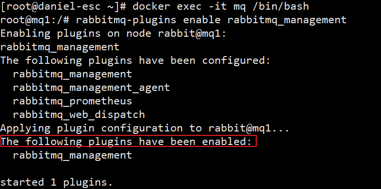

# 导语

##### 该篇文章主要是在docker中部署`RabbitMQ`，前面已经学习过了RabbitMQ的基础内容，该笔记会再次复习前面所学但是不再注重基础内容的讲解，所以该笔记重点是RabbitMQ在分布式服务中的使用，如果需要查看基础详细内容请查看：[RabbitMQ详细基础内容](../MessageQueue/RabbitMQ/RabbitMQ.md)

# 一、在Docker中部署RabbitMQ

## 1、镜像准备

我们此次部署还是使用`CentOS 7`,将RabbitMQ部署到docker中

### 在线拉去

访问https://hub.docker.com/，搜索RabbitMQ

```sh
docker pull rabbitmq  # 拉取镜像
docker images # 查看
```

### 本地上传加载

将准备的`RabbitMQ.tar`,上传到指定目录，通过Load命令加载为镜像

```sh
docker load -i RabbitMQ.tar
```

## 2、安装MQ

执行下面的命令来运行MQ容器

```sh
docker run \
 -e RABBITMQ_DEFAULT_USER=daniel \
 -e RABBITMQ_DEFAULT_PASS=daniel \
 --name mq \
 --hostname mq1 \
 -p 15672:15672 \
 -p 5672:5672 \
 -d \
 rabbitmq:latest
 
 # RABBITMQ_DEFAULT_USER 用户账号
 # RABBITMQ_DEFAULT_PASS 用户密码
 # name 该容器的名称
 # rabbitmq:latest 使用的版本
 
 # 进入该容器
 docker exec -it mq /bin/bash
 # 加载插件
 rabbitmq-plugins enable rabbitmq_management
```



## 3、开放端口测试

如果使用`华为云`或者`阿里云`需要开放`15672`端口

在浏览器输入ip和端口访问：http://114.116.88.252:15672/ 进入主页说明成功。


