# SpringCould

## 一、版本选择

### 1.生成新的Spring Cloud项目

最简单的入门方法是访问[start.spring.io](https://start.spring.io/)，选择您的Spring Boot版本和要使用的Spring Cloud项目。生成项目时，这会将相应的Spring Cloud BOM版本添加到Maven / Gradle文件中。

### 2.将Spring Cloud对应Spring Boot版本

如果您现有的Spring Boot应用程序想要将Spring Cloud添加到该应用程序，则第一步是确定应使用的Spring Cloud版本。您在应用中使用的版本将取决于您使用的Spring Boot的版本。

下表概述了哪个版本的Spring Cloud映射到哪个版本的Spring Boot。

|                         Spring Cloud                         |           Spring Boot            |
| :----------------------------------------------------------: | :------------------------------: |
| [Hoxton](https://github.com/spring-projects/spring-cloud/wiki/Spring-Cloud-Hoxton-Release-Notes) | 2.2.x, 2.3.x (Starting with SR5) |
| [Greenwich](https://github.com/spring-projects/spring-cloud/wiki/Spring-Cloud-Greenwich-Release-Notes) |              2.1.x               |
| [Finchley](https://github.com/spring-projects/spring-cloud/wiki/Spring-Cloud-Finchley-Release-Notes) |              2.0.x               |
| [Edgware](https://github.com/spring-projects/spring-cloud/wiki/Spring-Cloud-Edgware-Release-Notes) |              1.5.x               |
| [Dalston](https://github.com/spring-projects/spring-cloud/wiki/Spring-Cloud-Dalston-Release-Notes) |              1.5.x               |

- 版本对应的详细

  https://start.spring.io/actuator/info对应官网地址

  ```json
  {
    "git": {
      "branch": "ba82e022a38b596b5a6c0173a4652d91a8e8ea34",
      "commit": {
        "id": "ba82e02",
        "time": "2020-10-08T14:28:31Z"
      }
    },
    "build": {
      "version": "0.0.1-SNAPSHOT",
      "artifact": "start-site",
      "versions": {
        "spring-boot": "2.3.4.RELEASE",
        "initializr": "0.10.0-SNAPSHOT"
      },
      "name": "start.spring.io website",
      "time": "2020-10-08T14:42:26.791Z",
      "group": "io.spring.start"
    },
    "bom-ranges": {
      "azure": {
        "2.0.10": "Spring Boot >=2.0.0.RELEASE and <2.1.0.RELEASE",
        "2.1.10": "Spring Boot >=2.1.0.RELEASE and <2.2.0.M1",
        "2.2.4": "Spring Boot >=2.2.0.M1 and <2.3.0.M1",
        "2.3.5": "Spring Boot >=2.3.0.M1"
      },
      "codecentric-spring-boot-admin": {
        "2.0.6": "Spring Boot >=2.0.0.M1 and <2.1.0.M1",
        "2.1.6": "Spring Boot >=2.1.0.M1 and <2.2.0.M1",
        "2.2.4": "Spring Boot >=2.2.0.M1 and <2.3.0.M1",
        "2.3.0": "Spring Boot >=2.3.0.M1 and <2.4.0-M1"
      },
      "solace-spring-boot": {
        "1.0.0": "Spring Boot >=2.2.0.RELEASE and <2.3.0.M1",
        "1.1.0": "Spring Boot >=2.3.0.M1"
      },
      "solace-spring-cloud": {
        "1.0.0": "Spring Boot >=2.2.0.RELEASE and <2.3.0.M1",
        "1.1.1": "Spring Boot >=2.3.0.M1"
      },
      "spring-cloud": {
        "Finchley.M2": "Spring Boot >=2.0.0.M3 and <2.0.0.M5",
        "Finchley.M3": "Spring Boot >=2.0.0.M5 and <=2.0.0.M5",
        "Finchley.M4": "Spring Boot >=2.0.0.M6 and <=2.0.0.M6",
        "Finchley.M5": "Spring Boot >=2.0.0.M7 and <=2.0.0.M7",
        "Finchley.M6": "Spring Boot >=2.0.0.RC1 and <=2.0.0.RC1",
        "Finchley.M7": "Spring Boot >=2.0.0.RC2 and <=2.0.0.RC2",
        "Finchley.M9": "Spring Boot >=2.0.0.RELEASE and <=2.0.0.RELEASE",
        "Finchley.RC1": "Spring Boot >=2.0.1.RELEASE and <2.0.2.RELEASE",
        "Finchley.RC2": "Spring Boot >=2.0.2.RELEASE and <2.0.3.RELEASE",
        "Finchley.SR4": "Spring Boot >=2.0.3.RELEASE and <2.0.999.BUILD-SNAPSHOT",
        "Finchley.BUILD-SNAPSHOT": "Spring Boot >=2.0.999.BUILD-SNAPSHOT and <2.1.0.M3",
        "Greenwich.M1": "Spring Boot >=2.1.0.M3 and <2.1.0.RELEASE",
        "Greenwich.SR6": "Spring Boot >=2.1.0.RELEASE and <2.1.18.BUILD-SNAPSHOT",
        "Greenwich.BUILD-SNAPSHOT": "Spring Boot >=2.1.18.BUILD-SNAPSHOT and <2.2.0.M4",
        "Hoxton.SR8": "Spring Boot >=2.2.0.M4 and <2.3.5.BUILD-SNAPSHOT",
        "Hoxton.BUILD-SNAPSHOT": "Spring Boot >=2.3.5.BUILD-SNAPSHOT and <2.4.0.M1",
        "2020.0.0-M3": "Spring Boot >=2.4.0.M1 and <=2.4.0.M1",
        "2020.0.0-M4": "Spring Boot >=2.4.0.M2 and <2.4.0-SNAPSHOT",
        "2020.0.0-SNAPSHOT": "Spring Boot >=2.4.0-SNAPSHOT"
      },
      "spring-cloud-alibaba": {
        "2.2.1.RELEASE": "Spring Boot >=2.2.0.RELEASE and <2.3.0.M1"
      },
      "spring-cloud-services": {
        "2.0.3.RELEASE": "Spring Boot >=2.0.0.RELEASE and <2.1.0.RELEASE",
        "2.1.7.RELEASE": "Spring Boot >=2.1.0.RELEASE and <2.2.0.RELEASE",
        "2.2.3.RELEASE": "Spring Boot >=2.2.0.RELEASE and <2.3.0.M1"
      },
      "spring-statemachine": {
        "2.0.0.M4": "Spring Boot >=2.0.0.RC1 and <=2.0.0.RC1",
        "2.0.0.M5": "Spring Boot >=2.0.0.RC2 and <=2.0.0.RC2",
        "2.0.1.RELEASE": "Spring Boot >=2.0.0.RELEASE"
      },
      "vaadin": {
        "10.0.17": "Spring Boot >=2.0.0.M1 and <2.1.0.M1",
        "14.3.7": "Spring Boot >=2.1.0.M1 and <2.4.0-M1"
      },
      "wavefront": {
        "2.0.1": "Spring Boot >=2.1.0.RELEASE"
      }
    },
    "dependency-ranges": {
      "okta": {
        "1.2.1": "Spring Boot >=2.1.2.RELEASE and <2.2.0.M1",
        "1.4.0": "Spring Boot >=2.2.0.M1 and <2.4.0-M1"
      },
      "mybatis": {
        "2.0.1": "Spring Boot >=2.0.0.RELEASE and <2.1.0.RELEASE",
        "2.1.3": "Spring Boot >=2.1.0.RELEASE and <2.4.0-M1"
      },
      "geode": {
        "1.2.10.RELEASE": "Spring Boot >=2.2.0.M5 and <2.3.0.M1",
        "1.3.4.RELEASE": "Spring Boot >=2.3.0.M1 and <2.4.0-M1",
        "1.4.0-M3": "Spring Boot >=2.4.0-M1"
      },
      "camel": {
        "2.22.4": "Spring Boot >=2.0.0.M1 and <2.1.0.M1",
        "2.25.2": "Spring Boot >=2.1.0.M1 and <2.2.0.M1",
        "3.3.0": "Spring Boot >=2.2.0.M1 and <2.3.0.M1",
        "3.5.0": "Spring Boot >=2.3.0.M1 and <2.4.0-M1"
      },
      "open-service-broker": {
        "2.1.3.RELEASE": "Spring Boot >=2.0.0.RELEASE and <2.1.0.M1",
        "3.0.4.RELEASE": "Spring Boot >=2.1.0.M1 and <2.2.0.M1",
        "3.1.1.RELEASE": "Spring Boot >=2.2.0.M1 and <2.4.0-M1"
      }
    }
  }
  ```


### 3.本次项目使用版本

|     组件      |     版本      |
| :-----------: | :-----------: |
|     cloud     |  Hoxton.SR1   |
|     boot      | 2.2.2.RELEASE |
| cloud alibaba | 2.1.0.RELEASE |
|   java jdk    |     Java8     |
|     Maven     |   3.5及以上   |
|     Mysql     |   5.7及以上   |

Spring Cloud为开发人员提供工具，以快速构建分布式系统中的某些常见模式（例如，配置管理，服务发现，断路器，智能路由，微代理，控制总线）。分布式系统的协调导致了样板式样，并且使用Spring Cloud开发人员可以快速站起来实现这些样板的服务和应用程序。它们可以在任何分布式环境中很好地工作，包括开发人员自己的笔记本电脑，裸机数据中心以及Cloud Foundry等托管平台。

==最新可使用==：

- 发行cloud版本：**Hoxton.SR8**
- 支持的boot版本：**2.3.3.RELEASE**

### 4.截止2020年cloud技术使用情况


## 二、项目的构建(pay8001)

### （1）settings配置

#### 1.创建项目

- 使用maven创建基本工程，创建项目cloud_pay_8001


#### 2.字符编码

- 统一使用UTF-8字符编码

  

#### 3.注解生效激活


#### 4.选择java版本

- java选择8版本

  

### （2）父项目pom.xml

```xml
      <!-- 统一管理jar包版本 -->
    <properties>
        <project.build.sourceEncoding>UTF-8</project.build.sourceEncoding>
        <maven.compiler.source>1.8</maven.compiler.source>
        <maven.compiler.target>1.8</maven.compiler.target>
        <junit.version>4.12</junit.version>
        <log4j.version>1.2.17</log4j.version>
        <mysql.version>8.0.16</mysql.version>
        <druid.version>1.1.16</druid.version>
        <mybatis.spring.boot.version>1.3.0</mybatis.spring.boot.version>
    </properties>
    
    <!-- 子模块继承之后，提供作用：锁定版本+子modlue不用写groupId和version  -->
    <dependencyManagement>
        <dependencies>
            <!--spring boot 2.2.2-->
            <dependency>
                <groupId>org.springframework.boot</groupId>
                <artifactId>spring-boot-dependencies</artifactId>
                <version>2.2.2.RELEASE</version>
                <type>pom</type>
                <scope>import</scope>
            </dependency>
            <!--spring cloud Hoxton.SR1-->
            <dependency>
                <groupId>org.springframework.cloud</groupId>
                <artifactId>spring-cloud-dependencies</artifactId>
                <version>Hoxton.SR1</version>
                <type>pom</type>
                <scope>import</scope>
            </dependency>
            <!--spring cloud alibaba 2.1.0.RELEASE-->
            <dependency>
                <groupId>com.alibaba.cloud</groupId>
                <artifactId>spring-cloud-alibaba-dependencies</artifactId>
                <version>2.1.0.RELEASE</version>
                <type>pom</type>
                <scope>import</scope>
            </dependency>
            <dependency>
                <groupId>mysql</groupId>
                <artifactId>mysql-connector-java</artifactId>
                <version>${mysql.version}</version>
            </dependency>
            <dependency>
                <groupId>com.alibaba</groupId>
                <artifactId>druid</artifactId>
                <version>${druid.version}</version>
            </dependency>
            <dependency>
                <groupId>org.mybatis.spring.boot</groupId>
                <artifactId>mybatis-spring-boot-starter</artifactId>
                <version>${mybatis.spring.boot.version}</version>
            </dependency>
            <dependency>
                <groupId>junit</groupId>
                <artifactId>junit</artifactId>
                <version>${junit.version}</version>
            </dependency>
            <dependency>
                <groupId>log4j</groupId>
                <artifactId>log4j</artifactId>
                <version>${log4j.version}</version>
            </dependency>
        </dependencies>
    </dependencyManagement>
    
    <build>
        <plugins>
            <plugin>
                <groupId>org.springframework.boot</groupId>
                <artifactId>spring-boot-maven-plugin</artifactId>
                <configuration>
                    <fork>true</fork>
                    <addResources>true</addResources>
                </configuration>
            </plugin>
        </plugins>
    </build>
```

- dependencyManagement里只是声明依赖，==并不会导入依赖== ，所以在子项目中要显示的声明所需要的依赖。
- <font color=red>如果不在子项目中声明依赖，是不会从父项目继承该依赖的，只有在子项目中写了具体依赖并且未指定其版本才会在父项目继承，其中version和scope都会继承父pom文件</font>

- 子项目中==使用了版本号== ，就会使用子项目的jar包

### （3）构建微服务模块

==构建步骤==：

- 建model
- 改pom
- 写yml
- 主启动
- 业务类

#### 1.创建微服务模块

服务名称：==cloud_pay_8001==;

#### 2.在pom添加依赖

```xml
       <dependencies>
        <!-- https://mvnrepository.com/artifact/org.apache.logging.log4j/log4j-core -->
        <dependency>
            <groupId>log4j</groupId>
            <artifactId>log4j</artifactId>
        </dependency>

        <dependency>
            <groupId>org.springframework.cloud</groupId>
            <artifactId>spring-cloud-starter-netflix-eureka-client</artifactId>
        </dependency>
        <dependency>
            <groupId>org.springframework.boot</groupId>
            <artifactId>spring-boot-starter-web</artifactId>
        </dependency>
        <dependency>
            <groupId>org.springframework.boot</groupId>
            <artifactId>spring-boot-starter-actuator</artifactId>
        </dependency>
        <dependency>
            <groupId>org.mybatis.spring.boot</groupId>
            <artifactId>mybatis-spring-boot-starter</artifactId>
        </dependency>
        <dependency>
            <groupId>com.alibaba</groupId>
            <artifactId>druid-spring-boot-starter</artifactId>
            <version>1.1.16</version>
        </dependency>
        <!--mysql-connector-java-->
        <dependency>
            <groupId>mysql</groupId>
            <artifactId>mysql-connector-java</artifactId>
        </dependency>
        <!--jdbc-->
        <dependency>
            <groupId>org.springframework.boot</groupId>
            <artifactId>spring-boot-starter-jdbc</artifactId>
        </dependency>
        <dependency>
            <groupId>org.springframework.boot</groupId>
            <artifactId>spring-boot-devtools</artifactId>
            <scope>runtime</scope>
            <optional>true</optional>
        </dependency>
        <dependency>
            <groupId>org.springframework.boot</groupId>
            <artifactId>spring-boot-starter-test</artifactId>
            <scope>test</scope>
        </dependency>

    </dependencies>
```

#### 3.编写yml文件

- ==application.xml==

```yml
server:
  port: 8001
spring:
  application:
    name: cloud-payment-service
  datasource:
    # 当前数据源操作类型
    type: com.alibaba.druid.pool.DruidDataSource
    # mysql驱动类
    driver-class-name: com.mysql.cj.jdbc.Driver
    url: jdbc:mysql://localhost:3306/db2020?useUnicode=true&useJDBCCompliantTimezoneShift=true&useLegacyDatetimeCode=false&serverTimezone=UTC
    username: root
    password: 201710262118
mybatis:
  mapper-locations: classpath*:mapper/*.xml
  type-aliases-package: com.dainel.cloud.entity
    # 它一般对应我们的实体类所在的包，这个时候会自动取对应包中不包括包名的简单类名作为包括包名的别名。多个package之间可以用逗号或者分号等来进行分隔（value的值一定要是包的全）
eureka:
  client:
    # 表示自己就是注册中心，不用注册自己
    register-with-eureka: false
    # 表示自己就是注册中心，不用去注册中心获取其他服务的地址
    fetch-registry: false
```

==在eureaka中配置register-with-eureka: false和fetch-registry: false后防止注册报错==

#### 4.编写主启动类

```java
@SpringBootApplication
public class PayMain8001 {
    public static void main(String[] args){
        SpringApplication.run(PayMain8001.class,args);
    }
}
```

#### 5.业务类

- 建MySQL数据库及表

  ```mysql
  -- 建立数据库
  CREATE DATABASE cloud2020
  -- 创建payment表
  CREATE TABLE payment(
  	id BIGINT(20) NOT NULL auto_increment,
  	serial VARCHAR(200),
  	PRIMARY KEY(id)
  )ENGINE=INNODB auto_increment=1 CHARSET=utf8
  
  -- 插入数据
  INSERT INTO payment(id,serial) VALUES(DEFAULT,'HKJSNS2141');
  INSERT INTO payment(id,serial) VALUES(DEFAULT,'JDNSKJ6356');
  INSERT INTO payment(id,serial) VALUES(DEFAULT,'SJDLJF4545');
  INSERT INTO payment(id,serial) VALUES(DEFAULT,'GYYEJH7754');
  INSERT INTO payment(id,serial) VALUES(DEFAULT,'TIJDFS5477');
  
  SELECT * FROM payment
  ```

- domain层（实体类）

  - Payment类

  ```java
  package com.daniel.cloud.domain;
  
  @Component
  public class Payment implements Serializable {
      private Long id;
      private String serial;
      //省略gettr和setter。。。
  }
  
  ```

  - CommonResult<T>

  ```java
  package com.daniel.cloud.domain;
  
  public class CommonResult<T> {
      private Integer code;
      private String  message;
      private T       data;
      
      public CommonResult() {
      }
      
      public CommonResult(Integer code, String message) {
          this(code,message,null);
      }
      
      public CommonResult(Integer code, String message, T data) {
          this.code = code;
          this.message = message;
          this.data = data;
      }
      //省略gettr和setter。。。
  }
  ```

- dao层（数据访问层）

  PaymentDao

  ```java
  @Mapper
  public interface PaymentDao {
      //添加
      public int add(Payment payment);
     //通过id查询
      public Payment getPaymentById(@Param("id") Long id);
  }
  ```

  ==在resources目录下建立mapper文件对应yml文件路径==

  

  PaymentMapper.xml
  
  ```xml
  <?xml version="1.0" encoding="UTF-8" ?>
  <!DOCTYPE mapper
          PUBLIC "-//mybatis.org//DTD Mapper 3.0//EN"
          "http://mybatis.org/dtd/mybatis-3-mapper.dtd">
  <mapper namespace="com.daniel.cloud.dao.PaymentDao">
      
      <insert id="add" parameterType="Payment" useGeneratedKeys="true" keyProperty="id">
          INSERT INTO payment(serial) VALUES(#{serial});
      </insert>
      
      <select id="getPaymentById" parameterType="Long" resultMap="paymentResultMap">
          select * from payment where id = #{id}
      </select>
      
      <resultMap id="paymentResultMap" type="Payment">
          <id column="id" property="id" jdbcType="BIGINT"/>
          <id column="serial" property="serial" jdbcType="VARCHAR"/>
      </resultMap>
  </mapper>
  ```

-   service层

    ```java
      public interface PaymentService {
          public int add(Payment payment);
        
          public Payment getPaymentById(@Param("id") Long id);
      }
    ```

    实现类

    ```java
    package com.daniel.cloud.services.impl;
    
    @Service
    public class PaymentServiceImpl implements PaymentService {
        @Autowired
        PaymentDao paymentDao;
        @Override
        public int add(Payment payment) {
            return paymentDao.add(payment);
        }
        
        @Override
        public Payment getPaymentById(Long id) {
            return paymentDao.getPaymentById(id);
        }
    }
    ```

- controller层（控制器）

  ```java
  package com.daniel.cloud.controller;
  
  import com.daniel.cloud.domain.CommonResult;
  import com.daniel.cloud.domain.Payment;
  import com.daniel.cloud.services.PaymentService;
  import org.apache.log4j.Logger;
  import org.springframework.beans.factory.annotation.Autowired;
  import org.springframework.web.bind.annotation.GetMapping;
  import org.springframework.web.bind.annotation.PathVariable;
  import org.springframework.web.bind.annotation.PostMapping;
  import org.springframework.web.bind.annotation.RestController;
  
  @RestController
  public class PaymentController {
      Logger logger = Logger.getLogger(PaymentController.class);
      @Autowired
      PaymentService paymentService;
      
      @PostMapping(value = "/payment/add")
      public CommonResult add(Payment payment){
          int result = paymentService.add(payment);
          logger.debug("插入一条数据" + result);
          if (result>0){
              return new CommonResult(200,"插入数据库成功",result);
          }else {
              return new CommonResult(444,"插入数据库失败",null);
          }
      }
      
      @GetMapping(value = "/payment/get/{id}")
      public CommonResult add(@PathVariable("id") Long id){
          Payment payment = paymentService.getPaymentById(id);
          logger.debug("查询到一条数据" + payment);
          if (payment!=null){
              return new CommonResult(200,"查询数据库成功",payment);
          }else {
              return new CommonResult(444,"无对应记录，查询id："+id,null);
          }
      }
  }
  
  ```

#### 6.日志

使用log4j

```properties
#设置
log4j.rootLogger=debug,stdout,D,E
#输出信息到控制抬
log4j.appender.stdout=org.apache.log4j.ConsoleAppender
log4j.appender.stdout.Target=System.out
log4j.appender.stdout.layout=org.apache.log4j.PatternLayout
log4j.appender.stdout.layout.ConversionPattern=[%-5p] %d{yyyy-MM-dd HH:mm:ss,SSS} method:%l%n%m%n
#输出DEBUG 级别以上的日志到=D:/Users/10192/Desktop/SSM-整合/src/main/logs/log.log
log4j.appender.D=org.apache.log4j.DailyRollingFileAppender
#配置你自己的log.log输出路径
log4j.appender.D.File=C:/logs/log.log
log4j.appender.D.Append=true
log4j.appender.D.Threshold=DEBUG
log4j.appender.D.layout=org.apache.log4j.PatternLayout
log4j.appender.D.layout.ConversionPattern=%-d{yyyy-MM-dd HH:mm:ss}  [ %t:%r ] - [ %p ]  %m%n
#输出ERROR 级别以上的日志到=D:/Users/10192/Desktop/SSM-整合/src/main/logs/error.log
log4j.appender.E=org.apache.log4j.DailyRollingFileAppender
#配置你自己的error.log的输出路径
log4j.appender.E.File=C:/logs/error.log
log4j.appender.E.Append=true
log4j.appender.E.Threshold=ERROR
log4j.appender.E.layout=org.apache.log4j.PatternLayout
log4j.appender.E.layout.ConversionPattern=%-d{yyyy-MM-dd HH:mm:ss}  [ %t:%r ] - [ %p ]  %m%n
```

#### 7.测试

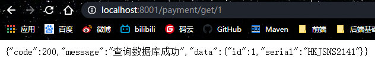

在Postman中测试

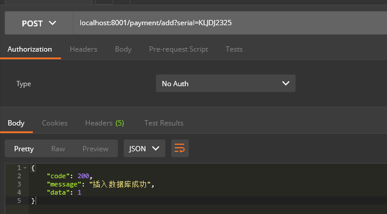

控制台信息

```java
[DEBUG] 2020-10-10 22:14:19,647 method:com.daniel.cloud.controller.PaymentController.add(PaymentController.java:33)
查询到一条数据Payment{id=1, serial='HKJSNS2141'}
[DEBUG] 2020-10-10 22:15:36,618 method:com.daniel.cloud.controller.PaymentController.add(PaymentController.java:22)
插入一条数据1
```

数据库插入信息


## 三、构建Order80

### 1、新建model

创建cloud_order80

### 2、改pom

```xml
    <dependencies>
<!--        引入抽取的公共的api-->
        <dependency>
            <groupId>org.daniel</groupId>
            <artifactId>cloud_api</artifactId>
            <version>1.0-SNAPSHOT</version>
            <scope>compile</scope>
        </dependency>
        <!-- SpringBoot整合Web组件 -->
        <dependency>
            <groupId>org.springframework.boot</groupId>
            <artifactId>spring-boot-starter-web</artifactId>
        </dependency>
        <dependency>
            <groupId>org.springframework.boot</groupId>
            <artifactId>spring-boot-starter-actuator</artifactId>
        </dependency>
        <!--日常通用jar包配置-->
<!--        热部署-->
        <dependency>
            <groupId>org.springframework.boot</groupId>
            <artifactId>spring-boot-devtools</artifactId>
            <scope>runtime</scope>
            <optional>true</optional>
        </dependency>
        <dependency>
            <groupId>org.springframework.boot</groupId>
            <artifactId>spring-boot-starter-test</artifactId>
            <scope>test</scope>
        </dependency>
        
    </dependencies>
```

### 3、编写application.yml

```yaml
server:
  port: 80
```

### 4、编写主启动类

```java
@SpringBootApplication
public class OrderMain80 {
    public static void main(String[] args) {
        SpringApplication.run(OrderMain80.class,args);
    }
}
```


### 5、业务类

#### 5.1、配置RestTemplate

新建配置类，将RestTemplate添加至容器中

```java
@Configuration
public class OrderConfig {
    @Bean
    public RestTemplate getRestTemplate(){
        return new RestTemplate();
    }
}
```

#### 5.2、编写控制器

```java
@RestController
public class OrderController { 
    final String PAYMENT_URL="http://localhost:8001";
    @Autowired
    RestTemplate restTemplate;
    
    @GetMapping("/order/payment/add")
    public CommonResult<Payment> add(Payment payment){
        return restTemplate.postForObject(PAYMENT_URL+"/payment/add",payment,CommonResult.class);
    }
    
    @GetMapping("/order/payment/get/{id}")
    public CommonResult<Payment> getById(@PathVariable("id") Long id){
        return restTemplate.getForObject(PAYMENT_URL+"/payment/get/"+id,CommonResult.class);
    }
}
```

==因为此控制器还要使用pay模块中的domain中的实体，所以会考虑将公共部分抽取出来，抽取步骤看下一章==

## 四、工程重构（抽取公共类）

### 1、新建model

创建cloud_api，抽取公共类

### 2、改pom

```xml
    <dependencies>
        <dependency>
            <groupId>org.springframework.boot</groupId>
            <artifactId>spring-boot-starter-web</artifactId>
        </dependency>
        <dependency>
            <groupId>org.springframework.boot</groupId>
            <artifactId>spring-boot-starter-actuator</artifactId>
        </dependency>
    </dependencies>
```


### 3、抽取公共部分

将80端口和8001端口所对应的微服务中的公共部分==domain==抽取出来

为使得项目代码不用改动，将包名命名一致

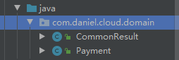

将order_api模块在maven中==【clean】和【install】==

然后将8001中的domain删除，并分别在cloud_pay_8001和cloud_order80中引用，删除后重建会出现程序包未找到，这是因为==IDEA中有时不会自动导入，此时需要手动添加步骤如下：==

找到引入代码报错的代码块使用==Alt+Enter==选择如下：

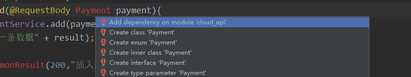

点击==重构==即可。


### 4、测试

4.1、默认端口为80，测试getbyid方法，http://localhost/order/payment/get/1直接访问

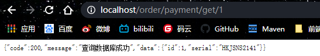

4.2、测试添加方法add，http://localhost/order/payment/add?serial=dani1111

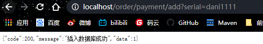

4.3、从上述结果可以看到表面上没有问题但是在数据库查看会发现添加值时会出现null。


​	解决办法：在cloud_pay_8001模块中的控制器中的add方法的参数上加上==@RequestBody==

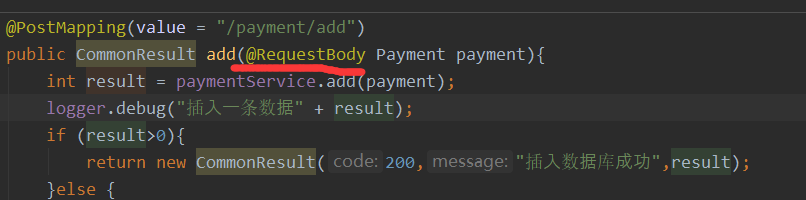


## 五、Eureka

### 什么是Eureka

Eureka是一项基于REST（代表性状态转移）的服务，主要在AWS云中用于定位服务，以实现负载均衡和中间层服务器的故障转移。我们称此服务为**Eureka Server**。Eureka还带有一个基于Java的客户端组件**Eureka Client**，它使与服务的交互更加容易。客户端还具有一个内置的负载平衡器，可以执行基本的循环负载平衡。在Netflix，更复杂的负载均衡器将Eureka包装起来，以基于流量，资源使用，错误条件等多种因素提供加权负载均衡，以提供出色的弹性。

### 1、概念及原理

#### 1.1为什么需要服务中心

------

过去，每个应用都是一个CPU，一个主机上的单一系统。然而今天，随着大数据和云计算时代的到来，任何独立的程序都可以运行在多个计算机上。并且随着业务的发展，访问用户量的增加，开发人员或小组的增加，系统会被拆分成多个功能模块。拆分后每个功能模块可以作为一个独立的子系统提供其职责范围内的功能。而多个子系统中，由于职责不同并且会存在相互调用，同时可能每个子系统还需要多个实例部署在多台服务器或者镜像中，导致了子系统间的相互调用形成了一个错综复杂的网状结构。用几幅图说明一下：

单体应用：


随着业务的发展，经过了多个系统架构的演变，变成了这样（拿百度的功能举个栗子）：


图中，每个网页搜索子系统和百度地图子系统的实例都可以视同为一个微服务。网页搜索子系统为百度地图子系统提供了“用户查询内容、用户IP地址”等信息提供的服务接口，为百度地图子系统定位用户地理信息情况提供数据依据。

百度地图子系统提供了“根据内容查询出地图信息”的接口提供给其他子系统调用，而这里网页搜索子系统调用了这个接口，获取地图相关信息。

网页搜索子系统和百度地图子系统又提供了各自对外用户调用的网页搜索、地图搜索等各自的对外服务。这个过程就形成了以上错综复杂的网状结构。而实际上这样还远远不够，因为每个子系统往往会提供多个对内的其他子系统调用的服务接口，同时也会调用多个不同子系统提供的多个服务接口，还会对外提供多个各自的服务接口。所以实际中上图的网状调用结构将会成几何倍的扩张。而且随着用户量的增加，每个子系统还需要继续增加更多的实例来提供服务，从而导致了凌乱的加剧。

==对于微服务之间错综复杂的调用关系，通过eureka来管理，可以让每个服务之间不用关心如何调用的问题，专注于自己的业务功能实现。==

#### 1.2从系统架构的演变到对于微服务架构的思考

------

为什么上图中的系统演变最终会变成如图所示的样子？这是一种架构思维，这里不扩展来说。简单描述一下微服务架构是为了解决什么问题。随着系统结构、架构的演变，系统功能的增加，用户量的增加，开发人员的增加等各种增加情况下，需要有一个比较好扩展的系统架构来快速、尽量减少代码改动的前提下以支持系统功能的开发，用户量增加导致的硬件资源横向扩容，以及开发人员增加时的协同工作效率。在此基础上需要解决系统的稳定性、容错性、高并发的支持性等。以及随着系统功能的增加如何有效的管理系统，排查、定位系统问题。同时当参与项目的人（包含测试、运维、业务等人员）越来越多时，如何能更高效的彼此之间协同办公的效率等等。

所以微服务架构需要考虑的不仅仅是软件架构本身，需要从参与到整个项目实施过程中的各个环节，可能的问题以及人员协同的整体情况去考虑。让整个项目做到==可用（满足功能以及硬件资源的横向扩容）、可行（满足整个系统运行中的各个点的监控、排错等）、可持续（满足系统功能的可持续集成、以及系统运行的可持续性）以及高效（系统运行的高效、人员协同工作的高效、功能迭代的高效等）==。

#### 1.3Eureka应用场景中的一些概念

------

##### 1.3.1微服务

Spring Cloud提供了微服务解决的一整套方案，而Eureka是其重要组件，所以先要了解什么是“微服务”。在大型系统架构中，会拆分多个子系统。这些系统往往都有这几个功能：==提供接口，调用接口，以及该子系统自身的业务功能。这样的一个子系统就称为一个“微服务”。==（可以理解为一个子系统的代码所实现的功能）

实例：

==每个服务都会部署到多个机器（或镜像）中，这些多个部署的应用就是实例。==（可以理解为一套子系统代码被部署到了多个机器上）

##### 1.3.2Eureka的管理：

基于以上概念，使用Eureka管理时会具备几个特性：

服务需要有一个统一的名称（或==服务ID==）并且是==唯一标识==，以便于接口调用时各个接口的区分。并且需要将其注册到Eureka Server中，其他服务调用该接口时，也是根据这个唯一标识来获取。

服务下有多个实例，每个实例也有一个自己的唯一实例ID。因为它们各自有自己的基础信息如：不同的IP。所以它们的信息也需要注册到Eureka Server中，其他服务调用它们的服务接口时，可以查看到多个该服务的实例信息，根据负载策略提供某个实例的调用信息后，调用者根据信息直接调用该实例。


#### 1.4eureka如何管理服务调用

------

eureka如何管理服务调用的？我们先来看个图：


→在Eureka Client启动的时候，将自身的服务的信息发送到Eureka Server。然后进行2调用当前服务器节点中的其他服务信息，保存到Eureka Client中。当服务间相互调用其它服务时，在Eureka Client中获取服务信息（如服务地址，端口等）后，进行第3步，根据信息直接调用服务。（注：服务的调用通过http(s)调用）

→当某个服务仅需要调用其他服务，自身不提供服务调用时。在Eureka Client启动后会拉取Eureka Server的其他服务信息，需要调用时，在Eureka Client的本地缓存中获取信息，调用服务。

→Eureka Client通过向Eureka Serve发送心跳（默认每30秒）来续约服务的。 如果客户端持续不能续约，那么，它将在大约90秒内从服务器注册表中删除。 注册信息和续订被复制到集群中的Eureka Serve所有节点。 以此来确保当前服务还“活着”，可以被调用。

→来自任何区域的Eureka Client都可以查找注册表信息（每30秒发生一次），以此来确保调用到的服务是“活的”。并且当某个服务被更新或者新加进来，也可以调用到新的服务。

简单的了解了eureka如何管理服务调用的之后，我们看看官网提供的图片，进一步了解更多信息（官网地址：https://github.com/Netflix/eureka/wiki/Eureka-at-a-glance）：


这个图从上而下，首先看到us-east-1c、us-east-1d、us-east-1e这些代表了一个可用区。简单举个栗子，假设一个Eureka Server集群下面的分布情况是这样的：


“北京集群中心”是一个区域，北京市内的机房A和B为可用区（对应官网图片中的us-east-1c、us-east-1d、us-east-1e）。区域（Region）和可用区（Zone或者Availability Zone）均是AWS的概念。在非AWS环境下，我们可以简单地将region（地区）理解为Eureka某个地区的集群中心，zone理解成该区域的每个机房。每个区域是通过外网连接，所以速度、稳定性上不能保证。而每个可用区之间一般是内网直连，保证速度。想更多了解AWS概念的可用查看http://blog.csdn.net/awschina/article/details/17639191


### 2、Eureka的两大组件

回到官网的图片可以看出在这个体系中，有2个主体：Eureka Server和Eureka Client。

#### 2.1Eureka Server

- 提供服务注册：各个微服务启动时，会通过Eureka Client向Eureka Server进行注册自己的信息（例如服务信息和网络信息），Eureka Server会存储该服务的信息。

- 提供服务信息提供：服务消费者在调用服务时，本地Eureka Client没有的情况下，会到Eureka Server拉取信息。

- 提供服务管理：通过Eureka Client的Cancel、心跳监控、renew等方式来维护该服务提供的信息以确保该服务可用以及服务的更新。

- 信息同步：每个Eureka Server同时也是Eureka Client，多个Eureka Server之间通过P2P复制的方式完成服务注册表的同步。同步时，被同步信息不会同步出去。也就是说有3个Eureka Server，Server1有新的服务信息时，同步到Server2后，Server2和Server3同步时，Server2不会把从Server1那里同步到的信息同步给Server3，只能由Server1自己同步给Server3。

每个可用区有一个Eureka集群，并且每个可用区至少有一个eureka服务器来处理区内故障。为了实现高可用，一般一个可用区中由三个Eureka Server组成。

#### 2.2Eureka Client

- Eureka Client是一个Java客户端，用于简化与Eureka Server的交互。并且管理当前微服务，同时为当前的微服务提供服务提供者信息。

- Eureka Client会拉取、更新和缓存Eureka Server中的信息。即使所有的Eureka Server节点都宕掉，服务消费者依然可以使用缓存中的信息找到服务提供者。

- Eureka Client在微服务启动后，会周期性地向Eureka Server发送心跳（默认周期为30秒）以续约自己的信息。如果Eureka Server在一定时间内没有接收到某个微服务节点的心跳，Eureka Server将会注销该微服务节点（默认90秒）。

- Eureka Client包含服务提供者Applicaton Service和服务消费者Application Client

- Applicaton Service：服务提供者，提供服务给别个调用。

- Application Client：服务消费者，调用别个提供的服务。

往往大多数服务本身既是服务提供者，也是服务消费者。

其它动作：

- Register：服务注册

当Eureka客户端向Eureka Server注册时，它提供自身的元数据，比如IP地址、端口，运行状况指示符URL，主页等。

- Renew：服务续约

Eureka Client会每隔30秒发送一次心跳来续约。 通过续约来告知Eureka Server该Eureka客户仍然存在，没有出现问题。 正常情况下，如果Eureka Server在90秒没有收到Eureka客户的续约，它会将实例从其注册表中删除。 建议不要更改续约间隔。

- Fetch Registries：获取注册列表信息

Eureka客户端从服务器获取注册表信息，并将其缓存在本地。客户端会使用该信息查找其他服务，从而进行远程调用。该注册列表信息定期（每30秒钟）更新一次。每次返回注册列表信息可能与Eureka客户端的缓存信息不同， Eureka客户端自动处理。如果由于某种原因导致注册列表信息不能及时匹配，Eureka客户端则会重新获取整个注册表信息。 Eureka服务器缓存注册列表信息，整个注册表以及每个应用程序的信息进行了压缩，压缩内容和没有压缩的内容完全相同。Eureka客户端和Eureka 服务器可以使用JSON / XML格式进行通讯。在默认的情况下Eureka客户端使用压缩JSON格式来获取注册列表的信息。

- Cancel：服务下线

Eureka客户端在程序关闭时向Eureka服务器发送取消请求。 发送请求后，该客户端实例信息将从服务器的实例注册表中删除。该下线请求不会自动完成，它需要调用以下内容：

DiscoveryManager.getInstance().shutdownComponent()；

- Eviction 服务剔除

在默认的情况下，当Eureka客户端连续90秒没有向Eureka服务器发送服务续约，即心跳，Eureka服务器会将该服务实例从服务注册列表删除，即服务剔除。

结语：了解了以上一些基础的概念和原理，对于Eureka的运行情况以及Eureka配置的理解就相对容易多了。最后附上一个转载来的Eureka参数配置项详解：http://www.jianshu.com/p/98f4e5f6bca7

### 3、Eureka的单机环境组建

#### 3.1新建model

新建模块==cloud_eureka_server7001==

#### 3.2改pom文件

```xml
  <dependencies>
<!--        Eureka注意导入server-->
        <dependency>
            <groupId>org.springframework.cloud</groupId>
            <artifactId>spring-cloud-starter-netflix-eureka-server</artifactId>
        </dependency>
        <!--        引入抽取的公共的api-->
        <dependency>
            <groupId>org.daniel</groupId>
            <artifactId>cloud_api</artifactId>
            <version>1.0-SNAPSHOT</version>
            <scope>compile</scope>
        </dependency>
        <!-- SpringBoot整合Web组件 -->
        <dependency>
            <groupId>org.springframework.boot</groupId>
            <artifactId>spring-boot-starter-web</artifactId>
        </dependency>
        <dependency>
            <groupId>org.springframework.boot</groupId>
            <artifactId>spring-boot-starter-actuator</artifactId>
        </dependency>
    </dependencies>
```

#### 3.3新建yml文件

```yaml
server:
  port: 7001
eureka:
  instance:
    hostname: localhost #eureka的实例名称
  client:
    register-with-eureka: false #表示不向注册中心注册自己
    fetch-registry: false #自己就是服务注册中心，不需要去检索服务
    service-url:
      defaultZone: http://${eureka.instance.hostname}:${server.port}/eureka/
```

#### 3.4主启动

```java
@SpringBootApplication
@EnableEurekaServer     //开启EurekaServer，表示自己是服务端
public class EurekaMain7001 {
    public static void main(String[] args) {
        SpringApplication.run(EurekaMain7001.class,args);
    }
}
```

==在项目启动类上使用@EnableEurekaServer，可以将项目作为SpringCloud中的注册中心。==激活Eureka服务器相关配置EurekaServerAutoConfiguration的注释，可以将@EnableEurekaServer 这个注解看作是一个开关，开启时，会激活相关配置，会作为注册中心。同时，他又引入了EurekaServerMarkerConfiguration类。

#### 3.4测试

在地址栏输入http://localhost:7001/

出现spring Eureka即配置成功。


#### 3.5服务注册

##### 3.5.1将cloud_pay_8001注册到Eureka

- 添加pom依赖

  ```xml
          <dependency>
              <groupId>org.springframework.cloud</groupId>
              <artifactId>spring-cloud-starter-netflix-eureka-client</artifactId>
          </dependency>
  ```

- 改yml文件

- ```yaml
  spring:
    application:
      name: cloud-payment-service
  eureka:
    client:
      # 表示自己就是客户端，需要注册到Eureka
      register-with-eureka: true
      # 注册中心获取其他服务的地址
      fetch-registry: true
      # 注册中心的地址为
      service-url:
       defaultZone: http://localhost:7001/eureka/
  ```

  ==其中spring,.application.name表示该服务的名称也是注册到Eureka中的名称，注意开启注册服务==

- 在主启动上添加注解

  ==在主启动类上添加注解==

  ```java
  @SpringBootApplication
  @EnableEurekaClient //开启EurekaClient，表示自己是客户端
  public class PayMain8001 {
      public static void main(String[] args){
          SpringApplication.run(PayMain8001.class,args);
      }
  }
  ```

  

##### 3.5.2将cloud_order80注册到Eureka

此步骤与cloud_pay_8001注册相同此处省略。

##### 3.5.3测试

注意==先开启cloud_eureka_server7001服务，然后开启其它微服务==

输入http://localhost:7001/，出现下面两个名称则说明注册成功。

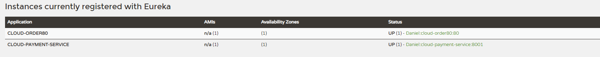

### 4、Eureka多机环境组建

#### 4.1修改系统文件

由于只有一台机器，所以可以修改windows系统文件模拟多机环境


修改hosts添加

```
127.0.0.1       eureka7001.com
127.0.0.1       eureka7002.com
```

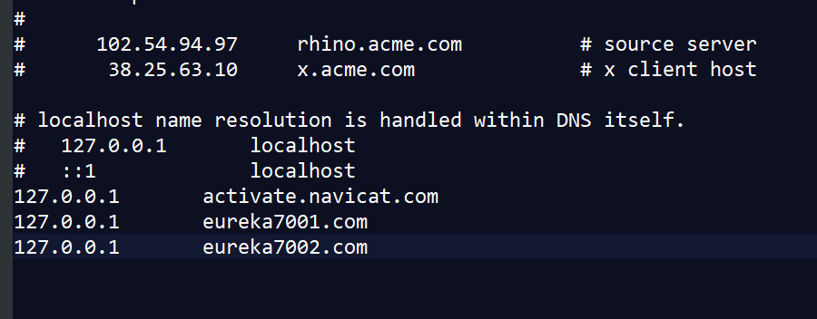

#### 4.2创建model

新建项目==cloud_eureka_server7002==

#### 4.3改pom

```XML
    <dependencies>
        <!--        Eureka注意导入server-->
        <dependency>
            <groupId>org.springframework.cloud</groupId>
            <artifactId>spring-cloud-starter-netflix-eureka-server</artifactId>
        </dependency>
        <!--        引入抽取的公共的api-->
        <dependency>
            <groupId>org.daniel</groupId>
            <artifactId>cloud_api</artifactId>
            <version>1.0-SNAPSHOT</version>
            <scope>compile</scope>
        </dependency>
        <!-- SpringBoot整合Web组件 -->
        <dependency>
            <groupId>org.springframework.boot</groupId>
            <artifactId>spring-boot-starter-web</artifactId>
        </dependency>
        <dependency>
            <groupId>org.springframework.boot</groupId>
            <artifactId>spring-boot-starter-actuator</artifactId>
        </dependency>
    </dependencies>
```

#### 4.4写yml

让两个服务都==互相注册，相互守望==，如果有多个EurekaServer在defaultZone中添加其他的服务地址，多个地址之间用==英文逗号==隔开。

```yaml
server:
  port: 7002
spring:
  application:
    name: eureka7002.com
eureka:
  client:
    register-with-eureka: false
    fetch-registry: false
    service-url:
      defaultZone: http://eureka7001.com:7001/eureka/
```

同时改写==cloud_eureka_server7001==对应的yml

```yaml
server:
  port: 7001
eureka:
  instance:
    hostname: eureka7001.com #eureka的实例名称
  client:
    register-with-eureka: false #表示不向注册中心注册自己
    fetch-registry: false #自己就是服务注册中心，不需要去检索服务
    service-url:
      defaultZone: http://eureka7002.com:7002/eureka/
```

#### 4.5编写主启动类

```java
@SpringBootApplication
@EnableEurekaServer
public class EurekaMain7002 {
    public static void main(String[] args) {
        SpringApplication.run(EurekaMain7002.class,args);
    }
}
```

#### 4.6测试

在地址输入http://eureka7001.com:7001/

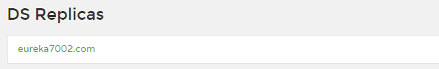

在地址输入http://eureka7002.com:7002/

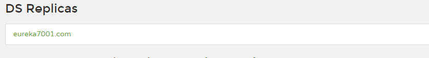

#### 4.7将80和8001加入到EurekaServer

修改80和8001中的yml文件，将其注册到两个server中

```yml
eureka:
  client:
    # 表示自己就是客户端，需要注册到Eureka
    register-with-eureka: true
    # 注册中心获取其他服务的地址
    fetch-registry: true
    # 注册中心的地址为
    service-url:
      defaultZone: http://eureka7001.com:7001/eureka/,http://eureka7002.com:7002/eureka/
#     defaultZone: http://localhost:7001/eureka/   #单机版
```

测试：

==先启动7001和7002，然后等7001和7002启动完毕再启动80和8001==

访问http://eureka7001.com:7001/


访问http://eureka7002.com:7002/


### 5、Eureka负载均衡

#### 5.1新建model

新建cloud_pay_8002结构与8001相同，代码基本相同，需要修改如下：

- pom文件==依赖相同==

- yml文件

  ==将端口号改为8002==

- 主启动

  ```java
  @SpringBootApplication
  @EnableEurekaClient
  public class PayMain8002 {
      public static void main(String[] args){
          SpringApplication.run(PayMain8002.class,args);
      }
  }
  ```

- 业务类

 在controller添加

  ```java
  package com.daniel.cloud.controller;
  
  @RestController
  public class PaymentController {
      Logger logger = Logger.getLogger(PaymentController.class);
      @Autowired
      PaymentService paymentService;
      
      @Value("${server.port}")														//注入变量
      private String ServerPort;														//添加端口变量
      @PostMapping(value = "/payment/add")
      public CommonResult add(@RequestBody Payment payment){
          int result = paymentService.add(payment);
          logger.debug("插入一条数据" + result);
          if (result>0){
              return new CommonResult(200,"插入数据库成功,Port:"+ServerPort,result);		//打印端口方便观察
          }else {
              return new CommonResult(444,"插入数据库失败",null);
          }
      }
      
      @GetMapping(value = "/payment/get/{id}")
      public CommonResult getById(@PathVariable("id") Long id){
          Payment payment = paymentService.getPaymentById(id);
          logger.debug("查询到一条数据" + payment);
          if (payment!=null){
              return new CommonResult(200,"查询数据库成功,Port:"+ServerPort,payment);	//打印端口方便观察
          }else {
              return new CommonResult(444,"无对应记录，查询id："+id,null);
          }
      }
  }
  
  ```

  ==同样把8001服务的controller加上端口，方便观察==

####   5.2修改80端口model

##### 5.2.1修改controller中的PAYMENT_URL

```java
    final String PAYMENT_URL="http://CLOUD-PAYMENT-SERVICE";
```

##### ==5.2.2修改config包下的配置文件==

==开启负载均衡，添加注解@LoadBalanced==

```java
@Configuration
public class OrderConfig {
    @Bean
    @LoadBalanced  							//开启负载均衡
    public RestTemplate getRestTemplate(){
        return new RestTemplate();
    }
}
```

#### 5.3测试

先分别启动7001、7002，启动完毕后再启动80、8001、8002

##### 5.3.1自测

测试http://localhost:8001/payment/get/1


测试http://localhost:8002/payment/get/1


##### 5.3.2测试80

测试http://localhost/order/payment/get/1


==观察发现port在8001和8002反复切换，证明负载均衡生效==

### 6、修改服务主机名和ip在eureka的web上显示

在8001和8002服务中修改yml，添加如语句：

```yaml
eureka:
  instance:
    instance-id: pay8001
    prefer-ip-address: true   #访问路径可以显示ip地址
```

### 7、eureka服务发现

==对于注册进eureka里面的微服务，可以通过服务来发现该服务的信息。==

#### 7.1controller

以==8001==微服务为例：

```java
//添加discovery
//    注意此处导入的是接口
    @Autowired
    private DiscoveryClient discoveryClient;
    
    @GetMapping(value = "/payment/discovery")
    public Object getDiscovery(){
//        拿到所有注册服务的信息
        List<String> services = discoveryClient.getServices();
        for (String service : services) {
            System.out.println("########element:" +service);
        }
//        拿到指定服务名称的所有的服务注册信息比如8001模块，它与8002模块的名称都相同
//        所以这里返回的是list
        List<ServiceInstance> instances = discoveryClient.getInstances("CLOUD-PAYMENT-SERVICE");
        for (ServiceInstance instance : instances) {
            System.out.println("服务id："+instance.getInstanceId()+
                    "\t服务主机："+instance.getHost()+
                    "\t服务端口："+instance.getPort()+
                    "\t服务Url："+instance.getUri()
                    );
        }
        return this.discoveryClient;
    }
```

#### 7.2在主启动添加注解

==@EnableDiscoveryClient==

```java
@SpringBootApplication
@EnableEurekaClient
@EnableDiscoveryClient			//添加注解
public class PayMain8001 {
    public static void main(String[] args){
        SpringApplication.run(PayMain8001.class,args);
    }
}
```

#### 7.3重启8001测试

输入http://localhost:8001/payment/discovery/

web页面展示

```java
{"discoveryClients":[{"services":["cloud-payment-service","cloud-order80"],"order":0},{"services":[],"order":0}],"services":["cloud-payment-service","cloud-order80"],"order":0}
```

控制台输出：

```java
########element:cloud-payment-service
########element:cloud-order80
服务id：payment8002	服务主机：169.254.207.52	服务端口：8002	服务Url：http://169.254.207.52:8002
服务id：payment8001	服务主机：169.254.207.52	服务端口：8001	服务Url：http://169.254.207.52:8001
```

### 8、Eureka自我保护机制

#### 8.1自我保护背景

首先对Eureka注册中心需要了解的是Eureka各个节点都是平等的，没有ZK中角色的概念， 即使N-1个节点挂掉也不会影响其他节点的正常运行。

默认情况下，==**如果Eureka Server在一定时间内（默认90秒）没有接收到某个微服务实例的心跳，Eureka Server将会移除该实例。**==但是当网络分区故障发生时，微服务与Eureka Server之间无法正常通信，而微服务本身是正常运行的，此时不应该移除这个微服务，所以引入了自我保护机制。

#### 8.2自我保护机制

官方对于自我保护机制的定义：

> 自我保护模式正是一种针对网络异常波动的安全保护措施，使用自我保护模式能使Eureka集群更加的健壮、稳定的运行。

自我保护机制的工作机制是：==**如果在15分钟内超过85%的客户端节点都没有正常的心跳，那么Eureka就认为客户端与注册中心出现了网络故障，Eureka Server自动进入自我保护机制**==，此时会出现以下几种情况：

1. Eureka Server不再从注册列表中移除因为长时间没收到心跳而应该过期的服务。
2. Eureka Server仍然能够接受新服务的注册和查询请求，但是不会被同步到其它节点上，保证当前节点依然可用。
3. 当网络稳定时，当前Eureka Server新的注册信息会被同步到其它节点中。

因此Eureka Server可以很好的应对因网络故障导致部分节点失联的情况，而不会像ZK那样如果有一半不可用的情况会导致整个集群不可用而变成瘫痪。

#### 8.3自我保护开关

Eureka自我保护机制，通过配置`eureka.server.enable-self-preservation`来`true`打开/`false`禁用自我保护机制，==默认打开状态==，建议生产环境打开此配置。

#### 8.4开发环境配置

开发环境中如果要实现服务失效能自动移除，只需要修改以下配置。

##### 8.4.1、 注册中心关闭自我保护机制，修改检查失效服务的时间。

==关闭7001的自我保护==

```yaml
eureka:
  instance:
    hostname: localhost   #单机版
  #    hostname: eureka7001.com #eureka的实例名称 #集群版
  client:
    register-with-eureka: false #表示不向注册中心注册自己
    fetch-registry: false #自己就是服务注册中心，不需要去检索服务
    service-url:
#      defaultZone: http://eureka7002.com:7002/eureka/        #集群版
      defaultzone: http://${eureka.instance.hostname}:${server.port}/eureka/  #单机版
  server:
    enable-self-preservation: true #禁用自我保护
    eviction-interval-timer-in-ms: 3000 #修改检查失效服务的时间
```

##### 8.4.2、 微服务修改减短服务心跳的时间。

==调整8001服务的发送心跳时间间隔及服务端收到心跳等待上限时间==

```yaml
eureka:
  client:
    # 表示自己就是客户端，需要注册到Eureka
    register-with-eureka: true
    # 注册中心获取其他服务的地址
    fetch-registry: true
    # 注册中心的地址为
    service-url:
#      defaultZone: http://eureka7001.com:7001/eureka/,http://eureka7002.com:7002/eureka/
     defaultZone: http://localhost:7001/eureka/   #单机版
  instance:
    instance-id: payment8001
    prefer-ip-address: true   #访问路径可以显示ip地址
    lease-renewal-interval-in-seconds: 1    #Eureka向服务端发送心跳的时间间隔，单位是秒（默认是30秒）
    lease-expiration-duration-in-seconds: 2     #Eureka在服务端收到最后一次心跳等待时间的上限，单位为秒（默认是90秒），超时将剔除服务

```

## 六、服务调用Ribbon

### Ribbon负载均衡:


**Ribbon目前也进入维护,基本上不准备更新了**


**进程内LB(本地负载均衡)**


**集中式LB(服务端负载均衡)**


**区别**


**Ribbon就是负载均衡+RestTemplate**


###3# 使用Ribbon:

##### 1,默认我们使用eureka的新版本时,它默认集成了ribbon:


**==这个starter中集成了reibbon了==**


##### 2,我们也可以手动引入ribbon

**放到order模块中,因为只有order访问pay时需要负载均衡**


##### 3,RestTemplate类:


```java
RestTemplate的:
		xxxForObject()方法,返回的是响应体中的数据
    xxxForEntity()方法.返回的是entity对象,这个对象不仅仅包含响应体数据,还包含响应体信息(状态码等)
```


##### Ribbon常用负载均衡算法:

**IRule接口,Riboon使用该接口,根据特定算法从所有服务中,选择一个服务,**

**Rule接口有7个实现类,每个实现类代表一个负载均衡算法**


##### 使用Ribbon:

**==这里使用eureka的那一套服务==**


**==也就是不能放在主启动类所在的包及子包下==**

###### 1,修改order模块

###### 2,额外创建一个包


###### 3,创建配置类,指定负载均衡算法


###### 4,在主启动类上加一个注解


**表示,访问CLOUD_pAYMENT_SERVICE的服务时,使用我们自定义的负载均衡算法**


##### 自定义负载均衡算法:

###### 1,ribbon的轮询算法原理


###### 2,自定义负载均衡算法:

###### 1,给pay模块(8001,8002),的controller方法添加一个方法,返回当前节点端口


###### 2,修改order模块

去掉@LoadBalanced


###### 3,自定义接口


​					==具体的算法在实现类中实现==

###### 4,接口实现类


###### 5,修改controller:


###### 6,启动服务,测试即可


### 11,OpenFeign


**是一个声明式的web客户端,只需要创建一个接口,添加注解即可完成微服务之间的调用**


==就是A要调用B,Feign就是在A中创建一个一模一样的B对外提供服务的的接口,我们调用这个接口,就可以服务到B==


#### **Feign与OpenFeign区别**


#### 使用OpenFeign

```java
之前的服务间调用,我们使用的是ribbon+RestTemplate
		现在改为使用Feign
```

##### 1,新建一个order项目,用于feign测试

名字cloud_order_feign-80

##### 2,pom文件

##### 3,配置文件


##### 4,主启动类


##### 5,fegin需要调用的其他的服务的接口


##### 6,controller


##### 7测试:

启动两个erueka(7001,7002)

启动两个pay(8001,8002)

启动当前的order模块


**Feign默认使用ribbon实现负载均衡**


#### OpenFeign超时机制:

==OpenFeign默认等待时间是1秒,超过1秒,直接报错==

##### 1,设置超时时间,修改配置文件:

**因为OpenFeign的底层是ribbon进行负载均衡,所以它的超时时间是由ribbon控制**


#### OpenFeign日志:


**OpenFeign的日志级别有:**


##### 	1,使用OpenFeign的日志:

**实现在配置类中添加OpenFeign的日志类**


##### 2,为指定类设置日志级别:


**配置文件中:**


##### 	3,启动服务即可