# 一、简介

C 语言是一种通用的高级语言，最初是由丹尼斯·里奇在贝尔实验室为开发 UNIX 操作系统而设计的。C 语言最开始是于 1972 年在 DEC PDP-11 计算机上被首次实现。

在 1978 年，布莱恩·柯林汉（Brian Kernighan）和丹尼斯·里奇（Dennis Ritchie）制作了 C 的第一个公开可用的描述，现在被称为 K&R 标准。

UNIX 操作系统，C编译器，和几乎所有的 UNIX 应用程序都是用 C 语言编写的。由于各种原因，C 语言现在已经成为一种广泛使用的专业语言。

## 1、历史

- C 语言是为了编写 UNIX 操作系统而被发明的。
- C 语言是以 B 语言为基础的，B 语言大概是在 1970 年被引进的。
- C 语言标准是于 1988 年由美国国家标准协会（ANSI，全称 American National Standard Institute）制定的。
- 截至 1973 年，UNIX 操作系统完全使用 C 语言编写。
- 目前，C 语言是最广泛使用的系统程序设计语言。
- 大多数先进的软件都是使用 C 语言实现的。
- 当今最流行的 Linux 操作系统和 RDBMS（Relational Database Management System：关系数据库管理系统） MySQL 都是使用 C 语言编写的。

## 2、特点

- 易于学习。
- 结构化语言。
- 它产生高效率的程序。
- 它可以处理底层的活动。
- 它可以在多种计算机平台上编译。

# 二、配置环境

## 1、下载软件

如果要使用c语言，则需要配置当前系统环境，此处以windows系统为例，准备c语言环境

下载c语言编译环境

Windows 上安装 GCC，您需要安装 MinGW。为了安装 MinGW，请访问 MinGW 的主页 [mingw-w64.org](http://mingw-w64.org/)，进入 MinGW 下载页面，下载最新版本的 MinGW 安装程序，命名格式为 MinGW-<version>.exe。

下载完毕后，安装到指定目录

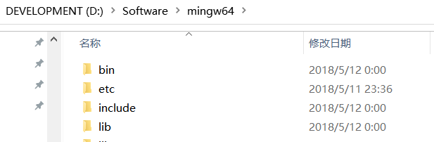

## 2、配置环境变量

进入系统环境变量配置，将MinGW的执行路径（`D:\Software\mingw64\bin`）配置在path中

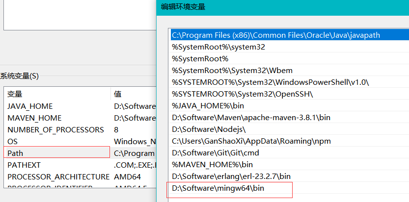

进入cmd终端中输入`gcc`命令结果如下则配置成功


## 3、测试环境

在D盘中新建c语言项目目录，创建`Test.c`文件


此处使用`sublime text3`软件作为编辑器

```c
#include <stdio.h>
void main(){
	printf("hello world!!\n");
	return 0;
}
```

使用终端进入当前目录，编译文件

```sh
gcc Test.c # 默认生成a.exe文件直接执行a即可
#指定名称输出
gcc Test.c -o test # 会在该目录下生成指定的文件：test.exe
```

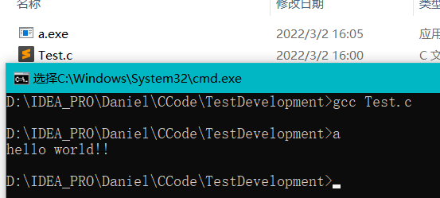

## 4、关于使用Sublime Text3中文乱码

由于使用sublime text3默认使用的是`UTF-8`编码格式，所以需要转换文件格式

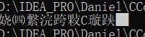

打开sublime安装

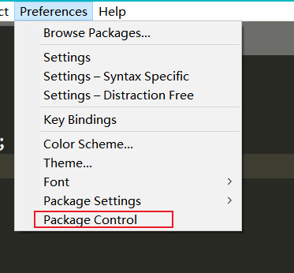

点击Package Control，找到install Package并点击，如下图所示

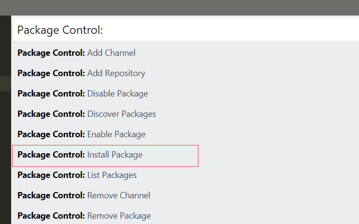

再弹出的搜索框中输入conver，找到`converToUTF8`点击并安装。

​	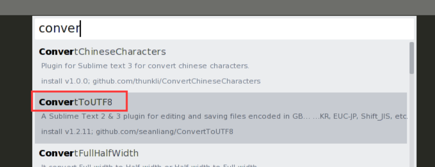

此时我们点击File，发现多了两个选项`Set File Encoding to`和`Reload with Encoding`。

点击转换后解决乱码问题

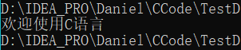

如果你是Linux系统，此时如果我们想要把文件保存为GBK仍然做不到，，我们需要下载Codecs33。步骤同刚才下载converToUTF8。

## 5、安装CLion

下载CLion安装包安装

此处只记录CLion软件内MinGW的配置

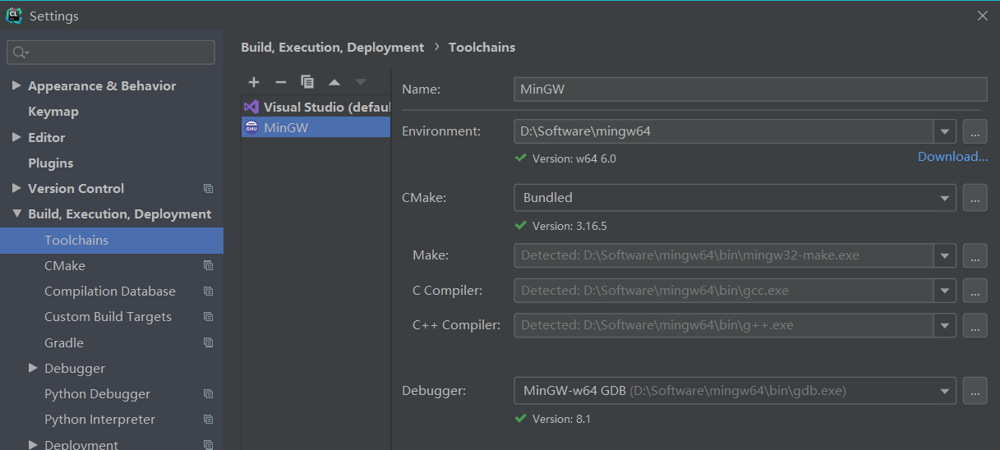

在配置中配置你系统中安装的编译器

# 三、C 基本语法

C 程序由各种令牌组成，令牌可以是`关键字`、`标识符`、`常量`、`字符串值`，或者是一个`符号`。例如，下面的 C 语句包括五个令牌：

## 1、分号

在 C 程序中，分号是语句结束符。也就是说，每个语句必须以分号结束。它表明一个逻辑实体的结束。

```c
printf("Hello, World!!! \n");
return 0;
```

## 2、注释

两种注释方式：`//` 和`/**/`，==不能在注释内嵌套注释，注释也不能出现在字符串或字符值中==

```c
// 单行注释

/* 单行注释 */

/* 
 多行注释
 多行注释
 多行注释
 */
```

## 3、标识符

C 标识符是用来标识变量、函数，或任何其他用户自定义项目的名称。一个标识符以字母 A-Z 或 a-z 或下划线 _ 开始，后跟零个或多个字母、下划线和数字（0-9）

C 标识符内不允许出现标点字符，比如 @、$ 和 %。C 是`区分大小写`的编程语言。因此，在 C 中，Love和 love是两个不同的标识符。下面列出几个有效的标识符：

```
mohd       zara    abc   move_name  a_123
myname50   _temp   j     a23b9      retVal
```

## 4、关键字

下表列出了 C 中的保留字。这些保留字不能作为常量名、变量名或其他标识符名称。

| 关键字   | 说明                                                         |
| :------- | :----------------------------------------------------------- |
| auto     | 声明自动变量                                                 |
| break    | 跳出当前循环                                                 |
| case     | 开关语句分支                                                 |
| char     | 声明字符型变量或函数返回值类型                               |
| const    | 定义常量，如果一个变量被 const 修饰，那么它的值就不能再被改变 |
| continue | 结束当前循环，开始下一轮循环                                 |
| default  | 开关语句中的"其它"分支                                       |
| do       | 循环语句的循环体                                             |
| double   | 声明双精度浮点型变量或函数返回值类型                         |
| else     | 条件语句否定分支（与 if 连用）                               |
| enum     | 声明枚举类型                                                 |
| extern   | 声明变量或函数是在其它文件或本文件的其他位置定义             |
| float    | 声明浮点型变量或函数返回值类型                               |
| for      | 一种循环语句                                                 |
| goto     | 无条件跳转语句                                               |
| if       | 条件语句                                                     |
| int      | 声明整型变量或函数                                           |
| long     | 声明长整型变量或函数返回值类型                               |
| register | 声明寄存器变量                                               |
| return   | 子程序返回语句（可以带参数，也可不带参数）                   |
| short    | 声明短整型变量或函数                                         |
| signed   | 声明有符号类型变量或函数                                     |
| sizeof   | 计算数据类型或变量长度（即所占字节数）                       |
| static   | 声明静态变量                                                 |
| struct   | 声明结构体类型                                               |
| switch   | 用于开关语句                                                 |
| typedef  | 用以给数据类型取别名                                         |
| unsigned | 声明无符号类型变量或函数                                     |
| union    | 声明共用体类型                                               |
| void     | 声明函数无返回值或无参数，声明无类型指针                     |
| volatile | 说明变量在程序执行中可被隐含地改变                           |
| while    | 循环语句的循环条件                                           |

C99 新增关键字

| `_Bool` | `_Complex` | `_Imaginary` | `inline` | `restrict` |
| ------- | ---------- | ------------ | -------- | ---------- |
|         |            |              |          |            |

C11 新增关键字

| `_Alignas`       | `_Alignof`      | `_Atomic` | `_Generic` | `_Noreturn` |
| ---------------- | --------------- | --------- | ---------- | ----------- |
| `_Static_assert` | `_Thread_local` |           |            |             |

## 5、空格

只包含空格的行，被称为空白行，可能带有注释，C 编译器会完全忽略它。

在 C 中，空格用于描述空白符、制表符、换行符和注释。空格分隔语句的各个部分，让编译器能识别语句中的某个元素（比如 int）在哪里结束，下一个元素在哪里开始。因此，在下面的语句中：

```c
int age;
```

在这里，int 和 age 之间必须至少有一个空格字符（通常是一个空白符），这样编译器才能够区分它们。

# 四、数据类型

在 C 语言中，数据类型指的是用于声明不同类型的变量或函数的一个广泛的系统。变量的类型决定了变量存储占用的空间，以及如何解释存储的位模式。

C 中的类型可分为以下几种：

| 序号 | 类型与描述                                                   |
| :--- | :----------------------------------------------------------- |
| 1    | **基本类型：** 它们是算术类型，包括两种类型：整数类型和浮点类型。 |
| 2    | **枚举类型：** 它们也是算术类型，被用来定义在程序中只能赋予其一定的离散整数值的变量。 |
| 3    | **void 类型：** 类型说明符 *void* 表明没有可用的值。         |
| 4    | **派生类型：** 它们包括：指针类型、数组类型、结构类型、共用体类型和函数类型。 |


数组类型和结构类型统称为聚合类型。函数的类型指的是函数返回值的类型。在本章节接下来的部分我们将介绍基本类型，其他几种类型会在后边几个章节中进行讲解。

## 1、整数类型

下表列出了关于标准整数类型的存储大小和值范围的细节：

| 类型           | 存储大小    | 值范围                                               |
| :------------- | :---------- | :--------------------------------------------------- |
| char           | 1 字节      | -128 到 127 或 0 到 255                              |
| unsigned char  | 1 字节      | 0 到 255                                             |
| signed char    | 1 字节      | -128 到 127                                          |
| int            | 2 或 4 字节 | -32,768 到 32,767 或 -2,147,483,648 到 2,147,483,647 |
| unsigned int   | 2 或 4 字节 | 0 到 65,535 或 0 到 4,294,967,295                    |
| short          | 2 字节      | -32,768 到 32,767                                    |
| unsigned short | 2 字节      | 0 到 65,535                                          |
| long           | 4 字节      | -2,147,483,648 到 2,147,483,647                      |
| unsigned long  | 4 字节      | 0 到 4,294,967,295                                   |

注意，各种类型的存储大小与系统位数有关，但目前通用的以64位系统为主。

以下列出了32位系统与64位系统的存储大小的差别（windows 相同）：


为了得到某个类型或某个变量在特定平台上的准确大小，您可以使用 `sizeof` 运算符。表达式 sizeof(type) 得到对象或类型的存储字节大小。下面的实例演示了获取 int 类型的大小：

**实例**

```c
#include <stdio.h> 
#include <limits.h> 
int main() {  
    printf("int 存储大小 : %lu \n", sizeof(int)); 
    return 0;
}
```

`%lu`为 32 位无符号整数，详细说明查看 [C 库函数 - printf()](https://www.runoob.com/cprogramming/c-function-printf.html)。

windows上编译并执行上面的程序时，它会产生下列结果：

```c
int 存储大小 : 4 
```

## 2、浮点类型

下表列出了关于标准浮点类型的存储大小、值范围和精度的细节：

| 类型        | 存储大小 | 值范围                 | 精度        |
| :---------- | :------- | :--------------------- | :---------- |
| float       | 4 字节   | 1.2E-38 到 3.4E+38     | 6 位有效位  |
| double      | 8 字节   | 2.3E-308 到 1.7E+308   | 15 位有效位 |
| long double | 16 字节  | 3.4E-4932 到 1.1E+4932 | 19 位有效位 |

头文件 `float.h` 定义了宏，在程序中可以使用这些值和其他有关实数二进制表示的细节。下面的实例将输出浮点类型占用的存储空间以及它的范围值：

**实例**

```c
#include <stdio.h>
#include <float.h>
int main()
{
   printf("float 存储最大字节数 : %lu \n", sizeof(float));
   printf("float 最小值: %E\n", FLT_MIN );
   printf("float 最大值: %E\n", FLT_MAX );
   printf("精度值: %d\n", FLT_DIG );
   return 0;
}
```

`%E` 为以指数形式输出单、双精度实数，详细说明查看 [C 库函数 - printf()](https://www.runoob.com/cprogramming/c-function-printf.html)。

当您在 Windows上编译并执行上面的程序时，它会产生下列结果：

```c
float 存储最大字节数 : 4
float 最小值: 1.175494E-038
float 最大值: 3.402823E+038
精度值: 6
```

## 3、void 类型

void 类型指定没有可用的值。它通常用于以下三种情况下：

| 序号 | 类型与描述                                                   |
| :--- | :----------------------------------------------------------- |
| 1    | **函数返回为空** C 中有各种函数都不返回值，或者您可以说它们返回空。不返回值的函数的返回类型为空。例如 **void exit (int status);** |
| 2    | **函数参数为空** C 中有各种函数不接受任何参数。不带参数的函数可以接受一个 void。例如 **int rand(void);** |
| 3    | **指针指向 void** 类型为 void * 的指针代表对象的地址，而不是类型。例如，内存分配函数 **void \*malloc( size_t size );** 返回指向 void 的指针，可以转换为任何数据类型。 |

# 五、变量

变量其实只不过是程序可操作的存储区的名称。C 中每个变量都有特定的类型，类型决定了变量存储的大小和布局，该范围内的值都可以存储在内存中，运算符可应用于变量上。

变量的名称可以由字母、数字和下划线字符组成。它必须以字母或下划线开头。大写字母和小写字母是不同的，因为 C 是大小写敏感的。

## 1、常见数据类型

### char

通常是一个字节（八位）, 这是一个整数类型。

### int

整型，4 个字节，取值范围 -2147483648 到 2147483647。

### float

单精度浮点值。单精度是这样的格式，1位符号，8位指数，23位小数。

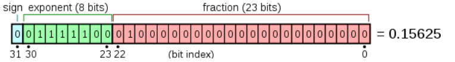

### double

双精度浮点值。双精度是1位符号，11位指数，52位小数。

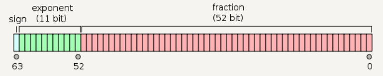

C 语言也允许定义各种其他类型的变量，比如枚举、指针、数组、结构、共用体等等

## 2、变量定义

变量定义就是告诉编译器在何处创建变量的存储，以及如何创建变量的存储。变量定义指定一个数据类型，并包含了该类型的一个或多个变量的列表，语法如下：

```c
type variable_list;
```

这里，**type** 必须是一个有效的 C 数据类型，可以是 char、w_char、int、float、double 或任何用户自定义的对象，**variable_list** 可以由一个或多个标识符名称组成，多个标识符之间用逗号分隔。

```c
int    i, j, k;
char   c, ch;
float  f, salary;
double d;
```

变量可以在声明的时候被初始化（指定一个初始值）

```c
type variable_name = value;
// 例如
extern int d = 3, f = 5;    // d 和 f 的声明与初始化
int d = 3, f = 5;           // 定义并初始化 d 和 f
byte z = 22;                // 定义并初始化 z
char x = 'x';               // 变量 x 的值为 'x'
```

## 3、变量声明

变量声明向编译器保证变量以指定的类型和名称存在，这样编译器在不需要知道变量完整细节的情况下也能继续进一步的编译。变量声明只在编译时有它的意义，在程序连接时编译器需要实际的变量声明。

变量的声明有两种情况：

- 1、一种是需要建立存储空间的。例如：int a 在声明的时候就已经建立了存储空间。
- 2、另一种是不需要建立存储空间的，通过使用extern关键字声明变量名而不定义它。 例如：`extern int a` 其中变量 `a `可以在别的文件中定义的。
- 除非有`extern`关键字，否则都是变量的定义。

```c
extern int i; //声明，不是定义
int i; //声明，也是定义
```

接下来我们通过一段代码来理解

```c
#include <stdio.h>
 
// 函数外定义变量 x 和 y，并且赋值
int x = 3;
int y = 4;
int addtwonum()
{
    // 函数内声明变量 x 和 y 为外部变量
    extern int x;
    extern int y;
    
    return x+y;
}
 
int main()
{
    int result;
    // 调用函数 addtwonum
    result = addtwonum();
    
    printf("result 为: %d",result);  // 结果为：result 为: 7
    return 0;
}
```

> 在上述代码中我们注意到通过在方法中`声明`x和y，此时x和y属于全局变量，但是如果我们在addtwonum方法中`定义`一个y变量并且不赋值会发生什么呢？

```c
int addtwonum()
{
    // 函数内声明变量 x 和 y 为外部变量
    extern int x;
    // 有声明改为定义并不赋值，
    int y;
    return x+y;
}
```

结果输出：result 为: 3

所以此时我们发现，在函数内定义的变量属于局部变量，且int类型定义的变量的初始默认值为0 ，所以最终结果为3+0，因此如果在方法中使用全局变量需要通过`extern`关键字进行声明。

### 外部文件引入

如果需要在一个源文件中引用另外一个源文件中定义的变量，我们只需在引用的文件中将变量加上 extern 关键字的声明即可。

addtwonum.c 文件代码：

```c
#include <stdio.h>
/*外部变量声明*/
extern int x ;
extern int y ;
int addtwonum()
{
    return x+y;
}
```

 test.c 文件代码：

```c
#include <stdio.h>
  
/*定义两个全局变量*/
int x=1;
int y=2;
int addtwonum();
int main(void)
{
    int result;
    result = addtwonum();
    printf("result 为: %d\n",result);
    return 0;
}
```

当上面的代码被编译和执行时，它会产生下列结果：

```sh
gcc addtwonum.c test.c -o main
result 为: 3
```

# 六、常量

常量是固定值，在程序执行期间不会改变。这些固定的值，又叫做**字面量**。

常量可以是任何的基本数据类型，比如整数常量、浮点常量、字符常量，或字符串字面值，也有枚举常量。

常量就像是常规的变量，只不过常量的值在==定义后不能进行修改==。

## 1、整数常量

整数常量可以是十进制、八进制或十六进制的常量。前缀指定基数：

> `0x `或 `0X` 表示十六进制，
>
> `0 `表示八进制
>
> 不带前缀则默认表示十进制。

整数常量也可以带一个后缀，后缀是 U 和 L 的组合

> U 表示无符号整数（unsigned）
>
> L 表示长整数（long）

后缀可以是大写，也可以是小写，U 和 L 的顺序任意。

下面列举几个整数常量的实例：

```c
212         /* 合法的 */
215u        /* 合法的 */
0xFeeL      /* 合法的 */
078         /* 非法的：8 不是八进制的数字 */
032UU       /* 非法的：不能重复后缀 */
```

以下是各种类型的整数常量的实例：

```c
85         /* 十进制 */
0213       /* 八进制 */
0x4b       /* 十六进制 */
30         /* 整数 */
30u        /* 无符号整数 */
30l        /* 长整数 */
30ul       /* 无符号长整数 */
```

## 2、浮点常量

浮点常量由`整数部分`、`小数点`、`小数`部分和`指数`部分组成。您可以使用小数形式或者指数形式来表示浮点常量。

当使用小数形式表示时，必须包含整数部分、小数部分，或同时包含两者。

当使用指数形式表示时， 必须包含小数点、指数，或同时包含两者。带符号的指数是用 e 或 E 引入的。

下面列举几个浮点常量的实例：

```c
3.14159       /* 合法的 */
314159E-5L    /* 合法的 */
510E          /* 非法的：不完整的指数 */
210f          /* 非法的：没有小数或指数 */
.e55          /* 非法的：缺少整数或分数 */
```

## 3、字符常量

字符常量是括在单引号中，例如，'x' 可以存储在 **char** 类型的简单变量中。

字符常量可以是一个普通的字符（例如 'x'）、一个转义序列（例如 '\t'），或一个通用的字符（例如 '\u02C0'）。

在 C 中，有一些特定的字符，当它们前面有反斜杠时，它们就具有特殊的含义，被用来表示如换行符（\n）或制表符（\t）等。

### 转义序列码

```c
\\				\ 字符
\'				' 字符
\"				" 字符
\?				? 字符
\a				警报铃声
\b				退格键
\f				换页符
\n				换行符
\r				回车
\t				水平制表符
\v				垂直制表符
\ooo			一到三位的八进制数
\xhh . . .		一个或多个数字的十六进制数
```

## 4、字符串常量

字符串字面值或常量是括在双引号 `""` 中的。一个字符串包含类似于字符常量的字符：普通的字符、转义序列和通用的字符。

您可以使用空格做分隔符，把一个很长的字符串常量进行分行。

下面的实例显示了一些字符串常量。下面这三种形式所显示的字符串是相同的

```c
"hello, dear"

"hello, \

dear"

"hello, " "d" "ear"
```

## 5、定义常量

在 C 中，有两种简单的定义常量的方式：

> 使用`#define` 预处理器。
>
> 使用`const`关键字。

### #define 预处理器

下面是使用 #define 预处理器定义常量的形式：

```
#define identifier value
```

### const 关键字

您可以使用 **const** 前缀声明指定类型的常量，如下所示：

```
const type variable = value;
```

==const 声明常量要在一个语句内完成,把常量定义为大写字母形式，是一个很好的编程习惯==


#  七、存储类

存储类定义 C 程序中变量/函数的范围（可见性）和生命周期。这些说明符放置在它们所修饰的类型之前。下面列出 C 程序中可用的存储类：

- auto
- register
- static
- extern

## 1、auto 存储类

**auto** 存储类是所有局部变量默认的存储类。

```c
{
   int mount;
   auto int month;
}
```

上面的实例定义了两个带有相同存储类的变量，auto 只能用在函数内，即 auto 只能修饰局部变量。

## 2、register 存储类

**register** 存储类用于定义存储在寄存器中而不是 RAM 中的局部变量。这意味着变量的最大尺寸等于寄存器的大小（通常是一个字），且不能对它应用一元的 '&' 运算符（因为它没有内存位置）。

```c
{
   register int  miles;
}
```

寄存器只用于需要快速访问的变量，比如计数器。还应注意的是，定义 'register' 并不意味着变量将被存储在寄存器中，它意味着变量可能存储在寄存器中，这取决于硬件和实现的限制。

## 3、static 存储类

**static** 存储类指示编译器在程序的生命周期内保持局部变量的存在，而不需要在每次它进入和离开作用域时进行创建和销毁。因此，使用 static 修饰局部变量可以在函数调用之间保持局部变量的值。

static 修饰符也可以应用于全局变量。当 static 修饰全局变量时，会使变量的作用域限制在声明它的文件内。

全局声明的一个 static 变量或方法可以被任何函数或方法调用，只要这些方法出现在跟 static 变量或方法同一个文件中。

以下实例演示了 static 修饰全局变量和局部变量的应用：

实例

```c
#include <stdio.h>
 
/* 函数声明 */
void func1(void);
 
static int count=10;        /* 全局变量 - static 是默认的 */
 
int main()
{
  while (count--) {
      func1();
  }
  return 0;
}
 
void func1(void)
{
/* 'thingy' 是 'func1' 的局部变量 - 只初始化一次
 * 每次调用函数 'func1' 'thingy' 值不会被重置。
 */                
  static int thingy=5;
  thingy++;
  printf(" thingy 为 %d ， count 为 %d\n", thingy, count);
}
```

实例中 count 作为全局变量可以在函数内使用，thingy 使用 static 修饰后，不会在每次调用时重置。

可能您现在还无法理解这个实例，因为我已经使用了函数和全局变量，这两个概念目前为止还没进行讲解。即使您现在不能完全理解，也没有关系，后续的章节我们会详细讲解。当上面的代码被编译和执行时，它会产生下列结果：

```c
 thingy 为 6 ， count 为 9
 thingy 为 7 ， count 为 8
 thingy 为 8 ， count 为 7
 thingy 为 9 ， count 为 6
 thingy 为 10 ， count 为 5
 thingy 为 11 ， count 为 4
 thingy 为 12 ， count 为 3
 thingy 为 13 ， count 为 2
 thingy 为 14 ， count 为 1
 thingy 为 15 ， count 为 0
```

## 4、extern 存储类

**extern** 存储类用于提供一个全局变量的引用，全局变量对所有的程序文件都是可见的。当您使用 **extern** 时，对于无法初始化的变量，会把变量名指向一个之前定义过的存储位置。

当您有多个文件且定义了一个可以在其他文件中使用的全局变量或函数时，可以在其他文件中使用 *extern* 来得到已定义的变量或函数的引用。可以这么理解，*extern* 是用来在另一个文件中声明一个全局变量或函数。

extern 修饰符通常用于当有两个或多个文件共享相同的全局变量或函数的时候，如下所示：

**第一个文件：main.c**

实例

```c
#include <stdio.h>
 
int count ;
extern void write_extern();
 
int main()
{
   count = 5;
   write_extern();
}
```

**第二个文件：support.c**

实例

```c
#include <stdio.h>
extern int count;
void write_extern(void)
{
   printf("count is %d\n", count);
}
```

在这里，第二个文件中的 *extern* 关键字用于声明已经在第一个文件 main.c 中定义的 *count*。现在 ，编译这两个文件，如下所示：

```c
 $ gcc main.c support.c
```

这会产生 **a.out** 可执行程序，当程序被执行时，它会产生下列结果：

```c
count is 5
```


# 八、运算符

运算符是一种告诉编译器执行特定的数学或逻辑操作的符号。C 语言内置了丰富的运算符，并提供了以下类型的运算符：

- 算术运算符
- 关系运算符
- 逻辑运算符
- 位运算符
- 赋值运算符
- 杂项运算符

## 1、算术运算符

假设变量 **A** 的值为 10，变量 **B** 的值为 20，则：

| 运算符 | 描述                             | 实例             |
| :----- | :------------------------------- | :--------------- |
| +      | 把两个操作数相加                 | A + B 将得到 30  |
| -      | 从第一个操作数中减去第二个操作数 | A - B 将得到 -10 |
| *      | 把两个操作数相乘                 | A * B 将得到 200 |
| /      | 分子除以分母                     | B / A 将得到 2   |
| %      | 取模运算符，整除后的余数         | B % A 将得到 0   |
| ++     | 自增运算符，整数值增加 1         | A++ 将得到 11    |
| --     | 自减运算符，整数值减少 1         | A-- 将得到 9     |

实例

```c
#include <stdio.h>
 
int main()
{
   int a = 21;
   int b = 10;
   int c ;
 
   c = a + b;
   printf("Line 1 - c 的值是 %d\n", c ); 	// Line 1 - c 的值是 31
   c = a - b;
   printf("Line 2 - c 的值是 %d\n", c ); 	// Line 2 - c 的值是 11
   c = a * b;
   printf("Line 3 - c 的值是 %d\n", c );	// Line 3 - c 的值是 210
   c = a / b;
   printf("Line 4 - c 的值是 %d\n", c );	// Line 4 - c 的值是 2
   c = a % b;
   printf("Line 5 - c 的值是 %d\n", c );	// Line 5 - c 的值是 1
   c = a++;  // 赋值后再加 1 ，c 为 21，a 为 22
   printf("Line 6 - c 的值是 %d\n", c );	// Line 6 - c 的值是 21
   c = a--;  // 赋值后再减 1 ，c 为 22 ，a 为 21
   printf("Line 7 - c 的值是 %d\n", c );	// Line 7 - c 的值是 22
}
```

### a++ 与 ++a 的区别

```c
#include <stdio.h>
 
int main()
{
   int c;
   int a = 10;
   c = a++; 
   printf("先赋值后运算：\n");
   printf("Line 1 - c 的值是 %d\n", c ); // 10
   printf("Line 2 - a 的值是 %d\n", a ); // 11
   a = 10;
   c = a--; 
   printf("Line 3 - c 的值是 %d\n", c ); // 10
   printf("Line 4 - a 的值是 %d\n", a ); // 9
 
   printf("先运算后赋值：\n");
   a = 10;
   c = ++a; 
   printf("Line 5 - c 的值是 %d\n", c ); // 11
   printf("Line 6 - a 的值是 %d\n", a ); // 11
   a = 10;
   c = --a; 
   printf("Line 7 - c 的值是 %d\n", c ); // 9
   printf("Line 8 - a 的值是 %d\n", a ); // 9
 
}
/*
先赋值后运算：
Line 1 - c 的值是 10
Line 2 - a 的值是 11
Line 3 - c 的值是 10
Line 4 - a 的值是 9
先运算后赋值：
Line 5 - c 的值是 11
Line 6 - a 的值是 11
Line 7 - c 的值是 9
Line 8 - a 的值是 9
*/
```

## 2、关系运算符

假设变量 **A** 的值为 10，变量 **B** 的值为 20，则：

| 运算符 | 描述                                                         | 实例            |
| :----- | :----------------------------------------------------------- | :-------------- |
| ==     | 检查两个操作数的值是否相等，如果相等则条件为真。             | (A == B) 为假。 |
| !=     | 检查两个操作数的值是否相等，如果不相等则条件为真。           | (A != B) 为真。 |
| >      | 检查左操作数的值是否大于右操作数的值，如果是则条件为真。     | (A > B) 为假。  |
| <      | 检查左操作数的值是否小于右操作数的值，如果是则条件为真。     | (A < B) 为真。  |
| >=     | 检查左操作数的值是否大于或等于右操作数的值，如果是则条件为真。 | (A >= B) 为假。 |
| <=     | 检查左操作数的值是否小于或等于右操作数的值，如果是则条件为真。 | (A <= B) 为真。 |

## 3、逻辑运算符

假设变量 **A** 的值为 1，变量 **B** 的值为 0，则：

| 运算符 | 描述                                                         | 实例              |
| :----- | :----------------------------------------------------------- | :---------------- |
| &&     | 称为逻辑与运算符。如果两个操作数都非零，则条件为真。         | (A && B) 为假。   |
| \|\|   | 称为逻辑或运算符。如果两个操作数中有任意一个非零，则条件为真。 | (A \|\| B) 为真。 |
| !      | 称为逻辑非运算符。用来逆转操作数的逻辑状态。如果条件为真则逻辑非运算符将使其为假。 | !(A && B) 为真。  |

## 4、位运算符

位运算符作用于位，并逐位执行操作。`&`、 `| `和 `^` 的真值表如下所示：

| p    | q    | p & q | p \| q | p ^ q |
| :--- | :--- | :---- | :----- | :---- |
| 0    | 0    | 0     | 0      | 0     |
| 0    | 1    | 0     | 1      | 1     |
| 1    | 1    | 1     | 1      | 0     |
| 1    | 0    | 0     | 1      | 1     |

假设如果 A = 60，且 B = 13，现在以二进制格式表示，它们如下所示：

```c
A = 0011 1100

B = 0000 1101

\-----------------

A&B = 0000 1100

A|B = 0011 1101

A^B = 0011 0001

~A = 1100 0011
```

假设变量 **A** 的值为 60，变量 **B** 的值为 13

`<<`：二进制左移运算符。将一个运算对象的各二进制位全部左移若干位（左边的二进制位丢弃，右边补0）。

```c
A << 2 将得到 240，即为 0011 1100<<2 = 1111 0000
```

`>>`：二进制右移运算符。将一个数的各二进制位全部右移若干位，正数左补0，负数左补1，右边丢弃。

```c
A >> 2 将得到 15，即为 0000 1111
```

## 5、赋值运算符

| 运算符 | 描述                                                         | 实例                            |
| :----- | :----------------------------------------------------------- | :------------------------------ |
| =      | 简单的赋值运算符，把右边操作数的值赋给左边操作数             | C = A + B 将把 A + B 的值赋给 C |
| +=     | 加且赋值运算符，把右边操作数加上左边操作数的结果赋值给左边操作数 | C += A 相当于 C = C + A         |
| -=     | 减且赋值运算符，把左边操作数减去右边操作数的结果赋值给左边操作数 | C -= A 相当于 C = C - A         |
| *=     | 乘且赋值运算符，把右边操作数乘以左边操作数的结果赋值给左边操作数 | C *= A 相当于 C = C * A         |
| /=     | 除且赋值运算符，把左边操作数除以右边操作数的结果赋值给左边操作数 | C /= A 相当于 C = C / A         |
| %=     | 求模且赋值运算符，求两个操作数的模赋值给左边操作数           | C %= A 相当于 C = C % A         |
| <<=    | 左移且赋值运算符                                             | C <<= 2 等同于 C = C << 2       |
| >>=    | 右移且赋值运算符                                             | C >>= 2 等同于 C = C >> 2       |
| &=     | 按位与且赋值运算符                                           | C &= 2 等同于 C = C & 2         |
| ^=     | 按位异或且赋值运算符                                         | C ^= 2 等同于 C = C ^ 2         |
| \|=    | 按位或且赋值运算符                                           | C \|= 2 等同于 C = C \| 2       |

## 6、杂项运算符 ↦ sizeof & 三元

| 运算符   | 描述             | 实例                                 |
| :------- | :--------------- | :----------------------------------- |
| sizeof() | 返回变量的大小。 | sizeof(a) 将返回 4，其中 a 是整数。  |
| &        | 返回变量的地址。 | &a; 将给出变量的实际地址。           |
| *        | 指向一个变量。   | *a; 将指向一个变量。                 |
| ? :      | 条件表达式       | 如果条件为真 ? 则值为 X : 否则值为 Y |

```c
#include <stdio.h>
int main()
{
   int a = 5;
   short b;
   double c;
   int* ptr;
 
   /* sizeof 运算符实例 */
   printf("Line 1 - 变量 a 的大小 = %lu\n", sizeof(a) );
   printf("Line 2 - 变量 b 的大小 = %lu\n", sizeof(b) );
   printf("Line 3 - 变量 c 的大小 = %lu\n", sizeof(c) );
 
   /* & 和 * 运算符实例 */
   ptr = &a;    /* 'ptr' 现在包含 'a' 的地址 */
   printf("a 的值是 %d\n", a);
   printf("*ptr 是 %d\n", *ptr);
 
   /* 三元运算符实例 */
   a = 10;
   b = (a == 1) ? 20: 30;
   printf( "b 的值是 %d\n", b );
 
   b = (a == 10) ? 20: 30;
   printf( "b 的值是 %d\n", b );
}
/*
Line 1 - 变量 a 的大小 = 4
Line 2 - 变量 b 的大小 = 2
Line 3 - 变量 c 的大小 = 8
a 的值是 5
*ptr 是 5
b 的值是 30
b 的值是 20
*/
```

## 7、运算符优先级

下表将按运算符优先级从高到低列出各个运算符，具有较高优先级的运算符出现在表格的上面，具有较低优先级的运算符出现在表格的下面。在表达式中，较高优先级的运算符会优先被计算。

| 类别       | 运算符                            | 结合性   |
| :--------- | :-------------------------------- | :------- |
| 后缀       | () [] -> . ++ - -                 | 从左到右 |
| 一元       | + - ! ~ ++ - - (type)* & sizeof   | 从右到左 |
| 乘除       | * / %                             | 从左到右 |
| 加减       | + -                               | 从左到右 |
| 移位       | << >>                             | 从左到右 |
| 关系       | < <= > >=                         | 从左到右 |
| 相等       | == !=                             | 从左到右 |
| 位与 AND   | &                                 | 从左到右 |
| 位异或 XOR | ^                                 | 从左到右 |
| 位或 OR    | \|                                | 从左到右 |
| 逻辑与 AND | &&                                | 从左到右 |
| 逻辑或 OR  | \|\|                              | 从左到右 |
| 条件       | ?:                                | 从右到左 |
| 赋值       | = += -= *= /= %=>>= <<= &= ^= \|= | 从右到左 |
| 逗号       | ,                                 | 从左到右 |

# 九、判断循环结构

## 1、判断

| 语句                                                         | 描述                                                         |
| :----------------------------------------------------------- | :----------------------------------------------------------- |
| [if 语句](https://www.runoob.com/cprogramming/c-if.html)     | 一个 **if 语句** 由一个布尔表达式后跟一个或多个语句组成。    |
| [if...else 语句](https://www.runoob.com/cprogramming/c-if-else.html) | 一个 **if 语句** 后可跟一个可选的 **else 语句**，else 语句在布尔表达式为假时执行。 |
| [嵌套 if 语句](https://www.runoob.com/cprogramming/c-nested-if.html) | 您可以在一个 **if** 或 **else if** 语句内使用另一个 **if** 或 **else if** 语句。 |
| [switch 语句](https://www.runoob.com/cprogramming/c-switch.html) | 一个 **switch** 语句允许测试一个变量等于多个值时的情况。     |
| [嵌套 switch 语句](https://www.runoob.com/cprogramming/c-nested-switch.html) | 您可以在一个 **switch** 语句内使用另一个 **switch** 语句。   |

## 2、运算符(三元运算符)

```
Exp1 ? Exp2 : Exp3;
```

? 表达式的值是由 Exp1 决定的。如果 Exp1 为真，则计算 Exp2 的值，结果即为整个表达式的值。如果 Exp1 为假，则计算 Exp3 的值，结果即为整个表达式的值。

## 3、循环


| 循环类型                                                     | 描述                                                         |
| :----------------------------------------------------------- | :----------------------------------------------------------- |
| [while 循环](https://www.runoob.com/cprogramming/c-while-loop.html) | 当给定条件为真时，重复语句或语句组。它会在执行循环主体之前测试条件。 |
| [for 循环](https://www.runoob.com/cprogramming/c-for-loop.html) | 多次执行一个语句序列，简化管理循环变量的代码。               |
| [do...while 循环](https://www.runoob.com/cprogramming/c-do-while-loop.html) | 除了它是在循环主体结尾测试条件外，其他与 while 语句类似。    |
| [嵌套循环](https://www.runoob.com/cprogramming/c-nested-loops.html) | 您可以在 while、for 或 do..while 循环内使用一个或多个循环。  |

### 循环控制语句

循环控制语句改变你代码的执行顺序。通过它你可以实现代码的跳转。

C 提供了下列的循环控制语句。点击链接查看每个语句的细节。

| 控制语句                                                     | 描述                                                         |
| :----------------------------------------------------------- | :----------------------------------------------------------- |
| [break 语句](https://www.runoob.com/cprogramming/c-break-statement.html) | 终止**循环**或 **switch** 语句，程序流将继续执行紧接着循环或 switch 的下一条语句。 |
| [continue 语句](https://www.runoob.com/cprogramming/c-continue-statement.html) | 告诉一个循环体立刻停止本次循环迭代，重新开始下次循环迭代。   |
| [goto 语句](https://www.runoob.com/cprogramming/c-goto-statement.html) | 将控制转移到被标记的语句。但是不建议在程序中使用 goto 语句。 |

# 十、函数

## 1、定义函数

C 语言中的函数定义的一般形式如下：

```c
return_type function_name( parameter list )
{
   body of the function
}
```

- **返回类型：**一个函数可以返回一个值。**return_type** 是函数返回的值的数据类型。有些函数执行所需的操作而不返回值，在这种情况下，return_type 是关键字 **void**。
- **函数名称：**这是函数的实际名称。函数名和参数列表一起构成了函数签名。
- **参数：**参数就像是占位符。当函数被调用时，您向参数传递一个值，这个值被称为实际参数。参数列表包括函数参数的类型、顺序、数量。参数是可选的，也就是说，函数可能不包含参数。
- **函数主体：**函数主体包含一组定义函数执行任务的语句。


## 2、函数声明

函数**声明**会告诉编译器函数名称及如何调用函数。函数的实际主体可以单独定义。

函数声明包括以下几个部分：

```c
return_type function_name( parameter list );
```

针对上面定义的函数 max()，以下是函数声明：

```c
int max(int num1, int num2);
```

在函数声明中，参数的名称并不重要，只有参数的类型是必需的，因此下面也是有效的声明：

```c
int max(int, int);
```

# 十一、作用域规则

## 1、局部变量

在某个函数或块的内部声明的变量称为局部变量。它们只能被该函数或该代码块内部的语句使用。局部变量在函数外部是不可知的。下面是使用局部变量的实例。在这里，所有的变量 a、b 和 c 是 main() 函数的局部变量。

```c
#include <stdio.h>
 
int main ()
{
  /* 局部变量声明 */
  int a, b;
  int c;
 
  /* 实际初始化 */
  a = 10;
  b = 20;
  c = a + b;
 
  printf ("value of a = %d, b = %d and c = %d\n", a, b, c);
 
  return 0;
}
```

## 2、全局变量

全局变量是定义在函数外部，通常是在程序的顶部。全局变量在整个程序生命周期内都是有效的，在任意的函数内部能访问全局变量。

全局变量可以被任何函数访问。也就是说，全局变量在声明后整个程序中都是可用的。下面是使用全局变量和局部变量的实例：

```c
#include <stdio.h>
 
/* 全局变量声明 */
int g = 20;
 
int main ()
{
  /* 局部变量声明 */
  int g = 10;
 
  printf ("value of g = %d\n",  g);
 
  return 0;
}
```

在程序中，局部变量和全局变量的名称可以相同，但是在函数内，如果两个名字相同，会使用局部变量值，全局变量不会被使用。

## 3、形式参数

函数的参数，形式参数，被当作该函数内的局部变量，如果与全局变量同名它们会优先使用。

```c
#include <stdio.h>
 
/* 全局变量声明 */
int a = 20;
 
int main ()
{
  /* 在主函数中的局部变量声明 */
  int a = 10;
  int b = 20;
  int c = 0;
  int sum(int, int);
 
  printf ("value of a in main() = %d\n",  a);
  c = sum( a, b);
  printf ("value of c in main() = %d\n",  c);
 
  return 0;
}
 
/* 添加两个整数的函数 */
int sum(int a, int b)
{
    printf ("value of a in sum() = %d\n",  a);
    printf ("value of b in sum() = %d\n",  b);
 
    return a + b;
}
/*
value of a in main() = 10
value of a in sum() = 10
value of b in sum() = 20
value of c in main() = 30
*/
```

**全局变量与局部变量在内存中的区别**：

> - 全局变量保存在内存的全局存储区中，占用静态的存储单元；
> - 局部变量保存在栈中，只有在所在函数被调用时才动态地为变量分配存储单元。

## 4、初始化局部变量和全局变量

当局部变量被定义时，系统不会对其初始化，您必须自行对其初始化。定义全局变量时，系统会自动对其初始化，如下所示：

| 数据类型 | 初始化默认值 |
| :------- | :----------- |
| int      | 0            |
| char     | '\0'         |
| float    | 0            |
| double   | 0            |
| pointer  | NULL         |

正确地初始化变量是一个良好的编程习惯，否则有时候程序可能会产生意想不到的结果，因为未初始化的变量会导致一些在内存位置中已经可用的垃圾值。

# 十二、数组

**数组**数据结构，它可以存储一个固定大小的相同类型元素的顺序集合。数组是用来存储一系列数据，但它往往被认为是一系列相同类型的变量。

所有的数组都是由连续的内存位置组成。最低的地址对应第一个元素，最高的地址对应最后一个元素。	


数组中的特定元素可以通过索引访问，第一个索引值为 0


## 1、声明数组

在 C 中要声明一个数组，需要指定元素的类型和元素的数量，如下所示：

```c
type arrayName [ arraySize ];
```

这叫做一维数组。**arraySize** 必须是一个大于零的整数常量，**type** 可以是任意有效的 C 数据类型。例如，要声明一个类型为 double 的包含 10 个元素的数组 **balance**，声明语句如下：

```c
double balance[10];
```

现在 *balance* 是一个可用的数组，可以容纳 10 个类型为 double 的数字。

## 2、初始化数组

在 C 中，您可以逐个初始化数组，也可以使用一个初始化语句，如下所示：

```c
double balance[5] = {1000.0, 2.0, 3.4, 7.0, 50.0};
```

大括号 { } 之间的值的数目不能大于我们在数组声明时在方括号 [ ] 中指定的元素数目。

如果您省略掉了数组的大小，数组的大小则为初始化时元素的个数。因此，如果：

```c
double balance[] = {1000.0, 2.0, 3.4, 7.0, 50.0};
```

您将创建一个数组，它与前一个实例中所创建的数组是完全相同的。下面是一个为数组中某个元素赋值的实例：

```c
balance[4] = 50.0;
```

上述的语句把数组中第五个元素的值赋为 50.0。所有的数组都是以 0 作为它们第一个元素的索引，也被称为基索引，数组的最后一个索引是数组的总大小减去 1。

# 十三、enum(枚举)

枚举是 C 语言中的一种基本数据类型，它可以让数据更简洁，更易读。

## 1、声明枚举类型

枚举语法定义格式为：

```c
enum　枚举名　{枚举元素1,枚举元素2,……};
```

接下来我们举个例子，比如：一星期有 7 天，如果不用枚举，我们需要使用 #define 来为每个整数定义一个别名：

\#define MON  1 #define TUE  2 #define WED  3 #define THU  4 #define FRI  5 #define SAT  6 #define SUN  7

这个看起来代码量就比较多，接下来我们看看使用枚举的方式：

```c
enum DAY
{
      MON=1, TUE, WED, THU, FRI, SAT, SUN
};
```

这样看起来是不是更简洁了。

**注意：**第一个枚举成员的默认值为整型的 0，后续枚举成员的值在前一个成员上加 1。我们在这个实例中把第一个枚举成员的值定义为 1，第二个就为 2，以此类推。

可以在定义枚举类型时改变枚举元素的值：

```c
enum season {spring, summer=3, autumn, winter};
```

没有指定值的枚举元素，其值为前一元素加 1。也就说 spring 的值为 0，summer 的值为 3，autumn 的值为 4，winter 的值为 5

## 2、枚举变量的定义

前面我们只是声明了枚举类型，接下来我们看看如何定义枚举变量。

我们可以通过以下三种方式来定义枚举变量

**1、先定义枚举类型，再定义枚举变量**

```c
enum DAY
{
      MON=1, TUE, WED, THU, FRI, SAT, SUN
};
enum DAY day;
```

**2、定义枚举类型的同时定义枚举变量**

```c
enum DAY
{
      MON=1, TUE, WED, THU, FRI, SAT, SUN
} day;
```

**3、省略枚举名称，直接定义枚举变量**

```c
enum
{
      MON=1, TUE, WED, THU, FRI, SAT, SUN
} day;
```

示例：

```c
#include <stdio.h>
 
enum DAY
{
      MON=1, TUE, WED, THU, FRI, SAT, SUN
};
 
int main()
{
    enum DAY day;
    day = WED;
    printf("%d",day); // 3
    return 0;
}
```

## 3、遍历枚举

```c
#include <stdio.h>
 
enum DAY
{
      MON=1, TUE, WED, THU, FRI, SAT, SUN
} day;
int main()
{
    // 遍历枚举元素
    for (day = MON; day <= SUN; day++) {
        printf("枚举元素：%d \n", day);
    }
}
/*
枚举元素：1 
枚举元素：2 
枚举元素：3 
枚举元素：4 
枚举元素：5 
枚举元素：6 
枚举元素：7
*/
```

以下枚举类型不连续，这种枚举无法遍历。

```c
enum
{
    ENUM_0,
    ENUM_10 = 10,
    ENUM_11
};
```

## 4、将整数转换为枚举

```c
enum day
{
    saturday,
    sunday,
    monday,
    tuesday,
    wednesday,
    thursday,
    friday
} workday;
int a = 1;
enum day weekend;
weekend = ( enum day ) a;  //类型转换
//weekend = a; //错误
printf("weekend:%d",weekend); // weekend:1
```

# 十四、指针

 通过指针，可以简化一些 C 编程任务的执行，还有一些任务，如动态内存分配，没有指针是无法执行的。

每一个变量都有一个内存位置，每一个内存位置都定义了可使用 **`&`** 运算符访问的地址，它表示了在内存中的一个地址。

```c
#include <stdio.h>
 
int main ()
{
    int num = 10;
    int *p;              // 定义指针变量
    p = &num;
 
   printf("num 变量的地址： %p\n", p); // num 变量的地址： 0x7ffeeaae08d8
   return 0;
}
```


## 1、什么是指针

指针也就是内存地址，指针变量是用来存放内存地址的变量。就像其他变量或常量一样，您必须在使用指针存储其他变量地址之前，对其进行声明。指针变量声明的一般形式为：

``` c
type *var_name;
```

在这里，**`type`** 是指针的基类型，它必须是一个有效的 C 数据类型，**`var_name`** 是指针变量的名称。用来声明指针的星号 **`*`** 与乘法中使用的星号是相同的。但是，在这个语句中，`星号是用来指定一个变量是指针`。以下是有效的指针声明：

```c
int    *ip;    /* 一个整型的指针 */
double *dp;    /* 一个 double 型的指针 */
float  *fp;    /* 一个浮点型的指针 */
char   *ch;    /* 一个字符型的指针 */
```

所有实际数据类型，不管是整型、浮点型、字符型，还是其他的数据类型，对应指针的值的类型都是一样的，都是一个代表内存地址的长的十六进制数。

不同数据类型的指针之间唯一的不同是，指针所指向的变量或常量的数据类型不同。

## 2、如何使用指针？

使用指针时会频繁进行以下几个操作：定义一个指针变量、把变量地址赋值给指针、访问指针变量中可用地址的值。

这些是通过使用一元运算符 `*`来返回位于操作数所指定地址的变量的值。下面的实例涉及到了这些操作：

```c
#include <stdio.h>

int main ()
{
    int  var = 20;   /* 实际变量的声明 */
    int  *ip;        /* 指针变量的声明 */

    ip = &var;  /* 在指针变量中存储 var 的地址 */

    printf("var 变量的地址: %p\n", &var  ); // var 变量的地址: 0x7ffeeef168d8

    /* 在指针变量中存储的地址 */
    printf("ip 变量存储的地址: %p\n", ip );// ip 变量存储的地址: 0x7ffeeef168d8	

    /* 使用指针访问值 */
    printf("*ip 变量的值: %d\n", *ip ); // *ip 变量的值: 20

    return 0;
}
```

##  3、NULL 指针

在变量声明的时候，如果没有确切的地址可以赋值，为指针变量赋一个 NULL 值是一个良好的编程习惯。赋为 NULL 值的指针被称为**空**指针。

```c
#include <stdio.h>

int main ()
{
    int *p = NULL;
    printf("p 变量的地址： %p\n", p); // p 变量的地址： 0000000000000000
    return 0;
}
```

大多数的操作系统上，程序不允许访问地址为 0 的内存，因为该内存是操作系统保留的。然而，内存地址 0 有特别重要的意义，它表明该指针不指向一个可访问的内存位置。但按照惯例，如果指针包含空值（零值），则假定它不指向任何东西。

如需检查一个空指针，您可以使用 if 语句，如下所示：

```c
if(ptr)     /* 如果 p 非空，则完成 */ 
if(!ptr)    /* 如果 p 为空，则完成 */
```

## 4、函数指针

函数指针是`指向函数的指针变量`。

通常我们说的指针变量是指向一个整型、字符型或数组等变量，而函数指针是指向函数。

函数指针可以像一般函数一样，用于调用函数、传递参数。

函数指针变量的声明：

```c
typedef int (*fun_ptr)(int,int); // 声明一个指向同样参数、返回值的函数指针类型
```

以下实例声明了函数指针变量 p，指向函数 max：

```c
#include <stdio.h>
 
int max(int x, int y)
{
    return x > y ? x : y;
}
 
int main(void)
{
    /* p 是函数指针 */
    int (* p)(int, int) = & max; // &可以省略
    int a, b, c, d;
 
    printf("请输入三个数字:");
    scanf("%d %d %d", & a, & b, & c);
 
    /* 与直接调用函数等价，d = max(max(a, b), c) */
    d = p(p(a, b), c); 
 
    printf("最大的数字是: %d\n", d);
 
    return 0;
}
```

编译执行，输出结果如下：

```c
请输入三个数字:1 2 3
最大的数字是: 3
```

### 回调函数

**函数指针作为某个函数的参数**

函数指针变量可以作为某个函数的参数来使用的，回调函数就是一个通过函数指针调用的函数。

简单讲：回调函数是由别人的函数执行时调用你实现的函数。

> 以下是来自知乎作者常溪玲的解说：
>
> 你到一个商店买东西，刚好你要的东西没有货，于是你在店员那里留下了你的电话，过了几天店里有货了，店员就打了你的电话，然后你接到电话后就到店里去取了货。在这个例子里，你的电话号码就叫回调函数，你把电话留给店员就叫登记回调函数，店里后来有货了叫做触发了回调关联的事件，店员给你打电话叫做调用回调函数，你到店里去取货叫做响应回调事件。

实例中 `populate_array` 函数定义了三个参数，其中第三个参数是函数的指针，通过该函数来设置数组的值。

实例中我们定义了回调函数 `getNextRandomValue`，它返回一个随机值，它作为一个函数指针传递给 `populate_array `函数。

`populate_array `将调用 `10 `次回调函数，并将回调函数的返回值赋值给数组。

```c
#include <stdlib.h>  
#include <stdio.h>

// 回调函数
void populate_array(int *array, size_t arraySize, int (*getNextValue)(void))
{
    for (size_t i=0; i<arraySize; i++)
        array[i] = getNextValue();
}

// 获取随机值
int getNextRandomValue(void)
{
    return rand();
}

int main(void)
{
    int myarray[10];
    /* getNextRandomValue 不能加括号，否则无法编译，因为加上括号之后相当于传入此参数时传入了 int , 而不是函数指针*/
    populate_array(myarray, 10, getNextRandomValue);
    for(int i = 0; i < 10; i++) {
        printf("%d ", myarray[i]);
    }
    printf("\n");
    return 0;
}
```

编译执行，输出结果如下：

```c
16807 282475249 1622650073 984943658 1144108930 470211272 101027544 1457850878 1458777923 2007237709 
```

# 十五、字符串

在 C 语言中，字符串实际上是使用空字符 `\0` 结尾的一维字符数组。因此，`\0`是用于标记字符串的结束。

**空字符（Null character**）又称结束符，缩写 **`NUL`**，是一个数值为 **`0`** 的控制字符，**`\0`** 是转义字符，意思是告诉编译器，这不是字符 **0**，而是空字符。

下面的声明和初始化创建了一个 **RUNOOB** 字符串。由于在数组的末尾存储了空字符 **\0**，所以字符数组的大小比单词 **RUNOOB** 的字符数多一个。

```c
char site[7] = {'R', 'U', 'N', 'O', 'O', 'B', '\0'};
```

依据数组初始化规则，您可以把上面的语句写成以下语句：

```c
char site[] = "RUNOOB";
```

以下是 C/C++ 中定义的字符串的内存表示：


其实，您不需要把 **null** 字符放在字符串常量的末尾。C 编译器会在初始化数组时，自动把 **\0** 放在字符串的末尾。让我们尝试输出上面的字符串：

```c
#include <stdio.h>
int main ()
{
   char site[7] = {'R', 'U', 'N', 'O', 'O', 'B', '\0'};
   printf("值为: %s\n", site );
   return 0;
}
```

当上面的代码被编译和执行时，它会产生下列结果：

```c
值为: RUNOOB
```

C 中有大量操作字符串的函数：

| 序号 | 函数 & 目的                                                  |
| :--- | :----------------------------------------------------------- |
| 1    | **strcpy(s1, s2);** 复制字符串 s2 到字符串 s1。              |
| 2    | **strcat(s1, s2);** 连接字符串 s2 到字符串 s1 的末尾。       |
| 3    | **strlen(s1);** 返回字符串 s1 的长度。                       |
| 4    | **strcmp(s1, s2);** 如果 s1 和 s2 是相同的，则返回 0；如果 s1<s2 则返回小于 0；如果 s1>s2 则返回大于 0。 |
| 5    | **strchr(s1, ch);** 返回一个指针，指向字符串 s1 中字符 ch 的第一次出现的位置。 |
| 6    | **strstr(s1, s2);** 返回一个指针，指向字符串 s1 中字符串 s2 的第一次出现的位置。 |

```c
#include <stdio.h>
#include <string.h>
 
int main ()
{
   char str1[14] = "runoob";
   char str2[14] = "google";
   char str3[14];
   int  len ;
 
   /* 复制 str1 到 str3 */
   strcpy(str3, str1);
   printf("strcpy( str3, str1) :  %s\n", str3 );
 
   /* 连接 str1 和 str2 */
   strcat( str1, str2);
   printf("strcat( str1, str2):   %s\n", str1 );
 
   /* 连接后，str1 的总长度 */
   len = strlen(str1);
   printf("strlen(str1) :  %d\n", len );
 
   return 0;
}
```

当上面的代码被编译和执行时，它会产生下列结果：

```c
strcpy( str3, str1) :  runoob
strcat( str1, str2):   runoobgoogle
strlen(str1) :  12
```

# 十六、结构体

C 数组允许定义可存储相同类型数据项的变量，**结构**是 C 编程中另一种用户自定义的可用的数据类型，它允许您存储不同类型的数据项。

## 1、定义结构

为了定义结构，您必须使用 **`struct`** 语句。`struct `语句定义了一个包含多个成员的新的数据类型，struct 语句的格式如下：

```c
struct tag { 
    member-list
    member-list 
    member-list  
    ...
} variable-list ;
```

> `tag` 是结构体标签。
>
> `member-list` 是标准的变量定义，比如 `int i`; 或者 `float f`，或者其他有效的变量定义。
>
> `variable-list` 结构变量，定义在结构的末尾，最后一个分号之前，您可以指定一个或多个结构变量。下面是声明 Book 结构的方式：

```c
struct Books
{
   char  title[50];
   char  author[50];
   char  subject[100];
   int   book_id;
} book;
```

在一般情况下，`tag`、`member-list`、`variable-list`这 3 部分至少要出现 2 个。以下为实例：

```c
//此声明声明了拥有3个成员的结构体，分别为整型的a，字符型的b和双精度的c
//同时又声明了结构体变量s1
//这个结构体并没有标明其标签
struct 
{
    int a;
    char b;
    double c;
} s1;
 
//此声明声明了拥有3个成员的结构体，分别为整型的a，字符型的b和双精度的c
//结构体的标签被命名为SIMPLE,没有声明变量
struct SIMPLE
{
    int a;
    char b;
    double c;
};
//用SIMPLE标签的结构体，另外声明了变量t1、t2、t3
struct SIMPLE t1, t2[20], *t3;
 
//也可以用typedef创建新类型
typedef struct
{
    int a;
    char b;
    double c; 
} Simple2;
//现在可以用Simple2作为类型声明新的结构体变量
Simple2 u1, u2[20], *u3;
```

在上面的声明中，第一个和第二声明被编译器当作两个完全不同的类型，即使他们的成员列表是一样的，如果令 `t3=&s1`，则是非法的。

结构体的成员可以包含其他结构体，也可以包含指向自己结构体类型的指针，而通常这种指针的应用是为了实现一些更高级的数据结构如链表和树等。

```c
//此结构体的声明包含了其他的结构体
struct COMPLEX
{
    char string[100];
    struct SIMPLE a;
};
 
//此结构体的声明包含了指向自己类型的指针
struct NODE
{
    char string[100];
    struct NODE *next_node;
};
```

如果两个结构体互相包含，则需要对其中一个结构体进行不完整声明，如下所示：

```c
struct B;    //对结构体B进行不完整声明
 
//结构体A中包含指向结构体B的指针
struct A
{
    struct B *partner;
    //other members;
};
 
//结构体B中包含指向结构体A的指针，在A声明完后，B也随之进行声明
struct B
{
    struct A *partner;
    //other members;
};
```

## 2、结构体变量的初始化

和其它类型变量一样，对结构体变量可以在定义时指定初始值。

```c
#include <stdio.h>
 
struct Books
{
   char  title[50];
   char  author[50];
   char  subject[100];
   int   book_id;
} book = {"C 语言", "RUNOOB", "编程语言", 123456};
 
int main()
{
    printf("title : %s\nauthor: %s\nsubject: %s\nbook_id: %d\n", book.title, book.author, book.subject, book.book_id);
}
```

执行输出结果为：

```c
title : C 语言
author: RUNOOB
subject: 编程语言
book_id: 123456
```

## 3、访问结构成员

为了访问结构的成员，我们使用**成员访问运算符（.）**。成员访问运算符是结构变量名称和我们要访问的结构成员之间的一个句号。您可以使用 **struct** 关键字来定义结构类型的变量。下面的实例演示了结构的用法：

```c
#include <stdio.h>
#include <string.h>
 
struct Books
{
   char  title[50];
   char  author[50];
   char  subject[100];
   int   book_id;
};
 
int main( )
{
   struct Books Book1;        /* 声明 Book1，类型为 Books */
   struct Books Book2;        /* 声明 Book2，类型为 Books */
 
   /* Book1 详述 */
   strcpy( Book1.title, "C Programming");
   strcpy( Book1.author, "Nuha Ali"); 
   strcpy( Book1.subject, "C Programming Tutorial");
   Book1.book_id = 6495407;
 
   /* Book2 详述 */
   strcpy( Book2.title, "Telecom Billing");
   strcpy( Book2.author, "Zara Ali");
   strcpy( Book2.subject, "Telecom Billing Tutorial");
   Book2.book_id = 6495700;
 
   /* 输出 Book1 信息 */
   printf( "Book 1 title : %s\n", Book1.title);
   printf( "Book 1 author : %s\n", Book1.author);
   printf( "Book 1 subject : %s\n", Book1.subject);
   printf( "Book 1 book_id : %d\n", Book1.book_id);
 
   /* 输出 Book2 信息 */
   printf( "Book 2 title : %s\n", Book2.title);
   printf( "Book 2 author : %s\n", Book2.author);
   printf( "Book 2 subject : %s\n", Book2.subject);
   printf( "Book 2 book_id : %d\n", Book2.book_id);
 
   return 0;
}
```

当上面的代码被编译和执行时，它会产生下列结果：

```c
Book 1 title : C Programming
Book 1 author : Nuha Ali
Book 1 subject : C Programming Tutorial
Book 1 book_id : 6495407
Book 2 title : Telecom Billing
Book 2 author : Zara Ali
Book 2 subject : Telecom Billing Tutorial
Book 2 book_id : 6495700
```

## 4、结构作为函数参数

您可以把结构作为函数参数，传参方式与其他类型的变量或指针类似。您可以使用上面实例中的方式来访问结构变量：

```c
#include <stdio.h>
#include <string.h>
 
struct Books
{
   char  title[50];
   char  author[50];
   char  subject[100];
   int   book_id;
};
 
/* 函数声明 */
void printBook( struct Books book );
int main( )
{
   struct Books Book1;        /* 声明 Book1，类型为 Books */
   struct Books Book2;        /* 声明 Book2，类型为 Books */
 
   /* Book1 详述 */
   strcpy( Book1.title, "C Programming");
   strcpy( Book1.author, "Nuha Ali"); 
   strcpy( Book1.subject, "C Programming Tutorial");
   Book1.book_id = 6495407;
 
   /* Book2 详述 */
   strcpy( Book2.title, "Telecom Billing");
   strcpy( Book2.author, "Zara Ali");
   strcpy( Book2.subject, "Telecom Billing Tutorial");
   Book2.book_id = 6495700;
 
   /* 输出 Book1 信息 */
   printBook( Book1 );
 
   /* 输出 Book2 信息 */
   printBook( Book2 );
 
   return 0;
}
void printBook( struct Books book )
{
   printf( "Book title : %s\n", book.title);
   printf( "Book author : %s\n", book.author);
   printf( "Book subject : %s\n", book.subject);
   printf( "Book book_id : %d\n", book.book_id);
}
```

当上面的代码被编译和执行时，它会产生下列结果：

```c
Book title : C Programming
Book author : Nuha Ali
Book subject : C Programming Tutorial
Book book_id : 6495407
Book title : Telecom Billing
Book author : Zara Ali
Book subject : Telecom Billing Tutorial
Book book_id : 6495700
```

## 5、指向结构的指针

您可以定义指向结构的指针，方式与定义指向其他类型变量的指针相似，如下所示：

```c
struct Books *struct_pointer;
```

现在，您可以在上述定义的指针变量中存储结构变量的地址。为了查找结构变量的地址，请把 & 运算符放在结构名称的前面，如下所示：

```c
struct_pointer = &Book1;
```

为了使用指向该结构的指针访问结构的成员，您必须使用 -> 运算符，如下所示：

```c
struct_pointer->title;
```

让我们使用结构指针来重写上面的实例，这将有助于您理解结构指针的概念：

```c
#include <stdio.h>
#include <string.h>
 
struct Books
{
   char  title[50];
   char  author[50];
   char  subject[100];
   int   book_id;
};
 
/* 函数声明 */
void printBook( struct Books *book );
int main( )
{
   struct Books Book1;        /* 声明 Book1，类型为 Books */
   struct Books Book2;        /* 声明 Book2，类型为 Books */
 
   /* Book1 详述 */
   strcpy( Book1.title, "C Programming");
   strcpy( Book1.author, "Nuha Ali"); 
   strcpy( Book1.subject, "C Programming Tutorial");
   Book1.book_id = 6495407;
 
   /* Book2 详述 */
   strcpy( Book2.title, "Telecom Billing");
   strcpy( Book2.author, "Zara Ali");
   strcpy( Book2.subject, "Telecom Billing Tutorial");
   Book2.book_id = 6495700;
 
   /* 通过传 Book1 的地址来输出 Book1 信息 */
   printBook( &Book1 );
 
   /* 通过传 Book2 的地址来输出 Book2 信息 */
   printBook( &Book2 );
 
   return 0;
}
void printBook( struct Books *book )
{
   printf( "Book title : %s\n", book->title);
   printf( "Book author : %s\n", book->author);
   printf( "Book subject : %s\n", book->subject);
   printf( "Book book_id : %d\n", book->book_id);
}
```

当上面的代码被编译和执行时，它会产生下列结果：

```c
Book title : C Programming
Book author : Nuha Ali
Book subject : C Programming Tutorial
Book book_id : 6495407
Book title : Telecom Billing
Book author : Zara Ali
Book subject : Telecom Billing Tutorial
Book book_id : 6495700
```

# 十七、共用体

**共用体**是一种特殊的数据类型，允许您在相同的内存位置存储不同的数据类型。您可以定义一个带有多成员的共用体，但是任何时候只能有一个成员带有值。共用体提供了一种使用相同的内存位置的有效方式。

## 1、定义共用体

为了定义共用体，您必须使用 **union** 语句，方式与定义结构类似。union 语句定义了一个新的数据类型，带有多个成员。union 语句的格式如下：

```c
union [union tag]
{
   member definition;
   member definition;
   ...
   member definition;
} [one or more union variables];
```

**union tag** 是可选的，每个 member definition 是标准的变量定义，比如 int i; 或者 float f; 或者其他有效的变量定义。在共用体定义的末尾，最后一个分号之前，您可以指定一个或多个共用体变量，这是可选的。下面定义一个名为 Data 的共用体类型，有三个成员 i、f 和 str：

```c
union Data
{
   int i;
   float f;
   char  str[20];
} data;
```

现在，`Data 类型的变量可以存储一个整数、一个浮点数，或者一个字符串。这意味着一个变量（相同的内存位置）可以存储多个多种类型的数据`。您可以根据需要在一个共用体内使用任何内置的或者用户自定义的数据类型。

共用体占用的`内存应足够存储共用体中最大的成员`。例如，在上面的实例中，`Data 将占用 20 个字节的内存空间，因为在各个成员中，字符串所占用的空间是最大的`。下面的实例将显示上面的共用体占用的总内存大小：

```c
#include <stdio.h>
#include <string.h>
 
union Data
{
   int i;
   float f;
   char  str[20];
};
 
int main( )
{
   union Data data;        
   printf( "Memory size occupied by data : %d\n", sizeof(data)); //Memory size occupied by data :  20
   return 0;
}
```

## 2、访问共用体成员

为了访问共用体的成员，我们使用**成员访问运算符（`.`）**。成员访问运算符是共用体变量名称和我们要访问的共用体成员之间的一个句号。您可以使用 **union** 关键字来定义共用体类型的变量。下面的实例演示了共用体的用法

```c
#include <stdio.h>
#include <string.h>
 
union Data
{
   int i;
   float f;
   char  str[20];
};
 
int main( )
{
   union Data data;        
 
   data.i = 10;
   data.f = 220.5;
   strcpy( data.str, "C Programming");
 
   printf( "data.i : %d\n", data.i); // data.i : 10
   printf( "data.f : %f\n", data.f); // data.f : 220.500000
   printf( "data.str : %s\n", data.str); // data.str : C Programming
 
   return 0;
}
```

在这里，所有的成员都能完好输出，因为`同一时间只用到一个成员`。


# 十八、typedef

C 语言提供了 **typedef** 关键字，您可以使用它来为类型取一个新的名字。下面的实例为单字节数字定义了一个术语 **BYTE**：

```c
typedef unsigned char BYTE;
```

在这个类型定义之后，标识符 BYTE 可作为类型 **unsigned char** 的缩写，例如：

```c
BYTE  b1, b2;
```

按照惯例，定义时会大写字母，以便提醒用户类型名称是一个象征性的缩写，但您也可以使用小写字母，如下：

```c
typedef unsigned char byte;
```

您也可以使用 **typedef** 来为用户自定义的数据类型取一个新的名字。例如，您可以对结构体使用 typedef 来定义一个新的数据类型名字，然后使用这个新的数据类型来直接定义结构变量

## 1、typedef vs #define

**#define** 是 C 指令，用于为各种数据类型定义别名，与 **typedef** 类似，但是它们有以下几点不同：

- **typedef** 仅限于为类型定义符号名称，**#define** 不仅可以为类型定义别名，也能为数值定义别名，比如您可以定义 1 为 ONE。
- **typedef** 是由编译器执行解释的，**#define** 语句是由预编译器进行处理的。

# 十九、输入 & 输出

当我们提到**输入**时，这意味着要向程序填充一些数据。输入可以是以文件的形式或从命令行中进行。C 语言提供了一系列内置的函数来读取给定的输入，并根据需要填充到程序中。

当我们提到**输出**时，这意味着要在屏幕上、打印机上或任意文件中显示一些数据。C 语言提供了一系列内置的函数来输出数据到计算机屏幕上和保存数据到文本文件或二进制文件中。

## 1、标准文件

C 语言把所有的设备都当作文件。所以设备（比如显示器）被处理的方式与文件相同。以下三个文件会在程序执行时自动打开，以便访问键盘和屏幕。

| 标准文件 | 文件指针 | 设备     |
| :------- | :------- | :------- |
| 标准输入 | stdin    | 键盘     |
| 标准输出 | stdout   | 屏幕     |
| 标准错误 | stderr   | 您的屏幕 |

文件指针是访问文件的方式，本节将讲解如何从屏幕读取值以及如何把结果输出到屏幕上。

C 语言中的 I/O (输入/输出) 通常使用 printf() 和 scanf() 两个函数。

scanf() 函数用于从标准输入（键盘）读取并格式化， printf() 函数发送格式化输出到标准输出（屏幕）。

```c
#include <stdio.h>      // 执行 printf() 函数需要该库
int main()
{
    printf("hello");  //显示引号中的内容
    return 0;
}
```

- 所有的 C 语言程序都需要包含 **main()** 函数。 代码从 **main()** 函数开始执行。
- **printf()** 用于格式化输出到屏幕。**printf()** 函数在 **"stdio.h"** 头文件中声明。
- **stdio.h** 是一个头文件 (标准输入输出头文件) and **#include** 是一个预处理命令，用来引入头文件。 当编译器遇到 **printf()** 函数时，如果没有找到 **stdio.h** 头文件，会发生编译错误。
- **return 0;** 语句用于表示退出程序。

## 2、%d 格式化输出整数

```c
#include <stdio.h>
int main()
{
    int testInteger = 5;
    printf("Number = %d", testInteger);
    return 0;
}
```

在 printf() 函数的引号中使用 "%d" (整型) 来匹配整型变量 testInteger 并输出到屏幕。

## 3、%f 格式化输出浮点型数据

```c
#include <stdio.h>
int main()
{
    float f;
    printf("Enter a number: ");
    // %f 匹配浮点型数据
    scanf("%f",&f);
    printf("Value = %f", f);
    return 0;
}
```

## 4、getchar() & putchar() 函数

**`int getchar(void)`** 函数从屏幕读取下一个可用的字符，并把它返回为一个整数。这个函数在同一个时间内只会读取一个单一的字符。您可以在循环内使用这个方法，以便从屏幕上读取多个字符。

**`int putchar(int c)`** 函数把字符输出到屏幕上，并返回相同的字符。这个函数在同一个时间内只会输出一个单一的字符。您可以在循环内使用这个方法，以便在屏幕上输出多个字符。

```c
#include <stdio.h>
 
int main( )
{
   int c;
 
   printf( "Enter a value :");
   c = getchar( );
 
   printf( "\nYou entered: ");
   putchar( c );
   printf( "\n");
   return 0;
}
```

当上面的代码被编译和执行时，它会等待您输入一些文本，当您输入一个文本并按下回车键时，程序会继续并只会读取一个单一的字符

5、gets() & puts() 函数

**`char \*gets(char \*s)`** 函数从 **stdin** 读取一行到 **s** 所指向的缓冲区，直到一个终止符或 EOF。

**`int puts(const char \*s)`** 函数把字符串 s 和一个尾随的换行符写入到 **stdout**。

```c
#include <stdio.h>
 
int main( )
{
   char str[100];
 
   printf( "Enter a value :");
   gets( str );
 
   printf( "\nYou entered: ");
   puts( str );
   return 0;
}
```

当上面的代码被编译和执行时，它会等待您输入一些文本，当您输入一个文本并按下回车键时，程序会继续并读取一整行直到该行结束

## 5、scanf() 和 printf() 函数

**`int scanf(const char \*format, ...)`** 函数从标准输入流 **`stdin`** 读取输入，并根据提供的 **`format`** 来浏览输入。

**`int printf(const char \*format, ...)`** 函数把输出写入到标准输出流 **`stdout`** ，并根据提供的格式产生输出。

**`format`** 可以是一个简单的常量字符串，但是您可以分别指定 `%s`、`%d`、`%c`、`%f `等来输出或读取字符串、整数、字符或浮点数。还有许多其他可用的格式选项，可以根据需要使用。如需了解完整的细节，可以查看这些函数的参考手册。

```c
#include <stdio.h>
int main( ) {
 
   char str[100];
   int i;
 
   printf( "Enter a value :");
   scanf("%s %d", str, &i);
 
   printf( "\nYou entered: %s %d ", str, i);
   printf("\n");
   return 0;
}
/*执行结构
D:\IDEA_PRO\Daniel\CCode\Base>size
Enter a value :sdd 2

You entered: sdd 2

D:\IDEA_PRO\Daniel\CCode\Base>size
Enter a value :lll3 33kkdk

You entered: lll3 33

D:\IDEA_PRO\Daniel\CCode\Base>size
Enter a value :sdf sf

You entered: sdf 0
*/
```

在这里，应当指出的是，`scanf()` 期待输入的格式与您给出的 `%s` 和 `%d `相同，这意味着您必须提供有效的输入，比如 `"string integer"`，如果您提供的是 `"string string" `或` "integer integer"`，它会被认为是错误的输入。另外，在读取字符串时，只要遇到一个空格，scanf() 就会停止读取，所以 `"this is test"` 对 `scanf() `来说是`三个字符串`。

# 二十、文件读写

## 1、打开文件

您可以使用 **`fopen( )`** 函数来创建一个新的文件或者打开一个已有的文件，这个调用会初始化类型 **`FILE`** 的一个对象，类型 **`FILE`** 包含了所有用来控制流的必要的信息。下面是这个函数调用的原型：

```c
FILE *fopen( const char * filename, const char * mode );
```

在这里，**`filename`** 是字符串，用来命名文件，访问模式 **mode** 的值可以是下列值中的一个：

| 模式 | 描述                                                         |
| :--- | :----------------------------------------------------------- |
| r    | 打开一个已有的文本文件，允许读取文件。                       |
| w    | 打开一个文本文件，允许写入文件。如果文件不存在，则会创建一个新文件。在这里，您的程序会从文件的开头写入内容。如果文件存在，则该会被截断为零长度，重新写入。 |
| a    | 打开一个文本文件，以追加模式写入文件。如果文件不存在，则会创建一个新文件。在这里，您的程序会在已有的文件内容中追加内容。 |
| r+   | 打开一个文本文件，允许读写文件。                             |
| w+   | 打开一个文本文件，允许读写文件。如果文件已存在，则文件会被截断为零长度，如果文件不存在，则会创建一个新文件。 |
| a+   | 打开一个文本文件，允许读写文件。如果文件不存在，则会创建一个新文件。读取会从文件的开头开始，写入则只能是追加模式。 |

如果处理的是二进制文件，则需使用下面的访问模式来取代上面的访问模式：

```c
"rb", "wb", "ab", "rb+", "r+b", "wb+", "w+b", "ab+", "a+b"
```

## 2、关闭文件

为了关闭文件，请使用 `fclose( )` 函数。函数的原型如下：

```c
 int fclose( FILE *fp );
```

如果成功关闭文件，**`fclose( )`** 函数返回零，如果关闭文件时发生错误，函数返回 **`EOF`**。这个函数实际上，会清空缓冲区中的数据，关闭文件，并释放用于该文件的所有内存。`EOF` 是一个定义在头文件 **`stdio.h`** 中的常量。

## 3、写入文件

下面是把字符写入到流中的最简单的函数：

```c
int fputc( int c, FILE *fp );
```

函数 **`fputc()`** 把参数 `c `的字符值写入到 `fp `所指向的输出流中。如果写入成功，它会返回写入的字符，如果发生错误，则会返回 **`EOF`**。您可以使用下面的函数来把一个以 `null `结尾的字符串写入到流中：

```c
int fputs( const char *s, FILE *fp );
```

函数 **`fputs()`** 把字符串 **`s`** 写入到 `fp `所指向的输出流中。如果写入成功，它会返回一个非负值，如果发生错误，则会返回 **`EOF`**。

您也可以使用 **`int fprintf(FILE *fp,const char *format, ...)`** 函数把一个字符串写入到文件中。尝试下面的实例：

> **==注意==：**请确保您有可用的 **`tmp`** 目录，如果不存在该目录，则需要在您的计算机上先创建该目录。
>
> 在Linux系统中 `/tmp` 一般是系统上的临时目录，如果你在 Windows 系统上运行，则需要修改为本地环境中已存在的目录，例如: **C:\tmp**、**D:\tmp**等。

```c
#include <stdio.h>
 
int main()
{
   FILE *fp = NULL;
 
   fp = fopen("D:/IDEA_PRO/Daniel/CCode/Base/tmp/test.txt", "w+");
   fprintf(fp, "This is testing for fprintf...\n");
   fputs("This is testing for fputs...\n", fp);
   fclose(fp);
}
```

当上面的代码被编译和执行时，它会在`D:/IDEA_PRO/Daniel/CCode/Base/tmp/`目录中创建一个新的文件 **`test.txt`**，并使用两个不同的函数写入两行。接下来让我们来读取这个文件。

## 4、读取文件

下面是从文件读取单个字符的最简单的函数：

```c
int fgetc( FILE * fp );
```

**`fgetc()`** 函数从 `fp `所指向的输入文件中读取一个字符。返回值是读取的字符，如果发生错误则返回 **`EOF`**。下面的函数允许您从流中读取一个字符串：

```c
char *fgets( char *buf, int n, FILE *fp );
```

函数 **`fgets()`** 从 `fp `所指向的输入流中读取` n - 1 `个字符。它会把读取的字符串复制到缓冲区 **`buf`**，并在最后追加一个 **`null`** 字符来终止字符串。

如果这个函数在读取最后一个字符之前就遇到一个换行符 `'\n'` 或文件的末尾 `EOF`，则只会返回读取到的字符，包括换行符。

您也可以使用 **`int fscanf(FILE *fp, const char *format, ...)`** 函数来从文件中读取字符串，但是在遇到`第一个空格和换行符时`，它会停止读取。

```c
#include <stdio.h>
 
int main()
{
   FILE *fp = NULL;
   char buff[255];
 
   fp = fopen("D:/IDEA_PRO/Daniel/CCode/Base/tmp/test.txt", "r");
   fscanf(fp, "%s", buff);
   printf("1: %s\n", buff );
 
   fgets(buff, 255, (FILE*)fp);
   printf("2: %s\n", buff );
   
   fgets(buff, 255, (FILE*)fp);
   printf("3: %s\n", buff );
   fclose(fp);
 
}
// 1: This
// 2: is testing for fprintf...

// 3: This is testing for fputs...
```

首先，**`fscanf()`** 方法只读取了 **`This`**，因为它在后边遇到了一个空格。其次，调用 **`fgets()`** 读取剩余的部分，直到行尾。最后，调用 **`fgets()`** 完整地读取第二行。

## 5、二进制 I/O 函数

下面两个函数用于二进制输入和输出：

```c
size_t fread(void *ptr, size_t size_of_elements, 
             size_t number_of_elements, FILE *a_file);
              
size_t fwrite(const void *ptr, size_t size_of_elements, 
             size_t number_of_elements, FILE *a_file);
```

这两个函数都是用于存储块的读写 - 通常是数组或结构体。


