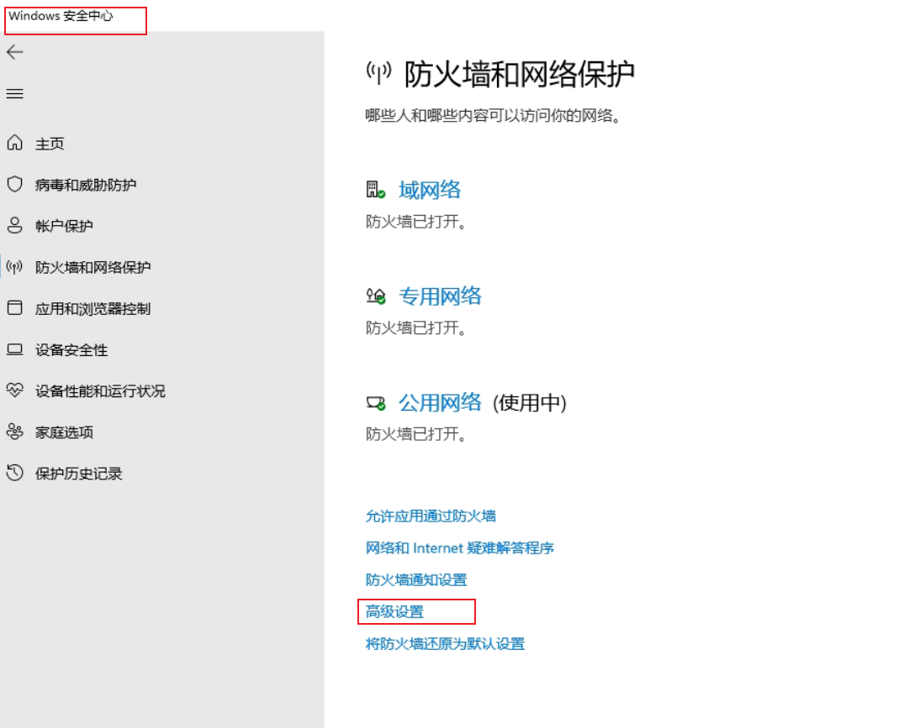
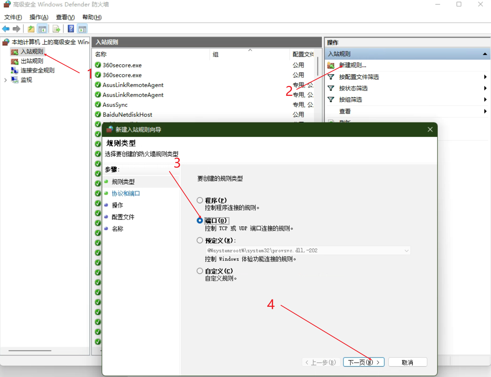
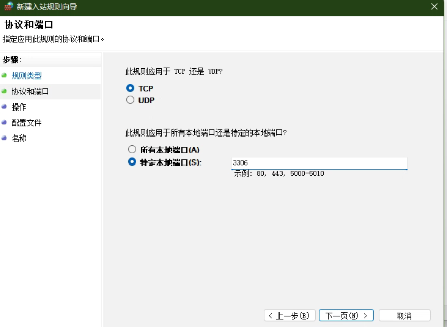
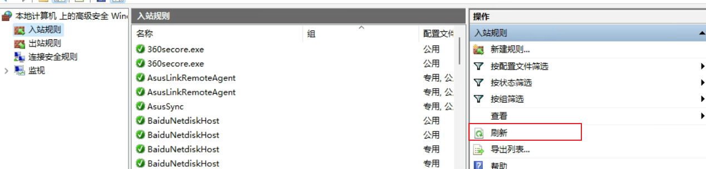

# 一、数据库操作

## 1、数据库登录

```sql
[root@host]# mysql -u root -p   
Enter password:******  # 登录后进入终端
```

## 2、MySQL 创建数据库

我们可以在登陆 MySQL 服务后，使用 **create** 命令创建数据库，语法如下:

```sql
CREATE DATABASE 数据库名;
```

## 3、数据库表创建

```sql
DROP TABLE IF EXISTS admin;
CREATE TABLE admin (
  id int(11) NOT NULL AUTO_INCREMENT COMMENT '主键',
  name varchar(255) DEFAULT NULL COMMENT '账号',
  password varchar(255) DEFAULT NULL COMMENT '密码',
  PRIMARY KEY (id)
) ENGINE=InnoDB AUTO_INCREMENT=1000 DEFAULT CHARSET=utf8 COMMENT='管理员';
```

## 4、修改表名

### 语法

```sql
alter table oldTableName rename to newTableName;
```

### 例：

```sql
alter table admin rename to newAdmin;
```

## 5、修改列

### 语法

```sql
-- 修改表列类型
-- 数据库中address表 city字段是varchar(30)，修改类型可以用（谨慎修改类型，可能会导致原有数据出错）
alter table 表名 modify column 字段名 类型;
-- 修改表列名
alter table 表名 change  column 原字段名 新字段名 类型;

```

### 例：

修改列类型

```sql
alter table newAdmin modify column password varchar(50);
```

修改表列名

```sql
alter table newAdmin change  column password pwod varchar(50)
```

添加列

```sql
alter table newAdmin add column newColumn varchar(10); -- 添加表列 
-- 给表添加列
ALTER TABLE supplier_seller
ADD COLUMN company_id INT NULL COMMENT '供应主体id';
-- 默认情况下，添加的列会添加到最后一列。

-- 如果要求添加到指定位置，语句如下：

ALTER TABLE supplier_seller
ADD COLUMN company_id INT NULL COMMENT '供应主体id' AFTER mdm_info_json;
-- 如果想要添加到第一列，语句如下：

ALTER TABLE supplier_seller
ADD COLUMN company_id INT NULL COMMENT '供应主体id' FIRST ;
-- 如果要求不可为空，语句如下：

ALTER TABLE supplier_seller
ADD COLUMN company_id INT NOT NULL COMMENT '供应主体id';
-- 给表添加注释
ALTER TABLE supplier_seller COMMENT '联营商';
-- 以上语句是给supplier_seller表添加注释：联营商

-- 给列添加注释
ALTER TABLE supplier_seller MODIFY company_name VARCHAR(50) COMMENT '供应主体名称';
-- 以上语句是给supplier_seller表的company_name列添加注释：供应主体名称
```

删除列

```sql
alter table newAdmin drop column newColumn; -- 删除表列
```

# 二、增删改查操作

# 三、日期处理

## 1、日期相差加减

> - FRAC_SECOND 毫秒
> - SECOND 秒
> - MINUTE 分钟
> - HOUR 小时
> - DAY 天
> - WEEK 星期
> - MONTH 月
> - QUARTER 季度
> - YEAR 年

MYSQL自带的日期函数TIMESTAMPDIFF计算两个日期相差的秒数、分钟数、小时数、天数、周数、季度数、月数、年数，当前日期增加或者减少一天、一周等等。

### 语法

```sql
SELECT TIMESTAMPDIFF(类型,开始时间,结束时间)
```

### 相差的秒数：

```sql
SELECT TIMESTAMPDIFF(SECOND,'1993-03-23 00:00:00',DATE_FORMAT(NOW(), '%Y-%m-%d %H:%i:%S'))
```

### 相差的分钟数：

```sql
SELECT TIMESTAMPDIFF(MINUTE,'1993-03-23 00:00:00',DATE_FORMAT(NOW(), '%Y-%m-%d %H:%i:%S'))
```

### 相差的小时数：

```sql
SELECT TIMESTAMPDIFF(HOUR,'1993-03-23 00:00:00 00:00:00',DATE_FORMAT(NOW(), '%Y-%m-%d %H:%i:%S'))
```

### 相差的天数：

```sql
SELECT TIMESTAMPDIFF(DAY,'1993-03-23 00:00:00',DATE_FORMAT(NOW(), '%Y-%m-%d %H:%i:%S'))
```

### 相差的周数：

```sql
SELECT TIMESTAMPDIFF(WEEK,'1993-03-23 00:00:00',DATE_FORMAT(NOW(), '%Y-%m-%d %H:%i:%S'))
```

### 相差的季度数：

```sql
SELECT TIMESTAMPDIFF(QUARTER,'1993-03-23 00:00:00',DATE_FORMAT(NOW(), '%Y-%m-%d %H:%i:%S'))
```

### 相差的月数：

```sql
SELECT TIMESTAMPDIFF(MONTH,'1993-03-23 00:00:00',DATE_FORMAT(NOW(), '%Y-%m-%d %H:%i:%S'))
```

### 相差的年数：

```sql
SELECT TIMESTAMPDIFF(YEAR,'1993-03-23 00:00:00',DATE_FORMAT(NOW(), '%Y-%m-%d %H:%i:%S'))
```

### 获取当前日期：

```sql
SELECT NOW()
SELECT CURDATE()
```

### 当前日期增加一天：

```sql
SELECT DATE_SUB(CURDATE(),INTERVAL -1 DAY)
```

### 当前日期减少一天：

```sql
SELECT DATE_SUB(CURDATE(),INTERVAL 1 DAY)
```

### 当前日期增加一周：

```sql
SELECT DATE_SUB(CURDATE(),INTERVAL -1 WEEK)
```

### 当前日期增加一月：

```sql
SELECT DATE_SUB(CURDATE(),INTERVAL -1 MONTH)
SELECT DATE_SUB(NOW(),INTERVAL -1 MONTH)
```

# 四、MySql同一局域网连接

当处于同一局域网时，一台电脑需要连接另一台电脑的mysql数据库时，需要以下设置；

## 1、数据库配置

打开`MySQL client`终端，输入密码


切换至mysql数据库；

```sql
use mysql;

-- 执行命令 修改user表中host的值更改为%
select host from user where user = 'root';  -- 查询出host列为localhost
update user set host='%' where user = 'root';
-- 刷新
flush privileges;
```


## 2、防火墙配置

打开Windows安全中心---》高级选项





设置3306端口



默认下一步即可

最后注意刷星列表



