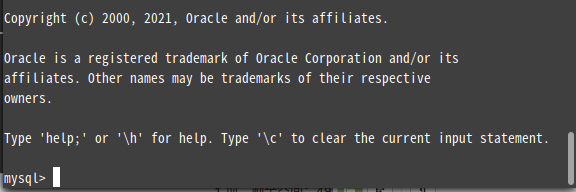

# 一、安装VM15

```java
//VMware Workstation Pro 15 激活许可证：
UY758-0RXEQ-M81WP-8ZM7Z-Y3HDA
VF750-4MX5Q-488DQ-9WZE9-ZY2D6
UU54R-FVD91-488PP-7NNGC-ZFAX6
YC74H-FGF92-081VZ-R5QNG-P6RY4
YC34H-6WWDK-085MQ-JYPNX-NZRA2
```

# 二、Linux mint

## 1.下载镜像

https://www.linuxmint.com/edition.php?id=288

## 2.在VM中安装

### 新建虚拟机


选择典型


选择稍后安装操作系统


如图勾选


设置名称 及其路径


默认下一步


完成


配置设备内存、处理器、硬盘

使用ISO镜像文件


### 开启虚拟机


默认


点击镜像文件进行安装


选中文简体，继续


默认


继续


现在安装


继续


选择上海，继续


==设置密码== 用户名：`daniel` 密码：`daniel`


耐心等待安装完毕即可


# 三、安装xShell和xftp

## 安装连接软件

将解压的安装包直接点击卸载，然后点击绿色，桌面会出现相应的快捷方式


## 连接接Linux mint

### Xshell连接


主机地址查看，进入虚拟机


点击连接，双击会话,输入用户名`daniel` ,记住用户名


双击会话，输入密码``daniel`` ，记住密码


### 如出现无法连接ip

```java
//0、执行 
ps -e|grep ssh   //若看到ssh-agent,sshd则表示未安装服务，或未启动服务
//1.安装ssh
sudo apt install openssh-server
//2.启动服务
/etc/init.d/ssh start
```

再次连接即可


### xftp连接类似


# 四、配置linux mint

## 1.切换软件源


## 2.安装yum命令

```shell
apt install yum
```

如出现


更新apt命令

```
sudo apt-get update
```

再次安装

```shell
sudo apt-get yum
```

如若还未解决，则更改源

```shell
cd /etc/apt
sudo cp sources.list sources.list.old #复制sources.list文件
```


使用vim命令打开，如若未安装则安装

```shell
apt install vim
```

赋予权限后打开

```shell
sudo chmod 777 sources.list
vim sources.list
```

使用编译器`vim`，修改`sources.list` 文件，此刻会弹出很多内容，选中文件内容删掉，替换成镜像源。

以下是`ubuntu18.04`的清华源，如下。

```shell
deb https://mirrors.tuna.tsinghua.edu.cn/ubuntu/ bionic main restricted universe multiverse
# deb-src https://mirrors.tuna.tsinghua.edu.cn/ubuntu/ bionic main restricted universe multiverse
deb https://mirrors.tuna.tsinghua.edu.cn/ubuntu/ bionic-updates main restricted universe multiverse
# deb-src https://mirrors.tuna.tsinghua.edu.cn/ubuntu/ bionic-updates main restricted universe multiverse
deb https://mirrors.tuna.tsinghua.edu.cn/ubuntu/ bionic-backports main restricted universe multiverse
# deb-src https://mirrors.tuna.tsinghua.edu.cn/ubuntu/ bionic-backports main restricted universe multiverse
deb https://mirrors.tuna.tsinghua.edu.cn/ubuntu/ bionic-security main restricted universe multiverse
# deb-src https://mirrors.tuna.tsinghua.edu.cn/ubuntu/ bionic-security main restricted universe multiverse
```

按Esc 输入`:wq` 保存退出

执行yum安装命令

```
apt install yum
```

如出现如下情况，则依次安装


```shell
# yum : 依赖: python-lzma 但是它将不会被安装
#       依赖: python-sqlitecachec 但是它将不会被安装
#       依赖: python-urlgrabber 但是它将不会被安装
apt install python-lzma
apt install python-sqlitecachec
apt install python-urlgrabber
```

再次执行yum安装命令

```shell
apt install yum
```

如图所示，已经安装


## 3、安装google

1. 登入网址（https://www.google.cn/chrome/）或者自行百度来下载谷歌浏览器安装包

　或者输入网址直接下载：

　　32位　　

```
wget https://dl.google.com/linux/direct/google-chrome-stable_current_i386.deb
```

　　64位

```
　wget https://dl.google.com/linux/direct/google-chrome-stable_current_amd64.deb
```

2. 打开安装包位置的终端，输入代码进行安装

```
sudo dpkg -i google-chrome*; sudo apt-get -f install
```

## 4.获取root权限

​	在登录时我们可能会碰到``su 认证失败的情况`` 如下图所示


解决办法非常简单，只需要重新设置下密码即可。下面是设置的方法：

```shell
daniel@daniel:~$ sudo passwd
[sudo] daniel 的密码：             # <---输入安装时那个用户的密码      
新的密码：                        # <---输入新的用户的密码      
重新输入新的 密码：                # <---输入新的用户的密码      
passwd：已成功更新密码

daniel@daniel:~$ su root
密码： 
root@daniel:/home/daniel#        # <---成功进入root
```

# 五、安装Mysql

## 1.下载软件包

```shell
sudo apt-get install mysql-server
```

安装完毕测试

```shell
 mysql -u root -p
 输入密码：daniel #用户密码
```

安装成功



# 六、安装百度输入法

## 1.zip解压详解

```shell
范例：
zip命令可以用来将文件压缩成为常用的zip格式。unzip命令则用来解压缩zip文件。
1. 我想把一个文件abc.txt和一个目录dir1压缩成为yasuo.zip：
# zip -r yasuo.zip abc.txt dir1
2.我下载了一个yasuo.zip文件，想解压缩：
# unzip yasuo.zip
3.我当前目录下有abc1.zip，abc2.zip和abc3.zip，我想一起解压缩它们：
＃ unzip abc\?.zip
注释：?表示一个字符，如果用*表示任意多个字符。
4.我有一个很大的压缩文件large.zip，我不想解压缩，只想看看它里面有什么：
# unzip -v large.zip
5.我下载了一个压缩文件large.zip，想验证一下这个压缩文件是否下载完全了
# unzip -t large.zip
6.我用-v选项发现music.zip压缩文件里面有很多目录和子目录，并且子目录中其实都是歌曲mp3文件，我想把这些文件都下载到第一级目录，而不是一层一层建目录：
# unzip -j music.zip
```

## 2.下载

https://srf.baidu.com/site/guanwang_linux/index.html

## 3.安装

解压

```shell
daniel@Daniel:~/Resource$ unzip Ubuntu_Deepin-fcitx-baidupinyin-64.zip
```

注销即可

# 七、安装jdk

## 1.上传文件

使用xftp上传文件


## 2.解压文件

在/home/daniel/software目录下开启终端，解压jdk安装包

```shell
daniel@daniel:~/software$ tar -zxvf jdk-9.0.1_linux-x64_bin.tar.gz 
```

## 3.配置环境

``/etc/profile``文件的改变会涉及到系统的环境，也就是有关Linux环境变量的东西

所以，我们要将jdk配置到``/etc/profile``，才可以在任何一个目录访问jdk

```shell
daniel@daniel:~/software$ vim /etc/profile
```


按i进入编辑，在profile文件尾部添加如下内容

```shell
JAVA_HOME=/home/daniel/software/jdk1.8.0_301
PATH=$JAVA_HOME/bin:$PATH
CLASSPATH=.:$JAVA_HOME/lib/dt.jar:$JAVA_HOME/lib/tools.jar
export JAVA_HOME
export PATH
export CLASSPATH
```

保存并退出编辑

通过命令source /etc/profile让profile文件立即生效

```shell
daniel@daniel:~/software$ source /etc/profile
```

## 4.测试是否安装成功

```shell
daniel@daniel:~/software$ java -version
```

linux下jdk8安装成功


# 八、安装IDEA

解压后直接执行bin目录下的idea.sh

# 九、安装Tomcat

解压安装包配置环境

## 1.解压包

```shell
daniel@daniel:~/software$ tar -zxvf apache-tomcat-9.0.8.tar.gz 
```

## 2、启动tomcat目录下的/bin/startup.sh

```shell
daniel@daniel:~/software$ sh startup.sh
```

