# 一、安装VM15

```java
//VMware Workstation Pro 15 激活许可证：
UY758-0RXEQ-M81WP-8ZM7Z-Y3HDA
VF750-4MX5Q-488DQ-9WZE9-ZY2D6
UU54R-FVD91-488PP-7NNGC-ZFAX6
YC74H-FGF92-081VZ-R5QNG-P6RY4
YC34H-6WWDK-085MQ-JYPNX-NZRA2
```

# 二、Linux mint

## 1.下载镜像

https://www.linuxmint.com/edition.php?id=288

## 2.在VM中安装

### 新建虚拟机


选择典型

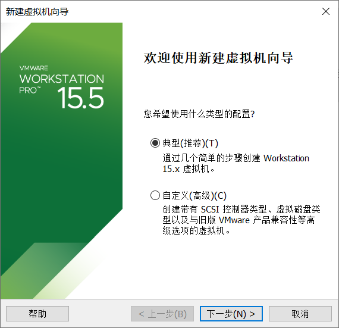

选择稍后安装操作系统

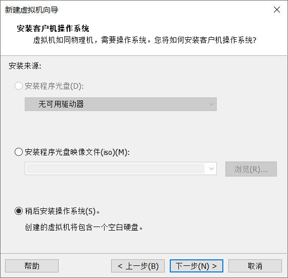

如图勾选


设置名称 及其路径

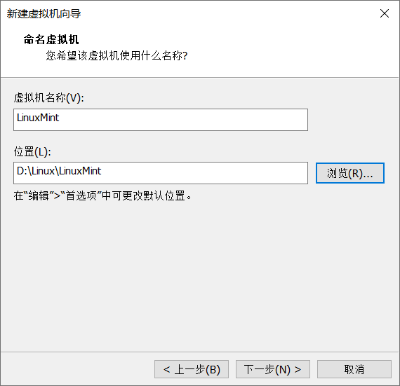

默认下一步


完成

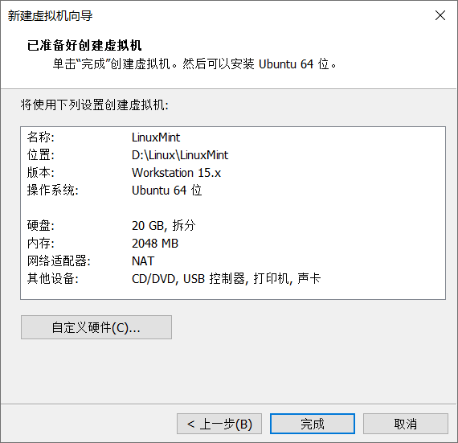

配置设备内存、处理器、硬盘

使用ISO镜像文件

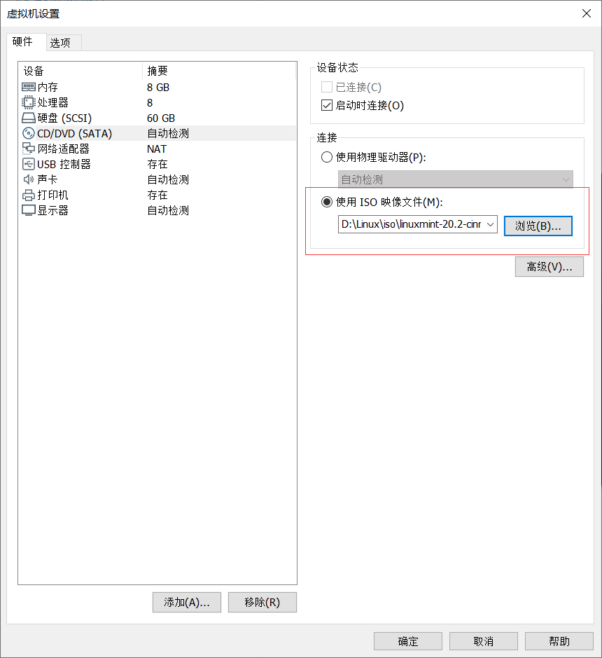

### 开启虚拟机

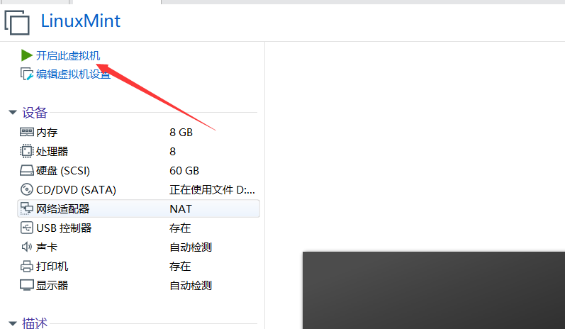

默认

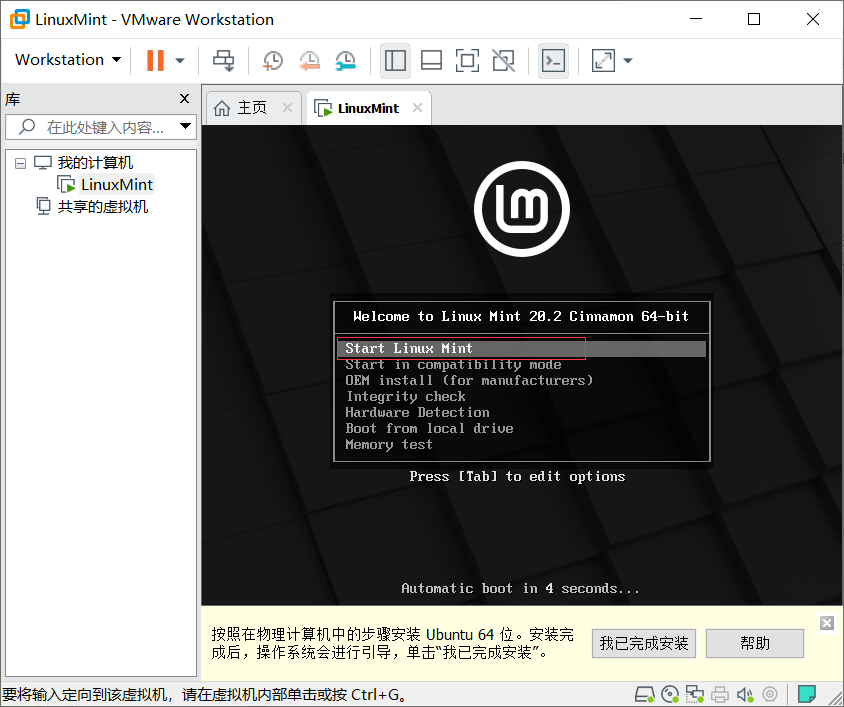

点击镜像文件进行安装


选中文简体，继续

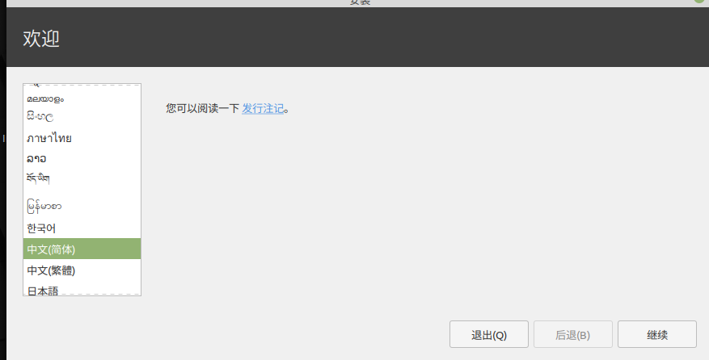

默认

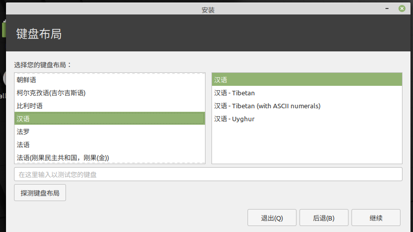

继续

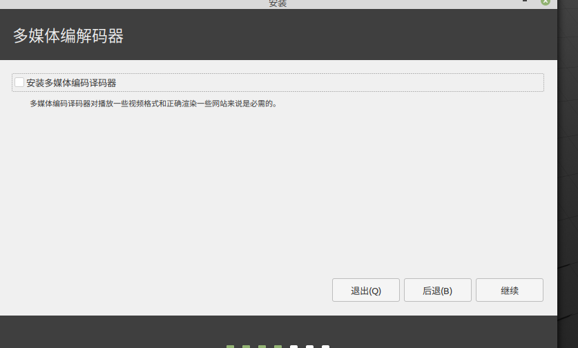

现在安装

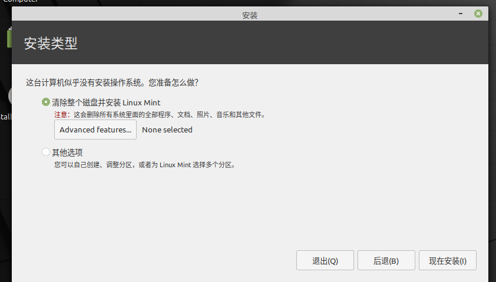

继续

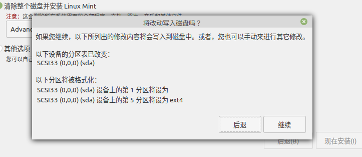

选择上海，继续

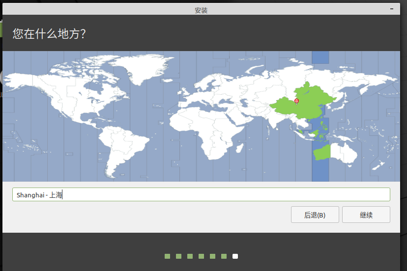

==设置密码== 用户名：`daniel` 密码：`daniel`

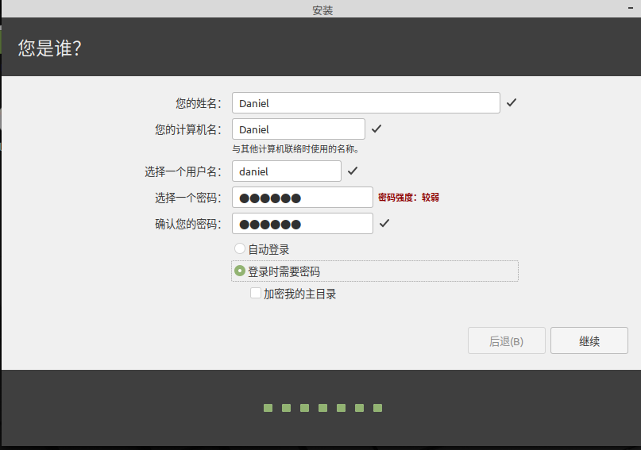

耐心等待安装完毕即可


# 三、安装xShell和xftp

## 安装连接软件

将解压的安装包直接点击卸载，然后点击绿色，桌面会出现相应的快捷方式

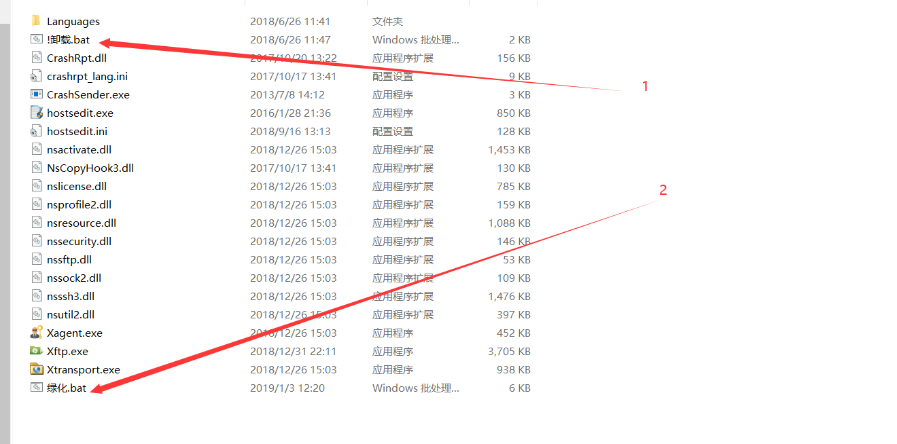

## xshell6启动问题

启动时msvcp110.dll、msvcr110.dll、mfc110u.dll丢失解决

前往微软下载相关文件安装


https://visualstudio.microsoft.com/zh-hans/vs/older-downloads/

## 连接接Linux mint

### Xshell连接

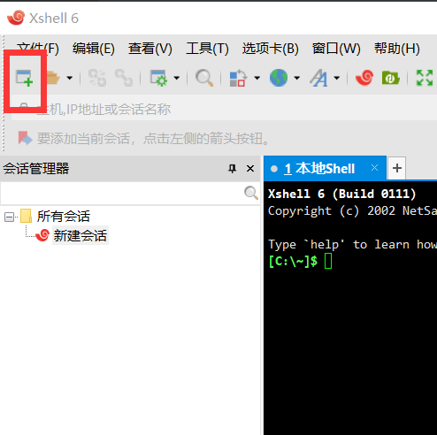

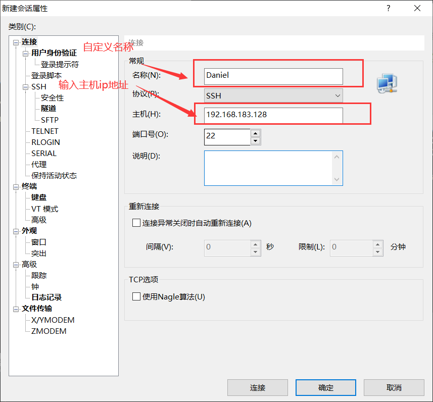

主机地址查看，进入虚拟机

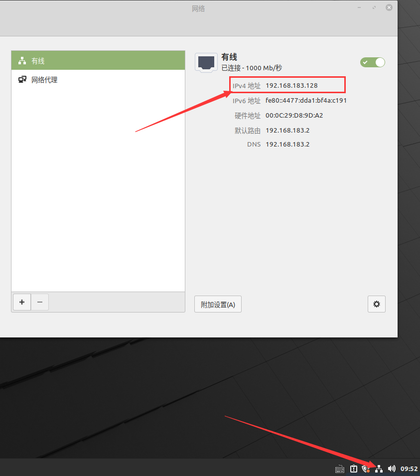

点击连接，双击会话,输入用户名`daniel` ,记住用户名

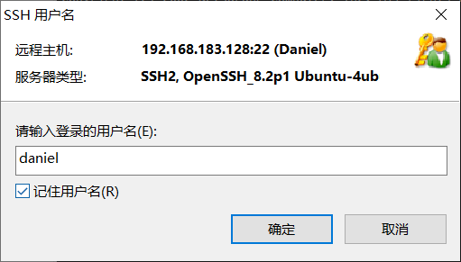

双击会话，输入密码``daniel`` ，记住密码

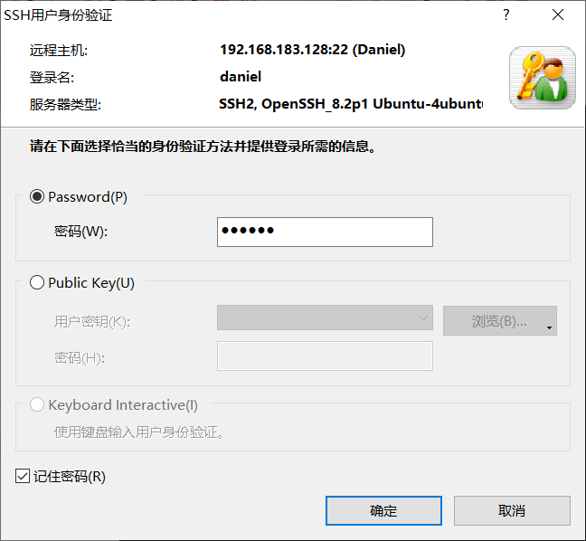

### 如出现无法连接ip

```java
//0、执行 
ps -e|grep ssh   //若看到ssh-agent,sshd则表示未安装服务，或未启动服务
//1.安装ssh
sudo apt install openssh-server
//2.启动服务
/etc/init.d/ssh start
```

再次连接即可

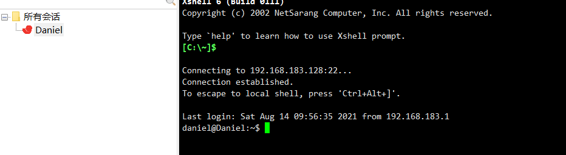

### xftp连接类似

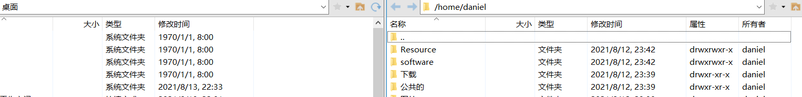

# 四、配置linux mint

## 1.切换软件源

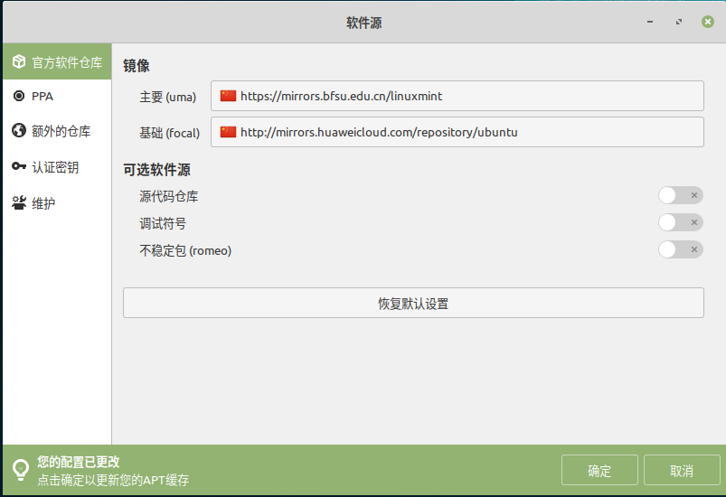

## 2.安装yum命令

```shell
apt install yum
```

如出现


更新apt命令

```
sudo apt-get update
```

再次安装

```shell
sudo apt-get yum
```

如若还未解决，则更改源

```shell
cd /etc/apt
sudo cp sources.list sources.list.old #复制sources.list文件
```


使用vim命令打开，如若未安装则安装

```shell
apt install vim
```

赋予权限后打开

```shell
sudo chmod 777 sources.list
vim sources.list
```

使用编译器`vim`，修改`sources.list` 文件，此刻会弹出很多内容，选中文件内容删掉，替换成镜像源。

以下是`ubuntu18.04`的清华源，如下。

```shell
deb https://mirrors.tuna.tsinghua.edu.cn/ubuntu/ bionic main restricted universe multiverse
# deb-src https://mirrors.tuna.tsinghua.edu.cn/ubuntu/ bionic main restricted universe multiverse
deb https://mirrors.tuna.tsinghua.edu.cn/ubuntu/ bionic-updates main restricted universe multiverse
# deb-src https://mirrors.tuna.tsinghua.edu.cn/ubuntu/ bionic-updates main restricted universe multiverse
deb https://mirrors.tuna.tsinghua.edu.cn/ubuntu/ bionic-backports main restricted universe multiverse
# deb-src https://mirrors.tuna.tsinghua.edu.cn/ubuntu/ bionic-backports main restricted universe multiverse
deb https://mirrors.tuna.tsinghua.edu.cn/ubuntu/ bionic-security main restricted universe multiverse
# deb-src https://mirrors.tuna.tsinghua.edu.cn/ubuntu/ bionic-security main restricted universe multiverse
```

按Esc 输入`:wq` 保存退出

执行yum安装命令

```
apt install yum
```

如出现如下情况，则依次安装

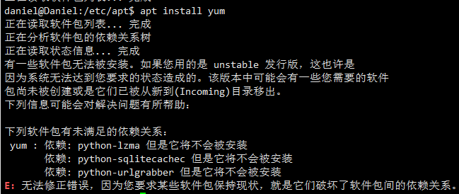

```shell
# yum : 依赖: python-lzma 但是它将不会被安装
#       依赖: python-sqlitecachec 但是它将不会被安装
#       依赖: python-urlgrabber 但是它将不会被安装
apt install python-lzma
apt install python-sqlitecachec
apt install python-urlgrabber
```

再次执行yum安装命令

```shell
apt install yum
```

如图所示，已经安装

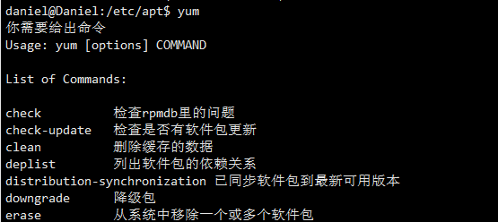

## 3、安装google

1. 登入网址（https://www.google.cn/chrome/）或者自行百度来下载谷歌浏览器安装包

　或者输入网址直接下载：

　　32位　　

```
wget https://dl.google.com/linux/direct/google-chrome-stable_current_i386.deb
```

　　64位

```
　wget https://dl.google.com/linux/direct/google-chrome-stable_current_amd64.deb
```

2. 打开安装包位置的终端，输入代码进行安装

```
sudo dpkg -i google-chrome*; sudo apt-get -f install
```

## 4.获取root权限

​	在登录时我们可能会碰到``su 认证失败的情况`` 如下图所示

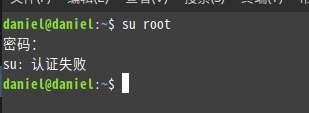

解决办法非常简单，只需要重新设置下密码即可。下面是设置的方法：

```shell
daniel@daniel:~$ sudo passwd
[sudo] daniel 的密码：             # <---输入安装时那个用户的密码      
新的密码：                        # <---输入新的用户的密码      
重新输入新的 密码：                # <---输入新的用户的密码      
passwd：已成功更新密码

daniel@daniel:~$ su root
密码： 
root@daniel:/home/daniel#        # <---成功进入root
```

# 五、安装Mysql

## 1 、安装前准备

### 1.1、检查是否已经安装过mysql，执行命令

```sh
rpm -qa | grep mysql
```

如果已存在，则执行删除命令 后边为Mysql目录

```sh
rpm -e --nodeps mysql-xxxx
```

### 1.2、查询所有Mysql对应的文件夹

```sh
whereis mysqlm
find / -name mysql
```

删除相关目录或文件

```sh
rm -rf /usr/bin/mysql /usr/include/mysql /data/mysql /data/mysql/mysql 
```

验证是否删除完毕

```sh
whereis mysqlm
find / -name mysql
```

### 1.3、检查mysql用户组和用户是否存在

```sh
cat /etc/group | grep mysql
cat /etc/passwd |grep mysql
# 如果没有，则创建
groupadd mysql
useradd -r -g mysql mysql 
```

### 1.4、从官网下载是用于Linux的Mysql安装包

上传服务器

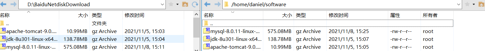

## 2、安装Mysql

解压该文件

```sh
tar -zxvf mysql-8.0.11-linux-glibc2.12-x86_64.tar.gz 
```

移动文件到`/usr/local/`并重命名为`mysql`，如果有`mysql`文件夹需将其改为其他名称，防止后续影响。

```sh
mv /home/daniel/software/mysql-8.0.11-linux-glibc2.12-x86_64 /usr/local/
```

重命名

```sh
mv mysql-8.0.11-linux-glibc2.12-x86_64 mysql
```

在**/usr/local/mysql**目录下创建data目录

```sh
mkdir /usr/local/mysql/data
```

更改mysql目录下所有的目录及文件夹所属的用户组和用户，以及权限

```sh
chown -R mysql:mysql /usr/local/mysql
chmod -R 755 /usr/local/mysql
```

 如果报以上错误，说明mysql用户不存在，执行以下命令，操作完再执行更改权限命令

```sh
groupadd mysql
useradd -r -g mysql mysql
```

编译安装并初始化mysql,**务必记住初始化输出日志末尾的密码（数据库管理员临时密码）**

```sh
cd /usr/local/mysql/bin
./mysqld --initialize --user=mysql --datadir=/usr/local/mysql/data --basedir=/usr/local/mysql
#初始化遇到问题
#./mysqld: error while loading shared libraries: libaio.so.1: cannot open shared object file: No such file or directory
#执行以下命令：
apt-get install libaio1 libaio-dev
#然后初始化，注意日志末尾密码
```

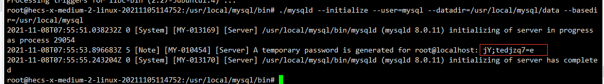

## 3、编辑配置文件

my.cnf添加配置如下

```sh
vim /etc/my.cnf

[mysqld]
datadir=/usr/local/mysql/data
port = 3306
sql_mode=NO_ENGINE_SUBSTITUTION,STRICT_TRANS_TABLES
symbolic-links=0
max_connections=400
innodb_file_per_table=1
lower_case_table_names=1
character_set_server=utf8
```

`lower_case_table_names`：是否区分大小写，1表示存储时表名为小写，操作时不区分大小写；0表示区分大小写；不能动态设置，修改后，必须重启才能生效：

`character_set_server`：设置数据库默认字符集，如果不设置默认为latin1

`innodb_file_per_table`：是否将每个表的数据单独存储，1表示单独存储；0表示关闭独立表空间，可以通过查看数据目录，查看文件结构的区别；

### 4、解决中文乱码问题：

echo 修改my.cnf文件  

```shell
sudo vi /etc/my.cnf 
```

在[mysqld]下加入代码：

```sh
character_set_server=utf8
```

在[ mysql ]下加入代码：

```sh
default-character-set=utf8
```

## 4、启动mysql服务器

```sh
/usr/local/mysql/support-files/mysql.server start
#添加软连接，并重启mysql服务
ln -s /usr/local/mysql/support-files/mysql.server /etc/init.d/mysql 
ln -s /usr/local/mysql/bin/mysql /usr/bin/mysql
service mysql restart
#重启失败:Failed to restart mysql.service: Unit mysql.service not found.
#需要安装以下
apt install mariadb-server
```

## 5、登录mysql

修改密码(密码为步骤4生成的临时密码)

```sh
mysql -u root -p
```

登录成功：

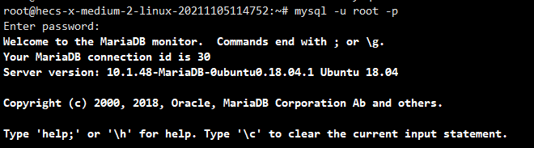

```sh
set password for root@localhost = password('daniel');#修改密码
```

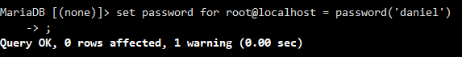

## 6、开放远程连接

```sql
mysql>use mysql;
msyql>update user set user.Host='%' where user.User='root';
mysql>flush privileges;
```

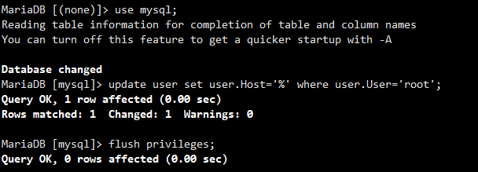

 执行完上边命令后，通过数据库客户端就可以连上云数据库

## 7、设置开机自动启动

将服务文件拷贝到init.d下，并重命名为mysql

```sh
cp /usr/local/mysql/support-files/mysql.server /etc/init.d/mysqld
```

赋予可执行权限

```sh
chmod +x /etc/init.d/mysqld
```

添加服务

```sh
chkconfig --add mysqld
```

显示服务列表

```sh
chkconfig --list
```

使用chkconfig报错，可能使用的是ubantu系统

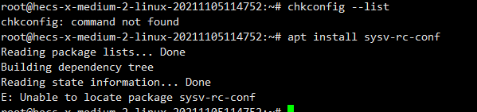

解决:

在软件源列表sources.list（该文本的位置在/etc/apt/sources.list）文件中的末尾添加如下内容：

```sh
vim /etc/apt/sources.list
```


```sh
deb http://archive.ubuntu.com/ubuntu/ trusty main universe restricted multivers
```

更新apt-get，在终端输入

```sh
sudo apt-get update
```

完成更新后，重新安装sysv-rc-conf，在终端输入

```sh
sudo apt-get install sysv-rc-conf
```

即可成功安装。

使用sysv-rc-conf查看当前服务状态

```sh
sudo sysv-rc-conf
```

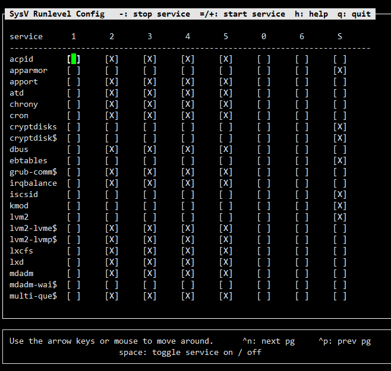

操作界面十分简洁，可以用鼠标点击，也可以用键盘方向键定位，用空格键选择，用Ctrl+N翻下一页，用Ctrl+P翻上一页，用Q退出。当方括号中打X的即表示运行在对应runlevel时开机启动的服务。

设置自启动

```sh
sudo sysv-rc-conf --level 2345 mysql on
```

查看设置结果

```sh
sudo sysv-rc-conf --list mysql
```

重启系统，检查mysql状态

```sh
sudo reboot
```


## 8、常用命令

### 创建数据库

```sql
mysql>create database music;
```

### 查看数据库

```sql
mysql>show databases;
```

### 切换数据库

```sql
mysql>use music; 
```

### 导入sql文件

```sql
# 输入命令：（运行SQL文件）
mysql>source /opt/uc_menu.sql;
```

### 查看所有表

```sql
mysql>show tables;
```


# 六、安装百度输入法

## 1.zip解压详解

```shell
范例：
zip命令可以用来将文件压缩成为常用的zip格式。unzip命令则用来解压缩zip文件。
1. 我想把一个文件abc.txt和一个目录dir1压缩成为yasuo.zip：
# zip -r yasuo.zip abc.txt dir1
2.我下载了一个yasuo.zip文件，想解压缩：
# unzip yasuo.zip
3.我当前目录下有abc1.zip，abc2.zip和abc3.zip，我想一起解压缩它们：
＃ unzip abc\?.zip
注释：?表示一个字符，如果用*表示任意多个字符。
4.我有一个很大的压缩文件large.zip，我不想解压缩，只想看看它里面有什么：
# unzip -v large.zip
5.我下载了一个压缩文件large.zip，想验证一下这个压缩文件是否下载完全了
# unzip -t large.zip
6.我用-v选项发现music.zip压缩文件里面有很多目录和子目录，并且子目录中其实都是歌曲mp3文件，我想把这些文件都下载到第一级目录，而不是一层一层建目录：
# unzip -j music.zip
```

## 2.下载

https://srf.baidu.com/site/guanwang_linux/index.html

## 3.安装

解压

```shell
daniel@Daniel:~/Resource$ unzip Ubuntu_Deepin-fcitx-baidupinyin-64.zip
```

注销即可

# 七、安装jdk

## 1.上传文件

使用xftp上传文件

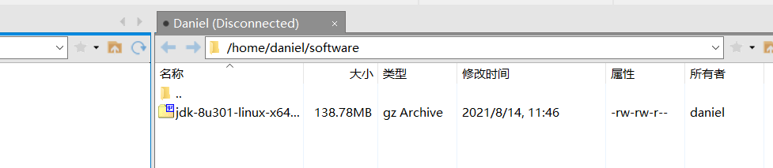

## 2.解压文件

在/home/daniel/software目录下开启终端，解压jdk安装包

```shell
daniel@daniel:~/software$ tar -zxvf jdk-9.0.1_linux-x64_bin.tar.gz 
```

## 3.配置环境

``/etc/profile``文件的改变会涉及到系统的环境，也就是有关Linux环境变量的东西

所以，我们要将jdk配置到``/etc/profile``，才可以在任何一个目录访问jdk

```shell
daniel@daniel:~/software$ vim /etc/profile
```


按i进入编辑，在profile文件尾部添加如下内容

```shell
JAVA_HOME=/home/daniel/software/jdk1.8.0_301
PATH=$JAVA_HOME/bin:$PATH
CLASSPATH=.:$JAVA_HOME/lib/dt.jar:$JAVA_HOME/lib/tools.jar
export JAVA_HOME
export PATH
export CLASSPATH
```

保存并退出编辑

通过命令source /etc/profile让profile文件立即生效

```shell
daniel@daniel:~/software$ source /etc/profile
```

## 4.测试是否安装成功

```shell
daniel@daniel:~/software$ java -version
```

linux下jdk8安装成功


# 八、安装IDEA

解压后直接执行bin目录下的idea.sh

# 九、安装Tomcat

解压安装包配置环境

## 1.解压包

```shell
daniel@daniel:~/software$ tar -zxvf apache-tomcat-9.0.8.tar.gz 
```

## 2、启动tomcat目录下的/bin/startup.sh

```shell
daniel@daniel:~/software$ sh startup.sh
```

# 十、安装node.js

下载压缩包。

这里下载的是node-v16.13.0-linux-x64.tar.xz

```sh
xz -d node-v16.13.0-linux-x64.tar.xz ---将tar.xz解压成tar文件
tar -xvf node-v16.13.0-linux-x64.tar ---将tar文件解压成文件夹
mv node-v16.13.0-linux-x64 node ----改文件夹的名字，改成node
mv node-v16.13.0-linux-x64 /usr/local/node
```

检查是否可以安装成功


 

配置软连接，使全局都可以使用node命令

```sh
ln -s /usr/local/node/bin/node /usr/bin/node  --将node源文件映射到usr/bin下的node文件
ln -s /usr/local/node/bin/npm /usr/bin/npm
```

配置node文件安装路径

进入/usr/local/node/路径下:

```sh
mkdir node_global
mkdir node_cache
npm config set prefix "node_global"
npm config set cache "node_cache"
```

 当你觉得npm慢的时候，可以安装cnpm

```sh
npm install cnpm -g --registry=https://registry.npm.taobao.org
```

顺便可以检查一下-g这个全局安装有没有按照之前设置的，安装到node_global文件下。

如下全局使用cnpm，也要记得配置一个软连接。

```sh
ln -s /usr/local/node/node_global/lib/node_modules/cnpm /usr/bin/cnpm
```

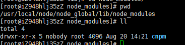

 

