# 一、CSS3 边框

| 属性                                                         | 描述                                           | CSS  |
| ------------------------------------------------------------ | ---------------------------------------------- | ---- |
| [border-image](https://www.w3school.com.cn/cssref/pr_border-image.asp) | 设置所有 border-image-\* 属性的简写属性。      | 3    |
| [border-radius](https://www.w3school.com.cn/cssref/pr_border-radius.asp) | 设置所有四个 border-\*-radius 属性的简写属性。 | 3    |
| [box-shadow](https://www.w3school.com.cn/cssref/pr_box-shadow.asp) | 向方框添加一个或多个阴影。                     |      |

## CSS3 圆角边框

```html
<div>这是一个div</div>
```

```css
div{
    text-align: center;
    line-height: 100px;/*文字垂直居中*/
    border:2px solid #cccccc;
    width: 100px;
    height: 100px;
    border-radius:50px;/*设置圆角范围是0到最大宽或高的一半*/
    -moz-border-radius:25px; /* Old Firefox */     
```

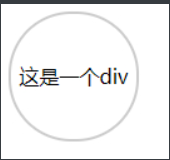

## CSS3 边框阴影

官方用语：   `box-shadow:1px 2px 3px 4px #ccc inset；`

来分别看一下以上六个值的含义： 

> - 1px  从原点开始，沿x轴正方向的长度（倘若为负值，为沿x轴负方向的长度）；
> - 2px  从原点开始，沿y轴正方向的长度；（倘若为负值，为沿y轴负方向的长度）；
> - 3px  阴影的模糊度，只允许为正值；
> - 4px  阴影扩展半径；
> - #ccc 阴影颜色；(默认黑色）
> - inset  设置为内阴影（如果不写这个值，默认为外阴影）；

```css
div{
    text-align: center;
    line-height: 100px;/*文字垂直居中*/
    border:2px solid #cccccc;
    width: 100px;
    height: 100px;
    /*box-shadow:水平偏移 垂直偏移 偏移颜色的透明度 偏移颜色（默认黑色）*/
    box-shadow: 10px 10px 5px #cccccc;
}
```

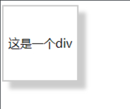

## CSS3 边框图片

1.border-image的参数有三个，分别是图片链接，裁剪位置，重复方式

图片链接（border-image-source）

在background中用的是url，这里也可以用url（）进行调用，可以用相对地址和绝对地址，当然，不要也是可以的，那就是border-image:none;

图片的裁剪位置（border-image-slice）

这个参数是没有单位的，或者说是默认单位就是像素(px)，并且支持百分比值，这里的位置可以是1到4个参数，和margin的理解方式一样，分别表示上右下左，即第一个参数表示距离上面多少，第二个表示距离右边多少，依此类推，在对边框进行四刀切的时候，会分成九块，就是形成所谓的九宫格。如下图所示

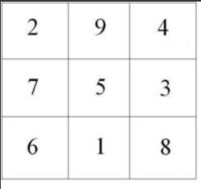

图片的重复方式(border-image-repeat)

这里的重复性要比`background`的复杂，不是简单的水平重复，垂直重复，而是三种方式，除了`repeat`（重复）之外，还有`round`（平铺），`stretch`（拉伸），其中拉伸是默认值。

```css
div{
    width: 300px;
    height: 150px;
    border: 30px solid;/*必须设定*/
    border-image:url(img/border.png) 30 30 round;
    -moz-border-image:url(img/border.png) 30 30 round; /* 老的 Firefox */
    -webkit-border-image:url(img/border.png) 30 30 round; /* Safari 和 Chrome */
    -o-border-image:url(img/border.png) 30 30 round; /* Opera */
}
```

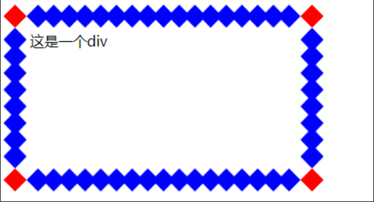

# 二、CSS3 背景

## background-size 属性

background-size 属性规定背景图片的尺寸。

在 CSS3 之前，背景图片的尺寸是由图片的实际尺寸决定的。在 CSS3 中，可以规定背景图片的尺寸，这就允许我们在不同的环境中重复使用背景图片。

您能够以像素或百分比规定尺寸。如果以百分比规定尺寸，那么尺寸相对于父元素的宽度和高度。

调整背景图片的大小：

```css
div{
    background:url(bg_flower.gif);
    -moz-background-size:63px 100px; /* 老版本的 Firefox */
    background-size:63px 100px;
    background-repeat:no-repeat;
} 
```

对背景图片进行拉伸，使其完成填充内容区域：

```css
div{
    background:url(bg_flower.gif);
    -moz-background-size:40% 100%; /* 老版本的 Firefox */
    background-size:40% 100%;
    background-repeat:no-repeat;
}
```

## background-origin 属性

background-origin 属性规定背景图片的定位区域。

背景图片可以放置于 content-box、padding-box 或 border-box 区域。

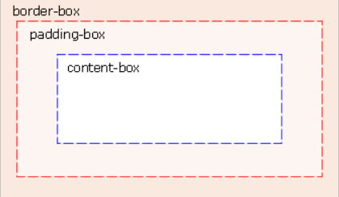

在 content-box 中定位背景图片：

```css
div{
    background:url(bg_flower.gif);
    background-repeat:no-repeat;
    background-size:100% 100%;
    -webkit-background-origin:content-box; /* Safari */
    background-origin:content-box;/*放置内容*/
}
```

## CSS3 多重背景图片

CSS3 允许您为元素使用多个背景图像。

实例

为 body 元素设置两幅背景图片：

```css
body{ 
    background-image:url(bg_flower.gif),url(bg_flower_2.gif);
}
```

## 新的背景属性

| 属性                                                         | 描述                     |
| ------------------------------------------------------------ | ------------------------ |
| [background-clip](https://www.w3school.com.cn/cssref/pr_background-clip.asp) | 规定背景的绘制区域。     |
| [background-origin](https://www.w3school.com.cn/cssref/pr_background-origin.asp) | 规定背景图片的定位区域。 |
| [background-size](https://www.w3school.com.cn/cssref/pr_background-size.asp) | 规定背景图片的尺寸。     |

# 三、CSS3 文本效果

| 属性                                                         | 描述                                                    | CSS  |
| ------------------------------------------------------------ | ------------------------------------------------------- | ---- |
| [hanging-punctuation](https://www.w3school.com.cn/cssref/pr_hanging-punctuation.asp) | 规定标点字符是否位于线框之外。                          | 3    |
| [punctuation-trim](https://www.w3school.com.cn/cssref/pr_punctuation-trim.asp) | 规定是否对标点字符进行修剪。                            | 3    |
| text-align-last                                              | 设置如何对齐最后一行或紧挨着强制换行符之前的行。        | 3    |
| [text-emphasis](https://www.w3school.com.cn/cssref/pr_text-emphasis.asp) | 向元素的文本应用重点标记以及重点标记的前景色。          | 3    |
| [text-justify](https://www.w3school.com.cn/cssref/pr_text-justify.asp) | 规定当 text-align 设置为 "justify" 时所使用的对齐方法。 | 3    |
| [text-outline](https://www.w3school.com.cn/cssref/pr_text-outline.asp) | 规定文本的轮廓。                                        | 3    |
| [text-overflow](https://www.w3school.com.cn/cssref/pr_text-overflow.asp) | 规定当文本溢出包含元素时发生的事情。                    | 3    |
| [text-shadow](https://www.w3school.com.cn/cssref/pr_text-shadow.asp) | 向文本添加阴影。                                        | 3    |
| [text-wrap](https://www.w3school.com.cn/cssref/pr_text-wrap.asp) | 规定文本的换行规则。                                    | 3    |
| [word-break](https://www.w3school.com.cn/cssref/pr_word-break.asp) | 规定非中日韩文本的换行规则。                            | 3    |
| [word-wrap](https://www.w3school.com.cn/cssref/pr_word-wrap.asp) | 允许对长的不可分割的单词进行分割并换行到下一行。        | 3    |

## CSS3 文本阴影

在 CSS3 中，text-shadow 可向文本应用阴影。

​    ![0](data:image/jpeg;base64,/9j/4AAQSkZJRgABAQAAAQABAAD/4gIoSUNDX1BST0ZJTEUAAQEAAAIYAAAAAAIQAABtbnRyUkdCIFhZWiAAAAAAAAAAAAAAAABhY3NwAAAAAAAAAAAAAAAAAAAAAAAAAAAAAAAAAAAAAQAA9tYAAQAAAADTLQAAAAAAAAAAAAAAAAAAAAAAAAAAAAAAAAAAAAAAAAAAAAAAAAAAAAAAAAAAAAAAAAAAAAlkZXNjAAAA8AAAAHRyWFlaAAABZAAAABRnWFlaAAABeAAAABRiWFlaAAABjAAAABRyVFJDAAABoAAAAChnVFJDAAABoAAAAChiVFJDAAABoAAAACh3dHB0AAAByAAAABRjcHJ0AAAB3AAAADxtbHVjAAAAAAAAAAEAAAAMZW5VUwAAAFgAAAAcAHMAUgBHAEIAAAAAAAAAAAAAAAAAAAAAAAAAAAAAAAAAAAAAAAAAAAAAAAAAAAAAAAAAAAAAAAAAAAAAAAAAAAAAAAAAAAAAAAAAAAAAAAAAAAAAAAAAAFhZWiAAAAAAAABvogAAOPUAAAOQWFlaIAAAAAAAAGKZAAC3hQAAGNpYWVogAAAAAAAAJKAAAA+EAAC2z3BhcmEAAAAAAAQAAAACZmYAAPKnAAANWQAAE9AAAApbAAAAAAAAAABYWVogAAAAAAAA9tYAAQAAAADTLW1sdWMAAAAAAAAAAQAAAAxlblVTAAAAIAAAABwARwBvAG8AZwBsAGUAIABJAG4AYwAuACAAMgAwADEANv/bAEMAAQEBAQEBAQEBAQEBAQEBAQEBAQEBAQEBAQEBAQEBAQEBAQEBAQEBAQEBAQEBAQEBAQEBAQEBAQEBAQEBAQEBAf/bAEMBAQEBAQEBAQEBAQEBAQEBAQEBAQEBAQEBAQEBAQEBAQEBAQEBAQEBAQEBAQEBAQEBAQEBAQEBAQEBAQEBAQEBAf/AABEIACoA3QMBEQACEQEDEQH/xAAeAAACAgICAwAAAAAAAAAAAAAICQAKBQYHCwIDBP/EADYQAAAHAQACAQMDBAAFAgcAAAECAwQFBgcICRESABMUChUhFhciMSMkJTJBGCYzNUJRUnGx/8QAHQEAAQUBAQEBAAAAAAAAAAAABgAEBQcIAwkCAf/EADURAAIDAAEDBAEDAQcEAgMAAAMEAQIFBgcREgAIEyEUFTFBIgkWIyQyUWEXcYGRQvChscH/2gAMAwEAAhEDEQA/ALPXUPnq8T3GG33LnHpXqz+22zZ/+x/1dTf7GdJXD9o/qSvxdphf/cNBx601R/8AmwM1Gv8A/pk49/H/ACfxXf2HiLhukyR0E9GjBEjfNRV1zPPPxlH8biB7rNh7FoObfEYd6fJSLCJ28h3vSYtL97LezaZ5HQfDTVQpqIW+UJPnRIwypQ/YRCSLyYTYH8RoGaPj85HFLjtZX/ff6m7xqWXjnoCM4e8jStC6yJQJGTwucS5W32S/MvMKs2l2NVVS1nmeYz5ojdkGTmoHl7G2btIT97CYJJxK7FKRbRnJQ7Bs8NcW9oPGnlVeBQlAXbxDvgV3Qiak6h02hZJ3Hc9pRxVoWiop4FtSSAM+47fKpp+OzUEKFS0wiYZq3cCOkXOZrjvnEkM5jrJ6v4Zm1/xHaGUqcdkmZtA5Ur4Dv1M+b4dz7qmQ+U/p/VrVdYvUiWvJdV09lsO5WmZpVuh0SztNe2OuVy+2UGlKskK5lowlmckKRldkoeAOMXCFYxpxqtIW43xiiKi87CBdnJ0grUOJhnLGZTTx9nTbcJYL+iwxq7ORYgD1MPNw8obCtbRDbkLjpS9yTkre1rq5WU8pm6Of/gtmHO5JdFfaTVzM3Puti58piwTILJVHmyxOvf8AGQN2vo2I4z9Uf4NHyTUFu2Ts3rgU0zMz819dqCRdQQIBAWRwNRASicQADfd9AA/5CHr39NcXL0d/TysXMVk+ttaCWVnJyZcMn0NFkSaa/wCQcolRfMyYY/lOYQR+XmUlKRa0frv46tzyNmrCwYveGKjNSLCpE2m3xkHQsTFYmZr4d5/iJ/b0YfZvmd8avj40mv5D190j/aPRLTSI3RoGvf2e3u/fnUyXlZmEj5n92zDLbpBtfyJOvy7b9ueSbeVS/E+8uxSbuGqq0MJ5UzulniL5OZDAldEPgSv45zrCbFT5LUgRfJcwyeQLlpXy8LWi8WrHWijF8bJ5BUffI3fyf0pvzpH5X4lFCMf5ebQ0D46PqW/zIQ+fy9qeUjJFFDeQD9TD4n75w91nSuXe8LMx6OtXP2qQOHPKZjXXecW1rqUpUJVpSl63fnmN1drTZpKeVZHjrI4scGjEOQTeqSjIqIrkYbwdA6IKZklqzXa42YkhPC9/09fkWWxrRJJIKLCtlCdqcHlMtAki1RmsaBXeYxUguGvoQOQTlbwhwUMnr+afD0QZkxSKEmpK6RFLBN4xC5ooxNxQKSUU34C/1GWFc3cq6fT/ACZ9obXoO1TW+zFgp8pszjpPoSwsMxXoOfx0e0YW1Gs6UWKhSWaPtC5K8WZaqovFnkgESQJArp2b8h0ULYHDVcnPCbTTS2Kb5gCEoa7Bttw6EtsFoKX71ziAqMtSHgAYov3pI/CGXHcdNvY3m9vkkYyNkcUWWsZXRfGZgF9i+iQAkQs0WJapkKEuagPnig/8QkB/w7J2R/qTPDLtd9zvKKH2CaV0vU7jWM+pdVPz51PHDL3K4zTKvVyHCalsPYV+PCSmJBm0CQlpVhFsvvfffvmzVJVwVjj5elutiz85WTPlC2eq0mXF/hIqHfat8piiDHxKLHN4ySLX8PjHFyWpSzTYZz8gTzhXKkzkRFYK5UDHaFxUm5CfB8UsTNaxM+NRWvbt/TXvPjCZfOT5JvLDkvmN574A4E6tqmB1/dMVyV7EsbzlGMWyoMtCuV51mHkbHYbTb8O1q+MYxWMq0Og4aw7eSbNSsgWYwoOHLtReA4qN/d1+ZpSyGB4bWm2t89fjoHMxOnuVy58FbABchTlmulZaTRbyYYEAhwK1rYD3kpk8XP4WeirBT8jY49iTRaYIQ2zyvqMzwjJNerBxjEsE7eZDkhmLUUAc4V2Wp+I4ueNjzEeWpv5brZx33D2tQ99ynFKxr5dYUzTJ8Fg6NI2SuUwG8CvA3CEwHKdBWCB0Gbg4t80/HiTKybJ+0esXkWisdVqHleCbpr1D5darixFONay/EW2AXpanJ0uVpZa7ghQWybazmYjuvZn5nzKP5thu0DN5DIzOej/UfQ6s8L6Y46gmtQu1maHLALWoQIuKucKd5JapbtBC4MkMuYSZZQHVkT5ajqb8D8ln0tnnjzRfqcuw5rUmfMvTbS+t8pcNFreR3lXjvooQUfNvpptBGKppeZVI0v8Ak/sciQwRJ5JZv+MUz4ERcNzLOpbqhx7N3dU4wJueC35VrUmSOjSWbZr+OHyNSIGyMnyfBQEzeaDvNqXpV1/0+3eT8+5TxTguGxply9nYGvnrmpEr5y2wVBWtmdBgcXmvcIq/KxdgnaSWm/Yl43WP84P6hjnXsLl3Huz+nmterej6rkS9rrDTJ+ELGnP5XO6dF1q1omsmTZjNGhFH0chNMBFvOxNgZFEr5odoYzN4Lrh+/wAY3txUUNV0M5DWyhbo61bXiqbJRGML5rUXtPyp/J3IsXyF3/1jJEdo3qN0l6ocBz1Ab3Hz8d1uTK66/FJYYy3Ls6SQlgxeF1WnvGi7eihEflhqJib2oODQI9aM9893nE7WwTt3nfLeI+2ahyvhWhYHG2G6Wq+4tQ9Up0Ndh0PSot7Zp1yXnroHWCslYSGrcYWMpNam0yrFRdkgyCvIvxFOJb/95NjlFKvCrm58ITn/ACj/AKa3tklbMvW6q5TEK80Oq69mJsARyjkx1FIMYRr1U6VafSvjHDR8gyrr8n2eTctXdLQpYm2ImpwGubci7JxrjFmMau42xdYP5zAbkFWjxgoqwpt155/LI3I4Mj+oM4rfCiRUyabXivUiHdmTKJiptxe+INmQp1hACJi6O2TAxgFY6RPkYpGds4hFIPMeZuMZL0AAmbUrFqVm1RClnQXDUhZiKDk5gii1okpB08rxWYMfPNYNScqwVYJalb3Ovye1V4vaItc0K8cZtao4mbXgFT3msT8dCW7Vl9nhG/UKvJvgzdOg/LL1FGTVjpO/TFZrVrf0XNqM9Wp6Wa0mejahW6bkNJqAXGxuZha0PWDCPr8xZ3xVFUwUPHsCFaSnMNvj2Dj8JCog61yHVz9Uz6mdU7ruienJD5yNxq3NK6oAAKkFp20pZaIptoa7aqo2XKP+IdOuTcoV5dyq2hmZfDOOUxFGNLWLVVRLRZHrMtV+YYrtNsNLiUhXOWo4+4UP4+Wky4aAG415b8xXlW8uHkOqOz8UVCJ5p8YHN1qfwGquNtYMpCD1GszKCLmYY6A9i3RnU9uL+vN2EnRqJks06icZkpWGeXe2zldnFJe1t+PZJsxzQ5nzzRsDHPhs5uRx9WGKpMBM1SxL4XzQrfW5GXWzQ2d5m8MeXxXIzCY6GVZjX3sTqMPairnImMLhvTjLf0907efov7DQgK1QP+GeGS7dAHf/AB+LB+Z3HysNO7OxyzRKPdYnGEgLQ6dn139+qO4W5F07X+U7FVOxGuqw1MQbROvYnnXP11rldmr1SEJmtWisp6rr8K0mZCqrzLB0rH2uhPYFxLRy7N5GzcSJivBUOyfk+Hsl40f8B9c2jmoNuDEReNRGOwilFWrMFzSHkdDeNas3Vsb4oAf4yVsHlHBHOl3IuLL80SDo00E8/kreHS7i8nxp29DONmunCVJpVlyuO3PkkxFhLMqlG2NixKL10PDx+qvnOUYPo+E8k9i6w62f6ZpzTTcxuMG4ql3mKivNNX7a81FKFv2m0WDz+g/fa16UplGz0C1CtuHNgYxEDCsTNiuD+7KMcUwcoKc02shvREdu80LVvGYWzLIBb1bxOpq6COgHWtZ7Vow0dZ4NLtxRYS46ulby5XsaRdNgmC8kASqo84ChgPKaOkaXh5gXZzEaaaWgEbSaZfjRJmKhARsJPNclv1Cfngntr508cC/CW89B8nh0O3um/wB3nK1oFkyDTK3n8dOv8kqEVoY4ha52Wcwr6eZaDPrQURYrAzeBVo18nHSEqlHpsRVdIpurKOLqcgvlccxuMcevyFhBNnUQofqNbC31Xrr+CZXNfhnG865T5YC0IX+9Fh0NIiqMlmKtqW6ZNcmRxdR5vV5ZyTPwFjBy1NJsfTZvkHHd9ZdhjSqkEXINxhCMkh3AKEEjBdU2cUFhDeTQf1SHhortfqNSsXaM9aXVfrcHBy9+mefenDSlokYmLax72ySrdhhaIBJTjtBWUfFaxyCAOHKoIt0CCVIk5radtLb1XVMOuVnvaTziiQDLfj56rLRTASDSpO8BUFeoBxFY/oHWO0ftHPH49m5fFsZV3mw9ncQyM1PQMdHVszovqphC48ZictVa5WzjIcl4gFbELa1RUr/TGb/UjeQzpDibxsZT05w/r39s7hf+gsprzO7/ANAUO5/u2bXfM9Ptos/6a12lWuLYfua0JXpD8hWAZTzL8X8T77Qqz5srAcjnWw+ZYvHWZ/Fv+TyVHYT/AMsf/N5AR0+L8gfzR/l2YLHmqf4i/v5lH4z6muDrYnJeI875BWn5o0eC4vIuOt+Ta3xE0+dcFy6OfjzYFr/PjbbwPx3g3qP8r5ZANsISBQIn1J+p7PypX+uVPKzyS2otmwNLoeMpq+O43/coakvSzXlGvrxCXBKtZTuSkWAMyMC25SFGUOVL+oPw/k+L9843M7gGzp4Wwb8p7LdEgeMuIOIpzGCCsr2asne9IsetrSSgreFbzWtpiIsedNOg3UPqrkpbvGkVQ5TrbCtXNUzC4gQq6dEzR/xFHphWhFikm4oKX4YiZDBJ+KODuFfJF+pJ7+zW06hl/lJ5tzuGqV1Xor+I2XEcIgbC7km8JDTppCObUriHQI1aIO2m27dNdzKtHovG7tMzAiJEXC7jf1M/jYMk2k2GP1lZlpcIZtYwRquGSvDMEqKlb3IG1xwK5qyKaze1LzNKw/TvpBzrqiHWY4ll1bXxTKLuHMS4x/O4IphjF8Qj2tagxeRPOo4iCD8Jv3t4Gv4X/NR5G7N5Pd35S8jnWdf2/PckzLVowUKfk+JU6rvtOpmg0OCYWWv2al4vll1fwykU7sQR7aZJHou279JxIQabxBuDV/jck4q5022uWsgPQ5neN0wzMXsEy4GT7ItKhAAZIoSTwqtNZL89h1pEisO1yRbm90U6if8AVZHpWjVM3IEa/n7q6ckYXlFjiddsK8FYUAxQ6h9HOo1IhjirIDBGU60/IW8ln2mVnSo79zrTgzhr9sinyH4m9Af16/yIIkH37ASiUxvYe/YFEPX1H5+ktpD+Ra02r2ifv/n/AJj6/wDz6hOXcJ2+FOfg7QYCfztTtHeO817z37W7W/ie/eI7TH13ie/oUvKDr2pc/wDjr7U3LErQnStayLm/VNFoFrVh4GwFgLJUKs/nGMkEHaIewVyVUbiyMZJhNw0jGOVRIm8bGRMcSxvKHHUcxY6BoAe/IuIJkvNBkiyWjy3Ez9IPiUZaxLOc00vW8VggrFggSBNShaRfH1VXH2AuCkwqYnJmqUi96dmkON6zyJfId6WmAOrrmmk2mhIHIy0IK1x2QV+m08vnSvYnO263Tvjck9aukRvEfR88kQoWU50pEV5OiV2YkWSsdl9HokU/SXlJr8hN7Itn8gUxVm5XCLciKRyba08TIwMEhqyPUf3ORAOb5L9iIqo8XugKB2JIqyFhzTvN6CoQkGipSEqMVRP+CdN+a8+1OWMYg6s42Bi8cNIYFE3C+41yiXifJQXyWg6yWbStLlJSkgtYYhTcty20IaXZzsa1lWBxO1dpgokYf9+v/wBh7AQ/8gICICAh/ofYA2CWhx0KOe9Lx3ifUHo57GW6dFuvgde80vX/AGn/ALT2mJ/iYmPqe/7x2mUBeU7waeOjrBzsfSF55zcTvUupV48W41ppr26RTthORFIaU6m2NtSInTGWbGcVdnFQZ0WCtMVi5RSPKabYSZnL38kN5KB7D47rzxKKJ6zJNPSWsSsNiJsOXI5YhxOXvWy7LluzABlWioSEoqVS0DKK2uk6eJzXmPHs3nt/y+P5QEs+ofIinjkifO2RL5c42exf5LNtz812qs/4njVmlaDmnW38O5/zdS+htW5p7l5yRvt5YTMjVK8SRvOq0x9Ur5RpGUYWirKI57eKa0kkJxFJVyzfShHRiLwiCEecxJgofTXl/LGRcAT5bxanyfGUOg3awoIwbG0gBFEGXLYlQHxXR0hgAA/kVq+/d28CzK/Hcftf6IcI5h7itLoV1ivRZvUU0czi2hTS087MNyjEkmmrRE4VkLtZfNOOWc0MXU0WQgdlDjyuQmVrkdfMi/Jlzjx7z1ktesOZYYwzu46ZJDHUNifRNUsL9CPjDN3tksikfbNDmkl46OaLNYoiqrZymEtNRRzoqoff9V3wHl3OeXcoWEbQkOGmoXR1A0Qz48xW8l0FLMQgQgCOt2sQVZICzCmfpSuaCLz61d7uehXtP9u3R7WVyuID2OsXItNPj/D3Scv5iSmP8Zhu8h5GXHnlKyb6+XlAvn0+VR5Zbd3sGziLCljj9bx49+PeYlsJrFv6i5tf6jftOn3NkozyQvGrUwYqjfbaM68RvGUC+U5o4by7hq8sCMjKtHrhwxlI86C5WJkQMQc66x7vTrm+Unxf/I7XHD52nbQ+IDZg7wzB01K1E0Ii44y61Sgi5AXJTQl0TliUoNdZt7NvYBxHrZ0VN1S6inLFN3T1Yxs+7enj/h8byjXyfySjWMuc5tfSV1Wl2C+IGceuUznjsFiW3bYk7xBzl5QZ6K23tjl51q94rlPjKFVLI80vc6aswpMZIy0tHRH4OdaVU4p4VKSmpVyDx60eSSguzFO+UbJIJpxXEeR7zU6emQF6M6zAmmzXrN5OQQBrCJ2L50HEBFSngGB0mYm81m82tMN166BdF+IlwOJ5OgCc/joWV00lnrgGrLFVasV8hXEQtrUUWibsTe9YDFe8WvbvUN8vGNcR45pszy9xty0yr+w0c01dNYtMHpu36I4oFOqVcf2GYrqzC36daK+hIIRLVexWx5JRK68DDs2iCKqD2SU/EKuHbPJuQuaes63Vbi+M4TNm9F1Yro6lnw4VgkastMCQR2GxZVrgKIzPJbByoYpZNxF7NvXrhfQ3hWJxziXTpIm91P2kC722f9U2DA41x7Nx3OTMfGqXUhQ+3o4yBtX8coW6Z/FlHtAqUG0sh9RRmFLZzXLTC2fccyVvuQSsotV5R2SVtcOaFk0yMX53zR1UZqGduHTNo4SVcRbpRYX8Wq+PGJGkGhFESjlN9Y6DObxrVDncnGqLYSEQahZcToZlSy96OhOGqzJx3FdgdKmUZGnYpRLHsNqueg6XT/D5Rgc167dPdPmPQzW19DgW5poP72fPHeQFVy9YOysfjGpmPl1sdEtGw4z5rp7uKfkEZ6L+rmCPlW8eS+HeInDrLN2xPkdm/t9Nm6np1AvsVrnQcyghPV+RYWaq2Ng2DWnFfkSNH7VlIoN3MY9jXREig6brt1TofVLYfVnqXmN3uvJk9dKrqTPyZalWQWZXOg6AgbKxUZLLnOC0fHF6Rab0tW8VtX1R5Z7IPaF8INJJxF3inIU13sdtDmO09laOW6KplmFmzbDMNKNBtW9CSe1bxbw7TETNh88hWoapePPPwjd7zGSS97Z5xkCbGME6TWQelj9D2teOaN1ZNVFqgq6cqqt0FHq6TVFQwC6VIkRQ4WR0r1NcnHuq2pYBjbFcPqYYa1IrJjMB6KxRcNKktSsXLUY6UqW9azNo87RSZmPO/wB1vCuDcR689AOO8TOuTjBOXe305yg8CigjHuSHRqfEVh1vaBCHaaxcc37x43p5VmBj8TrNjd9c7dv+lWZ3AdMTNjlkZ+kSAOm1miWEjZpiVuS6qiqKRnJC3UGMDJNWwFPEPIiOTkEmacpGfdCep60I9JuK5+MwU+BVW1baYiRQD11OPrRhFYDS1rgK4uxsuDIYcQ3azPxXLdNn49VeyBtV33K9dOR8wQzl+pMaby9OIaTAtHX45kTy9inLwrPTWir2biaQeJ8fIbOHQKdQKVsISz2eGVqcfrd7MX3QchxS4ds4oshAstfct3GSt0vxnUnbFKe3WNqChFDfdUbWMxS172p8Uz/uPon4nuzOSRx8PB+PH5pJB8dKewULxbSrUmoLMzbPViMifzLfEowhJZLEr0qUfaYva3fKnRxf3Dt9bOpAPbcsJrmFdbaNp0KvwI8UzKcjche1Z6g0tlUvLcz4wrNW7+NpmLCHM19+utOuR6h5gDs16BbJI2PPF6m/JIZa+MnSnGkopLORXyxw4jUjpShJFQqUwYkqmUpDgmVkdsJmHCKcCsts14WTwXIRf9WLF9i3gS6toASLa82mPFbyt/l58ImP8SIv6f8AXZj3SR1D6Wz7k1pnaT3IFxNSynT9SL1Dr4d9UMC4AEKxK3Ytm0kj1bWvabVVvPizEFv3HsuGH6jh3Ur0Z1liGrc9wiFerV2xLIKhfHwuJ0itxZy1fvrrq7CLPXTkjraeOcGZxaqoKi9BFdVouUDBvRPM1s7B0tda6jKfIztUF8j7IGahSl7AeWZpRBgV13KCPWYqa1SqGkRgx5kp6vr+0h53wfkXWTD4axHKOK8m6WLZ5dUmVxjHczTPcnxuJ8wzNDIZvzDIdC7lLznRMmQVKPQHawDx+KJlhfkf1xsMleLCjae5u3G1EUB+WIt0fPWixXidL+SgmxCw0iR6NgIeHB6xFws/Bro9lBk5RQZo/uSK53rayS8dzy5/yE4nxQuoaa0ZSKMFs+Q3gsHn9SthWYPMRAYqImSOpoIWLkF8NIPjJDq9ygW6VEvX7r2jw9UEXy9VA2ifds1QYLDEXi1uqqGXngg926QyvyxwlBhAaqs3ZIFQ3+A8q5H6LWd8zPiaxp7COsh9oUn7bR6zkhYhgwPUIOYgWz6ra7pEs3ZWNFqgwsKrWTiDvIlUTtF42aioiVagnUB7mGI1j8yH+loJ5yp+MNLD1XdEDE6lNjRXcYCbKyVxUzbiM2vN2C+DgR2IM6bDypNh+0/j3tr6p8O537fdQfN+U7rj6PV3K5LrcN47wxnIW4po8ZxNLAy9LL55zjVLbkotQObpACinU2O3o2Wcz9lTH013EbN5fNLs9n5/8cHiQyas6NGU6SCJloTM4VjH5zLsE3btzPVejvYdeLgIytkUdu5y5bG8eN6w2cFVnwlJNm5kppaaxMTlvUI99Hmui7j4iaEy0Z69025XqEecJ16JWZJiYeKMqamNlLo209LUpnZaOYNMKeVyaseW9T+lXQ3lubxz2+cb4pyvkenyBKaNCBXX43YfjOwbIxv05sd9/d1wA0NPlfIbuXVwcces+64xqTpanE8j5Negcby3W8L5A5e495S658jN7tNGX3Z/rPOeZdAGqpTRkW5hcKSslrq7F9MScy0VKa12YsnCoZ/nMcDxu/gZaaNK0vl05xDE1287JbYJxbPJriNqMQXPT1NMoHFmXbUWMUiynFQ1ts7TYblWFtJgz2nXlcbk+SzA+5fqmvyzQzHdXi2Hn8/c/uiJfE/DQ5EzlZBT0074zOgQVLHPyB9tXHw0hrXafxdfY1lU8J7Q4lqnDPydZVpnOlTzbR2vDfE7GvQCkIHQz3Lue6O0iYq1qps2rmIj44lS/Iqmbycod6xi7Q8kJ5+tKqxMc8WjRKiW1iajQNzmPIccvLuZZiJ2GwcNj9VsrJw0ks0s+yv+PVjXoKBmXRGskucK7ZpqzNrLIaZ5qrHSPo/0s57he3f27cuYXWztDrODR4UpydgBDfjHLn4NNHOv+BxygxuJa/I7sauosy/mkVXzFkjuaCaIPSKR0F2Nldq1bL4trgVhu0FmENmkeaQpVOgaSgDeIa16GfUI9V/bFoh/ZWlxm0q+5jSqTky4ePgK1mFPv2ljYbXHOOa4jahtbkRcXZ22dl+xLu62sriMp4pbw2wyUolx4ubx3JCQp6VTyFM6lSVWkPrEG7yrifVvr1w3TB07yOB9JNrn/F+J5/CMMauHiYPFX+UIH5ZQL+Hn4wiaZmOTbHMtkoaibnS3b0/KEAyhqkzaOauf5byVZbhtBy0DZEZhFzd7zxnab+6JKNIyKs1wnmi1lf2l3bWCMhAMotsdzFWCPUbJHIZmdu+OqqqEcH5hyB7p1y7l2raukbMJqfp5ChWWrRf8fLyFC0GkNapZV3nSFrB6X+W9Joapk4gM6j6/e2fpHie8ro50C4QqTi3HtrD4ibmoKa+vpsNa1tblXIdgVmt1/UbV/VOHZuWmwPNKpCqlyOIfhvzd/wBO+84XVtv3Pxf1bPpWPkIysZz0PjzGvMHK7xy3j2UHnulQUSwScP3Dl2udrGKfZ+66XcuVATMdZwdUyvsV4nzva511Cy9DbuQzprcnfZPelRwVt4AjMEig6UDSSFte80HWlK9+w6RWJrSyfdX7XeBe3jo3yYfCqqCXJxfi+GsAJbmMLMV51wv4aXMaxDmqOEV6fKYtjEmK3LYlp+Sa8y2Y+MEuU1WWS6K2dTWnmQNpi11f9jlQgorZT1QrtzVWbg2FJoqV1K2/KLK4SsUikLEAULZFCf8AUfq0eZ6HPUeVvqcKw8zY4kN+g8/U0DCE8bPkoouwYZNfLvBIFJbRWc4NvKtewZ/02yr0u4R7J9bpYHW6q9YOofGOq8rNXNxnFzNFjDqzQ7VVBUYB0t5CHxKvVQl5nkM1ixCRJBTHgPhznil8U2OlyT3o7XNGoN4StijSMiKjGvXkY4qP7bGqJSiyrbMboUr8ZRWTQOmMogf8dsiIRwCYqzhxzN7myN8mOE4+fsUMsa+vbRKIX4rMNFoEYPk1MubUspAi2msMxF7Wj5KzEjqPe3TiPtK5LlcnN7keqPOOn2sq8uPiynEs990OkjZT5GTu2U6dc3oMlG/8EcXZQtNe0/DevcvoyPGoNHq/cGuNccsk7OZ60zq8MaNZZQqrOcla9/VtLCOfSaZ4muqpOl0CgdchoWNMU/ofwkRAAAd523tk6Ntn3lhZ20bW45OgomSLLgP57Hag7UacrasDis94aPEWtPa38Rf3suw+nQPe4bJ6baz3LOnivGeUW49sb65B6GkrGNlkYK0BjGwSUJR8jYBwTHRmQjpPhaLfKTs5vENJyEnjSqkg8cPFCx0cYp3ChlDgZYSmUH5G9j/kIB/Hv0AFKUoAUoADXpAYpsS1i3te0eURNp7z2gt6xH/qIj/x6g/7QxFRHqSOiiwlqS45WahpFKzA47UjtH1/TEz/AN5m1p7zMzPPPlmikZzxfeQuLcNVHqLrjLpD7jZIVwUUKjk1qcfwLYxFgBMUgUMJDB6KQRN/h8vov53e4uOFMOfG6+xxdqt+0TA7K8pxmILaJia+IpH8l/OJpFazN4mnl6xR02VFoc543mHFJwa784p1qzeLtg2QGyzpjkU1NBXBN3VFK9qsQQtfx71N8do66fwdOZqH5zkZCKeSDBN71JKouDt1nCSLgWudUAv/AGgb7ChkUnYlV+BfmQiyYqeyiUSh3XmDJU6ZyCxQVcS2dElYteIMW+4xmy1SLTMTSwssSvcfYXmoTtHzfNafTf8As0M3Le4X1/u+iuyXtx8AjHFW/aoUXz1DW1o/pmpGLE7R92+SItPb44ns5eZlDq4nR1FDnUUPGFMc5zCc5jCIezGMYRMYR/8AIiIiP1YfGpmcZKZmZmR/cz9zP/n15zdba1p1M5RSla0pV20VrWIrWsff1FYiIiP+Ij1ze8Ys36QoPWyLpEfftJcgKEMAh6EDFMAgJRD/AGUfYD/HsB9B6nL0pePG9a2r/taImP8A1PqsF2WFCQVYxAEjt2uK00tHae8TEx9xMT+0x9x/E/c+utf/AFenIXM2D9S511vh2055S+jtQPWia1zhA2JD+5ST6vRa5aX0RG16JUcyNQjn7KttqzLP5tODip6YhomVrKslOjbjiC5lpy+UPceRXX0eOai2s+2CixGw8e25vnsbWVrlL8+VKPKFORJ6imG3VfSsQu05RfZxdAv93LEe0WdbBzuVt7h8XmPGZylsh2pDIa/JUB6L85OrlaOcMer+ucVOmdKm6c8Ir5OTmZINTI1MXHzuQIM5WloryM92ZAHdewwcVnEBExSM4wevUKYe6VummRPGY5nqEYk0ZMrNptkkRJImaOop/wDjy9rm4Rc8y0iIlcn4yhxnptn7W2pmsOfppT8gWx5WnYHo6AyDlQGpV6rA/wC6uImGl9JawmjO5aNlDzQ2lqckRKtTkPUr3VdSuJ5PLucYqe3qEweO02Nf9OxEfx4ZSBqxlJL2z82OZ8uJLP6bUAYVtybRSGpkGyEM7jMXQ8CyVh1L0rEuatTIqAzmpnaRcBExUUizhIyIjyJM2EVHMmaaKLZgzYIItG7VBMEWzUibdA3opSHyiiJnn3M2dVqLs2O4V1pg/cpTnYNcxTmvaZuQpizclyWmbWvNreU279/dHme1k+1X24Z3CM9uiTCeCjkZ+asSoR5+fmpDTQUWF90ABQAhBXHXxrSg6xI60r3r6fOb5urXwvMtvGJwbhN4/wDV9da3WYOU2SXzieZFrptABOJq7DnKpyEL+57Df7A6Xdx8VeY9m6o9cnUkoys/19af3VrSdD5nHHebXNxHj/z5aq+jGNsMIklDkT0Kq0d000WflXPxFAqpgyflLF1tWuFd/Z47fEAfjnOaeCnLOdP/AKi5yrc1GnnHw31sZc5KmwklWGGRw/onJewNQyUqz4Yq4j5sPXovut3PlbPFm68OE6p4zeM/HX2vV9B3QuxeVfrDINgzPSkpXL96eK4vJWFpMtl8fj77bszioGUujy0gk91++Np59AzFwbIxkLYZyq11ta7KQ8mPitcS4hxrpWFbW4XbR6fb9+Q5ohY+XsZ2To5WjnEwMl38BjN4ji5H5FcFImclr6gjE0NTPSKTJ47xxn01VzEN/qdyfqdzRzG5HfiHUPj3HeLOZ2247+u6XGN7MP8Aq7iWdojLyHk2+3RV17U0KpZeWJUFJy2GeTNaqnOW7Lyo8wXQsv6K0EtOc2S5KyMOCNUvM5JRxCQMUhHWaOf1itTbNs6j5NBb4M3C5RekRVaSLNzFPFE1q76i4fNGOU8S5LwsIzsY2W0o1BGFBAvB32SkScC20pLKzK5KzeAW8h28ChOu4EJg7d9pHVb2woe3HrZ0M9x24fJT6gcrzN3Fupg8m09PMczMdUObyTD0MLB2QZmxk6IJkX5loC4rdvM0U38TS0kHWU+M3vnrfxL7Lk+eSWSOeo+Wuh30bZ8qgQiZaNcXeqWB4ZupdMCnbGyZKQkgdZ62lbbnlvZNo5N8kJJX+iXM+tdljhFjD3SOX28+MXkOSHNrrwzdKGckJQhbEw4e1hJbuIfJk36do1dWFS61Vr6GebH2cUeXGydS+EFyuDcQ3NTqD095a/of9PGsZPfADlFLtFB58Wz2Bxqca5FGmdS29xxrPcKG7V72QbFr43Iznv5o9wzR559eDNqZRsjX6PF884JYrBEwNbkLfOQQNL/uj6WamrmbNba/mpSNSVL+c3qqE8UwpKqslXbRMq4/HBNDKHPVd4Lak5UJ87HV8NTiz4F/0ZUU/PuRkC11M6L/AOaZdfEoHPTgrenZIKzVwC/UzjvK+Mc96G5/L1tQO2pzXovqspaNhta9FVvcCu+VEYkmH409OlVmVE83HNpM6+jUefiU03G0xsq0ynZKJoPlp1/c8Nln0vka+b6Ve7RYDRb+vR69frWOoO7BLu2M8wipCNjD3KKjjkUnGLRZxNKoG+Biu2wK16zx/QzuhnLsnZUoLQTA61loiOIxrsv84WpnUHACmAZxkGscQBBtaRrNfHeBFqetNe8c6p8T3ff7xLnXTvTf0OH7qsq8rf8A0xxDPZUyujenTYIQLyaWhn5a2hhZpzOaQlJLyBW9wkOk0lRkMeN23kIPQ9ln+RyeqNap6uRmuPTnxFMkhOQyMtJQDcqenmLKNxZo2eSXUPV00Gpv3FJOROcybIiR1zl3iA+O4uBzU1YwU3dJ7IT7aU2E4ZTJR0DSbJrL1q3VUywxDZbA7imy9YLLVppr2xJ+6zW5lyfm3tuAVjlpCCFyPVivTwdLl0ju6Yx1W538eTJCmE2xamct5Ar41JAhEBS3jq8L1ah0ty/H9jHQbzEhPZ7/AEks3e5Y7IlRXOjIt11jLZWu4jUzEkSSR/tzJyy5SlKoJAZnbGNGcHB0/lPZFwu0UULYFde8X2LRW11LVBfy15tP9KvlP+Xnwjt/i/1+p3r1pe60vUvpc57mKFNyNTkFf7qDMtwBe17A2cM2oOB8CEFa9bM2za+btbeUzailpirEQzbyEbJpGN3PlWo5t1ZsXMec3qyX6J0q/ZXcNEjU4ysjYc8YvbZN1bOJ+Bkr0NUiZGUk2sIkqZ8+ILmPjVEFX3sa19v2fluu80DoEB+OrlZ507sJ/m1s7RXljCqI69pgU7DyqOaRyOwVoMNlmtwqWr62T/ancn5Khv8AQ8i21r8XvqC5bGvfJdfR7DWJweommAJHCRu2YNtwywbzYtJIcYLUuxebAVoltopS2N9D+YTfdLk2zORdRQSeadJw6tnfoNllGDNV7N6C8NHDJLgRsd4/Komz++KypVEyGATBhN67HaeinH2aEOOpGSafFPKR3JShGLUujYl5EKbEmneb3inx1nvaPWc8zk3GkcT5Vf7TXq5lOASKVbBR4X19EP8AJGKxBIUbX5QFIMGNWganivwj8oLeIrWY9Fzyvz7tHcPFEPV2G16lW7NNajYGNissvKyVqhbZRyO2DGZgJsi7hOyyCUTGrSD6JhELGxr0vJAMbPNyILozUCL8lDx/iXUjKZrxRAqE4AGRrrILiEtogc1Co6OesP4EquQ8qmIzhxHYVEOWUbDYBYLOgOki/VD3I+y3cyNvr3ypPcjqTuJuaHINzR3ntvEuhxkTWByTV0SOcgYwP053SupjIauegw2xUeoF1UsDG3KL608f/glpNb5qyikOp3ftLViQ3LWCJxNn1plCSDMjhKfvDtAEHUDWm6x411UsqrabJIsKq7szWLlp6QfTNlO6ci5V1JIXF47mDzc8MUCqMQylWNq1m6ySZmABlve3jEZbkzEDNGX+SwuormKN5+TbONuAdD/bHqcZf5xv6XMNvVNQTIc1dW2zXCtoQTQ2ipWMNLG42uYMro59Cl0ts+aouwzsM4z+yqavZfEvc8nzOfvPidtUy9f1GtkfqWpWkN3fQ8rgsgCFnn6rlEnY0VSsrGRZErp3U5euGs01XZK7U6qvomTsUrUroLcdX5BxIpj7rLE8btso6HL81Fy0iba486JjNvqnz2Jvo8UG2sMvJM7NZEvuizsS+tbUxMj8GSX3Ecl6YdUtXj1Omubiq8uzuMtZvT7leplmVvRHkgRkYzkyvyiPjW7pIMtpce5FtIMs8VvubyKxuLU5byHkK1cLm7oPZ/LT5LOZWupv3uaVOiVqRU3hOtWCQZQU9R4d4Sw6hGykaZWIcI1XXZZjUc7k6Q7cWFJuzfNSyDiYatlQRtfieLg8HPzHmhmqtI3ulsZgtC9y0C7nmEXgmeAwR2W0WMblZ6cqEdiqUFVzjkpWzCAIPnDm/Oue+5Ha6YdNleMfoOlxnF1eKby+V+bVjSBqxdTqXqtr2lImLGxw9P8AQT5FyMr0c+cRrNh1f0kZo+dTnVpN5RY9+yKAh4OFyTXnGh2B/Vo4jAXL7TrBF16wWR4ZiVMVZ5/aHFQfPJNcVFPxmRTJnBEgGSo3hG6yt1AQFa12cZ7Pc40kO1xSpnwAznJEh1ET+miUtfrQaKi8fke2pvA70vM13V7pOm+EH2xfqCKlcLqBx/l/G+oGldJX49LdHXj+fwDQNJVbgYG3m4qnF27alYMRTJ4dAT0pQVGlBH8L0mpb+gt87B1cIt5LOqgOV1psiUqaCtssjeAVkZBuyWcruUiw9Zr8ZFkFVRczoLI5FAFVmygomHMncLp9wBXhKArknZbJQJGiEOYWWqyfTfAabUGsT9Q2H8wwb0qRgNMswewBHn8muva7x7qX7q/cHzf3IcntnhPx5fKppkyQXVCfkDeMlx5GUhE0HmlFM3iWJoDfo1T4Wm9ZAqjtKJuKemLdBdF+Q/KrlN5viviOyfv3nFzFVi5hLbbwdu3VNCZ3NzHySCztu9qFlZZ+lMwjZysiycGj/wB4jEXzpBdf26cFUiukOajKOlsOAGs4rqsppGLFBf5AubnFs0C5h1JHynO0tcwiQG/43xdrXES1mXv957zJ/qAh09yxmf45bjuSwxVQGiyd/RprOFPlNwA34jAFi5+a5VGyclExIWoJMSpIkEdR9I7VDTT7+83jF5J5cfXeJssVEQyHFtsxJJIDNE4+Tk6dHWqdSWTlq2eTZOG71r+X+zv12CrhMRVSIoZX43nbWiYyfPOVSZSy5mUMnlAPxwVuW9g1YVEAthCYsqccQSawao2KUmZpfxocfWrlfTziCWHyP2sdBgq7QWg5XKuddD9IfINH8MYPzC5m4/qpDbMnV9MjF1gl/HllO5YrBheYd4pushnsUWjxXP8AgWvyk/aUXsa80rKlr/c1n79BhFM6zCuG0uycKRrhw3TUZwyDRZZWTfOTpHOdyVMs9yfCHt0VYNyDf46HJUZscuDq1yAmBS5XDN6l7hLQkrCm8Se9h0CqKIv2rSbegLol1f0Onl2+OZPRLoz1g1eW6uetmL9S+mx+oG6PQY+PPSyeLiW00maE0GSiqNBcDJ23iUqKtiXrSWc0rojt2CGNJQvFtjedOHgEiHt7zniLXanaHMM+es1XjZ5ZYWcRUcR/zbIOFW6nyamO2SUVTMZIglD5wOE7olcbV6m6Zsll1T8qx+ZZJhTWpopDJvyAlXtZahC2GUgrfFFrzHaLW76W4/1b9z3TLkLvMeH+y3hvHuTrouDWrme3TqDjmDBAWgii/wCmaSD4htzWlDBo1WD9q1tE9o9dlh4qy16o5oSujYG76TWYMEjpAmZExDkEoJlMmInFMxg9gYDm/gwf7D0oVLl0voqhn3UozUtu8+M/Xee5LWj9o7ffl/6+/wDftH++Y27yfla28fEMgGbEOWJmZipDCrc1Ii/a3Yd+8Vie9oj+m3e3jYh19itMWkuT+kYPo3QE8qwWz4jplR17RjzMVX1abn1vqEtWLPOsJibjpmKZzDOMlnBoQzyGmU1pgWLcsPKqLEj3JpzAmKLjugTkDhksqJSgxVRkO6Viz6tc9HOTAs63o6eno2UzczKQTb0tZ9tbNzVWH2lg3xDwzQ1sjlnHdnCWWc1sTYR3EQO96oSbGPTU+TSJ+SnUGYCilj6TJHEwqoiYZO2sEVzjpJ8k878CwOajB+KXfdD6jwtjtshYrNYtRArLQ65bZWvVyKOxlq27yXE56ChXUTW2jiDdS1DRTmlhllI2UfN2yqTMF60q8m1p4KVjODGTmIaGViOq/wBdWgj3dHWeE8WrTFBaajWxMkUvRJgea1ktET/HfUcd9Nf7PvnXTbjvEeqmRTkVqckPXMY5Jku2sEyJGc+a5TCS5Ukys5OiMDQltIBH84+jl7OcB++hi6qSN4nm5m6j8ZpTN6go2coRpSKoql+JyGD17AQ//ggIgP8A4EfqxOOUsPHTpes1tA+0xMdpj1569Z2QN9SOTMLFocBXbWGQc+VbR9/cT/8Aye0+qgH6lrrnzu4fvNDwPjd7a4vmjoClWRTO7HyBjNpluhp6ag4yKd6HQ7rfGTrQ7xVrbRUYxe7VS2Yo0xxZ/RrS/TerTzqozruJjF7OaWzuY+yRheMsafI8ymW+wgF7jeZsY153WLqVW01ozORaeVxTlKJNZ/AeXc4/+prLL84rgehewVQ5OO1lUTbe29Njj9lGQGd2VdeMVksoKAtW2Q0tyDPnS2MG40p5Gozx3a/GsEXHo2NSuHgnhXsr2zv9x8nmvSNZkpqxSNwsuLwFpS0Dd9OsEu9nZGYe6nqhZOYgae4sE2rE2KXexclol2s0fKz8bKuc6t5U5Vu23OonB+Fo2SDWmrpp0/ETys+wleP5sJNLhCNhlWZJpq3UWbWqhi2zVhgazn0+REsFjL9at6K+yDrJ1ocV1dZVzjHH9K9W2dJ7xPyJwTVV2SMjWZocWeY1WTxZjZg7yugsQb2CUJINOI6b8QrbWpSZvnG9KXosSRMDN6JJv5yQqr4qHx/+WTMspLzUQ/WQBX0Dt3Jxj1ymgQCw6Z3b8ag4t1f36utfrecxs47BzMDcTEuHQQ+SlrfAJetVU205PWJGK5FzK1MeRnOuJVEW3uvn9nJ0tjjWPfpZzTL4H1Gys1DNe4tyXT0X+I8mClUS9Xba942OQYnI7KxaXHD11s/cZEnZxfIfZ1d5z6fF72h5eeCOpMu5vqDyOh4GyWRePkKd1FQR0bI4etMoaKjp2zMbjETdZvJqvm8MpGzMfWMv2OAr69hKwgzsnL6wuI+Su/H5F07aDpcghvACuuva2no1WIrsKFY1iFhq+UEmY5o7mq0FtFC24Ew3VmCHswtnqi1c7zp5N0m93f6rxfo1tYHUdo5o+DieLoNC2OKM4+FjIhbXw+XkjbwxcR4nnamSzsD4frXFiFopnwrfTNXGd7Gi7tubuqXOfdBRmf5/eOl8dp1qr+Y6qtWGxrHTW14jWSFvTqLpy5lX0ChNi3FFskq+kZGJjpGZYMJUqc5MKyzP+8Gc5+v6fFIIi9vZIcJ9ihR3ee4+m8xp52RovACrLi6bjbBhVlcIoK29cQAUdOK/yl0f5D045Nx/N6nqAPj5e2przUi0iVFsBH+KV9VZgjF16EpShrg/KMO50clhmWW8fPYUpf8AkH8IGVZpjvWnSq+LrR89BZzr2tkmwuuoOwQtBIedswzyzWQubmOWMWYEzxRk4ZGihOJUDtBQEWhqiyj864xbi+Ms7CnGM7Q4nx5bOogheoMSdPLxRJwyZQrlq0RvC/z3Ysz9QST/ADf4nra3M+K+zfkvAupW9m8KGbqafhvUXlC+7bmHM6W/vcDjO5ugfHjh5JTD7V2B0cohGbbPtWsrylKnekIY8fXL+M7dk9isukZZ/W0uw05WvsZT+p71Cf8ATi16vvgh/wAWsWaGZK+nL1df75mxpA35P2/yvtJokTIus/MOUcSb4uLj55RDpZrTDNvxVGvyyj02Vq3iXV2PjigxwHxBI4tNJtMTfytPD+zk9sXQTr1wnqfsdXeN/wB4NTj3IUUMm/8AeTk+H+AgbGo2S/xcf28kJ/Ji17/K4Njx8fCJinevq3zkHNVm0zJcnyCtZolA07IoVrGZUk4CQmXlTRSjF4JMYWdsDuWnEVzxLx9GunhnxnjuPfPWrh0qi6VD6rYp+V84+UuhJZYcUEiwalKL1aTARCwVjUXoIN1oLl5rMryP45YSWYvFmADLXXNFOhPtxNni49TMuhxjRO9jIuXtrkw3CI7WeV9JvVu48DSvl8i3cr9R/Ls7+ma+lnfL+E6ysZJ3b+FT+NedPgrMLyZSRWc59jrtZJ2ZT/iQ8voGyImaGATioRMyaLkglA/yATmEpgEQ9Xd0cwrJce6l4ehWTROR1HC1S83rBQNdG6kvSLRaLxWQF8O9bVmJie0xMd/Xlt7yeqON1L9xfQLmvGhiXXpyz2+qRIhitT89H3LTaSzWaSInexQzPlSaWrEVtW0d++I7V5ssnNvKmy53wny9Lp1fQn5Gu5XujJzFyusFmUcqzevYh++mJKxaRL1WWXbJpyyDRd5VqxCJz0jKIRpZdV8rW/F+Qa3LeYY6PKNdg2ek+oTKzhpWGpp71LO3wxtUzFhJ1Ou0c5k39SKHY0Yx8ZJg5GQJTrb3F9KuD9C+hWsTof04WV5DzZNvI5ZvL6Z9ncwuKvhzw8isGeSObO41m6+enXMYyMW9M7LAxr8oONJpOz1/Ol88b/xBwEhVaFnZbf0tbDx+kWvMxrNmuEmvIWeThWSlUSgKo4jLE4sNbpn4DZ01jlnSKc/HSaaRXbQ5nZfrqM7l8n6k5fHnHixxpO1uP3fTKCv2JZ9ljQXZMK69VGeQl8ANmDMkxoW+QdGP6qF3tkwee9APaDyTqNwPAx9PqwYn9/5w95TZ10nBHfzEgYso5beLrzoKcEVs/XIXJSVuVneTm7IiWYOFMPyx5G+z+osLse78m6Hz9Sc8CuuJy33DIdOxjPYmiVe3hYp6SSndXB4pPW6RB8ZhF1+Ek3rp8ZBsqzhWbBjYJdCzuOcf4RwPG5F8WwT8VpDQfIRl9Nlth0GTZPHz1QgovBAsaP4wjWEAhwBbccOWqavkriTmHUr3De6zrN0x0uWcJhN7je5lrLK4PFtjFxswFtxbW2dfTZ229NmrH4aoYuI2l8ZqZyauXnX1XS10i+3vQd1DXGuV5bxPn2u5pgrCY3XW9p1zmfI+oSlwqtGGa0VGnROlSUPVYKAdQlblglIOPv8AQtX0CcjYmBp1joTxBu/m656HpYWapyLkOvvjAguWmK3lgKQJhG0YYy+PvPxR3KbdNOrqU0cmMxwmfmpp6Wns100kuQ4+bp/+0b59znk/UbhnBc/o0V52cC2rkcq2sAXIhPmINTU01eLUWroZ+MGA4k8f1hcji2nyDV0cbHy8VLVZ4hochB7n5nmHT3cXS+rYVzjQHWQFzF45znP9SymrQOTVS8PIaoQlb/qik1Ut8rlVQl56ItU21iK2/mJZaPLKChJKLFlH6JfzC+nxXpxX83X0h6LHMJEq8ppFb1y459rU0GV03mhZ8uuZXH20BXGQa2cJyEFjfEoZab0L7dMTj3W/3Jco0OIdMuGucbX6U0Kvx/l3E8/L4ChyvN4jxfBE5p5uaHk6WKHe5gnpaIPxJ09w6LOm+KrLodG4ubmOq+SzCsSj4aicp1iqW6Q0KQzus2vE6VGooxEk8QbIo2U2N06IdVMsrcpVw6CvXdNJnVl3EYs0l6ams7hXcuMDw+E845VhyvzHcta+QNkiGroFHBKrEbM3m139IgYx4VUA1p7S0GvYSTbevlaqIk3SZd5cj6ke5/2/dEOT8Ub9v/TfIO7zZ7AzuWdN8FCZXbbnNXQ5Dfp7x5BxXkschMyri8P2ZAsIuln52Jybjzug5mKbrbfH34nMn4zYQ3afe9oZ7/2xPyQXqm5ivPmu9cyO0uzGkFLTdrA5dP09S2dk8c/mjMi4k6pT7EgeUrjy1TzSCusbZfJuofG+GYF8XiJVrtMgZRZ089eVFhZd/IH6RxxYoFmEVHFptbX0irKPuANOGssjl01r8mzL0G9qvVfqh1Da5N1ME7CIbqkqLdOXSeYfpepCbnJNU7DUvH7AWVyMkZpWTVoy9qs6bb6WfxbUfIZufmk7H0+M4K5tzux0nC9+qn7nI36njLxbG054zeEZ38dV1k7ZjD5hmkKrIREVb6oxKjL2lpIRteXlriy0uLz52L9NUQ8vA7r7b5FQYLovz0dKo1eOKg1bROBpsxAWHtxutM3aZz0U62JJldci/HtJzjiGyGW94Cuv065tj8E4Lj5h66uXDuNtcf1K6HPNzSxD59OSLjGQ6EcVSQ0N/jSTDVq2XijKLLHMFk9vXwUF99N+Fmy8az+FzXKXRc1edtqSX39psjEGUfER9kFoZw4eZJGJx8c6c1wEDPastW73MuzW4jxBzNOa5CyMtER37yzqpgIa/IsYaBtbirWRCiYmf8N7SaoQNCj2hqEYAmnpG+LVBVGW2+M/hSMDnINESTtivoV7HOsWtx3pp1D4/wAsV4H1NzuS20uRN3NSMfGyrVO4qXiVdASBtzRyBBtx5lTfJnY/PT6Im3hcHxL6SIvDNcX7o8xuvwmE6WaQ5W49xmypOdNmrBHvY9oabivmxm5NFq8MmfWtfdN/3FpWItkoam0CPkEBfvo4Zp3N3J706wuAcWTS5Dsb1NWWVGW15SOCNBgEksOMvGWMMl8mDmHKGlyHXUvYBFNS9Emm0w8SIL+5/mXua6/8s5NxLD6b6HB8bJ3gcbaS10Wh5yrWf+GY2hyjQUZhffkElHyXL4XxbSFluw3xoR9u6YVuoivAW/cgbN44uykzcerW3bcItF0hoOorWAqMm4lm6jxv+NUdbcwETBQcdLM3Krk0beWEXBRSrEy75FKOTUnIMsDHIeJ9QUXeO8zbSz2sh9zSSdBYiY7KAqyzVzJuaXjEcDkgmmxmjo2RuVbNgSKKFaLHvHOlnua9ofJuIdROiObpctyuo+fn8Q3uMsLDfAbT1DATFhctWEXOAii7qFC7xjln5OTTGZPfKe0gRDBN2xR0RufnBvLfLeYvG1U8fiMfvNMh7xa9ordbrRbLnkvECjUtGzrTdH2uzTGdmiU305FXitKVLKKrp9rg0lm1NjJdzSrq3Xd9Pa5O7laaLj8J5Wc2JX8ghqZkaWXs1sJN4qqRXdwWhl3UdppA4+25ZGsqumtaNHPCMY91eX1V4Z1Pz+RI4wWtzZVNCwlwl5BGFtZF1tJuqTeyhl8dZxtMTYc/Ge5PnAtoEBrCvn5xRrFIta8+HRTCM22jbutNlV6x6bTy69OZOQmZSYuNOrL2MpC5E3raXvp1bdfJqBTZHQh7NZWkKkwRVbft9OjZaHYywwvN+bfpywsXh64cNM+ll20G1gLLvnKxorleGtRTuLOCwyX42WQ3Lou1BBbNprOv5t7X9vntvytQrPUXrjoaPUzkwOM7KeJm8kZd2uLZ0WTZUyDsV2gFc5E4klW9ssGj+PgY5dA5B472nnYm+invizkyO6b56uraYjSokjdRUbwdrjWiKdkh5IK3X1XLRrJKJLFcRb5FdAr+GdorslQ/51MjeRbM5Bn16t8l5Zw7lHFNbHIK6TWAyA+c2Mt0nwj1nqxBqjKO8GXPchVWQ2oVe8lH5XWYcXYkfYN7fuhPuM9vnV3h3VNFtPkef1DzNLi3NsA6afKuKxPHkJJ+Ay2m4u1laf4509nF0QNZr4biZCJPezsTZyzOq2ReYXkORpVdz2ZdbHjryxQ0NCpWQELdXYtrLrNqfEM7FGSLkmoUqq19oiwmXzekzo0mrMEDyLmTKgMwRTunsdOOdXGTkueXieq7+V+S/wBpFaL+LGzpadHlLAztRy1aNjAXkIAv6jlw5qgCts5o7xOhwX3k+2zVDhdMObZ/XXpxkNZaWakZYOrC2UOynHMLFf43tHty/iuWov8AhlNm8A5E7xzBzwXcb1wKLv3pfJ8aWerQy8RIvbgjLyZvxDySEYYzZgZ/9ohX52DJV4/cNGZ3iayiLRd07WbkMBVnbhVM51OfAUFhuEKmwf8AFuySy4TmGU4gTefiGYgqCGQ1aREFvQIqXv5XqOkdqQ393fLdZ3AXQ28TPFqizFhaT6KTKuew/QFPyjJBbKwyFMprXsmM7bBhrSMRDFt3LLlOledcq62wbUubtuhHViyvYam/p1yimEo+hJFSOeGSWRdxkvHKovI6UjH7dpJxrpMx003rNAXCDpt95srbHIsBTkuUXLbM2r/mUNBJ9AghP5etkPrauPqpSwFpQjObppqODW0E3sp34ZS1s7RzGG0WPLbK02Md2jq1REtAW1DgPF5A2jopnz9FI/xECeoXUGmVCkWOu2KhrFUZWZoI460WQ+PrB/Dw0mMh5Vrep3ppo91j5u8X7V7NGWe5TQxSK7KCZODVat0ipR8VANn0gDIkRUIp04GRXVl5KRVK1URDuf8AL9WR4mFREU52U0+wKq9C+RntO61XNFshSmtJyqI5iMCB+MiJbOXINWjrGi49vH2pdGOHsZnMuYN8lMtt72dnCNL5wTRXPxQNTn42YAKy4hLUe0NfUKc8O6zTuocLLp81DEzsizLgc2+nc3hHb9t+IsCCZfsGAQOQBTKIlN7MYB9D7D/EfQehAPQABSmmCa580NyVmkxHbxn94jtE9v8Ax+3/AI/8RkbqxmK5XM9RZQ8MC+W8/LExNbTF7R3j6ifuPue8d5+pnvMza2y6lT1LxTZaBQXUbrumypUlEx/z9iQQECAACIqfwHwD2AGH/EQMA+hc6icvJmXi01m9Z7TH7/t/H/P+3/r1C8G5FTi/JM7WIKhhrnHa9L/6fq0dvKZmIiv7+U/vEf1RMdu/pDSHh1VtWpPrTdHb99HuX6joSPl1ToGKKxR9AQ/ohQKH8EL7VAQApzCciahj0VXpBZrUI07clx2JN+17fU/1RP8AP1+37R9/x3+onv6sl/tGaYPBVcHjS6qrYFKgiyoR0LWYFaO/nTvaZmfu1o8J/wBVYitr0irc8t42x7NasWvNq3HLmM3BFRwDZIh/5IYDCIgT/IwnOJvZQL8TAYSm/wAx9Wzl8OyM1WF6rjt/TFZmKxH8T3n9v3nv3/4nv2n79efHOvcd1F5pu22D7TgYg0koL5yTX/VWaxEeX+mIr2/q8omvaJr/AExHoEOpfExnupndzVPaIx8kqCin/LFBFwKxhEQ9AQn/AJIUSAJfl8BOQP8AMhAIALyjpRn6k2OpSBlnvb+j+m3lMTH3EfUx2me379pmJn/THbVXQn+0A5fwOgMzkTBHEh+FP8afkFA4iI+/K38WmLT38fKK27RW1ptPJvCXEUzzqmckvJPXCKIj8COFQVII/IntIBOKgj/wxD/8wD2BQH0Ch1JPg3CT8diYMW9q1n6i0xMT3/iO/f8Aj9/uf4/5mQj3U+53N6x3rbOSWCUkxNripI7R2i3a8xWKfXn3n9qTPaZmO81rRoDyvwb8okexLByQxPgYirZIxRL/AJfwJfj6/wDqN6H17D3/AAP+vqzbrgJExcI7RMdu00rMf/r/AJ9YcX1tNW0WWfbDaLeUWockWifr779+/wDEfXft9ft6Tr2PwQGxadE2evQJGjVg/I6UIwj0wROUihDB9wEgMb4lJ7+JRL7OBjj8TlN8C1BzDgf6xpiaXB4UGSLTAxx2mImJ+/Hv2/8AX33n6n9vXov7cvdhPTnhGhh7Grdg7algUs23eSVm9bRPhN5isz5fUz5RFfGkeVJjzlleLY/W6FQa5Cq1+NLIRzMqSjkzJJNwf1/BRUEP5EfQf4+/X8ejFKAeh+rIxshZBBYNlxfIOnabfHEW+vqO/wD9/wCY/wB/WK+pfUTa5ZyzZ06aztlHGJJQMNXIKvf7mK9/qPuf6u3f77xaZnvHrKblSDXjM7DV2KAFVkkARKCCZCG9AU/xKAgKfovz+H8AIe/QFD0IgIdttKXc1hUdfslYrEViInt9/wDb679vTHpfyevF+bZG60WZGkaS2kt7WjvM18p7TFu9vDz+5ie33M9+3aQG5E40c5NM2d1OR53Qyn3xTNIpeyk+4l9v/gFVIBRKBvl6VN8gAD//AAxMJfYFxLh1skzNjjm3y+UxJa/Ud47REd+3f77/AH/Hfv29aw9wvuQB1AzcMGW5UEI/F5wnfta00J5/4k0tNot28Zkcdu/j/r7RPrTH/jhCV3dHTZBIhm6D8DpkSACkAhj+znAC+yFA4GEoHEwgUAIJgJ6E5Wd+nUF3a6ZK961vExEftH3+8do7fcfz37R+09vuYJVfeXKHSonCU72g5VZrexPu02ivatZmZi9vGYi008Im0zaIm3eK2+Pqbx6XLYF2rSBk3DaKR+KZm7Z0RBIECEOIF9evQiJlhKI+jAcAMYSpG/xLz5T0+c2JqMJLQGI8ZrW0RXx7ftNf27T37ffeJjv9RM9oc9CPd9xzp2I7GskI2gTveDGBYl5La1Y8u/7x2qOJ7fXjPjEWvX7tmsJ8dzzFKBKRsSoX99fEH7hgN/kKixRTFQnoxjG+ZTlBVMFQ+HxVMJigYoD3wunpMRAoxT3OTvNpnt3/AKu8R2iP9ot27d+8RE95nv3mN6qe8JfqZy1F1+lv0pW8eNZjtEUHMXis94iseM1nwvNJ8+44iJmJmAZ1Lxj69NyMioo4lF0nUqK5QbqAKZEziVU4FIVITk+RQD7YGVVJ8ygICJQAfoI1OmmsYhJmxZi5fL6+4iJ+5j9p/f8Aj7mO8f8AHrUXBPe908zE06UCiIi6EBtJqW87XrEjrM2m/hPa3+qa0pbxtMfvMx6L/O/GxIRtCMxO+COlDsvj6OmgBhWAihT/AMfbAplB/wAiCICcn3DfMvxExgAuzunBBIzSbfGWadvuK9+/af8AiPvt9f8AE/7es8cx96Kj3K6tVVlxCrPl3rcvjA/Ks17f1zMUjtFu1vC00jxmJiI9aVWfFhIyd6ipi/ujyMWwV+QJrGFVBQCGOYqZ0zGP8ElBMBwL8CiQfZPulT9JfTFXpcQrwjaFrEEOf/l91nt+3eJmfr+e3aJ/jvEfXom3PfcmlxZ/O4kvVN5sfjNx1qMlJtFYm1b18ZtesR4zPlaLRMW8Jv3J6aNZMBiWWSOqBSUEYxUWSbQqzduRM5ylTFL2UExIYAIHxECiJxEC+igT2IBZ7OAKmTZBKIHbwivlWvaZiImPqIn+Prt+/wC31+/rC+L1Z0GeoIOXcmKR6kM2PIzFtetZtfz7TN4tH9U+XeYisRMxNvKY7+l2Y74sYKOuNhseigMl+5qrKl/JOZUTGUEfkoT5fISfd+QCKYHMYPgYDCX2mcleY/S5cbrDWh3J8k27eczMT5TH3Fe8x3nt/PeY7THePLv62H1G99uq5xzIxuHdkvwRjHb4a1HFYpEdqW8ZiLeHbt5+Naz5RMRbtalsts3jMYyCqRc0UGMQWTOm4KzOdub4GEB9KKFFMwJgBQKZMFhOqJzCYAKUhw7bXTQRe1c6PjpaJreKf096z9TFo+vqYj7jv995/iO/qP6be9ptOhLc1pDxR3rcMsVqavlHf7rS/nHn3tMxaR+NIrXt92tWclmXizz2JoriOtbBF9Yl0FPbxwUh1hdmQIUTioqBzF+SxjAYxR9CQgCUw/EpT9czpfniQsNodbsWif67RE38vGPvynv272795j+I79/92XN/fZy/Q5UF3BaIrjhLTsuKbVH8FS2nxig7VrPYcV7RaJmL2nvWPKZrMN8eUnk7ufaxkg4axsqddVsVQwCRH2JhTKIqfyX+CpCI/L2JgAQJ7L/Cw+n5cqx6BJegyza1Ymfqvf8AaI7/APif9+8R/t6/eqPu/S58vkneTCd1CohmtSO1iRER527UmfLvM3iI8e0Vme9u1u05ioeMmuJ3tzbbm+/c0jrlcotV1UnZSqAdQ4gf39wDe/l/sSe/ZvXv4lD12U6aLQ/ZxwnyxNvOK2tF4ie8z/MT/E/XeP8A12j1G8h97mzfioOP8bUhElAyAhx0uCZpNK1ia9vCY7TX9ovH1HeYmbTE6D1l49kNBtEE5psYu2j41Rqc4tGxDGMVIpPahviUxTgf0qBvQgcDCAG+Ryib6Ycr6fxotAsmO1Rims96U/ftEd+/bvE/z/t9/v3mPRZ0A93peIYeqDkjojNu0PWnzmtERJJt2rH3E1mv9ExExNZrH141mIkhR4Czq4ZRDVibj02syybnIZ0ul8lBW+2UnzAxDiAH9mUN8v5EFQEoj9v0CZB/cLOcygrHFFDUrMeVqx379u3fvE94n9/v7+/+O3aoY92nMeO8+0tzLcufNZNW0Ljv2rA/ObeMxasd47RSPH9vCYmI84mb+rmXh1bAbQpJM5ZVePB390EhV9pgT5H9gCZzF+6PsCqFUKAmH/IBEoCQB/ONcInAa+WhZsPz8u3l3iI+/rtP7/cRMT+/795j69dOtvuhH1awqpMZ9BNyv4STw/rm3avafOsT4fU2pNbTFY+u1Znyn0yj6sf1i31pE/nNLtDsj6cgGL90mYihFlkiiYFCe/ip/r/v/n+R/wBCP8iAmERFkfOSZvBDrjJeJiYtaPvvH8/9/wD7/M+ifJ5lyXDXurl6zagL1tSwxEtFZpb96fv/AKf9o/iPqJ7RERtMdGsolokxj26bVqiAAmimHopfQAX2Af6ARAoe/XoP/sAfToY6CpFB1ilI/asfUeoJxxl9i7TZrnOSe9iXnvafuZ7d/wB57d5/fvP+8z6+76+/TX1Ppel6n0vS9T6Xpep9L0vU+l6XqfS9L1Ppel6n0vS9T6Xpep9L0vU+l6XqfS9L1Ppel6n0vS9T6Xpep9L0vU+l6XqfS9L1Ppel6n0vS9T6Xpep9L0vU+l6XqfS9L1Ppel6n0vS9T6Xpev/2Q==)

您能够规定水平阴影、垂直阴影、模糊距离，以及阴影的颜色：

实例

向标题添加阴影：

```css
h1{   
      text-shadow: 5px 5px 5px #FF0000;
}              
```

## CSS3 自动换行

单词太长的话就可能超出某个区域：

在 CSS3 中，`word-wrap `属性允许您允许文本强制文本进行换行 - 即使这意味着会对单词进行拆分：

允许对长单词进行拆分，并换行到下一行：

 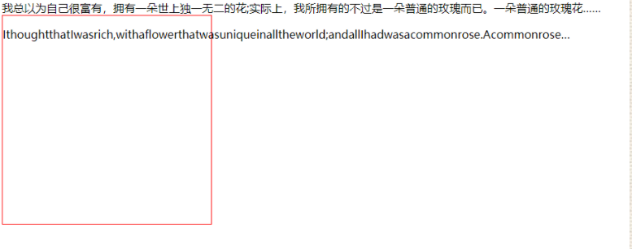

```html
我总以为自己很富有，拥有一朵世上独一无二的花;实际上，我所拥有的不过是一朵普通的玫瑰而已。一朵普通的玫瑰花……
<div>
    <p>IthoughtthatIwasrich,withaflowerthatwasuniqueinalltheworld;andallIhadwasacommonrose.Acommonrose…</p>
</div>
```

```css
div{
    width: 300px;
    height: 300px;
    border: red solid 1px;
    word-wrap: break-word;/*自动换行*/
}
```


# 四、CSS3 字体

## @font-face 规则

在 CSS3 之前，web 设计师必须使用已在用户计算机上安装好的字体。

通过 CSS3，web 设计师可以使用他们喜欢的任意字体。

当您您找到或购买到希望使用的字体时，可将该字体文件存放到 web 服务器上，它会在需要时被自动下载到用户的计算机上。

您“自己的”的字体是在 CSS3 @font-face 规则中定义的。

```css
@font-face{
    font-family: myFirstFont;/*自定义字体名称*/
    src: url('Sansation_Light.ttf'),/*自定义字体的URL*/
         url('Sansation_Light.eot'); /* IE9+ */
}
div{
    font-family:myFirstFont;
}
```

## CSS3 字体描述符

下面的表格列出了能够在 @font-face 规则中定义的所有字体描述符：

| 描述符        | 值                                                           | 描述                                                         |
| ------------- | ------------------------------------------------------------ | ------------------------------------------------------------ |
| font-family   | name                                                         | 必需。规定字体的名称。                                       |
| src           | URL                                                          | 必需。定义字体文件的 URL。                                   |
| font-stretch  | normalcondensedultra-condensedextra-condensedsemi-condensedexpandedsemi-expandedextra-expandedultra-expanded | 可选。定义如何拉伸字体。默认是 "normal"。                    |
| font-style    | ormalitalicoblique                                           | 可选。定义字体的样式。默认是 "normal"。                      |
| font-weight   | normalbold100200300400500600700800900                        | 可选。定义字体的粗细。默认是 "normal"。                      |
| unicode-range | unicode-range                                                | 可选。定义字体支持的 UNICODE 字符范围。默认是 "U+0-10FFFF"。 |

# 五、CSS3 2D 转换

通过 CSS3 转换，我们能够对元素进行移动、缩放、转动、拉长或拉伸。

## translate() 方法

通过 translate() 方法，元素从其当前位置移动，根据给定的 left（x 坐标） 和 top（y 坐标） 位置参数：

translate(100px,20px);

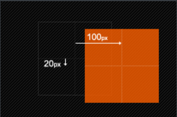

```css
div{
    width: 200px;
    height: 200px;
    background-color: salmon;
    transform: translate(50px,40px);/*水平移动50px 垂直移动40px*/
}
```

值 translate(50px,100px) 把元素从左侧移动 50 像素，从顶端移动 100 像素。

## rotate() 方法

通过 rotate() 方法，元素顺时针旋转给定的角度。允许负值，元素将逆时针旋转。

```css
div{
    width: 100px;
    height: 100px;
    background-color: salmon;
    transform: translate(50px,40px) rotate(30deg);
}
```

值 rotate(30deg) 把元素顺时针旋转 30 度。

## scale() 方法

```css
transform: translate(50px,40px) scale(2,4);
```

通过 scale() 方法，元素的尺寸会增加或减少，根据给定的宽度（X 轴）和高度（Y 轴）参数：

值 scale(2,4) 把宽度转换为原始尺寸的 2 倍，把高度转换为原始高度的 4 倍。（类似width\*2 ，height\*4）

缩小则是输入小于1的数，1是保持不变，例如缩小为原来宽高的一半则:scale(0.5,0.5)

注意：尺寸以中心点向外扩大缩小

## skew() 方法

通过 skew() 方法，元素翻转给定的角度，根据给定的水平线（X 轴）和垂直线（Y 轴）

```css
 transform: translate(300px,300px) skew(20deg,20deg);          
```

值 skew(30deg,20deg) 围绕 X 轴把元素翻转 30 度，围绕 Y 轴翻转 20 度。

用法：transform: skew(30deg) 或者 transform: skew(30deg, 30deg);

参数表示倾斜角度，单位deg

一个参数时：表示水平方向的倾斜角度；

两个参数时：第一个参数表示水平方向的倾斜角度，第二个参数表示垂直方向的倾斜角度。

关于skew倾斜角度的计算方式表面上看并不是那么直观，这里借鉴某大拿绘制的图举例说明一下：

首先需要说明的是skew的默认原点transform-origin是这个元素的中心点

skewX(30deg) 如下图：

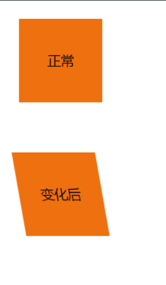

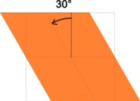

skewY(10deg) 如下图：

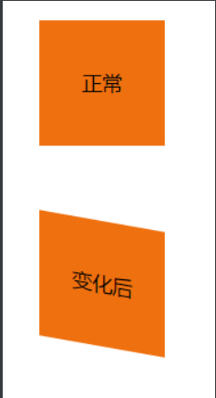

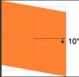

skew(30deg, 10deg) 如下图：

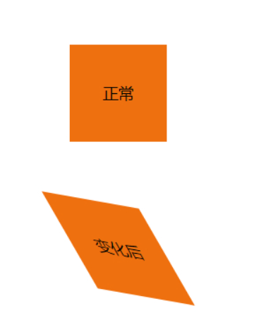

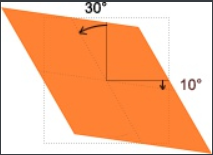

我当初就是看到此图瞬间理解的。

## matrix() 方法

matrix() 方法把所有 2D 转换方法组合在一起。

matrix() 方法需要六个参数，包含数学函数，允许您：旋转、缩放、移动以及倾斜元素。

## 基准点 transform-origin

前面多次提到transform-origin这个东东，他的主要作用就是让我们在进行transform动作之前可以改变元素的基点位置，因为我们元素默认基点就是其中心位置，换句话说我们没有使用transform-origin改变元素基点位置的情况下，transform进行的rotate,translate,scale,skew,matrix等操作都是以元素自己中心位置进行变化的。但有时候我们需要在不同的位置对元素进行这些操作，那么我们就可以使用transform-origin来对元素进行基点位置改变，使元素基点不在是中心位置，以达到你需要的基点位置。下面我们主要来看看其使用规则：

## transform-origin(X,Y):

用来设置元素的运动的基点（参照点）。默认点是元素的中心点。其中X和Y的值可以是百分值,em,px，其中X也可以是字符参数值left,center,right；Y和X一样除了百分值外还可以设置字符值top,center,bottom，这个看上去有点像我们background-position设置一样；

下面我列出他们相对应的写法：

> 1、top left | left top 等价于 0 0 | 0% 0%
>
> 2、top | top center | center top 等价于 50% 0
>
> 3、right top | top right 等价于 100% 0
>
> 4、left | left center | center left 等价于 0 50% | 0% 50%
>
> 5、center | center center 等价于 50% 50%（默认值）
>
> 6、right | right center | center right 等价于 100% 50%
>
> 7、bottom left | left bottom 等价于 0 100% | 0% 100%
>
> 8、bottom | bottom center | center bottom 等价于 50% 100%
>
> 9、bottom right | right bottom 等价于 100% 100%

其中 left,center right是水平方向取值，对应的百分值为left=0%;center=50%;right=100%而top center bottom是垂直方向的取值，其中top=0%;center=50%;bottom=100%;如果只取一个值，表示垂直方向值不变，我们分别来看看以下几个实例

### (1)transform-origin:(left,top):

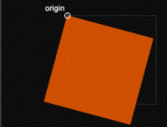

### (2)transform-origin:right

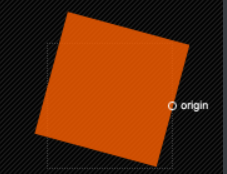

### (3)transform-origin(25%,75%)

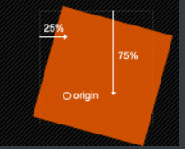

这里还要提醒大家一点的是，transform-origin并不是transform中的属性值，他具有自己的语法，前面我也说过了，说简单一点就是类似于我们的background-position的用法，但又有其不一样，因为我们background-position不需要区别浏览器内核不同的写法，但transform-origin跟其他的css3属性一样，我们需要在不同的浏览内核中加上相应的前缀

## 2D Transform 方法表

| 函数                  | 描述                                     |
| --------------------- | ---------------------------------------- |
| matrix(n,n,n,n,n,n)   | 定义 2D 转换，使用六个值的矩阵。         |
| translate(x,y)        | 定义 2D 转换，沿着 X 和 Y 轴移动元素。   |
| translateX(n)         | 定义 2D 转换，沿着 X 轴移动元素。        |
| translateY(n)         | 定义 2D 转换，沿着 Y 轴移动元素。        |
| scale(x,y)            | 定义 2D 缩放转换，改变元素的宽度和高度。 |
| scaleX(n)             | 定义 2D 缩放转换，改变元素的宽度。       |
| scaleY(n)             | 定义 2D 缩放转换，改变元素的高度。       |
| rotate(angle)         | 定义 2D 旋转，在参数中规定角度。         |
| skew(x-angle,y-angle) | 定义 2D 倾斜转换，沿着 X 和 Y 轴。       |
| skewX(angle)          | 定义 2D 倾斜转换，沿着 X 轴。            |
| skewY(angle)          | 定义 2D 倾斜转换，沿着 Y 轴。            |

# 六、CSS3 3D 转换

## rotateX() 方法

通过 rotateX() 方法，元素围绕其 X 轴以给定的度数进行旋转=】

```css
div{
    transform: rotateX(120deg);
    -webkit-transform: rotateX(120deg);	/* Safari 和 Chrome */
    -moz-transform: rotateX(120deg);	/* Firefox */
}
```

## rotateY() 旋转

通过 rotateY() 方法，元素围绕其 Y 轴以给定的度数进行旋转。

```css
div{
    transform: rotateY(130deg);
    -webkit-transform: rotateY(130deg);	/* Safari 和 Chrome */
    -moz-transform: rotateY(130deg);	/* Firefox */
}
```

## 转换属性

下面的表格列出了所有的转换属性：

| 属性                                                         | 描述                                 | CSS  |
| ------------------------------------------------------------ | ------------------------------------ | ---- |
| [transform](https://www.w3school.com.cn/cssref/pr_transform.asp) | 向元素应用 2D 或 3D 转换。           | 3    |
| [transform-origin](https://www.w3school.com.cn/cssref/pr_transform-origin.asp) | 允许你改变被转换元素的位置。         | 3    |
| [transform-style](https://www.w3school.com.cn/cssref/pr_transform-style.asp) | 规定被嵌套元素如何在 3D 空间中显示。 | 3    |
| [perspective](https://www.w3school.com.cn/cssref/pr_perspective.asp) | 规定 3D 元素的透视效果。             | 3    |
| [perspective-origin](https://www.w3school.com.cn/cssref/pr_perspective-origin.asp) | 规定 3D 元素的底部位置。             | 3    |
| [backface-visibility](https://www.w3school.com.cn/cssref/pr_backface-visibility.asp) | 定义元素在不面对屏幕时是否可见。     | 3    |

## 2D Transform 方法

| 函数                                      | 描述                                      |
| ----------------------------------------- | ----------------------------------------- |
| matrix3d(n,n,n,n,n,n,n,n,n,n,n,n,n,n,n,n) | 定义 3D 转换，使用 16 个值的 4x4 矩阵。   |
| translate3d(x,y,z)                        | 定义 3D 转化。                            |
| translateX(x)                             | 定义 3D 转化，仅使用用于 X 轴的值。       |
| translateY(y)                             | 定义 3D 转化，仅使用用于 Y 轴的值。       |
| translateZ(z)                             | 定义 3D 转化，仅使用用于 Z 轴的值。       |
| scale3d(x,y,z)                            | 定义 3D 缩放转换。                        |
| scaleX(x)                                 | 定义 3D 缩放转换，通过给定一个 X 轴的值。 |
| scaleY(y)                                 | 定义 3D 缩放转换，通过给定一个 Y 轴的值。 |
| scaleZ(z)                                 | 定义 3D 缩放转换，通过给定一个 Z 轴的值。 |
| rotate3d(x,y,z,angle)                     | 定义 3D 旋转。                            |
| rotateX(angle)                            | 定义沿 X 轴的 3D 旋转。                   |
| rotateY(angle)                            | 定义沿 Y 轴的 3D 旋转。                   |
| rotateZ(angle)                            | 定义沿 Z 轴的 3D 旋转。                   |
| perspective(n)                            | 定义 3D 转换元素的透视视图。              |

# 七、CSS3 过渡

通过 CSS3，我们可以在不使用 Flash 动画或 JavaScript 的情况下，当元素从一种样式变换为另一种样式时为元素添加效果。

CSS3 过渡是元素从一种样式逐渐改变为另一种的效果。

要实现这一点，必须规定两项内容：

- 规定您希望把效果添加到哪个 CSS 属性上
- 规定效果的时长

## 过渡属性

下面的表格列出了所有的转换属性：

| 属性                                                         | 描述                                         | CSS  |
| ------------------------------------------------------------ | -------------------------------------------- | ---- |
| [transition](https://www.w3school.com.cn/cssref/pr_transition.asp) | 简写属性，用于在一个属性中设置四个过渡属性。 | 3    |
| [transition-property](https://www.w3school.com.cn/cssref/pr_transition-property.asp) | 规定应用过渡的 CSS 属性的名称。              | 3    |
| [transition-duration](https://www.w3school.com.cn/cssref/pr_transition-duration.asp) | 定义过渡效果花费的时间。默认是 0。           | 3    |
| [transition-timing-function](https://www.w3school.com.cn/cssref/pr_transition-timing-function.asp) | 规定过渡效果的时间曲线。默认是 "ease"。      | 3    |
| [transition-delay](https://www.w3school.com.cn/cssref/pr_transition-delay.asp) | 规定过渡效果何时开始。默认是 0。             |      |

```css
常用写法：transition：transform（名称） 1.2s（过渡时间） linear（过渡方式） 2s（过渡开始时间）
```

==注意：只有名称之间用逗号==

## 属性详解

### transition-property

不是所有属性都能过渡，只有属性具有一个中间点值才具备过渡效果。见http://leaverou.github.io/animatable/

### transition-duration

指定从一个属性到另一个属性过渡所要花费的时间。默认值为0，为0时，表示变化是瞬时的，看不到过渡效果。

### transiton-timing-function

过渡函数，有如下几种：

   Ease：首尾变缓。

   Linear：线性变化。

   Ease-in：开始慢，后面快。

   Ease-out：开始块，后面慢。

   Ease-in-out：首尾慢，中间快。

   cubic-bezier：三次贝塞尔曲线，自定义（不太懂）

### 触发过渡（重要）

单纯的代码不会触发任何过渡操作，需要通过用户的行为（如点击，悬浮等）触发，可触发的方式有： 

```css
:hover :focus :checked 媒体查询触发 JavaScript触发
```

## 局限性

transition的优点在于简单易用，但是它有几个很大的局限。 

（1）transition需要事件触发，所以没法在网页加载时自动发生。 

（2）transition是一次性的，不能重复发生，除非一再触发。 

（3）transition只能定义开始状态和结束状态，不能定义中间状态，也就是说只有两个状态。 

（4）一条transition规则，只能定义一个属性的变化，不能涉及多个属性。 

```css
div{
    width: 100px;
    height: 100px;
    background-color: salmon;
    transition: transform 3s,width 1s ,height 2s,e 2s;
}
div:hover{
    transform:  rotate(360deg) ;
    width: 120px;
    height: 130px;
}
```

# 八、CSS3动画

通过 CSS3，我们能够创建动画，这可以在许多网页中取代动画图片、Flash 动画以及 JavaScript。动画是使元素从一种样式逐渐变化为另一种样式的效果。您可以改变任意多的样式任意多的次数。

## 动画

### a、animation

animation 属性是一个简写属性，用于设置动画属性：

- > - animation-name
  > - animation-duration
  > - animation-timing-function
  > - animation-delay
  > - animation-iteration-count
  > - animation-direction
  > - animation-fill-mood

### b、animation-name

animation-name 属性为 @keyframes 动画规定名称。

注释：请始终规定 animation-duration 属性，否则时长为 0，就不会播放动画了。

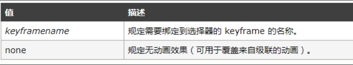

### c、animation-duration

animation-duration属性定义动画完成一个周期所需要的时间，以秒或毫秒计。

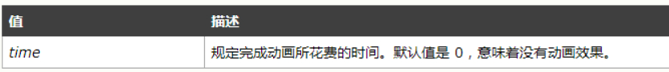

### d、animation-timing-function

animation-timing-function 规定动画的速度曲线。速度曲线定义动画从一套 CSS 样式变为另一套所用的时间。速度曲线用于使变化更为平滑。

 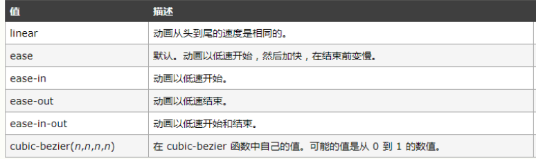

### e、animation-iteration-count

animation-iteration-count 属性定义动画的播放次数。

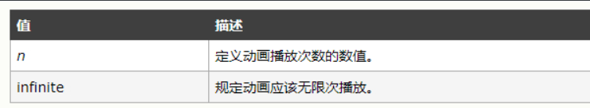

### f、animation-direction

 animation-direction 属性定义是否应该轮流反向播放动画。

normal每个循环内动画向前循环，换言之，每个动画循环结束，动画重置到起点重新开始，这是默认属性。alternate动画交替反向运行，反向运行时，动画按步后退，同时，带时间功能的函数也反向，比如，ease-in 在反向时成为ease-out。reverse反向运行动画，每周期结束动画由尾到头运行。alternate-reverse反向交替， 反向开始交替动画,第一次运行时是反向的，然后下一次是正向，后面依次循环.

  如果 animation-direction 值是 "alternate"，则动画会在奇数次数（1、3、5 等等）正常播放，而在偶数次数（2、4、6 等等）向后播放。 

```html
 <!DOCTYPE html>
 <html lang="en">
 <head>
     <meta charset="UTF-8">
     <title>Document</title>
     <style>
         div{
             width: 100px;
             height:100px;
             background: red;
         }
         div:hover{
             animation: donghua 3s linear 1ms 1 normal;
         }
         @keyframes donghua{
             from{
                 background: yellow;
             }
             50%{
                 background: brown;
             }
             to{
                 width: 300px;
                 background: blue;
             }
         }
     </style>
 </head>
 <body>
     <div>
         
     </div>
 </body>
 </html>
```


### g.animation-fill-mood

这个 CSS 属性用来指定在动画执行之前和之后如何给动画的目标应用样式。

none动画执行前后不改变任何样式,forwards目标保持动画最后一帧的样式,backwards动画采用相应第一帧的样式,both动画将会执行 forwards 和 backwards 执行的动作。

当动画的次数设置成一次时；动画最后即使鼠标还悬停在元素上面，元素也会恢复默认状态。这个是和过渡的区别之一，同时动画可以提供同一个属性的多个变化值，二过渡只有两设置两个值。

请用百分比来规定变化发生的时间，或用关键词 "from" 和 "to"，等同于 0% 和 100%。0% 是动画的开始，100% 是动画的完成。为了得到最佳的浏览器支持，您应该始终定义 0% 和 100% 选择器。

 使用动画：

> 1、在对应的元素上设置动画的相关属性（animation属性）
>
> 2、为动画设置多个关键帧。（@keyframes 动画名字）

可以为一个元素应用一个动画，元素选择器用逗号隔开即可。也可以为一个元素应用多个动画，元素同时执行多个关键帧。

### h、animation-play-state

animation-play-state 属性规定动画正在运行还是暂停。注释：您可以在 JavaScript 中使用该属性，这样就能在播放过程中暂停动画。

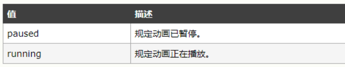

## 变换

通过 CSS3 变换，我们能够对元素进行移动、缩放、转动、拉长或拉伸。使用transform属性为元素应用变换。

translate(长度值或者百分比) 在水平方向上、垂直方向上平移元素。transform属性可以指定为关键字值none 或一个或多个值。

常用的：

### a.translate()、translateX()、translateY()

translate用来在平面上平移一个元素。可以使用translate(tx) 或translate(tx, ty)，第一个参数指定x轴的平移距离，第二个参数指定y轴的平移距离。如果只指定了一个参数，那么X和Y轴都采用整个值。

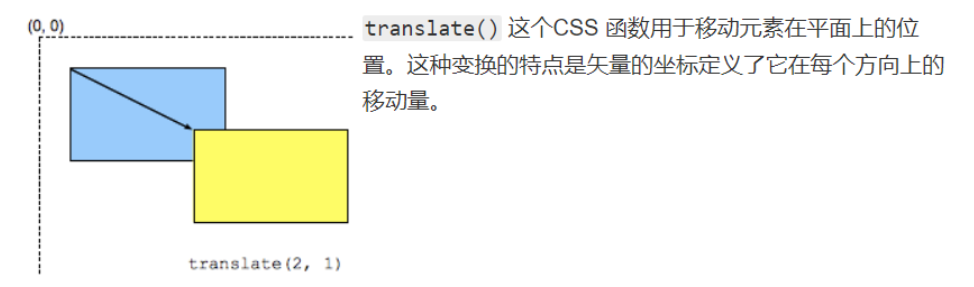

   

translateX和translateY时translate属性的分开表达。translateX(tx) 是 translate(tx, 0) 的简写形式，translateY(ty) 是 translate(0, ty)的简写形式。

###  b.translate3d()和translateZ()

translate3d() 这个CSS 函数用于移动元素在3D空间中的位置。语法translate3d(tx, ty, tz)。Z轴垂直X、Y轴向外。translateZ(tz)相当于translate3d(0,0,tz);

### c.rotate(a deg)

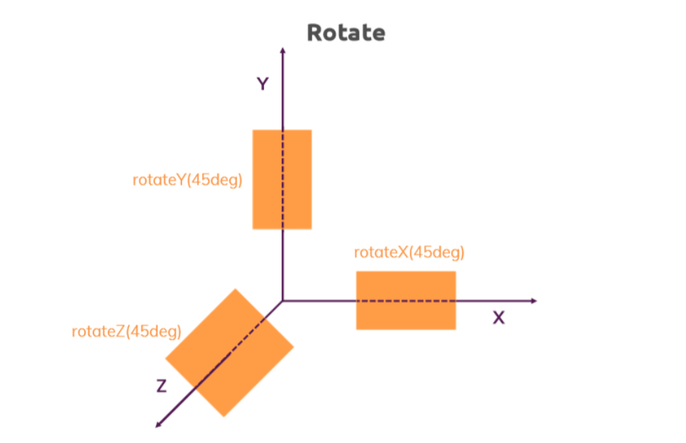

rotate(a) CSS 函数 定义一个旋转属性，将元素在不变形的情况下旋转到不动点周围(如 transform-origin 属性所指定) 。 移动量a由指定角度定义;如果为正值，则运动将为顺时针，如果为负值，则为逆时针 。默认是绕Z轴的旋转。

rotateX(a)、rotateY(a)、rotateZ(a)分别是设置绕X、Y、Z轴的旋转。

可以和rotate()函数结合使用的是transform-origin: center;指定旋转变换的点，默认在元素的中心，可以使用两个百分数或者两个数字来指定。

###  d.scale()

scale() CSS 函数可改变元素的大小。 它可以增大或减小元素的大小。

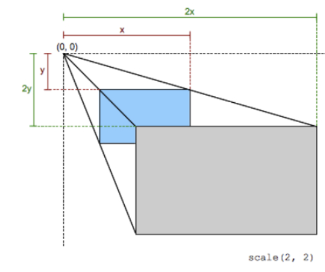

scale()函数是scaleX()和scaleY()简写。当scale()函数只指定一个参数的时候，X、Y方向上共享整个参数。

### e.skew()

skew() 这个CSS函数是一种用于拉伸，或者说是平移，该函数会使得在每个方向上扭曲元素上的每个点以一定角度.skew(ax) 或skew(ax, ay).

skew()是skewX()和skewY()的简写。skewX()想做拉伸一个元素，skewY()向上拉伸一个元素。

# 附一、指针样式

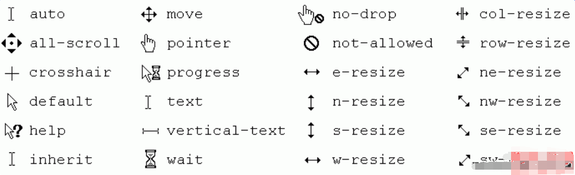

# 附二、CSS3属性表

## CSS3 动画属性（Animation）

| 属性                                                         | 描述                                                     | CSS  |
| ------------------------------------------------------------ | -------------------------------------------------------- | ---- |
| [@keyframes](https://www.w3school.com.cn/cssref/pr_keyframes.asp) | 规定动画。                                               | 3    |
| [animation](https://www.w3school.com.cn/cssref/pr_animation.asp) | 所有动画属性的简写属性，除了 animation-play-state 属性。 | 3    |
| [animation-name](https://www.w3school.com.cn/cssref/pr_animation-name.asp) | 规定 @keyframes 动画的名称。                             | 3    |
| [animation-duration](https://www.w3school.com.cn/cssref/pr_animation-duration.asp) | 规定动画完成一个周期所花费的秒或毫秒。                   | 3    |
| [animation-timing-function](https://www.w3school.com.cn/cssref/pr_animation-timing-function.asp) | 规定动画的速度曲线。                                     | 3    |
| [animation-delay](https://www.w3school.com.cn/cssref/pr_animation-delay.asp) | 规定动画何时开始。                                       | 3    |
| [animation-iteration-count](https://www.w3school.com.cn/cssref/pr_animation-iteration-count.asp) | 规定动画被播放的次数。                                   | 3    |
| [animation-direction](https://www.w3school.com.cn/cssref/pr_animation-direction.asp) | 规定动画是否在下一周期逆向地播放。                       | 3    |
| [animation-play-state](https://www.w3school.com.cn/cssref/pr_animation-play-state.asp) | 规定动画是否正在运行或暂停。                             | 3    |
| [animation-fill-mode](https://www.w3school.com.cn/cssref/pr_animation-fill-mode.asp) | 规定对象动画时间之外的状态。                             | 3    |

## CSS 背景属性（Background）

| 属性                                                         | 描述                                             | CSS  |
| ------------------------------------------------------------ | ------------------------------------------------ | ---- |
| [background](https://www.w3school.com.cn/cssref/pr_background.asp) | 在一个声明中设置所有的背景属性。                 | 1    |
| [background-attachment](https://www.w3school.com.cn/cssref/pr_background-attachment.asp) | 设置背景图像是否固定或者随着页面的其余部分滚动。 | 1    |
| [background-color](https://www.w3school.com.cn/cssref/pr_background-color.asp) | 设置元素的背景颜色。                             | 1    |
| [background-image](https://www.w3school.com.cn/cssref/pr_background-image.asp) | 设置元素的背景图像。                             | 1    |
| [background-position](https://www.w3school.com.cn/cssref/pr_background-position.asp) | 设置背景图像的开始位置。                         | 1    |
| [background-repeat](https://www.w3school.com.cn/cssref/pr_background-repeat.asp) | 设置是否及如何重复背景图像。                     | 1    |
| [background-clip](https://www.w3school.com.cn/cssref/pr_background-clip.asp) | 规定背景的绘制区域。                             | 3    |
| [background-origin](https://www.w3school.com.cn/cssref/pr_background-origin.asp) | 规定背景图片的定位区域。                         | 3    |
| [background-size](https://www.w3school.com.cn/cssref/pr_background-size.asp) | 规定背景图片的尺寸。                             | 3    |

## CSS 边框属性（Border 和 Outline）

| 属性                                                         | 描述                                                         | CSS  |
| ------------------------------------------------------------ | ------------------------------------------------------------ | ---- |
| [border](https://www.w3school.com.cn/cssref/pr_border.asp)   | 在一个声明中设置所有的边框属性。                             | 1    |
| [border-bottom](https://www.w3school.com.cn/cssref/pr_border-bottom.asp) | 在一个声明中设置所有的下边框属性。                           | 1    |
| [border-bottom-color](https://www.w3school.com.cn/cssref/pr_border-bottom_color.asp) | 设置下边框的颜色。                                           | 2    |
| [border-bottom-style](https://www.w3school.com.cn/cssref/pr_border-bottom_style.asp) | 设置下边框的样式。                                           | 2    |
| [border-bottom-width](https://www.w3school.com.cn/cssref/pr_border-bottom_width.asp) | 设置下边框的宽度。                                           | 1    |
| [border-color](https://www.w3school.com.cn/cssref/pr_border-color.asp) | 设置四条边框的颜色。                                         | 1    |
| [border-left](https://www.w3school.com.cn/cssref/pr_border-left.asp) | 在一个声明中设置所有的左边框属性。                           | 1    |
| [border-left-color](https://www.w3school.com.cn/cssref/pr_border-left_color.asp) | 设置左边框的颜色。                                           | 2    |
| [border-left-style](https://www.w3school.com.cn/cssref/pr_border-left_style.asp) | 设置左边框的样式。                                           | 2    |
| [border-left-width](https://www.w3school.com.cn/cssref/pr_border-left_width.asp) | 设置左边框的宽度。                                           | 1    |
| [border-right](https://www.w3school.com.cn/cssref/pr_border-right.asp) | 在一个声明中设置所有的右边框属性。                           | 1    |
| [border-right-color](https://www.w3school.com.cn/cssref/pr_border-right_color.asp) | 设置右边框的颜色。                                           | 2    |
| [border-right-style](https://www.w3school.com.cn/cssref/pr_border-right_style.asp) | 设置右边框的样式。                                           | 2    |
| [border-right-width](https://www.w3school.com.cn/cssref/pr_border-right_width.asp) | 设置右边框的宽度。                                           | 1    |
| [border-style](https://www.w3school.com.cn/cssref/pr_border-style.asp) | 设置四条边框的样式。                                         | 1    |
| [border-top](https://www.w3school.com.cn/cssref/pr_border-top.asp) | 在一个声明中设置所有的上边框属性。                           | 1    |
| [border-top-color](https://www.w3school.com.cn/cssref/pr_border-top_color.asp) | 设置上边框的颜色。                                           | 2    |
| [border-top-style](https://www.w3school.com.cn/cssref/pr_border-top_style.asp) | 设置上边框的样式。                                           | 2    |
| [border-top-width](https://www.w3school.com.cn/cssref/pr_border-top_width.asp) | 设置上边框的宽度。                                           | 1    |
| [border-width](https://www.w3school.com.cn/cssref/pr_border-width.asp) | 设置四条边框的宽度。                                         | 1    |
| [outline](https://www.w3school.com.cn/cssref/pr_outline.asp) | 在一个声明中设置所有的轮廓属性。                             | 2    |
| [outline-color](https://www.w3school.com.cn/cssref/pr_outline-color.asp) | 设置轮廓的颜色。                                             | 2    |
| [outline-style](https://www.w3school.com.cn/cssref/pr_outline-style.asp) | 设置轮廓的样式。                                             | 2    |
| [outline-width](https://www.w3school.com.cn/cssref/pr_outline-width.asp) | 设置轮廓的宽度。                                             | 2    |
| [border-bottom-left-radius](https://www.w3school.com.cn/cssref/pr_border-bottom-left-radius.asp) | 定义边框左下角的形状。                                       | 3    |
| [border-bottom-right-radius](https://www.w3school.com.cn/cssref/pr_border-bottom-right-radius.asp) | 定义边框右下角的形状。                                       | 3    |
| [border-image](https://www.w3school.com.cn/cssref/pr_border-image.asp) | 简写属性，设置所有 border-image-\* 属性。                    | 3    |
| [border-image-outset](https://www.w3school.com.cn/cssref/pr_border-image-outset.asp) | 规定边框图像区域超出边框的量。                               | 3    |
| [border-image-repeat](https://www.w3school.com.cn/cssref/pr_border-image-repeat.asp) | 图像边框是否应平铺(repeated)、铺满(rounded)或拉伸(stretched)。 | 3    |
| [border-image-slice](https://www.w3school.com.cn/cssref/pr_border-image-slice.asp) | 规定图像边框的向内偏移。                                     | 3    |
| [border-image-source](https://www.w3school.com.cn/cssref/pr_border-image-source.asp) | 规定用作边框的图片。                                         | 3    |
| [border-image-width](https://www.w3school.com.cn/cssref/pr_border-image-width.asp) | 规定图片边框的宽度。                                         | 3    |
| [border-radius](https://www.w3school.com.cn/cssref/pr_border-radius.asp) | 简写属性，设置所有四个 border-\*-radius 属性。               | 3    |
| [border-top-left-radius](https://www.w3school.com.cn/cssref/pr_border-top-left-radius.asp) | 定义边框左上角的形状。                                       | 3    |
| [border-top-right-radius](https://www.w3school.com.cn/cssref/pr_border-top-right-radius.asp) | 定义边框右下角的形状。                                       | 3    |
| box-decoration-break                                         |                                                              | 3    |
| [box-shadow](https://www.w3school.com.cn/cssref/pr_box-shadow.asp) | 向方框添加一个或多个阴影。                                   | 3    |

## Box 属性

| 属性                                                         | 描述                                                        | CSS  |
| ------------------------------------------------------------ | ----------------------------------------------------------- | ---- |
| [overflow-x](https://www.w3school.com.cn/cssref/pr_overflow-x.asp) | 如果内容溢出了元素内容区域，是否对内容的左/右边缘进行裁剪。 | 3    |
| [overflow-y](https://www.w3school.com.cn/cssref/pr_overflow-y.asp) | 如果内容溢出了元素内容区域，是否对内容的上/下边缘进行裁剪。 | 3    |
| [overflow-style](https://www.w3school.com.cn/cssref/pr_overflow-style.asp) | 规定溢出元素的首选滚动方法。                                | 3    |
| [rotation](https://www.w3school.com.cn/cssref/pr_rotation.asp) | 围绕由 rotation-point 属性定义的点对元素进行旋转。          | 3    |
| [rotation-point](https://www.w3school.com.cn/cssref/pr_rotation-point.asp) | 定义距离上左边框边缘的偏移点。                              | 3    |

## Color 属性

| 属性                                                         | 描述                                           | CSS  |
| ------------------------------------------------------------ | ---------------------------------------------- | ---- |
| color-profile                                                | 允许使用源的颜色配置文件的默认以外的规范。     | 3    |
| [opacity](https://www.w3school.com.cn/cssref/pr_opacity.asp) | 规定元素的不透明级别。                         | 3    |
| rendering-intent                                             | 允许使用颜色配置文件渲染意图的默认以外的规范。 | 3    |

## Content for Paged Media 属性

| 属性                | 描述                                                   | CSS  |
| ------------------- | ------------------------------------------------------ | ---- |
| bookmark-label      | 规定书签的标记。                                       | 3    |
| bookmark-level      | 规定书签的级别。                                       | 3    |
| bookmark-target     | 规定书签链接的目标。                                   | 3    |
| float-offset        | 将元素放在 float 属性通常放置的位置的相反方向。        | 3    |
| hyphenate-after     | 规定连字单词中连字符之后的最小字符数。                 | 3    |
| hyphenate-before    | 规定连字单词中连字符之前的最小字符数。                 | 3    |
| hyphenate-character | 规定当发生断字时显示的字符串。                         | 3    |
| hyphenate-lines     | 指示元素中连续断字连线的最大数。                       | 3    |
| hyphenate-resource  | 规定帮助浏览器确定断字点的外部资源（逗号分隔的列表）。 | 3    |
| hyphens             | 设置如何对单词进行拆分，以改善段落的布局。             | 3    |
| image-resolution    | 规定图像的正确分辨率。                                 | 3    |
| marks               | 向文档添加裁切标记或十字标记。                         | 3    |
| string-set          |                                                        | 3    |

## CSS 尺寸属性（Dimension）

| 属性                                                         | 描述                 | CSS  |
| ------------------------------------------------------------ | -------------------- | ---- |
| [height](https://www.w3school.com.cn/cssref/pr_dim_height.asp) | 设置元素高度。       | 1    |
| [max-height](https://www.w3school.com.cn/cssref/pr_dim_max-height.asp) | 设置元素的最大高度。 | 2    |
| [max-width](https://www.w3school.com.cn/cssref/pr_dim_max-width.asp) | 设置元素的最大宽度。 | 2    |
| [min-height](https://www.w3school.com.cn/cssref/pr_dim_min-height.asp) | 设置元素的最小高度。 | 2    |
| [min-width](https://www.w3school.com.cn/cssref/pr_dim_min-width.asp) | 设置元素的最小宽度。 | 2    |
| [width](https://www.w3school.com.cn/cssref/pr_dim_width.asp) | 设置元素的宽度。     | 1    |

## 可伸缩框属性（Flexible Box）

| 属性                                                         | 描述                                           | CSS  |
| ------------------------------------------------------------ | ---------------------------------------------- | ---- |
| [box-align](https://www.w3school.com.cn/cssref/pr_box-align.asp) | 规定如何对齐框的子元素。                       | 3    |
| [box-direction](https://www.w3school.com.cn/cssref/pr_box-direction.asp) | 规定框的子元素的显示方向。                     | 3    |
| [box-flex](https://www.w3school.com.cn/cssref/pr_box-flex.asp) | 规定框的子元素是否可伸缩。                     | 3    |
| [box-flex-group](https://www.w3school.com.cn/cssref/pr_box-flex-group.asp) | 将可伸缩元素分配到柔性分组。                   | 3    |
| [box-lines](https://www.w3school.com.cn/cssref/pr_box-lines.asp) | 规定当超出父元素框的空间时，是否换行显示。     | 3    |
| [box-ordinal-group](https://www.w3school.com.cn/cssref/pr_box-ordinal-group.asp) | 规定框的子元素的显示次序。                     | 3    |
| [box-orient](https://www.w3school.com.cn/cssref/pr_box-orient.asp) | 规定框的子元素是否应水平或垂直排列。           | 3    |
| [box-pack](https://www.w3school.com.cn/cssref/pr_box-pack.asp) | 规定水平框中的水平位置或者垂直框中的垂直位置。 | 3    |

## CSS 字体属性（Font）

| 属性                                                         | 描述                                   | CSS  |
| ------------------------------------------------------------ | -------------------------------------- | ---- |
| [font](https://www.w3school.com.cn/cssref/pr_font_font.asp)  | 在一个声明中设置所有字体属性。         | 1    |
| [font-family](https://www.w3school.com.cn/cssref/pr_font_font-family.asp) | 规定文本的字体系列。                   | 1    |
| [font-size](https://www.w3school.com.cn/cssref/pr_font_font-size.asp) | 规定文本的字体尺寸。                   | 1    |
| [font-size-adjust](https://www.w3school.com.cn/cssref/pr_font_font-size-adjust.asp) | 为元素规定 aspect 值。                 | 2    |
| [font-stretch](https://www.w3school.com.cn/cssref/pr_font_font-stretch.asp) | 收缩或拉伸当前的字体系列。             | 2    |
| [font-style](https://www.w3school.com.cn/cssref/pr_font_font-style.asp) | 规定文本的字体样式。                   | 1    |
| [font-variant](https://www.w3school.com.cn/cssref/pr_font_font-variant.asp) | 规定是否以小型大写字母的字体显示文本。 | 1    |
| [font-weight](https://www.w3school.com.cn/cssref/pr_font_weight.asp) | 规定字体的粗细。                       | 1    |

## 内容生成（Generated Content）

| 属性                                                         | 描述                                                     | CSS  |
| ------------------------------------------------------------ | -------------------------------------------------------- | ---- |
| [content](https://www.w3school.com.cn/cssref/pr_gen_content.asp) | 与 :before 以及 :after 伪元素配合使用，来插入生成内容。  | 2    |
| [counter-increment](https://www.w3school.com.cn/cssref/pr_gen_counter-increment.asp) | 递增或递减一个或多个计数器。                             | 2    |
| [counter-reset](https://www.w3school.com.cn/cssref/pr_gen_counter-reset.asp) | 创建或重置一个或多个计数器。                             | 2    |
| [quotes](https://www.w3school.com.cn/cssref/pr_gen_quotes.asp) | 设置嵌套引用的引号类型。                                 | 2    |
| crop                                                         | 允许被替换元素仅仅是对象的矩形区域，而不是整个对象。     | 3    |
| move-to                                                      | 从流中删除元素，然后在文档中后面的点上重新插入。         | 3    |
| page-policy                                                  | 确定元素基于页面的 occurrence 应用于计数器还是字符串值。 | 3    |

## Grid 属性

| 属性                                                         | 描述                     | CSS  |
| ------------------------------------------------------------ | ------------------------ | ---- |
| [grid-columns](https://www.w3school.com.cn/cssref/pr_grid-columns.asp) | 规定网格中每个列的宽度。 | 3    |
| [grid-rows](https://www.w3school.com.cn/cssref/pr_grid-rows.asp) | 规定网格中每个列的高度。 | 3    |

## Hyperlink 属性

| 属性                                                         | 描述                                                         | CSS  |
| ------------------------------------------------------------ | ------------------------------------------------------------ | ---- |
| [target](https://www.w3school.com.cn/cssref/pr_target.asp)   | 简写属性，设置target-name、target-new以及target-position属性。 | 3    |
| [target-name](https://www.w3school.com.cn/cssref/pr_target-name.asp) | 规定在何处打开链接（链接的目标）。                           | 3    |
| [target-new](https://www.w3school.com.cn/cssref/pr_target-new.asp) | 规定目标链接在新窗口还是在已有窗口的新标签页中打开。         | 3    |
| [target-position](https://www.w3school.com.cn/cssref/pr_target-position.asp) | 规定在何处放置新的目标链接。                                 | 3    |

# 附三、CSS属性表

## CSS 列表属性（List）

| 属性                                                         | 描述                             | CSS  |
| ------------------------------------------------------------ | -------------------------------- | ---- |
| [list-style](https://www.w3school.com.cn/cssref/pr_list-style.asp) | 在一个声明中设置所有的列表属性。 | 1    |
| [list-style-image](https://www.w3school.com.cn/cssref/pr_list-style-image.asp) | 将图象设置为列表项标记。         | 1    |
| [list-style-position](https://www.w3school.com.cn/cssref/pr_list-style-position.asp) | 设置列表项标记的放置位置。       | 1    |
| [list-style-type](https://www.w3school.com.cn/cssref/pr_list-style-type.asp) | 设置列表项标记的类型。           | 1    |
| marker-offset                                                |                                  | 2    |

## CSS 外边距属性（Margin）

| 属性                                                         | 描述                             | CSS  |
| ------------------------------------------------------------ | -------------------------------- | ---- |
| [margin](https://www.w3school.com.cn/cssref/pr_margin.asp)   | 在一个声明中设置所有外边距属性。 | 1    |
| [margin-bottom](https://www.w3school.com.cn/cssref/pr_margin-bottom.asp) | 设置元素的下外边距。             | 1    |
| [margin-left](https://www.w3school.com.cn/cssref/pr_margin-left.asp) | 设置元素的左外边距。             | 1    |
| [margin-right](https://www.w3school.com.cn/cssref/pr_margin-right.asp) | 设置元素的右外边距。             | 1    |
| [margin-top](https://www.w3school.com.cn/cssref/pr_margin-top.asp) | 设置元素的上外边距。             | 1    |

## Marquee 属性

| 属性               | 描述                 | CSS  |
| ------------------ | -------------------- | ---- |
| marquee-direction  | 设置移动内容的方向。 | 3    |
| marquee-play-count | 设置内容移动多少次。 | 3    |
| marquee-speed      | 设置内容滚动得多快。 | 3    |
| marquee-style      | 设置移动内容的样式。 | 3    |

## 多列属性（Multi-column）

| 属性                                                         | 描述                                               | CSS  |
| ------------------------------------------------------------ | -------------------------------------------------- | ---- |
| [column-count](https://www.w3school.com.cn/cssref/pr_column-count.asp) | 规定元素应该被分隔的列数。                         | 3    |
| [column-fill](https://www.w3school.com.cn/cssref/pr_column-fill.asp) | 规定如何填充列。                                   | 3    |
| [column-gap](https://www.w3school.com.cn/cssref/pr_column-gap.asp) | 规定列之间的间隔。                                 | 3    |
| [column-rule](https://www.w3school.com.cn/cssref/pr_column-rule.asp) | 设置所有 column-rule-\* 属性的简写属性。           | 3    |
| [column-rule-color](https://www.w3school.com.cn/cssref/pr_column-rule-color.asp) | 规定列之间规则的颜色。                             | 3    |
| [column-rule-style](https://www.w3school.com.cn/cssref/pr_column-rule-style.asp) | 规定列之间规则的样式。                             | 3    |
| [column-rule-width](https://www.w3school.com.cn/cssref/pr_column-rule-width.asp) | 规定列之间规则的宽度。                             | 3    |
| [column-span](https://www.w3school.com.cn/cssref/pr_column-span.asp) | 规定元素应该横跨的列数。                           | 3    |
| [column-width](https://www.w3school.com.cn/cssref/pr_column-width.asp) | 规定列的宽度。                                     | 3    |
| [columns](https://www.w3school.com.cn/cssref/pr_columns.asp) | 规定设置 column-width 和 column-count 的简写属性。 | 3    |

## CSS 内边距属性（Padding）

| 属性                                                         | 描述                             | CSS  |
| ------------------------------------------------------------ | -------------------------------- | ---- |
| [padding](https://www.w3school.com.cn/cssref/pr_padding.asp) | 在一个声明中设置所有内边距属性。 | 1    |
| [padding-bottom](https://www.w3school.com.cn/cssref/pr_padding-bottom.asp) | 设置元素的下内边距。             | 1    |
| [padding-left](https://www.w3school.com.cn/cssref/pr_padding-left.asp) | 设置元素的左内边距。             | 1    |
| [padding-right](https://www.w3school.com.cn/cssref/pr_padding-right.asp) | 设置元素的右内边距。             | 1    |
| [padding-top](https://www.w3school.com.cn/cssref/pr_padding-top.asp) | 设置元素的上内边距。             | 1    |

## Paged Media 属性

| 属性              | 描述                                                        | CSS  |
| ----------------- | ----------------------------------------------------------- | ---- |
| fit               | 示意如何对width和height属性均不是auto的被替换元素进行缩放。 | 3    |
| fit-position      | 定义盒内对象的对齐方式。                                    | 3    |
| image-orientation | 规定用户代理应用于图像的顺时针方向旋转。                    | 3    |
| page              | 规定元素应该被显示的页面特定类型。                          | 3    |
| size              | 规定页面内容包含框的尺寸和方向。                            | 3    |

## CSS 定位属性（Positioning）

| 属性                                                         | 描述                                                   | CSS  |
| ------------------------------------------------------------ | ------------------------------------------------------ | ---- |
| [bottom](https://www.w3school.com.cn/cssref/pr_pos_bottom.asp) | 设置定位元素下外边距边界与其包含块下边界之间的偏移。   | 2    |
| [clear](https://www.w3school.com.cn/cssref/pr_class_clear.asp) | 规定元素的哪一侧不允许其他浮动元素。                   | 1    |
| [clip](https://www.w3school.com.cn/cssref/pr_pos_clip.asp)   | 剪裁绝对定位元素。                                     | 2    |
| [cursor](https://www.w3school.com.cn/cssref/pr_class_cursor.asp) | 规定要显示的光标的类型（形状）。                       | 2    |
| [display](https://www.w3school.com.cn/cssref/pr_class_display.asp) | 规定元素应该生成的框的类型。                           | 1    |
| [float](https://www.w3school.com.cn/cssref/pr_class_float.asp) | 规定框是否应该浮动。                                   | 1    |
| [left](https://www.w3school.com.cn/cssref/pr_pos_left.asp)   | 设置定位元素左外边距边界与其包含块左边界之间的偏移。   | 2    |
| [overflow](https://www.w3school.com.cn/cssref/pr_pos_overflow.asp) | 规定当内容溢出元素框时发生的事情。                     | 2    |
| [position](https://www.w3school.com.cn/cssref/pr_class_position.asp) | 规定元素的定位类型。                                   | 2    |
| [right](https://www.w3school.com.cn/cssref/pr_pos_right.asp) | 设置定位元素右外边距边界与其包含块右边界之间的偏移。   | 2    |
| [top](https://www.w3school.com.cn/cssref/pr_pos_top.asp)     | 设置定位元素的上外边距边界与其包含块上边界之间的偏移。 | 2    |
| [vertical-align](https://www.w3school.com.cn/cssref/pr_pos_vertical-align.asp) | 设置元素的垂直对齐方式。                               | 1    |
| [visibility](https://www.w3school.com.cn/cssref/pr_class_visibility.asp) | 规定元素是否可见。                                     | 2    |
| [z-index](https://www.w3school.com.cn/cssref/pr_pos_z-index.asp) | 设置元素的堆叠顺序。                                   | 2    |

## CSS 打印属性（Print）

| 属性                                                         | 描述                                                   | CSS  |
| ------------------------------------------------------------ | ------------------------------------------------------ | ---- |
| orphans                                                      | 设置当元素内部发生分页时必须在页面底部保留的最少行数。 | 2    |
| [page-break-after](https://www.w3school.com.cn/cssref/pr_print_page-break-after.asp) | 设置元素后的分页行为。                                 | 2    |
| [page-break-before](https://www.w3school.com.cn/cssref/pr_print_page-break-before.asp) | 设置元素前的分页行为。                                 | 2    |
| [page-break-inside](https://www.w3school.com.cn/cssref/pr_print_page-break-inside.asp) | 设置元素内部的分页行为。                               | 2    |
| widows                                                       | 设置当元素内部发生分页时必须在页面顶部保留的最少行数。 | 2    |

## CSS 表格属性（Table）

| 属性                                                         | 描述                                         | CSS  |
| ------------------------------------------------------------ | -------------------------------------------- | ---- |
| [border-collapse](https://www.w3school.com.cn/cssref/pr_tab_border-collapse.asp) | 规定是否合并表格边框。                       | 2    |
| [border-spacing](https://www.w3school.com.cn/cssref/pr_tab_border-spacing.asp) | 规定相邻单元格边框之间的距离。               | 2    |
| [caption-side](https://www.w3school.com.cn/cssref/pr_tab_caption-side.asp) | 规定表格标题的位置。                         | 2    |
| [empty-cells](https://www.w3school.com.cn/cssref/pr_tab_empty-cells.asp) | 规定是否显示表格中的空单元格上的边框和背景。 | 2    |
| [table-layout](https://www.w3school.com.cn/cssref/pr_tab_table-layout.asp) | 设置用于表格的布局算法。                     | 2    |

## CSS 文本属性（Text）

| 属性                                                         | 描述                                                    | CSS  |
| ------------------------------------------------------------ | ------------------------------------------------------- | ---- |
| [color](https://www.w3school.com.cn/cssref/pr_text_color.asp) | 设置文本的颜色。                                        | 1    |
| [direction](https://www.w3school.com.cn/cssref/pr_text_direction.asp) | 规定文本的方向 / 书写方向。                             | 2    |
| [letter-spacing](https://www.w3school.com.cn/cssref/pr_text_letter-spacing.asp) | 设置字符间距。                                          | 1    |
| [line-height](https://www.w3school.com.cn/cssref/pr_dim_line-height.asp) | 设置行高。                                              | 1    |
| [text-align](https://www.w3school.com.cn/cssref/pr_text_text-align.asp) | 规定文本的水平对齐方式。                                | 1    |
| [text-decoration](https://www.w3school.com.cn/cssref/pr_text_text-decoration.asp) | 规定添加到文本的装饰效果。                              | 1    |
| [text-indent](https://www.w3school.com.cn/cssref/pr_text_text-indent.asp) | 规定文本块首行的缩进。                                  | 1    |
| text-shadow                                                  | 规定添加到文本的阴影效果。                              | 2    |
| [text-transform](https://www.w3school.com.cn/cssref/pr_text_text-transform.asp) | 控制文本的大小写。                                      | 1    |
| [unicode-bidi](https://www.w3school.com.cn/cssref/pr_unicode-bidi.asp) | 设置文本方向。                                          | 2    |
| [white-space](https://www.w3school.com.cn/cssref/pr_text_white-space.asp) | 规定如何处理元素中的空白。                              | 1    |
| [word-spacing](https://www.w3school.com.cn/cssref/pr_text_word-spacing.asp) | 设置单词间距。                                          | 1    |
| [hanging-punctuation](https://www.w3school.com.cn/cssref/pr_hanging-punctuation.asp) | 规定标点字符是否位于线框之外。                          | 3    |
| [punctuation-trim](https://www.w3school.com.cn/cssref/pr_punctuation-trim.asp) | 规定是否对标点字符进行修剪。                            | 3    |
| text-align-last                                              | 设置如何对齐最后一行或紧挨着强制换行符之前的行。        | 3    |
| [text-emphasis](https://www.w3school.com.cn/cssref/pr_text-emphasis.asp) | 向元素的文本应用重点标记以及重点标记的前景色。          | 3    |
| [text-justify](https://www.w3school.com.cn/cssref/pr_text-justify.asp) | 规定当 text-align 设置为 "justify" 时所使用的对齐方法。 | 3    |
| [text-outline](https://www.w3school.com.cn/cssref/pr_text-outline.asp) | 规定文本的轮廓。                                        | 3    |
| [text-overflow](https://www.w3school.com.cn/cssref/pr_text-overflow.asp) | 规定当文本溢出包含元素时发生的事情。                    | 3    |
| [text-shadow](https://www.w3school.com.cn/cssref/pr_text-shadow.asp) | 向文本添加阴影。                                        | 3    |
| [text-wrap](https://www.w3school.com.cn/cssref/pr_text-wrap.asp) | 规定文本的换行规则。                                    | 3    |
| [word-break](https://www.w3school.com.cn/cssref/pr_word-break.asp) | 规定非中日韩文本的换行规则。                            | 3    |
| [word-wrap](https://www.w3school.com.cn/cssref/pr_word-wrap.asp) | 允许对长的不可分割的单词进行分割并换行到下一行。        | 3    |

## 2D/3D 转换属性（Transform）

| 属性                                                         | 描述                                 | CSS  |
| ------------------------------------------------------------ | ------------------------------------ | ---- |
| [transform](https://www.w3school.com.cn/cssref/pr_transform.asp) | 向元素应用 2D 或 3D 转换。           | 3    |
| [transform-origin](https://www.w3school.com.cn/cssref/pr_transform-origin.asp) | 允许你改变被转换元素的位置。         | 3    |
| [transform-style](https://www.w3school.com.cn/cssref/pr_transform-style.asp) | 规定被嵌套元素如何在 3D 空间中显示。 | 3    |
| [perspective](https://www.w3school.com.cn/cssref/pr_perspective.asp) | 规定 3D 元素的透视效果。             | 3    |
| [perspective-origin](https://www.w3school.com.cn/cssref/pr_perspective-origin.asp) | 规定 3D 元素的底部位置。             | 3    |
| [backface-visibility](https://www.w3school.com.cn/cssref/pr_backface-visibility.asp) | 定义元素在不面对屏幕时是否可见。     | 3    |

## 过渡属性（Transition）

| 属性                                                         | 描述                                         | CSS  |
| ------------------------------------------------------------ | -------------------------------------------- | ---- |
| [transition](https://www.w3school.com.cn/cssref/pr_transition.asp) | 简写属性，用于在一个属性中设置四个过渡属性。 | 3    |
| [transition-property](https://www.w3school.com.cn/cssref/pr_transition-property.asp) | 规定应用过渡的 CSS 属性的名称。              | 3    |
| [transition-duration](https://www.w3school.com.cn/cssref/pr_transition-duration.asp) | 定义过渡效果花费的时间。                     | 3    |
| [transition-timing-function](https://www.w3school.com.cn/cssref/pr_transition-timing-function.asp) | 规定过渡效果的时间曲线。                     | 3    |
| [transition-delay](https://www.w3school.com.cn/cssref/pr_transition-delay.asp) | 规定过渡效果何时开始。                       | 3    |

## 用户界面属性（User-interface）

| 属性                                                         | 描述                                               | CSS  |
| ------------------------------------------------------------ | -------------------------------------------------- | ---- |
| [appearance](https://www.w3school.com.cn/cssref/pr_appearance.asp) | 允许您将元素设置为标准用户界面元素的外观           | 3    |
| [box-sizing](https://www.w3school.com.cn/cssref/pr_box-sizing.asp) | 允许您以确切的方式定义适应某个区域的具体内容。     | 3    |
| [icon](https://www.w3school.com.cn/cssref/pr_icon.asp)       | 为创作者提供使用图标化等价物来设置元素样式的能力。 | 3    |
| [nav-down](https://www.w3school.com.cn/cssref/pr_nav-down.asp) | 规定在使用 arrow-down 导航键时向何处导航。         | 3    |
| [nav-index](https://www.w3school.com.cn/cssref/pr_nav-index.asp) | 设置元素的 tab 键控制次序。                        | 3    |
| [nav-left](https://www.w3school.com.cn/cssref/pr_nav-left.asp) | 规定在使用 arrow-left 导航键时向何处导航。         | 3    |
| [nav-right](https://www.w3school.com.cn/cssref/pr_nav-right.asp) | 规定在使用 arrow-right 导航键时向何处导航。        | 3    |
| [nav-up](https://www.w3school.com.cn/cssref/pr_nav-up.asp)   | 规定在使用 arrow-up 导航键时向何处导航。           | 3    |
| [outline-offset](https://www.w3school.com.cn/cssref/pr_outline-offset.asp) | 对轮廓进行偏移，并在超出边框边缘的位置绘制轮廓。   | 3    |
| [resize](https://www.w3school.com.cn/cssref/pr_resize.asp)   | 规定是否可由用户对元素的尺寸进行调整。             | 3    |