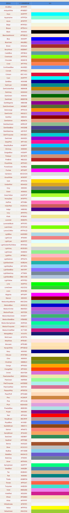
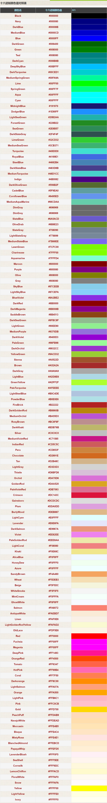

# **颜色表**

**CSS 颜色名**

**所有浏览器都支持的颜色名。**

HTML 和 CSS 颜色规范中定义了 147 中颜色名（17 种标准颜色加 130 种其他颜色）。下面的表格中列出了所有这些颜色，以及它们的十六进制值。

提示：17 种标准色是 `aqua, black, blue, fuchsia, gray, green, lime, maroon, navy, olive, orange, purple, red, silver, teal, white, yellow。`

## 十六进制颜色值对照表

