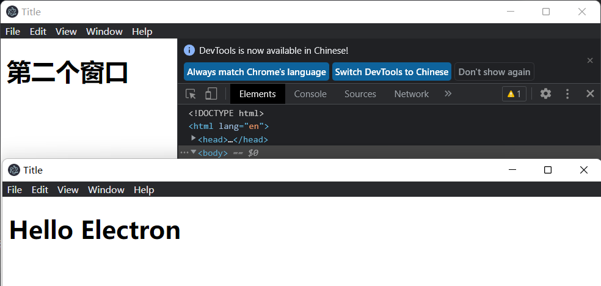
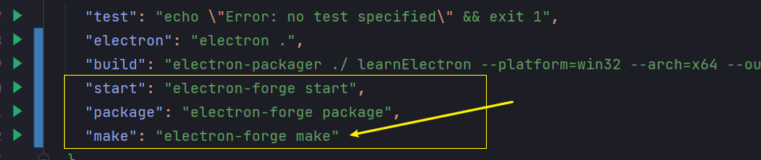
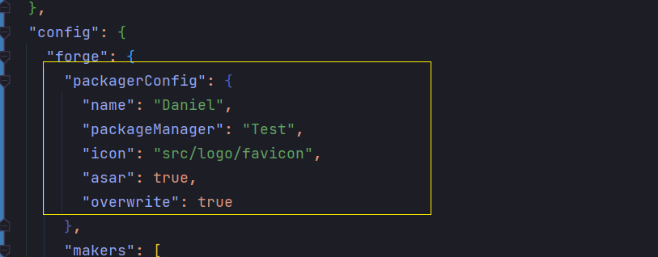

# 一、简介

## 1、Electron是什么？

+ [官网](https://www.electronjs.org/)
+ Electron是一个使用 JavaScript、HTML 和 CSS 构建桌面应用程序的框架。 嵌入 [Chromium](https://www.chromium.org/) 和 [Node.js](https://nodejs.org/) 到 二进制的 Electron 允许您保持一个 JavaScript 代码代码库并创建 在Windows上运行的跨平台应用 macOS和Linux——不需要本地开发 经验。

## 2、基本要求

熟悉该文档之前，需要你有`Node.js`和`web`开发经验。 如果您需要了解这两个方面的开发知识，我们推荐您使用以下学习资源：

- [来自Mozilla开发社区(Mozilla Developer Network)的web入门教程](https://developer.mozilla.org/en-US/docs/Learn/Getting_started_with_the_web)
- [NodeJS官方入门指南](https://nodejs.dev/learn)

此外，如果您熟悉Chromium进程模型，您将更好了解 Electron 的工作原理。 您可以通过阅读[Chrome comic](https://www.google.com/googlebooks/chrome/)来获得Chrome架构的简要概述，Chrome架构于2008年同Chrome浏览器的发布而发行。 尽管Chrome发布十多年了，【Chrome comic】漫画中介绍的核心原理仍然有助于理解Electron。

# 二、快速搭建

## 1、安装electron

初始化`package.json`文件

```sh
npm init
```

安装electron

```sh
npm i electron -s
```

## 2、配置为入口文件

```js
{
  "name": "bcelectronlearn",
  "version": "1.0.0",
  "description": "learn electron",
  "main": "main.js",
  "scripts": {
    "test": "echo \"Error: no test specified\" && exit 1"
  },
  "author": "Daniel",
  "license": "ISC",
  "dependencies": {
    "electron": "^19.0.9"
  }
}

```

## 3、创建main.js文件

```js
const electron = require('electron')
// 控制应用程序的事件生命周期。
const app = electron.app 
// 当 Electron 完成初始化时，触发一次
app.on('ready', ()=>{
  new electron.BrowserWindow({
    width: 800,
    height: 800
  })
})
```

## 4、创建窗口

```js
app.on('ready', () => {
    const mainWindow = new electron.BrowserWindow({
        width: 800,
        height: 800
    })
    // 加载页面
    mainWindow.loadFile('./src/index.html')
})
```

# 四、自动刷新页面

## 1、安装插件

```sh
npm install --save-dev electron-reloader
```

## 2、在入口main.js引入插件

```js
const reloader = require('electron-reloader')
reloader(module)
```

# 五、主进程和渲染进程

## 1、什么主进程和渲染进程

Electron 运行 `package.json` 的 `main` 脚本的进程被称为**主进程**。 在主进程中运行的脚本通过创建web页面来展示用户界面。 一个 Electron 应用总是有且只有一个主进程。

由于 Electron 使用了 Chromium 来展示 web 页面，所以 Chromium 的多进程架构也被使用到。 每个 Electron 中的 web 页面运行在它的叫**渲染进程**的进程中。

在普通的浏览器中，web页面无法访问操作系统的原生资源。 然而 `Electron `的用户在 `Node.js `的 API 支持下可以在页面中和操作系统进行一些底层交互。

```js
app.on('ready', () => {
    const mainWindow = new electron.BrowserWindow({
        width: 800,
        height: 800
    })
    mainWindow.loadFile('./src/index.html');
    
    const mainWindow2 = new electron.BrowserWindow({
        width: 800,
        height: 800
    })
    mainWindow2.loadFile('./src/index2.html');
})
```


## 2、打开渲染进程调试

我们可以在窗口中使用`ctrl+shift+i`打开进程调试窗口，如果想要在渲染是自动打开（默认打开调试）则需要添加`mainWindow2.webContents.openDevTools()`

```js
// 打开第二个窗口渲染进程
mainWindow2.webContents.openDevTools()
```



# 六、自定义原生菜单

## 1、主进程自定义菜单

详细文档：https://www.electronjs.org/zh/docs/api/menu

在主进程中创建菜单模板并加载，值得注意的是在主进程中的菜单会在所有渲染进程中展示

```js
const {app,BrowserWindow,Menu} = require("electron") // 采用对象的方式导入
// 控制应用程序的事件生命周期
// const app = electron.app

// 热更新
const reloader = require('electron-reloader')
reloader(module)
// 当 Electron 完成初始化时，触发一次
app.on('ready', () => {
    const mainWindow = new BrowserWindow({
        width: 800,
        height: 800
    })
    mainWindow.loadFile('./src/index.html');


    // const mainWindow2 = new BrowserWindow({
    //     width: 800,
    //     height: 800
    // })
    // mainWindow2.webContents.openDevTools()
    //
    // mainWindow2.loadFile('./src/index2.html');

    // 定义菜单
    const template = [
        {
            label: '文件',
            submenu: [
                {
                    label: '新建窗口'
                }
            ]
        },
        {
            label: '编辑',
            submenu: [
                {
                    label: '新建窗口'
                }
            ]
        }
    ]
    const menu = Menu.buildFromTemplate(template)

    Menu.setApplicationMenu(menu)
})
```

### 抽离自定义菜单

与`main.js`同级新建文件`menu.js`，注意导入`electron`中的`Menu`

```js
const { Menu} = require('electron');

const template = [
    {
        label: '文件',
        submenu: [
            {
                label: '新建窗口'
            }
        ]
    },
    {
        label: '编辑',
        submenu: [
            {
                label: '新建窗口'
            }
        ]
    }
]
const menu = Menu.buildFromTemplate(template)

Menu.setApplicationMenu(menu)
```

在main.js中导入菜单menu.js文件

```js
require('./menu')
```


## 2、主进程菜单定义点击事件

### 点击打开新窗口

创建新窗口需要在`menu.js`导入`BrowserWindow`

```js
const { Menu,BrowserWindow} = require('electron');
```

在`menu.js`中的`template`菜单里添加点击事件打开新窗口，在src下新建`new.html`

```js
submenu: [
  {
    label: '新建窗口',
    click: ()=>{
      const newMainWindow = new BrowserWindow({
        width: 300,
        height: 300
      })
      newMainWindow.loadFile('./src/new.html')
    }
  }
]
```

### 点击打开浏览器

`shell` 模块提供了集成其他桌面客户端的关联功能，我们在`menu.js`中导入`shell`

```js
const { BrowserWindow, Menu, shell } = require('electron')
```

在menu.js中的template中新建菜单

```js
{
    label: '打开浏览器',
    submenu: [
        {
            label: '打开百度',
            click: ()=>{
                // 点击打开浏览器
                shell.openExternal('https://www.baidu.com/')
            }
        }
     ]
}
```

## 3、无边框（自定义菜单）

### 开启无边框

通过`frame`创建无边框窗口

```js
const mainWindow = new BrowserWindow({
    width: 800,
    height: 800,
    frame: false // 无边框模式
})
```

### 自定义窗口

index.html中添加头部菜单

```html
<div class="custom-menu">
    <ul>
        <li>新建窗口</li>
        <li>关于我们</li>
    </ul>
</div>
```

在src文件夹下新建css文件夹并且新建文件`index.css`，并在`index.html`中导入该样式

```css
* {
    margin: 0;
    padding: 0;
}
.custom-menu {
    height: 50px;
    width: 100%;
    background: pink;
}

.custom-menu ul {
    list-style: none;
}

.custom-menu ul li {
    float: left;
    width: 70px;
    line-height: 50px;
    text-align: center;
    margin-left: 10px;
}
```

### 实现拖拽

在需要拖拽的菜单栏（`.custom-menu`）添加样式

```css
.custom-menu {
    height: 50px;
    width: 100%;
    background: pink;
    -webkit-app-region: drag; // 整个菜单栏可拖拽
}
```

==注意添加拖拽后点击效果会失效，在需要点击的子元素上需要关闭拖拽==

```css
.custom-menu ul li {
    float: left;
    width: 70px;
    line-height: 50px;
    text-align: center;
    margin-left: 10px;
    -webkit-app-region: no-drag;  // li点击元素去除拖拽，不然后面无法实现点击事件
}
```


## 4、点击创建新窗口（版本有区分）

在html中`新建窗口`添加`class="new-window"`

==注意：移除新建窗口元素的拖拽效果==

```css
-webkit-app-region: no-drag;
```

### 12版本以前

12版本更新的时候废弃了remote，所以此方式适用于12版之前

在src下新建文件夹js并在此文件夹下新建`index.js`，问题来了，主进程在main.js中，自定义js是无法使用node中的方法，所以我们需要在主进程中`开启node模块`和`开启remote模块`，让自定义文件中可以使用node的方法

```js
const mainWindow = new BrowserWindow({
  width: 800,
  height: 500,
  webPreferences: {
    // 开启node模块
    nodeIntegration: true,
    // 开启remote模块
    enableRemoteModule: true
  }
})
```

开启node模块后，我们可以通过`remote`使用主进程方法，并达到主进程菜单的效果，在`index.js`中添加点击事件打开新窗口

```js
// remote 通过remote使用主进程的方法
const { remote: {BrowserWindow} } = require('electron')
const newWindow = document.querySelector('.new-window')
newWindow.onclick = function () {
  new BrowserWindow({
    width: 200,
    height: 300
  })
}
```

### 12版本以后

12版本更新的时候废弃了remote，所以需要单独安装remote

首先在项目根目录下安装`@electron/remote`包：

```sh
npm install @electron/remote --savesh
```

在主进程中进行初始化：

```js
require("@electron/remote/main").initialize();
require("@electron/remote/main").enable(mainWindow.webContents);
```

并在主进程的`BrowserWindow`的`webPreferences`中设置`enableRemoteModule`和`contextIsolation`：

```js
webPreferences: {
    nodeIntegration: true,
    contextIsolation: false,
    enableRemoteModule: true, // 使用remote模块
},
```

在渲染进程中自定义的`index.js`中修改导入方式就好了

```js
const BrowserWindow = require("@electron/remote").BrowserWindow;
```

完整示例

```js
// ./main.js
const mainWindow = new BrowserWindow({
    width: 1280,
    height: 800,
    frame: false,
    webPreferences: {
        nodeIntegration: true,
        contextIsolation: false,
        enableRemoteModule: true, // 使用remote模块
    },
})
require("@electron/remote/main").initialize(); // 初始化
require("@electron/remote/main").enable(mainWindow.webContents);

// ./src/js/index.js 文件
const { BrowserWindow } = require("@electron/remote")

const newWindow = document.querySelector('.new-window')
console.log(newWindow)
newWindow.onclick = function () {
    console.log(123)
    new BrowserWindow({
        width: 200,
        height: 300
    })
}
```


## 5、打开浏览器

在菜单栏添加`a`表签菜单打开浏览器

```html
<li class="new-window">新建窗口</li>
<li>关于我们</li>
<li><a id="a1" href="https://www.baidu.com">打开百度</a></li>
<li><a id="a2" href="https://www.bilibili.com">哔哩哔哩</a></li>
```

我们发现点击后会在窗口内打开页面，如何让其在浏览器中打开页面呢

我们在index.js中使用`shell`来实现

```js
const { shell } = require('electron')
const allA = document.querySelectorAll('a')

allA.forEach(item => {
  item.onclick = function (e) {
    e.preventDefault()
    console.log(item)
    shell.openExternal(item.href)
  }
})
```

# 六、打开对话框读取文件

本次使用版本为electron：19.0.9，旧版方法已不适用

## 1、读取文件

定义点击事件

```js
<button onclick="openFile()">打开</button>
<textarea id="textEl"></textarea>
```

打开对话框文档：https://www.electronjs.org/docs/api/dialog

我们需要在index.js中导入dialog和fs

```js
const fs = require("node:fs");
const {BrowserWindow,dialog} = require("@electron/remote")
```

定义事件函数，获取textarea节点并将选中文件的内容打印到节点中

```js
// 打开对话框
const textEl = document.querySelector('#textEl')
function openFile() {
    dialog.showOpenDialog({
        title: '选择文件',
        buttonLabel: '确认',
        filters: [
            { name: 'Custom File Type', extensions: ['js'] },
        ]
    }).then(result => {
        console.log(result)
        console.log(result.canceled)
        console.log(result.filePaths)
        const fileContent = fs.readFileSync(result.filePaths[0])
        textEl.innerText = fileContent
    }).catch(err => {
        console.log(err)
    })
}
```

## 2、保存文件

同样我们需要在index.js中导入dialog和fs，前面在读取文件中已经导入

定义点击事件

```html
<button onclick="saveFile()">保存</button>
```

事件函数

```js
// 保存文件
function saveFile(){
    dialog.showSaveDialog({
        title: '保存文件',
        buttonLabel: '保存文件',
        filters: [
            { name: 'index', extensions: ['js'] },
        ]
    }).then(result => {
        console.log(result)
        console.log(result.canceled);
        console.log(result.filePath);
        fs.writeFileSync(result.filePath, textEl.value)
    }).catch(err =>{
        console.log(err)
    })
}
```

# 七、定义快捷键

## 1、主线程定义

### 在main.js引入

```js
const { app, BrowserWindow, globalShortcut } = require('electron')
```

### 在ready中注册快捷键

```js
const ret = globalShortcut.register('CommandOrControl+X', () => {
  console.log('CommandOrControl+X is pressed ---> Print the results on the command line')
})
```

### 定义快捷键最大化、缩小、最小化、关闭窗口

```js
// 定义快捷键
    // 不做任何操作 Ctrl+X
    const ret = globalShortcut.register('CommandOrControl+X', () => {
        console.log('CommandOrControl+X is pressed ---> Print the results on the command line')
    })
    // 窗口最大化 Ctrl+M
    globalShortcut.register('CommandOrControl+M',()=>{
        mainWindow.maximize()
        console.log('CommandOrControl+M is pressed ---> Maximize window')
    })
    // 窗口缩小 Ctrl+T
    globalShortcut.register('CommandOrControl+T',()=>{
        mainWindow.unmaximize();
        console.log('CommandOrControl+T is pressed ---> Unmaximize window')
    })
    // 窗口最小化 Ctrl+J
    globalShortcut.register('CommandOrControl+J',()=>{
        mainWindow.minimize();
        console.log('CommandOrControl+J is pressed ---> Minimize window')
    })
    // 窗口关闭 Ctrl+H
    globalShortcut.register('CommandOrControl+H',()=>{
        mainWindow.close()
        console.log('CommandOrControl+H is pressed ---> Close window')
    })
```

## 2、渲染进程定义

通过`remote`注册,所以引入`globalShortcut`

```js
const {BrowserWindow,dialog,globalShortcut } = require("@electron/remote")
```

定义快捷键

```js
// 定义快捷键
globalShortcut.register('Ctrl+O', () => {
  console.log('ctrl+o')
})
```

# 八、渲染进程和主线程通讯

## 1、渲染进程点击触发主线程

`index.html`定义按钮

```html
<div class="maxWindow no-drag" onclick="maxWindow()"></div>
```

`index.js`中导入`ipcRenderer`

```js
const { shell,ipcRenderer } = require('electron')
```

然后定义事件函数

```js
function maxWindow() {
  ipcRenderer.send('max-window')
}
```

`main.js`导入`ipcMain`

```js
const {app, BrowserWindow,globalShortcut,ipcMain} = require("electron")
```

主线程定义事件

```js
ipcMain.on('max-window', () => {
    mainWindow.maximize()
  })
```

## 2、渲染进程和主线程传参

渲染进程根据点击传参

```js
// 渲染进程和主线程通讯
let windowSize = 'unmax-window'
function maxWindow() {
    windowSize = (windowSize === 'unmax-window' ? 'max-window' : 'unmax-window')
    ipcRenderer.send('max-window',windowSize)
}
```

主进程接收参数

```js
// 接收渲染进程事件触发
ipcMain.on('max-window', (event,args) => {
    console.log(args)
    if(args === 'unmax-window') return mainWindow.maximize();
    mainWindow.unmaximize()
})
```

# 九、electron打包

官方提供了三种打包方式

> [electron-forge](https://github.com/electron-userland/electron-forge)
>
> [electron-builder](https://github.com/electron-userland/electron-builder)
>
> [electron-packager](https://github.com/electron/electron-packager)

## 1、electron-packager

### 安装

```sh
npm install --save-dev electron-packager
```


## 2、electron-forge

本次使用的是`electron-forge`进行打包

### 安装

```sh
npm install -g cnpm --registry=https://registry.npm.taobao.org
```

安装electron-forge

```js
npm install --save-dev @electron-forge/cli
```

### 添加打包语句

添加打包语句

```js
npx electron-forge import
```



### 配置打包参数

```json
"packagerConfig": {
    "name": "Daniel",
    "packageManager": "Test",
    "icon": "src/logo/favicon",
    "asar": true,
    "overwrite": true
},
```



### 使用make命令打包

```sh
npm run make
```


# 十、electron结合框架开发

利用vue脚手架初始化项目

## 1、在项目中安装electron

```sh
npm i electron
```


## 2、添加electron启动配置

```json
"name": "mymusic-client",
"version": "0.1.0",
"private": true,
"main": "main.js", # 加载
"description": "MyMusic",  # 必须参数
"author": "Daniel", # 必须参数
"scripts": {
    "dev": "vue-cli-service serve --host 127.0.0.1 --port 80",
    "serve": "vue-cli-service serve --host 127.0.0.1 --port 80",
    "build": "vue-cli-service build",
    "start": "electron-forge start",
    "package": "electron-forge package",
    "make": "electron-forge make"
},
```

添加打包参数配置

```json
"packagerConfig": {
        "name": "Daniel",
        "packageManager": "Test",
        "icon": "src/logo/favicon",
        "asar": true,
        "overwrite": true
      },
```


## 3、配置main.js

```js
const {app, BrowserWindow} = require('electron')

function createWindow () {
  // Create the browser window.
  const mainWindow = new BrowserWindow({
    width: 800,
    height: 600
  })
  // Open the DevTools.
  // mainWindow.webContents.openDevTools()
}

app.on('ready', () => {
  createWindow()
})
```

## 4、加载vue项目

```js
mainWindow.loadURL('http://localhost:3000/')
```

## 5、完整版

```json
{
  "name": "mymusic-client",
  "version": "0.1.0",
  "private": true,
  "main": "main.js",
  "description": "MyMusic",
  "author": "Daniel",
  "homepage": "./",
  "scripts": {
    "dev": "vue-cli-service serve --host 127.0.0.1 --port 80",
    "serve": "vue-cli-service serve --host 127.0.0.1 --port 80",
    "build": "vue-cli-service build",
    "start": "electron-forge start",
    "package": "electron-forge package",
    "make": "electron-forge make"
  },
  "dependencies": {
    "animate.css": "^4.1.1",
    "axios": "^0.24.0",
    "bootstrap": "^3.4.1",
    "core-js": "^3.6.5",
    "echarts": "^5.2.2",
    "electron-squirrel-startup": "^1.0.0",
    "element-ui": "^2.15.6",
    "es6-promise": "^4.2.8",
    "jquery": "^3.6.0",
    "qs": "^6.10.3",
    "vue": "^2.6.11",
    "vue-router": "^3.5.3",
    "vuex": "^3.6.2"
  },
  "devDependencies": {
    "@electron-forge/cli": "^6.0.0-beta.64",
    "@electron-forge/maker-deb": "^6.0.0-beta.64",
    "@electron-forge/maker-rpm": "^6.0.0-beta.64",
    "@electron-forge/maker-squirrel": "^6.0.0-beta.64",
    "@electron-forge/maker-zip": "^6.0.0-beta.64",
    "@vue/cli-plugin-babel": "~4.5.0",
    "@vue/cli-service": "~4.5.0",
    "electron": "^19.0.9",
    "less": "^3.0.4",
    "less-loader": "^5.0.0",
    "vue-template-compiler": "^2.6.11"
  },
  "config": {
    "forge": {
      "packagerConfig": {
        "name": "Daniel",
        "packageManager": "Test",
        "icon": "src/assets/logo/favicon",
        "asar": true,
        "overwrite": true
      },
      "makers": [
        {
          "name": "@electron-forge/maker-squirrel",
          "config": {
            "name": "mymusic_client"
          }
        },
        {
          "name": "@electron-forge/maker-zip",
          "platforms": [
            "darwin"
          ]
        },
        {
          "name": "@electron-forge/maker-deb",
          "config": {}
        },
        {
          "name": "@electron-forge/maker-rpm",
          "config": {}
        }
      ]
    }
  }
}

```


# 十一、Electron安装问题

## 1、获取npm命令

### 方式1

1. 安装nvm
2. 安装node(以最新版为例)
   `nvm install latest`
3. 确认一下命令是否可用
   `node -v` 和 `npm -v`

### 方式2

直接去nodejs官网下载

## 2、安装electron步骤

### 1、安装electron

在需要安装electron的目录下使用命令`npm install electron`进行electron的安装。

如果安装成功了，请原路返回， 不远送了；
如果error出现了, 我的错误信息如下 。

> .....RequestError: read ECONNRESET.....
> npm ERR! code ELIFECYCLE
> npm ERR! errno 1
> npm ERR! electron@17.2.0 postinstall: `node install.js`
> npm ERR! Exit status 1
> npm ERR!
> npm ERR! Failed at the electron@17.2.0 postinstall script.
> npm ERR! This is probably not a problem with npm. There is likely additional logging output above.
> npm ERR! A complete log of this run can be found in:
> npm ERR! E:\nodejs\npm_cache_logs\2022-03-25T15_49_12_347Z-debug.log

这个时候，不要急不要慌，其实我们并没有失败，一切都在意料之中，我们只是利用他来帮我们实现基础架构，接下来正文开始。

### 2、手动下载出错的文件

   方式1） 打开浏览器键入下述网址， 点击你想要的版本号， 然后找到适合你电脑的包点击即可下载了。看准了下载^`electron`开头的。
`https://registry.npmmirror.com/binary.html?path=electron/`

` ` 方式2）手动拼接url(只需将x.x.x替换为你需要的版本号)，然后复制粘贴到浏览器地址栏或其他可提供下载的工具中。``

win64: 

```
https://registry.npmmirror.com/-/binary/electron/x.x.x/electron-vx.x.x-win32-x64.zip
```

linux64:

```
https://registry.npmmirror.com/-/binary/electron/x.x.x/electron-vx.x.x-linux-x64.zip
```

mac amd(一般是这个):

```
https://registry.npmmirror.com/-/binary/electron/x.x.x/electron-vx.x.x-darwin-x64.zip
```

mac arm64（如M1芯片）:

```
https://registry.npmmirror.com/-/binary/electron/x.x.x/electron-vx.x.x-darwin-arm64.zip
```

### 3. 表演开始

1. 进入目录 `yourProjects/node_modules/electron`
2. 新建文件夹 `dist`
3. 新建文件`path.txt`，根据自己的系统类型输入：
   windows系统输入： `electron.exe`
   mac系统输入：`Electron.app/Contents/MacOS/Electron`
   linux系统输入：`electron`
4. 解压缩刚下载的文件到dist目录