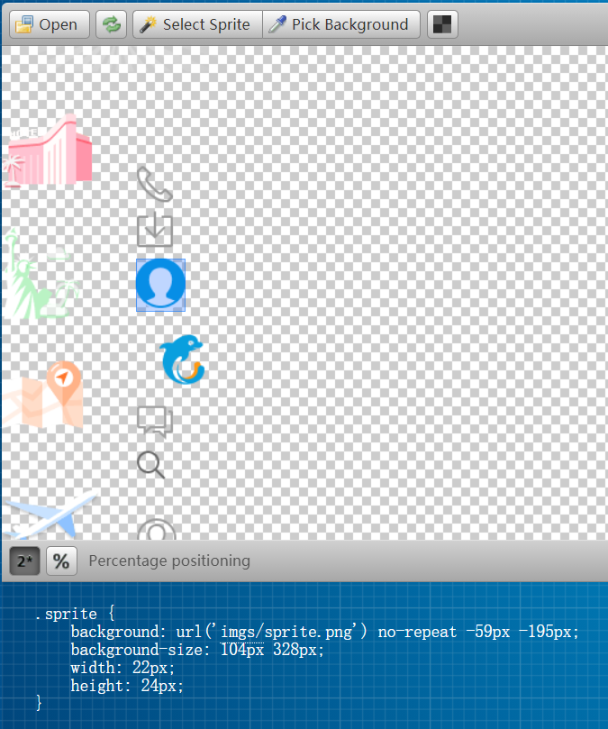

# 一、页面搭建过程的注意点

## 1、样式初始化操作

```css
body {
    max-width: 540px;
    min-width: 320px;
    margin: 0 auto;
    font: normal 14px/1.5 Tahoma, "Lucida Grande", Verdana, "Microsoft Yahei", STXihei, hei;
    color: #000;
    background: #f2f2f2;
    overflow-x: hidden;
    -webkit-tap-highlight-color: transparent;
}
*{
    margin: 0;
    padding: 0;
}
a{
    text-decoration: none;
    color: #222;
    font-size: 12px;
}
ol,ul,li{
    list-style: none;

}
div{
    box-sizing: border-box;
}
```

## 2、定位中的居中问题

```css
/*搜索模块*/
.search-header{
    position: fixed;/*生成绝对定位的元素，相对于浏览器窗口进行定位。*/
    top: 0;
    left: 50%;/*当使用向左偏移50%时，元素只是以最左边为标准*/
    transform: translateX(-50%);/*translateX表示水平平移，注意此处平移的是自身宽度的50%，负数代表向左平移*/
    -webkit-transform: translateX(-50%);
    height: 44px;
    width: 100%;
    min-width: 320px;/*设置最小宽度*/
    max-width: 540px;/*设置最大宽度*/
    display: flex;

}
```

## 3、元素被子元素覆盖解决

常见div元素设置圆角，但子元素未设置时，圆角效果无法显示

此时需要在添加圆角效果的元素处，添加`overflow: hidden`

## 4、Css选择器技巧

### 通过公式选择前两个元素

```css
.nav-common div:nth-child(-n+2){
    border-right: 1px solid #fff;
}
```

### 通过通用类名批量操作

`[]` 内部通过`class^=“class部分名称”` 即可选择同类标签

```css
.nav-common div [class^="nav-common-ico"]{
    background: url('../img/hotel.png') no-repeat 0 0;
    background-size: 121px 44px;
    height: 44px;
    width: 121px;
}
```

## 5、背景颜色渐变

### 使用方向渐变

background中的linear-gradient可以进行颜色渐变，参数至少包含两个颜色值

```
background: linear-gradient(渐变方向,颜色值1,颜色值2,颜色值3 ......);
```

渐变方向可以是（to bottom、to top、to right、to left、to bottom right，等等）

示例：

```css
background: linear-gradient(to right,#F96B52,#F99A4B);
```

### 当然也可使用角度

角度是指水平线和渐变线之间的角度，逆时针方向计算。换句话说，0deg 将创建一个从下到上的渐变，90deg 将创建一个从左到右的渐变。


==请注意==：很多浏览器（Chrome、Safari、firefox等）的使用了旧的标准，即 0deg 将创建一个从左到右的渐变，90deg 将创建一个从下到上的渐变。换算公式 **90 - x = y** 其中 x 为标准角度，y为非标准角度。

示例：

```css
#grad {
  background-image: linear-gradient(-90deg, red, yellow);
}
```

## 6、精灵图的使用

正常情况下设计人员会将设计的图的放大倍数告知，或在精灵图名称中有所体现，使用时需要注意缩放比例

此处推荐一个网站用于定位精灵图，并生成相应的代码

网址：http://www.spritecow.com/



background-size属性用于控制精灵图的缩放比例，注意项目中的实际比例，进行相应的缩放。

如果是通过类名批量处理的，此时修改其他图标需要用到  `background-position`进行重新定位

==注意：如果统一处理后，单独处理的元素需要与统一处理的筛选步骤相同==

例如：

```css
.server-item [class^="item-ico"]{
	margin: 6px 0 3px;
    background: url('../img/subnav-bg.png') no-repeat 0 0;
    background-size: 24px 300px;
    width: 22px;
    height: 25px;
}
```

重新定位

```css
.server-item .item-ico2{ /*注意此处不可省略.server-item 否则无效*/
    background-position: 0 -26px;
}
```

## 7、伪类元素使用注意

```css
.search-my::before{
    content: ""; /*需要加入内容*/
    display: block;/*使用块元素，否则无效果*/
    width: 22px;
    height: 24px;
    background: url('../img/sprite.png') no-repeat -59px -194px;
    background-size: 104px auto;
    margin:0 11px;
}
```

