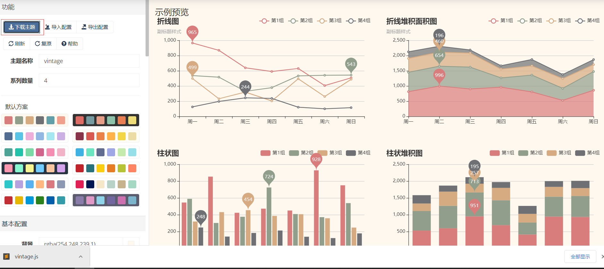

# 一、ECharts简介


ECharts 是一个使用 JavaScript 实现的开源可视化库，涵盖各行业图表，满足各种需求。

ECharts 遵循 Apache-2.0 开源协议，免费商用。

ECharts 兼容当前绝大部分浏览器（IE8/9/10/11，Chrome，Firefox，Safari等）及兼容多种设备，可随时随地任性展示。

## 1、ECharts 特性

ECharts 包含了以下特性：

- **丰富的可视化类型**: 提供了常规的折线图、柱状图、散点图、饼图、K线图，用于统计的盒形图，用于地理数据可视化的地图、热力图、线图，用于关系数据可视化的关系图、treemap、旭日图，多维数据可视化的平行坐标，还有用于 BI 的漏斗图，仪表盘，并且支持图与图之间的混搭。
- **多种数据格式无需转换直接使用**: 内置的 dataset 属性（4.0+）支持直接传入包括二维表，key-value 等多种格式的数据源，此外还支持输入 TypedArray 格式的数据。
- **千万数据的前端展现**: 通过增量渲染技术（4.0+），配合各种细致的优化，ECharts 能够展现千万级的数据量。
- **移动端优化**: 针对移动端交互做了细致的优化，例如移动端小屏上适于用手指在坐标系中进行缩放、平移。 PC 端也可以用鼠标在图中进行缩放（用鼠标滚轮）、平移等。
- **多渲染方案，跨平台使用**: 支持以 Canvas、SVG（4.0+）、VML 的形式渲染图表。
- **深度的交互式数据探索**: 提供了 图例、视觉映射、数据区域缩放、tooltip、数据刷选等开箱即用的交互组件，可以对数据进行多维度数据筛取、视图缩放、展示细节等交互操作。
- **多维数据的支持以及丰富的视觉编码手段**: 对于传统的散点图等，传入的数据也可以是多个维度的。
- **动态数据**: 数据的改变驱动图表展现的改变。
- **绚丽的特效**: 针对线数据，点数据等地理数据的可视化提供了吸引眼球的特效。
- **通过 GL 实现更多更强大绚丽的三维可视化**: 在 VR，大屏场景里实现三维的可视化效果。
- **无障碍访问（4.0+）**: 支持自动根据图表配置项智能生成描述，使得盲人可以在朗读设备的帮助下了解图表内容，让图表可以被更多人群访问！

## 2、第一个实例

```html
<!DOCTYPE html>
<html>
<head>
    <meta charset="utf-8">
    <title>第一个 ECharts 实例</title>
    <!-- 引入 echarts.js -->
    <script src="https://cdn.staticfile.org/echarts/4.3.0/echarts.min.js"></script>
</head>
<body>
    <!-- 为ECharts准备一个具备大小（宽高）的Dom -->
    <div id="main" style="width: 600px;height:400px;"></div>
    <script type="text/javascript">
        // 基于准备好的dom，初始化echarts实例
        var myChart = echarts.init(document.getElementById('main'));
 
        // 指定图表的配置项和数据
        var option = {
            title: {
                text: '第一个 ECharts 实例'
            },
            tooltip: {},
            legend: {
                data:['销量']
            },
            xAxis: {
                data: ["衬衫","羊毛衫","雪纺衫","裤子","高跟鞋","袜子"]
            },
            yAxis: {},
            series: [{
                name: '销量',
                type: 'bar',
                data: [5, 20, 36, 10, 10, 20]
            }]
        };
 
        // 使用刚指定的配置项和数据显示图表。
        myChart.setOption(option);
    </script>
</body>
</html>
```

# 二、ECharts 安装

## 1、独立版本

我们可以在直接下载 echarts.min.js 并用 **<script>** 标签引入。

[echarts.min.js(4.7.0)](https://cdn.staticfile.org/echarts/4.7.0/echarts.min.js)

另外，开发环境下可以使用源代码版本 echarts.js 并用 **<script>** 标签引入，源码版本包含了常见的错误提示和警告。

[echarts.js(4.7.0)](https://cdn.staticfile.org/echarts/4.7.0/echarts.js)

我们也可以在 ECharts 的官网上直接下载更多丰富的版本，包含了不同主题跟语言，下载地址：https://echarts.apache.org/zh/download.html。

这些构建好的 echarts 提供了下面这几种定制：

> - 完全版：`echarts/dist/echarts.js`，体积最大，包含所有的图表和组件，所包含内容参见：`echarts/echarts.all.js`。
> - 常用版：`echarts/dist/echarts.common.js`，体积适中，包含常见的图表和组件，所包含内容参见：`echarts/echarts.common.js`。
> - 精简版：`echarts/dist/echarts.simple.js`，体积较小，仅包含最常用的图表和组件，所包含内容参见：`echarts/echarts.simple.js`。

------

## 2、使用 CDN 方法

以下推荐国外比较稳定的两个 CDN，国内还没发现哪一家比较好，目前还是建议下载到本地。

- **Staticfile CDN（国内）** : https://cdn.staticfile.org/echarts/4.3.0/echarts.min.js
- **jsDelivr**：https://cdn.jsdelivr.net/npm/echarts@4.3.0/dist/echarts.min.js。
- **cdnjs** : https://cdnjs.cloudflare.com/ajax/libs/echarts/4.3.0/echarts.min.js

使用 Staticfile CDN（国内）

```html
<!-- 为ECharts准备一个具备大小（宽高）的Dom --> 
<div id="main" style="width: 600px;height:400px;"></div>
```

## 3、NPM 方法

由于 npm 安装速度慢，本教程使用了淘宝的镜像及其命令 cnpm，安装使用介绍参照：[使用淘宝 NPM 镜像](https://www.runoob.com/nodejs/nodejs-npm.html#taobaonpm)。

npm 版本需要大于 3.0，如果低于此版本需要升级它：

```shell
# 查看版本
$ npm -v
2.3.0

#升级 npm
cnpm install npm -g


# 升级或安装 cnpm
npm install cnpm -g
```

通过 cnpm 获取 echarts：

```shell
# 最新稳定版
$ cnpm install echarts --save
```

安装完成后 `ECharts `和 `zrender `会放在 `node_modules `目录下，我们可以直接在项目代码中使用`require('echarts') `来使用。

## 4、实例

```js
var echarts = require('echarts');
 
// 基于准备好的dom，初始化echarts实例
var myChart = echarts.init(document.getElementById('main'));
// 绘制图表
myChart.setOption({
    title: {
        text: 'ECharts 入门示例'
    },
    tooltip: {},
    xAxis: {
        data: ['衬衫', '羊毛衫', '雪纺衫', '裤子', '高跟鞋', '袜子']
    },
    yAxis: {},
    series: [{
        name: '销量',
        type: 'bar',
        data: [5, 20, 36, 10, 10, 20]
    }]
});
```

# 三、ECharts 配置语法

本章节我们将为大家介绍使用 ECharts 生成图表的一些配置。

[完整配置项请点击此处](./ECharts完整配置项.md)

## 第一步：创建 HTML 页面

创建一个 HTML 页面，引入 echarts.min.js：

```html
<!DOCTYPE html>
<html>
<head>
    <meta charset="utf-8">
    <!-- 引入 ECharts 文件 -->
    <script src="echarts.min.js"></script>
</head>
</html>
```

## 第二步: 为 ECharts 准备一个具备高宽的 DOM 容器


实例中 id 为 main 的 div 用于包含 ECharts 绘制的图表:

```html
<body>
    <!-- 为 ECharts 准备一个具备大小（宽高）的 DOM -->
    <div id="main" style="width: 600px;height:400px;"></div>
</body>
```

## 第三步: 设置配置信息

ECharts 库使用 json 格式来配置。

```js
echarts.init(document.getElementById('main')).setOption(option);
```

这里 option 表示使用 json 数据格式的配置来绘制图表。步骤如下：

**标题**

为图表配置标题：

```js
title: {
    text: '第一个 ECharts 实例'
}
```

**提示信息**

配置提示信息：

```js
tooltip: {},
```

**图例组件**

图例组件展现了不同系列的标记(symbol)，颜色和名字。可以通过点击图例控制哪些系列不显示。

```js
legend: {
    data: [{
        name: '系列1',
        // 强制设置图形为圆。
        icon: 'circle',
        // 设置文本为红色
        textStyle: {
            color: 'red'
        }
    }]
}
```

**X 轴**

配置要在 X 轴显示的项:

```js
xAxis: {
    data: ["衬衫","羊毛衫","雪纺衫","裤子","高跟鞋","袜子"]
}
```

**Y 轴**

配置要在 Y 轴显示的项。

```js
yAxis: {}
```

**系列列表**

每个系列通过 type 决定自己的图表类型:

```js
series: [{
    name: '销量',  // 系列名称
    type: 'bar',  // 系列图表类型
    data: [5, 20, 36, 10, 10, 20]  // 系列中的数据内容
}]
```

每个系列通过 type 决定自己的图表类型：

- **type: 'bar'**：柱状/条形图
- **type: 'line'**：折线/面积图
- **type: 'pie'**：饼图
- **type: 'scatter'**：散点（气泡）图
- **type: 'effectScatter'**：带有涟漪特效动画的散点（气泡）
- **type: 'radar'**：雷达图
- **type: 'tree'**：树型图
- **type: 'treemap'**：树型图
- **type: 'sunburst'**：旭日图
- **type: 'boxplot'**：箱形图
- **type: 'candlestick'**：K线图
- **type: 'heatmap'**：热力图
- **type: 'map'**：地图
- **type: 'parallel'**：平行坐标系的系列
- **type: 'lines'**：线图
- **type: 'graph'**：关系图
- **type: 'sankey'**：桑基图
- **type: 'funnel'**：漏斗图
- **type: 'gauge'**：仪表盘
- **type: 'pictorialBar'**：象形柱图
- **type: 'themeRiver'**：主题河流
- **type: 'custom'**：自定义系列

## 实例

```html
<!DOCTYPE html>
<html>
<head>
    <meta charset="utf-8">
    <title>第一个 ECharts 实例</title>
    <!-- 引入 echarts.js -->
    <script src="https://cdn.staticfile.org/echarts/4.3.0/echarts.min.js"></script>
</head>
<body>
    <!-- 为ECharts准备一个具备大小（宽高）的Dom -->
    <div id="main" style="width: 600px;height:400px;"></div>
    <script type="text/javascript">
        // 基于准备好的dom，初始化echarts实例
        var myChart = echarts.init(document.getElementById('main'));
 
        // 指定图表的配置项和数据
        var option = {
            title: {
                text: '第一个 ECharts 实例'
            },
            tooltip: {},
            legend: {
                data:['销量']
            },
            xAxis: {
                data: ["衬衫","羊毛衫","雪纺衫","裤子","高跟鞋","袜子"]
            },
            yAxis: {},
            series: [{
                name: '销量',
                type: 'bar',
                data: [5, 20, 36, 10, 10, 20]
            }]
        };
 
        // 使用刚指定的配置项和数据显示图表。
        myChart.setOption(option);
    </script>
</body>
</html>
```

# 四、ECharts 饼图

前面的章节我们已经学会了使用 ECharts 绘制一个简单的柱状图，本章节我们将绘制饼图。

饼图主要是通过扇形的弧度表现不同类目的数据在总和中的占比，它的数据格式比柱状图更简单，只有一维的数值，不需要给类目。因为不在直角坐标系上，所以也不需要 xAxis，yAxis。

## 实例1

```js
myChart.setOption({
    series : [
        {
            name: '访问来源',
            type: 'pie',    // 设置图表类型为饼图
            radius: '55%',  // 饼图的半径，外半径为可视区尺寸（容器高宽中较小一项）的 55% 长度。
            data:[          // 数据数组，name 为数据项名称，value 为数据项值
                {value:235, name:'视频广告'},
                {value:274, name:'联盟广告'},
                {value:310, name:'邮件营销'},
                {value:335, name:'直接访问'},
                {value:400, name:'搜索引擎'}
            ]
        }
    ]
})
```

我们也可以通过设置参数 **roseType: 'angle'** 把饼图显示成南丁格尔图。

## 实例2

```js
option = {
    series : [
        {
            name: '访问来源',
            type: 'pie',
            radius: '55%',
            roseType: 'angle',
            data:[
                {value:235, name:'视频广告'},
                {value:274, name:'联盟广告'},
                {value:310, name:'邮件营销'},
                {value:335, name:'直接访问'},
                {value:400, name:'搜索引擎'}
            ]
        }
    ]
};
```


### 阴影的配置

itemStyle 参数可以设置诸如阴影、透明度、颜色、边框颜色、边框宽度等：

## 实例3

```js
option = {
    series : [
        {
            name: '访问来源',
            type: 'pie',
            radius: '55%',
            data:[
                {value:235, name:'视频广告'},
                {value:274, name:'联盟广告'},
                {value:310, name:'邮件营销'},
                {value:335, name:'直接访问'},
                {value:400, name:'搜索引擎'}
            ],
            roseType: 'angle',
            itemStyle: {
                normal: {
                    shadowBlur: 200,
                    shadowColor: 'rgba(0, 0, 0, 0.5)'
                }
            }
        }
    ]
};
```

# 五、ECharts 样式设置

ECharts 可以通过样式设置来改变图形元素或者文字的颜色、明暗、大小等。

## 1、颜色主题

ECharts4 开始，除了默认主题外，内置了两套主题，分别为` light `和 `dark`。

使用方式如下：

实例

```js
var chart = echarts.init(dom, 'light');
```

或者

```js
var chart = echarts.init(dom, 'dark');
```

另外，我们也可以在官方的[主题编辑器](http://echarts.baidu.com/theme-builder/) 选择自己喜欢的主题下载。

目前主题下载提供了 JS 版本和 JSON 版本。

如果你使用 JS 版本，可以将 JS 主题代码保存一个 主题名.js 文件，然后在 HTML 中引用该文件，最后在代码中使用该主题。



比如上图中我们选中了一个主题，将 JS 代码保存为 vintage.js。

实例

```js
<!-- 引入主题 -->
<script src="../PublicResource/echarts-5.2.1/them/vintage.js"></script>
...
// HTML 引入 vintage.js 文件后，在初始化的时候调用
var myChart = echarts.init(dom, 'vintage');
// ...
```

如果主题保存为 JSON 文件，那么可以自行加载和注册。

比如上图中我们选中了一个主题，将 JSON 代码保存为 vintage.json。

实例

```js
//主题名称是 wonderland
$.getJSON('wonderland.json', function (themeJSON) {
    echarts.registerTheme('wonderland', themeJSON)
    var myChart = echarts.init(dom, 'wonderland');
});
```

注意：我们使用了` $.getJSON`，所以需要引入 `jQuery`。

## 2、调色盘

调色盘可以在 option 中设置。

调色盘给定了一组颜色，图形、系列会自动从其中选择颜色。

可以设置全局的调色盘，也可以设置系列自己专属的调色盘。

```js
option = {
    // 全局调色盘。
    color: ['#c23531','#2f4554', '#61a0a8', '#d48265', '#91c7ae','#749f83',  '#ca8622', '#bda29a','#6e7074', '#546570', '#c4ccd3'],

    series: [{
        type: 'bar',
        // 此系列自己的调色盘。
        color: ['#dd6b66','#759aa0','#e69d87','#8dc1a9','#ea7e53','#eedd78','#73a373','#73b9bc','#7289ab', '#91ca8c','#f49f42'],
        ...
    }, {
        type: 'pie',
        // 此系列自己的调色盘。
        color: ['#37A2DA', '#32C5E9', '#67E0E3', '#9FE6B8', '#FFDB5C','#ff9f7f', '#fb7293', '#E062AE', '#E690D1', '#e7bcf3', '#9d96f5', '#8378EA', '#96BFFF'],
        ...
    }]
}
```

全局调色盘实例：

实例

```js
// 全局调色盘。
color: ['#ff0000','#00ff00', '#0000ff', '#d48265', '#91c7ae','#749f83',  '#ca8622', '#bda29a','#6e7074', '#546570', '#c4ccd3'],
```

系列调色盘实例：

实例

```js
series: [{
    type: 'pie',
    // 此系列自己的调色盘。
    color: ['#ff0000','#00ff00', '#0000ff', '#9FE6B8', '#FFDB5C','#ff9f7f', '#fb7293', '#E062AE', '#E690D1', '#e7bcf3', '#9d96f5', '#8378EA', '#96BFFF'],
    ...
}]
```


## 3、直接的样式设置

itemStyle, lineStyle, areaStyle, label, ...

直接的样式设置是比较常用设置方式。纵观 ECharts 的 option 中，很多地方可以设置 itemStyle、lineStyle、areaStyle、label 等等。这些的地方可以直接设置图形元素的颜色、线宽、点的大小、标签的文字、标签的样式等等。

一般来说，ECharts 的各个系列和组件，都遵从这些命名习惯，虽然不同图表和组件中，itemStyle、label 等可能出现在不同的地方。

直接样式设置的另一篇介绍——“四、 ECharts 饼图”。

## 4、高亮的样式：emphasis

在鼠标悬浮到图形元素上时，一般会出现高亮的样式。默认情况下，高亮的样式是根据普通样式自动生成的。

如果要自定义高亮样式可以通过 emphasis 属性来定制：

实例

```js
// 高亮样式。
emphasis: {
    itemStyle: {
        // 高亮时点的颜色
        color: 'red'
    },
    label: {
        show: true,
        // 高亮时标签的文字
        formatter: '高亮时显示的标签内容'
    }
},
```

# 六、ECharts 异步加载数据

ECharts 通常数据设置在 setOption 中，如果我们需要异步加载数据，可以配合 jQuery等工具，在异步获取数据后通过 setOption 填入数据和配置项就行。

ECharts 通常数据设置在 setOption 中，如果我们需要异步加载数据，可以配合 jQuery等工具，在异步获取数据后通过 setOption 填入数据和配置项就行。 json 数据：

## 1、后端接口：

```java
@RequestMapping("/getEChartData")
    @ResponseBody
    public Object getEChartData(){
        List<Map> maps = new ArrayList<>();
        Map<Object, Object> objectObjectMap = new HashMap<Object, Object>();
        for( int i = 1 ;i <=9 ; i++ ){
            HashMap<String, Object> map = new HashMap<>();
            map.put("value",(int)(Math.random()*1000));
            map.put("name","数据"+i);
            maps.add(map);
        }
        try {
            Thread.sleep(2000);
        } catch (InterruptedException e) {
            e.printStackTrace();
        }
        objectObjectMap.put("data_pie",maps);
        return objectObjectMap;
    }
```

后端接口数据：

```js
{
  "data_pie": [
    {"name": "数据1", "value": 731},
    {"name": "数据2", "value": 765}, 
    {"name": "数据3", "value": 21},
    {"name": "数据4", "value": 91},
    {"name": "数据5", "value": 938},
    {"name": "数据6", "value": 535},
    {"name": "数据7", "value": 161},
    {"name": "数据8", "value": 920},
    {"name": "数据9", "value": 596}
  ]
}
```

## 2、前端

```js
var myChart = echarts.init(document.getElementById('main'));
$.get('http://localhost:8888/SSM/getEChartData', function (data) {
    myChart.setOption({
        series : [
            {
                name: '访问来源',
                type: 'pie',    // 设置图表类型为饼图
                radius: '55%',  // 饼图的半径，外半径为可视区尺寸（容器高宽中较小一项）的 55% 长度。
                data:data.data_pie
            }
        ]
    })
}, 'json')
```


## 3、加载动画

如果异步加载需要一段时间，我们可以添加 loading 效果，ECharts 默认有提供了一个简单的加载动画。只需要调用 showLoading 方法显示。数据加载完成后再调用 hideLoading 方法隐藏加载动画：

```js
var myChart = echarts.init(document.getElementById('main'));
myChart.showLoading();  // 开启 loading 效果
$.get('http://localhost:8888/SSM/getEChartData', function (data) {
    myChart.hideLoading();  // 隐藏 loading 效果
    myChart.setOption({
        series : [
            {
                name: '访问来源',
                type: 'pie',    // 设置图表类型为饼图
                radius: '55%',  // 饼图的半径，外半径为可视区尺寸（容器高宽中较小一项）的 55% 长度。
                data:data.data_pie
            }
        ]
    })
}, 'json')
```

## 4、数据的动态更新

ECharts 由数据驱动，数据的改变驱动图表展现的改变，因此动态数据的实现也变得异常简单。

所有数据的更新都通过 setOption 实现，你只需要定时获取数据，setOption 填入数据，而不用考虑数据到底产生了那些变化，ECharts 会找到两组数据之间的差异然后通过合适的动画去表现数据的变化。

实例

```js
var base = +new Date(2014, 9, 3);
var oneDay = 24 * 3600 * 1000;
var date = [];

var data = [Math.random() * 150];
var now = new Date(base);

function addData(shift) {
    now = [now.getFullYear(), now.getMonth() + 1, now.getDate()].join('/');
    date.push(now);
    data.push((Math.random() - 0.4) * 10 + data[data.length - 1]);

    if (shift) {
        date.shift();
        data.shift();
    }

    now = new Date(+new Date(now) + oneDay);
}

for (var i = 1; i < 100; i++) {
    addData();
}

option = {
    xAxis: {
        type: 'category',
        boundaryGap: false,
        data: date
    },
    yAxis: {
        boundaryGap: [0, '50%'],
        type: 'value'
    },
    series: [
        {
            name:'成交',
            type:'line',
            smooth:true,
            symbol: 'none',
            stack: 'a',
            areaStyle: {
                normal: {}
            },
            data: data
        }
    ]
};

setInterval(function () {
    addData(true);
    myChart.setOption({
        xAxis: {
            data: date
        },
        series: [{
            name:'成交',
            data: data
        }]
    });
}, 500);
```

