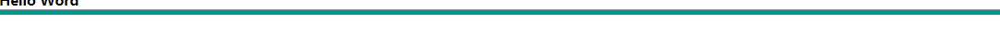
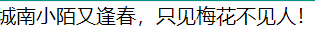

# 一、HTML标签

## 什么是 HTML？

HTML 是用来描述网页的一种语言。

- HTML 指的是超文本标记语言 (**H**yper **T**ext **M**arkup **L**anguage)
- HTML 不是一种编程语言，而是一种*标记语言* (markup language)
- 标记语言是一套*标记标签* (markup tag)
- HTML 使用*标记标签*来描述网页
- ==HTML 标签对大小写不敏感：<P> 等同于 <p>。许多网站都使用大写的 HTML 标签。==

## h1-h6 标题

```html
<h1>Hello Word</h1>
<h2>Hello Word</h2>
<h3>Hello Word</h3>
<h4>Hello Word</h4>
<h5>Hello Word</h5>
<h6>Hello Word</h6>
```


## hr 水平线

```html
<hr/>
```



## p 段落

HTML 段落是通过 <p> 标签进行定义的。

```html
 <p>城南小陌又逢春，只见梅花不见人！</p>
```



## a 超链接

HTML 链接是通过 <a> 标签进行定义的。

```html
<a href="http://baidu.com">百度</a>
```

## img 图片

```html

```

## br标签定义换行

```html
<br> 
```

# 二、HTML属性

HTML 标签可以拥有*属性*。属性提供了有关 HTML 元素的*更多的信息*。属性总是以名称/值对的形式出现，比如：*name="value"*。属性总是在 HTML 元素的*开始标签*中规定。

### 属性例子 1:

```html
<h1> 定义标题的开始。
<h1 align="center"> 此处为居中，拥有关于对齐方式的附加信息。
```

### 属性例子 2:

```html
<body> 定义 HTML 文档的主体。
<body bgcolor="yellow"> 拥有关于背景颜色的附加信息。
```

### 属性例子 3:

<table> 定义 HTML 表格。（您将在稍后的章节学习到更多有关 HTML 表格的内容）

<table border="1"> 拥有关于表格边框的附加信息。

