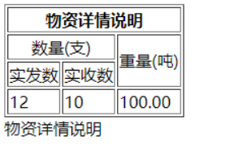

**HTML表格跨行、跨列操作(rowspan、colspan)**

**一般使用元素的colspan属性来实现单元格跨列操作，使用元素的rowspan属性来实现单元格的跨行操作。**

**colspan属性规定单元格可横跨的列数****，所有浏览器都支持colspan属性。其取值为number，如下图所示：**

**例如：**

```html
<table border="1">   
    <tr>     
        <th>星期一</th> 
        <th>星期二</th> 
    </tr>   
    <tr>  
        <td colspan="2">星期天</td>
    </tr> 
</table>               
```

**rowspan属性规定单元格可横跨的列数****，所有浏览器都支持rowspan属性。其取值为number，如下图所示：**

**例如：**

```html
<table border="1">
    <tr>  
    </tr> 
    <tr>  
        <td>星期三</td>
    </tr>
</table>               
```

**总结colspan和rowspan的使用如下：**

```html
<table border="1">
    <tr>     
        <th colspan="3">物资详情说明</th>  
    </tr>  
    <tr> 
        <td colspan="2" align="center">数量(支)</td>  
        <td rowspan="2">重量(吨)</td>  
    </tr> 
    <tr>    
        <td>实发数</td> 
        <td>实收数</td>  
    </tr>  
    <tr>   
        <td>12</td> 
        <td>10</td>
        <td>100.00</td>  
    </tr>
</table>     
<th colspan="3">物资详情说明</th>               
```

