# 一、简介

`JavaScript`是目前web开发中不可缺少的脚本语言，js不需要编译即可运行，运行在客户端，需要通过浏览器来解析执行JavaScript代码。

诞生于1995年，当时的主要目的是验证表单的数据是否合法。

`JavaScript`本来应该叫`Livescript`，但是在发布前夕，想搭上当时超热的`java`顺风车，临时把名字改为了`JavaScript`。（也就是说`js`跟`java`没有关系，当时只是想借助`java`的名气）。

## JavaScript组成

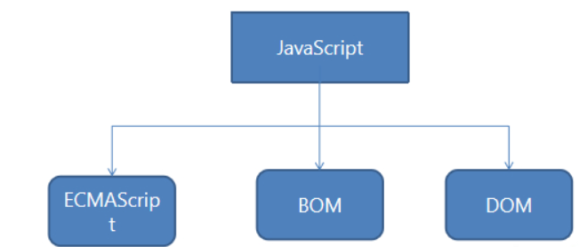

ECMAScript：JavaScript语法核心。

欧洲计算机制造商协会,英文名称是European Computer Manufacturers Association)

DOM：文档对象模型（Document Object Model），提供访问和操作网页内容的方法和接口。document

BOM：浏览器对象模型（Browser Object Model），提供与浏览器交互的方法和接口。Window/location/history

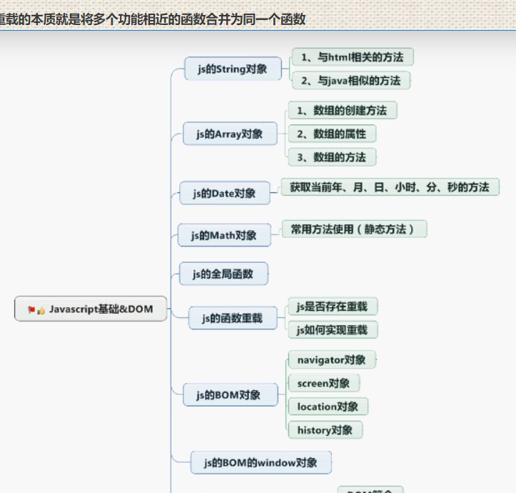

# 二、数据类型

```javascript
数值型：number（凡是数字都是数值型，不区分整数和小数）
字符串：string（凡是引号包裹起来的内容全部都是字符串）
布尔：boolean（true、false）
对象类型：object（特殊取值null）
未定义型：undefined
```

## 变量

定义：就是放数据的、内疗可以存储任意数据

声明变量：

```js
var 变量名称 = 存储的数据;   	(variable 变量)
```

## 变量命名规范

> 1.	只能由字母、数字、_（下划线）、$（美元符号）组成。
> 2.	不能以数字开头。
> 3.	命名中不能出现-（js会理解成减号进行减法的操作），不能和关键字冲突。
>

js是弱类型语言，不重视类型的定义，但js会根据为变量赋值的情况自定判断该变量是何种类型：

```js
数值型：var i = 1;	var d = 2.35;
字符串：var str = "用心学习";
布尔型：var b = true;
```

对比Java:java是强类型的语言，注重类型的定义，Java定义类型如下：

```js
整型：int i = 1;
浮点型：double d = 2.35;
字符串：String str = “用心学习”;
布尔型：boolean b = true;
```

总结：js中变量的定义。只要加一个var就行。java则使用什么类型的变量就要定义什么类型的。

## 检测数据类型

typeof(value); 或者typeof value;     返回这个变量的类型. 
说明 : 同一个变量, 可以进行不同类型的数据赋值.


```js
var a;
alert(typeof a);  // undefined
 
a = 998;
alert(typeof a); // number
 
a = "用心学习";
alert(typeof a); // string
 
a = true;
alert(typeof a); // boolean
```

# 三、字符串

```js
var str = "abcde";
document.write("与HTML相关的".fontcolor("red")+"<hr/>");
document.write("原始字符串："+str);
document.write("<hr/>");
document.write("加粗："+str.bold());
document.write("<hr/>");
document.write("原始字符串加颜色："+str.fontcolor("red"));
document.write("<hr/>");
document.write("原始字符串设置字体大小："+str.fontsize(14));
document.write("<hr/>");
document.write("原始字符串作为超链接使用："+str.link("StringLink.html"));
document.write("<hr/>");
document.write("原始字符串设置上标："+str.sup()+" 原始字符串设置下标："+str.sub());
document.write("<hr/>");
document.write("java相似的方法".fontcolor("red")+"<hr/>");
var str1 = "hello ";
var str2 = "world!";
document.write("原始字符串str1："+str1);
document.write("原始字符串str2："+str2);
document.write("<hr/>");
document.write("连接字符串："+ str1.concat(str2));
document.write("<hr/>");
document.write("返回指定位置字符串的字符(超出索引返回空字符串)："+ str1.charAt(1));
document.write("<hr/>");
document.write("检索字符串的位置(返回字符串的第一个字符位置，不存在返回-1)："+ str1.indexOf("lo"));
document.write("<hr/>");
var str3 = "人*有迷*魂有待*招";
document.write(str3+"<br/>");
var strArray =str3.split("*");
document.write(strArray[0]+"<br/>"+strArray[1]+"<br/>"+strArray[2]+"<br/>"+strArray[3]+"<br/>");
document.write("<hr/>");
document.write("替换字符串(只会替换第一个)："+ str3.replace("*",""));
document.write("<hr/>");
document.write("截取字符串（从哪个位置开始截取，向后截几位）："+ str3.substr(3,5));
document.write("<hr/>");
document.write("截取字符串[3,5)（起始位置，结束为置不包括最后一个）："+ str3.substring(3,5));
```

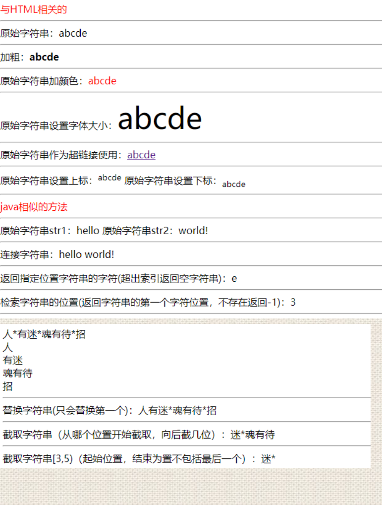

# 四、数组

```js
var arr = [1,2,3];// 1,2,3为元素
var arr1 =new Array(3);// 3是长度
var arr2 = new Array('a','b','c');// 1,2,3为元素
document.write("数组的长度："+arr.length+"<br/>");
document.write("连接数组："+arr.concat(arr2));
document.write("<hr/>");
document.write("数组的打印默认为','隔开："+arr2+"<br/>");
document.write("数组的join方法打印："+arr2.join("-")+"<br/>");
document.write("删除数组最后一个元素并返回该元素(shift()删除第一个并返回)："+arr2.pop()+"<br/>"+"新数组："+arr2+"<br/>");
document.write("<hr/>");
document.write("向数组的末尾添加新的元素并返回新的长度(可以插入数组但数组会作为一个元素，也就是长度只会增一)："+arr2.push('d',6,'f',new Array("aa","bb"))+"<br/>"+"新数组："+arr2+"<br/>");
document.write("颠倒数组的顺序(aa,bb为一个数组属于一个元素)："+arr2.reverse()+"<br/>"+"原数组不变："+arr2+"<br/>");
var arr3 =[22,51,23,35,17,2,66];
document.write("原数组:"+arr3+"<br/>");
function sequence(a,b){
    if (a>b) {
        return 1;
    }else if(a<b){
        return -1;
    }else{
        return 0;
    }
}
document.write("对数组数字排序："+arr3.sort(sequence)+"原数组改变："+arr3+"<br/>");
```

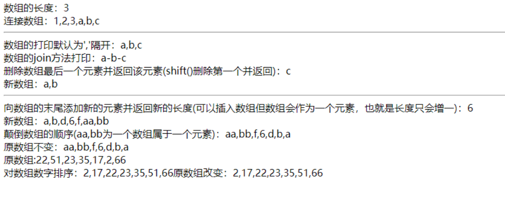

# 五、数据强转

## JavaScript parseInt() 函数详解

parseInt()函数用于将字符串转换为整数并返回。该函数可以将字符串视作指定的进制形式表示。

该函数属于Global对象，所有主流浏览器均支持该函数。

### 语法

```js
parseInt( numString [, radix ] )
```

### 参数

| 参数      | 描述                               |
| --------- | ---------------------------------- |
| numString | String类型需要转换为整数的字符串。 |
| radix     | 可选/Number类型指定的进制基数。    |

参数radix可以是一个介于 [2, 36] 之间的数值。例如：参数radix为2，则将numString视作二进制；参数radix为8，则视作八进制；参数radix为16，则视作十六进制。

如果没有提供radix参数，则parseInt()函数将会根据参数numString的前缀来决定转换的进制基数。如果numString的前缀是0x，则转换为十六进制；如果前缀是0，则转换为八进制；其他情况均转换为十进制。

### 返回值

parseInt()函数的返回值为Number类型，返回转换后的整数。

如果指定的字符串中包含非数字字符，只要字符串开头的一部分符合整数的转换规则，则parseInt()函数会将这一部分字符串转化为整数(从字符串开头，直到遇到非数字字符为止)。如果字符串以非数字字符开头，则返回NaN。

### 示例&说明

```js
var str = "12.354";
var num = parseInt( str );
document.writeln( num ); // 12

str = "12";
num = parseInt( str );
document.writeln( num ); // 12

str = "23.52abc";
num = parseInt( str );
document.writeln( num ); // 23

str = "ab12张三";
num = parseInt( str );
document.writeln( num ); // NaN

// 十六进制
str = "0xff";
num = parseInt( str );
document.writeln( num ); // 255

// 八进制
str = "017";
num = parseInt( str );
document.writeln( num ); // 17

// 虽然是以0开头，但是八进制没有数字8，则采用十进制
str = "078";
num = parseInt( str );
document.writeln( num ); // 78

str = "111";
// 将该字符串视作二进制
num = parseInt( str, 2 );
document.writeln( num ); // 7
```

# 六、Date时间

## java和js的区别

### java中获取当前时间是

```java
Date date = new Date(); 
System.out.println(date);              
```


java中转换为本地使用格式（格式化）

可以通过`toLocaleString`()该方法过时不推荐使用，建议用`SimpleDateFormat`

```java
Date date = new Date(); 
System.out.println(date.toLocaleString());//该方法不推荐使用              
```


### js中获取当前时间是

```js
  var date = new Date(); 
  document.write(date);              
```


js转换为本地格式

```js
var date = new Date(); 
document.write(date.toLocaleString());              
```

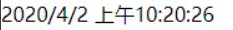

```js
var date = new Date();
document.write("当前时间："+date.toLocaleString());
document.write("<hr/>");
document.write("获取四位当前年份："+date.getFullYear());
document.write("<hr/>");
document.write("获取当前月份注意加一[0,11])："+date.getMonth()+1);
document.write("<hr/>");
document.write("获取当前星期[0,6](星期日返回0,星期一到六返回1-6)："+date.getDay());
document.write("<hr/>");
document.write("获取当前的天[1,31]："+date.getDate());
document.write("<hr/>");
document.write("获取当前的小时[0,23]："+date.getHours());
document.write("<hr/>");
document.write("获取当前的分钟[0,59]："+date.getMinutes());
document.write("<hr/>");
document.write("获取当前的秒[0,59]："+date.getSeconds());
document.write("<hr/>");
document.write("获取从1970年1月1日至今的毫秒数："+date.getTime());
```

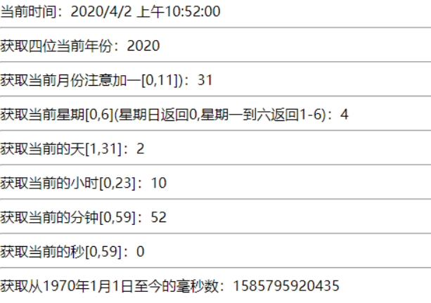

# 七、Math方法

```js
document.write("<hr color='red'/>");
document.write("Math的常用方法：<br/>".fontcolor("red").fontsize(5));
var num = 15.0;
document.write("原始数："+num);
document.write("<hr/>");
document.write("向上取整(整数不变)："+Math.ceil(num));
document.write("<hr/>");
document.write("向下取整(整数不变)："+Math.floor(num));
document.write("<hr/>");
document.write("四舍五入："+Math.round(num));
document.write("<hr/>");
document.write("得到一个随机数[0,1]："+Math.random()+"<br/>");
document.write("得到一个随机整数[1,100]："+Math.ceil(Math.random()*99+1)+"<br/>");
document.write("得到一个随机整数[22,37]："+Math.ceil(Math.random()*15+22));
document.write("<hr/>");
document.write("获得传入数组[66,88,54,36]的最大值："+Math.max(66,88,54,36));
document.write("获得传入数组[66,88,54,36]的最小值："+Math.min(66,88,54,36));
document.write("<hr/>");
document.write("返回x的y次幂 ："+Math.pow(2,3));
document.write("<hr color='red'/>");
document.write("<hr color='red'/>");
document.write("Math的常用属性：<br/>".fontcolor("red").fontsize(5));
document.write("常量E,自然对数的底数 ："+Math.E);
document.write("<hr/>");
document.write("常量PI,圆周率 ："+Math.PI);
document.write("<hr/>");
document.write("常量LN2："+Math.LN2+"<br/>  常量LN10,自然对数 ："+Math.LN10);
document.write("<hr/>");
document.write("常量LOG2E："+Math.LOG2E+"<br/> 常量LOG10E,自然对数 ："+Math.LOG10E);
```

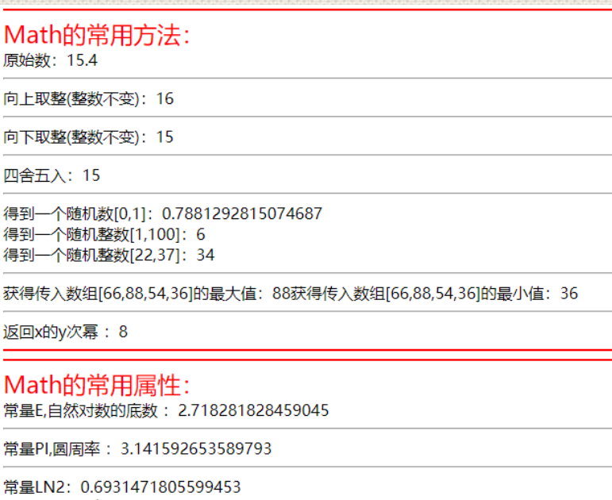

# 八、全局函数

不属于任何一个对象，可以直接调用使用

## eval()

eval是Javascript内置函数，用于计算字符串表达式的值。也可以动态执行js代码。例如eval("2+3") 返回的是5。

```js
var str = "alert('hello world!')"; eval(str);//传入字符串，可以直接执行字符串类型的代码      
```


## encodeURI和decodeURI

这两个是编解码函数

 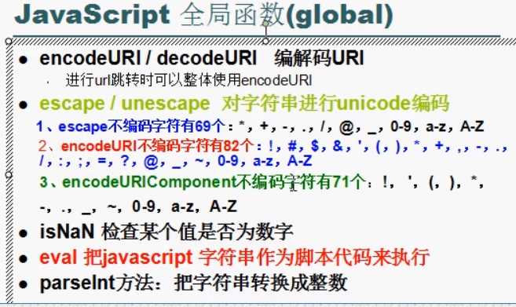

```js
var str ="测试编码和解码daniel123456$#@"
document.write("原字符串："+str);
document.write("<hr/>");
document.write("原字符串进行编码：");
var encodeURI1 =encodeURI(str);
document.write("编码后："+encodeURI1);
document.write("<hr/>");
document.write("对编码后的字符串进行解码：");
var decodeURI1 =decodeURI(encodeURI1);
document.write("解码后："+decodeURI1);
```


## isNaN

判断当前字符串是否不是数字，如果是就返回ture

```js
var num = 123;
var str1 ="125";
var str2 ="js";
document.write("判断不是数字："+isNaN(num));//false
document.write("<br/>判断不是数字："+isNaN(str1));//false
document.write("<br/>判断不是数字："+isNaN(str2));//true
```

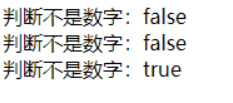

## 类型转换

```js
var num = "25.3";
document.write("将当前字符串转换为浮点型："+parseFloat(num));
document.write("<br/>将当前字符串转换为整型："+parseInt(num));
document.write("<br/>将当前字符串加上1："+(num+1));
document.write("<br/>将当前字符串转整型加上1："+(parseInt(num)+1));
```

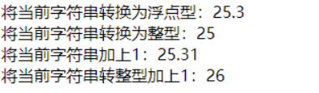

# 九、重载

js重载的实现

==js无法直接实现方法的重载，如果直接写方法重载会依照就近原则调用函数==

js没有重载，但可以通过其他方式进行实现重载

```js
function add(a,b,c) {
    for (var num of arguments) {
        document.write(num+" ")
    }
    document.write("<br/>")
}
add(1,3,6);
add(8,9);
```


js中每个方法都存在一个隐藏的数组，用于保存用户传入的参数，数组名为arguments

==因此可以通过arguments数组的length属性来实现重载==

```js
function Test(a,b,c) {
    if (arguments.length==1){
        document.write("我只传入了1个参数，所以我执行了")
    }else if (arguments.length==2){
        document.write("我只传入了2个参数，所以我执行了")
    }else if (arguments.length==3){
        document.write("我只传入了3个参数，所以我执行了")
    }
}
Test(1);
document.write("<hr/>");
Test(2,3);
document.write("<hr/>");
Test(4,5,6);
document.write("<hr/>");
```

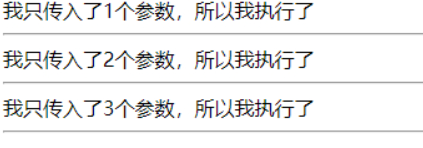

# 十、BOM对象

## 一、什么是BOM？

BOM：Browser Object Model 是浏览器对象模型，浏览器对象模型提供了独立与内容的、可以与浏览器窗口进行互动的对象结构，BOM由多个对象构成，其中代表浏览器窗口的window对象是BOM的顶层对象，其他对象都是该对象的子对象。

navigator对象

该对象自动创建用于获取客户机浏览器的信息

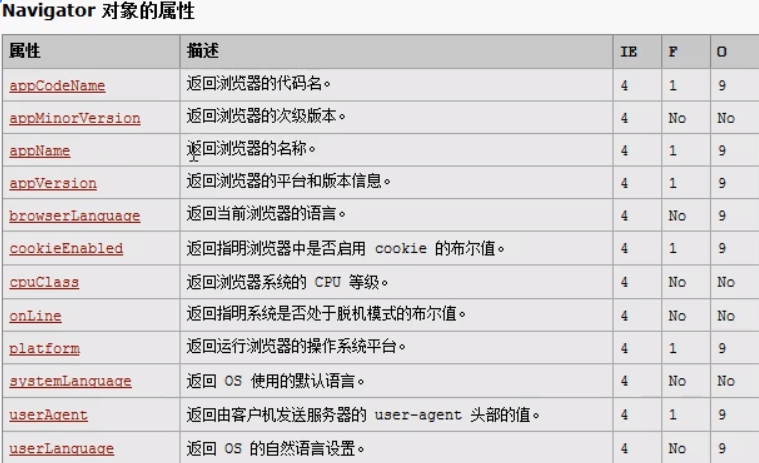

```js
document.write("<hr/>");
document.write("浏览器名称："+navigator.appName);
document.write("<hr/>");
document.write("浏览器代码名："+navigator.appCodeName);
document.write("<hr/>");
document.write("浏览器版本："+navigator.appVersion);
```

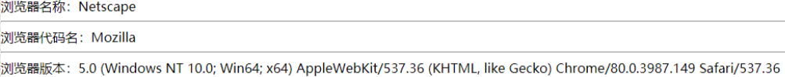

## screen对象

该对象自动创建返回用户的屏幕信息

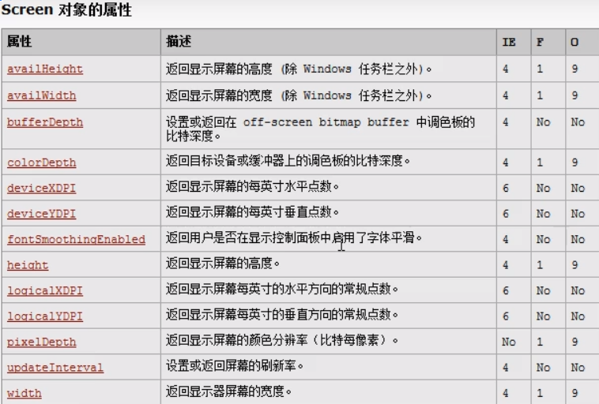

```js
document.write("<hr/>");
document.write("返回屏幕的高度："+screen.height);
document.write("<hr/>");
document.write("返回屏幕的宽度："+screen.width);
```

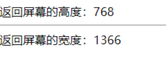

## location

该对象自动创建返回当前URL信息

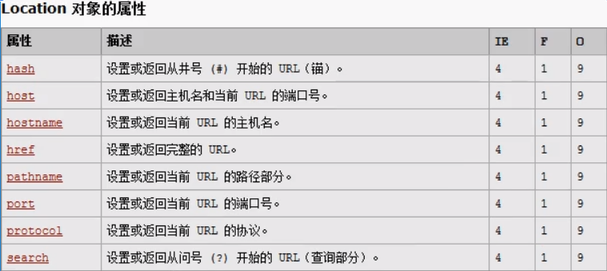

```js
document.write("<hr/>");
document.write("返回当前请求的URL信息："+location.href);
document.write("<hr/>");
document.write("返回主机名和端口："+location.host);
```

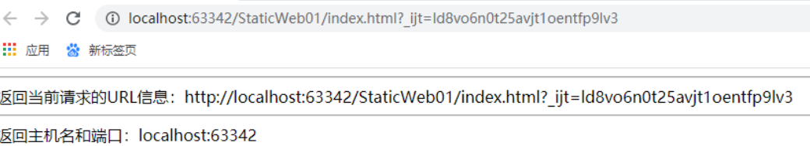

## 设置URL

例子：我点击按钮通过onclick执行方法进行跳转

```html
<body>
    <input type="button" value="百度" onclick="BaiDu()">
</body>
```

```js
function BaiDu() {
    location.href = "http://www.baidu.com";
}
```

## history对象

返回历史URL，由用户在当前窗口已经访问的url

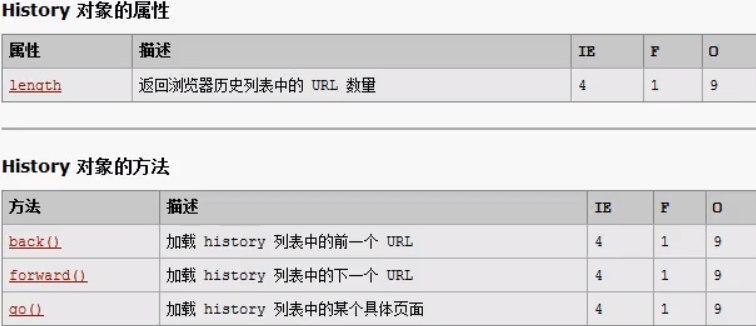

```js
function backFun() {
    history.back();//回到上一个已访问页面
}
function nextFun() {
    history.forward();//跳转下一个已访问页面
}
function goFun() {
    history.go(1)//跳转到history的URL历史记录通过数字访问
}
```

# 十一、windows对象

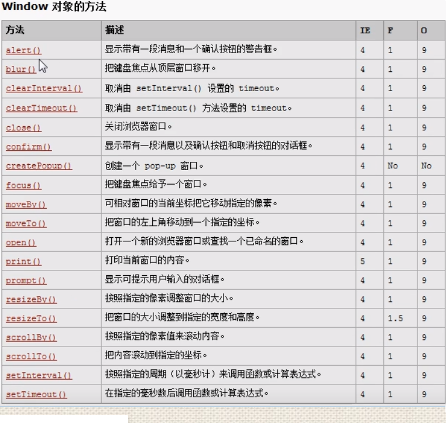

```js
document.write("<hr/>");
window.alert("hello world!");//一个确认按钮的警示框
var bool =window.confirm("hello world!");//含有确认和取消按钮的对话框，返回值是boolean
window.alert(bool);
var name =window.prompt("请输入姓名：","默认值");//返回用户输入的内容，若未输入则返回默认值
window.alert(name);
window.close();//关闭窗口
```

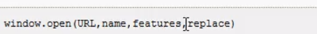

```html
<input type="button" value="百度" onclick="openFun()">
```

```js
function openFun() {
    //window.open("URL","窗口名","窗口的特征比如高和宽")
    window.open("http://www.baidu.com","","height=500px,width=500px");
}
```

## 定时器

### 重复定时器

setInterval() 设置定时器和clearInterval() 清除定时器

```html
 <input type="button" value="取消重复定时器" onclick="clearInt()"> 
```

```js
// setInterval("js代码",毫秒数); 
var idInt =setInterval("alert('hello world!')",2000);//每隔2000毫秒执行一次js代码（重复） 
function clearInt() {   
    clearInterval(idInt);
}        
```

### 一次性定时器

setTimeout() 设置定时器和clearTimeout() 清除定时器

```html
<input type="button" value="取消一次性定时器" onclick="clearTime()">              
```

```js
// setTimeout("js代码",毫秒数);
var idTime= setTimeout("alert('hello world!')",2000);//2000毫秒后执行一次（不重复） 
function clearTime() {    
    clearTimeout(idTime); 
}              
```

# 十二、异常

```js
try {
    alert(eval(prompt("请输入数字：",'')));
    document.writeln('没有例外！');
}catch (err) {
    document.writeln('捕获例外！');
    document.writeln('异常名称：'+err.name);
    document.writeln('异常信息：'+err.message);
}finally {
    document.writeln("开始执行finally")
}
```

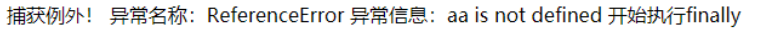

# 十三、事件

## onchange事件

改变内容（一般和select标签配合使用）

onchange 事件常用于输入字段的验证。

下面的例子展示了如何使用 onchange。当用户改变输入字段的内容时，将调用 upperCase() 函数。

```html
<script type='text/javascript'>
function myFunction(){
	var x=document.getElementById("fname");
	x.value=x.value.toUpperCase();
}
</script>
</head>
<body>
输入你的名字: <input type="text" id="fname" onchange="myFunction()">
<p>当你离开输入框后，函数将被触发，将小写字母转为大写字母。</p>
</body>
```

## onfocus事件

得到焦点 onblur事件：失去焦点

```html
<input type="text" id="tex" value="请输入" onfocus="focus1();" onblur="blur1();">
```

```js
var tex = document.getElementById('tex');
function focus1() {//得到焦点
    tex.value ="";
}
function blur1() {//失去焦点
    tex.value ="请输入"
}
```


## onload 事件

当页面载入完毕后执行Javascript代码：

```html
<body onload="myFunction()">     
```

定义和用法

onload 事件会在页面或图像加载完成后立即发生。

onload 通常用于  元素，在页面完全载入后(包括图片、css文件等等。)执行脚本代码。

语法

在 HTML 中:

```html
<body onload="SomeJavaScriptCode">              
```

在 JavaScript 中: 

```js
window.onload=function(){SomeJavaScriptCode};              
```

## onunload 事件

当用户进入或离开页面时，会触发 onload 和 onunload 事件。

onload 事件可用于检查访客的浏览器类型和版本，以便基于这些信息来加载不同版本的网页。

onload 和 onunload 事件可用于处理 cookies。

## onmouseover 和 onmouseout 事件

onmouseover 和 onmouseout 事件可用于在鼠标指针移动到或离开元素时触发函数。

## onmousedown、onmouseup 以及 onclick 事件

onmousedown、onmouseup 以及 onclick 事件是鼠标点击的全部过程。首先当某个鼠标按钮被点击时，触发 onmousedown 事件，然后，当鼠标按钮被松开时，会触发 onmouseup 事件，最后，当鼠标点击完成时，触发 onclick 事件。

# 十四、DOM

## 简介

document object model 文档对象模型

> 文档：超文本文档（超文本标记文档）html，xml
>
> 对象：属性和方法
>
> 模型：使用属性和方法来操作标记文档进行操作

可以使用dom里面提供的对象，使用这些对象的属性和方法来操作标记文档

想要对标记文本进行操作，首先要将标记文本的所有内容封装成对象

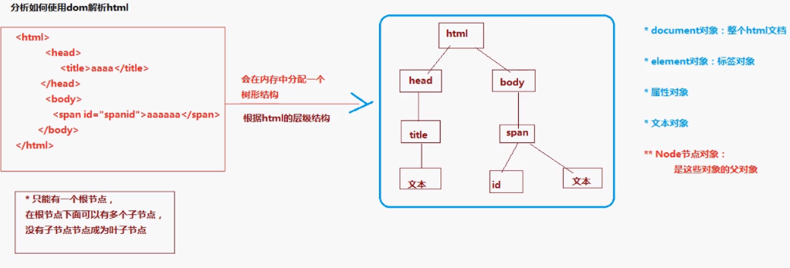

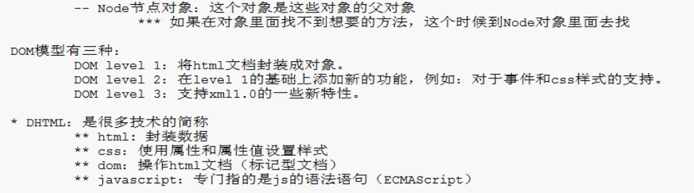

## document对象

每个载入浏览器的HTML文档都会生成一个document对象

常用方法      

```html
<body>
    <input type="text" name="name1" id="id1" value="文本框1"><br/>
    <input type="text" name="name1" id="id2" value="文本框2"><br/>
    <input type="text" name="name1" id="id3" value="文本框3"><br/>
</body>
```

### getElementById获取     

```
var id1=document.getElementById("id1");
alert(id1.value);       
```

### getElementsByName获取

注意有些标签没有name属性该方法将不起作用

```js
var names = document.getElementsByName("name1");
// 得到input的属性值
for (var i = 0; i < names.length; i++) {
    alert(names[i].value);
}
```

### getElementsByTagName获取

```js
var tagnames = document.getElementsByTagName("input");
for (var tagname of tagnames) {
    alert(tagname.value);
}
```

### innerHTML            

```html
<p id="he">替换前</p>
<button onclick="funHello()">点击</button>
```

```js
function funHello() {
    const he = document.getElementById("he");
    he.innerHTML ="Hello World";
}
```

### console

```js
var he = document.getElementById("he");
console.dir(he);//打印返回元素的对象，更好的查看里面的元素
console.log(he);//在控制台打印输出标签
console.log(typeof he);//在控制台打印元素类型
```

​         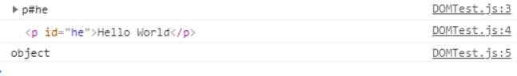

### 通过元素获得标签

```html
<ur>
    <li class="li_1">父亲写的散文诗</li>
    <li class="li_1">父亲写的散文诗</li>
    <li class="li_1">父亲写的散文诗</li>
    <li class="li_1">父亲写的散文诗</li>
</ur>
<ur id="nav">
    <li>绅士</li>
    <li>绅士</li>
    <li>绅士</li>
    <li>绅士</li>
</ur>
```

```js
var nav = document.getElementById("nav");
var li=nav.getElementsByTagName("li");
for (var i = 0; i <li.length ; i++) {
    console.log(li[i]);
}
```

​    ![0](data:image/jpeg;base64,/9j/4AAQSkZJRgABAQAAAQABAAD/4gIoSUNDX1BST0ZJTEUAAQEAAAIYAAAAAAIQAABtbnRyUkdCIFhZWiAAAAAAAAAAAAAAAABhY3NwAAAAAAAAAAAAAAAAAAAAAAAAAAAAAAAAAAAAAQAA9tYAAQAAAADTLQAAAAAAAAAAAAAAAAAAAAAAAAAAAAAAAAAAAAAAAAAAAAAAAAAAAAAAAAAAAAAAAAAAAAlkZXNjAAAA8AAAAHRyWFlaAAABZAAAABRnWFlaAAABeAAAABRiWFlaAAABjAAAABRyVFJDAAABoAAAAChnVFJDAAABoAAAAChiVFJDAAABoAAAACh3dHB0AAAByAAAABRjcHJ0AAAB3AAAADxtbHVjAAAAAAAAAAEAAAAMZW5VUwAAAFgAAAAcAHMAUgBHAEIAAAAAAAAAAAAAAAAAAAAAAAAAAAAAAAAAAAAAAAAAAAAAAAAAAAAAAAAAAAAAAAAAAAAAAAAAAAAAAAAAAAAAAAAAAAAAAAAAAAAAAAAAAFhZWiAAAAAAAABvogAAOPUAAAOQWFlaIAAAAAAAAGKZAAC3hQAAGNpYWVogAAAAAAAAJKAAAA+EAAC2z3BhcmEAAAAAAAQAAAACZmYAAPKnAAANWQAAE9AAAApbAAAAAAAAAABYWVogAAAAAAAA9tYAAQAAAADTLW1sdWMAAAAAAAAAAQAAAAxlblVTAAAAIAAAABwARwBvAG8AZwBsAGUAIABJAG4AYwAuACAAMgAwADEANv/bAEMAAQEBAQEBAQEBAQEBAQEBAQEBAQEBAQEBAQEBAQEBAQEBAQEBAQEBAQEBAQEBAQEBAQEBAQEBAQEBAQEBAQEBAf/bAEMBAQEBAQEBAQEBAQEBAQEBAQEBAQEBAQEBAQEBAQEBAQEBAQEBAQEBAQEBAQEBAQEBAQEBAQEBAQEBAQEBAQEBAf/AABEIAGsCHQMBEQACEQEDEQH/xAAeAAEAAgMBAQEBAQAAAAAAAAAABgcEBQgJAgoBA//EAEMQAAEDAwICBwUFBgUEAgMAAAUDBAYAAgcBCBVVFBZUlJbT1RNTk5XUCRESFxhWWJeY1tglUmWk5CEiIyQxQTV0tP/EABwBAQACAwEBAQAAAAAAAAAAAAADBQEEBgIHCP/EAEMRAAICAQIDBwIDBgIHCAMAAAECAAMEBRESFVEGEyExlJXUFCIyQaNCY2Si4uMHIxYkM0NxscEIUmFyc5Ky0jSh8P/aAAwDAQACEQMRAD8A/eL1AjHZyviaT+sVZ83zeuJ7bp3xJo8uxemR63N+RHUCMdnK+JpP6xTm+b1xPbdO+JHLsXpketzfkR1AjHZyviaT+sU5vm9cT23TviRy7F6ZHrc35EdQIx2cr4mk/rFOb5vXE9t074kcuxemR63N+RHUCMdnK+JpP6xTm+b1xPbdO+JHLsXpketzfkR1AjHZyviaT+sU5vm9cT23TviRy7F6ZHrc35EdQIx2cr4mk/rFOb5vXE9t074kcuxemR63N+RHUCMdnK+JpP6xTm+b1xPbdO+JHLsXpketzfkR1AjHZyviaT+sU5vm9cT23TviRy7F6ZHrc35EdQIx2cr4mk/rFOb5vXE9t074kcuxemR63N+RHUCMdnK+JpP6xTm+b1xPbdO+JHLsXpketzfkR1AjHZyviaT+sU5vm9cT23TviRy7F6ZHrc35EdQIx2cr4mk/rFOb5vXE9t074kcuxemR63N+RHUCMdnK+JpP6xTm+b1xPbdO+JHLsXpketzfkR1AjHZyviaT+sU5vm9cT23TviRy7F6ZHrc35EdQIx2cr4mk/rFOb5vXE9t074kcuxemR63N+RHUCMdnK+JpP6xTm+b1xPbdO+JHLsXpketzfkR1AjHZyviaT+sU5vm9cT23TviRy7F6ZHrc35EdQIx2cr4mk/rFOb5vXE9t074kcuxemR63N+RHUCMdnK+JpP6xTm+b1xPbdO+JHLsXpketzfkR1AjHZyviaT+sU5vm9cT23TviRy7F6ZHrc35EdQIx2cr4mk/rFOb5vXE9t074kcuxemR63N+RHUCMdnK+JpP6xTm+b1xPbdO+JHLsXpketzfkR1AjHZyviaT+sU5vm9cT23TviRy7F6ZHrc35EdQIx2cr4mk/rFOb5vXE9t074kcuxemR63N+RHUCMdnK+JpP6xTm+b1xPbdO+JHLsXpketzfkR1AjHZyviaT+sU5vm9cT23TviRy7F6ZHrc35EdQIx2cr4mk/rFOb5vXE9t074kcuxemR63N+RHUCMdnK+JpP6xTm+b1xPbdO+JHLsXpketzfkR1AjHZyviaT+sU5vm9cT23TviRy7F6ZHrc35EdQIx2cr4mk/rFOb5vXE9t074kcuxemR63N+RHUCMdnK+JpP6xTm+b1xPbdO+JHLsXpketzfkR1AjHZyviaT+sU5vm9cT23TviRy7F6ZHrc35EdQIx2cr4mk/rFOb5vXE9t074kcuxemR63N+RHUCMdnK+JpP6xTm+b1xPbdO+JHLsXpketzfkR1AjHZyviaT+sU5vm9cT23TviRy7F6ZHrc35EdQIx2cr4mk/rFOb5vXE9t074kcuxemR63N+RHUCMdnK+JpP6xTm+b1xPbdO+JHLsXpketzfkR1AjHZyviaT+sU5vm9cT23TviRy7F6ZHrc35EdQIx2cr4mk/rFOb5vXE9t074kcuxemR63N+RHUCMdnK+JpP6xTm+b1xPbdO+JHLsXpketzfkR1AjHZyviaT+sU5vm9cT23TviRy7F6ZHrc35EdQIx2cr4mk/rFOb5vXE9t074kcuxemR63N+RHUCMdnK+JpP6xTm+b1xPbdO+JHLsXpketzfkR1AjHZyviaT+sU5vm9cT23TviRy7F6ZHrc35EdQIx2cr4mk/rFOb5vXE9t074kcuxemR63N+RHUCMdnK+JpP6xTm+b1xPbdO+JHLsXpketzfkR1AjHZyviaT+sU5vm9cT23TviRy7F6ZHrc35EdQIx2cr4mk/rFOb5vXE9t074kcuxemR63N+RHUCMdnK+JpP6xTm+b1xPbdO+JHLsXpketzfkR1AjHZyviaT+sU5vm9cT23TviRy7F6ZHrc35EdQIx2cr4mk/rFOb5vXE9t074kcuxemR63N+RHUCMdnK+JpP6xTm+b1xPbdO+JHLsXpketzfkR1AjHZyviaT+sU5vm9cT23TviRy7F6ZHrc35EdQIx2cr4mk/rFOb5vXE9t074kcuxemR63N+RHUCMdnK+JpP6xTm+b1xPbdO+JHLsXpketzfkR1AjHZyviaT+sU5vm9cT23TviRy7F6ZHrc35EdQIx2cr4mk/rFOb5vXE9t074kcuxemR63N+RHUCMdnK+JpP6xTm+b1xPbdO+JHLsXpketzfkR1AjHZyviaT+sU5vm9cT23TviRy7F6ZHrc35EdQIx2cr4mk/rFOb5vXE9t074kcuxemR63N+RHUCMdnK+JpP6xTm+b1xPbdO+JHLsXpketzfkR1AjHZyviaT+sU5vm9cT23TviRy7F6ZHrc35EdQIx2cr4mk/rFOb5vXE9t074kcuxemR63N+RHUCMdnK+JpP6xTm+b1xPbdO+JHLsXpketzfkR1AjHZyviaT+sU5vm9cT23TviRy7F6ZHrc35EdQIx2cr4mk/rFOb5vXE9t074kcuxemR63N+RHUCMdnK+JpP6xTm+b1xPbdO+JHLsXpketzfkSZ1WTeikRSJDZtOQ0EFpPidrx+/IObRsejYdGx7I5SaVsvUQDAB1yqPS3illii7hZVVuPFsEXRYw9HiWT1839ojOdhsABuzHwVV/MsenQeZPgASQJJVU1rbDYADid2OyVr+bOfHYfkAAWZiFUMxANLZPnWZooX2/mBy2OwEamc/jsFylAzcWkEwlPSJc3cXMloZkoTkCIAgCkdXZLJkrCuNpq3P8AtbbWLgNYh0h3b6bjafk0aql9eY2Vj4VuXhZFOVTTjp9OV7xMnEswr7cgWhhwNVm4hq2JZbd9l6HRsLSM3F16vKq1F87D0y/UNNzMbOxsfDr+kKd7Xm6fbpmVfli8WDu2o1LANBUl1v4tl+5BkWYNt1ONca6Mp8AgxTGmSjd76+P4oJ45yLIBjuDat0EpJZkVXMcUkEBaPXl2o9TGLWHylGTqX3SZV2CbN7/VOFjNoGdm8WHdl152DUE77UK83DpdcriY0fRDTcinLZVHGM9smg0DagLazSTG03CfslqmqcenZGfTqml0BBk6vVqem41qZ4ZjinTRouZjai6IO8Gqvm4jYgAxQmQzDV52z1Kcb4u3BOg4eGxzMMEw/l7IWG2uTJSKEYqyC8hEIMyKPPzE1Nm4AECgWZNmxsyWyOymIqQ4N08y9kTSL2t5hdVJUGNZ3Zq2dFsKqeNOJgCOEBiSR+AgMGOw24vtnNW1MuO19RFiqh4twF7qzY7LaC3ghI+2ziCMPAlWBUeNmft4O5vH0OwhhyMyTJeIxsbxp9l7kFB9knbRuz3Tbo5IxyvvSP45Tbbl8kYSkWLgcDyWZxjh+IO874GkcSeyHPGRJvmbbhieeSwk4Ey9ztV01MzuQrktlL9ttVVQ4KQ3+UrhiyhnPd2A7VqqWOoG4la9tihEBZdlx2+6u2yw8VpX/MZCoViqjjQjd2L1qx8DPRPb1vNzxkDDcamJTalmTPBl7Ms/RUpN8HRnC+BYjd+Ue5bMuEwrUnh7d7uzgubsczIhF8bApVK4dI2pvq0Tkl4Nc5aZHmAILXsprVyotSscNZCuXsP31o52empkZQWIDDbcDfbYgmZLXZATW7ndwSgRB9tjoN1ttV1OygkHfYnbffcDG+z73I5Zm217aFpk3bzuNYsCu2DD5uYbocmT3bIagsgcNcLBTxDJchestzkpzk9bT982ufNyh/F1kp6dIWpCeC41ZafeCc5FSi23gsrJ71wtSLaGG7kBAO6Cbr5bBtvDZSfDfOO1jpSvdWksiDjJRuJio2OwsNhLny+3iJI3A8du8odPtJcPNSXUK6AwhrrorHJIcXtYrSgU3RWWfyZEOsim4ERm62xNQGQKOEnhtl7YpoNYi7hrwpE1RDJWp47GIUogLEMSAqbj8Tk+BUDwOw3J3A3noZXrpU97e5CmqsFirsQqVAjfjsJOzKoIVtl4i24XmubZkzcptbN7goQ4xtFSDNI7koEEm0AlsvbGcOtL3zyLiHqInKGP3gWcSuOWCja0l0clA0eVJXjdYYb6L01fo8XTdLGvVaPlLnZCN3WFbbi5mNjNVqTBVvsU2YOYtuLj3GyoUcNdtwQP9TVxcA7LB0XQh2ro7O566pl1uaNMvvwdRw8J6NacVplXIbtK1FL8DEyTdQuLw035IqFv1tHF3azvMuR5jGMk7bI0HZT0RGp1krUbLJiAj+KJFCSCWsHmbxhjiW6yvIwHJMWuNkGbaRD5ZjyBTPRsrGrAphyLZml1tNTTMLGvwtbvtbEsvxcHvMfGuu1CnKQ/VYyvm4/0+Fdg390jNS+Pm5eLxC821rY1QE0NE0zCytM7UZVz6fdlafpfe4eFkZOr42dURn4KWanh/R6ZkaZliit3xrMPUtQweIZRvpW16FEtR7kNIDNW0Tlgzq+wkKzRpBJVe+tdBJQVVQuvdRl2pq1a9XpXYsmrcKEPVHCEjY/gWBkXhFEmIGUwr4k41PEV34122ZR/3vM8S9SPwnzAGxPNikvUbK24ygJtr22atd/BwNzx1+P3MNih3DqF4WayKjkMUiKRFIikRSIpEUiKRFIikRSIpEUiKRFIikRSIpEUiKRFIikRSIpEUiKRFIikRSIpEUiKRFIikRSIpEUiKROad3Cj7TCRJoPNyWO3mJ3hyOuysPlMjhUkSESTMEFAm24uVREoFkoNV+HIvmCj4KWHv00HKuiDpK678WiJxzooY/N4ntfbZUy1rgfTPEXi18ptzFkBxkdiRc4GkmUy+E089LyVfMFvt5WJj59w51n2s1ZipBfC2h1nHFGwhJEhsIe5xlOU8gQDGeU57M4bjsdJMNiypDJj0gSawCXz+ThCeUiB0mfTVmE/woRiruEgpYQ1L5FJ2R8v002YOOSTpdElEChiE7yBseOGck5/dKZE2+yaWzhoK3N7lI3G5PKscgcONgJZ9ERGV2Ef0u6QTMLnWto3RnLnRF47lqR9w4vXvRLdw7uH3UZSyrIF0sEJI4ETkmWYeNOPPy2CPQZPGxc/GxT9/Lh+5WazGSu5XIo3cPfRAhtlxevD7T1q7qUGW8c1XlCJGlsu7kpbt33KDJLMobjDcVAsYOJaRiy23zIUYUxkGKRmUPtEGElG7lpTGMqPytoAq2h2WMXZGbA42ZHXLSGI3HR5KHsUTqrFcok0JwkKm24nLeKiDVEECNOcgjY4QxFERkfJChFjDrG7nOWsmpuyij9zd0mTKScSyKqvmqSIRmtpqo6RKq3ug5oZxUoUYkcVFMYgy0DPzCBziAZCOmpW9EZHiZQA6jc+gedcXaQ/UY9btSCdr+LzRo+dtkdHzZwMvdDHSJu5FlnL8Z3JhohK7AMHwbIyAKMwEs4xFJ569yjKyUcIFCIvTLERy+gLwuQGFENGLUblPCiYSTJMrEIlOTxo2qJjKJa8cOS+WSrOkSeznHDcfHyQILC1MYE0iuU4AibhA4i8XyiJk7Q/GRUu1MvFzsNZqgXgd7Frw7sqLIaLOE1kTgBxLZdDcEziN6SbN8uEr75JXhwiTDzuWHswXwUhK1mYuIRiflT6MgijiVH9AkBYSNlJ4shA2krVKCZBDGgtAsKROndlRmdu4Tk2MTovxpbHWaJZCgKt0ylWTFQwVuHjJxWGuMpze6+W5NdwM8dNw15NJHroZJOgayD9Fqu0uZt0TsmkRSIpEUiKRFIkflEWAzMG+jklHpkxBC1PRdveosgqks3WTcs3rF41UQejiY92ki9Gk2DhsQGvkEHrFyg6QSVs9KzIwZTsR/8AseRBHkQR4EHwI8D4T3XY9bh0OzL5HwIII2IIO4ZWBIZSCGBIIIJE5/y5tsNZWZ43ZN9yefMbJ40fDDbBaDs9vxV5I5ME110DSiUvMq4FyY5dlhyajhLREUqGDEOlLLGBJF3oi4SudL1irTBlhtG0vUTl1tS7Zz6uhrosG1tNQ07VdPULYQpZrFstUqBXYilgek0LtHTog1AP2c0LWG1CmzGsfVLO0NZpxbgBdj466Nr+kVrXaQrM9qXXoUAptrUsrZMu27HJZmGB5g03G5yjiuPmSw4VAQIvbwpBSDIraGtlqJhSQ4CPzxTrraBHaG1B06GqjfZqaw9SLaq3665xtZqx9Ny9O5LpV4zGD2Zd1msjLRq+8OOahTq9OIPpTa/dB8SwPuPqfqNhM4faWjD0XUNG/wBGdByV1KxbbtQyLe0gz63pN5w2pGN2hx9PH0JyLe4FmBaLdx9aMvYSYyfDYY5HMts9U47J5NlSJymJuyOYYohk+G2hjol8NYQyRQBAlDm8jxMzuea2nsdMjsa0mA9UokWkSZow7kOlP3p3rHiqoQQKzwHcHcsG+4hz+TkHh8NhsAJzVtjWVirZFRVICBSULEEF7FLbuzb/AHEt+H7F4VAA87p39k/AzUOiScalJmOTkUZ2njjYjEMtmmz/AAEzgeFd6Uh3S5AbwPDG2UjGhoszqNyplcLhp5PCeR5pBDLDHMmRyowy7+YGd5bOuWwY7gFSLSC4W6ziekVLxPaCSN0QvwhVYcQ4ODhrGm2MpA2JBBr3Ck1JwpabG4Ur2AP3ME4ixB4TxcXE56vj+Kcq7W8bRbFe0+Bw3L8csmWaptIyG5vdBkmHS4WTyvlWRZeXSbTIXt33CyPJntZHP5czWNzsiPlzYYJAOJDJMiSMwdkCERdLWL2syHhRQKqlYEIgT8JsrC+CjwUEbk7BQAJIFatQtahhu5PeWMCCzFvMI5bxY+LeOwG5YkmabZBB90eGMO4VwBm3HuAhMUwjgLHGKx+Q8V5+yJkWQy+Q41i0ThTR48x7LdsmJBsYDHxoosccOEMiyZ8FfJjgiY40g+cnRub2qd3sRrCXsZyr1qoAYlvxC1ySCQPwjfxO48jikWIqI6oAiKvErsxJUAfhNagAgE/iO3l4+cuiU4HEl4RN8exw+TikVyIRY3SMEmnoTDso+9Jpr5BBQ9nc4YrRTTIQe8iJfqs3jgYDdEnB4KDbk1XdzzZws44mXTltUt1uMHajduDhyAjfTXWfa/ejGu4LhWQps4AjOFPhe6Zqp0/UMXUXx1yr8JbHxSz93w5a1MMHJuPBZ34wsg15AqIU390tNlgrPhk53wnrnHGr/FqOUMi4iBGG6gw4/wAWtMXKmC8eXYOB7mNL3ZSxnk8SxFuE1k1bnIUQKOorNW+jUy3b6uUHEuk6pyrOXPOBhajdWQ9SZ7Z4rruDhxePoM7AsewEEcNtllRDNxVFuEifQNd5DqleqtpWm6zkUsLaK9WfVhTTkrYti5SjSdU0q6y1SpAW+63HZXbjoZuFlryfbX5RkBnidB5ux3Gg32Jn7Y60NAAm1bQlMJYzQLsWktmCJzbIcDaFW4c4RDWj4gJiMWUZq2OV48qXSTJ27mHruPhvqDL2e0W5NQRqmqut1/gxsdjWzY+Matdqt7trKks48mzJyAw4RcKyUllp3avE059Yavsh2avr1it8d6Mi/tb3WFh2NTY+HhNR2pov7lrseu82Zl2ZlhwVXJFJNUvxpAhCUvUnBF2UkEgTHpCgqxtVms1izHo9iJJOMsGbFi0FuJAtZq6PktElihK72LBR7aGYDBjKiawleABUUksVXfxJO43LFmIXyUEnbz8WJJ5VrmKGtVWtCxZlTi+4k7rxlmZmCDwQFiF89i5Zmm9RyGKRFIikRSIpEUiKRFIikRSIpEUiKRFIikRSIpEUiKRFIikRSIpEUiKRFIikRSIpEUiKRFIikRSIpEUiKRFIlT5uxGKznjg3jI8bfAgchvYaFl2UTxRN9HrNi9RfajXkZzVjnK2PiTF0s3R1XtKwx84RuTTXHuGLtNNxYicrKbARauNrMNK7iMqqYfS1t1SxSpgz7PG/GyethPU1brZBrtj2sXs1tMXXFrdbRemtpPXV/p9zrXVWkSVx3Z5JIekzQiW7rcBF0B0dFRAejHcXbCAiTGJgr3agOLs0xmyprY1joa9++vFBULbBo6967uaNkdXC2t6J9sNoMoFKRxUXu+3BjVYeLeg4kqwxhsKZqRYKStZWkREcvb7K07ggt/aMG2vR4zVq0dWj2Wi6KmjRD2aJDk/s/hCU5O5PS3C5STyXKWDwVJshp4K+zwsnMjFkWKAsgNOy23Y7ofLsHw1q2HPGZAg4bumLdBoune3RTTtRMzHWw1tiAUWBYl3JZexcDPuNHZ0NjrCf2e0JFGnejboejosOjWyEY0JONGn/AKuizxFZTRt/4Pxey/7aRMAJ9nyEjMHN4yje4HJ8fxtJXihGR4+CYI+zuEweQEFbmdyr83E2Gx1uBKvFLhw+5R0/YLr33MWet1+urVD8CJdxbbmZk4qIx2abjM4TGLAL2akojJQTt3EjcqXDZXfKxVs7cw/AUZND0B9yYsFY0xoWx4zfgAjJAw3JEXh0mYRKb/QMw/Mn85v1GZZ/OD8Hs/zW/I/7PP8AMn2fDOC+z69fof60fg4N/hP4eKfh4Z/6H3dF/wDFSJKNNn8mtUmC1u7zcDatkK2yyfK6Yv2E6KTixIRZH07Zhfpsq/FJbUwKSYSy01q90sEJ2DbdNGdlqOiJWcc+zUgMOAy2LRHMU1isYn7BuLnccjm3P7N8GBmoxpcte1HS0OM2KtR8kYNrnLi5u0Mt3rdG5dbVNO3VW/W5E63wThdLA8LSgI2eyeZRscpbbGRx2IYOhA2HDNLddbwcYj+BsQYcizMSq6UXIKWOwL550xwvdY9sQv0QtRLqpEUiKRMDhrf3j/5qU+spEcNb+8f/ADUp9ZSI4a394/8AmpT6ykRw1v7x/wDNSn1lIjhrf3j/AOalPrKRHDW/vH/zUp9ZSI4a394/+alPrKRHDW/vH/zUp9ZSI4a394/+alPrKRHDW/vH/wA1KfWUiOGt/eP/AJqU+spEcNb+8f8AzUp9ZSI4a394/wDmpT6ykRw1v7x/81KfWUiOGt/eP/mpT6ykRw1v7x/81KfWUiOGt/eP/mpT6ykRw1v7x/8ANSn1lIjhrf3j/wCalPrKRHDW/vH/AM1KfWUiOGt/eP8A5qU+spEcNb+8f/NSn1lIjhrf3j/5qU+spEcNb+8f/NSn1lIjhrf3j/5qU+spEcNb+8f/ADUp9ZSI4a394/8AmpT6ykRw1v7x/wDNSn1lIjhrf3j/AOalPrKRHDW/vH/zUp9ZSI4a394/+alPrKRHDW/vH/zUp9ZSI4a394/+alPrKRHDW/vH/wA1KfWUiOGt/eP/AJqU+spEcNb+8f8AzUp9ZSI4a394/wDmpT6ykRw1v7x/81KfWUiOGt/eP/mpT6ykRw1v7x/81KfWUiOGt/eP/mpT6ykRw1v7x/8ANSn1lIjhrf3j/wCalPrKRHDW/vH/AM1KfWUiOGt/eP8A5qU+spEcNb+8f/NSn1lIjhrf3j/5qU+spEcNb+8f/NSn1lIjhrf3j/5qU+spEcNb+8f/ADUp9ZSI4a394/8AmpT6ykRw1v7x/wDNSn1lIjhrf3j/AOalPrKRHDW/vH/zUp9ZSI4a394/+alPrKRHDW/vH/zUp9ZSI4a394/+alPrKRHDW/vH/wA1KfWUiOGt/eP/AJqU+spEcNb+8f8AzUp9ZSJopIXiMOFXnZdJmMVCJOxzBQzJJYoDFJvjBBsJEMryBMo1aWOyhV6zGDm9y2iz4g7bMm1irldJO9E3vDW/vH/zUp9ZSI4a394/+alPrKRHDW/vH/zUp9ZSI4a394/+alPrKRHDW/vH/wA1KfWUiOGt/eP/AJqU+spEcNb+8f8AzUp9ZSJn0iKRFIld5MyAljwAkT0GqFSRMiyBA2iri0QFUNFF7Go62Qyl2leHiwm9wonYqRJKarOVLkxoNgakDwYFfyV19422+wALMfNuEDc8KjxY7fkPAebEKCRNTV3z8PFwqql3IHE3Co3bgrH3WNt5KvgPxOUQM60tmF3lSOF9t8jQykYjyzzKMTguR4HFAMCXxzP20ubvLSChBeZQqT5JFXA3DD8UecRGfRK5S1Za861KW3It2tzpS4d1GsUXYFF7rp9+Xi5ltuauViWY5TYVLRl04di2hyLRlYmSQAO6as7k9JoKadk4vaLFyNKxcqxNIys/B1G+/Uq87T7cM1lRjpi6hj6dal4s2vXOwM0jhXuHpPEW+5QcnLfd7iMI+YuWWPSWLct3gX4LMBhJqekLJ1jtwXSyDhJbFaQR4oDbKttIHNGeX3T4dxOTtHMRTTJpukvWPViN2c1G1HV8xM/Tu9S3Tay1VLLmLWcPVBqBtTvWDfV4raaqPwUMuSShUyYlGA3YzWb67Es1GrVtGGRXkaLSXx8Z11JaTpuurqxvrGQwfmGC+jJXb3WI6ZhNRQxLcvmyaY4xJujG2S6MY2nsX27ZtypizMKYMzKInAGsagUkJApjk6JDY7ks+M0gxlgmSeaawuWhZ80FLNoyCMSBwvAUqmupWNTAMymxEeskBmJYAhGJQMGHQgpv9xAHHOWuqAxWyKmKBVZX7zb7bQpPEhC7Wp5MVVWsTyZWXZ28M8qZZy/LsZ4Hxvhwxku3BMCxp9kZIofj7ZPLtjWU8UYolMj+0TneNo/jWRZr3ESvIMrzFkvGCGD8aYZgOQsezp/h2aZ1xYdnecYvAsWzA3F2m2iIGsZwveM2WC14vR3Ax1YsErChFbjZ2VlDrW4VCzgGVLMxVFUtwKuMQtRpZVJvZQpdyxdl4FRWVuAupZwqkier213Me+2aYNAmhuM8aZcJMcl7oYNI5NuZ3CDsF5iHvsUbts84oj8Vl8Q2w7Rcy4OJmYzAIRDBh+WY+kzKPH5SkfUFiVhrdnI5Dq2pQrkFmQFamAqrNiHjqrckG25HALMxAYbgbbnfwGzW9xQHhVjxWAmx+B/ttdQCK6nQkKACVOxO+w28TjfZsS3c+js92St5bhrBYvCTHaPgtSydxXcPk+aZbcRkbgiPLxUinhL9JYAGtIjqrcOicio7MhK0BoQI8DOTZyLYszrJWo3XcLuXNz/a1aKm5sO47zvjsB47MUG+3iFBJGcbvTXQvDWFNdYDd6QfFAFJDVqo38OLezZRueIgePdUMyeobh0mynJr49GsctG5EsEV0JJPyrCMx1N9qbNzN+1driBj9S5osopGWlqryMJs1Wh0gqZVeCwvkY7vdVjUq9t9rpUqAfjtsYLWlYI3bckAN5MSNhsNzaDDssycfBxksvy77K6VrVSO8vuZUqqpUgM27MAHOwsLAqAoDNztkmQZwU2hSbMH5mTHFWRGQw/mQUxj8Zxe4VExu618YieJZMOnuPJo2XGNI+sIaS5+1bipuudRI3jpQEb3JsUOkwadKHaOjTvocbUMNnq02xrr89RZeOGvI1Ch8TMxWDtcLGx0Y2YoqKB6LTu57HTMfQh2yxdG5Xhavpr24+i22ZOVqqi3KHd05msYtun6lgstr5C3Ph1u12AuO1Ysxb2BsafZ1PTsbkvawixYuU4CXy4mwkp0BmAvCTyh55j2e3BgJ/G7fFUmCZPx48TRdEiw99kmAOxkiHRsq0bGLRyje/T0mrEfB14u6nMr04vRVdpteVSKly8Tvbqs1tQotwMxSVSt0wcxbKXvrY1cYaaGgY+n26X2tNjodQp0ZrMWjJ0WnPxxjpqOn9/kY2ptq+LfpWpISlVNtemailuNblVO1JsDC1Ss/KRbJAWJSJoxegp5dchB3sfRduZAOJDWlihlnKwVrh69XC/fek8QmwhqmEDWudB0rbhbLGBozSCsNWXUkFPxhtgpB8ireA3/AC4D4nzUnfYcwtK2UtYhIar/AGocgIQx+01vsAG8wamPE23FWX3KrbVRTXikRSIpEUiKRFIikRSIpEUiKRFIikRSIpEUiKRFIikRSIpEUiKRFIikRSIpEUiKRFIikRSIpEUiKRFIikRSJyJvo6nfpuk35h9WuoXXbDHXXrnwvqh1V/OeAcf60cc/wbq/wvpXGOLf4bw/pHTf/X9pSJwRent9TKv77NcbNfs0XWeYrpdp7UKx2rODCOGZLeS6FZ+NHGCuF18xJRHR9q3tuxoRzNaQTX1cyTp1tImPiXFKeTsnTRjiMkPFYlFQx/E8boPdTDMGttJynkKZNZkOxupoMdX3R4qRiqy2HtGKreGpw4bHNY44aRdcWqoiSzGeB8AzPIn2fcrkOEsTSOQGNtMzJF5DIsZQYkfMGMegMHDIaYKklwaq70pE0bFU4w/VVucAUVb7BNzG2+5OkSWYa3BZ9mG46eh5ZnHbnHBoApmZjINvcgzNFHGRoLGIY5MNIRKkMOIbdYJkyO6LM2UYlcpmEp3E5KgxiJnyRqMBxrQxHOryJpoBkKYbhdsW6qCo7kppk7IsaxyuuZyPh+Q7T8vYrfkjEQlDtaC4ZlOOsJi73Yk9oNvFyqLZYx6wy9HWpNhrGzN7d8DnJhE6bwhnLDcA2tLZcN7qlc644hY8NdLMlLq4zl60HXUGRthdCFh+3fHMYRsVCuyLH2gsnGiUyZ3k9bjT5Vvajo2RNhvPjBstixaciskyMMGiTqGlnGOtYVg+ZY9nLmyexd0OdS4flTEM9kiLgYpomuKcRGSxF2OeJNyTdVMq0avUESv5FnUoB3uhsZls8NSoWQvQUfimBcTzfbuXkgN0rCSB00b3A4tl8D03Bhwiy+lpYFMsT5ILCtB3CLpXCokFZkpDJkS/43Kgx6X7o4/I823n49DiEfYHYwkDfYsUwIHJ4xFGSbGzKgxcGSP3GmTped6TRgbbvIbxDhrYkwWE2XoonlmDyPg9bbZmWP4fNYXyNiaMb1ZGRydBo7kuFNsfp4Tlkte2ByuSyzF+UHBsJyCS2ByGQZCYYlRB6AtZmssOlKVz4W+RO8vs/murPE03bhzsekmN7Mvy27ExmBgGsWxM5hywyOrE0sKgGT4o0HYiYz9SaD4MkyKlmCoxr0hiWKNlk37hE7rpEUiKRFIikRSJgkxg00OfCDDBmUFE2q7EiNItkXjB+ydJ3IuWjxo4sUQctl0r7k1kVrL01LLrrb7dbdddKyCVIIJBB3BHgQR5EGZVmVgykqykFWBIIIO4II8QQfIzn/JW1PD+WWcGYS67LbZljhNtbDmsF3Hbi8VIDV2OtnDiLpPFuVYbacNi7LPYiTx/QoaFN71mw5+1brrpqW+na5qGlDIGINPP1Q4bzmaNo+pMyEbNWrajgZbV1P52VVFK7CAzqxUEdDo/anVtBGYNPXSD9eCuU2o9nOzutPZWwIelX1nSs96aLPO2ihq6bmCtajsqkZUm2v4pl+TYrl826y/rOYUg0bRtcTuP3FxyMsGzbRhou3Vx/HMqCsfEkDegwfpLESsXfJzPRohpLbTWlmlZo17UMbByNOqXTfpcos14s0TRb73ZuPYjMv0+zMrNXG/05rvQ43Efp+63mcXtXq+HpeXo1CaN9BnM7ZS3dmezWTlWM/eFWGo5Ok3ajU1He2fRmnKrODxt9GaN5ZK0AGtQ06YxMkXgp+e2GXD+eAdRJiYC5AVHKDmUoGrT0TMwDwnGbdWy0ZFyaPyGID7B7EWvGXgBJQOrUlySvFswTYBT4LsDvw7KVIB8dyCGO5O+/jOed3sCqzHZE4E2CgIPH8K7cO+5LElTxMSzcRJ34nzL9mXtvzgJjbzI0aDZVywHM4AuL5wz7GhObZ5JIXh3cgruImEHtaSDhkUhAbMq8myjBZSGxmAhcDFQufNIQNgSuJ8ewPFwSVMmxCeElEIs2SslFDPX3Ybw3LFNlYFizFl4i3GzMdZ8etwOIBmBTd3AdiEs4yPHYAPuwIUBQG24eFVUXJZgGaYcgcQxfslN4C2647j5nI50hDJxgWeZhj1j7Ik0fZBdoQIbEtyOB0MfBm0rkkzfXRxO2Qx5oxMBgMOFwqPxhsLe+O8V2ZrxZYxCgMtioftXh+4muziOwXx8D4EsWJ3nvgKKFqKIoLHYozD7jxfbtYnCNyfDxHiAAANpptoeCdwe3TH2M8N5AzdhvKeKsQYbhmJIS1h23SbYoyCr+X4SNRWNyCVTE3udy7HDH444DepnBQjHka4gbItSjAkHYDlQZPN1ldjM6o6O7s7cViuv3EkgKKkI8T4EsdgNiCTuMVI9aqjOjKqBRtWVb7QACSbGB8B4gKPHx3HkbwleFoNLBErCLNXoUdPTUfMzpsAdWsm0v1BEWb50OMsXCD0dqylbVlYCmqzFmxLSaPqKDH5O6yxuohNiZ12HdXkVBGtpS1aGsBbuWsratbq+FlItoLd7QWLJXaqvwHbY22n6pk6dlU5lIqsvxqr68V71Z/pnupsqTIpKuhF+KbO/xGYulOQqWisldj85kwjAM9w5SA5ItmqsUcLaqvRsIyrlTEqxRK5q4ZKDTJbEszhBk0DXbuVbXMfKkHgN0pogu4HquGzZVGXTNUzNIyRl4X0oyANlfK0/T9RFZ4gweqvUcXKqqtBUcN1aLao3UOFZgZ9E13Uez+aNQ0w4Iy1XZLc/SNJ1haiHVxbRTrGDn0UXqyDhyaa0vQcSrYFdg1cy7Z/hqdMMdjpKQzy6RxXZZ1LcMN2m60CUaPEr3uqJs4aj+aRZiZyZBEk/YoSuaPpBJUBTtcOkVsFKas63MbtHqeI+a9CaSpzyfqg/Z7s/dWykLvVVVdpllWLQSiMcfFSmg2KLDWbAGlnh9s9bwLNStxa+z6NqxP1y2dj+yORU6MKw1FFGRodtOFisaq7GxMGvHxWuRbmpNw45fYyHx0QdKyZkPu1kBtmNHETDx6QJkFRohLVIeNRcE3btRkOQuvWd3MGOrZo4JOnhVyisTeu3a1KzswAJGwJYKqqqgsdyeFQB/wCHl4AADYACcw9ruoViOEMzBVVUUM53Y8KKq7nwAO3goCjZVAElrxI4pEUiKRFIikRSIpEUiKRFIikRSIpEUiKRFIikRSIpEUiKRFIikRSIpEUiKRFIikRSIpEUiKRFIikRSIpEUiQyewMHkiOOItIX0zHDHLho6UdQLI+Q8VSO1Vmrosja3mOL5RD5c0b336aWu2bU4i0fpfe3fIOELtU9USh/0bYi/a/dX/Pbvf8A7hqRH6NsRftfur/nt3v/ANw1Ij9G2Iv2v3V/z273/wC4akR+jbEX7X7q/wCe3e//AHDUiP0bYi/a/dX/AD273/7hqRH6NsRftfur/nt3v/3DUiSbXa/ilbSFJEnWYJCzgSqa4UVLdyG4uYgyjhvJXEuZuJ4BlOVTAXKLgcecWuRTjJbCWrCWrEMJG3tQ4IKwYIkZ/RtiL9r91f8APbvf/uGpEfo2xF+1+6v+e3e//cNSI/RtiL9r91f89u9/+4akS48a4qjGKBxEXFymSSjYo9sfuVclZly/mcikvYhY3tTHGMwzmdFg7LVOzS68aJeshyi+t7pRrc5UvWuRLIpEUiKRMDhQvlrDubfy6RHChfLWHc2/l0iOFC+WsO5t/LpEcKF8tYdzb+XSI4UL5aw7m38ukRwoXy1h3Nv5dIjhQvlrDubfy6RIalMcVLxGN5AQlOPloHMupPVCbJHI4pEZX+ZZMIExx1bkljq4Md/MAzJY4IhPC3rrrWTPhGALp7oqxSX9cLbleFuJeLddjuOEEtuPMcIBLb+QBJ22mOJdg3EOE7bHcbHiIC7HyPESANvMkbecmXChfLWHc2/l15mZpo4+hcwjwKWxJ5F5TFJSGFyOMyaOOBJuPSOPG2KBMKdBGhl7oaXDFxrpsQFlB7lwxIMXCDtouqgqmpdkggkEEEEggjYgjwIIPiCD4EHymAQQCCCCAQQdwQfEEEeBBHkZueFC+WsO5t/LrEzHChfLWHc2/l0iOFC+WsO5t/LpEcKF8tYdzb+XSI4UL5aw7m38ukRwoXy1h3Nv5dIjhQvlrDubfy6RHChfLWHc2/l0iOFC+WsO5t/LpEcKF8tYdzb+XSI4UL5aw7m38ukRwoXy1h3Nv5dIjhQvlrDubfy6RHChfLWHc2/l0iOFC+WsO5t/LpEcKF8tYdzb+XSI4UL5aw7m38ukRwoXy1h3Nv5dIjhQvlrDubfy6RHChfLWHc2/l0iOFC+WsO5t/LpEcKF8tYdzb+XSI4UL5aw7m38ukRwoXy1h3Nv5dIjhQvlrDubfy6RHChfLWHc2/l0iOFC+WsO5t/LpEcKF8tYdzb+XSI4UL5aw7m38ukRwoXy1h3Nv5dIjhQvlrDubfy6RHChfLWHc2/l0iOFC+WsO5t/LpEcKF8tYdzb+XSI4UL5aw7m38ukRwoXy1h3Nv5dIjhQvlrDubfy6RHChfLWHc2/l0iOFC+WsO5t/LpEcKF8tYdzb+XSI4UL5aw7m38ukRwoXy1h3Nv5dIjhQvlrDubfy6RI1MD+O8eRspMZ+ahcGiARJNwalUwJA4zGxCCy6TVJYocNLMhg9JVyug3TUdukbL11kkbbtVFLLdUSHJ5j29K42UzKllTDSmH0tbtFcrJziEX42T1sJ6BbtFJzaU1i9mtpi60TdpcU01tJ66MNfuda6JUibFhkvCJVoNfi8gYrJMDMKeZKDvWEriLxoVxyOub2kJ+Nct36iL6FMbnbW15Kmt6oJrc5b6Lv7NVk9LkSAkN0G0ERIB0SK7iNtoyVF0wKomMkMt4wZSAolKWrN9GFBwZzIEiT1ORsiI94BvbNlbS7V+zcD9XCTpC+9E6D4UL5aw7m38ukTCJWRsOOfly9gMUJFMnRImTJWsGI4aOYoKOnr9+9daJNmbJm2SVcOnThVNBugmoqqpYnZddoif7t2QR43QdtGgp01dIpOGzlug0XbuG69lqqK6CyVlyayKyd1qiSqd11ill1t9l2tuumuqJC8jzbG2JIqvNchOWEfjDYrHQixPgT4r+ApLJAMi0fa9CCDCRC7iB4wOYe2saXN2vSelPVWzNFdwkiTrhQvlrDubfy6RHChfLWHc2/l0iVwyybg8lCTeSx2QcUkMcRm80nJMgMpZEXUJj98bVUQkVhuVoP1AQm8Cukqiatfv2+otVNRN9ohfZdboiSWJGsfz6OCZhBS0OmkSPNtXgOUxJ+EkccNNNFVENXQk2HVeDCLbRdFVHVdm6WS0VSUT/F+Oy7TREkXChfLWHc2/l0iOFC+WsO5t/LpEcKF8tYdzb+XSJn0iKRFIlXZdmxiBRBwaDDkFlbnCDR1ICibhxGIUzcX6JryyWNBd9x92BE2Xarukg7S/T8Wll5knGgNpKSiZakV32Y/luFHgzkfsKT9oY+Xif8Ayhm2Uz49S22BWJ8iQi7B7SPKust9gdvIFj/5Vsfhraic0gl277axNksgz0jIRuXYHF1zMayLM4lDZ0Cl7R9xxWV43hUkE4wmrQpozbORF0njMhuAp3fjAO2l67hw4vNIt3o1vFbHw2qs0zJyP87Bw78mi7HKGpsbNvoszMQrxMHGNfStvlargADqOzt/Fi9p8B8PT3ot0PNyx9TpenZWbi5GG1ZofD1LKxbdSwGTjYWjCysZb/AXrYFULlTAdIUN6GETBS6AlY28xPmsTErLIrNmGRoi/Rc4weyhRWYI5WVgUhj8ptTDWaB32HWx0GsGTWHy+5F8+aLesZ6T2Z1Sqv6yu9dQ0yzIP1GK+FkIRnJQBjHTxl03UE2nvU1I1Wiwh8bdEYSYVuO3YfXqKeY05KavoV2YTl4NmmZlZXVa8QDDbSBqGNk4hN576vWmx8hbytmEGrrcRTcVKshK4w3b42i57JcgI37fszlI5PMDRjjmasPScjjk+rG43Go2FPQFKZ5PSdrNC2Hg0amMenZMpcBYHlQiDhrkN3TIib0WEKv+YgKWHZLAHALbkMVT8rCwKDxKkn7JyWRUpxDcvFS5RlCDdmu2DDvaBxcYII2YMVQuCK7Af8tfz87rcmOx9+H4TkXI8NhrUPhv7LqQDsXzrdfue+y7g0Gkyf2huZhmVBuCtrbPEWNjJDDeOQ0FjENEZbyZj0BlzbVt0xrinPgorkqeMG8jLbtS78bKrNu+UCy1VZTMPp0KGy3jYB2LFiisUssZ6yFXwFNY34QzAbJjkK1lmOAe/cMEr4VPAoAAZlDV1qrgs3ifXfY683b5R2vwuWYl3IYCbxTXJe7AE2eZPiect9z4qxi28rcNHIkvDtzxDdZgiQZPxoKx2MhkXgEjlMLVkJ2PR9rJHZRJA20j4DTv7lbWD12b8NR+0pRtvTWTxVCqwKxYsWAbYE7beG52qe9asFbE24rB9we7fa1wNrO8QsoUAKSNyBvv47CU/ZsA91A3Z7slPyDK2C5Rh5HaPgt8wxjFdt04jOW3INTBEeuh0fTzBIN3BqCqyIa6UCWnJA6w+JDSfRmRSah4PYWQegcZJqN1wCur984LtYCgPeHiPAKQ23nsA5I6ttsfWMthro4rKwhrr/3bggFBsSwsbfh8CxFZJAOygkbdiRLLeiGP8kZcn8jYNxUVtOPjMKFjlk3mMWcTZuXL2OHNHrJpIik2dIaJuimrhq0FuVFhqUTYLClETh/3XiWZOTjYeOha3IsrqrZiOG17XCKwIJVawT5+agMXPhst1Tp9uZnYWm4dZa/Mtpopd2AW+zIdURwQTWlIJ89yVAY2MCCqUVl+IzS3ZZNJVPJfkwHlUeBkma1HkNy1kaDPYjM3iT88LhzYhAZXHbyUKhTd41jScMIrEoYasEWPzAgs7cLPFui03Jxv9J8ajExsG3Ae2nTAuTp2FlpkYycNVmSyZlF4TKymVrzkoEyazZw1WVqAo7DRszC/03wsTT8PS8jSbMjG0MJm6PpmfXmYSGvHtzWr1HEyRVnZzI+Uc6oVZ1BuNdN1KKEWebhB8iVydtENqXwIpDR+bmrZwEPxabOJsyl5TGmR2wqXxKbR/K8Xjgu0aK1LiyEfl+NMgsC6Ri92guHfsWTlPU0Z6Rg9oqgMuvJfS2ZbacjFXFbGrzcNrMbIxbtPyLrO8s7uxLsbOw3rNYUi1HZTo9m7MYaX2yoA1CrNs0F2W/Hy8BcGzCp1TTGuwszBydIy8m023Cm2vJwtU06yk0BGW6ux1NsEpjIQGXhsUaOuu4qWMkXj2NMGrFufxa1bJqNtJS+fppNB7mFHHCCiXRZC+byfjCD7SJ6ytvo4CAKEIrVFyOAqSAxJ4bD58IHiQ46qOHYji4fM8mtaPjtYR3TVkgOSSl5Ox4ANywtQHfdAa+Er3ndn7nuuoZrRSIpEUiKRFIikRSIpEUiKRFIikRSIpEUiKRFIikRSIpEUiKRFIikRSIpEUiKRFIikRSIpEUiKRFIikRSIpE5p3cJvtcJEnY8JJZFeHneHJE7FQ+LSOayRURG8wQU8bcC4rERZqSnFWAcc+fqMQokg/UQbK6oNVbrfw6onHK7Mlfl55ukVxZlPTBbrPEUlHVW7DOQ3GS3j8LgaTYyvzYpgdCKr5fQtRmBGPR9u2dQRGa2DwFs31ApRq1obURNNjXbudyZlnI0sdRiZ4lg8lvvl0VGSKDvhNpbF88yBOXc/xw+BuXYvqkYync0RnkmBlGyEwiukoC9aY0zNaORjZEurEUSmjeR7DHhSHSsUjDttuUI5K7ygczZ1VLrisNMhYiSunzRO8QVI6BiHQmJe5u+dXMHtqVi1zRxdaiVRhobnzXcdPTeScy5eCl2RTM2piAttte7YljknCk3JhPGvVPJZvKU22iPFQ8fuiEgC24lxXD8pScgwcxmTaupA8mrUmiYWLoFKMo7c9zeIirDcZJnF0FsTA5al033z4akOYZw5i8kUsZCcb7jz4OcYpatSqAptKItAJnJsMTZsbSbvFWrW4pBQCJ0rhiaQzE22J7MoXAd20zQibUXecx9NY3uRlWbiEi1Hx0aUFwiN7m37SXkgrG9wmq3bxYhZAkk2hhcCsosi/wBL0Ta7w4i0fYyXycykuVotMoYtEbYvrCszZex0KUdGZ1GGnQ5FCYLOI/D5s4eau9RlrSYgZD7SxzeNSsuRcXIXolaSJ5KRu90M4Z25wyQNNPQQXgSDHeLjDFOGAzaEkHBWS6yAU3c7Ms9Mi75a1w6ESpGMzuNGHt7UfKJoVGgImARL/jaAN1L90baTCc4n44uQj6R8HlAC4lWKDIW/GIq0mL2/xhoxKO5FE37LVdrNgTUYRclsgKnGCDF2q4sQURPPpgUlR/EWSneOMaZOGrwnem6zVbHckbZtw0WZv8Yk5Q51jUqjsCM43jcmyYpB3mgvI1mNYGgvL3akQYg70o89KjXqaJ2bsqip+PQnJpgxpkS4dkDNEsnUZfZXCuolkGQCyQeMjikvkcDeA4w4x+vMZcJksmZQ9aLxhYULKMdVI4F1X0HoInZNIikRSJgcVF8yYd8b+ZSI4qL5kw7438ykRxUXzJh3xv5lIn81KCrtNbbiI/W3XTXTXTV22101010+7XTXTVT7tdNdP+mumv8A010pEozIW3Lanly2PWZWwRt7ydZEWC4qKWZCxfjiaWxgW5UTWcjY9bJAZLQKwcLIoqrsxujZuqokneonddZbrpaYOua1pYtXTNX1TTlvZXuXB1DLxBc6ghWtGPdWLGUEhWfcgEgEAmXmldp+0uhLemidodc0dMp1syV0rVs/T1yLEBVHvXEyKRa6KzBWsDMoJAIBM+j23bavKp0HyhJ8F7fpHkuPcE4BkQ9jHHJidA+rPs+rfB5aQCOD4zq/7FLgnQiCHCfZJ9A6P+C37s067rmPiW4GPrOq0YN3e99h06jl1Ylvf79/3uOly02d9ue94kPebnj33nrH7VdqMTAu0rF7Sa9jaXk9/wDUabj6xqFOBf8AVb/Vd9h15C49v1PE3f8AHW3fbnvOLcyySQCEkY1JonYsiBES5pIGptSFyIhAjtysoQcoGjAqVQgnH5THZO51drO28ujpkVKBpT2RgYYZlW7d4lWcTbhidyu23Fsw8PIENuCB/wB0gjbwI2lExZ/xMzfaF3LNuFA2ADb7qAPBdiOH8tpSRHa7t8XhIeDAxLCHtRUywTNnUmAPx7rIMrJ7e9wbPc9Dkp/kGVISWXZA47mC6VSqeG5iWNS6Vm8l5RlrqSIzydnJav7Fz8RYnfdbF2P4QLK+6bhUbBdk2ChQAAqjbhUCRGpNgoG2xQ7j8RKP3g4mO5bdtyxJJJZjvxMTNzPcRXHmIYZifP8APNr41gZnEjND8DxvbPcxmkhyDIbpbIjsnaZnwPmNCwy7lb2SSZ6UjKcbfSGQzCTGpevIyTtk5H4VwNy6LaSFANhs+0KNgBwWJ4bbDY77AADYeeWQnYK7Vjck8Ar8Sx3JPGj+O+53G25JJ3Mhu2bbjdtkj0QgozdTm7KuMce40AYrgWNMqN9s9seikeibEAHizxmdxZt9xdkQqZBR8AmAbuJNNzrF8xIkXhocUOaDi4/NtotJY1VozMXZkNm5J3J8HsZQCTv4KPIbEDcHFdZrAUWOyqoVVYV7ADYDxVFYkAbeJP8A47nxl+SWI43l6DlvIWAJ8m+KRUwSuTeaMFiz2EGW5+K6GXI10zcmWIcs1RdICiirsWrp7Vs6ZrtV10FPePlX4r95RYa37u6oNwqxVMipqbuDjVgjPW7L3icNi77oysARv4mdl4NvfYtxqtFOTQr8KOUry6Hxsju+8VxU9lNjp3tYW1N+Kt1YBhqsnYwwdmwG0jOZseYoy5G2BFMwxj+TolEJ6DZlkUF2qRRoJlQ8swbkUmzpy3Teot7HNiDhdG1XRNZS26XA1PUtLta/TNQzdOvdDW92Bl34lrVkhjW1mPZW7IWVWKElSVB23AmxpWtazoV75Wiatqej5VlRpsydKz8rT73pZlc1PdiW02NUXRGNbMVLKrEbqCK7P7UdmkqHQ8PKNte2OSCMeirgUAFH8OYrMDoOEveXkbw8PYkY44bRkVcQUUfXDwqTJpc8Uvdao6r3XX67tPaTtFjvk24+va1RZmWd7mWU6pnVPl2heAW5LperX2BAF47S7cI4d9vCWWP207Y4lubdidrO0uLdqVwyNRtx9d1Sm3PvCCoX5tleUr5VwrArFl5sfgATi4QBL4HoxISu+ci0Y4Nck7mt5JwPTGM1yF7FmiPZXvlW+iaju5mwboMWty9ymrdmgi2R1sRTsstp2ZmO7MzHxO7Ek7k7k+JPmSSep8TOcZ3fxd2cjcgsxbYsSzHxJ/ExLHqSSfEzacVF8yYd8b+ZXmeY4qL5kw7438ykRxUXzJh3xv5lIjiovmTDvjfzKRHFRfMmHfG/mUiOKi+ZMO+N/MpEcVF8yYd8b+ZSI4qL5kw7438ykRxUXzJh3xv5lIjiovmTDvjfzKRHFRfMmHfG/mUiOKi+ZMO+N/MpEcVF8yYd8b+ZSI4qL5kw7438ykRxUXzJh3xv5lIjiovmTDvjfzKRHFRfMmHfG/mUiOKi+ZMO+N/MpEcVF8yYd8b+ZSI4qL5kw7438ykRxUXzJh3xv5lIjiovmTDvjfzKRHFRfMmHfG/mUiOKi+ZMO+N/MpEcVF8yYd8b+ZSI4qL5kw7438ykRxUXzJh3xv5lIjiovmTDvjfzKRHFRfMmHfG/mUiOKi+ZMO+N/MpEcVF8yYd8b+ZSI4qL5kw7438ykRxUXzJh3xv5lIjiovmTDvjfzKRHFRfMmHfG/mUiOKi+ZMO+N/MpEcVF8yYd8b+ZSI4qL5kw7438ykRxUXzJh3xv5lIkMnsNxTlWOOIdlCKY9yREXbho8dRaeg43MI45dsFdHDF04ByFqRGLOGa9uizRdRrcq3V00URusv00upEof9E+wz90faL/AAEw1/SlIj9E+wz90faL/ATDX9KUiP0T7DP3R9ov8BMNf0pSI/RPsM/dH2i/wEw1/SlIj9E+wz90faL/AAEw1/SlIj9E+wz90faL/ATDX9KUiTkTt12rAHsHJgsFbfgpLGNri3GxATjHHI57j214YISF3bB3bMIivE7XR8uVOONAKg/RcwTIE1dLnr1yuqiQb9E+wz90faL/AAEw1/SlIj9E+wz90faL/ATDX9KUiP0T7DP3R9ov8BMNf0pSJceNcX4NwwOIh8PY7xPigSYe2EiwvGsSiEFHFCKaFjVN+RZRceLbPXtjZOxvY6cpKr2oWWI2qaJ26W6IlkcVF8yYd8b+ZSI4qL5kw7438ykRxUXzJh3xv5lImfSIpEipOVN2Dm9qk2udKJa/hVu9rojZbf8A/dluvs1dbtbf/i7/ALbdNLvv0011101qxx9Oe6sWNYKw3io4eIkdT9y7A+Y8TuPHwmpblrWxQKXI8GO/CAeg8DuR+fgJreu3+mf73/iVPyn+I/S/uSL6/wDdfz/0R12/0z/e/wDEpyn+I/S/uR9f+6/n/omnc5Yj7M4LjLt0HayQ2yKEwsecyBkgcLjQl7BM0QFiVU7X5BkIUKjEyjto3WQYXkmFrtRK5430UkGiWtU9yvY1NTIllox2NVb2hzWj2B+BGsFblFYguEcqDwnbYSzKsxrsyvByHxMeymnIykSxsai3IFhx6rrxUaqrLxTcaUdla0VWFAwRttx12/0z/e/8So+U/wAR+l/cmv8AX/uv5/6JUbXdbil7irHmbmxf2mMMrfk11Bk/QJHZx79QMjh0SxF/gqkdskIvrbIZ/Eh/+NCR3AeLdLk/BWLAm5ZOU/xH6X9yY+vHn3Xnt+318v2JbnXb/TP97/xKcp/iP0v7kz9f+6/n/okRx/nKKZSgcJydBLuOwfI0Rjc7hpv7iQzjMUl4ZlII6V4aZEDy4/iAggzd9BKsGJJp7bo75m2dJqo2OU/xH6X9yPr9/wDdfz/0SXddv9M/3v8AxKcp/iP0v7kfX/uv5/6I67f6Z/vf+JTlP8R+l/cj6/8Adfz/ANE05TLEfBuQjM26Dh3clK6Ao41KSBkPcnzerF6U0DBEHaaKpUrqMGEiOg5jau71Yj3rv2PR2i6iciaJbaLWreyxaa+9uZMdnFVXGqd5aVciuvjdE422XjdV33YA7FNmVkpkWY+DkZFeHT9TlvSllqYuP3ldP1GQyVMtFPfXVVd7aVr7y2tOLidQbAFFUCyFyyNtyd6d2liqV+umtyd2un3266Xaf9LrLtPv/Dd92n3/AHa6a6aa6a6VV5OM+M4ViGDDdWHgGA8/D8iPzHj5jxIM903LcvEu4IOzKfMH/qD+Rm0rXksUiKRFIikRSIpEUiKRFIikRSIpEUiKRFIikRSIpEUiKRFIikRSIpEUiKRFIikRSIpEUiKRFIikRSIpEUiKRIPkfI0SxPDyc7nDwmyjghUW2dKhY1J5iXWdmyzEEIYi4vDA8glBwgSLkmI9mPChiD1dw5TtTQ10/FdaiVbputwb1Hcz66SyNIc0lbWCOYuvjDKrfLSU3fJJu2MOuwYvCU806yl8KWSkLGP2wHUq8iqlssbNFY1rxWkQK3Y7fzSDdwPn34tHGPZjlG9B1FZqOfjojj4toBm2pwaRjjQhHpRGDeiogxj861HT9mSav2SkZ6SPfJt0TRr7y8FIyiGQ9NbL5A3kMMLkUJ1C7ZtzB8NJAJVgDJ2GR0nCYiIRlQaLZyQJfJ3l5dNCHKv7GssvCuknCCSJ1NSJppHIBESjx6VSB3w8BGQxSQG3/R3TvoQgMxXJEnfRWSLl656MybLLdHaN3Dpb8Hs26Kqt1idyJmjn7QqPYlGCvSGBJm2fsl/Zqpe2aPELHDZX2S1iayftEVLL/Zqppq2fi/CpZbfprboiRHI85/LmKrynqfOp37ArHRXVzHEf6zypbrFIBkf4kgI6Wx9oKBcS43InnSNOGR8eTJezX6L7FREnVImvLFhQAWSOHSY8KEDsXZQuYLPWw4WKGMEFHT4iSIPFEWjFiybJKuHbt0sk3boJqLLKWJ2XXaIlLDNzOFy+NjuWmMoKXwmOyUhDCK7iCZBYyNaXjyyALWLhYG+iraeyWQEzDpmNjYeORoq/ljt6xRjDcvc9a+2RLBx5kaIZTjSUrhRB4+FXvSAt03LAZDE5CGMCXN7MoDk0QlwoFLIofHOLNU3wKShBJdppcleuyTTWRvvRJxSIpEUiKRFIlLFf/wAoS/8A33n/APQpXVY//wCPR/6NX/wWUd3+1t/9R/8A5GVZk8hLxsXXcRButcv7ZKwsQGs7DMiChbrtNCBaMxldO1pJDTRD8ajYc5dWfg00udthkmdt0IyWmk2GtD3AXkbbE1q7d3VZZ+yl1w+6qtj5uFO52UvUpNqcSboZztPg77aVMsj5DwmImALJMPJ49yBluWQcbkVvA3KLltMTYaTTR2ykzMI+11GpzJ0xXaDtXFzRqYsS1tbt7Oq7O42tZeNrNGnY+qZOHdp9qZNOFVl3Y1uQOFsZb66Fap7h97ULYpsH3Gsec+ldhdO7Z6nidtMDRdO7R5mmZWi5tWpafouJqeRpl2pKUfT6crFwUsxLctB3zYKWq9wUWNRuOIyQZAzJiKKb2cLizu5LG6BeT47mwFliaTncAIEAD+QKwJ1EH8SJOYw0zYPIZPU1vRSC6z55GJpaGYXio2s6FJuLM4mnahf2b1GyrR8w105mNa2fRVqpS1KhlrkLei3NprpheBNv0q343eOLLgthBj0vQNdzv8O+0N2N2S1dqMPVdOybNbw8btO1WVVijU0z6s6lMx+zttWjABmyOWV5mnm+0X5apcVMkzrH5Nk/Fm67FELDSTLkRnOFM0wx/Hk5mIhJtWfyiCHwWuNcY5LmAuTAGLg66f2DFSEpAEodi4y96Qu9JshzuCj+T/5f9d//AO/4f8vn16V/SVNaq1ZJVRWlQAN1G3223oNlqbb8FgJe9dmerY9+/gbufHMpdM406yQEEZBn4bHX2dUWnshzps0Pb25utkln9phuXh+cdbZLtkzVlfFOAhEvmoyUM5NteEZCPpZJh6rXaDidnAD0QSi8fzKw/wD18xv+0d/IkD/h+fkJ6t7E8MzKW7Xoq5gm5HLu36PCcu7wwTaA4RwlgbFMDs6BvZ3HKIkR+Itx+3/M2T8Q/hYuWYVpisrLU+oAYKJjD4XZIRx0mUT0B4eZHifIDqfyIO3/AAk++zuxNkgPtM2azzXc3myXBL9q2FCjDCUmEbbBeLLbDGEgFgaM3yCLbbRuZWwCLuHzJQK/UyQUkV2ocffJyMuSvLszCZQDdOJmC/bxEKGIXw3IUleIgeIBdQT4Fh5zqAdkrWFQPJ89nL2QkZlGNFHMihDhDQdYMf6+2aw+JQQRa6csX7GUPFmw2OSFu9IPZmVeW6PHaL1tbHgezh4z5mTTjIQrXWBS7fhrQbtZa5G+1dVYayxv2UVmOwBnQY2lvqepabpuIKa6cuwJXl7lwKhs+Xl5dnCGQYlKvfkVlUXGprYgFSbbOZd0EYw5jHZHJm25AriG2VEGZ6bonMoOom3avtwx5oUkShKCuZpeldbLBr5wQZwy4N7I8NAjWzUUm1as9EUeq0S7Uc3tLS2jpqHcI1WMa8Jbyy6TUUpCZS4wP+Q6qjZHeb1Pa7NYWZtz3/Y7M1/Wf8RMR+yVOunCqfG05sbRUzmerstjPTiLVqSaeG/1K6tarM8ZHFjW5NzvczvZxNsNwW4XAYmXbQMgOt12HxMUMT1AkJjpeX7dCUImEXfxSbh1snhJJLo+YnA1YAUtTjTOY41n0ZFJ3GHwAxqR1J3NbvGk6RqtmP2gxF0LULL68Uo91ePq6ZOPeuRi2DCspx7a8ZxbWTe2PmYt1h7tLa+Dg4pF2W7Ldp78Ht3padidevzcfTGpvyqMDtXTqOBm1ZunXro+TiYOVRp1y5VJbLswNX0zMvIorycfuu5DjuWInD35tqsoC/cSgO+biVsmjSb1ZSKw9nexVUBl48d/E7vHyko1uSV1hA1iQGnGFyBwkrDr3KZyQfO9VVAqByVdTYFHjvxfYCpU7bDwHESQVO2wYnacJh18OLZ9RWKXVuGhggW60qzCxLU8CyVtuBa/CytxVjveDgr6xqjnqKRFIikRSIpEUiKRFIikRSIpEUiKRFIikRSIpEUiKRFIikRSIpEUiKRFIikRSIpEUiKRFIikRSIpEUiKRFInJO96TCYht7NSQyRjw9qEnOITv4ZJOce46Zk+reV4bJXIhlKcqS6CQRoZfjw71MQ2PSsK3fvdEmlruxRW2kTziU3V4N/M1fdhrl/b1cUWydHySe3VDdptLuydpBxGHpVihSRvDC2cG+F9J+qYk9xrQKhlZyJsgYxkjpK1ZNffG26Jj46yRtMmWVp5kzL25nbJBG8zIR3JIYMJ3Ybdyr0SQRlkyUcYpliw6XF2jpu/jGsdJZJagV3kXInz5RhG5ibQG8acolkYs3H7agJzZc/O7odpwtviXAeR4NPrW+5vAiqMckBgfipkCFpotMiuryVrq2LlrelA9CQ5tqz11cOW1jhposiULhrJW1KI7jp7kqd7pQD+ZLlMzEL8qR/cl9maKxzkiNSxyYUh0UXlUfkUV3eGdQ8eIgxkWiOViT+CQmWRUbewL2x6PRcpaiMOzvZQRwHuMwZJJZsgh0GlMSZMcd25gnewwdlSeT1CPSFNtMMzPtvOYckYtm5aMn1I89iuSLgcHmaDq5+qSjhAsP0mUiROjsQb3NneGttRT8mx+0/GM8BJj70sCIbndkWMEciSmxlHxpqToyvFeWJ3A2qT9Cxyomak67KSELAejcgHZaLMLlESx91su2ZZzx/DSjWQ7X8sZpkyka126vWhvE+QsklHKWUhIgrfhkk3cFZI+SGyEKZYGSEKVubD34MxqSWbXiX+rZE58kW47aLbvdDZbjGT9r0i6e9BD5ZmPLGWticljcMiQmEkGF+u36cjc9MNz+OTbx870HnY8dgMvgJ4i6LrChULsMmZiUROj4LvL2TRXIe5KWNcvbYY65kx6KGm8pG7xsJSIjnlcHjgOMSfsIyXyOwE44ehFGVsEajSb0IOMrj05G9eN2z1V7aicONt12MZPjXJF7DL2KMRTQPuwKbiIi0NbodiEiOy6JSkuTakgsOsC7n5bCGWTI9HCj4yC0yYRCQNrM2saWckT4tAm3sRPRT7PZ/jwvjrJp/HcphZobLcvm5YvHo3mKHZzk8NtexyLhGTTKuQIRNshhC+TJMjHb5tKF28xkdl7yRXW6HjKiSxBZE77pEUiKRMDpjjlT/4gv1KkR0xxyp/8QX6lSJFSYHV+5vdJMyLVRXX8Stv3C1rLr//ALvt04slrbrd/wDN3/ddprd9+ummmuutWOPqL01itqxYF8FPFwkDoftbcDyHgNh4eM1LcRbGLhihPiw24gT1HiNifz8TNb1Ucf5X/dhfrtT82/h/1f7ci+g/e/yf1x1Ucf5X/dhfrtObfw/6v9uPoP3v8n9cdVHH+V/3YX67Tm38P+r/AG4+g/e/yf1zUSDGgmWgTcVlQJvJovJhBKPySNyAJHzIGQATLJYcYCGw5Es5HlRBUe5cMCQ1+3cMnzJws1dIqoKqJ3Obfw/6v9uPoP3v6f8AXIiW284+MwiL41cQ1uygEJL4tNxCIR9kxioGMvcKTCKTzFiIQfGZEIQGiIbKIRFXo2PtbUwKrIOiDfjXYFZ0McObfw/6v9uPoP3vT9jp5ftzUZU20RXMfAutpjNgjq5xTh/5V54zLgvpHF+HdL49+SOZce9afZcLbcL6z8X4J7UjwXh/Fy3TXNv4f9X+3MHA3/3p/wDYR/yeRDCOyzFW3fh6OK782DxAaItIICict3DZ3ylA45FB/CbBYqM49ypnGaQeNcIahBw0K+BR8eSDBrHIQW8aCCBFk6c2/h/1f7cDAA8rT/7D/wDeX0Tx4xNooNjIm0u3akB5ZqgTEgn6LYoIeIkBRJBJ0YVsRIDH7du+HvE7bXDJ4gi5bKJLJWX2+01qysk11vWWR62KXshZLFKWIStYJR0JV1PgykqwIJEmpovx2Z8fLtoZ6raHakvUz031tVdSxSxS1V1TNXbWSUsrZkcFSQdj1Ucf5X/dhfrteObfw/6v9uRfQfvf5P646qOP8r/uwv1ynNv4f9X+3H0H73+T+uSgU11EoXIojCKl6l2l6qt6gvS5S7TT7rdNLdCX3W2W6ff+G379fu+/XXXXXXXXWq/JyXyXDMAoUbKo8QoPn4/mT+Z8PIeAAm3TStK8K7kk7sx8yf8AoB+Qm06Y45U/+IL9SrXksdMccqf/ABBfqVIjpjjlT/4gv1KkR0xxyp/8QX6lSI6Y45U/+IL9SpEdMccqf/EF+pUiOmOOVP8A4gv1KkR0xxyp/wDEF+pUiOmOOVP/AIgv1KkR0xxyp/8AEF+pUiOmOOVP/iC/UqRHTHHKn/xBfqVIjpjjlT/4gv1KkR0xxyp/8QX6lSI6Y45U/wDiC/UqRHTHHKn/AMQX6lSI6Y45U/8AiC/UqRHTHHKn/wAQX6lSI6Y45U/+IL9SpEdMccqf/EF+pUiOmOOVP/iC/UqRHTHHKn/xBfqVIjpjjlT/AOIL9SpEdMccqf8AxBfqVIjpjjlT/wCIL9SpEdMccqf/ABBfqVIjpjjlT/4gv1KkR0xxyp/8QX6lSI6Y45U/+IL9SpEdMccqf/EF+pUiOmOOVP8A4gv1KkR0xxyp/wDEF+pUiOmOOVP/AIgv1KkR0xxyp/8AEF+pUiOmOOVP/iC/UqRHTHHKn/xBfqVIjpjjlT/4gv1KkR0xxyp/8QX6lSI6Y45U/wDiC/UqRHTHHKn/AMQX6lSI6Y45U/8AiC/UqRHTHHKn/wAQX6lSI6Y45U/+IL9SpEdMccqf/EF+pUiOmOOVP/iC/UqRHTHHKn/xBfqVIjpjjlT/AOIL9SpEdMccqf8AxBfqVIjpjjlT/wCIL9SpEdMccqf/ABBfqVIjpjjlT/4gv1KkR0xxyp/8QX6lSI6Y45U/+IL9SpEdMccqf/EF+pUiUnhPcBG8xXSaOriCuPsqwB9qNyNiKWqsLZhEHCl92o4jrqwcOR5+Kn2vsiEcl4Fy+AmWa9nsHdjpNw1Q77tv/h9qXY0aZqNeZi9oeynaCgZXZvtfpCZB0bWK1A+oxv8AWK6sjT9W0+0Pj6lo+fVRqGFdW3eUmpq7X5js72pw9fOZiNRdpWt6XZ3Or6DnNUNQwGJPdWnunerKwspNrcTPxXsxcithwWBw6LfdcDOnikRSIpEUiKRFIikRSIpEUiKRFIikRSIpEUiKRFIikRSIpEUiKRFIikRSIpEUiKRFIikRSIpEUiKRFIikRSIpEUiKRFIikRSIpEUiKRFIikRSIpEUiKRFIikRSIpEUiKRFIikRSIpEUiKRFInm79mKilNcAJbgpYnafzRmGRy5xkfIpLTRxIpGlHZYYBx8Xqvd9yImPAxTBqzERkGgMjw21O5RmMRWWXVU/Sf/afdtE/xBf8Aw90ljp/Yrsdp2j19m+zmMe703TW1HScPP1DKFY+/L1HOy8i67M1POsytRySwW7KdERV+Q/4NKuo9ll7VZwGV2i1/Lz21fVrvvy8tcTPyMbFp4z9tGJjUVV10YeMtOJSAWrpVmZm9Iq/Nk+vRSIpEUiKRFIikRSIpEUiKRFIikRSIpEUiKRFIikRSIpEUiKRFIikRSIpEUiKRFIikRSIpEUiKRFIikRSIpEUiKRFIikRSIpEUiKRFIikRSIpEUiKRFIikRSIpEUiKRFIikRSIpEUiKRFIikT/2Q==)

### 通过类名获取元素集合

```js
var lis = document.getElementsByClassName("li_1");
for (var i = 0; i <lis.length; i++) {
    console.log(lis[i]);
}
```


### HTML5新特性

querySelector返回指定选择器的第一个

querySelectorAll返回指定选择器的所有

```js

//类名选择
var lis1 = document.querySelector('.li_1');
console.log(lis1);
//标签选择
var li = document.querySelector("li");
console.log(lis1);
//id选择器
var id_he= document.querySelector("#he")
console.log(lis1);
```

## DOM节点属性

### DOM常用的节点属性

|  属性   | 说明  |
|  ----  | ----  |
|parentNode|获取当前节点的父节点|
|childNodes|	获取当前节点的子节点集合|
|firstChild	|获取当前节点的第一个子节点|
|lastChild|	获取当前节点的最后一个子节点|
|previousSibling|	获取当前节点的前一个兄弟节点|
|nextSibling|	获取当前节点的后一个兄弟节点|
|attributes	|元素的属性列表|

### DOM节点操作

#### 创建节点

在JavaScript中，创建新节点都是先用document对象中的createElement()和createTextNode()这2种方法创建一个元素节点，然后再通过appendChild()、insertBefore()等方法把新元素节点插入现有的元素节点中去。

语法：

```JS
var e = document.createElement("元素名");
var txt = document.createTextNode("元素内容");
e.appendChild(t);    //把元素内容插入元素中去
```

#### 插入节点

在JavaScript中，插入节点有2种方法：appendChild()和insertBefore()。

##### appendChild()

在JavaScript中，我们可以使用appenChild()方法把新的节点插入到当前节点的“内部”。

语法：

```JS
obj.appendChild(new)
```

说明：

obj表示当前节点，new表示新节点。

##### insertBefore()

在JavaScript中，我们可以使用insertBefore()方法将新的子节点添加到当前节点的“末尾”。

语法：

```JS
obj.insertBefore(new,ref)
```

说明：

> obj表示父节点；
>
> new表示新的子节点；
>
> ref指定一个节点，在这个节点前插入新的节点。
>

#### 删除节点

在JavaScript中，我们可以使用removeChild()方法来删除当前节点下的某个子节点。

语法：

```JS
obj.removeChild(oldChild);
```

说明：

参数obj表示当前节点，而参数oldChild表示需要当前节点内部的某个子节点。

#### 复制节点

在JavaScript中，我们可以使用cloneNode()方法来实现复制节点。

语法：

```JS
obj.cloneNode(bool)
```

说明：

参数obj表示被复制的节点，而参数bool是一个布尔值，取值如下：

> （1）1或true：表示复制节点本身以及复制该节点下的所有子节点；
>
> （2）0或false：表示仅仅复制节点本身，不复制该节点下的子节点；
>

#### 替换节点

在JavaScript中，我们可以使用replaceChild()方法来实现替换节点。

语法：

```JS
obj.replaceChild(new,old)
```

说明：

> obj，表示被替换节点的父节点；
>
> new，表示替换后的新节点；
>
> old，需要被替换的旧节点。
>

#### innerHTML和innerText

在JavaScript中，我们可以使用innerHTML和innerText这2个属性很方便地获取和设置某一个元素内部子元素或文本。

innerHTML属性被多数浏览器所支持，而innerText只能被IE、chrome等支持而不被Firefox支持。

#### JavaScript操作CSS样式

在JavaScript中，对于元素的CSS操作，我们使用的是DOM对象中的style对象来操作。

语法：

```JS
obj.style.属性名;
```

说明：

> obj指的是DOM对象，也就是通过document.getElementById()等获取而来的DOM元素节点。