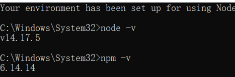
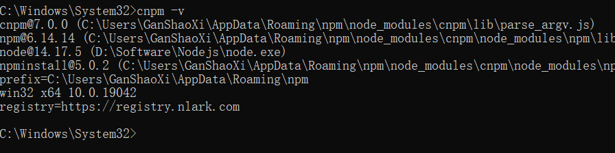
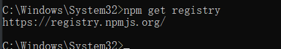
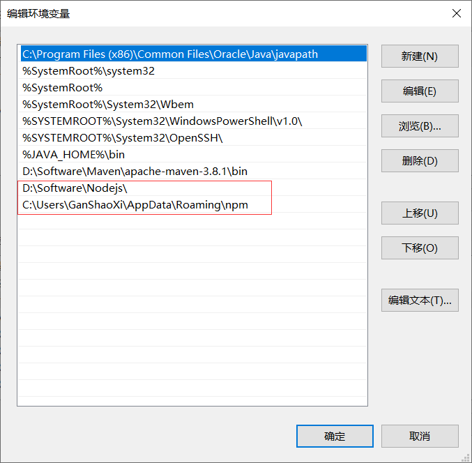
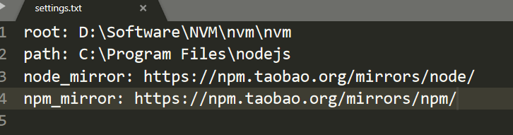

# 一、Node.js安装

## 1.下载并安装

下载地址为：https://nodejs.org/en/

## 2.检查是否安装成功

```shell
node -v
npm -v
```



3、安装镜像

为了提高我们的效率，可以使用淘宝的镜像：http://npm.taobao.org/

　　输入：

```shell
npm install -g cnpm –registry=https://registry.npm.taobao.org
```

即可安装npm镜像，以后再用到npm的地方直接用cnpm来代替就好了。　　

检查是否安装成功：



查看正在使用的镜像

```shell
npm get registry
```



未切换，手动切换

```shell
npx nrm use taobao
```

## 3.配置环境变量



# 二、搭建vue项目环境

## 　　1、安装vue-cli

官网：https://cli.vuejs.org/zh/guide/installation.html

### 关于旧版本

Vue CLI 的包名称由 `vue-cli` 改成了 `@vue/cli`。 如果你已经全局安装了旧版本的 `vue-cli` (1.x 或 2.x)，你需要先通过 `npm uninstall vue-cli -g` 或 `yarn global remove vue-cli` 卸载它。

### Node 版本要求

Vue CLI 4.x 需要 [Node.js](https://nodejs.org/) v8.9 或更高版本 (推荐 v10 以上)。你可以使用 [n](https://github.com/tj/n)，[nvm](https://github.com/creationix/nvm) 或 [nvm-windows](https://github.com/coreybutler/nvm-windows) 在同一台电脑中管理多个 Node 版本。

可以使用下列任一命令安装这个新的包：

```bash
npm install -g @vue/cli
# OR
yarn global add @vue/cli
```

安装之后，你就可以在命令行中访问 `vue` 命令。你可以通过简单运行 `vue`，看看是否展示出了一份所有可用命令的帮助信息，来验证它是否安装成功。

你还可以用这个命令来检查其版本是否正确：

```bash
vue --version
```

### 升级

如需升级全局的 Vue CLI 包，请运行：

```bash
npm update -g @vue/cli

# 或者
yarn global upgrade --latest @vue/cli
```

### 项目依赖

上面列出来的命令是用于升级全局的 Vue CLI。如需升级项目中的 Vue CLI 相关模块（以 `@vue/cli-plugin-` 或 `vue-cli-plugin-` 开头），请在项目目录下运行 `vue upgrade`：

```shell
用法： upgrade [options] [plugin-name]

（试用）升级 Vue CLI 服务及插件

选项：
  -t, --to <version>    升级 <plugin-name> 到指定的版本
  -f, --from <version>  跳过本地版本检测，默认插件是从此处指定的版本升级上来
  -r, --registry <url>  使用指定的 registry 地址安装依赖
  --all                 升级所有的插件
  --next                检查插件新版本时，包括 alpha/beta/rc 版本在内
  -h, --help            输出帮助内容
```

## 2.全局安装webpack

官网：https://webpack.docschina.org/concepts/

在命令行执行   

```shell
npm install webpack webpack-cli -g --save-dev
#-g -----全局安装
#--save-dev ----- 信息写入package.json的devDependencies中
```

查看

```shell
webpack -v
```


# 三、安装多版本node

安装多版本node的原因：

在项目开发过程中，不同项目使用的node版本不同，有时会因为node版本过高或太低，导致报错；

如何在同一个系统中安装多个版本的node呢，这里有两种方式，往下看选择适合你的方式吧

## 1、利用nvm进行管理

### NVM 简介

NVM 全称 `Node Version Manager`，是一个管理 `NodeJS `版本的工具。

NVM 默认只支持 Linux 和 OS X，不支持 Windows，针对 Windows 操作系统有 2 个替代方案：

> `nvm-window`
>
> `nodist`

这里只介绍使用`nvm-windows`安装和切换多版本NodeJS的方法。

### 安装前须知

之前有node环境的需卸载干净

如果安装完node后，输入 nvm use <版本号>，仍无效（node版本前面都没有选中的"*"），需重新安装
安装路径上不要有中文字符或者空格，否则会出现错误

卸载已安装的nodeJS

点击开始菜单，找到nodejs的文件夹，点击箭头处，进行卸载（注意：进行此操作之前需结束使用nodejs的项目）

检测系统中是否还存在nodejs

(1) 在开始菜单中进行查看

(2) 在cmd窗口中输入 node -v 进行查看

### nvm 的安装与使用

nvm下载

安装包下载地址： https://github.com/coreybutler/nvm-windows/releases

注意：安装环境 win10系统，64位

nvm安装（注：最好不要装在C盘）

（1）在指定的文件下新建两个文件夹，一个用来存放nvm的安装文件，另一个用来存放node的文件

（2）将下载好的安装包放入nvm文件夹中，解压，进行安装。

注意：安装时选择开始新建的文件夹作为指定安装目录

打开CMD，输入命令 nvm命令

如果有安装淘宝镜像的需完成下载镜像的配置，没有可跳过

打开nvm文件夹下的`settings.txt`文件，在最后添加以下代码（不改，下载node可能会报错）

```
arch: 64位
proxy:

node_mirror: https://npm.taobao.org/mirrors/node/
npm_mirror: https://npm.taobao.org/mirrors/npm/
```



注：

> arch：Windows 操作系统位数
>
> proxy：代理，淘宝 NodeJS 镜像和 NPM 镜像


注：

> `root：NVM `安装路径
>
> `path：NodeJS `快捷方式路径
>
> `node `的不同版本安装及切换

NVM 安装成功后，`win + r `输入`cmd `新开`cmd`窗口，可以通过` nvm -v `命令查看所有可用的命令。

```
nvm -v
Running version 1.1.7.
```


使用 `nvm install <版本号>`命令安装指定版本的NodeJS

```
nvm install v8.16.2
```

安装成功后在 NVM 安装目录下出现一个 v8.16.2 文件夹，使用 nvm list 命令查看已安装 NodeJS 列表。

    nvm list
再次使用 `nvm install <版本号>` 命令安装另一版本的 NodeJS

```
nvm install v12.8.0
nvm install v16.16.0
```

使用nvm use <版本号> 切换需要使用的 NodeJS 版本，切换成功后可以使用 node -v 和 npm -v 命令查看是否切换成功。

```sh
C:\>nvm use v8.16.2
Now using node v8.16.2 (64-bit)

C:\>node -v
v8.16.2

C:\>npm -v
6.4.1
```

==注意==:这里需注意使用nvm use <版本号>时可能出现乱码的情况，这时候用重新打开一个以管理员身份运行cmd窗口就不会出现乱码的情况

使用`nvm use <版本号> `切换需要使用的 NodeJS 版本

使用`nvm ls `查看所有安装的node版本，版本号前面带有*号的表示当前使用的NodeJS版本

这里是一些常用命令汇总：

```
nvm off                     // 禁用node.js版本管理(不卸载任何东西)
nvm on                      // 启用node.js版本管理
nvm install <version>       // 安装node.js的命名 version是版本号 例如：nvm install 8.12.0
nvm uninstall <version>     // 卸载node.js是的命令，卸载指定版本的nodejs，当安装失败时卸载使用
nvm ls                      // 显示所有安装的node.js版本
nvm list available          // 显示可以安装的所有node.js的版本
nvm use <version>           // 切换到使用指定的nodejs版本
nvm v                       // 显示nvm版本
nvm install stable          // 安装最新稳定版
```
