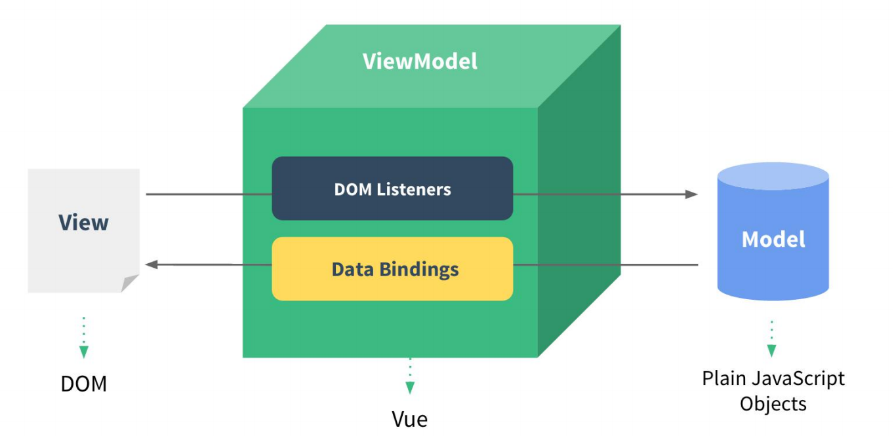
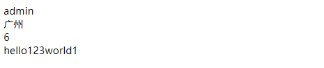
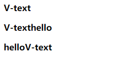
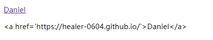
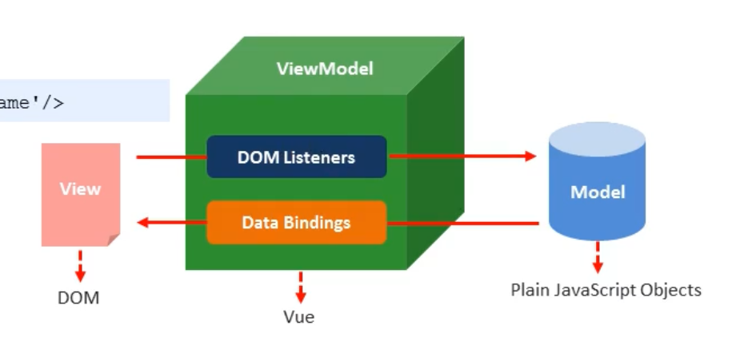
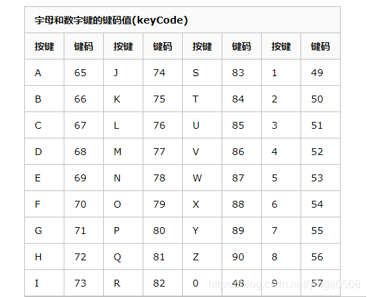
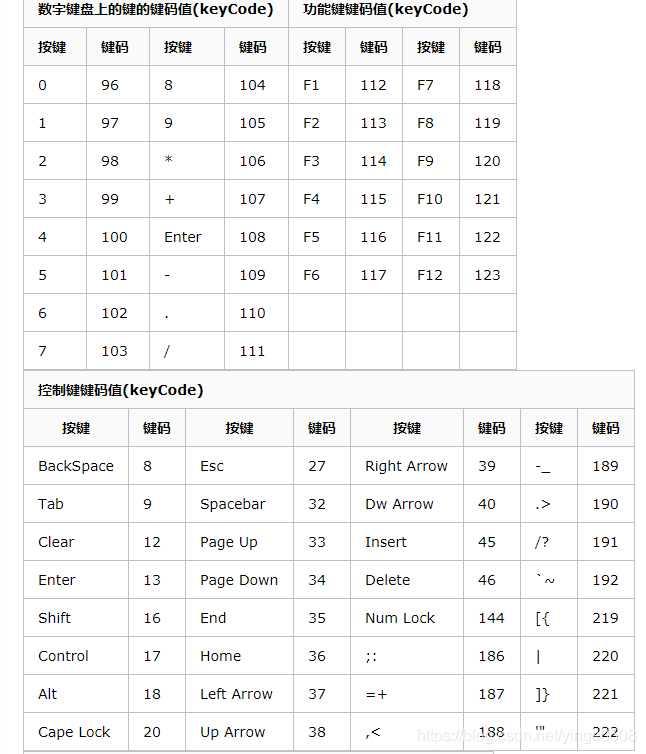
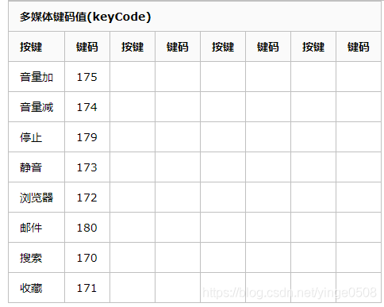
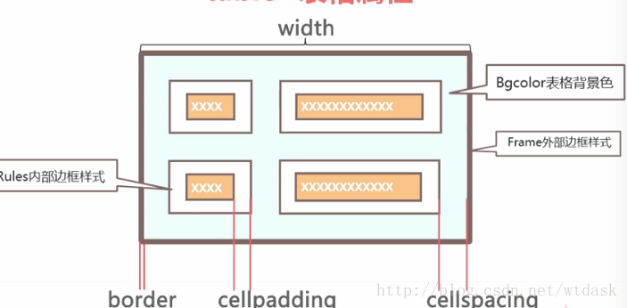
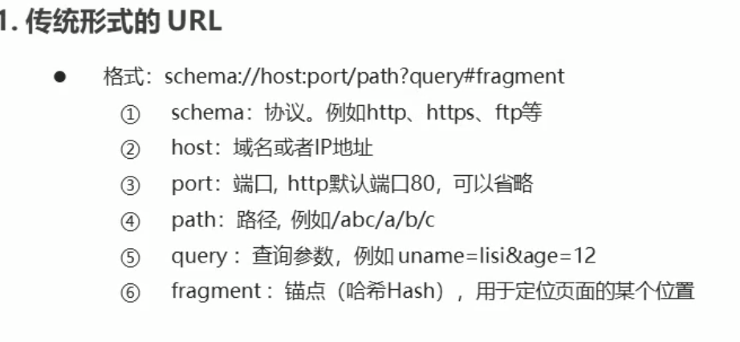

# 一、邂逅VUE

## 1. 认识vue.js

虽然没有完全遵循 MVVM 模型，但是 Vue 的设计也受到了它的启发。因此在文档中经常会使用 `vm` (ViewModel 的缩写) 这个变量名表示 Vue 实例。



当创建一个 Vue 实例时，你可以传入一个**选项对象**。这篇教程主要描述的就是如何使用这些选项来创建你想要的行为。作为参考，你也可以在 [API 文档](https://cn.vuejs.org/v2/api/#选项-数据)中浏览完整的选项列表。

一个 Vue 应用由一个通过 `new Vue` 创建的**根 Vue 实例**，以及可选的嵌套的、可复用的组件树组成。举个例子，一个 todo 应用的组件树可以是这样的：

当一个 Vue 实例被创建时，它将 `data` 对象中的所有的 property 加入到 Vue 的**响应式系统**中。当这些 property 的值发生改变时，视图将会产生“响应”，即匹配更新为新的值。

### 1.1 什么是vue

==Vue (读音 /vjuː/，类似于 **view**) 是一套用于构建用户界面的**渐进式框架**==。与其它大型框架不同的是，Vue 被设计为可以自底向上逐层应用。==Vue 的核心库只关注视图层，不仅易于上手，还便于与第三方库或既有项目整合。另一方面，当与==现代化的工具链以及各种支持类库结合使用时，Vue 也完全能够为复杂的单页应用提供驱动。

- **Vue (读音 /vjuː/，类似于 **view**) 是一套用于构建用户界面的渐进式框架**
- vue 的核心库只关注视图层，不仅易于上手，还便于与第三方库或既有项目整合

### 1.2 vue的安装

- 方式一：CDN引入

  ==在开发环境下不要使用压缩版本，不然你就失去了所有常见错误相关的警告!==

  ```html
  <!-- 开发环境版本，包含了有帮助的命令行警告 --> 
  <script src="https://cdn.jsdelivr.net/npm/vue/dist/vue.js"></script>
  <!-- 生产环境版本，优化了尺寸和速度 -->
  <script src="https://cdn.jsdelivr.net/npm/vue"></script>
  ```

- 方式二：下载引入

  [开发版本](https://cn.vuejs.org/js/vue.js)包含完整的警告和调试模式

  [生产版本](https://cn.vuejs.org/js/vue.min.js)删除了警告，33.30 KB min+gzip

  使用script标签引入

  ```html
  <script src="本地vue路径"></script>
  ```

- 方式三：NPM安装

  在用 Vue 构建大型应用时推荐使用 NPM 安装[[1\]](https://cn.vuejs.org/v2/guide/installation.html#footnote-1)。NPM 能很好地和诸如 [webpack](https://webpack.js.org/) 或 [Browserify](http://browserify.org/) 模块打包器配合使用。同时 Vue 也提供配套工具来开发[单文件组件](https://cn.vuejs.org/v2/guide/single-file-components.html)。

  ```bash
  # 最新稳定版
  $ npm install vue
  ```

### 1.3 vue的扩展插件
1) vue-cli: vue 脚手架 

2) vue-resource(axios): ajax 请求 

3) vue-router: 路由 

4) vuex: 状态管理 

5) vue-lazyload: 图片懒加载 

6) vue-scroller: 页面滑动相关 

7) mint-ui: 基于 vue 的 UI 组件库(移动端) 

8) element-ui: 基于 vue 的 UI 组件库(PC 端)

## 2.var、let、const的区别

var定义的变量，没有块的概念，可以跨块访问, 不能跨函数访问。let定义的变量，只能在块作用域里访问，不能跨块访问，也不能跨函数访问。const用来定义常量，使用时必须初始化(即必须赋值)，只能在块作用域里访问，而且不能修改。

```js
<script type="text/javascript">
    // 块作用域
    {
        var a = 1;
        let b = 2;
        const c = 3;
        // c = 4; // 报错
        var aa;
        let bb;
        // const cc; // 报错
        console.log(a); // 1
        console.log(b); // 2
        console.log(c); // 3
        console.log(aa); // undefined
        console.log(bb); // undefined
    }
    console.log(a); // 1
    // console.log(b); // 报错
    // console.log(c); // 报错

    // 函数作用域
    (function A() {
        var d = 5;
        let e = 6;
        const f = 7;
        console.log(d); // 5
        console.log(e); // 6  
        console.log(f); // 7 
     
    })();
    // console.log(d); // 报错
    // console.log(e); // 报错
    // console.log(f); // 报错
</script>
```

const定义的对象属性是否可以改变
这是今天面试的时候碰到的一个问题，上面说到 const 是不能修改的，于是很痛快的说不能，但是回来实际测试后发现错了，在此记录一下。

``` js
3.  const person = {
        name : 'jiuke',
        sex : '男'
    }

 person.name = 'test'

 console.log(person.name)
```


运行上述代码，发现person对象的name属性确实被修改了，这是怎么回事呢？

因为对象是引用类型的，person中保存的仅是对象的指针，这就意味着，const仅保证指针不发生改变，修改对象的属性不会改变对象的指针，所以是被允许的。也就是说const定义的引用类型只要指针不发生改变，其他的不论如何改变都是允许的。

然后我们试着修改一下指针，让person指向一个新对象，果然报错

```js
const person = {
   name : 'jiuke',
   sex : '男'
}

person = {
   name : 'test',
   sex : '男'
}
```


## 3、第一个vue程序


```html
<!DOCTYPE html>
<html lang="en">
    <head>
        <meta charset="UTF-8">
        <title>Title</title>
        <script src="./js/vue.js"></script>
    </head>
    <body>
        <div id="app">
            <div>{{msg}}</div>
        </div>
<!--        引入vue.js-->
        <script src="./js/vue.js"></script>
        <script type="text/javascript">
        // 声明变量用于存放vue的实例
            var vue = new Vue({
                el:"#app",
                data:{
                    msg:"hello world!"
                }
            });
        </script>
    </body>
</html>
```

### 2.1 el挂载点

声明的vue实例中的el为命中元素的及其内部的后代元素，所定义的==变量只能在挂载点标签的内部起作用==，可以使用其他选择器，==推荐el选择id选择器，避免表意不清晰。==

el的作用是为vue实例提供挂载点

### 2.2 data属性（数据对象）

- vue中用到的数据我们定义在data中
- data中可以写复杂类型
- 渲染复杂类型的数据时，遵守js语法规则即可

```html
    <body>
        <div id="app">
            <div>{{student.name}}</div>
            <div>{{city[2]}}</div>
            <div>{{1+2+3}}</div>
            <div>{{"hello"+123+"world"+1}}</div>
        </div>
<!--        引入vue.js-->
        <script src="./js/vue.js"></script>
        <script type="text/javascript">
        // 声明变量用于存放vue的实例
            var vue = new Vue({
                el:"#app",
                data:{
                    student:{
                        name:"admin",
                        age:23,
                        sex:"男"
                    },
                    city:["北京","上海","广州","深圳"]
                }
            });
        </script>
    </body>
```

结果：



# 二、指令

- 本质就是自定义属性

- Vue中指定都是以 v- 开头 

## 1、内容绑定，事件绑定

####   1.1 v-text

- v-text指令用于将数据填充到标签中，作用于插值表达式类似，但是没有闪动问题
- 如果数据中有HTML标签会将html标签一并输出
- ==注意：此处为单向绑定，数据对象上的值改变，插值会发生变化；但是当插值发生变化并不会影响数据对象的值==

```html
    <body>
        <div id="app">
            <h3 v-text="message">hello</h3>
            <h3 v-text="message+'hello'"></h3>
            <h3>hello{{message}}</h3>
        </div>
<!--        引入vue.js-->
        <script src="./js/vue.js"></script>
        <script type="text/javascript">
        // 声明变量用于存放vue的实例
            var vue = new Vue({
                el:"#app",
                data:{
                    message:"V-text"
                }
            });
        </script>
    </body>
```



#### 1.2 v-html

- 用法和v-text 相似  但是他可以将HTML片段填充到标签中

- 可能有安全问题, 一般只在可信任内容上使用 `v-html`，==永不用在用户提交的内容上==

- ==它与v-text区别在于v-text输出的是纯文本，浏览器不会对其再进行html解析，但v-html会将其当html标签解析后输出。==

```html
    <body>
        <div id="app">
            <p v-html="message">hello</p>
            <p v-text="message"></p>
        </div>
<!--        引入vue.js-->
        <script src="./js/vue.js"></script>
        <script type="text/javascript">
        // 声明变量用于存放vue的实例
            var vue = new Vue({
                el:"#app",
                data:{
                    message:"<a href='https://healer-0604.github.io/'>Daniel</a>"
                }
            });
        </script>
    </body>
```



#### 1.3 v-on

- 用来绑定事件的

-  形式如：v-on:click  缩写为 @click;

-  方法中通过==this==关键字来获取data中的数据

   ```html
       <body>
           <div id="app">
               
               <input type="button" value="v-on" v-on:click="clickFun">
               <input type="button" value="v-on" @click="clickFun">
               <input type="button" value="双击" @dblclick="clickFun">
               <p @click="foodFun">{{food}}</p>
           </div>
   <!--        引入vue.js-->
           <script src="./js/vue.js"></script>
           <script type="text/javascript">
           // 声明变量用于存放vue的实例
               var vue = new Vue({
                   el:"#app",
                   data:{
                       food:"奶茶"
                   },
                   methods:{
                       clickFun:function () {
                           alert("hello");
                       },
                       foodFun:function () {
                           console.log(this.food);
                           this.food+="好好喝 ";				
                       }
                   }
               });
           </script>
       </body>
   ```

函数的传参：

```html
<script src="js/vue.js"></script>
        <div id="app">
            <p>{{msg}}</p>
            <button type="button" @click="clickFun(123,25,$event)">查看</button>
        </div>
        <script type="text/javascript">
            let vue = new Vue({
                el:"#app",
                data:{
                    msg:"hello"
                },
                methods:{
                    clickFun:function (p,p1,event) {
                        console.log(p);
                        console.log(p1);
                        console.log(event);
                    }
                }
            });
        </script>
```


## 2、分支结构

### 1.1 v-show

- v-show本质就是标签display设置为none，控制隐藏

```html
    <body>
        <div id="app">
            <input type="button" @click="showFun" value="切换">
            
        
        </div>
<!--        引入vue.js-->
        <script src="../js/vue.js"></script>
        <script type="text/javascript">
        // 声明变量用于存放vue的实例
            var vue = new Vue({
                el:"#app",
                data:{
                    isShow:true
                },
                methods:{
                    showFun:function () {
                        this.isShow=!this.isShow;
                    }
                }
            });
        </script>
    </body>
```

### 1.2 v-if和v-show

- v-if和v-show都是根据表达式的==真假来决定标签的显示和隐藏==，==但v-if本质是移除DOM标签，而v-show则是操作DOM的display属性==

- ##### ==v-show 和 v-if的区别==

  - v-show本质就是标签display设置为none，控制隐藏
    - v-show只编译一次，后面其实就是控制css，而v-if不停的销毁和创建，故v-show性能更好一点。
  - v-if是动态的向DOM树内添加或者删除DOM元素
    - v-if切换有一个局部编译/卸载的过程，切换过程中合适地销毁和重建内部的事件监听和子组件

- 

- v-if使用场景

  1- 多个元素 通过条件判断展示或者隐藏某个元素。或者多个元素

  2- 进行两个视图之间的切换

## 3、设置属性v-bind

###  v-bind

- `v-bind` 指令被用来响应地更新 HTML 属性
- `v-bind:href`    可以缩写为    `:href`;

```html
<!-- 绑定一个属性 -->


<!-- 缩写 -->

```

### 绑定对象

```html
    <body>
        <style type="text/css">
            .box{
                border:1px dashed #f0f;
            }
            .textColor{
                color:#f00;
                background-color:#eef;
            }
            .textSize{
                font-size:30px;
                font-weight:bold;
            }
        </style>
        <!--
            HTML最终渲染为 <ul class="box textColor textSize"></ul>
            注意：
                textColor，textSize  对应的渲染到页面上的CSS类名
                isColor，isSize  对应vue data中的数据  如果为true 则对应的类名 渲染到页面上
        
        
                当 isColor 和 isSize 变化时，class列表将相应的更新，
                例如，将isSize改成false，
                class列表将变为 <ul class="box textColor"></ul>
        -->
    
        <ul class="box" v-bind:class="{textColor:isColor, textSize:isSize}">
            <li>学习Vue</li>
            <li>学习Node</li>
            <li>学习React</li>
        </ul>
        <div v-bind:style="{color:activeColor,fontSize:activeSize}">对象语法</div>
        <script src="../js/vue.js"></script>
        <script>
            var vm= new Vue({
                el:'.box',
                data:{
                    isColor:true,
                    isSize:true,
                    activeColor:"red",
                    activeSize:"25px",
                }
            })
        </script>

    </body>
```

### 绑定class

```html
  <body>
        2、  v-bind 中支持绑定一个数组    数组中classA和 classB 对应为data中的数据
    
        这里的classA  对用data 中的  classA
        这里的classB  对用data 中的  classB
        <ul class="box" :class="[classA, classB]">
            <li>学习Vue</li>
            <li>学习Node</li>
            <li>学习React</li>
        </ul>
        <script>
            var vm= new Vue({
                el:'.box',
                data:{
                    classA:'textColor',
                    classB:'textSize'
                }
            })
        </script>
        <style>
            .box{
                border:1px dashed #f0f;
            }
            .textColor{
                color:#f00;
                background-color:#eef;
            }
            .textSize{
                font-size:30px;
                font-weight:bold;
            }
        </style>
    </body>
```

### 绑定对象和绑定数组 的区别

- 绑定对象的时候对象的属性即要渲染的类名对象的属性值对应的是 ==data 中的数据==
- 绑定数组的时候数组里面存的是data 中的数据 

### 绑定style

```html
 <div v-bind:style="styleObject">绑定样式对象</div>'
 
<!-- CSS 属性名可以用驼峰式 (camelCase) 或短横线分隔 (kebab-case，记得用单引号括起来)    -->
 <div v-bind:style="{ color: activeColor, fontSize: fontSize,background:'red' }">内联样式</div>

<!--组语法可以将多个样式对象应用到同一个元素 -->
<div v-bind:style="[styleObj1, styleObj2]"></div>


<script>
	new Vue({
      el: '#app',
      data: {
        styleObject: {
          color: 'green',
          fontSize: '30px',
          background:'red'
        }，
        activeColor: 'green',
   		fontSize: "30px"
      },
      styleObj1: {
             color: 'red'
       },
       styleObj2: {
            fontSize: '30px'
       }

</script>
```

## 4、双向数据绑定

- 当数据发生变化的时候，视图也就发生变化
- 当视图发生变化的时候，数据也会跟着同步变化

### 普通方式的双向绑定

```html
    <body>
        <script src="js/vue.js"></script>
        <div id="app">
            <p>{{msg}}</p>
            <input type="text" v-bind:value="msg" @input="msg=$event.target.value">
        </div>
        <script type="text/javascript">
            let vue = new Vue({
                el:"#app",
                data:{
                    msg:"hello"
                }
            });
        </script>
    </body>
```


### v-model

- **v-model**是一个指令，==限制在`<input>、<select>、<textarea>、components`中使用==

```html
    <body>
        <script src="js/vue.js"></script>
        <div id="app">
            <p>{{msg}}</p>
            <input type="text" v-model="msg">
        </div>
        <script type="text/javascript">
            let vue = new Vue({
                el:"#app",
                data:{
                    msg:"hello"
                }
            });
        </script>
    </body>
```

### mvvm



- MVC 是后端的分层开发概念,来源于mvc的分层概念； MVVM是前端视图层的概念，主要关注于 视图层分离，也就是说：MVVM把前端的视图层，分为了 三部分 Model, View , VM ViewModel
- m   model  
  - 数据层   Vue  中 数据层 都放在 data 里面
- v   view     视图   
  - Vue  中  view      即 我们的HTML页面  
- vm   （view-model）     控制器     将数据和视图层建立联系      
  - vm 即  Vue 的实例  就是 vm  
##  5、v-cloak

- 防止页面加载时出现闪烁问题

  ```html
   <style type="text/css">
    /* 
      1、通过属性选择器 选择到 带有属性 v-cloak的标签  让他隐藏
   */
    [v-cloak]{
      /* 元素隐藏    */
      display: none;
    }
    </style>
  <body>
    <div id="app">
      <!-- 2、 让带有插值 语法的   添加 v-cloak 属性 
           在 数据渲染完场之后，v-cloak 属性会被自动去除，
           v-cloak一旦移除也就是没有这个属性了  属性选择器就选择不到该标签
  		 也就是对应的标签会变为可见
      -->
    <div  v-cloak  >{{msg}}</div>
    </div>
    <script type="text/javascript" src="js/vue.js"></script>
    <script type="text/javascript">
      var vm = new Vue({
        //  el   指定元素 id 是 app 的元素  
        el: '#app',
        //  data  里面存储的是数据
        data: {
          msg: 'Hello Vue'
        }
      });
  </script>
  </body>
  </html>
  ```

##  6、v-pre

- 显示原始信息跳过编译过程
- 跳过这个元素和它的子元素的编译过程。
- ==**一些静态的内容不需要编译加这个指令可以加快渲染**==

```html
    <span v-pre>{{ this will not be compiled }}</span>    
	<!--  显示的是{{ this will not be compiled }}  -->
	<span v-pre>{{msg}}</span>  
     <!--   即使data里面定义了msg这里仍然是显示的{{msg}}  -->
<script>
    new Vue({
        el: '#app',
        data: {
            msg: 'Hello Vue.js'
        }
    });
</script>
```

##  7、v-once

- 执行一次性的插值==【当数据改变时，插值处的内容不会继续更新】==

```html
  <!-- 即使data里面定义了msg 后期我们修改了 仍然显示的是第一次data里面存储的数据即 Hello Vue.js  -->
<span v-once>{{ msg}}</span>    
<script>
    new Vue({
        el: '#app',
        data: {
            msg: 'Hello Vue.js'
        }
    });
</script>
```

## 8、v-for

1数组

```html
<div v-for="(item,index) in Array" :key="index"></div>
<!--
value 代表   对象的value
index  代表数组索引
--->
```

2对象

```html
<div v-for="(value,key,index) in Data" :key="key"></div>
<!--
    value 代表   对象的value
    key  代表对象的 键
    index  代表索引
--->
```

### 数组案例：

- 用于循环的数组里面的值可以是对象，也可以是普通元素  

```html
    <body>
        <script src="js/vue.js"></script>
        <div id="app">
            <table>
                <tr>
                    <th>数组ID</th>
                    <th>编号</th>
                    <th>姓名</th>
                    <th>年龄</th>
                    <th>出生日期</th>
                </tr>
                <tr v-for="(stu,i) in student">
                    <td>{{i}}</td>
                    <td>{{stu.id}}</td>
                    <td>{{stu.name}}</td>
                    <td>{{stu.age}}</td>
                    <td>{{stu.time}}</td>
                </tr>
            </table>
        </div>
        <script type="text/javascript">
            let vue = new Vue({
                el:"#app",
                data:{
                    student:[
                        {id:'01',name:"张三",age:25,time:"2017/07/09"},
                        {id:'02',name:"李四",age:20,time:"2017/04/05"},
                        {id:'03',name:"王二",age:26,time:"2017/05/14"},
                        {id:'04',name:"王五",age:22,time:"2017/02/28"}
                    ]
                }
            });
        </script>
    </body>
```

- ==**不推荐**==同时使用 `v-if` 和 `v-for`
- ==当 `v-if` 与 `v-for` 一起使用时，`v-for` 具有比 `v-if` 更高的优先级。即会先遍历后判断。==

```html

```

- key 的作用
  - **key来给每个节点做一个唯一标识**
  - **key的作用主要是为了高效的更新虚拟DOM**

```html
<ul>
  <li v-for="item in items" :key="item.id">...</li>
</ul>

```
##  事件修饰符

### 阻止冒泡.stop

传统方式通过方法stopPropagation()，可以阻止冒泡

```html
        <div id="app">
            <p>{{num}}</p>
            <div id="div1" @click="add0">
                <input type="button" @click="add1($event)" value="加">
            </div>
        </div>
        <script type="text/javascript">
            let vue = new Vue({
                el:"#app",
                data:{
                    num:0
                },
                methods:{
                    add0:function () {
                        this.num++;
                    },
                    add1:function (event) {
                        //传统方式冒泡
                        event.stopPropagation();
                    }
                }
            });
        </script>
```

==传统方式通过操作dom元素来阻止冒泡事件，但是vue提供事件修饰符来阻止冒泡事件的发生==

通过stop修饰符处理冒泡，==只需要在click后加上stop来修饰即可==

```html
<input type="button" @click.stop="add1" value="加">
```

### 常用修饰符

- 在事件处理程序中调用 `event.preventDefault()` 或 `event.stopPropagation()` 是非常常见的需求。

- Vue 不推荐我们操作DOM    为了解决这个问题，Vue.js 为 `v-on` 提供了**事件修饰符**

- 修饰符是由点开头的指令后缀来表示的

- **修饰符**：

  - `.stop` - 调用 `event.stopPropagation()` ==阻止事件冒泡==。
- `.prevent` - 调用 `event.preventDefault()`==阻止默认事件的提交==。
  
  - `.capture` - 添加事件侦听器时使用 capture 模式。
- `.self` - 只当事件是从侦听器绑定的元素本身触发时才触发回调。
  
  - `.{keyCode | keyAlias}` - 只当事件是从特定键触发时才触发回调。
- `.native` - 监听组件根元素的原生事件。
  
  - `.once` - 只触发一次回调。
- `.left` - (2.2.0) 只当点击鼠标左键时触发。
  
  - `.right` - (2.2.0) 只当点击鼠标右键时触发。
- `.middle` - (2.2.0) 只当点击鼠标中键时触发。
  - `.passive` - (2.3.0) 以 `{ passive: true }` 模式添加侦听器

  阻止默认点击事件的发生

  ```html
  
  ```
<p>{{num}}</p>

<div id="div1" @click="add0">
     <a href="http://www.baidu.com" @click.prevent.stop="add1">百度</a>
   <input type="button" @click.stop="add1" value="加">
  </div>
  ```
  
  


​```html
<!-- 阻止单击事件继续传播 -->
<a v-on:click.stop="doThis"></a>

<!-- 提交事件不再重载页面 -->
<form v-on:submit.prevent="onSubmit"></form>

<!-- 修饰符可以串联即阻止冒泡也阻止默认事件 -->
<a v-on:click.stop.prevent="doThat"></a>

<!-- 只当在 event.target 是当前元素自身时触发处理函数 -->
<!-- 即事件不是从内部元素触发的 -->
<div v-on:click.self="doThat">...</div>


  ```

==使用修饰符时，顺序很重要；相应的代码会以同样的顺序产生。因此，用 v-on:click.prevent.self 会阻止所有的点击，而 v-on:click.self.prevent 只会阻止对元素自身的点击。==

## 按键修饰符

### 按键对应码







### 按键修饰符

- 在做项目中有时会用到键盘事件，在监听键盘事件时，我们经常需要检查详细的按键。Vue 允许为 `v-on` 在监听键盘事件时添加按键修饰符
- 常用的按键修饰符
  - `.enter` enter键
  - `.tab` tab键
  - `.delete` (捕获“删除”和“退格”按键) =>  删除键
  - `.esc` 取消键
  - `.space` 空格键
  - `.up ` 上
  - `.down` 下
  - `.left` 左
  - `.right` 右

```html
<!-- 只有在 `keyCode` 是 13 时调用 `vm.submit()` -->
<input v-on:keyup.13="submit">

<!-- -当点击enter 时调用 `vm.submit()` -->
<input v-on:keyup.enter="submit">

<!--当点击enter或者space时  时调用 `vm.alertMe()`   -->
<input type="text" v-on:keyup.enter.space="alertMe" >
<script>
	var vm = new Vue({
        el:"#app",
        methods: {
              submit:function(){},
              alertMe:function(){},
        }
    })

</script>
```

## 自定义按键修饰符别名

- 在Vue中可以通过`config.keyCodes`自定义按键修饰符别名

```html
<div id="app">
    预先定义了keycode 116（即F5）的别名为f5，因此在文字输入框中按下F5，会触发prompt方法
    <input type="text" v-on:keydown.f5="prompt()">
</div>

<script>
	
    Vue.config.keyCodes.f5 = 116;

    let app = new Vue({
        el: '#app',
        methods: {
            prompt: function() {
                alert('我是 F5！');
            }
        }
    });
</script>
```

## 自定义指令

### 简单示例

通过`directive(name,function)`来定义指令

其中：

- name表示指令的名称，注意不需要加`v-`
- 方法第二个参数是定义该指令的具体方法

```html
    <body>
        <script src="js/vue.js"></script>
        <div id="app">
            <form action="">
                自定义指令：<input type="text" name="age" v-focus ><br>

            </form>
        </div>
        <script type="text/javascript">
            Vue.directive("focus",{
                inserted:function (el) {
                    el.focus();
                }
            });
        </script>
    </body>
```

#### Vue.directive  注册全局指令 带参数

```html
  <input type="text" v-color='msg'>
 <script type="text/javascript">
    /*
      自定义指令-带参数
      bind - 只调用一次，在指令第一次绑定到元素上时候调用

    */
    Vue.directive('color', {
      // bind声明周期, 只调用一次，指令第一次绑定到元素时调用。在这里可以进行一次性的初始化设置
      // el 为当前自定义指令的DOM元素  
      // binding 为自定义的函数形参   通过自定义属性传递过来的值 存在 binding.value 里面
      bind: function(el, binding){
        // 根据指令的参数设置背景色
        // console.log(binding.value.color)
        el.style.backgroundColor = binding.value.color;
      }
    });
    var vm = new Vue({
      el: '#app',
      data: {
        msg: {
          color: 'blue'
        }
      }
    });
  </script>
```

#### 自定义指令局部指令

- 局部指令，需要定义在  directives 的选项   用法和全局用法一样 
- 局部指令只能在当前组件里面使用
- 当全局指令和局部指令同名时以局部指令为准

```html
<input type="text" v-color='msg'>
 <input type="text" v-focus>
 <script type="text/javascript">
    /*
      自定义指令-局部指令
    */
    var vm = new Vue({
      el: '#app',
      data: {
        msg: {
          color: 'red'
        }
      },
   	  //局部指令，需要定义在  directives 的选项
      directives: {
        color: {
          bind: function(el, binding){
            el.style.backgroundColor = binding.value.color;
          }
        },
        focus: {
          inserted: function(el) {
            el.focus();
          }
        }
      }
    });
  </script>
```


### 钩子函数

一个指令定义对象可以提供如下几个钩子函数 (均为可选)：

- `bind`：只调用一次，指令第一次绑定到元素时调用。在这里可以进行一次性的初始化设置。
- `inserted`：被绑定元素插入父节点时调用 (仅保证父节点存在，但不一定已被插入文档中)。
- `update`：所在组件的 VNode 更新时调用，**但是可能发生在其子 VNode 更新之前**。指令的值可能发生了改变，也可能没有。但是你可以通过比较更新前后的值来忽略不必要的模板更新 (详细的钩子函数参数见下)。

我们会在[稍后](https://cn.vuejs.org/v2/guide/render-function.html#虚拟-DOM)讨论[渲染函数](https://cn.vuejs.org/v2/guide/render-function.html)时介绍更多 VNodes 的细节。

- `componentUpdated`：指令所在组件的 VNode **及其子 VNode** 全部更新后调用。
- `unbind`：只调用一次，指令与元素解绑时调用。

接下来我们来看一下钩子函数的参数 (即 `el`、`binding`、`vnode` 和 `oldVnode`)。

### 钩子函数参数

指令钩子函数会被传入以下参数：

- `el`：指令所绑定的元素，可以用来直接操作 DOM。

- ```html
  binding
  ```

  ：一个对象，包含以下 property：

  - `name`：指令名，不包括 `v-` 前缀。
  - `value`：指令的绑定值，例如：`v-my-directive="1 + 1"` 中，绑定值为 `2`。
  - `oldValue`：指令绑定的前一个值，仅在 `update` 和 `componentUpdated` 钩子中可用。无论值是否改变都可用。
  - `expression`：字符串形式的指令表达式。例如 `v-my-directive="1 + 1"` 中，表达式为 `"1 + 1"`。
  - `arg`：传给指令的参数，可选。例如 `v-my-directive:foo` 中，参数为 `"foo"`。
  - `modifiers`：一个包含修饰符的对象。例如：`v-my-directive.foo.bar` 中，修饰符对象为 `{ foo: true, bar: true }`。

- `vnode`：Vue 编译生成的虚拟节点。移步 [VNode API](https://cn.vuejs.org/v2/api/#VNode-接口) 来了解更多详情。

- `oldVnode`：上一个虚拟节点，仅在 `update` 和 `componentUpdated` 钩子中可用。

除了 `el` 之外，其它参数都应该是只读的，切勿进行修改。如果需要在钩子之间共享数据，建议通过元素的 [`dataset`](https://developer.mozilla.org/zh-CN/docs/Web/API/HTMLElement/dataset) 来进行。

这是一个使用了这些 property 的自定义钩子样例：

```html
<div id="hook-arguments-example" v-demo:foo.a.b="message"></div>
```

```js
Vue.directive('demo', {
  bind: function (el, binding, vnode) {
    var s = JSON.stringify
    el.innerHTML =
      'name: '       + s(binding.name) + '<br>' +
      'value: '      + s(binding.value) + '<br>' +
      'expression: ' + s(binding.expression) + '<br>' +
      'argument: '   + s(binding.arg) + '<br>' +
      'modifiers: '  + s(binding.modifiers) + '<br>' +
      'vnode keys: ' + Object.keys(vnode).join(', ')
  }
})

new Vue({
  el: '#hook-arguments-example',
  data: {
    message: 'hello!'
  }
})
```

```html
name: "demo"
value: "hello!"
expression: "message"
argument: "foo"
modifiers: {"a":true,"b":true}
vnode keys: tag, data, children, text, elm, ns, context, fnContext, fnOptions, fnScopeId, key, componentOptions, componentInstance, parent, raw, isStatic, isRootInsert, isComment, isCloned, isOnce, asyncFactory, asyncMeta, isAsyncPlaceholder
```


### 动态指令参数

指令的参数可以是动态的。例如，在 `v-mydirective:[argument]="value"` 中，`argument` 参数可以根据组件实例数据进行更新！这使得自定义指令可以在应用中被灵活使用。

例如你想要创建一个自定义指令，用来通过固定布局将元素固定在页面上。我们可以像这样创建一个通过指令值来更新竖直位置像素值的自定义指令：

```html
<div id="baseexample">
  <p>Scroll down the page</p>
  <p v-pin="200">Stick me 200px from the top of the page</p>
</div>

```

```js
Vue.directive('pin', {
  bind: function (el, binding, vnode) {
    el.style.position = 'fixed'
    el.style.top = binding.value + 'px'
  }
})

new Vue({
  el: '#baseexample'
})
```

这会把该元素固定在距离页面顶部 200 像素的位置。但如果场景是我们需要把元素固定在左侧而不是顶部又该怎么办呢？这时使用动态参数就可以非常方便地根据每个组件实例来进行更新。

```html
<div id="dynamicexample">
  <h3>Scroll down inside this section ↓</h3>
  <p v-pin:[direction]="200">I am pinned onto the page at 200px to the left.</p>
</div>

```

```js
Vue.directive('pin', {
  bind: function (el, binding, vnode) {
    el.style.position = 'fixed'
    var s = (binding.arg == 'left' ? 'left' : 'top')
    el.style[s] = binding.value + 'px'
  }
})

new Vue({
  el: '#dynamicexample',
  data: function () {
    return {
      direction: 'left'
    }
  }
})
```

结果：

<iframe height="200" class="demo" scrolling="no" title="Dynamic Directive Arguments" src="https://codepen.io/team/Vue/embed/rgLLzb/?height=300&amp;theme-id=32763&amp;default-tab=result" frameborder="no" allowtransparency="true" allowfullscreen="true" style="border: 1px solid rgb(238, 238, 238); border-radius: 2px; padding: 25px 35px; margin: 1em 0px 40px; user-select: none; overflow-x: auto; color: rgb(48, 68, 85); font-family: &quot;Source Sans Pro&quot;, &quot;Helvetica Neue&quot;, Arial, sans-serif; font-size: 16px; font-style: normal; font-variant-ligatures: normal; font-variant-caps: normal; font-weight: 400; letter-spacing: normal; orphans: 2; text-align: start; text-indent: 0px; text-transform: none; white-space: normal; widows: 2; word-spacing: 0px; -webkit-text-stroke-width: 0px; background-color: rgb(255, 255, 255); text-decoration-style: initial; text-decoration-color: initial; width: 700px;"></iframe>


这样这个自定义指令现在的灵活性就足以支持一些不同的用例了。

### 函数简写

在很多时候，你可能想在 `bind` 和 `update` 时触发相同行为，而不关心其它的钩子。比如这样写：

```js
Vue.directive('color-swatch', function (el, binding) {
  el.style.backgroundColor = binding.value
})
```

### 对象字面量

如果指令需要多个值，可以传入一个 JavaScript 对象字面量。记住，指令函数能够接受所有合法的 JavaScript 表达式。

```html
<div v-demo="{ color: 'white', text: 'hello!' }"></div>
```

```js
Vue.directive('demo', function (el, binding) {
  console.log(binding.value.color) // => "white"
  console.log(binding.value.text)  // => "hello!"
})
```


# 三、常用特性及案例

## 1、表格




```html
    <body>
        <style type="text/css">
            table
            {
                border: 1px black solid;
                border-collapse:collapse;
                width:100%;
            }
            th
            {
                font-family:"Trebuchet MS", Arial, Helvetica, sans-serif;
                height:50px;
            }
            td{
                font-family:"Trebuchet MS", Arial, Helvetica, sans-serif;
                height:50px;
                /*vertical-align:bottom;*/
                text-align: center;
            }
        </style>
        <script src="js/vue.js"></script>
        <div id="app">
            <table class="tab" border="1">
                <tr>
                    <th>数组ID</th>
                    <th>编号</th>
                    <th>姓名</th>
                    <th>年龄</th>
                    <th>出生日期</th>
                </tr>
                <tr  v-for="(stu,index) in student" :style="index%2==1?tableColor1:tableColor2">
                    <td>{{index}}</td>
                    <td>{{stu.id}}</td>
                    <td>{{stu.name}}</td>
                    <td>{{stu.age}}</td>
                    <td>{{stu.time}}</td>
                </tr>
            </table>
        </div>
        <script type="text/javascript">
            let vue = new Vue({
                el:"#app",
                data:{
                    student:[
                        {id:'01',name:"张三",age:25,time:"2017/07/09"},
                        {id:'02',name:"李四",age:20,time:"2017/04/05"},
                        {id:'03',name:"王二",age:26,time:"2017/05/14"},
                        {id:'04',name:"王五",age:22,time:"2017/02/28"}
                    ],
                    tableColor1:{
                        backgroundColor:"#f7dad9"
                    },
                    tableColor2:{
                        backgroundColor:"#f4d9c6"
                    }
                },
                methods:{
                
                }
            });
        </script>
    </body>
```

## 2、表单操作

#### 数据的双向绑定

```html
    <body>
        <script src="js/vue.js"></script>
        <div id="app">
            <form action="">
                姓名：<input type="text" name="uName" v-model="uName"><br>
                性别：
                男<input type="radio" name="sex" value="1" v-model="sex">
                女<input type="radio" name="sex" value="2" v-model="sex"><br>
                爱好：
                爱好1<input type="checkbox" name="hobby1" value="1" v-model="hobby">
                爱好2<input type="checkbox" name="hobby2" value="2" v-model="hobby">
                爱好3<input type="checkbox" name="hobby3" value="3" v-model="hobby"><br>
                下拉列表：
                <select v-model="sel" >
                    <option value="1" >北京</option>
                    <option value="2" >上海</option>
                    <option value="3" >广州</option>
                    <option value="4" >深圳</option>
                </select><br>
                说明：<textarea v-model="info" name="" id="" cols="30" rows="10"></textarea><br>
                <input type="submit" value="提交" @click.prevent="header0">
            </form>
        </div>
        <script type="text/javascript">
            var vm = new Vue({
                el:"#app",
                data:{
                    uName:"",
                    sex:2,   //sex的值决定刷新页面后的默认值
                    hobby:["1","3"],
                    sel:3,
                    //sel:["1","4"]  //下拉列表多选需要在select标签设置属性multiple="true"
                    info:"Hello"
                },
                methods:{
                    header0:function (){
                        console.log(this.uName);
                        console.log(this.sex);
                        console.log(this.hobby.toString());//如果不想在log中出现与数组无关项，调用toString方法
                        console.log(this.sel);
                        console.log(this.info);
                    }
                }
            });
        </script>
    </body>
```

#### 表单域修饰符

- `.number`  表示将数据转换为number类型
- `.trim`  表示将字符串首尾的空格去除
- `.lazy`  表示将表单更改为Change事件，当鼠标失去焦点时生效

```html
    <body>
        <script src="js/vue.js"></script>
        <div id="app">
            <form action="">
<!--                number表示将数据转换为number类型-->
                年龄：<input type="text" name="age" v-model.number="age"><br>
<!--                trim表示将字符串首尾的空格去除-->
                说明：<input type="text" name="info" v-model.trim="info"><br>
<!--                lazy表示将表单更改为Change事件，当鼠标失去焦点时生效-->
                消息：<input type="text" name="info" v-model.lazy="smg"><br>
                <div>{{smg}}</div>
                <input type="submit" value="提交" @click.prevent="header0">
            </form>
        </div>
        <script type="text/javascript">
            var vm = new Vue({
                el:"#app",
                data:{
                    age:3,
                    info:"",
                    smg:""
                },
                methods:{
                    header0:function (){
                        console.log(this.age+10);
                        console.log(this.info);
                        console.log(this.smg);
                     
                    }
                }
            });
        </script>
    </body>
```

##  3、计算属性   computed

- 模板中放入太多的逻辑会让模板过重且难以维护  使用计算属性可以让模板更加的简洁
- **==计算属性是基于它们的响应式依赖进行缓存的==**
- computed比较适合对多个变量或者对象进行处理后返回一个结果值，也就是数多个变量中的某一个值发生了变化则我们监控的这个值也就会发生变化

```html
 <div id="app">
     <!--  
        当多次调用 reverseString  的时候 
        只要里面的 num 值不改变 他会把第一次计算的结果直接返回
		直到data 中的num值改变 计算属性才会重新发生计算
     -->
    <div>{{reverseString}}</div>
    <div>{{reverseString}}</div>
     <!-- 调用methods中的方法的时候  他每次会重新调用 -->
    <div>{{reverseMessage()}}</div>
    <div>{{reverseMessage()}}</div>
  </div>
  <script type="text/javascript">
    /*
      计算属性与方法的区别:计算属性是基于依赖进行缓存的，而方法不缓存
    */
    var vm = new Vue({
      el: '#app',
      data: {
        msg: 'Nihao',
        num: 100
      },
      methods: {
        reverseMessage: function(){
          console.log('methods')
          return this.msg.split('').reverse().join('');
        }
      },
      //computed  属性 定义 和 data 已经 methods 平级 
      computed: {
        //  reverseString   这个是我们自己定义的名字 
        reverseString: function(){
          console.log('computed')
          var total = 0;
          //  当data 中的 num 的值改变的时候  reverseString  会自动发生计算  
          for(var i=0;i<=this.num;i++){
            total += i;
          }
          // 这里一定要有return 否则 调用 reverseString 的 时候无法拿到结果    
          return total;
        }
      }
    });
  </script>
```

#### ==计算属性和方法的区别==：

-  computed(计算属性)：

1. 计算属性是基于它们的依赖进行缓存的，也就是说在执行计算后，会将结果进行缓存，再次调用计算属性会从缓存中拿出计算好的值
2. 不可以直接传参

- method方法：

1. 在method中定义的方法没有缓存，也就是说在调用的时候每次都是重新计算
2. 可以传参

##  4、侦听器   watch

- 使用watch来响应数据的变化
- 一般用于异步或者开销较大的操作
- watch 中的属性 一定是data 中 已经存在的数据 
- **当需要监听一个对象的改变时，普通的watch方法无法监听到对象内部属性的改变，只有data中的数据才能够监听到变化，此时就需要deep属性对对象进行深度监听**

```html
 <div id="app">
        <div>
            <span>名：</span>
            <span>
        <input type="text" v-model='firstName'>
      </span>
        </div>
        <div>
            <span>姓：</span>
            <span>
        <input type="text" v-model='lastName'>
      </span>
        </div>
        <div>{{fullName}}</div>
    </div>

  <script type="text/javascript">
        /*
              侦听器
            */
        var vm = new Vue({
            el: '#app',
            data: {
                firstName: 'Jim',
                lastName: 'Green',
                // fullName: 'Jim Green'
            },
             //watch  属性 定义 和 data 已经 methods 平级 
            watch: {
                //   注意：  这里firstName  对应着data 中的 firstName 
                //   当 firstName 值 改变的时候  会自动触发 watch
                firstName: function(val) {
                    this.fullName = val + ' ' + this.lastName;
                },
                //   注意：  这里 lastName 对应着data 中的 lastName 
                lastName: function(val) {
                    this.fullName = this.firstName + ' ' + val;
                }
            }
        });
    </script>
```


##  5、过滤器

- Vue.js允许自定义过滤器，可被用于一些常见的文本格式化。
- 过滤器可以用在两个地方：双花括号插值和v-bind表达式。
- 过滤器应该被添加在JavaScript表达式的尾部，由“管道”符号指示
- 支持级联操作
- 过滤器不改变真正的`data`，而只是改变渲染的结果，并返回过滤后的版本
- 全局注册时是filter，没有s的。而局部过滤器是filters，是有s的

```html
  <div id="app">
    <input type="text" v-model='msg'>
      <!-- upper 被定义为接收单个参数的过滤器函数，表达式  msg  的值将作为参数传入到函数中 -->
    <div>{{msg | upper}}</div>
    <!--  
      支持级联操作
      upper  被定义为接收单个参数的过滤器函数，表达式msg 的值将作为参数传入到函数中。
	  然后继续调用同样被定义为接收单个参数的过滤器 lower ，将upper 的结果传递到lower中
 	-->
    <div>{{msg | upper | lower}}</div>
    <div :abc='msg | upper'>测试数据</div>
  </div>

<script type="text/javascript">
   //  lower  为全局过滤器     
   Vue.filter('lower', function(val) {
      return val.charAt(0).toLowerCase() + val.slice(1);
    });
    var vm = new Vue({
      el: '#app',
      data: {
        msg: ''
      },
       //filters  属性 定义 和 data 已经 methods 平级 
       //  定义filters 中的过滤器为局部过滤器 
      filters: {
        //   upper  自定义的过滤器名字 
        //    upper 被定义为接收单个参数的过滤器函数，表达式  msg  的值将作为参数传入到函数中
        upper: function(val) {
         //  过滤器中一定要有返回值 这样外界使用过滤器的时候才能拿到结果
          return val.charAt(0).toUpperCase() + val.slice(1);
        }
      }
    });
  </script>
```

####  过滤器中传递参数

```html
    <div id="box">
        <!--
			filterA 被定义为接收三个参数的过滤器函数。
  			其中 message 的值作为第一个参数，
			普通字符串 'arg1' 作为第二个参数，表达式 arg2 的值作为第三个参数。
		-->
        {{ message | filterA('arg1', 'arg2') }}
    </div>
    <script>
        // 在过滤器中 第一个参数 对应的是  管道符前面的数据   n  此时对应 message
        // 第2个参数  a 对应 实参  arg1 字符串
        // 第3个参数  b 对应 实参  arg2 字符串
        Vue.filter('filterA',function(n,a,b){
            if(n<10){
                return n+a;
            }else{
                return n+b;
            }
        });
        
        new Vue({
            el:"#box",
            data:{
                message: "哈哈哈"
            }
        })

    </script>
```


## 6、生命周期

- 事物从出生到死亡的过程
- Vue实例从创建 到销毁的过程 ，这些过程中会伴随着一些函数的自调用。我们称这些函数为钩子函数

####常用的 钩子函数

| beforeCreate  | 在实例初始化之后，数据观测和事件配置之前被调用 此时data 和 methods 以及页面的DOM结构都没有初始化   什么都做不了 |
| ------------- | ------------------------------------------------------------ |
| created       | 在实例创建完成后被立即调用此时data 和 methods已经可以使用  但是页面还没有渲染出来 |
| beforeMount   | 在挂载开始之前被调用   此时页面上还看不到真实数据 只是一个模板页面而已 |
| mounted       | el被新创建的vm.$el替换，并挂载到实例上去之后调用该钩子。  数据已经真实渲染到页面上  在这个钩子函数里面我们可以使用一些第三方的插件 |
| beforeUpdate  | 数据更新时调用，发生在虚拟DOM打补丁之前。   页面上数据还是旧的 |
| updated       | 由于数据更改导致的虚拟DOM重新渲染和打补丁，在这之后会调用该钩子。 页面上数据已经替换成最新的 |
| beforeDestroy | 实例销毁之前调用                                             |
| destroyed     | 实例销毁后调用                                               |

## 7、数组变异方法

- 在 Vue 中，直接修改对象属性的值无法触发响应式。当你直接修改了对象属性的值，你会发现，只有数据改了，但是页面内容并没有改变
- 变异数组方法即保持数组方法原有功能不变的前提下对其进行功能拓展

| `push()`    | 往数组最后面添加一个元素，成功返回当前数组的长度             |
| ----------- | ------------------------------------------------------------ |
| `pop()`     | 删除数组的最后一个元素，成功返回删除元素的值                 |
| `shift()`   | 删除数组的第一个元素，成功返回删除元素的值                   |
| `unshift()` | 往数组最前面添加一个元素，成功返回当前数组的长度             |
| `splice()`  | 有三个参数，第一个是想要删除的元素的下标（必选），第二个是想要删除的个数（必选），第三个是删除 后想要在原位置替换的值 |
| `sort()`    | sort()  使数组按照字符编码默认从小到大排序,成功返回排序后的数组 |
| `reverse()` | reverse()  将数组倒序，成功返回倒序后的数组                  |

### 替换数组

- 不会改变原始数组，但总是返回一个新数组

| filter | filter() 方法创建一个新的数组，新数组中的元素是通过检查指定数组中符合条件的所有元素。 |
| ------ | ------------------------------------------------------------ |
| concat | concat() 方法用于连接两个或多个数组。该方法不会改变现有的数组 |
| slice  | slice() 方法可从已有的数组中返回选定的元素。该方法并不会修改数组，而是返回一个子数组 |

### 动态数组响应式数据

- Vue.set(a,b,c)    让 触发视图重新更新一遍，数据动态起来
- a是要更改的数据 、   b是数据的第几项、   c是更改后的数据

##  8、图书列表案例

- 静态列表效果
- 基于数据实现模板效果
- 处理每行的操作按钮

### 1、 提供的静态数据

- 数据存放在vue 中 data 属性中

```js
 var vm = new Vue({
      el: '#app',
      data: {
        books: [{
          id: 1,
          name: '三国演义',
          date: ''
        },{
          id: 2,
          name: '水浒传',
          date: ''
        },{
          id: 3,
          name: '红楼梦',
          date: ''
        },{
          id: 4,
          name: '西游记',
          date: ''
        }]
      }
    }); var vm = new Vue({
      el: '#app',
      data: {
        books: [{
          id: 1,
          name: '三国演义',
          date: ''
        },{
          id: 2,
          name: '水浒传',
          date: ''
        },{
          id: 3,
          name: '红楼梦',
          date: ''
        },{
          id: 4,
          name: '西游记',
          date: ''
        }]
      }
    });
```

### 2、 把提供好的数据渲染到页面上

- 利用 v-for循环 遍历 books 将每一项数据渲染到对应的数据中

```html
 <tbody>
    <tr :key='item.id' v-for='item in books'>
       <!-- 对应的id 渲染到页面上 -->
       <td>{{item.id}}</td>
        <!-- 对应的name 渲染到页面上 -->
       <td>{{item.name}}</td>
       <td>{{item.date}}</td>
       <td>
         <!-- 阻止 a 标签的默认跳转 -->
         <a href="" @click.prevent>修改</a>
         <span>|</span>
       	  <a href="" @click.prevent>删除</a>
       </td>
     </tr>
</tbody>
```

### 3、 添加图书

- 通过双向绑定获取到输入框中的输入内容 
- 给按钮添加点击事件 
- 把输入框中的数据存储到 data 中的 books  里面

```html
<div>
  <h1>图书管理</h1>
  <div class="book">
       <div>
         <label for="id">
           编号：
         </label>
          <!-- 3.1、通过双向绑定获取到输入框中的输入的 id  -->
         <input type="text" id="id" v-model='id'>
         <label for="name">
           名称：
         </label>
           <!-- 3.2、通过双向绑定获取到输入框中的输入的 name  -->
         <input type="text" id="name" v-model='name'>
            <!-- 3.3、给按钮添加点击事件  -->
         <button @click='handle'>提交</button>
       </div>
  </div>
</div>
  <script type="text/javascript">
    /*
      图书管理-添加图书
    */
    var vm = new Vue({
      el: '#app',
      data: {
        id: '',
        name: '',
        books: [{
          id: 1,
          name: '三国演义',
          date: ''
        },{
          id: 2,
          name: '水浒传',
          date: ''
        },{
          id: 3,
          name: '红楼梦',
          date: ''
        },{
          id: 4,
          name: '西游记',
          date: ''
        }]
      },
      methods: {
        handle: function(){
          // 3.4 定义一个新的对象book 存储 获取到输入框中 书 的id和名字 
          var book = {};
          book.id = this.id;
          book.name = this.name;
          book.date = '';
         // 3.5 把book  通过数组的变异方法 push 放到    books 里面
          this.books.push(book);
          //3.6 清空输入框
          this.id = '';
          this.name = '';
        }
      }
    });
  </script>
```

### 4 修改图书-上

- 点击修改按钮的时候 获取到要修改的书籍名单
  - 4.1  给修改按钮添加点击事件，  需要把当前的图书的id 传递过去 这样才知道需要修改的是哪一本书籍
- 把需要修改的书籍名单填充到表单里面
  - 4.2  根据传递过来的id 查出books 中 对应书籍的详细信息
  - 4.3 把获取到的信息填充到表单

```html
 <div id="app">
    <div class="grid">
      <div>
        <h1>图书管理</h1>
        <div class="book">
          <div>
            <label for="id">
              编号：
            </label>
            <input type="text" id="id" v-model='id' :disabled="flag">
            <label for="name">
              名称：
            </label>
            <input type="text" id="name" v-model='name'>
            <button @click='handle'>提交</button>
          </div>
        </div>
      </div>
      <table>
        <thead>
          <tr>
            <th>编号</th>
            <th>名称</th>
            <th>时间</th>
            <th>操作</th>
          </tr>
        </thead>
        <tbody>
          <tr :key='item.id' v-for='item in books'>
            <td>{{item.id}}</td>
            <td>{{item.name}}</td>
            <td>{{item.date}}</td>
            <td>
              <!--- 
				4.1  给修改按钮添加点击事件，  需要把当前的图书的id 传递过去 
				这样才知道需要修改的是哪一本书籍
  				--->  
              <a href="" @click.prevent='toEdit(item.id)'>修改</a>
              <span>|</span>
              <a href="" @click.prevent>删除</a>
            </td>
          </tr>
        </tbody>
      </table>
    </div>
  </div>
 <script type="text/javascript">
    /*
      图书管理-添加图书
    */
    var vm = new Vue({
      el: '#app',
      data: {
        flag: false,
        id: '',
        name: '',
        books: [{
          id: 1,
          name: '三国演义',
          date: ''
        },{
          id: 2,
          name: '水浒传',
          date: ''
        },{
          id: 3,
          name: '红楼梦',
          date: ''
        },{
          id: 4,
          name: '西游记',
          date: ''
        }]
      },
      methods: {
        handle: function(){
          // 3.4 定义一个新的对象book 存储 获取到输入框中 书 的id和名字 
          var book = {};
          book.id = this.id;
          book.name = this.name;
          book.date = '';
         // 3.5 把book  通过数组的变异方法 push 放到    books 里面
          this.books.push(book);
          //3.6 清空输入框
          this.id = '';
          this.name = '';
        },
        toEdit: function(id){
          console.log(id)
          //4.2  根据传递过来的id 查出books 中 对应书籍的详细信息
          var book = this.books.filter(function(item){
            return item.id == id;
          });
          console.log(book)
          //4.3 把获取到的信息填充到表单
          // this.id   和  this.name 通过双向绑定 绑定到了表单中  一旦数据改变视图自动更新
          this.id = book[0].id;
          this.name = book[0].name;
        }
      }
    });
  </script>
```

### 5  修改图书-下

- 5.1  定义一个标识符， 主要是控制 编辑状态下当前编辑书籍的id 不能被修改 即 处于编辑状态下 当前控制书籍编号的输入框禁用  
- 5.2  通过属性绑定给书籍编号的 绑定 disabled 的属性  flag 为 true 即为禁用
- 5.3  flag 默认值为false   处于编辑状态 要把 flag 改为true 即当前表单为禁用 
- 5.4  复用添加方法   用户点击提交的时候依然执行 handle 中的逻辑如果 flag为true 即 表单处于不可输入状态 此时执行的用户编辑数据数据

```html
<div id="app">
    <div class="grid">
      <div>
        <h1>图书管理</h1>
        <div class="book">
          <div>
            <label for="id">
              编号：
            </label>
              <!-- 5.2 通过属性绑定 绑定 disabled 的属性  flag 为 true 即为禁用      -->
            <input type="text" id="id" v-model='id' :disabled="flag">
            <label for="name">
              名称：
            </label>
            <input type="text" id="name" v-model='name'>
            <button @click='handle'>提交</button>
          </div>
        </div>
      </div>
      <table>
        <thead>
          <tr>
            <th>编号</th>
            <th>名称</th>
            <th>时间</th>
            <th>操作</th>
          </tr>
        </thead>
        <tbody>
          <tr :key='item.id' v-for='item in books'>
            <td>{{item.id}}</td>
            <td>{{item.name}}</td>
            <td>{{item.date}}</td>
            <td>
              <a href="" @click.prevent='toEdit(item.id)'>修改</a>
              <span>|</span>
              <a href="" @click.prevent>删除</a>
            </td>
          </tr>
        </tbody>
      </table>
    </div>
  </div>   
<script type="text/javascript">
        /*图书管理-添加图书*/
        var vm = new Vue({
            el: '#app',
            data: {
                // 5.1  定义一个标识符， 主要是控制 编辑状态下当前编辑书籍的id 不能被修改 
                // 即 处于编辑状态下 当前控制书籍编号的输入框禁用 
                flag: false,
                id: '',
                name: '',
              
            },
            methods: {
                handle: function() {
                   /*
                     5.4  复用添加方法   用户点击提交的时候依然执行 handle 中的逻辑
                 		 如果 flag 为 true 即 表单处于不可输入状态 此时执行的用户编辑数据数据	
                   */ 
                    if (this.flag) {
                        // 编辑图书
                        // 5.5  根据当前的ID去更新数组中对应的数据  
                        this.books.some((item) => {
                            if (item.id == this.id) {
                                // 箭头函数中 this 指向父级作用域的this 
                                item.name = this.name;
                                // 完成更新操作之后，需要终止循环
                                return true;
                            }
                        });
                        // 5.6 编辑完数据后表单要处以可以输入的状态
                        this.flag = false;
                    //  5.7  如果 flag为false  表单处于输入状态 此时执行的用户添加数据    
                    } else { 
                        var book = {};
                        book.id = this.id;
                        book.name = this.name;
                        book.date = '';
                        this.books.push(book);
                        // 清空表单
                        this.id = '';
                        this.name = '';
                    }
                    // 清空表单
                    this.id = '';
                    this.name = '';
                },
                toEdit: function(id) {
                     /*
                     5.3  flag 默认值为false   处于编辑状态 要把 flag 改为true 即当前表单为禁					  用 
                     */ 
                    this.flag = true;
                    console.log(id)
                    var book = this.books.filter(function(item) {
                        return item.id == id;
                    });
                    console.log(book)
                    this.id = book[0].id;
                    this.name = book[0].name;
                }
            }
        });
    </script>
```

### 6 删除图书

- 6.1 给删除按钮添加事件 把当前需要删除的书籍id 传递过来
- 6.2 根据id从数组中查找元素的索引
- 6.3 根据索引删除数组元素

```html
  <tbody>
          <tr :key='item.id' v-for='item in books'>
            <td>{{item.id}}</td>
            <td>{{item.name}}</td>
            <td>{{item.date}}</td>
            <td>
              <a href="" @click.prevent='toEdit(item.id)'>修改</a>
              <span>|</span>
               <!--  6.1 给删除按钮添加事件 把当前需要删除的书籍id 传递过来  --> 
              <a href="" @click.prevent='deleteBook(item.id)'>删除</a>
            </td>
          </tr>
</tbody>
  <script type="text/javascript">
    /*
      图书管理-添加图书
    */
    var vm = new Vue({
      methods: {
        deleteBook: function(id){
          // 删除图书
          #// 6.2 根据id从数组中查找元素的索引
          // var index = this.books.findIndex(function(item){
          //   return item.id == id;
          // });
          #// 6.3 根据索引删除数组元素
          // this.books.splice(index, 1);
          // -------------------------
         #// 方法二：通过filter方法进行删除
		
          # 6.4  根据filter 方法 过滤出来id 不是要删除书籍的id 
          # 因为 filter 是替换数组不会修改原始数据 所以需要 把 不是要删除书籍的id  赋值给 books 
          this.books = this.books.filter(function(item){
            return item.id != id;
          });
        }
      }
    });
  </script>
```


## 9、常用特性应用场景

### 1 过滤器

- Vue.filter  定义一个全局过滤器

```html
 <tr :key='item.id' v-for='item in books'>
            <td>{{item.id}}</td>
            <td>{{item.name}}</td>
     		<!-- 1.3  调用过滤器 -->
            <td>{{item.date | format('yyyy-MM-dd hh:mm:ss')}}</td>
            <td>
              <a href="" @click.prevent='toEdit(item.id)'>修改</a>
              <span>|</span>
              <a href="" @click.prevent='deleteBook(item.id)'>删除</a>
            </td>
</tr>

<script>
    	#1.1  Vue.filter  定义一个全局过滤器
	    Vue.filter('format', function(value, arg) {
              function dateFormat(date, format) {
                if (typeof date === "string") {
                  var mts = date.match(/(\/Date\((\d+)\)\/)/);
                  if (mts && mts.length >= 3) {
                    date = parseInt(mts[2]);
                  }
                }
                date = new Date(date);
                if (!date || date.toUTCString() == "Invalid Date") {
                  return "";
                }
                var map = {
                  "M": date.getMonth() + 1, //月份 
                  "d": date.getDate(), //日 
                  "h": date.getHours(), //小时 
                  "m": date.getMinutes(), //分 
                  "s": date.getSeconds(), //秒 
                  "q": Math.floor((date.getMonth() + 3) / 3), //季度 
                  "S": date.getMilliseconds() //毫秒 
                };
                format = format.replace(/([yMdhmsqS])+/g, function(all, t) {
                  var v = map[t];
                  if (v !== undefined) {
                    if (all.length > 1) {
                      v = '0' + v;
                      v = v.substr(v.length - 2);
                    }
                    return v;
                  } else if (t === 'y') {
                    return (date.getFullYear() + '').substr(4 - all.length);
                  }
                  return all;
                });
                return format;
              }
              return dateFormat(value, arg);
            })
#1.2  提供的数据 包含一个时间戳   为毫秒数
   [{
          id: 1,
          name: '三国演义',
          date: 2525609975000
        },{
          id: 2,
          name: '水浒传',
          date: 2525609975000
        },{
          id: 3,
          name: '红楼梦',
          date: 2525609975000
        },{
          id: 4,
          name: '西游记',
          date: 2525609975000
        }];
</script>
```

### 2 自定义指令

- 让表单自动获取焦点
- 通过Vue.directive 自定义指定

```html
<!-- 2.2  通过v-自定义属性名 调用自定义指令 -->
<input type="text" id="id" v-model='id' :disabled="flag" v-focus>

<script>
    # 2.1   通过Vue.directive 自定义指定
	Vue.directive('focus', {
      inserted: function (el) {
        el.focus();
      }
    });
</script>
```

### 3 计算属性

- 通过计算属性计算图书的总数
  - 图书的总数就是计算数组的长度 

```html
 <div class="total">
        <span>图书总数：</span>
     	<!-- 3.2 在页面上 展示出来 -->
        <span>{{total}}</span>
</div>

  <script type="text/javascript">
    /*
      计算属性与方法的区别:计算属性是基于依赖进行缓存的，而方法不缓存
    */
    var vm = new Vue({
      data: {
        flag: false,
        submitFlag: false,
        id: '',
        name: '',
        books: []
      },
      computed: {
        total: function(){
          // 3.1  计算图书的总数
          return this.books.length;
        }
      },
    });
  </script>
```

# 四、组件

## 1.组件基础

- 组件 (Component) 是 Vue.js 最强大的功能之一

- 组件可以扩展 HTML 元素，封装可重用的代

### 1.1基础示例

这里有一个 Vue 组件的示例：

```js
Vue.component("hello",{
    data:function () {
        return{
            sex:"男"
        }
    },
    template:"<h1>hello</h1>"
})
```

组件是可复用的 Vue 实例，且带有一个名字：在这个例子中是 `<button-counter>`。==我们可以在一个通过 `new Vue` 创建的 Vue 根实例中==，把这个组件作为自定义元素来使用：

```js
var vm = new Vue({
    el:"#app"
});
```

```html
<div id="app">
    <hello></hello>
</div>
```

==组件的复用:你可以将组件进行任意次数的复用==

### 1.2data必须是一个函数

当我们定义这个 `<button-counter>` 组件时，你可能会发现它的 `data` 并不是像这样直接提供一个对象：

```js
data: {
  count: 0
}
```

取而代之的是，**一个组件的 `data` 选项必须是一个函数**，因此每个实例可以维护一份被返回对象的独立的拷贝：

```js
data: function () {
  return {
    count: 0
  }
}
```

==如果 Vue 没有这条规则，点击其中的组件就可能会影响其它所有实例==

### 1.3组件的组织

通常一个应用会以一棵嵌套的组件树的形式来组织：


例如，你可能会有页头、侧边栏、内容区等组件，每个组件又包含了其它的像导航链接、博文之类的组件。

为了能在模板中使用，这些组件必须先注册以便 Vue 能够识别。这里有两种组件的注册类型：==**全局注册**和**局部注册**==。

```js
Vue.component('my-component-name', {  //第一个参数 组件的名称，此处可使用驼峰命名，但不推荐，建议使用短横线分隔单词的方式命名
  // ... options ...
})
```

==全局注册的组件可以用在其被注册之后的任何 (通过 `new Vue`) 新创建的 Vue 根实例，也包括其组件树中的所有子组件的模板中。==

## 2.组件的注册

- Vue.component('组件名称', { })     ==第1个参数是标签名称，第2个参数是一个选项对象==
- ==**全局组件**注册后，任何**vue实例**都可以用==

### 2.1组件注意事项

- ==组件参数的data值必须是函数同时这个函数要求返回一个对象==
- ==组件模板必须是单个根元素==
- 组件模板的内容==可以是模板字符串== 模板字符串使用==反引号==:`` `

```html
  <div id="app">
     <!-- 
		4、  组件可以重复使用多次 
	      因为data中返回的是一个对象所以每个组件中的数据是私有的
		  即每个实例可以维护一份被返回对象的独立的拷贝   
	--> 
    <button-counter></button-counter>
    <button-counter></button-counter>
    <button-counter></button-counter>
      <!-- 8、必须使用短横线的方式使用组件 -->
     <hello-world></hello-world>
  </div>

<script type="text/javascript">
	//5  如果使用驼峰式命名组件，那么在使用组件的时候，只能在字符串模板中用驼峰的方式使用组件，
    // 7、但是在普通的标签模板中，必须使用短横线的方式使用组件,因为DOM元素无法区分大小写
     Vue.component('HelloWorld', {
      data: function(){
        return {
          msg: 'HelloWorld'
        }
      },
      template: '
         <div>{{msg}}</div>
         '
    });
    
    
    
    Vue.component('button-counter', {
      // 1、组件参数的data值必须是函数 
      // 同时这个函数要求返回一个对象  
      data: function(){
        return {
          count: 0
        }
      },
      //  2、组件模板必须是单个根元素
      //  3、组件模板的内容可以是模板字符串  
      template: `
        <div>
          <button @click="handle">点击了{{count}}次</button>
          <button>测试123</button>
			#  6 在字符串模板中可以使用驼峰的方式使用组件	
		   <HelloWorld></HelloWorld>
        </div>
      `,
      methods: {
        handle: function(){
          this.count += 2;
        }
      }
    })
    var vm = new Vue({
      el: '#app',
      data: {
        
      }
    });
  </script>
```

### 2.2局部注册

- ==只能在当前注册它的vue实例中使用，而全局注册可以在所有的vue实例中使用==

```html
<div id="app">
    <my-component></my-component>
</div>

<script>
    // 定义组件的模板
    var Child = {
      template: '<div>A custom component!</div>'
    }
    new Vue({
      //局部注册组件  
      components: {
        // <my-component> 将只在父模板可用  一定要在实例上注册了才能在html文件中使用
        'my-component': Child
      }
    })
 </script>
```

## 3.Vue组件之间传值

### 3.1父组件向子组件传值

- ==父组件发送的形式是以属性的形式绑定值到子组件身上。==
- ==然后子组件用属性props接收==
- 在props中使用驼峰形式，模板中需要使用短横线的形式字符串形式的模板中没有这个限制

```html
  <div id="app">
    <div>{{pmsg}}</div>
     <!--1、menu-item  在 APP中嵌套着 故 menu-item   为  子组件      -->
     <!-- 给子组件传入一个静态的值 -->
    <menu-item title='来自父组件的值'></menu-item>
    <!-- 2、 需要动态的数据的时候 需要属性绑定的形式设置 此时 ptitle  来自父组件data 中的数据 . 
		  传的值可以是数字、对象、数组等等
	-->
    <menu-item :title='ptitle' content='hello'></menu-item>
  </div>

  <script type="text/javascript">
    Vue.component('menu-item', {
      // 3、 子组件用属性props接收父组件传递过来的数据  
      props: ['title', 'content'],
      data: function() {
        return {
          msg: '子组件本身的数据'
        }
      },
      template: '<div>{{msg + "----" + title + "-----" + content}}</div>'
    });
    var vm = new Vue({
      el: '#app',
      data: {
        pmsg: '父组件中内容',
        ptitle: '动态绑定属性'
      }
    });
  </script>
```

==不同数据类型的传值==

```html
 <body>
        <script src="../js/vue.js"></script>
        <div id="app">
            <hello title="hello" :title1="msg" :str="str" :num="num" :bool="bool" :arr="arr" :obj="stu"></hello>
        </div>
    
        <script type="text/javascript">
            Vue.component("hello",{
                props:["title","title1","str","num","bool","arr","obj"],
                template:`
                        <div>
                            <div>直接传值{{title}}========通过属性绑定传值{{title1}}</div>
                            <div>字符串类型：{{str}}</div>
                            <div>number类型：{{num}}</div>
                            <div>boolean类型：{{bool}}</div>
                            <div>数组类型：
                                <li :key="index" v-for="(value,index) in arr">{{value}}</li>
                            </div>
                            <div>Object类型：{{obj.name}}==={{obj.age}}==={{obj.sex}}</div>
                        </div>
                `
            })
            
            var vm = new Vue({
                el:"#app",
                data:{
                    msg: "父组件中的data",
                    str:"String",
                    num:12,
                    bool:false,
                    arr:["hello1","hello2","hello3","hello4"],
                    stu:{
                        name:"张三",
                        age:22,
                        sex:"男"
                    }
                }
            });
        </script>
    </body>
```


### 3.2子组件向父组件传值

- ==子组件用`$emit()`触发事件==
- `$emit()`  ==第一个参数为 自定义的事件名称     第二个参数为需要传递的数据==
- 父组件用v-on 监听子组件的事件

```html
 <div id="app">
    <div :style='{fontSize: fontSize + "px"}'>{{pmsg}}</div>
     <!-- 2 父组件用v-on 监听子组件的事件
		这里 enlarge-text  是从 $emit 中的第一个参数对应   handle 为对应的事件处理函数	
	-->	
    <menu-item :parr='parr' @enlarge-text='handle($event)'></menu-item>
  </div>
  <script type="text/javascript" src="js/vue.js"></script>
  <script type="text/javascript">
    /*
      子组件向父组件传值-携带参数
    */
    
    Vue.component('menu-item', {
      props: ['parr'],
      template: `
        <div>
          <ul>
            <li :key='index' v-for='(item,index) in parr'>{{item}}</li>
          </ul>
			###  1、子组件用$emit()触发事件
			### 第一个参数为 自定义的事件名称   第二个参数为需要传递的数据  
          <button @click='$emit("enlarge-text", 5)'>扩大父组件中字体大小</button>
          <button @click='$emit("enlarge-text", 10)'>扩大父组件中字体大小</button>
        </div>
      `
    });
    var vm = new Vue({
      el: '#app',
      data: {
        pmsg: '父组件中内容',
        parr: ['apple','orange','banana'],
        fontSize: 10
      },
      methods: {
        handle: function(val){
          // 扩大字体大小
          this.fontSize += val;
        }
      }
    });
  </script>

```

### 3.3兄弟之间的传递

- 兄弟之间传递数据需要借助于事件中心，通过事件中心传递数据   
  - ==提供事件中心    var hub = new Vue()==
- 传递数据方，通过一个事件触发==hub.$emit(方法名，传递的数据)==
- 接收数据方，通过==mounted(){}== 钩子中  触发hub.$on()方法名
- 销毁事件 通过hub.$off()方法名销毁之后无法进行传递数据

```html
 <div id="app">
    <div>父组件</div>
    <div>
      <button @click='handle'>销毁事件</button>
    </div>
    <test-tom></test-tom>
    <test-jerry></test-jerry>
  </div>
  <script type="text/javascript" src="js/vue.js"></script>
  <script type="text/javascript">
    /*
      兄弟组件之间数据传递
    */
    //1、 提供事件中心
    var hub = new Vue();

    Vue.component('test-tom', {
      data: function(){
        return {
          num: 0
        }
      },
      template: `
        <div>
          <div>TOM:{{num}}</div>
          <div>
            <button @click='handle'>点击</button>
          </div>
        </div>
      `,
      methods: {
        handle: function(){
          //2、传递数据方，通过一个事件触发hub.$emit(方法名，传递的数据)   触发兄弟组件的事件
          hub.$emit('jerry-event', 2);
        }
      },
      mounted: function() {
       // 3、接收数据方，通过mounted(){} 钩子中  触发hub.$on(方法名
        hub.$on('tom-event', (val) => {
          this.num += val;
        });
      }
    });
    Vue.component('test-jerry', {
      data: function(){
        return {
          num: 0
        }
      },
      template: `
        <div>
          <div>JERRY:{{num}}</div>
          <div>
            <button @click='handle'>点击</button>
          </div>
        </div>
      `,
      methods: {
        handle: function(){
          //2、传递数据方，通过一个事件触发hub.$emit(方法名，传递的数据)   触发兄弟组件的事件
          hub.$emit('tom-event', 1);
        }
      },
      mounted: function() {
        // 3、接收数据方，通过mounted(){} 钩子中  触发hub.$on()方法名
        hub.$on('jerry-event', (val) => {
          this.num += val;
        });
      }
    });
    var vm = new Vue({
      el: '#app',
      data: {
        
      },
      methods: {
        handle: function(){
          //4、销毁事件 通过hub.$off()方法名销毁之后无法进行传递数据  
          hub.$off('tom-event');
          hub.$off('jerry-event');
        }
      }
    });
  </script>

```

## 4.组件插槽

- 组件的最大特性就是复用性，而用好插槽能大大提高组件的可复用能力

### 匿名插槽

```html
  <div id="app">
    <!-- 这里的所有组件标签中嵌套的内容会替换掉slot  如果不传值 则使用 slot 中的默认值  -->  
    <alert-box>有bug发生</alert-box>
    <alert-box>有一个警告</alert-box>
    <alert-box></alert-box>
  </div>

  <script type="text/javascript">
    /*
      组件插槽：父组件向子组件传递内容
    */
    Vue.component('alert-box', {
      template: `
        <div>
          <strong>ERROR:</strong>
		# 当组件渲染的时候，这个 <slot> 元素将会被替换为“组件标签中嵌套的内容”。
		# 插槽内可以包含任何模板代码，包括 HTML
          <slot>默认内容</slot>
        </div>
      `
    });
    var vm = new Vue({
      el: '#app',
      data: {
        
      }
    });
  </script>
</body>
</html>

```

### 具名插槽

- 具有名字的插槽 
- 使用 <slot> 中的 "name" 属性绑定元素

```HTML
  <div id="app">
    <base-layout>
       <!-- 2、 通过slot属性来指定, 这个slot的值必须和下面slot组件得name值对应上
				如果没有匹配到 则放到匿名的插槽中   --> 
      <p slot='header'>标题信息</p>
      <p>主要内容1</p>
      <p>主要内容2</p>
      <p slot='footer'>底部信息信息</p>
    </base-layout>

    <base-layout>
      <!-- 注意点：template临时的包裹标签最终不会渲染到页面上     -->  
      <template slot='header'>
        <p>标题信息1</p>
        <p>标题信息2</p>
      </template>
      <p>主要内容1</p>
      <p>主要内容2</p>
      <template slot='footer'>
        <p>底部信息信息1</p>
        <p>底部信息信息2</p>
      </template>
    </base-layout>
  </div>
  <script type="text/javascript" src="js/vue.js"></script>
  <script type="text/javascript">
    /*
      具名插槽
    */
    Vue.component('base-layout', {
      template: `
        <div>
          <header>
			###	1、 使用 <slot> 中的 "name" 属性绑定元素 指定当前插槽的名字
            <slot name='header'></slot>
          </header>
          <main>
            <slot></slot>
          </main>
          <footer>
			###  注意点： 
			###  具名插槽的渲染顺序，完全取决于模板，而不是取决于父组件中元素的顺序
            <slot name='footer'></slot>
          </footer>
        </div>
      `
    });
    var vm = new Vue({
      el: '#app',
      data: {
        
      }
    });
  </script>
</body>
</html>

```

###  作用域插槽

- 父组件对子组件加工处理
- 既可以复用子组件的slot，又可以使slot内容不一致

```html
  <div id="app">
    <!-- 
		1、当我们希望li 的样式由外部使用组件的地方定义，因为可能有多种地方要使用该组件，
		但样式希望不一样 这个时候我们需要使用作用域插槽 
		
	-->  
    <fruit-list :list='list'>
       <!-- 2、 父组件中使用了<template>元素,而且包含scope="slotProps",
			slotProps在这里只是临时变量   
		---> 	
      <template slot-scope='slotProps'>
        <strong v-if='slotProps.info.id==3' class="current">
            {{slotProps.info.name}}		         
         </strong>
        <span v-else>{{slotProps.info.name}}</span>
      </template>
    </fruit-list>
  </div>
  <script type="text/javascript" src="js/vue.js"></script>
  <script type="text/javascript">
    /*
      作用域插槽
    */
    Vue.component('fruit-list', {
      props: ['list'],
      template: `
        <div>
          <li :key='item.id' v-for='item in list'>
			###  3、 在子组件模板中,<slot>元素上有一个类似props传递数据给组件的写法msg="xxx",
			###   插槽可以提供一个默认内容，如果如果父组件没有为这个插槽提供了内容，会显示默认的内容。
					如果父组件为这个插槽提供了内容，则默认的内容会被替换掉
            <slot :info='item'>{{item.name}}</slot>
          </li>
        </div>
      `
    });
    var vm = new Vue({
      el: '#app',
      data: {
        list: [{
          id: 1,
          name: 'apple'
        },{
          id: 2,
          name: 'orange'
        },{
          id: 3,
          name: 'banana'
        }]
      }
    });
  </script>
</body>
</html>

```

# 五、接口的调用方式

- 原生ajax
- 基于jQuery的ajax
- fetch
- axios

## 1.url地址的格式



##  2.异步

- JavaScript的执行环境是「单线程」
- 所谓单线程，是指JS引擎中负责解释和执行JavaScript代码的线程只有一个，也就是一次只能完成一项任务，这个任务执行完后才能执行下一个，它会「阻塞」其他任务。这个任务可称为主线程
- 异步模式可以一起执行**多个任务**
- JS中常见的异步调用
  - 定时任何
  - ajax
  - 事件函数

## promise

- 主要解决异步深层嵌套的问题
- promise 提供了简洁的API  使得异步操作更加容易

```html
 
  <script type="text/javascript">
    /*
     1. Promise基本使用
           我们使用new来构建一个Promise  Promise的构造函数接收一个参数，是函数，并且传入两个参数：		   resolve，reject， 分别表示异步操作执行成功后的回调函数和异步操作执行失败后的回调函数
    */


    var p = new Promise(function(resolve, reject){
      //2. 这里用于实现异步任务  setTimeout
      setTimeout(function(){
        var flag = false;
        if(flag) {
          //3. 正常情况
          resolve('hello');
        }else{
          //4. 异常情况
          reject('出错了');
        }
      }, 100);
    });
    //  5 Promise实例生成以后，可以用then方法指定resolved状态和reject状态的回调函数 
    //  在then方法中，你也可以直接return数据而不是Promise对象，在后面的then中就可以接收到数据了  
    p.then(function(data){
      console.log(data)
    },function(info){
      console.log(info)
    });
  </script>
```

##  基于Promise发送Ajax请求

```html
 
  <script type="text/javascript">
    /*
      基于Promise发送Ajax请求
    */
    function queryData(url) {
     #   1.1 创建一个Promise实例
      var p = new Promise(function(resolve, reject){
        var xhr = new XMLHttpRequest();
        xhr.onreadystatechange = function(){
          if(xhr.readyState != 4) return;
          if(xhr.readyState == 4 && xhr.status == 200) {
            # 1.2 处理正常的情况
            resolve(xhr.responseText);
          }else{
            # 1.3 处理异常情况
            reject('服务器错误');
          }
        };
        xhr.open('get', url);
        xhr.send(null);
      });
      return p;
    }
	# 注意：  这里需要开启一个服务 
    # 在then方法中，你也可以直接return数据而不是Promise对象，在后面的then中就可以接收到数据了
    queryData('http://localhost:3000/data')
      .then(function(data){
        console.log(data)
        #  1.4 想要继续链式编程下去 需要 return  
        return queryData('http://localhost:3000/data1');
      })
      .then(function(data){
        console.log(data);
        return queryData('http://localhost:3000/data2');
      })
      .then(function(data){
        console.log(data)
      });
  </script>
```

## Promise  基本API

####  实例方法

##### .then()

- 得到异步任务正确的结果

##### .catch()

- 获取异常信息

##### .finally()

- 成功与否都会执行（不是正式标准） 

```html
  
  <script type="text/javascript">
    /*
      Promise常用API-实例方法
    */
    // console.dir(Promise);
    function foo() {
      return new Promise(function(resolve, reject){
        setTimeout(function(){
          // resolve(123);
          reject('error');
        }, 100);
      })
    }
    // foo()
    //   .then(function(data){
    //     console.log(data)
    //   })
    //   .catch(function(data){
    //     console.log(data)
    //   })
    //   .finally(function(){
    //     console.log('finished')
    //   });

    // --------------------------
    // 两种写法是等效的
    foo()
      .then(function(data){
        # 得到异步任务正确的结果
        console.log(data)
      },function(data){
        # 获取异常信息
        console.log(data)
      })
      # 成功与否都会执行（不是正式标准） 
      .finally(function(){
        console.log('finished')
      });
  </script>
```

## 静态方法

#####  .all()

- `Promise.all`方法接受一个数组作参数，数组中的对象（p1、p2、p3）均为promise实例（如果不是一个promise，该项会被用`Promise.resolve`转换为一个promise)。它的状态由这三个promise实例决定

#####  .race()

- `Promise.race`方法同样接受一个数组作参数。当p1, p2, p3中有一个实例的状态发生改变（变为`fulfilled`或`rejected`），p的状态就跟着改变。并把第一个改变状态的promise的返回值，传给p的回调函数

​	

```html
  <script type="text/javascript">
    /*
      Promise常用API-对象方法
    */
    // console.dir(Promise)
    function queryData(url) {
      return new Promise(function(resolve, reject){
        var xhr = new XMLHttpRequest();
        xhr.onreadystatechange = function(){
          if(xhr.readyState != 4) return;
          if(xhr.readyState == 4 && xhr.status == 200) {
            // 处理正常的情况
            resolve(xhr.responseText);
          }else{
            // 处理异常情况
            reject('服务器错误');
          }
        };
        xhr.open('get', url);
        xhr.send(null);
      });
    }

    var p1 = queryData('http://localhost:3000/a1');
    var p2 = queryData('http://localhost:3000/a2');
    var p3 = queryData('http://localhost:3000/a3');
     Promise.all([p1,p2,p3]).then(function(result){
       //   all 中的参数  [p1,p2,p3]   和 返回的结果一 一对应["HELLO TOM", "HELLO JERRY", "HELLO SPIKE"]
       console.log(result) //["HELLO TOM", "HELLO JERRY", "HELLO SPIKE"]
     })
    Promise.race([p1,p2,p3]).then(function(result){
      // 由于p1执行较快，Promise的then()将获得结果'P1'。p2,p3仍在继续执行，但执行结果将被丢弃。
      console.log(result) // "HELLO TOM"
    })
  </script>
```

##  fetch

- Fetch API是新的ajax解决方案 Fetch会返回Promise
- **fetch不是ajax的进一步封装，而是原生js，没有使用XMLHttpRequest对象**。
- fetch(url, options).then(）

```html
  <script type="text/javascript">
    /*
      Fetch API 基本用法
      	fetch(url).then()
     	第一个参数请求的路径   Fetch会返回Promise   所以我们可以使用then 拿到请求成功的结果 
    */
    fetch('http://localhost:3000/fdata').then(function(data){
      // text()方法属于fetchAPI的一部分，它返回一个Promise实例对象，用于获取后台返回的数据
      return data.text();
    }).then(function(data){
      //   在这个then里面我们能拿到最终的数据  
      console.log(data);
    })
  </script>
```

##  fetch API  中的 HTTP  请求

- fetch(url, options).then(）
- HTTP协议，它给我们提供了很多的方法，如POST，GET，DELETE，UPDATE，PATCH和PUT
  - 默认的是 GET 请求
  - 需要在 options 对象中 指定对应的 method       method:请求使用的方法 
  - post 和 普通 请求的时候 需要在options 中 设置  请求头 headers   和  body

```html
   <script type="text/javascript">
        /*
              Fetch API 调用接口传递参数
        */
       #1.1 GET参数传递 - 传统URL  通过url  ？ 的形式传参 
        fetch('http://localhost:3000/books?id=123', {
            	# get 请求可以省略不写 默认的是GET 
                method: 'get'
            })
            .then(function(data) {
            	# 它返回一个Promise实例对象，用于获取后台返回的数据
                return data.text();
            }).then(function(data) {
            	# 在这个then里面我们能拿到最终的数据  
                console.log(data)
            });

      #1.2  GET参数传递  restful形式的URL  通过/ 的形式传递参数  即  id = 456 和id后台的配置有关   
        fetch('http://localhost:3000/books/456', {
            	# get 请求可以省略不写 默认的是GET 
                method: 'get'
            })
            .then(function(data) {
                return data.text();
            }).then(function(data) {
                console.log(data)
            });

       #2.1  DELETE请求方式参数传递      删除id  是  id=789
        fetch('http://localhost:3000/books/789', {
                method: 'delete'
            })
            .then(function(data) {
                return data.text();
            }).then(function(data) {
                console.log(data)
            });

       #3 POST请求传参
        fetch('http://localhost:3000/books', {
                method: 'post',
            	# 3.1  传递数据 
                body: 'uname=lisi&pwd=123',
            	#  3.2  设置请求头 
                headers: {
                    'Content-Type': 'application/x-www-form-urlencoded'
                }
            })
            .then(function(data) {
                return data.text();
            }).then(function(data) {
                console.log(data)
            });

       # POST请求传参
        fetch('http://localhost:3000/books', {
                method: 'post',
                body: JSON.stringify({
                    uname: '张三',
                    pwd: '456'
                }),
                headers: {
                    'Content-Type': 'application/json'
                }
            })
            .then(function(data) {
                return data.text();
            }).then(function(data) {
                console.log(data)
            });

        # PUT请求传参     修改id 是 123 的 
        fetch('http://localhost:3000/books/123', {
                method: 'put',
                body: JSON.stringify({
                    uname: '张三',
                    pwd: '789'
                }),
                headers: {
                    'Content-Type': 'application/json'
                }
            })
            .then(function(data) {
                return data.text();
            }).then(function(data) {
                console.log(data)
            });
    </script>
```

##  fetchAPI 中 响应格式

- 用fetch来获取数据，如果响应正常返回，我们首先看到的是一个response对象，其中包括返回的一堆原始字节，这些字节需要在收到后，需要我们通过调用方法将其转换为相应格式的数据，比如`JSON`，`BLOB`或者`TEXT`等等

```js
    /*
      Fetch响应结果的数据格式
    */
    fetch('http://localhost:3000/json').then(function(data){
      // return data.json();   //  将获取到的数据使用 json 转换对象
      return data.text(); //  //  将获取到的数据 转换成字符串 
    }).then(function(data){
      // console.log(data.uname)
      // console.log(typeof data)
      var obj = JSON.parse(data);
      console.log(obj.uname,obj.age,obj.gender)
    })

```

##  axios

- 基于promise用于浏览器和node.js的http客户端
- 支持浏览器和node.js
- 支持promise
- 能拦截请求和响应
- 自动转换JSON数据
- 能转换请求和响应数据

## axios基础用法

- get和 delete请求传递参数
  - 通过传统的url  以 ? 的形式传递参数
  - restful 形式传递参数 
  - 通过params  形式传递参数 
- post  和 put  请求传递参数
  - 通过选项传递参数
  - 通过 URLSearchParams  传递参数 

```js
    # 1. 发送get 请求 
	axios.get('http://localhost:3000/adata').then(function(ret){ 
      #  拿到 ret 是一个对象      所有的对象都存在 ret 的data 属性里面
      // 注意data属性是固定的用法，用于获取后台的实际数据
      // console.log(ret.data)
      console.log(ret)
    })
	# 2.  get 请求传递参数
    # 2.1  通过传统的url  以 ? 的形式传递参数
	axios.get('http://localhost:3000/axios?id=123').then(function(ret){
      console.log(ret.data)
    })
    # 2.2  restful 形式传递参数 
    axios.get('http://localhost:3000/axios/123').then(function(ret){
      console.log(ret.data)
    })
	# 2.3  通过params  形式传递参数 
    axios.get('http://localhost:3000/axios', {
      params: {
        id: 789
      }
    }).then(function(ret){
      console.log(ret.data)
    })
	#3 axios delete 请求传参     传参的形式和 get 请求一样
    axios.delete('http://localhost:3000/axios', {
      params: {
        id: 111
      }
    }).then(function(ret){
      console.log(ret.data)
    })

	# 4  axios 的 post 请求
    # 4.1  通过选项传递参数
    axios.post('http://localhost:3000/axios', {
      uname: 'lisi',
      pwd: 123
    }).then(function(ret){
      console.log(ret.data)
    })
	# 4.2  通过 URLSearchParams  传递参数 
    var params = new URLSearchParams();
    params.append('uname', 'zhangsan');
    params.append('pwd', '111');
    axios.post('http://localhost:3000/axios', params).then(function(ret){
      console.log(ret.data)
    })

 	#5  axios put 请求传参   和 post 请求一样 
    axios.put('http://localhost:3000/axios/123', {
      uname: 'lisi',
      pwd: 123
    }).then(function(ret){
      console.log(ret.data)
    })

```

## axios 全局配置

```js
#  配置公共的请求头 
axios.defaults.baseURL = 'https://api.example.com';
#  配置 超时时间
axios.defaults.timeout = 2500;
#  配置公共的请求头
axios.defaults.headers.common['Authorization'] = AUTH_TOKEN;
# 配置公共的 post 的 Content-Type
axios.defaults.headers.post['Content-Type'] = 'application/x-www-form-urlencoded';


```

##  axios 拦截器

- 请求拦截器
  - 请求拦截器的作用是在请求发送前进行一些操作
    - 例如在每个请求体里加上token，统一做了处理如果以后要改也非常容易
- 响应拦截器
  - 响应拦截器的作用是在接收到响应后进行一些操作
    - 例如在服务器返回登录状态失效，需要重新登录的时候，跳转到登录页

```js
	# 1. 请求拦截器 
	axios.interceptors.request.use(function(config) {
      console.log(config.url)
      # 1.1  任何请求都会经过这一步   在发送请求之前做些什么   
      config.headers.mytoken = 'nihao';
      # 1.2  这里一定要return   否则配置不成功  
      return config;
    }, function(err){
       #1.3 对请求错误做点什么    
      console.log(err)
    })
	#2. 响应拦截器 
    axios.interceptors.response.use(function(res) {
      #2.1  在接收响应做些什么  
      var data = res.data;
      return data;
    }, function(err){
      #2.2 对响应错误做点什么  
      console.log(err)
    })
```

##  async  和 await

- async作为一个关键字放到函数前面
  - 任何一个`async`函数都会隐式返回一个`promise`
- `await`关键字只能在使用`async`定义的函数中使用
  - ​    await后面可以直接跟一个 Promise实例对象
  - ​     await函数不能单独使用
- **async/await 让异步代码看起来、表现起来更像同步代码**

```js
 	# 1.  async 基础用法
    # 1.1 async作为一个关键字放到函数前面
	async function queryData() {
      # 1.2 await关键字只能在使用async定义的函数中使用      await后面可以直接跟一个 Promise实例对象
      var ret = await new Promise(function(resolve, reject){
        setTimeout(function(){
          resolve('nihao')
        },1000);
      })
      // console.log(ret.data)
      return ret;
    }
	# 1.3 任何一个async函数都会隐式返回一个promise   我们可以使用then 进行链式编程
    queryData().then(function(data){
      console.log(data)
    })

	#2.  async    函数处理多个异步函数
    axios.defaults.baseURL = 'http://localhost:3000';

    async function queryData() {
      # 2.1  添加await之后 当前的await 返回结果之后才会执行后面的代码   
      
      var info = await axios.get('async1');
      #2.2  让异步代码看起来、表现起来更像同步代码
      var ret = await axios.get('async2?info=' + info.data);
      return ret.data;
    }

    queryData().then(function(data){
      console.log(data)
    })
```

## 图书列表案例

### 1. 基于接口案例-获取图书列表

- 导入axios   用来发送ajax 
- 把获取到的数据渲染到页面上 

```html
  <div id="app">
        <div class="grid">
            <table>
                <thead>
                    <tr>
                        <th>编号</th>
                        <th>名称</th>
                        <th>时间</th>
                        <th>操作</th>
                    </tr>
                </thead>
                <tbody>
                    <!-- 5.  把books  中的数据渲染到页面上   -->
                    <tr :key='item.id' v-for='item in books'>
                        <td>{{item.id}}</td>
                        <td>{{item.name}}</td>
                        <td>{{item.date }}</td>
                        <td>
                            <a href="">修改</a>
                            <span>|</span>
                            <a href="">删除</a>
                        </td>
                    </tr>
                </tbody>
            </table>
        </div>
    </div>
    <script type="text/javascript" src="js/vue.js"></script>
	1.  导入axios   
    <script type="text/javascript" src="js/axios.js"></script>
    <script type="text/javascript">
        /*
             图书管理-添加图书
         */
        # 2   配置公共的url地址  简化后面的调用方式
        axios.defaults.baseURL = 'http://localhost:3000/';
        axios.interceptors.response.use(function(res) {
            return res.data;
        }, function(error) {
            console.log(error)
        });

        var vm = new Vue({
            el: '#app',
            data: {
                flag: false,
                submitFlag: false,
                id: '',
                name: '',
                books: []
            },
            methods: {
                # 3 定义一个方法 用来发送 ajax 
                # 3.1  使用 async  来 让异步的代码  以同步的形式书写 
                queryData: async function() {
                    // 调用后台接口获取图书列表数据
                    // var ret = await axios.get('books');
                    // this.books = ret.data;
					# 3.2  发送ajax请求  把拿到的数据放在books 里面   
                    this.books = await axios.get('books');
                }
            },

            mounted: function() {
				#  4 mounted  里面 DOM已经加载完毕  在这里调用函数  
                this.queryData();
            }
        });
    </script>
```

### 2   添加图书

- 获取用户输入的数据   发送到后台
- 渲染最新的数据到页面上

```js
 methods: {
    handle: async function(){
          if(this.flag) {
            // 编辑图书
            // 就是根据当前的ID去更新数组中对应的数据
            this.books.some((item) => {
              if(item.id == this.id) {
                item.name = this.name;
                // 完成更新操作之后，需要终止循环
                return true;
              }
            });
            this.flag = false;
          }else{
            # 1.1  在前面封装好的 handle 方法中  发送ajax请求  
            # 1.2  使用async  和 await 简化操作 需要在 function 前面添加 async   
            var ret = await axios.post('books', {
              name: this.name
            })
            # 1.3  根据后台返回的状态码判断是否加载数据 
            if(ret.status == 200) {
             # 1.4  调用 queryData 这个方法  渲染最新的数据 
              this.queryData();
            }
          }
          // 清空表单
          this.id = '';
          this.name = '';
        },        
 }         
```

### 3  验证图书名称是否存在

- 添加图书之前发送请求验证图示是否已经存在
- 如果不存在 往后台里面添加图书名称
  - 图书存在与否只需要修改submitFlag的值即可

```js
 watch: {
        name: async function(val) {
          // 验证图书名称是否已经存在
          // var flag = this.books.some(function(item){
          //   return item.name == val;
          // });
          var ret = await axios.get('/books/book/' + this.name);
          if(ret.status == 1) {
            // 图书名称存在
            this.submitFlag = true;
          }else{
            // 图书名称不存在
            this.submitFlag = false;
          }
        }
},
```

### 4.  编辑图书

- 根据当前书的id 查询需要编辑的书籍
- 需要根据状态位判断是添加还是编辑 

```js
 methods: {
        handle: async function(){
          if(this.flag) {
            #4.3 编辑图书   把用户输入的信息提交到后台
            var ret = await axios.put('books/' + this.id, {
              name: this.name
            });
            if(ret.status == 200){
              #4.4  完成添加后 重新加载列表数据
              this.queryData();
            }
            this.flag = false;
          }else{
            // 添加图书
            var ret = await axios.post('books', {
              name: this.name
            })
            if(ret.status == 200) {
              // 重新加载列表数据
              this.queryData();
            }
          }
          // 清空表单
          this.id = '';
          this.name = '';
        },
        toEdit: async function(id){
          #4.1  flag状态位用于区分编辑和添加操作
          this.flag = true;
          #4.2  根据id查询出对应的图书信息  页面中可以加载出来最新的信息
          # 调用接口发送ajax 请求  
          var ret = await axios.get('books/' + id);
          this.id = ret.id;
          this.name = ret.name;
        },
```

###   5 删除图书

- 把需要删除的id书籍 通过参数的形式传递到后台

```js
   deleteBook: async function(id){
          // 删除图书
          var ret = await axios.delete('books/' + id);
          if(ret.status == 200) {
            // 重新加载列表数据
            this.queryData();
          }
   }
```


# 六、Vue高级部分

详见 [vue项目结构化.md](./vue项目结构化.md)

