# 一、webpack

## 1.前端工程化

### 1.1实际的前端开发：

> 模块化（js 的模块化、css 的模块化、资源的模块化）
>
> 组件化（复用现有的 UI 结构、样式、行为）
>
> 规范化（目录结构的划分、编码规范化、接口规范化、文档规范化、 Git 分支管理）
>
> 自动化（自动化构建、自动部署、自动化测试）

### 1.2什么是前端工程化

前端工程化指的是：在企业级的前端项目开发中，把前端开发所需的工具、技术、流程、经验等进行规范化、标准化。企业中的 Vue 项目和 React 项目，都是基于工程化的方式进行开发的。

> 好处：前端开发自成体系，有一套标准的开发方案和流程。

### 1.3前端工程化的解决方案

早期的前端工程化解决方案：

​	grunt（ https://www.gruntjs.net/ ） 

​	gulp（ https://www.gulpjs.com.cn/ ）

目前（2021年）主流的前端工程化解决方案：

​	webpack（ https://www.webpackjs.com/ ） 

​	parcel（ https://zh.parceljs.org/ ）


## 2.webpack 的基本使用

### 2.1什么是 webpack

概念：`webpack `是前端项目工程化的具体解决方案。

主要功能：它提供了友好的前端模块化开发支持，以及代码压缩混淆、处理浏览器端 `JavaScript `的兼容性、性能优化等强大的功能。

好处：让程序员把工作的重心放到具体功能的实现上，提高了前端开发效率和项目的可维护性。

注意：目前 `Vue`，`React `等前端项目，基本上都是基于 `webpack `进行工程化开发的。

### 2.2通过案例说明

#### 2.2.1案例说明

创建列表隔行变色项目

> ① 新建项目空白目录，并运行` npm init –y` 命令，初始化包管理配置文件 `package.json`
>
> ② 新建 `src `源代码目录
>
> ③ 新建 `src `-> `index.html `首页和 src -> `index.js `脚本文件
>
> ④ 初始化首页基本的结构
>
> ⑤ 运行 `npm install jquery –S `命令，安装` jQuery`
>
> ⑥ 通过 `ES6 `模块化的方式导入 `jQuery`，实现列表隔行变色效果

#### 2.2.2在项目中安装 webpack

在终端运行如下的命令，安装 `webpack `相关的两个包：

```bash
npm install webpack@5.42.1 webpack-cli@4.7.2 -D  #  -D表示将包记录到devDependencies 开发环境包中
```

项目初始化

```bash
npm init -y 			#初始化项目，创建package.json文件 -y表示生成默认的文件
npm install jquery -S	#安装jQuery -S表示 信息写入package.json的devDependencies中
```

> ==注意==：命令一定要在英文输入法下执行，防止英文 `-` 变为中文状态的`-`

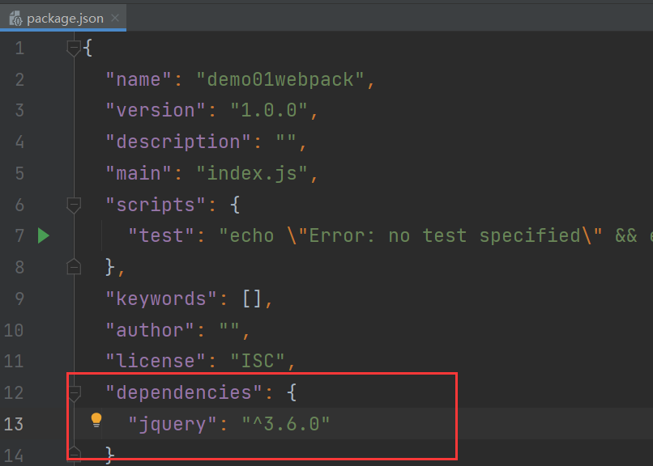

#### 2.2.3配置webpack

① 在项目根目录中，创建名为 `webpack.config.js` 的 webpack 配置文件，并初始化如下的基本配置：

```js
module.exports = {
    mode:'development' //mode 用于指定构建模式 可选值有development（开发） 和 production（生产）
}
```

mode 节点的可选值有两个，分别是：

`development `开发环境

> 不会对打包生成的文件进行代码压缩和性能优化
>
> 打包速度快，适合在开发阶段使用

`production  `生产环境

> 会对打包生成的文件进行代码压缩和性能优化
>
> 打包速度很慢，仅适合在项目发布阶段使用

② 在 `package.json` 的 `scripts `节点下，新增 `dev `脚本如下：

```json
"scripts": {
    "dev": "webpack"
}
```

③ 编写程序

在src下编写html和js

`index.html`

```html
<ul>
    <li>列表1</li>
    <li>列表2</li>
    <li>列表3</li>
    <li>列表4</li>
    <li>列表5</li>
    <li>列表6</li>
    <li>列表7</li>
</ul>
```

`index.js`

```js
import $ from "jquery" //此处使用ES6语法

$(function (){
    $("li:odd").css('background-color','red');
    $("li:even").css('background-color','pink');
})
```

④在终端中运行` npm run dev` 命令，启动 `webpack `进行项目的打包构建

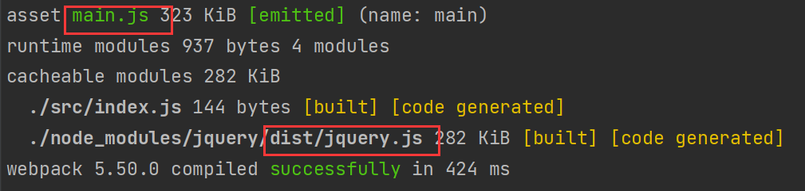

执行成功

在html中引入main.js

```html
<script src="../dist/main.js"></script>
```

### 2.3webpack.config.js 文件的作用

`webpack.config.js` 是 `webpack `的配置文件。`webpack `在真正开始打包构建之前，会先读取这个配置文件，从而基于给定的配置，对项目进行打包。

> 注意：由于 webpack 是基于 node.js 开发出来的打包工具，因此在它的配置文件中，支持使用 node.js 相关的语法和模块进行 webpack 的个性化配置。

#### webpack 中的默认约定

在 webpack 4.x 和 5.x 的版本中，有如下的默认约定：

> ① 默认的打包入口文件为 src -> index.js
>
> ② 默认的输出文件路径为 dist -> main.js

==注意==：可以在 webpack.config.js 中修改打包的默认约定

#### 自定义打包的入口与出口

在` webpack.config.js `配置文件中，通过 `entry `节点指定打包的入口。通过 `output `节点指定打包的出口。

示例代码如下：

```js
const path = require('path') //导入node.js中专门操作路径的模块

module.exports = {
    mode:'development', //mode 用于指定构建模式 可选值有development（开发） 和 production（生产）
    entry: path.join(__dirname,'./src/index.js'), //打包入口文件的位置，其中join是拼接方法，__dirname表示当前文件所在目录
    output: {
        path:path.join(__dirname,'./dist'),  //输出文件的位置
        filename:'test.js'  // 输出的文件名
    }
}
```

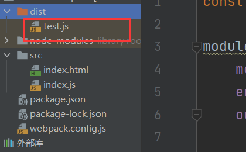


## 3.webpack 中的插件

### 3.1作用

通过安装和配置第三方的插件，可以拓展 `webpack `的能力，从而让 webpack 用起来更方便。最常用的webpack 插件有如下两个：

① `webpack-dev-server`

​	 类似于 node.js 阶段用到的 nodemon 工具

​	每当修改了源代码，webpack 会自动进行项目的打包和构建

② `html-webpack-plugin`

​	webpack 中的 HTML 插件（类似于一个模板引擎插件）

​	可以通过此插件自定制 index.html 页面的内容

### 3.2配置 webpack-dev-server

webpack-dev-server 可以让 webpack 监听项目源代码的变化，从而进行自动打包构建。

运行如下的命令，即可在项目中安装此插件：

```bash
npm install webpack-dev-server@3.11.2 -D
```


① 修改 package.json -> scripts 中的 dev 命令如下：

```json
"scripts": {
    "dev": "webpack serve"
}
```

② 再次运行 npm run dev 命令，重新进行项目的打包

```bash
npm run dev
```

运行前==查看依赖版本是否正确！！！！！==，否则会出现问题


如有未安装的插件，请安装。保证webpack-dev-server的版本在 `3.X`

```bash
npm install webpack@5.42.1 webpack-cli@4.7.2 -D  #  -D表示将包记录到devDependencies 开发环境包中
npm install webpack-dev-server@3.11.2 -D
```

③ 在浏览器中访问 http://localhost:8080 地址，查看自动打包效果

访问前要修改html引入的js路径，将`  ../dist/test.js`   修改为  `/test.js`  下面会解释，我们先看结果

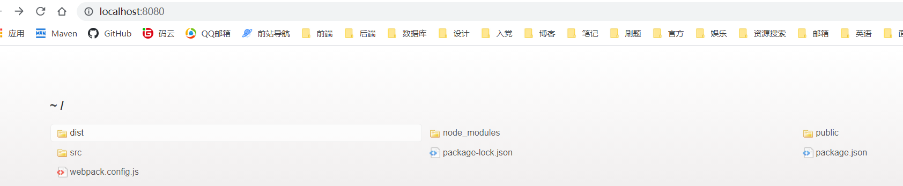

> ==注意==：`webpack-dev-server` 会启动一个实时打包的 http 服务器

④**打包生成的文件哪儿去了？**

1）不配置 webpack-dev-server 的情况下，webpack 打包生成的文件，会存放到实际的物理磁盘上

> 严格遵守开发者在 webpack.config.js 中指定配置
>
> 根据 output 节点指定路径进行存放

2）配置了 webpack-dev-server 之后，打包生成的文件存放到了内存中

> 不再根据 output 节点指定的路径，存放到实际的物理磁盘上
>
> 提高了实时打包输出的性能，因为内存比物理磁盘速度快很多

**生成到内存中的文件该如何访问？**

`webpack-dev-server `生成到内存中的文件，默认放到了项目的根目录中，而且是虚拟的、不可见的。 

==可以直接用 `/` 表示项目根目录，后面跟上要访问的文件名称，即可访问内存中的文件==

例如 /main.js 就表示要访问 `webpack-dev-server` 生成到内存中的 `main.js` 文件

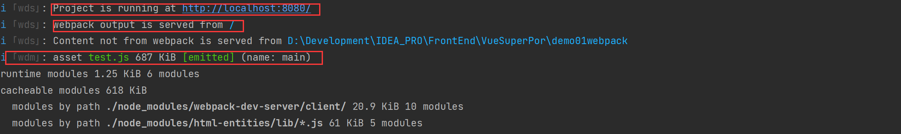

### 3.3配置html-webpack-plugin

html-webpack-plugin 是 webpack 中的 HTML 插件，可以通过此插件自定制 index.html 页面的内容。

需求：通过 html-webpack-plugin 插件，将 src 目录下的 index.html 首页，复制到项目根目录中一份！

运行如下的命令，即可在项目中安装此插件：

```bash
npm install html-webpack-plugin@5.3.2 -D
```

**配置 html-webpack-plugin**

```js
//导入html插件，得到一个构造函数
const HtmlPlugin = require("html-webpack-plugin")
//创建htmlPlugin实例对象
const htmlPlugin = new HtmlPlugin({
    template:'./src/index.html', // 指定源文件的位置
    filename:'./index.html' // 指定服务器中生成的文件位置
})
module.exports = {
    plugins: [htmlPlugin],  // 通过plugins数组，是的htmlPlugin生效
}
```

**解惑 html-webpack-plugin**

① 通过 HTML 插件复制到项目根目录中的 index.html 页面，也被放到了内存中

② HTML 插件在生成的 index.html 页面，自动注入了打包的 test.js 文件


**devServer 节点**

在 webpack.config.js 配置文件中，可以通过 devServer 节点对 webpack-dev-server 插件进行更多的配置，示例代码如下：

```js
module.exports = {
    devServer: {
        open:true, // 设置是否启动项目后自动打开浏览器
        host:'localhost', //修改默认访问ip 默认为localhost 可修改为 127.0.0.1 等
        port:80   // 修改默认访问端口为80
    }
}
```

==注意==：凡是修改了 webpack.config.js 配置文件，或修改了 package.json 配置文件，必须重启实时打包的服务器，否则最新的配置文件无法生效！

**查看结果**

通过访问/webpack-dev-server可以查看当前部署到内存中的文件分布情况，例如此处将输出目录改为

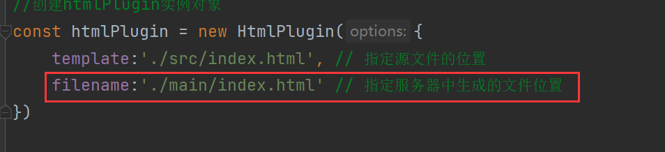

访问：http://localhost:8081/webpack-dev-server 后查看

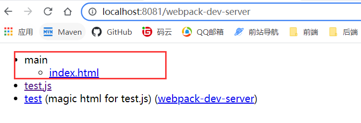

访问：http://localhost:/main/index.html 或直接访问 http://localhost:/main 都能访问到index.html


## 4.webpack 中的 loader

### 4.1loader 概述

在实际开发过程中，`webpack `默认只能打包处理以` .js` 后缀名结尾的模块。其他非` .js `后缀名结尾的模块，

`webpack `默认处理不了，需要调用 `loader `加载器才可以正常打包，否则会报错！

`loader `加载器的作用：协助 `webpack `打包处理特定的文件模块。比如：

> `css-loader` 可以打包处理` .css` 相关的文件
>
> `less-loader `可以打包处理` .less` 相关的文件
>
> `babel-loader `可以打包处理` webpack` 无法处理的高级 `JS` 语法

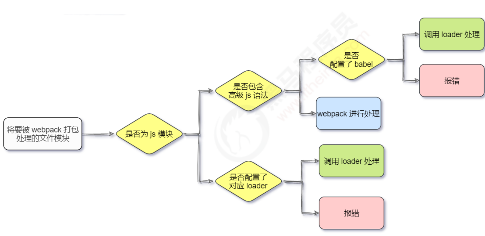

### 4.2配置loader

#### 处理CSS文件

下载安装

```bash
npm i style-loader@3.0.0 css-loader@5.2.6 -D #安装处理 css 文件的 loader
```

在` webpack.config.js` 的 `module -> rules` 数组中，添加 `loader` 规则如下：

```js
module:{ // 所有第三方文件模块的配配规则
    rules: [ //文件后缀名的匹配规则
        { test:/\.css$/, use: ['style-loader','css-loader']} //其中，test 表示匹配的文件类型， use 表示对应要调用的 loader
    ]
}
```

==注意==：

> use 数组中指定的 loader 顺序是固定的
>
> 多个 loader 的调用顺序是：从后往前调用

在src下的`index.js`中引入我们自己的css文件 目录结构及引入方式如下：

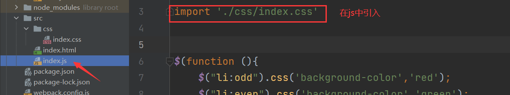

loader的处理过程

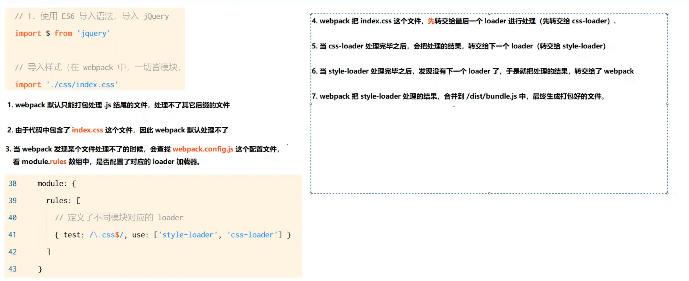

#### 处理less文件

下载安装

```bash
npm i less-loader@10.0.1 less@4.1.1 -D
```

在` webpack.config.js` 的 `module -> rules` 数组中，添加less的 `loader` 规则

如下：

```js
module:{ // 所有第三方文件模块的配配规则
    rules: [ //文件后缀名的匹配规则
        { test:/\.css$/, use: ['style-loader','css-loader']}, //其中，test 表示匹配的文件类型， use 表示对应要调用的 loader
        //添加less的规则
        { test:/\.less$/, use:['style-loader','css-loader','less-loader'] }  
    ]
}
```

编写less文件

```less
*{
  margin: 0;
  padding: 0;
  ul{
    list-style: none;
    text-decoration: none ;
    li{
      height: 30px;
      font-family: "Microsoft JhengHei UI Light";
      font-size: 18px;
    }
  }
}
```

导入

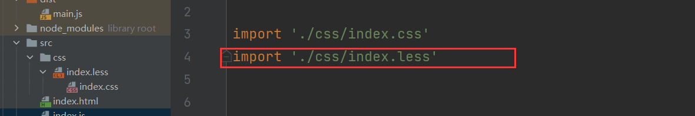

重启服务，结果

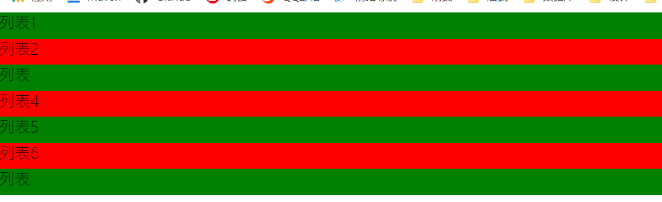

#### 处理图片

打包处理样式表中与`url` 路径相关的文件

```bash
npm i url-loader@4.1.1 file-loader@6.2.0 -D 
```

在` webpack.config.js `的 `module -> rules` 数组中，添加 `loader `规则如下：

```js
module:{ // 所有第三方文件模块的配配规则
    rules: [ //文件后缀名的匹配规则
        { test:/\.css$/, use: ['style-loader','css-loader']}, //其中，test 表示匹配的文件类型， use 表示对应要调用的 loader
        { test:/\.less$/, use:['style-loader','css-loader','less-loader'] },//添加less的规则
        //处理图片的loader，如果只有一个loader则 use 可使用字符串的方式，如果有多个则使用数组
        { test:/\.png|jpg|gif$/, use:'url-loader?limit=20000' } //添加url处理的匹配规则
    ]
}
```

> 注意：其中 ? 之后的是 loader 的参数项： limit 用来指定图片的大小，单位是字节（byte）， 只有 ≤ limit 大小的图片，才会被转为 base64 格式的图片

html添加img标签

```html

```

js中导入URL 并为img的src赋值

```js
import xin from './image/xin.png'
$('.box').attr('src',xin);
```

#### 处理高级语法

如果js代码中有webpack无法处理的高级js的代码时，需要借助插件进行。因为webpack 只能打包处理一部分高级的 JavaScript 语法。对于那些 webpack 无法处理的高级 js 语法，需要借助于 babel-loader 进行打包处理。例如 webpack 无法处理下面的 JavaScript 代码：

```js
function info(target){
    target.info = 'Student Info'
}
//装饰器
@info
class Student{
}
console.log(Student.info);
```

当保存运行时，会报错

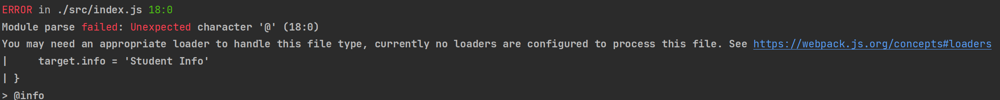

此时需要安装`babel-loader `进行打包处理

**安装 babel-loader 相关的包**

运行如下的命令安装对应的依赖包：

```bash
npm i babel-loader@8.2.2 @babel/core@7.14.6 @babel/plugin-proposal-decorators@7.14.5 -D 
```

在` webpack.config.js` 的 `module -> rules `数组中，添加 `loader `规则如下：

```js
{ test:/\.js$/,use:'babel-loader', exclude: /node_modules/}
```

> 注意：此处`exclude`是排除的意思，`node_modules`中是第三方的包，其中的js不需要做兼容处理，所以将`node_modules`

配置规则后还需进行babel配置

**配置 babel-loader**

在项目根目录下，创建名为 babel.config.js 的配置文件，定义 Babel 的配置项如下：

```js
module.exports ={
    //声明babel可用的插件
    plugins: [['@babel/plugin-proposal-decorators',{legacy:true}]]
}
```

详情请参考 Babel 的官网 https://babeljs.io/docs/en/babel-plugin-proposal-decorators

## 5.打包发布

### 5.1为什么要打包发布

项目开发完成之后，需要使用 webpack 对项目进行打包发布，主要原因有以下两点：

> ① 开发环境下，打包生成的文件存放于内存中，无法获取到最终打包生成的文件
>
> ② 开发环境下，打包生成的文件不会进行代码压缩和性能优化

为了让项目能够在生产环境中高性能的运行，因此需要对项目进行打包发布。

### 5.2配置 webpack 的打包发布

在 package.json 文件的 scripts 节点下，新增 build 命令如下：

```json
"scripts": {
    "dev": "webpack serve",
    "build": "webpack --mode production" // --model 指定的参数项
}
```

`--model `是一个参数项，用来指定 `webpack `的运行模式。`production `代表生产环境，会对打包生成的文件进行代码压缩和性能优化。

> ==注意==：通过 --model 指定的参数项，会覆盖 webpack.config.js 中的 model 选项。

 **把 JavaScript 文件统一生成到 js 目录中**

在 webpack.config.js 配置文件的 output 节点中，进行如下的配置：

```js
entry: path.join(__dirname,'./src/index.js'), //打包入口文件的位置，其中join是拼接方法，__dirname表示当前文件所在目录
    output: {
        path:path.join(__dirname,'./dist'),  //输出文件的位置
        filename:'js/test.js'  // 输出的文件名
    }
```

**把图片统一放到image目录下**

```js
{
    test: /\.png|jpg|gif$/,
        use: {
            loader: "url-loader",
            options: {
                limit: 2000,
                outputPath: 'image'
            }
        }
}
```

运行build命令

```bash
npm run build
```

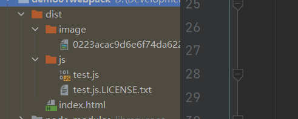

每次执行build都会生成文件，但是不会清理上次的文件（如果修改路径或改了名字的话，修改前的文件会留在dist目录下，同名会覆盖）所以我们需要用插件自动在构建时清理上次文件

**自动清理 dist 目录下的旧文件**

为了在每次打包发布时自动清理掉 dist 目录中的旧文件，可以安装并配置 `clean-webpack-plugin` 插件：

```bash
npm install clean-webpack-plugin@3.0.0 -D
```

在`webpack.config.js`中导入对应的插件并获得其实例对象

```js
//导入插件
const {CleanWebpackPlugin} = require("clean-webpack-plugin")
//创建插件的实例化对象
const cleanWebpackPlugin = new CleanWebpackPlugin()
```

将实例对象加入到`module.export`中的`plugins`中

```js
plugins: [htmlPlugin,cleanWebpackPlugin],  // 在plugins中添加插件
```

## 6.Source Map

### 6.1什么是Source Map

前端项目在投入生产环境之前，都需要对 JavaScript 源代码进行压缩混淆，从而减小文件的体积，提高文件的加载效率。此时就不可避免的产生了另一个问题：对压缩混淆之后的代码除错（debug）是一件极其困难的事情变量被替换成没有任何语义的名称空行和注释被剔除

Source Map 就是一个信息文件，里面储存着位置信息。也就是说，Source Map 文件中存储着压缩混淆后的代码，所对应的转换前的位置。有了它，出错的时候，除错工具将直接显示原始代码，而不是转换后的代码，能够极大的方便后期的调试。

### 6.2默认 Source Map 的问题

在开发环境下，==webpack 默认启用了 Source Map 功能==。当程序运行出错时，可以直接在控制台提示错误行的位置，并定位到具体的源代码：

开发环境下默认生成的 Source Map，记录的是==生成后==的代码的位置。会导致运行时报错的行数与源代码的行数不一致的问题。示意图如下：

报错行数

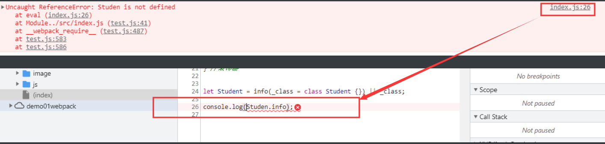

实际代码中的行数

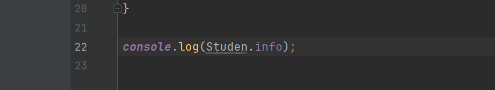

### 6.3解决默认 Source Map 的问题

开发环境下，推荐在` webpack.config.js `中添加如下的配置，即可保证运行时报错的行数与源代码的行数

```js
devtool: 'eval-source-map'
```

此时报错与源代码保持一致：

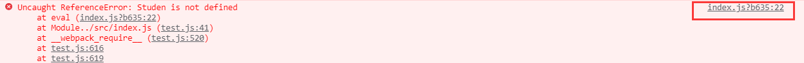

### 6.4配置Source Map

在生产环境下，如果省略了 `devtool `选项，则最终生成的文件中不包含` Source Map`。这能够防止原始代码通 过 `Source Map `的形式暴露给别有所图之人。

#### 只定位行数不暴露源码

在生产环境下，如果只想定位报错的具体行数，且不想暴露源码。此时可以将 devtool 的值设置为

```js
devtool: 'nosources-source-map'
```

实际效果如图所示：

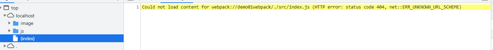

#### 定位行数且暴露源码

在生产环境下，如果想在定位报错行数的同时，展示具体报错的源码。此时可以将 devtool 的值设置为

```js
devtool: 'source-map'
```

实际效果如图所示：

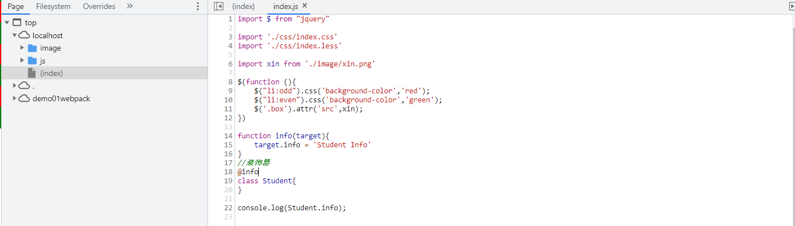

采用此选项后：你应该将你的服务器配置为，不允许普通用户访问 source map 文件！**Source Map**

### 6.5Source Map 的最佳实践


#### 开发环境下： 

建议把 `devtool `的值设置为` eval-source-map`

好处：可以精准定位到具体的错误行

#### 生产环境下： 

建议关闭 `Source Map` 或将 `devtool `的值设置为 `nosources-source-map `

好处：防止源码泄露，提高网站的安全性

## 7.路径处理

当我们要从深层文件访问外层文件时我们会使用相对路径中的  ``../``  的方式返回上级目录，但是当层数过多时，就会难于阅读，所以我们可以通过过设置访问路径的方式设置别名，来编写相对路径

目录关系

数据存放在src下的data.js,而student_info.js中使用了data.js中的数据，通过入口js（index.js）调用student_info.js在console中打印data中的数据

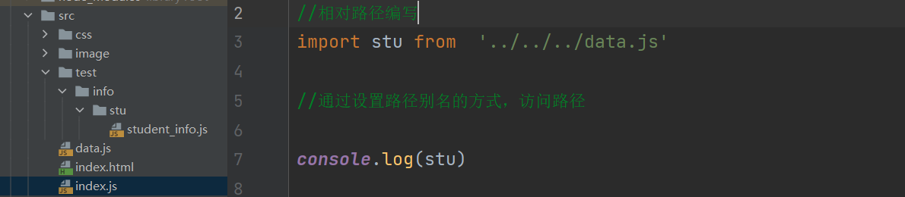

#### 原始的路径编写

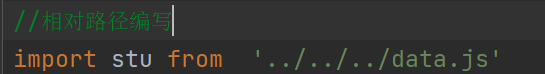

#### 通过设置路径别名

在`webpack.config.js`文件中`module.exports`中添加`resolve`，代码如下：

```js
resolve: {
        alias: {
            //告诉webpack，代码中的 @ 符号表示src这一层目录
            '@': path.join(__dirname,'./src/')
        }
    }
```

更改别名后的路径编写

```js
//相对路径编写
// import stu from  '../../../data.js'

//通过设置路径别名的方式，访问路径
import stu from  '@/data'  // @ 符号代表src目录

console.log(stu)
```

结果:

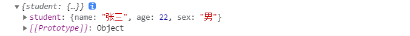

# 二、Vue基础语法

详情查看    [vue.md](./vue.md)

# 三、Vue Cli

## 1、单页面程序

单页Web应用（single page web application，SPA），就是只有一张Web页面的应用，是加载单个HTML 页面并在用户与应用程序交互时动态更新该页面的Web应用程序。所有功能与交互都在这个唯一的页面进行。

## 2、什么是vue-cli

vue-cli 是 Vue.js 开发的标准工具。它简化了程序员基于 webpack 创建工程化的 Vue 项目的过程。引用自 vue-cli 官网上的一句话：程序员可以专注在撰写应用上，而不必花好几天去纠结 `webpack `配置的问题。

中文官网：https://cli.vuejs.org/zh/

安装

```bash
npm install -g @vue/cli # 安装vue cli
vue -V # 检查是否安装
```

## 3、vue-cli 的使用

### 3.1安装

```bash
npm install -g @vue/cli # 安装vue cli
vue -V # 检查是否安装
```

### 3.2项目创建过程

在终端下运行如下的命令，创建指定名称的项目，项目会创建在你打开命令的目录下，所以再创建前先定位到你要创建的项目目录下：

```bash
vue cerate vue-cli-demo # vue-cli-demo为项目名
```

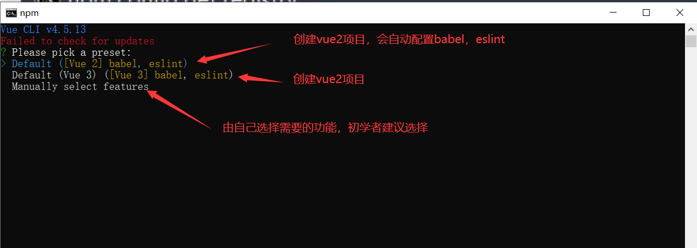

回车选择需要的功能

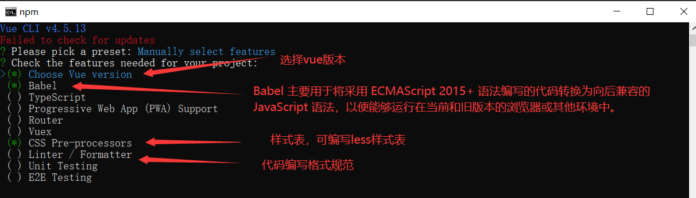

回车选择vue版本

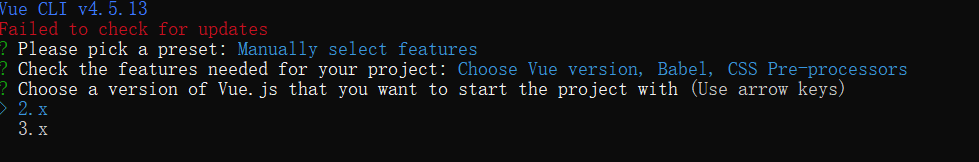

回车选择css预处理器

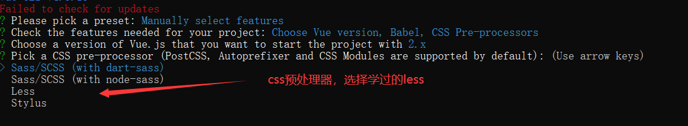

回车选择配置文件创建配置形式，默认选择第一项独自配置

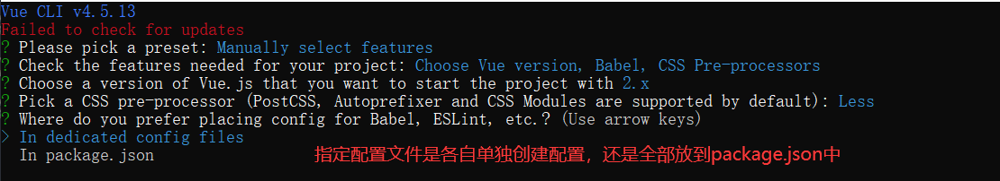

回车是否保存上述选择的预设作为下次项目的创建


输入y回车后会让你输入预设的名称，方便下次使用，输入后回车即可，等待创建项目。


### 3.3、vue 项目中 src 目录的构成：

```
assets 文件夹：存放项目中用到的静态资源文件，例如：css 样式表、图片资源
components 文件夹：程序员封装的、可复用的组件，都要放到 components 目录下
main.js 是项目的入口文件。整个项目的运行，要先执行 main.js
App.vue 是项目的根组件。
```

## 4、vue项目的运行流程

在工程化的项目中，`vue `要做的事情很单纯：通过` main.js` 把 `App.vue` 渲染到 `index.html` 的指定区域中。

其中：

> ① App.vue 用来编写待渲染的模板结构
>
> ② index.html 中需要预留一个 el 区域
>
> ③ main.js 把 App.vue 渲染到了 index.html 所预留的区域中

# 四、vue组件

## 1、什么是组件化开发

组件化开发指的是：根据封装的思想，把页面上可重用的 UI 结构封装为组件，从而方便项目的开发和维护。

## 2、vue中的组件化开发

vue 是一个支持组件化开发的前端框架。

vue 中规定：组件的后缀名是 .vue。之前接触到的 App.vue 文件本质上就是一个 vue 的组件。

## 3、vue组件的三个组成部分

每个 .vue 组件都由 3 部分构成，分别是：

> `template `-> 组件的模板结构
>
> `script `-> 组件的 `JavaScript `行为
>
> `style `-> 组件的样式

其中，每个组件中必须包含 `template `模板结构，而 `script `行为和 `style `样式是可选的组成部分。


### 3.1template

vue 规定：每个组件对应的模板结构，需要定义到 `<template> `节点中。

==注意==： 

template 是 vue 提供的容器标签，只起到包裹性质的作用，它不会被渲染为真正的 DOM 元素

template 中只能包含唯一的根节点


### 3.2script

vue 规定：开发者可以在 `<script> `节点中封装组件的 `JavaScript `业务逻辑。

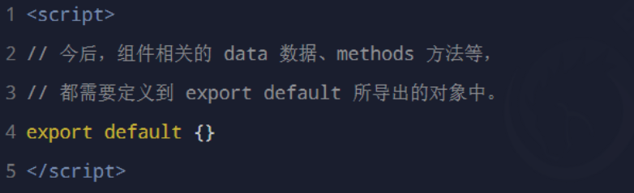

### 3.3style

vue 规定：组件内的 <style> 节点是可选的，开发者可以在 <style> 节点中编写样式美化当前组件的 UI 结构。


### 3.4让style中支持less语法

在 <style> 标签上添加 lang="less" 属性，即可使用 less 语法编写组件的样式：

可在style添加属性如：lang=‘less’ 表示支持less样式语法

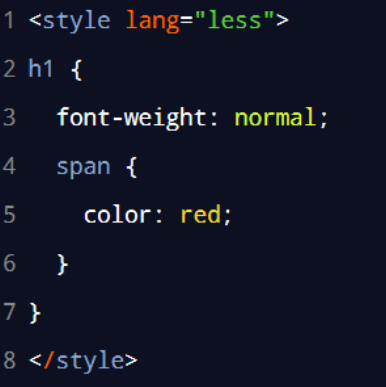

## 4、组件之间的父子关系

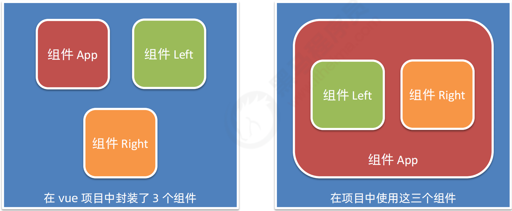

> 组件在被封装好之后，彼此之间是相互独立的，不存在父子关系 。在使用组件的时候，根据彼此的嵌套关系，形成了父子关系、兄弟关系

## 5、使用组件的三个步骤

步骤1：使用 import 语法导入需要的组件

步骤2：使用 components 节点注册组件

步骤3：以标签形式使用刚才注册的组件

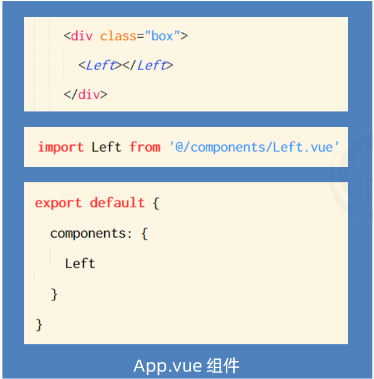


==注意==：通过 components注册的是私有子组件

例如：

> 在组件 A 的 components 节点下，注册了组件 F。
>
> 则组件 F 只能用在组件 A 中；不能被用在组件 C 中。

## 6、注册全局组件

在` vue `项目的 `main.js `入口文件中，通过 `Vue.component()` 方法，可以注册全局组件。示例代码如下：

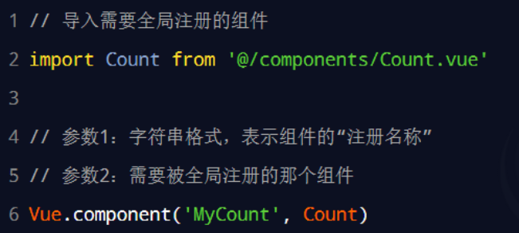

## 7、组件的props

props 是组件的自定义属性，在封装通用组件的时候，合理地使用 props 可以极大的提高组件的复用性！

它的语法格式如下：

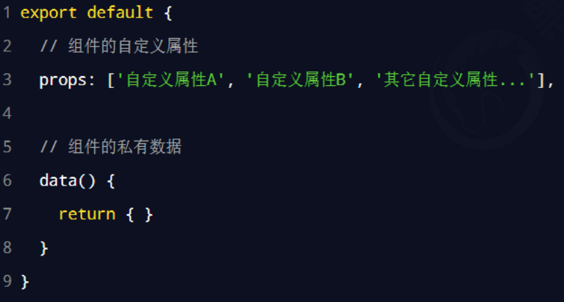

==注意==：props是只读的

vue 规定：组件中封装的自定义属性是只读的，程序员不能直接修改 props 的值。否则会直接报错：

要想修改 `props `的值，可以把 `props `的值转存到 `data `中，因为 `data `中的数据都是可读可写的！

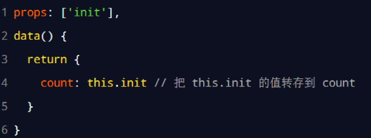

### props的default默认值

在声明自定义属性时，可以通过 `default `来定义属性的默认值。可以通过 `type `来定义属性的值类型。

可以通过 required 选项，将属性设置为必填项，强制用户必须传递属性的值。示例代码如下：

```js
export default {
  props:{
    id:{
      default:0,
      type:Number,
      required:true
    }
  }
}
```

## 8、组件之间的样式冲突问题

默认情况下，写在 .vue 组件中的样式会全局生效，因此很容易造成多个组件之间的样式冲突问题。导致组件之间样式冲突的根本原因是：

> 单页面应用程序中，所有组件的 DOM 结构，都是基于唯一的 index.html 页面进行呈现的
>
> 每个组件中的样式，都会影响整个 index.html 页面中的 DOM 元素

### 8.1如何解决冲突问题

#### 方法一：

我们可以给每个标签加上标志

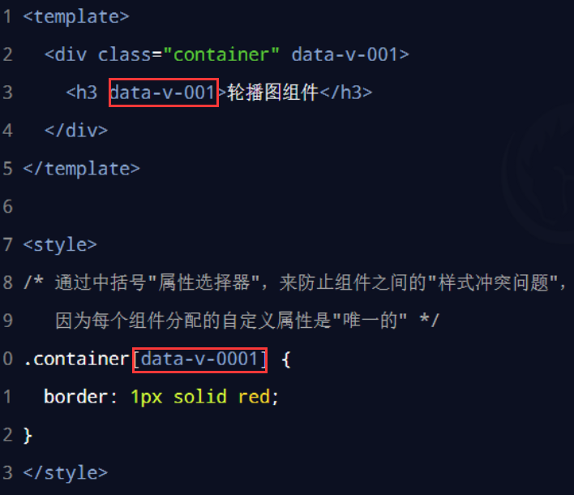

#### 方法二：（推荐）

style 节点的scoped属性，为了提高开发效率和开发体验，vue 为 style 节点提供了 scoped 属性，从而防止组件之间的样式冲突问题

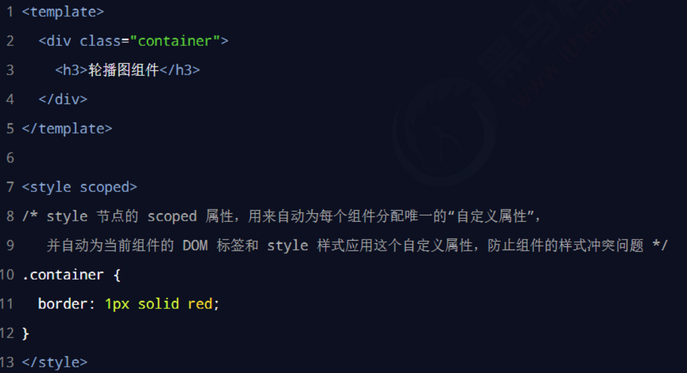

### 8.2样式穿透

如果给当前组件的 style 节点添加了 scoped 属性，则当前组件的样式对其子组件是不生效的。如果想让某些样式对子组件生效，可以使用 `/deep/` 深度选择器。

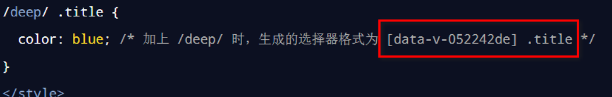

# 五、vue实例的生命周期

## 1、生命周期和生命周期函数

生命周期（Life Cycle）是指一个组件从创建 -> 运行 -> 销毁的整个阶段，强调的是一个时间段。

生命周期函数：是由 vue 框架提供的内置函数，会伴随着组件的生命周期，自动按次序执行。

> 注意：生命周期强调的是时间段，生命周期函数强调的是时间点。

## 2、组件生命周期函数的分类

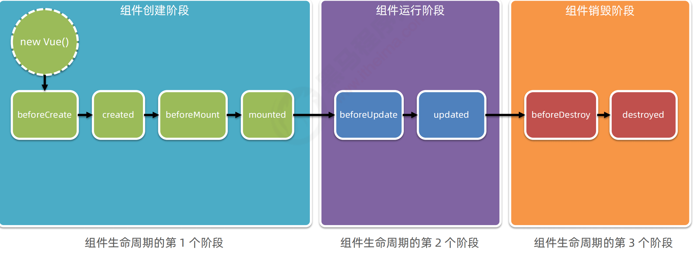

## 3、生命周期图示

可以参考 vue 官方文档给出的“生命周期图示”，进一步理解组件生命周期执行的过程：

https://cn.vuejs.org/v2/guide/instance.html#


# 六、组件之间的数据共享

## 1、组件之间的关系

在项目开发中，组件之间的最常见的关系分为如下两种： 

> 父子关系
>
> 兄弟关系

## 2、父子组件之间的数据共享

父子组件之间的数据共享又分为：`父 -> 子`   或  `子 -> 父`

### ① 父 -> 子共享数据

父组件向子组件共享数据需要使用自定义属性。示例代码如下：

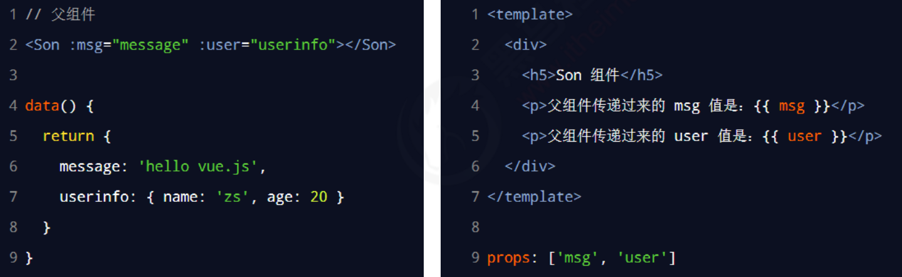

### ② 子 -> 父共享数据

子组件向父组件共享数据使用自定义事件。示例代码如下：

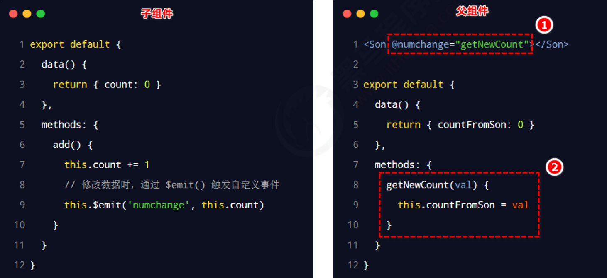

## 3、兄弟组件之间的数据共享

在 `vue2.x` 中，兄弟组件之间数据共享的方案是 `EventBus`。

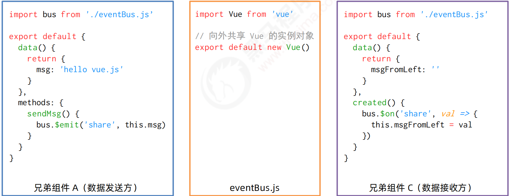

### 3.1EventBus的使用步骤

① 创建 eventBus.js 模块，并向外共享一个 Vue 的实例对象

② 在数据发送方，调用 bus.$emit('事件名称', 要发送的数据) 方法触发自定义事件

③ 在数据接收方，调用 bus.$on('事件名称', 事件处理函数) 方法注册一个自定义事件

# 七、ref引用

## 1、什么是 ref引用

ref 用来辅助开发者在不依赖于 jQuery 的情况下，获取 DOM 元素或组件的引用。

每个 vue 的组件实例上，都包含一个refs 对象，里面存储着对应的 DOM 元素或组件的引用。

默认情况下，组件的 $refs 指向一个空对象。

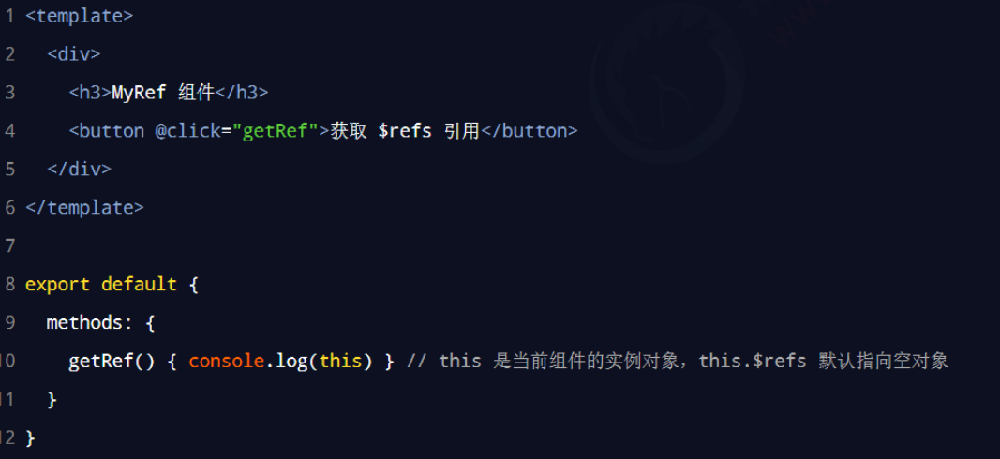

## 2、使用ref引用DOM元素

如果想要使用 ref 引用页面上的 DOM 元素，则可以按照如下的方式进行操作：

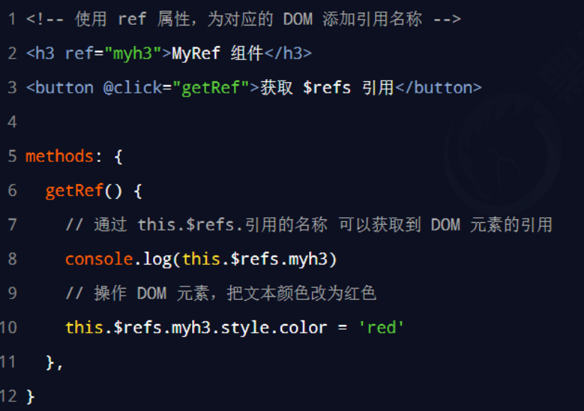

## 3、使用ref引用组件实例

如果想要使用 ref 引用页面上的组件实例，则可以按照如下的方式进行操作：

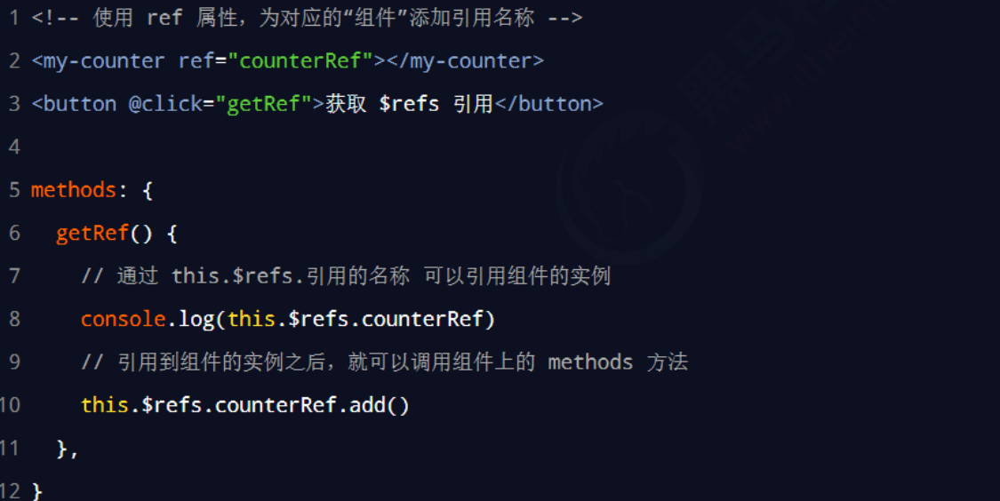

## 4、控制文本框和按钮的按需切换

通过布尔值 inputVisible 来控制组件中的文本框与按钮的按需切换。示例代码如下：

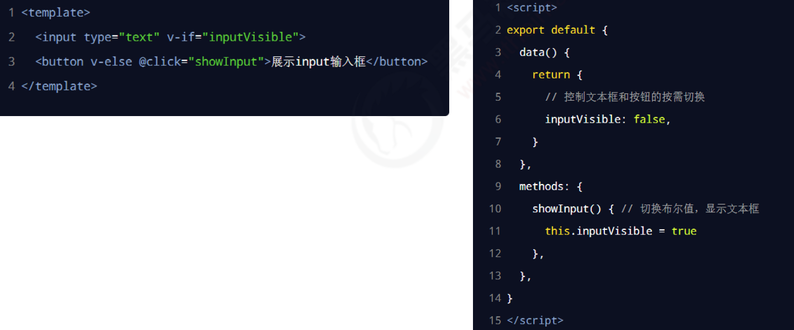

### 让文本框自动获得焦点

当文本框展示出来之后，如果希望它立即获得焦点，则可以为其添加 `ref `引用，并调用原生 `DOM `对象的

`.focus() `方法即可。示例代码如下：

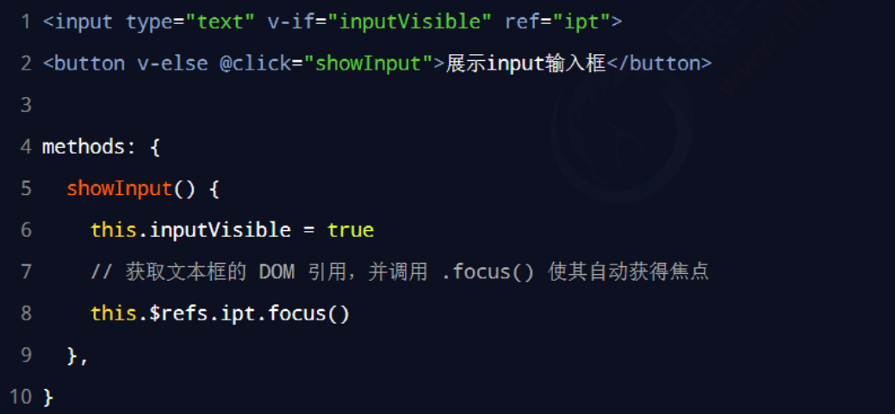

## 5、`this.$nextTick(cb)`方法

由于使用的是v-if，所以存在dom元素的销毁与创建，所以如果此时调用时间，由于DOM元素未被创建所以需要延后调用。

组件的 `$nextTick(cb) `方法，会把 `cb `回调推迟到下一个 `DOM `更新周期之后执行。

通俗的理解是：等组件的DOM 更新完成之后，再执行 cb 回调函数。从而能保证 cb 回调函数可以操作到最新的 DOM 元素。

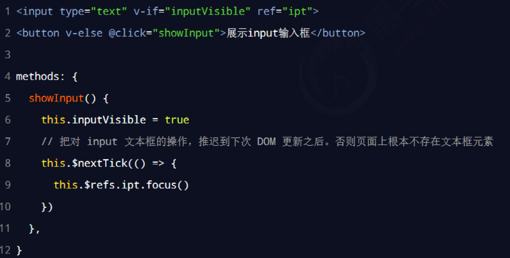

# 八、axios

## 1、axios 的基本使用

### 发起 GET 请求：

```js
axios({
  // 请求方式
  method: 'GET',
  // 请求的地址
  url: 'http://www.liulongbin.top:3006/api/getbooks',
  // URL 中的查询参数
  params: {
    id: 1
  }
}).then(function (result) {
  console.log(result)
})
```

### 发起 POST 请求：

```js
document.querySelector('#btnPost').addEventListener('click', async function () {
  // 如果调用某个方法的返回值是 Promise 实例，则前面可以添加 await！
  // await 只能用在被 async “修饰”的方法中
  const { data: res } = await axios({
    method: 'POST', 
    url: 'http://www.liulongbin.top:3006/api/post',
    data: {
      name: 'zs',
      age: 20
    }
  })
  console.log(res)
})
```

