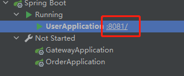

# 一、常见问题

## 1、IDEA  Services窗口启动应用后不显示端口号

正常显示如下：

### 解决不显示端口号问题

访问路径`C:\Users\用户名\AppData\Local\Temp` (用户名替换自己的用户名)

AppData文件夹默认是看不见的

清空之前关闭IDEA软件

这个目录存放的是软件的临时文件, 我是一下都清空了Temp下的所有文件, 会有提示软件正在占用, 只要不是IDEA的, 跳过就行了.

清空后打开IDEA, 启动程序后, 端口号就会出现了.

# 二、快捷键