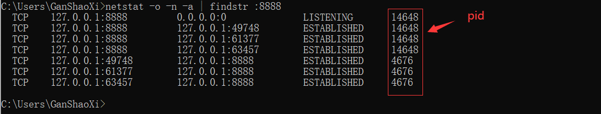

# 关于程序中的端口占用问题

## 按端口号杀死进程

当运行web程序时常常会遇到端口被占用的情况，我们有两种处理办法：

### 1、修改访问的端口号

### 2、用cmd关闭相应的端口

打开命令行，输入netstat -o -n -a | findstr :8888，我们就能看到相关的端口号及其状态。

```sh
netstat -o -n -a | findstr :8888
```



关闭正处与监听状态（Listening）的端口号8888，最后一行对应的是进程的PID，输入命令taskkill /F /PID 3116

```sh
taskkill /F /PID 14648
```


这样就完成了，我们再次查看8080端口已经被关闭了


