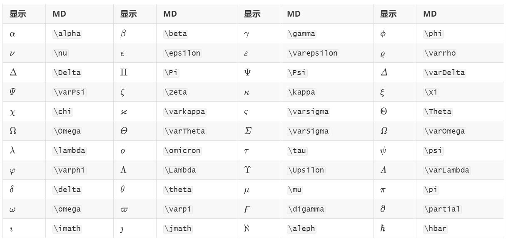
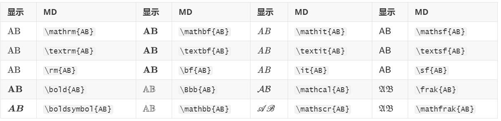
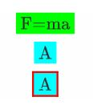
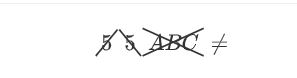
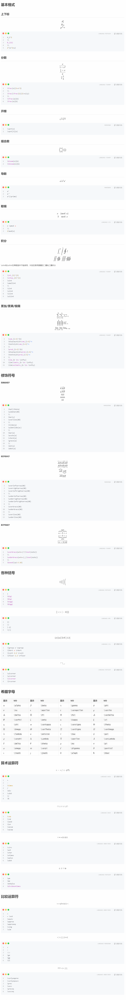
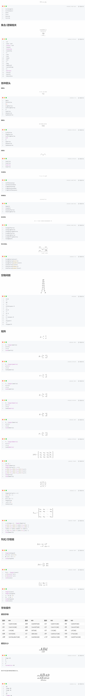
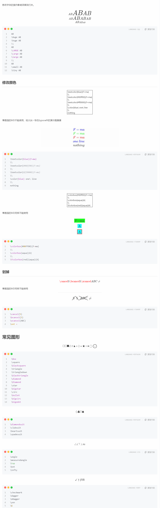

# 基本格式

## 上下标


A21B122x2+yA12B122x2+y

```mipsasm
A_1^2
\\
B_{12}
\\
2^{x^2+y}
```

## 分数


x1+x212+xyababx1+x212+xyabab


```fsharp
复制代码123456LANGUAGE-FSHARP\frac{x}{1+x^2}
\\
\frac{\frac{1}{2}+x}{y}
\\
\tfrac{a}{b}
\frac{a}{b}
```

## 开根


x−−√x−−√3xx3


```markdown
复制代码12MARKDOWN\sqrt{x}
\sqrt[3]{x}
```

## 组合数


(nk)(nk)(nk)(nk)


```fsharp
复制代码12LANGUAGE-FSHARP\binom{n}{k}
\tbinom{n}{k}
```

## 导数


a′a′′a′a′a″a′


```markdwon
复制代码123MARKDWONa'
a''
a^{\prime}
```

## 取模


x(moda)2modxx(moda)2modx


```css
复制代码123LANGUAGE-CSSx \pmod a
\\
2\mod{x}
```

## 积分


∫21∫21∮∫∬∯∭∰∫12∫21∮⁡∫∬∯⁡∭∰


\oiint和\oiiint在博客园中不能使用，对应的是带圆圈的二重和三重积分

```fsharp
复制代码123456789LANGUAGE-FSHARP\int_{1}^{2}
\intop_{2}^{1}
\oint
\smallint
\\
\iint
\oiint
\iiint
\oiiint
```

## 累加/累乘/极限


∑i=1k∑i=1n∑ni=1∏i=1k∏i=1n∏ni=1limk→∞limk→∞limk→∞∑i=1k∑i=1n∑i=1n∏i=1k∏i=1n∏i=1nlimk→∞limk→∞limk→∞


```fsharp
复制代码1234567891011LANGUAGE-FSHARP\sum_{i=1}^{k}
\displaystyle\sum_{i=1}^n
\textstyle\sum_{i=1}^n
\\
\prod_{i=1}^{k}
\displaystyle\prod_{i=1}^n
\textstyle\prod_{i=1}^n
\\
\lim_{k \to \infty}
\lim\limits_{k \to \infty}
\lim\nolimits_{k \to \infty}
```

# 修饰符号

**简单的帽子**


θ^ABˆy¯AB¯¯¯¯¯¯¯¯a~ac˜a¯a´aˇa`a˙a¨θ^AB^y¯AB¯a~ac~a¯a´aˇa`a˙a¨


```markdopwn
复制代码12345678910111213141516MARKDOPWN\hat{\theta}
\widehat{AB}
\\
\bar{y}
\overline{AB}
\\
\tilde{a}
\widetilde{ac}
\\
\bar{a}
\acute{a}
\check{a}
\grave{a}
\\
\dot{a}
\ddot{a}
```

**帽子和袜子**


AB←−−AB−→−AB←→AB←−−AB−→−AB←→ABABAB¯¯¯¯¯¯¯¯AB––––AB←AB→AB↔AB←AB→AB↔AB⏞AB⏟AB¯AB_


```markdown
复制代码12345678910111213MARKDOWN\overleftarrow{AB}
\overrightarrow{AB}
\overleftrightarrow{AB}
\\
\underleftarrow{AB}
\underrightarrow{AB}
\underleftrightarrow{AB}
\\
\overbrace{AB}
\underbrace{AB}
\\
\overline{AB}
\underline{AB}
```

**盖子和盒子**


a+b+cnotea+b+cnoteπ=3.14a+b+c⏞notea+b+c⏟noteπ=3.14


```fsharp
复制代码12345LANGUAGE-FSHARP\overbrace{a+b+c}^{\text{note}}
\\
\underbrace{a+b+c}_{\text{note}}
\\
\boxed{\pi=3.14}
```

# 各种括号


((((((((((


```mipsasm
复制代码12345LANGUAGE-MIPSASM(
\big(
\Big(
\bigg(
\Bigg(
```


[]<>|−2|{}[]<>|−2|{}


```xml
复制代码1234LANGUAGE-XML[]
<>
|-2|
\{\}
```


⟮x⟯∥a∥⌈2.6⌉⌊1.2⌋⟮x⟯‖a‖⌈2.6⌉⌊1.2⌋


```css
复制代码1234LANGUAGE-CSS\lgroup x \rgroup
\lVert a \rVert
\lceil 2.6 \rceil
\lfloor 1.2 \rfloor
```


┌┐└┘⌜⌝⌞⌟


```mipsasm
复制代码1234LANGUAGE-MIPSASM\ulcorner
\urcorner
\llcorner
\lrcorner
```

# 希腊字母



# 算术运算符


+−×/÷⋅#%+−×/÷⋅#%


```bash
复制代码12345678LANGUAGE-BASH+
-
\times
/
\div
\cdot
\#
\%
```


∩∪∧∨⊔⊓∩∪∧∨⊔⊓


```bash
复制代码123456LANGUAGE-BASH\cap
\cup
\land
\lor
\sqcup
\sqcap
```


∘∗⋆⊗⊕⊙∘∗⋆⊗⊕⊙


```undefined
复制代码123456LANGUAGE-UNDEFINED\circ
\ast
\star
\otimes
\oplus
\odot
```


±∓∔⋇±∓∔⋇


```mipsasm
复制代码1234LANGUAGE-MIPSASM\pm
\mp
\dotplus
\divideontimes
```

# 比较运算符


==≢≈≊≅∼==≢≈≊≅∼


```undefined
复制代码1234567LANGUAGE-UNDEFINED=
= \not
\equiv
\approx
\approxeq
\cong
\sim
```


<>≤≥≫≪<>≤≥≫≪


```markdown
复制代码123456LANGUAGE-MARKDOWN<
>
\le
\ge
\gg
\ll
```


⋞⋟≺≻⪯⪰⋞⋟≺≻⪯⪰


```undefined
复制代码123456LANGUAGE-UNDEFINED\curlyeqprec
\curlyeqsucc
\prec
\succ
\preceq
\succeq
```

# 集合/逻辑相关


∈∋⊄⊅⊆⊇∩∪∧∨¬∅∅∵∀∃∴∈∋⊄⊅⊆⊇∩∪∧∨¬∅∅∵∀∃∴


```mipsasm
复制代码1234567891011121314151617181920LANGUAGE-MIPSASM\in
\owns \not
\subset \not
\supset
\subseteq
\supseteq
\\
\cap
\cup
\land
\lor
\\
\neg
\emptyset
\varnothing
\\
\because
\forall
\exists
\therefore
```

# 各种箭头

**细箭头**


←←→→↔↑↓↕←←→→↔↑↓↕


```css
复制代码123456789LANGUAGE-CSS\gets
\leftarrow
\to
\rightarrow
\leftrightarrow
\\
\uparrow
\downarrow
\updownarrow
```

**粗箭头**


⇐⇒⇔⟺⇑⇓⇕⇐⇒⇔⟺⇑⇓⇕


```verilog
复制代码12345678LANGUAGE-VERILOG\Leftarrow
\Rightarrow
\Leftrightarrow
\iff
\\
\Uparrow
\Downarrow
\Updownarrow
```

**斜箭头**


↗↘↙↖↗↘↙↖


```mipsasm
复制代码1234LANGUAGE-MIPSASM\nearrow
\searrow
\swarrow
\nwarrow
```

**半边箭头**


↼↽⇀⇁⇌↼↽⇀⇁⇌


```undefined
复制代码12345LANGUAGE-UNDEFINED\leftharpoonup
\leftharpoondown
\rightharpoonup
\rightharpoondown
\rightleftharpoons
```

**特殊箭头**


↦⇝↩↪↦⇝↩↪


```undefined
复制代码1234LANGUAGE-UNDEFINED\mapsto
\leadsto
\hookleftarrow
\hookrightarrow
```

**加长箭头**


⟵⟶⟷⟸⟹⟺⟼⟵⟶⟷⟸⟹⟺⟼


```undefined
复制代码1234567LANGUAGE-UNDEFINED\longleftarrow
\longrightarrow
\longleftrightarrow
\Longleftarrow
\Longrightarrow
\Longleftrightarrow
\longmapsto
```

**带文本箭头**


−→−over−→−over−→−−underover←−−over←−−−under←−−−underover→over→over→underover←over←under←underover


```css
复制代码123456LANGUAGE-CSS\xrightarrow{over}
\xrightarrow[over]{}
\xrightarrow[under]{over}
\xleftarrow[]{over}
\xleftarrow[under]{}
\xleftarrow[under]{over}
```

# 空格间距


ABABABABA BABABABABABABABA BABABAB


```markdown
复制代码123456789101112131415MARKDOWNA\!B
\\
AB
\\
A\thinspace B
\\
A\:B
\\
A\ B
\\
A \enspace B
\\
A\quad B
\\
A\qquad B
```

# 矩阵


A=acbdA=abcd


```ruby
复制代码1234LANGUAGE-RUBYA = \begin{matrix}
a & b\\
c & d
\end{matrix}
```


B=(acbd)B=(abcd)


```mipsasm
复制代码1234LANGUAGE-MIPSASMB = \begin{pmatrix}
a & b\\
c & d
\end{pmatrix}
```


C=∣∣∣acbd∣∣∣C=|abcd|


```ruby
复制代码1234LANGUAGE-RUBYC = \begin{vmatrix}
a & b\\
c & d
\end{vmatrix}
```


D=[acbd]D=[abcd]


```mipsasm
复制代码1234LANGUAGE-MIPSASMD = \begin{bmatrix}
a & b\\
c & d
\end{bmatrix}
```


E=∥∥∥acbd∥∥∥E=‖abcd‖


```ruby
复制代码1234LANGUAGE-RUBYE = \begin{Vmatrix}
a & b\\
c & d
\end{Vmatrix}
```


F={acbd}F={abcd}


```mipsasm
复制代码1234LANGUAGE-MIPSASMF = \begin{Bmatrix}
a & b\\
c & d
\end{Bmatrix}
```


[A b]=⎡⎣⎢⎢a11a21a31a12a22a32a13a23a33b1b2b3⎤⎦⎥⎥[A b]=[a11a12a13b1a21a22a23b2a31a32a33b3]


```fsharp
复制代码12345678LANGUAGE-FSHARP[A\ b] = 
\begin{bmatrix}
\begin{array}{c c c|c}
a_{11} & a_{12} & a_{13} & b_1\\
a_{21} & a_{22} & a_{23} & b_2\\
a_{31} & a_{32} & a_{33} & b_3\\
\end{array}
\end{bmatrix}
```


adgbehcfiabcdefghi


```css
复制代码1234567LANGUAGE-CSS\begin{array}{c:c:c}
a & b & c \\ 
\hline
d & e & f \\
\hdashline
 g & h & i
\end{array}
```


Ln×n=⎡⎣⎢⎢⎢⎢⎢a11a21⋮an1a12a22⋮an2⋯⋯⋱⋯a1na2n⋮ann⎤⎦⎥⎥⎥⎥⎥Ln×n=[a11a12⋯a1na21a22⋯a2n⋮⋮⋱⋮an1an2⋯ann]


```fsharp
复制代码123456LANGUAGE-FSHARPL_{n\times n} = \begin{bmatrix}
a_{11} & a_{12} & \cdots & a_{1n} \\ 
a_{21} & a_{22} & \cdots & a_{2n} \\ 
\vdots & \vdots &\ddots & \vdots\\
a_{n1} & a_{n2} & \cdots & a_{nn} \\ 
\end{bmatrix}
```

# 列式/方程组


f(x)=(x+1)2=x2+2x+1f(x)=(x+1)2=x2+2x+1


```ruby
复制代码1234LANGUAGE-RUBY\begin{aligned}
f(x) &= (x+1)^2\\
&= x^2 + 2x + 1
\end{aligned}
```


f(x)={abif bif af(x)={aif bbif a


```fsharp
复制代码1234LANGUAGE-FSHARPf(x) = \begin{cases}
a &\text{if b}\\
b &\text{if a}\\
\end{cases}
```


{x+2y3x−y=1=5{x+2y=13x−y=5


```ruby
复制代码123456LANGUAGE-RUBY\begin{cases}
\begin{aligned}
x + 2y &= 1\\
3x - y &= 5
\end{aligned}
\end{cases}
```

# 字体操作

## 修改字体



## 修改大小


dABddABdABddAB


```mipsasm
复制代码12345LANGUAGE-MIPSASM\Huge AB
d
\\
d
\normalsize AB
```

修改字体的操作影响效果到行末。


ABABABABABABABABABABABABABABABABABABABAB


```sql
复制代码123456789101112LANGUAGE-SQLAB
\Huge AB
\huge AB
\\
AB
\LARGE AB
\Large AB
\large AB
\\
AB
\small AB
\tiny AB
```

## 修改颜色


\textcolor{blue}{F=ma}
\\
\textcolor{#00ff00}{F=ma}
\\
\textcolor{#ff0000}{F=ma}
\\
\color{blue} one\ line
\\
nothing\textcolor{blue}{F=ma}\\\textcolor{#00ff00}{F=ma}\\\textcolor{#ff0000}{F=ma}\\\color{blue} one\ line\\nothing


博客园的MD不能使用，给大伙一张在typora中的演示图康康


```mipsasm
复制代码123456789LANGUAGE-MIPSASM\textcolor{blue}{F=ma}
\\
\textcolor{#00ff00}{F=ma}
\\
\textcolor{#ff0000}{F=ma}
\\
\color{blue} one\ line
\\
nothing
```


\colorbox{#00ff00}{F=ma}
\\
\colorbox{aqua}{A}
\\
\fcolorbox{red}{aqua}{A}\colorbox{#00ff00}{F=ma}\\\colorbox{aqua}{A}\\\fcolorbox{red}{aqua}{A}


博客园的MD同样不能使用


```fsharp
复制代码12345LANGUAGE-FSHARP\colorbox{#00ff00}{F=ma}
\\
\colorbox{aqua}{A}
\\
\fcolorbox{red}{aqua}{A}
```

## 划掉


\cancel5\bcancel5\xcancelABC≠\cancel5\bcancel5\xcancelABC≠


博客园的MD同样不能使用


```fsharp
复制代码1234LANGUAGE-FSHARP\cancel{5}
\bcancel{5}
\xcancel{ABC}
\not =
```

# 常见图形


□□■△▽▲⋄◊⋆★∘∙◯⨀◻◻◼△▽▴⋄◊⋆★∘∙◯⨀


```mipsasm
复制代码1234567891011121314LANGUAGE-MIPSASM\Box
\square
\blacksquare
\triangle
\triangledown
\blacktriangle
\diamond
\Diamond
\star
\bigstar
\circ
\bullet
\bigcirc
\bigodot
```


♢♣♡♠♢♣♡♠


```mipsasm
复制代码1234LANGUAGE-MIPSASM\diamondsuit
\clubsuit
\heartsuit
\spadesuit
```


∠∡⊤⊥∞∠∡⊤⊥∞


```css
复制代码12345LANGUAGE-CSS\angle
\measuredangle
\top
\bot
\infty
```


✓†‡¥$✓†‡¥$


```ruby
复制代码12345LANGUAGE-RUBY\checkmark
\dagger
\ddagger
\yen
\$
```

# 声明宏

对于一些复杂但只是有少许不同的表达式，可以声明一个函数来调用，提高原码的可读性，减少出错。

基本的语法为

```markdown
复制代码123MARKDOWN\def\macroname#1#2{
your command
}
```

宏允许带任意数量的参数（也可以不带参），必须是`#1,#2,……`这样的命名格式，同时注意再定义宏的时候注意让`#1`与`\`中间隔一个空格，否则会解析成#。再调用的时候格式为`\macroname{x}{y}{z}`，可以参考一下的例子：


f(x)=12π−−√ σ1exp[−(x−u1)22 σ21]f(y)=12π−−√ σ2exp[−(y−u2)22 σ22]f(x)=12π σ1exp⁡[−(x−u1)22 σ12]f(y)=12π σ2exp⁡[−(y−u2)22 σ22]


```r
复制代码12345LANGUAGE-R\def\Normal#1#2#3{
\frac{1}{\sqrt{2\pi}\ #3}\exp{[-\frac{(#1 - #2)^2}{2\ #3^2}]}
}
f(x)=\Normal{x}{u_1}{\sigma_1}\\
f(y)=\Normal{y}{u_2}{\sigma_2}\\
```


ex=1+x+12!x2+13!x3+⋯ex=1+x+12!x2+13!x3+⋯


```fsharp
复制代码1234LANGUAGE-FSHARP\def\EXP{
e^x = 1 + x + \frac{1}{2!}x^2 + \frac{1}{3!}x^3  + \cdots
}
\EXP
```





