# 一、前后端访问

## 1、前后端json数据处理

### 依赖

```xml
<dependency>
    <groupId>com.alibaba</groupId>
    <artifactId>fastjson</artifactId>
    <version>1.2.14</version>
</dependency>
```

### 前端数据格式

```json
editForm:{
    id:'',
    songName: '',
    album: '',
    lyrics: '',
}
```

### 后端接收处理

```java
@RequestMapping("/editSongInfo")
public ResultMap editSongInfo(@RequestBody String data){
    JSONObject parseData = JSON.parseObject(data);
    Song song = songService.selectByPrimaryKey(parseData.getInteger("id"));
    song.setId(parseData.getInteger("id"));
    song.setName(parseData.getString("songName"));
    song.setIntroduction(parseData.getString("album"));
    song.setLyric(parseData.getString("lyrics"));
    ResultMap resultMap = songService.editSongInfo(song);
    return  resultMap;
}
```

## 2、解决通过URL访问静态资源（springboot）

### 新建配置类

```java
package com.daniel.music.config;

import org.springframework.context.annotation.Bean;
import org.springframework.context.annotation.Configuration;
import org.springframework.web.servlet.config.annotation.ResourceHandlerRegistry;
import org.springframework.web.servlet.config.annotation.WebMvcConfigurer;

@Configuration
public class MyStaticResourceConfig {
    @Bean
    public WebMvcConfigurer webMvcConfigurer() {
        return new WebMvcConfigurer() {
            @Override
            public void addResourceHandlers(ResourceHandlerRegistry registry) {
                String userDir = System.getProperty("user.dir");
                String fileUrl = "file:"+userDir+"/Resource/image/songImg/";
                System.out.println("============="+fileUrl);
                registry.addResourceHandler("/pic/**").addResourceLocations(fileUrl);
            }
        };
    }
}

```

### 关于系统变量获取

```java
	java.version          Java 运行时环境版本
	java.vendor         Java 运行时环境供应商
	java.vendor.url         Java 供应商的 URL
	java.vm.specification.version         Java 虚拟机规范版本
	java.vm.specification.vendor         Java 虚拟机规范供应商
	java.vm.specification.name         Java 虚拟机规范名称
	java.vm.version         Java 虚拟机实现版本
	java.vm.vendor         Java 虚拟机实现供应商
	java.vm.name         Java 虚拟机实现名称
	java.specification.version         Java 运行时环境规范版本
	java.specification.vendor         Java 运行时环境规范供应商
	java.specification.name         Java 运行时环境规范名称
	os.name         操作系统的名称
	os.arch         操作系统的架构
	os.version         操作系统的版本
	file.separator         文件分隔符（在 UNIX 系统中是“ / ”）
	path.separator         路径分隔符（在 UNIX 系统中是“ : ”）
	line.separator         行分隔符（在 UNIX 系统中是“ /n ”）
	 
	java.home         Java 安装目录
	java.class.version         Java 类格式版本号
	java.class.path         Java 类路径
	java.library.path          加载库时搜索的路径列表
	java.io.tmpdir         默认的临时文件路径
	java.compiler         要使用的 JIT 编译器的名称
	java.ext.dirs         一个或多个扩展目录的路径
	user.name         用户的账户名称
	user.home         用户的主目录
	user.dir
```

值的注意的是他们是如何映射的

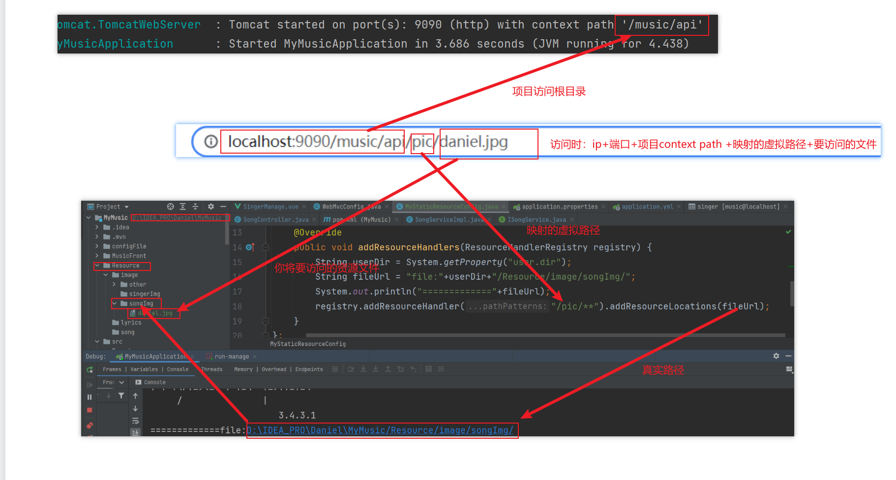

## 3、关于Axios发送POST请求时后端无法接收

`const Qs = require('qs')` 引入

qs 是一个增加了一些安全性的查询字符串解析和序列化字符串的库。

在项目中使用命令行工具输入：

```sh
npm install qs
```

安装完成后在需要用到的组件中：

```js
import Qs from 'qs’
```

这两种方法虽然都是序列化，但是还是有区别的。

```js
qs.parse(); //是将URL解析成对象的形式
qs.stringify(); //是将对象 序列化成URL的形式，以&进行拼接
```

http封装

```js
import axios from 'axios';
axios.defaults.timeout = 5000;  //超市时间是5秒
axios.defaults.withCredentials = true;  //允许跨域
//Content-Type 响应头
axios.defaults.headers.post['Content-Type'] = 'application/x-www-form-urlencoded;charset=UTF-8';
//基础url
axios.defaults.baseURL = "http://localhost:9090/music/api";
const Qs = require('qs') // 

//响应拦截器
axios.interceptors.response.use(
  response => {
    //如果reponse里面的status是200，说明访问到接口了，否则错误
    if(response.status == 200){
      return Promise.resolve(response);
    }else{
      return Promise.reject(response);
    }
  },
  error => {
    if(error.response.status){
      switch(error.response.status){
        case 401:       //未登录
          router.replace({
            path:'/',
            query:{
              redirect: router.currentRoute.fullPath
            }
          });
          break;
        case 404:   //没找到
          break;
      }
      return Promise.reject(error.response);
    }
  }
);

/**
 * 封装get方法
 */
export function get(url,params={}){
  return new Promise((resolve,reject) => {
    axios.get(url,{params:params})
      .then(response =>{
        resolve(response.data);
      })
      .catch(err =>{
        reject(err);
      })
  });
}

/**
 * 封装post方法
 */
export function post(url,data={}){
  return new Promise((resolve,reject) => {
    axios.post(url,Qs.stringify(data)) // 通过Qs进行转换
      .then(response =>{
        resolve(response.data);
      })
      .catch(err =>{
        reject(err);
      })
  });
}

```


# 二、数据库

## 阿里云RDS数据库

```properties
# mysql驱动类
driver-class-name: com.mysql.cj.jdbc.Driver
url: jdbc:mysql://rm-2ze5r466gf23tkopqqo.mysql.rds.aliyuncs.com:3306/spring_cloud?useUnicode=true&useJDBCCompliantTimezoneShift=true&useLegacyDatetimeCode=false&serverTimezone=UTC
username: daniel
password: Daniel2118
```


## 1、数据库表及其数据复制

### show create table 旧表;

这样会将旧表的创建命令列出。我们只需要将该命令拷贝出来，更改table的名字，就可以建立一个完全一样的表

```sql
show create table song;
```

执行后可查看song表的建表语句，复制其建表语句即可创建相同结果表，注意更改表名

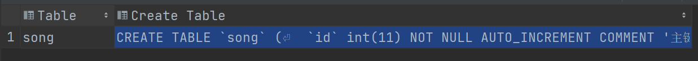

然后插入语句即可

```sql
insert into song_test select * from song; -- 注意表结构相同才能导入S
```

### 复制表结构及数据到新表

```sql
CREATE TABLE 新表 SELECT * FROM 旧表
```

这种方法会将oldtable中所有的内容都拷贝过来，当然我们可以用`delete from newtable;`来删除。

不过这种方法的一个最不好的地方就是新表中没有了旧表的`primary key、Extra（auto_increment）`等属性。需要自己用&quot;alter&quot;添加，而且容易搞错。

### 只复制表结构到新表

```sql
CREATE TABLE 新表 SELECT * FROM 旧表 WHERE 1=2
-- 或
CREATE TABLE 新表 LIKE 旧表
```

### 复制旧表的数据到新表(假设两个表结构一样)

```sql
INSERT INTO 新表 SELECT * FROM 旧表
```

### 复制旧表的数据到新表(假设两个表结构不一样)

```sql
INSERT INTO 新表(字段1,字段2,.......) SELECT 字段1,字段2,...... FROM 旧表
```

### 可以将表1结构复制到表2

```sql
SELECT * INTO 表2 FROM 表1 WHERE 1=2
```

### 可以将表1内容全部复制到表2

```sql
SELECT * INTO 表2 FROM 表1
```

### mysqldump

用mysqldump将表dump出来，改名字后再导回去或者直接在命令行中运行

### 复制旧数据库到新数据库（复制全部表结构并且复制全部表数据）

```sql
\#mysql -u root -ppassword
\>CREATE DATABASE new_db;
\#mysqldump old_db -u root -ppassword--skip-extended-insert --add-drop-table | mysql new_db -u root -ppassword
```


### 表不在同一数据库中（如，db1 table1, db2 table2)

```sql
sql: insert into db1.table1 select * from db2.table2 		   -- (完全复制)
insert into db1.table1 select distinct * from db2.table2        -- (不复制重复纪录）
insert into tdb1.able1 select top 5 * from  db2.table2          -- (前五条纪录)
```

## 2、数据库int类型

`int(11)`: 表示该字段的显示宽度，当插入的字段值在int`(-2147483648~2147483647[-2^31~2^31-1])`数据类型范围内，但位数不足11位时，会在该值左侧补充符号位`0` 

客户端-个人页面：添加歌曲列表大致框架

## 综合案例

### 将表字段部分内容更改，直接在原表更改

```sql
update song_test
set pic =
        (
            case substr(pic, 1, 23)
                when '/Resource/image/songImg' then concat('/test', substr(pic, 24))
                else pic
                end
            );
```


### 将song表中的pic字段的路径更改，通过复制表的方式更改

```sql
-- 查询song表结构
show create table song;
-- 复制其结构并改名为song_test
CREATE TABLE `song_test`
(
    `id`           int(11) NOT NULL AUTO_INCREMENT COMMENT '主键',
    `singer_id`    int(11)      DEFAULT NULL COMMENT '歌手id',
    `name`         varchar(255) DEFAULT NULL COMMENT '革命',
    `introduction` varchar(255) DEFAULT NULL COMMENT '简介',
    `create_time`  datetime     DEFAULT NULL COMMENT '创建时间',
    `update_time`  datetime     DEFAULT NULL COMMENT '更新时间',
    `pic`          varchar(255) DEFAULT NULL COMMENT '歌曲图片',
    `lyric`        text COMMENT '歌词',
    `url`          varchar(255) DEFAULT NULL COMMENT '歌曲地址',
    PRIMARY KEY (`id`)
) ENGINE = InnoDB
  AUTO_INCREMENT = 131
  DEFAULT CHARSET = utf8 COMMENT ='歌曲';
-- 复制表song数据到song_test中
-- 复制过程中对pic字段做处理，当pic字段中的值前1到12位为'/img/songPic' 时将其替换为'/Resource/image/songImg'
-- 例：pic原始值：/img/songPic/daniel.jpg 替换后：/Resource/image/songImg/daniel.jpg
insert into song_test
select id,
       singer_id,
       name,
       introduction,
       create_time,
       update_time,
       (
           CASE substr(pic,1,12)
            WHEN '/img/songPic' THEN concat('/Resource/image/songImg',substr(pic,13))
            ELSE pic
           END
           ),
       lyric,
       url
from song;
-- 清空song表
truncate table song;
-- 将song_test处理过的数据导入到song表
insert into song select * from song_test;
```

# 三、前端

## 1、前端创建vue2.0常用命令

### 安装vue-cli

```sh
npm install -g @vue/cli # 安装vue cli
vue -V # 检查是否安装
```

### 创建项目

```sh
vue cerate vue-cli-demo # vue-cli-demo为项目名
cd vue-cli-demo
```

详细步骤见：[vue项目结构化.md](../FrontEnd/VUE/vue项目结构化.md#三vue-cli)

### 导入echarts

```sh
npm install echarts --save
```

### 导入element-ui

```sh
npm i element-ui -S
```

```js
// 在main.js 中使用
import ElementUI from 'element-ui';//引入elementui
Vue.use(ElementUI);// 使用插件
```

### 导入axios

```sh
npm install axios -S
```


### 导入vue-router

```bash
npm install vue-router -S
```

如果在一个模块化工程中使用它，必须要通过 `Vue.use()` 明确地安装路由功能：

```js
import Vue from 'vue'
import VueRouter from 'vue-router'

Vue.use(VueRouter)
```

### 导入vuex

```sh
npm install vuex --save
```

在一个模块化的打包系统中，您必须显式地通过 `Vue.use()` 来安装 Vuex：

```js
import Vue from 'vue'
import Vuex from 'vuex'

Vue.use(Vuex)
```

Vuex 依赖 [Promise (opens new window)](https://developer.mozilla.org/zh-CN/docs/Web/JavaScript/Guide/Using_promises)。如果你支持的浏览器并没有实现 Promise (比如 IE)，那么你可以使用一个 polyfill 的库，例如 [es6-promise (opens new window)](https://github.com/stefanpenner/es6-promise)。

你可以通过 CDN 将其引入：

```html
<script src="https://cdn.jsdelivr.net/npm/es6-promise@4/dist/es6-promise.auto.js"></script>
```

然后 `window.Promise` 会自动可用。

如果你喜欢使用诸如 npm 或 Yarn 等包管理器，可以按照下列方式执行安装：

```bash
npm install es6-promise --save # npm
yarn add es6-promise # Yarn
```

或者更进一步，将下列代码添加到你使用 Vuex 之前的一个地方：

```js
import 'es6-promise/auto'
```

#### 新建store

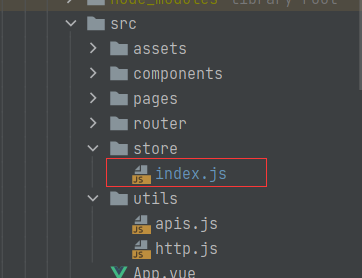

```js
import Vue from 'vue';
import Vuex from 'vuex';
Vue.use(Vuex)

const store = new Vuex.Store({
  state:{
    PIC_HOST: 'http://localhost:9090/music/api/pic', // 静态资源访问路径
    isPlay: false,          //是否播放中
    url: '',                //歌曲地址
    id: '',                  //歌曲id
    count: 0 // 计数
  },
  getters: {
    isPlay: state => state.isPlay,
    url: state => state.url,
    id: state => state.id,
    count: state => state.count
  },
  mutations: {
    setIsPlay: (state,isPlay) => {state.isPlay = isPlay},
    setUrl: (state,url) => {state.url = url},
    setId: (state,id) => {state.id = id},
    setCount: (state,count) => {state.count = count}
  }
})

export default store
```

或者更进一步，将下列代码添加到你使用 Vuex 之前的一个地方：

```js
import 'es6-promise/auto'
import store from '@/store/index.js'

new Vue({
  el: '#app',
  store,
  render: h => h(App)
})
```

现在，你可以通过 `store.state` 来获取状态对象，以及通过 `store.commit` 方法触发状态变更

通过`this.$store.state.count`在所有组件中使用

```js
methods: {
  increment() {
    this.$store.commit('setCount',40)
	console.log(this.$store.state.count)
  }
}
```

### 导入animate.css

```sh
npm install animate.css -S
```


## 2、vue2.0常用配置文件

### api公共配置类http.js

```js
import axios from 'axios';
axios.defaults.timeout = 5000;  //超市时间是5秒
axios.defaults.withCredentials = true;  //允许跨域
//Content-Type 响应头
axios.defaults.headers.post['Content-Type'] = 'application/x-www-form-urlencoded;charset=UTF-8';
//基础url
axios.defaults.baseURL = "http://localhost:9090/music/api";

//响应拦截器
axios.interceptors.response.use(
  response => {
    //如果reponse里面的status是200，说明访问到接口了，否则错误
    if(response.status == 200){
      return Promise.resolve(response);
    }else{
      return Promise.reject(response);
    }
  },
  error => {
    if(error.response.status){
      switch(error.response.status){
        case 401:       //未登录
          router.replace({
            path:'/',
            query:{
              redirect: router.currentRoute.fullPath
            }
          });
          break;
        case 404:   //没找到
          break;
      }
      return Promise.reject(error.response);
    }
  }
);

/**
 * 封装get方法
 */
export function get(url,params={}){
  return new Promise((resolve,reject) => {
    axios.get(url,{params:params})
      .then(response =>{
        resolve(response.data);
      })
      .catch(err =>{
        reject(err);
      })
  });
}

/**
 * 封装post方法
 */
export function post(url,data={}){
  return new Promise((resolve,reject) => {
    axios.post(url,data)
      .then(response =>{
        resolve(response.data);
      })
      .catch(err =>{
        reject(err);
      })
  });
}

```

### api.js

```js
import Axios from "axios";
import {get, post} from './http'
// =========================歌手列表数据======================================
//获取歌手列表
export const getSingerList = (params) => get('/singer/singerList', params)
//添加歌手
export const addSinger = (params) => post('/singer/addSinger', params)
```


### router/index.js

```js
import Vue from 'vue'
import Router from 'vue-router'

Vue.use(Router)

export default new Router({
  routes: [
    {
      path: '/',
      component: resolve => require(['../pages/Login.vue'], resolve)
    },
    {
      path: '/home',
      component: resolve => require(['../components/Home.vue'], resolve),
      children:[
        {
          path:'/main',
          component: resolve => require(['../pages/mainPage.vue'], resolve),
        },
        {
          path:'/Consumer',
          component: resolve => require(['../pages/ConsumerPage.vue'], resolve),
        },
        {
          path:'/Singer',
          component: resolve => require(['../pages/SingerPage.vue'], resolve),
        },
        {
          path:'/SongList',
          component: resolve => require(['../pages/SongListPage.vue'], resolve),
        },
        {
          name:'SingerManage',
          path:'/SingerManage/:singerId',
          props: true,
          component: resolve => require(['../pages/SingerManage.vue'], resolve),
        },
      ]
    }
  ]
})

```

### store/index.js

```js
import Vue from 'vue';
import Vuex from 'vuex';

Vue.use(Vuex)

const store = new Vuex.Store({
  state: {
    PIC_HOST: 'http://localhost:9090/music/api/pic', // 静态资源访问路径
    isPlay: false,          //是否播放中
    url: '',                //歌曲地址
    id: '',                 //歌曲id
    count: 0                // 计数
  },
  getters: {
    isPlay: state => state.isPlay,
    url: state => state.url,
    id: state => state.id,
    count: state => state.count
  },
  mutations: {
    setIsPlay: (state, isPlay) => {
      state.isPlay = isPlay
    },
    setUrl: (state, url) => {
      state.url = url
    },
    setId: (state, id) => {
      state.id = id
    },
    setCount: (state, count) => {
      state.count = count
    }
  }
})

export default store

```


### main.js

```js
import Vue from 'vue'
import App from './App'
import router from './router/index'
import ElementUI from 'element-ui'
import 'element-ui/lib/theme-chalk/index.css'
import './assets/css/main.css'
import 'babel-polyfill'
import 'es6-promise/auto'
import VCharts from 'v-charts'
import Axios from "axios";
import  '@/assets/js/aixin.js'
import ECharts from "echarts"
import store from '@/store/index.js'

Vue.use(ElementUI)
Vue.use(VCharts)
Vue.use(ECharts)
Vue.prototype.$http = Axios
Axios.defaults.baseURL="http://localhost:9090/music/api"
/* eslint-disable no-new */
new Vue({
  el: '#app',
  router,
  store,
  render: h => h(App)
})

```

## 3、前端存储全局变量

### Window localStorage 属性

使用 `localStorage `创建一个本地存储的 `name/value `对，`name="lastname" value="Smith"`, 然后检索 `"lastname"` 的值，并插入到 `id="result" `的元素上:

```js
// 存储 
localStorage.setItem("lastname", "Smith"); 
// 检索 
document.getElementById("result").innerHTML = localStorage.getItem("lastname");
```


### 定义和使用

`localStorage `和 `sessionStorage `属性允许在浏览器中存储 `key/value` 对的数据。

`localStorage `用于长久保存整个网站的数据，保存的数据没有过期时间，直到手动去删除。

`localStorage `属性是只读的。

提示: 如果你只想将数据保存在当前会话中，可以使用 `sessionStorage` 属性， 该数据对象临时保存同一窗口(或标签页)的数据，在关闭窗口或标签页之后将会删除这些数据。

## 4、Flex布局

当我们使用flex布局时，会利用其优秀的特性，完成页面架构的初步搭建，而flex使用时也应该注意一些常见的问题

### 主轴方向的设置

```less
.box{
    display: flex;
	flex-direction: column;
}
```

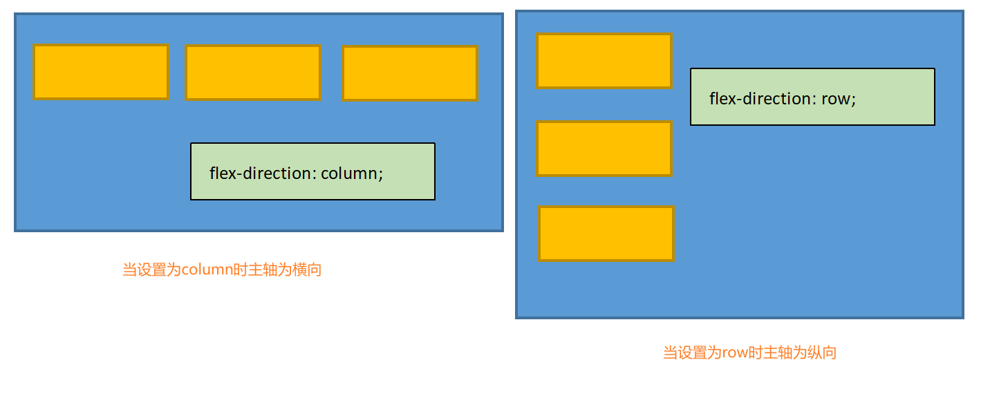

### 固定主轴方向后子元素的居中方式

**通过设置父元素justify-content属性**

该属性定义了项目在主轴上的对齐方式

```less
.box{
    justify-content:flex-start|flex-end|center|space-between|space-around;
}
// flex-start（默认值）：左对齐
// flex-end：右对齐
// center： 居中
// space-between：两端对齐，项目之间的间隔都相等。
// space-around：每个项目两侧的间隔相等。所以，项目之间的间隔比项目与边框的间隔大一倍。
```

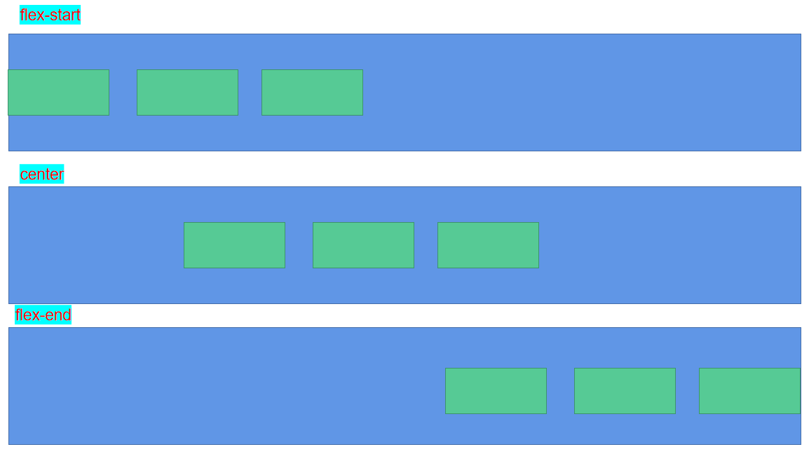

示例

```less
.box{
    display: flex;
	flex-direction: column;
   	justify-content: center;
    .box-item{
        
    }
}
```

**通过设置父元素align-items属性**

`align-items`属性定义项目在交叉轴上如何对齐。

```less
.box{
    align-items:flex-start|flex-end|center|baseline|stretch;
}
// flex-start：交叉轴的起点对齐。
// flex-end：交叉轴的终点对齐。
// center：交叉轴的中点对齐。
// baseline: 项目的第一行文字的基线对齐。
// stretch（默认值）：如果项目未设置高度或设为auto，将占满整个容器的高度。
```

如`justify-content`属性类似，只不过`justify-content`属性设置主轴方向上的对齐方式，而`align-items`是设置其非主轴方向的对齐方式，例如：主轴为x轴方向且居中方式为（`justify-content:center`）那么所有子元素在x轴的居中位置，此时设置`align-items:center;`则子元素既保持x居中也可保持y轴居中。

## 5、CSS中使用外部字体

当我们需要的字体需要外部文件导入时可以使用css导入

```css
@font-face
{
font-family: myFirstFont;
src: url('aa.ttf'),
     url('aa.eot'); /* IE9+,可以是具体的实际链接 */
}
```

## 6、vue报CSS解析出错

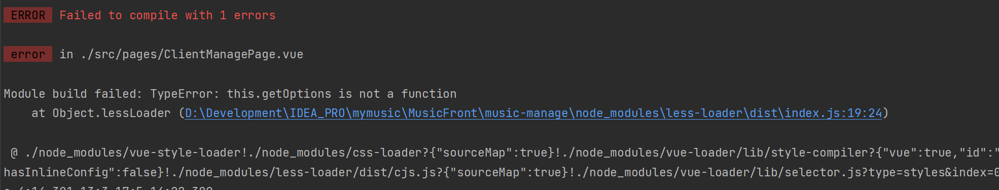

在build文件夹下添加配置loader加载依赖，让其支持外部的less,在原来的代码上添加

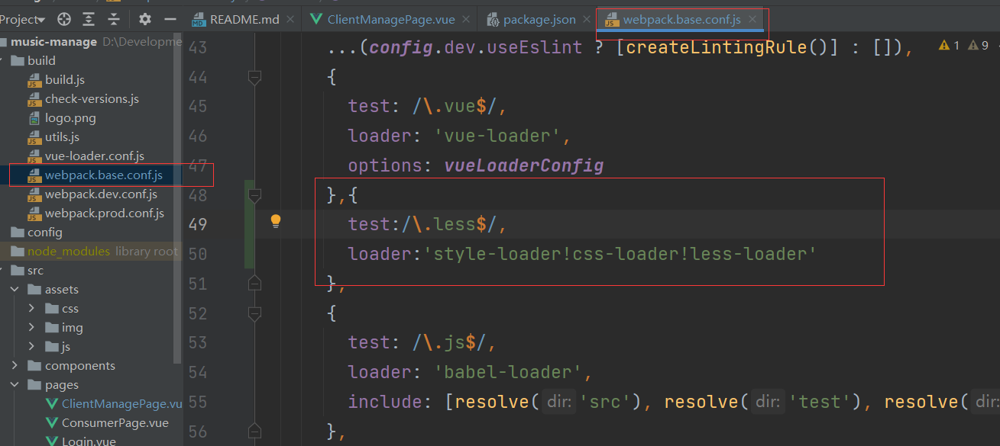

```json
{
    test:/\.less$/,
    loader:'style-loader!css-loader!less-loader'
},
```

如果运行还有问题，记得查看**packjosn.js中‘less-loader’版本**，如果过高，比如我一开始是版本8，

执行

```sh
npm uninstall less-loader
```

卸载‘less-loader’并重新安装

```sh
npm install less-loader@5.0.0
```

也可能是版本原因卸载原有的

```sh
npm uninstall --save sass-loader
npm uninstall --save less-loader
npm uninstall --save less
```

然后严格控制版本下载依赖，

```sh
npm install less-loader@4.1.0 --save-dev
npm install less@3.9.0 --save-dev
```


## 7、滚动条样式

当需要使用滚动条时，我们需要设置滚动条显示的方向

```less
.music-left {
        height: 100%;
        width: 240px;
        overflow: hidden; // 当鼠标移出时超出隐藏
    }
    .music-left:hover{
        overflow-y: scroll;// 表示当鼠标划入时显示滚动条
    }
}
```

需要在使用的地方修改滚动条样式

```css
::-webkit-scrollbar {/*滚动条整体样式*/
    width: 10px;     /*高宽分别对应横竖滚动条的尺寸*/
    height: 1px;
}

::-webkit-scrollbar-thumb {/*滚动条里面小方块*/
    border-radius: 10px;
    -webkit-box-shadow: inset 0 0 5px rgba(0,0,0,0.2);
    background: rgba(#757B79,0.6);
}

::-webkit-scrollbar-track {/*滚动条里面轨道*/
    border-radius: 10px;
    opacity:100%;
}
```

## 8、vue点击事件传入event

绑定事件元素

```html
<div v-for="item in mySongList" :key="item.id" @dblclick="dblclickPlyImg($event)">
    {{item.name}} <span class="" style="width: 12px;height: 10px"></span>
</div>
```

触发函数

```js
dblclickPlyImg(event){
    	// 当前点击的元素
        event.target;
        // 绑定事件的元素
        event.currentTarget;
        // （target与currentTarget的区别主要体现在使用事件委托时，发生事件委托时，
        // 点击的元素与绑定事件的元素非同一元素，反之不发生事件委托时，两者相同，是同一元素）

        // 获得绑定事件元素的前一个节点信息（包含元素节点、属性节点、文本节点、注释节点）
        event.currentTarget.previousSibling;
        // 获得绑定事件元素的前一个元素节点（只包含元素节点，只有html内容）
        event.currentTarget.previousElementSibling;
        // 下一个元素信息获取使用 nextSibling、nextElementSibling

        // 获得绑定事件元素的父节点信息
        event.currentTarget.parentNode;
        // 获得绑定事件元素的父级元素
        event.currentTarget.parentElement;

        // 获得绑定事件元素的第一个子节点信息
        event.currentTarget.firstChild;
        // 获得绑定事件元素的第一个子元素
        event.currentTarget.firstElementChild;

        // 获得绑定事件元素中id为ceshi的元素集合
        event.currentTarget.getElementById("ceshi");
        // 获得绑定事件元素中class为ceshi的元素集合
        event.currentTarget.getElementsByClassName("ceshi");

        // 获得绑定事件元素的的内容（类似jquery的text()）
        event.currentTarget.textContent;
        // 获得绑定事件元素的的内容（类似jquery的html()）
        event.currentTarget.innerHTML;
        // 获得绑定事件元素的ceshi属性值（类似jquery的attr('ceshi')）
        event.currentTarget.getAttribute("ceshi");

        // 删除class属性某个值（类似jquery的removeClass）
        event.currentTarget.parentNode.getElementsByClassName('active')[0].classList.remove("active")
        // 向class属性中添加值（类似jquery的addClass）
        event.currentTarget.classList.add("active")

        // 点击删除当前元素
        event.currentTarget.parentElement.removeChild(event.currentTarget);
        // 点击删除当前元素的父级元素
        event.currentTarget.parentElement.parentElement.removeChild(event.currentTarget.parentElement);
    
}
```

## 9、关于event的css

```js
clickBar(e){
    this.progressNum = e.offsetX/this.$refs.myProgressBar.offsetWidth
    this.$refs.barStrip.style.width=e.offsetX+'px' 
    this.$refs.barDots.style.left=e.offsetX-4+'px'
    console.log(this.progressNum);
},
```

`e.offsetX`: 表示当前点击元素从右上角距离点击位置的X轴坐标

`this.$refs.myProgressBar.offsetWidth`: 表示当前`myProgressBar`元素的`width` 值

## 10、css禁止复制网页文字

```css
* {
    margin: 0;
    padding: 0;
    -webkit-user-select: none;
    -moz-user-select: none;
    user-select: none;
}
```

## 11、Css编写进度条

html结构

```html
<div class="volume-bar-box" ref="myVolProgressBar" @click="clickVolumeBar">
    <div class="volume-strip" ref="volBarStrip">
        <div class="volume-dots" ref="volBarDots"></div>
    </div>
</div>
```

css结构（less文件）

```less
.volume-bar-box {
    margin-right: 5px; 
    width: 120px;   // 定义父box宽度决定其进度条最大长度
    height: 4px;
    border-radius: 2px;
    background: rgba(234, 234, 234, 0.3);
    position: relative;
    .volume-strip{
        position: absolute;
        height: 4px;
        border-radius: 2px;
        width: 100px;
        background: #CADA8D;
    }
    .volume-dots{
        position: absolute;
        top: -2px;
        z-index: -1;
        left: 96px;
        height: 8px;
        width: 8px;
        border-radius: 4px;
        background-color: #CADA8D;
    }

}
```

js结构

```js
clickVolumeBar(e){
    this.volProgressNum = e.offsetX / this.$refs.myVolProgressBar.offsetWidth
    this.$refs.volBarStrip.style.width = e.offsetX + 'px'
    this.$refs.volBarDots.style.left = e.offsetX - 4 + 'px'
    console.log('音乐音量比例：'+this.volProgressNum);
},
```

## 12、关于在vue中使用精灵图缩放

```css
transform:scale(0.5)
```


# 四、ElementUI框架

## 1、表格

### ElementUI表格字段过滤

```html
<el-table-column
                 prop="sex"
                 label="性别"
                 width="50"
                 :formatter="formatSex">
</el-table-column>

```

添加过滤器方法

```js
formatSex(row, column) {
    return row.sex === 1 ? '男' : row.sex === 0 ? '女' : '未知'
}
```

## 2、折叠面板

```html
<el-collapse v-model="activeNames" @change="handleChange">
    <el-collapse-item title="一致性 Consistency" name="1">
        <div>
            与现实生活一致：与现实生活的流程、逻辑保持一致，遵循用户习惯的语言和概念；
        </div>
        <div>
            在界面中一致：所有的元素和结构需保持一致，比如：设计样式、图标和文本、元素的位置等。
        </div>
    </el-collapse-item>
</el-collapse>
```

# 六、项目热部署

### 导入依赖

```xml
<!--devtools热部署-->
<dependency>
    <groupId>org.springframework.boot</groupId>
    <artifactId>spring-boot-devtools</artifactId>
    <optional>true</optional>
    <scope>true</scope>
</dependency>
```

### 配置文件

```yml
spring:
  devtools:
    restart:
      enabled: true  #设置开启热部署
      additional-paths: src/main/java #重启目录
      exclude: WEB-INF/**
  freemarker:
    cache: false    #页面不加载缓存，修改即时生效
```

设置IDEA自动编译

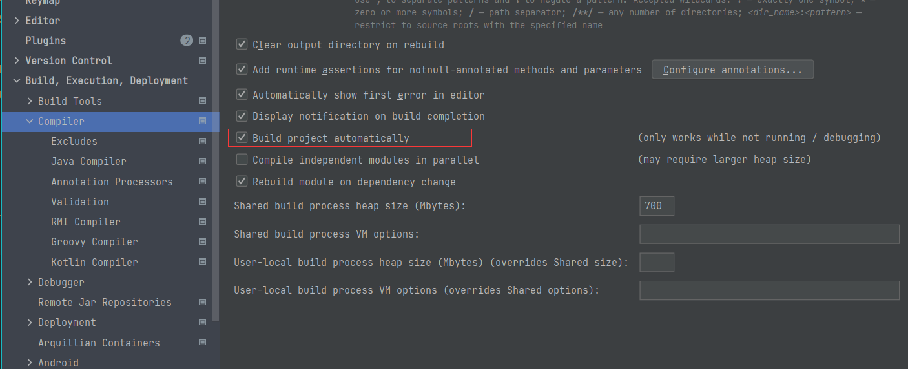

按住``Ctrl+shift+Alt+/`` 进入Registry，勾选`compiler.automake.allow.when.app.running`

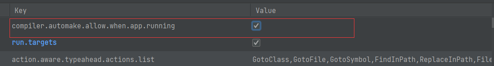


# 七、关于IDEA的配置问题

## 1、关于IDEA中Services启动后不显示端口

正常情况如下：

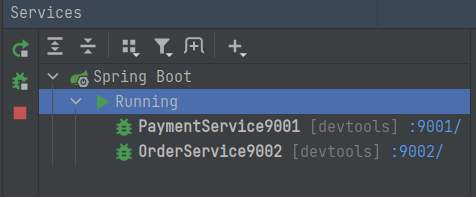

解决办法：

1、打开文件管理器或是windwos键 + E 打开文件管理器

2、打开路径C:\Users\l用户名\AppData\Local\Temp (用户名请替换你电脑的用户名) 或者 地址栏输入==%TEMP%==回车就能进入目录了

3、AppData文件夹默认是看不见的, Windwos资源管理器默认是隐藏了受保护的操作系统文件

​		如果想显示这个文件夹: 打开资源管理器选择 查看->选项->查看->文件和文件夹->隐藏受保护的操作系统文件(推荐)
不建议取消这个, 直接输入上边的路径是可以进去的.

4、清空缓存之前需要关闭IDEA软件

​		这个目录存放的是电脑的临时文件, 我是一下都清空了Temp下的所有文件, 会有提示软件正在占用, 只要不是IDEA的, 跳过就行了.

5、清空后打开IDEA, 启动程序后, 端口号就会出现了.

## 2、关于IDEA下载源码报错问题

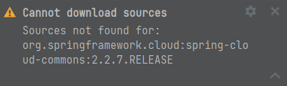

在当前所查看的项目下打开cmd执行以下语句，注意配置mvn命令

```shell
mvn dependency:resolve -Dclassifier=sources
```

